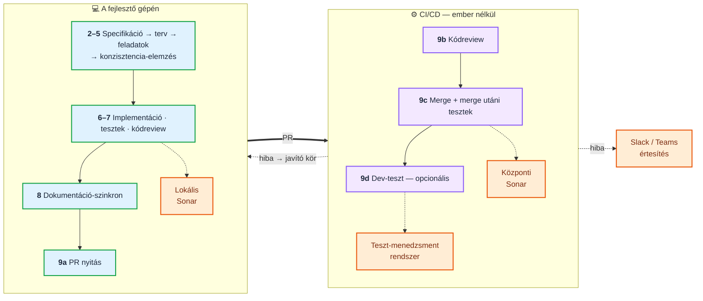
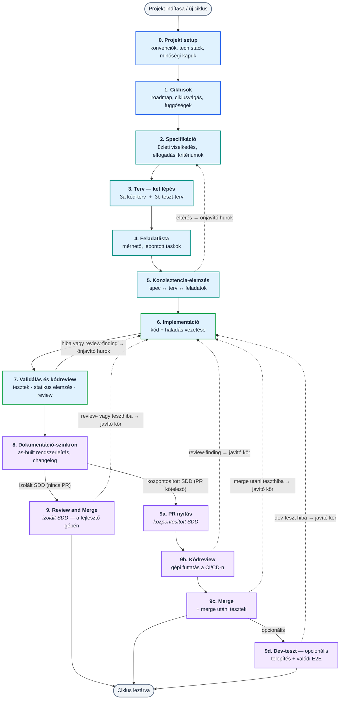
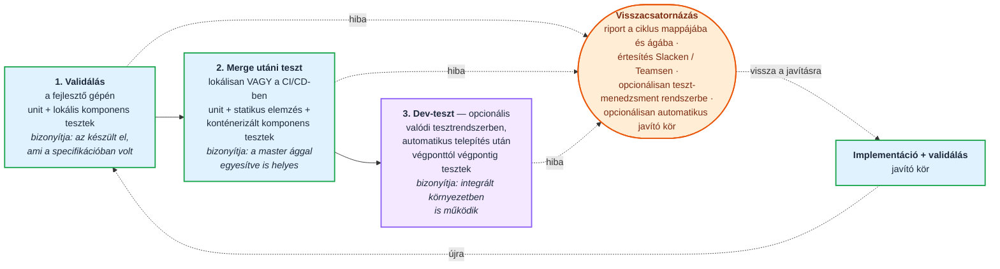

```text
    ╔══════════════════════════════════════════════════════════════════════╗
    ║                                                                      ║
    ║   ██████╗ ███████╗██████╗ ██╗  ██╗██╗███████╗██████╗ ███████╗ ██████╗║
    ║   ██╔══██╗██╔════╝██╔══██╗██║ ██╔╝██║██╔════╝██╔══██╗██╔════╝██╔════╝║
    ║   ██████╔╝█████╗  ██████╔╝█████╔╝ ██║███████╗██████╔╝█████╗  ██║     ║
    ║   ██╔══██╗██╔══╝  ██╔══██╗██╔═██╗ ██║╚════██║██╔═══╝ ██╔══╝  ██║     ║
    ║   ██████╔╝███████╗██║  ██║██║  ██╗██║███████║██║     ███████╗╚██████╗║
    ║   ╚═════╝ ╚══════╝╚═╝  ╚═╝╚═╝  ╚═╝╚═╝╚══════╝╚═╝     ╚══════╝ ╚═════╝║
    ║                                                                      ║
    ╚══════════════════════════════════════════════════════════════════════╝
```

**ENG version → [README.md](README.md)**

# Berki-spec

**Berki-spec** egy **spec-driven development (SDD)** keretrendszer AI-ágensekkel való szoftverfejlesztéshez. A munkát önállóan tesztelhető **ciklusokra** bontja, és minden ciklust ugyanazon a fegyelmezett úton vezet végig — a követelmény rögzítésétől (`spec`) a technikai terven (`plan`) és a feladatlistán (`tasks`) át az implementációig, a validálásig és a merge-ig.

**A specifikáció a forrás, nem a melléktermék.** Nem a kód mellé íródik utólag egy dokumentum, hanem fordítva: az üzleti viselkedés leírása az, amiből a terv, a feladatlista, a teszt és végül a kód levezetődik — és amihez minden lépés visszamérhető. A folyamat két építőelemből áll: **skillek** (fázis-receptek, amelyeket a fő ágens futtat) és **ágensek** (dedikált, `Task tool` subagentként hívott specialisták).

**Egy ciklus a végén production-ready egységet hagy maga után** — nem prototípust. Megírt és lefuttatott teszteket, statikus elemzést, kódreview-t, naprakész rendszerdokumentációt és a fő ágba visszaintegrált kódot, mindezt commitolt bizonyítékkal. A folyamat nem attól ér véget, hogy az ágens késznek mondja magát, hanem attól, hogy a **determinisztikus kapuk** zöldek.

> **Státusz: alpha — még nincs stabil kiadás.** A prompt-kontraktusokat körönként keményítjük, ezért egy frissítés **töréses változást** hozhat egy már telepített projektben (átnevezett artefaktum vagy ciklusmappa, új kötelező kapu). Ha rögzített állapot kell, tagelt verzióról telepíts, vagy rögzíts egy commitot ahelyett, hogy a `main`-t követnéd.

## 1. Telepítés — quickstart

```bash
git clone <a-berkispec-repó-url-je>
cd berkispec
./install.sh          # Windowson: .\install.ps1
```

A telepítő interaktívan bekéri a célprojekt mappáját, a platformot és a **két nyelvet** (prompt-nyelv és projekt-nyelv), majd a választott platform konfigurációs mappájába linkeli a skilleket és az ágenseket. Flagekkel automatizálható is: `./install.sh --platform claude --prompt-lang en --project-lang hu --path ~/projekt`.

**Támogatott platformok:** Google Antigravity CLI · Claude Code · Cursor (Agent CLI) · GitHub Copilot (CLI & IDE) · Codex CLI.

**A két nyelvi tengely** — egymástól függetlenül állítható, és nem kell egyezniük:

| Beállítás | Mit határoz meg | Alapértelmezés |
|---|---|---|
| **Prompt nyelve** | Milyen nyelven vannak az instrukciók, amiket az **ágens olvas**. A te dokumentumaidat nem érinti. | **English** |
| **Projekt nyelve** | Milyen nyelven **ír az ágens**: `spec.md`, `plan.md`, riportok, `docs-generated/` — és amit neked válaszol. | **Magyar** |

> A teljes telepítési leírás — a lépések, az öt platform mappaszerkezete, a nem interaktív mód flag-táblája, a nyelvi átszivárgás elleni védelem és a frissítés kérdései: **[Installáció](docs/hu/installation.md)**.

## 2. Alapvető parancsok

A telepítés után a platform chat felületén a `/` karakter leütésével érheted el a skilleket (GitHub Copilotban `@` szimbólummal). Kezdéshez: `/bs-init-project`.

| parancs | mit csinál |
|---|---|
| `/bs-init-project` | A projekt legelső inicializálása — létrehozza a `conventions.md` fájlt. |
| `/bs-add-cycles` | Új fejlesztési ciklus felvétele az ütemtervbe (`roadmap.md`). |
| `/bs-write-spec` | A követelmények rögzítése, a ciklus specifikációja (`spec.md`). |
| `/bs-write-code-plan` | A technikai terv **kód-oldala**: koordináták, tervezett módosítások, konfiguráció, séma. |
| `/bs-write-test-plan` | Ugyanannak a tervnek a **teszt-fele**: forgatókönyvek, gépi futtatási tábla, tesztfájl-adatlapok. |
| `/bs-write-tasks` | A terv lebontása mérhető feladatokra (`tasks.md`). |
| `/bs-analyze` | Kereszt-fázisos konzisztencia-ellenőrzés és automatikus javítás (spec ↔ terv ↔ feladatok). |
| `/bs-implement` | A tényleges kódfejlesztés a feladatlista alapján, a haladás vezetésével. |
| `/bs-validate` | Tesztek, lint, build **és kódreview** egyetlen automatikus javító hurokban. |
| `/bs-doc-sync` | Az élő dokumentáció (`docs-generated/`) és a teszt-konvenciók szinkronizálása a kóddal. |
| `/bs-review-and-merge` | A ciklus lezárása **egy lépésben**, ha nincs PR feladás: merge utáni teszt-kör → beolvasztás. |
| `/bs-create-pr` → `/bs-review` → `/bs-merge` | Ugyanez **három lépésben**, ha van PR feladás — központosított SDD-ben gépi futtatással. |
| `/bs-dev-test` | *(opcionális)* Telepítés integrált teszt-környezetbe, és valódi e2e tesztek. |
| `/bs-brainstorm` | Feltáró ötletelés **a spec előtt**, perzisztens munkafájllal; a végén átad a flow-nak. |
| `/bs-quick-flow` | Az egyszerűsített flow elindítása kis feladatokhoz (spec → task → implementáció). |
| `/bs-cycle-status` | A ciklusok státuszának ellenőrzése (interaktív TUI vagy parancssori kiírás). |
| `/bs-manual-test-plan` | A ciklus **kézi teszttervének** összeállítása: indítás, tesztadatok, hívási szekvenciák. |
| `/bs-run-tests` | **Teszt-futtatás cikluson kívül**, kategóriánként; az eredménye soha nem ciklus-bizonyíték. |
| `/bs-export-doc` | Verziózott PDF export a markdown doksikból, a mermaid ábrákkal együtt. |

## 3. Amiben más

A legtöbb SDD sablon egyetlen, merev „spec → terv → kód" fonalat ad. A Berki-spec nyolc ponton megy tovább — és a különbség nem a fázisokban van, hanem abban, **mi történik, amikor a valóság eltér a tervtől**.

### 3.1 Multi-ágens architektúra — aki diagnosztizál, az nem javít

Nem egyetlen ágens dolgozik, hanem egy **specializált csapat**: *diagnoszták* (csak olvasnak — kódreview, konzisztencia-elemzés, kódbázis-feltárás, doksi-tervezés), *végrehajtók* (tesztek és statikus elemzés futtatása, tényszerű összegzéssel) és *javítók* (a **konkrét, listázott** hibák célzott javítása, nem szabad felfedezés).

A lényeg a szereposztásban van: **aki diagnosztizál, az nem javít, és aki javít, az nem dönti el, hogy kész van-e.** A PASS/FAIL verdikt determinisztikus scriptektől jön, nem a modelltől. Így az „ez szerintem jó lesz" nem tud átcsúszni a fázishatáron.

### 3.2 Kétnyelvű — két független tengely

A *prompt nyelve* (milyen nyelven kapja az utasítást az ágens) és a *projekt nyelve* (milyen nyelven készülnek a leadandó dokumentumok) **szabadon kombinálható**, mind a négy párosítás érvényes. Magyar csapatnál a leggyakoribb az **angol prompt + magyar dokumentáció**: az angol prompt tokenben olcsóbb, és a gyengébb modellek pontosabban követik, a leadandó anyag viszont magyar marad.

Mindkét beállítás telepítéskor dől el, és **bedrótozódik** a telepített promptokba — a projektbe semmilyen nyelvi mező nem kerül. Részletek: [Installáció](docs/hu/installation.md).

### 3.3 Olcsó, gyengébb modellekre optimalizálva

Feladatarányos modellválasztás **két tengelyen**: melyik modell, és mennyi gondolkodási erőforrás (effort). A legdrágább szintet **egyetlen** pont kapja — a konzisztencia-elemzés diagnózisa —, a pontos hibalistát javító fixerek és a mechanikus futtatók alacsony efforton dolgoznak, mert nekik nem kell felfedezniük a problémát.

A gyenge modelleket determinisztikus védőhálók tartják a sínen: szűkített belépők, kötelező ellenőrzőlisták, „egyszerre egy kérdés". A kontextus-takarékosság ugyanennek a másik fele: a feltárást és a teszt-futtatást olcsó, párhuzamos segéd-ágensek végzik, és csak összegzést adnak vissza — a nyers teszt-log és a `git diff` nem kerül a modell kontextusába. **Ami gépiesen eldönthető, azt script dönti el.** A teljes leosztás: [Modell- és effort-választás](docs/hu/model-selection.md).

### 3.4 Teljes SDLC — két üzemmód, egyetlen határvonallal

*Izolált SDD*: minden a fejlesztő gépén fut, a review-t és a visszaintegrálást is beleértve. *Központosított SDD*: a PR feladása indítja a CI/CD-t, és a **kódreview, a merge és a merge utáni tesztelés távoli gépen, gépi futtatásban** zajlik. A határvonal **egyetlen ponton** van: a PR feladásánál — előtte minden lépés azonos.



> **A CI-ág platform-korlátja:** az Antigravity CLI-nek **nincs headless módja** (mérve 1.107.0-val), ezért a központosított út CI-ágán a `command` futtatási ágat kell választani. Lokális, interaktív munkára az Antigravity teljes értékű. Részletek: [Ágens-specifikus integráció](docs/hu/platform-integration.md).

### 3.5 Test-first — a tesztterv a kód előtt

A tervezési fázis két lépésre bomlik: előbb a kód-terv, **majd ugyanannak a tervnek a teszt-fele** — konkrét elvárt eredménnyel és gépi futtatási táblával, **még az implementáció előtt**.

Három következménye van. Az elfogadási kritérium és a teszt **összekötve él**, gépi kapuval, mindkét irányban. **A kód a szerződéshez igazodik, nem fordítva**: a javító hurok nem lazíthatja meg a tesztet, hogy zöld legyen — ezt determinisztikus ellenőrzés védi, és ha valami csak a szerződés módosításával lenne megoldható, a folyamat **felfelé eszkalál**, ember elé. És a **látszat-zöld ki van zárva**: a „nulla lefutott teszt" FAIL, a *skipped* nem bizonyíték, az üres teszt-törzset külön ellenőrzés keresi.

### 3.6 Folyamatos dokumentáció- és teszt-karbantartás

Nem záró feladat, hanem **külön fázis minden ciklusban**: élő, „as-built" rendszerdokumentáció objektív konzisztencia-kapuval, élő teszt-regiszter (hogyan indul a stack, milyen hívás, milyen teszt-felhasználó) és teljes teszt-leltár, amit gépi kapu vet össze a repóban ténylegesen meglévő tesztfájlokkal.

A dokumentáció külön nyilvántartja a megvalósult rendszer **eltéréseit a tervezési szándéktól** (design-drift), tehát nem avul el csendben. **Egy év múlva is meg lehet mondani, mit csinál a rendszer, és mi bizonyítja, hogy működik.** Részletek: [docs-generated/ — élő dokumentáció](docs/hu/living-docs.md).

### 3.7 Determinisztikus gépezet — a verdikt scriptektől jön

A keret a promptok mellé **scripteket** telepít, és a fázishatárokon ezek mondják ki a PASS/FAIL-t: minőségi kapuk (kereszt-fázisos konzisztencia, elfogadási kritérium ↔ bizonyíték, riport-artefaktumok, doksi-konzisztencia, teszt-leltár), futtatás és kiértékelés (tesztek a terv gépi táblájából, Sonar az API-ból, kör-napló és bukás-számlálók), védelmek (a tesztelt szerződés módosításának kiszűrése, tartalom nélküli tesztek) és segédeszközök (ciklus-státusz, cikluson kívüli futtatás, PDF-export, worktree).

A célprojektbe **21 fájl települ** (20 önálló script + egy közös modul); a repó további scriptjei karbantartó eszközök, amelyek nem kerülnek ki. Ezek együtt adják azt, hogy a folyamat nem a modell önértékelésén áll.

### 3.8 Illeszkedés a csapat eszközeihez

Interaktív telepítő **öt platformra**, projekt-szintű testreszabással: a keret a projekt konvencióihoz igazodik, nem fordítva. A záró fázisok CI/CD-be illeszthetők egységes, platformfüggetlen belépőn, **a verdiktet a determinisztikus kapuktól** véve.

Értesítés **Slacken, Teamsen vagy saját parancson** — csak bukásnál és emberi döntésnél, sosem sikeres futásról; a titok környezeti változóban, soha nem parancssori paraméterként. A **teszt-menedzsment rendszer** opcionális és alapból kikapcsolt, mert a külső szolgáltatás soha nem válhat a ciklus futásának előfeltételévé — a hivatalos bizonyíték továbbra is a verziókezelőbe commitolt riport. (A `testdino` és a `command` ág kipróbált; a `reportportal` és a `qase` adapter **fejlesztés alatt** áll.)

## 4. A folyamat



| fázis | mi történik | mi marad utána |
|---|---|---|
| **0. Projekt setup** *(egyszer fut)* | A fejlesztővel közösen rögzítjük a projekt konvencióit: tech stack, tesztstruktúra, riport-elvárások, git- és merge-stratégia, minőségi küszöbök. | `conventions.md` |
| **1. Ciklusok** | A követelményt önállóan leszállítható ciklusokra bontjuk, függőségekkel és elfogadási kritériumokkal. | `roadmap.md` |
| **2. Specifikáció** | **Csak az üzleti viselkedés** — mit csináljon a rendszer, és mikor mondjuk késznek. Implementációt nem tervez. | `spec.md` |
| **3a. Kód-terv** | A technikai megvalósítás terve: érintett komponensek, tervezett módosítások, konfiguráció, adatséma. | `plan.md` kód-fele |
| **3b. Teszt-terv** | Ugyanannak a tervnek a teszt-fele: tesztforgatókönyvek, gépi futtatási tábla, környezet-felkészítés, specifikáció-lefedettség. | `plan.md` teszt-fele |
| **4. Feladatlista** | A terv lebontása mérhető feladatokra. Újat nem tesz hozzá. | `tasks.md` |
| **5. Konzisztencia-elemzés** | Kereszt-ellenőrzés: a specifikáció, a terv és a feladatok **ugyanarról szólnak-e**. Eltérésnél önjavító hurok indul. | elemzési riport + javítási lista |
| **6. Implementáció** | A kód megírása a terv és a feladatlista alapján, a haladás vezetésével. | kód + kipipált feladatlista |
| **7. Validálás és kódreview** | Gyors tesztek → statikus elemzés (Sonar + AI kódreview) → nehéz tesztek és regresszió → elfogadási kritériumok ellenőrzése. Hibánál önjavító hurok, rögzített leállási korlátokkal. | validációs riport + kódreview |
| **8. Dokumentáció-szinkron** | Az élő rendszerdokumentáció naprakészen tartása a ténylegesen megvalósult kódhoz: működésleírás, architektúra, changelog, komponens-leírások. | `docs-generated/` |
| **9. Review and Merge** | A visszaintegrálás. Izolált módban a fejlesztő gépén, egy lépésben; központosított módban PR-nyitás (9a) → gépi kódreview (9b) → merge (9c), a CI/CD-ben. | beolvasztott ág / PR + lezárt roadmap |
| **9d. Dev-teszt** *(opcionális)* | Automatikus telepítés integrált tesztkörnyezetbe, és valódi végponttól végpontig tesztek. | teszt-bizonyíték a ciklus mappájában |

A fázisok részletes leírása: [Teljes berki spec flow](docs/hu/full-flow.md) · [Az önjavító hurkok](docs/hu/self-healing-loops.md) · [A részletes folyamatábra](docs/hu/process-diagram.md).

## 5. Hol tesztelünk

A folyamat **három ponton** ellenőriz, és mindhárom **mást bizonyít** — ezért nem helyettesíti egyik a másikat.



**A validálás** a fejlesztő gépén fut, a saját ágon: unit és lokális komponens tesztek, statikus elemzés és kódreview. Azt bizonyítja, hogy **az készült el, ami a specifikációban volt** — az elfogadási kritériumokhoz mérve, nem általánosságban.

**A merge utáni teszt** a fő ágra juttatás **előtti** kapu, mindkét úton: behozzuk a fő ágat a ciklus ágába, és a teszteket a *közös* állapoton futtatjuk. Azt bizonyítja, hogy a munka **a fő ággal egyesítve is helyes** — ez az a hibaosztály, amit az izolált ágon futó zöld teszt sosem lát.

**A dev-teszt** opcionális, és csak a központosított úton: automatikus telepítés után valódi, végponttól végpontig futó tesztek egy integrált környezetben. Azt bizonyítja, hogy a rendszer **a valódi függőségeivel együtt is működik**. Mindhárom kör eredménye riportként a ciklus mappájába kerül, és bukásnál értesítést küld.

## 6. Két fejlesztési út

A feladat súlya dönti el, melyik út illik hozzá. A **teljes flow** (00–09) a nagyobb, összetettebb fejlesztéseké, külön `spec.md` → `plan.md` → `tasks.md` dokumentumokkal és minőségi kapukkal; az **egyszerűsített flow** a 3-4 lépésben megoldható feladatoké, egyetlen `spec-plan.md` → `tasks.md` → implementáció recepttel.

| Jellemző | Egyszerűsített flow | Teljes berki spec flow |
|---|---|---|
| Tipikus feladat | konfiguráció, egyszerű script, kisebb javítás | új funkció, több komponens, összetett logika |
| Méret | 3-4 lépésben megoldható | önálló, vertikálisan vágható ciklus(ok) |
| Dokumentumok | `spec-plan.md` + `tasks.md` (mindkettő státusz-mezővel) | `spec.md` + `plan.md` + `tasks.md` |
| Minőségi kapuk | inline + opcionális ágensek | `analyze` / `validate` / `doc-sync` / `review` hurkok |
| Belépő | `/bs-quick-flow` | `/bs-init-project` / `/bs-add-cycles` |

A két út **menet közben átjárható**: ha az egyszerűsített flow közben kiderül, hogy a feladat túlnő rajta, a skill megállítja a munkát és átirányít a teljes folyamatra — és fordítva is. Mindkettő előtt ott a közös előszoba, a `/bs-brainstorm`, amikor még nem a méret a kérdés, hanem az, hogy **mit és hogyan** akarunk egyáltalán. Részletek: [Két fejlesztési út](docs/hu/routes.md) · [Egyszerűsített flow](docs/hu/lightweight-flow.md).

## 7. Mit jelent ez a gyakorlatban

- **Kiszámítható minőség.** Minden fázis lezárása gépi kapuhoz kötött; az AI nem tudja magát késznek nyilvánítani.
- **Auditálható nyom.** A követelménytől a tesztbizonyítékig minden lépés commitolt dokumentumban él — utólag megválaszolható, miért született egy döntés, és mi bizonyítja, hogy működik.
- **Megszakítható munka.** Az állapot a lemezen van, nem egy beszélgetés memóriájában: egy `/clear`, egy összeomlás vagy egy napokkal későbbi visszatérés után a folyamat onnan folytatódik, ahol abbamaradt.
- **Kontrollált költség.** A drága modellt csak ott használjuk, ahol tényleg kell — a munka nagyobbik fele olcsó modellen, alacsony efforton fut.
- **Illeszkedik a meglévő folyamatokhoz.** PR-alapú review, védett fő ág, CI/CD, Sonar, integrált tesztkörnyezet, Slack/Teams értesítés, teszt-menedzsment — a keret **ezekbe illeszkedik be, nem helyettük jön**.

## 8. Dokumentáció

A részletes leírás témánként egy-egy oldalon él a [`docs/hu/`](docs/hu/README.md) fában (angolul: [`docs/en/`](docs/en/README.md), ugyanazokkal a fájlnevekkel).

| oldal | mire válaszol |
|---|---|
| [Két fejlesztési út](docs/hu/routes.md) | Melyik út illik a feladathoz — a döntési tábla, és a `/bs-brainstorm` előszoba mindkettő előtt. |
| [Installáció](docs/hu/installation.md) | A teljes telepítés: a lépések, az öt támogatott platform, a két nyelvi tengely, és hogy mi kerül a projektbe. |
| [Quick start](docs/hu/quick-start.md) | A működési elv röviden és az első ciklus végigvitele, a slash-parancsokkal. |
| [Teljes berki spec flow (00–09)](docs/hu/full-flow.md) | A sokfázisú út: a magas szintű ábra, a tesztelési pontok, és egy példa prompt-folyam egy cikluson át. |
| [Modellek és effort-szintek automatikus választása](docs/hu/model-selection.md) | Melyik lépés melyik modellen, mekkora efforton fut, és hogy ezt a `models.json` hogyan vezérli. |
| [Az önjavító hurkok](docs/hu/self-healing-loops.md) | Az `05-analyze` és a `07-validate` hurok részletesen, plusz a közös konvencióik. |
| [Egyszerűsített (lightweight) flow](docs/hu/lightweight-flow.md) | A háromfázisú út: folyamatábra, kör-megszakítók, opcionális ágensek, indító prompt. |
| [Skillek, agentek és a frontmatter séma](docs/hu/skills-and-agents.md) | A skill-index, az agent-index, és a frontmatter, amit minden prompt-fájl hordoz. |
| [conventions.md — Projekt konvenciók](docs/hu/conventions.md) | A projekt konvenciós fájlja, a branching stratégia, a worktree-k és a fázis-záró commit. |
| [Egy ciklus artifact fájljai](docs/hu/cycle-artifacts.md) | Mit hagy maga után egy ciklus, a fázisok közötti átadás, a kérdéskezelés és a `Kész` státusz-lifecycle. |
| [docs-generated/ — élő dokumentáció](docs/hu/living-docs.md) | Az élő rendszerdokumentáció, a teszt-konvenciók, a PDF-export és a cikluson kívüli teszt-futtatás. |
| [Minőségi kapuk, döntési napló és review](docs/hu/quality-gates.md) | A Sonar-ellenőrzés, a döntési napló, a validációs riport és a reviewer ágens. |
| [Ágens-specifikus integráció](docs/hu/platform-integration.md) | A platform-korlátok: parancs-futtatás a subagentekben, Antigravity CLI, Codex CLI. |
| [A részletes folyamatábra](docs/hu/process-diagram.md) | A 00–09 fázisok teljes folyamatábrája egy képben. |
