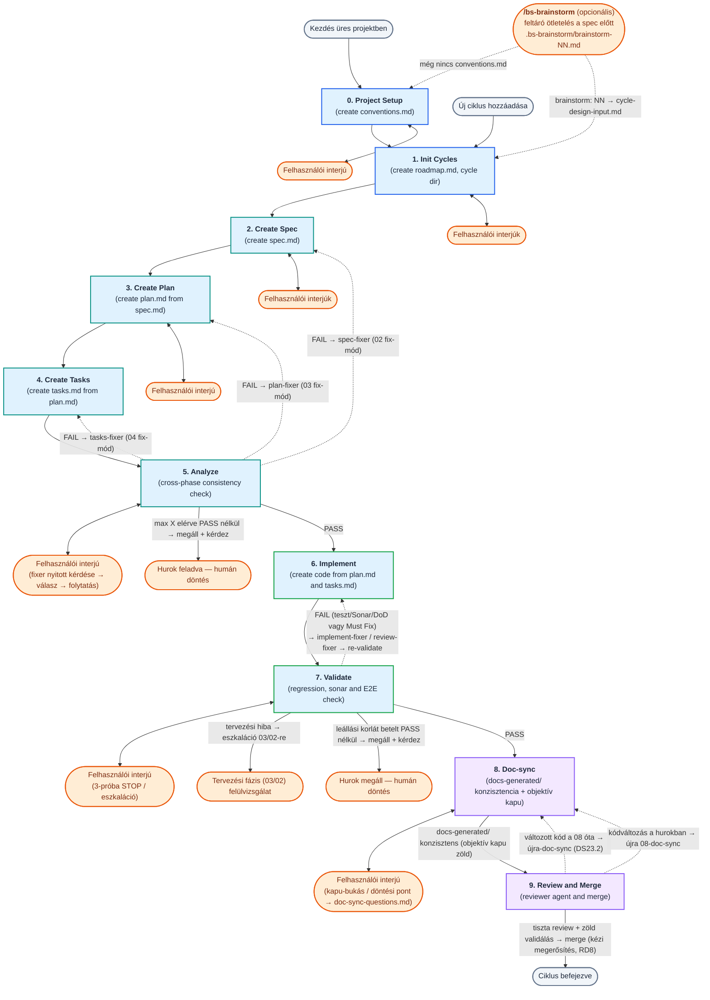
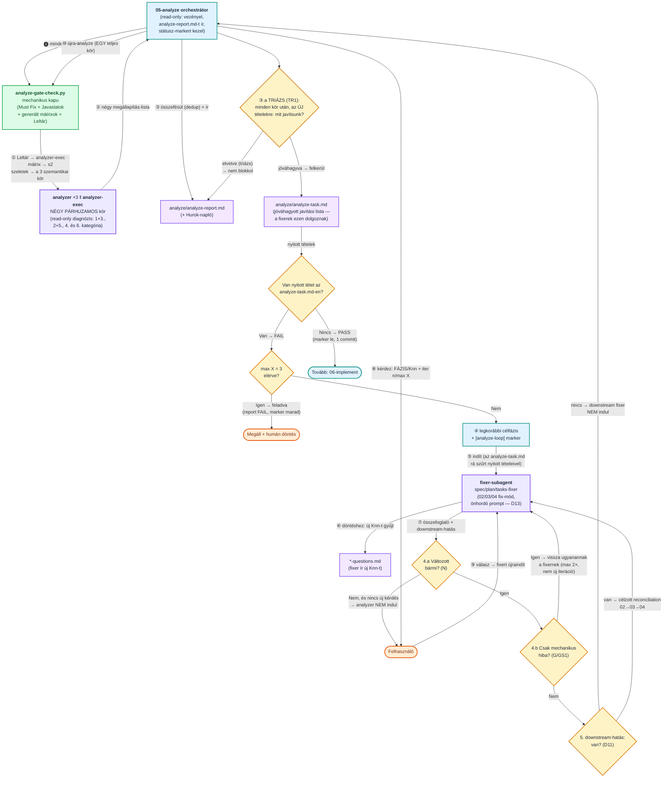
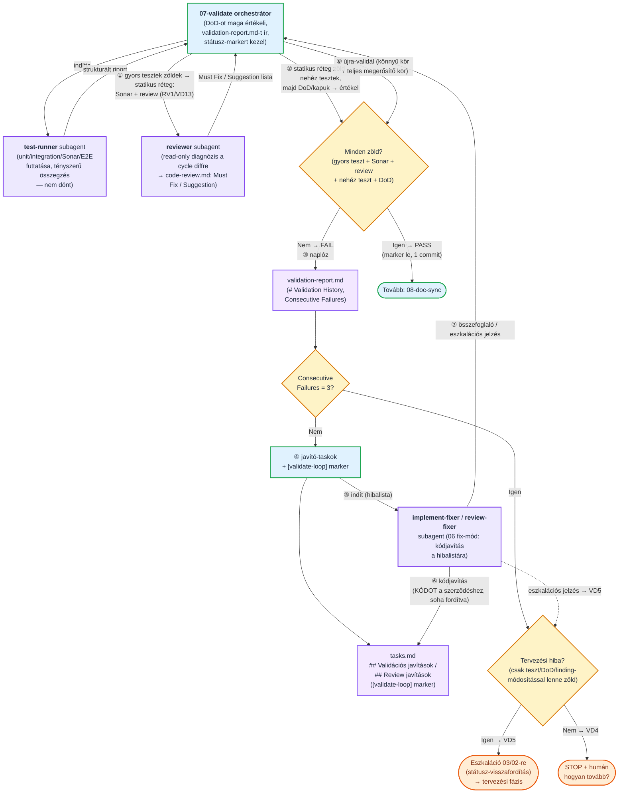

```text
    ╔══════════════════════════════════════════════════════════════════════╗
    ║                                                                      ║
    ║   ██████╗ ███████╗██████╗ ██╗  ██╗██╗███████╗██████╗ ███████╗ ██████╗║
    ║   ██╔══██╗██╔════╝██╔══██╗██║ ██╔╝██║██╔════╝██╔══██╗██╔════╝██╔════╝║
    ║   ██████╔╝█████╗  ██████╔╝█████╔╝ ██║███████╗██████╔╝█████╗  ██║     ║
    ║   ██╔══██╗██╔══╝  ██╔══██╗██╔═██╗ ██║╚════██║██╔═══╝ ██╔══╝  ██║     ║
    ║   ██████╔╝███████╗██║  ██║██║  ██╗██║███████║██║     ███████╗╚██████╗║
    ║   ╚═════╝ ╚══════╝╚═╝  ╚═╝╚═╝  ╚═╝╚═╝╚══════╝╚═╝     ╚══════╝ ╚═════╝║
    ║                                                                      ║
    ╚══════════════════════════════════════════════════════════════════════╝
```

**ENG version → [README.md](README.md)**

<!-- TOC -->

- [Berki-spec](#berki-spec)
  - [1. Két fejlesztési út — válassz a feladat mérete szerint](#1-két-fejlesztési-út--válassz-a-feladat-mérete-szerint)
    - [1.1 Mindkét út előtt (opcionális): /bs-brainstorm](#11-mindkét-út-előtt-opcionális-bs-brainstorm)
  - [2. Installáció](#2-installáció)
    - [Telepítés lépései:](#telepítés-lépései)
    - [Támogatott platformok és ágensek:](#támogatott-platformok-és-ágensek)
    - [Nyelvi beállítások — két független tengely](#nyelvi-beállítások--két-független-tengely)
    - [Hogyan lehet használni?](#hogyan-lehet-használni)
  - [3. Quick start](#3-quick-start)
    - [A keretrendszer működési elve:](#a-keretrendszer-működési-elve)
    - [Két fejlesztési út:](#két-fejlesztési-út)
    - [Alapvető parancsok (Slash Commands):](#alapvető-parancsok-slash-commands)
  - [4. Teljes berki spec flow (00–09)](#4-teljes-berki-spec-flow-0009)
    - [4.1 Magas szintű összefoglalás](#41-magas-szintű-összefoglalás)
    - [4.2 Részletes folyamat](#42-részletes-folyamat)
    - [4.3 Modellek és effort-szintek automatikus választása](#43-modellek-és-effort-szintek-automatikus-választása)
    - [4.4 Az 05-analyze önjavító hurok (részletes)](#44-az-05-analyze-önjavító-hurok-részletes)
    - [4.5 Az 07-validate önjavító hurok (részletes) — tesztek + kódreview](#45-az-07-validate-önjavító-hurok-részletes--tesztek--kódreview)
    - [4.6 Önjavító hurkok (analyze + validate) — közös konvenciók](#46-önjavító-hurkok-analyze--validate--közös-konvenciók)
    - [4.7 Példa prompt-folyam (egy ciklus végigvezetése)](#47-példa-prompt-folyam-egy-ciklus-végigvezetése)
  - [5. Egyszerűsített (lightweight) flow](#5-egyszerűsített-lightweight-flow)
    - [5.1 Folyamatábra](#51-folyamatábra)
    - [5.2 A három fázis röviden](#52-a-három-fázis-röviden)
    - [5.3 Két beépített kör-megszakító](#53-két-beépített-kör-megszakító)
    - [5.4 Opcionális ágensek (mind read-only, egyik sem kötelező)](#54-opcionális-ágensek-mind-read-only-egyik-sem-kötelező)
    - [5.5 Indító prompt (copy-paste)](#55-indító-prompt-copy-paste)
    - [5.6 Példa prompt](#56-példa-prompt)
  - [6. Skill-index](#6-skill-index)
  - [7. Agent-index](#7-agent-index)
  - [8. Frontmatter séma](#8-frontmatter-séma)
  - [9. conventions.md — Projekt konvenciók](#9-conventionsmd--projekt-konvenciók)
    - [Branching stratégia — ciklus = branch (a 01 fázisban)](#branching-stratégia--ciklus--branch-a-01-fázisban)
    - [Párhuzamos ciklusok — tervezési ablak worktree-vel (PW1/PW2, BD16)](#párhuzamos-ciklusok--tervezési-ablak-worktree-vel-pw1pw2-bd16)
    - [Friss alap az analyze előtt (BR1)](#friss-alap-az-analyze-előtt-br1)
    - [Integrációs frissítés a merge előtt (W2)](#integrációs-frissítés-a-merge-előtt-w2)
    - [Fázis-záró commit (PC1)](#fázis-záró-commit-pc1)
  - [10. Egy ciklus artifact fájljai](#10-egy-ciklus-artifact-fájljai)
    - [10.1 Fázisok közötti átadás (*-input-from-prev.md)](#101-fázisok-közötti-átadás--input-from-prevmd)
  - [11. docs-generated/ — élő dokumentáció (a 08-doc-sync gazdája)](#11-docs-generated--élő-dokumentáció-a-08-doc-sync-gazdája)
    - [11.1 specs/test-conventions.md — visszatérő teszt-elvárások és receptek (TC1–TC11)](#111-specstest-conventionsmd--visszatérő-teszt-elvárások-és-receptek-tc1tc11)
    - [11.2 export/ — verziózott PDF export (/bs-export-doc)](#112-export--verziózott-pdf-export-bs-export-doc)
  - [12. Kérdéskezelés (spec-questions.md / plan-questions.md / tasks-questions.md / doc-sync-questions.md)](#12-kérdéskezelés-spec-questionsmd--plan-questionsmd--tasks-questionsmd--doc-sync-questionsmd)
  - [13. Egységes Kész státusz-lifecycle](#13-egységes-kész-státusz-lifecycle)
  - [14. Sonar minőségellenőrzés](#14-sonar-minőségellenőrzés)
  - [15. Döntési napló (imp-decision.md)](#15-döntési-napló-imp-decisionmd)
  - [16. Validációs riport (validation-report.md)](#16-validációs-riport-validation-reportmd)
  - [17. Reviewer agent (agents/reviewer.md)](#17-reviewer-agent-agentsreviewermd)
  - [18. Ágens-specifikus integráció](#18-ágens-specifikus-integráció)
    - [18.0 Platform-korlát: parancs-futtatás a subagentekben (EX1)](#180-platform-korlát-parancs-futtatás-a-subagentekben-ex1)
    - [18.1 Antigravity CLI (Google DeepMind)](#181-antigravity-cli-google-deepmind)
      - [18.1.1 Tervezési és naplózási folyamat (Planning Mode)](#1811-tervezési-és-naplózási-folyamat-planning-mode)
      - [18.1.2 Jogosultságok kezelése (Permissions)](#1812-jogosultságok-kezelése-permissions)
      - [18.1.3 Skillek és Ágensek indítása (TUI használat)](#1813-skillek-és-ágensek-indítása-tui-használat)
    - [18.2 Codex CLI (OpenAI)](#182-codex-cli-openai)

<!-- /TOC -->


# Berki-spec

**Berki-spec** egy **spec-driven development (SDD)** keretrendszer AI-ágensekkel való szoftverfejlesztéshez. A munkát önállóan tesztelhető **ciklusokra** bontja, és minden ciklust ugyanazon a fegyelmezett úton vezet végig — a követelmény rögzítésétől (`spec`) a technikai terven (`plan`) és a feladatlistán (`tasks`) át az implementációig, a validálásig és a merge-ig. A folyamat két építőelemből áll: **skillek** (fázis-receptek, amelyeket a fő ágens futtat) és **ágensek** (dedikált, `Task tool` subagentként hívott specialisták).

**Mitől más, mint a piacon lévő SDD eszközök?**

A legtöbb SDD sablon egyetlen, merev „spec → terv → kód" fonalat ad. A Berki-spec ennél tovább megy — a különbség nem a fázisokban van, hanem abban, hogy **mi történik, amikor a valóság eltér a tervtől**:

- **Adaptív, kétsebességes flow.** Nagy feladatra a teljes (00–09) folyamat a minőségi kapuival; kis, jól körülhatárolt feladatra egy egyszerűsített háromfázisú út (`spec → task → implementáció`). A kettő **menet közben átjárható** — nincs felesleges ceremónia egy konfigurációs módosításhoz, és nincs alultervezés egy komplex funkciónál.
- **Önjavító minőségi hurkok, anti-„csalás" fegyelemmel.** Az `analyze`, `validate` és `review` fázis nemcsak *jelzi* a hibát, hanem levezényelt hurokban **automatikusan javítja** is. A kulcsszabály: a **kód igazodik a szerződéshez** (teszt / DoD / review-finding), **soha nem fordítva** — a hurok nem lazítja a tesztet, hogy zöld legyen. Ha valami csak a szerződés módosításával lenne megoldható, **felfelé eszkalál** a tervezési fázisba, ember elé.
- **Élő, „as-built" dokumentáció drift-követéssel.** A `docs-generated/` ciklusról ciklusra szinkronban marad a kóddal, egy **objektív konzisztencia-kapun** átvezetve, és külön nyilvántartja a megvalósult rendszer **eltéréseit a HLD/LLD szándéktól** (design-drift). A dokumentáció nem avul el csendben.
- **Megszakítás-biztos, bárhol folytatható.** Minden fázis fájlban tartja az állapotát és a nyitott kérdéseit (a listából **soha nem törlünk**, csak `[x]`-elünk), státusz-markerekkel — egy új session pontosan onnan folytatja, ahol abbamaradt.
- **Emberi kapuk a döntéseknél.** A fázisváltások **explicit jóváhagyáshoz** kötöttek: az ágens javasol és indokol, de nem „szalad el" — a scope- és irányválasztás a fejlesztőé marad.
- **Eszközfüggetlen, egyetlen forrásból.** Ugyanaz a skill/ágens definíció (single source of truth) fut Claude Code, Cursor, Antigravity és Codex alatt is.
- **Gyenge/olcsó modellekre optimalizálva.** Determinisztikus védőhálók (szűkített fix-mód belépők, kötelező ellenőrzőlisták, egyszerre egy kérdés) csökkentik a hibázás esélyét akkor is, ha nem a legerősebb modell hajtja.
- **Maximális token-megtakarítás — feladatarányos modell- és reasoning-szint-választás.** Minden lépés a hozzá **elégséges legolcsóbb ágensen** fut, **két független tengelyen** hangolva: a *modell* (melyik modell) és az *effort* (mennyi reasoning/thinking-token). A legdrágább (Opus-osztályú) modellt **egyetlen** pont kapja: a legkritikusabb reasoning, az `analyzer` konzisztencia-diagnózisa. A pontos hibalistát célzottan javító fixerek és a mechanikus futtatók **alacsony efforton** dolgoznak (a `default` modellen is), mert nekik nem kell felfedezniük a problémát. A kódkeresést, teszt-futtatást és a determinisztikus lépéseket olcsó subagentek és scriptek végzik, a fő kontextust óvva. A teljes leosztást lásd az [4.3 szekcióban](#43-modellek-és-effort-szintek-automatikus-választása).

## 1. Két fejlesztési út — válassz a feladat mérete szerint

A felhasználónak **két útja** van; a feladat súlya dönti el, melyik a megfelelő:

1. **Teljes berki spec flow (00–09 fázis)** — a nagyobb, összetettebb fejlesztésekhez. Külön `spec.md` → `plan.md` → `tasks.md` dokumentumok, kereszt-fázisos `analyze`, `validate`, `doc-sync` és `review` minőségi kapukkal és önjavító hurkokkal. Üres projektnél a `00-init-project`, új ciklusnál a `01-add-cycles` skillel indul. Ezt írja le a README többi része.

2. **Egyszerűsített (lightweight) flow** — kis, jól körülhatárolt feladatokhoz, amelyek 3-4 lépésben megoldhatók (pl. **konfiguráció összeállítása**, **egyszerűbb script megírása**, kisebb javítás). Egyetlen háromfázisú recept: `spec.md` → `task.md` → implementáció, a `/bs-quick-flow` skillben. Nincs külön plan/bs-analyze/bs-validate/bs-doc-sync fázis; az opcionális ágenseket (`researcher`, `analyzer`, `reviewer`) csak akkor hívja, ha tényleg segítenek.

**Hogyan dönts?**

| Jellemző | Egyszerűsített flow | Teljes berki spec flow |
|---|---|---|
| Tipikus feladat | konfiguráció, egyszerű script, kisebb javítás | új funkció, több komponens, összetett logika |
| Méret | 3-4 lépésben megoldható | önálló, vertikálisan vágható ciklus(ok) |
| Dokumentumok | `spec.md` + `task.md` | `spec.md` + `plan.md` + `tasks.md` |
| Minőségi kapuk | inline + opcionális ágensek | `analyze` / `validate` / `doc-sync` / `review` hurkok |
| Belépő | `/bs-quick-flow` | `/bs-init-project` / `/bs-add-cycles` |

**Alapértelmezett flow:** a projekt jellegét a `00-init-project` fázisban tisztázzuk (termékfejlesztés vs. konfiguráció/scriptelés), és ez alapján egy **default flow** kerül a `conventions.md` `## Fejlesztési módszertan` szekciójának **Alapértelmezett flow** mezőjébe. Ez a kiindulópont — feladatonként felülbírálható.

A két út **átjárható**: ha az egyszerűsített flow közben kiderül, hogy a feladat túlnő rajta (nagyobb kódírás, több komponens, összetett tervezés), a skill megállítja a munkát és **átirányít a teljes folyamatra** (`01-add-cycles`). Fordítva is: a `01-add-cycles` és a `03a-write-code-plan` jelzi, ha a feladat túl egyszerű a teljes ciklushoz, és javasolja az egyszerűsített flow-t.

### 1.1 Mindkét út előtt (opcionális): `/bs-brainstorm`

A két út **közös előszobája** a `/bs-brainstorm` segédparancs — arra az esetre, amikor még nem a *méret* a kérdés, hanem az, hogy **mit és hogyan** akarunk egyáltalán. („Hogyan valósítsunk meg egy központi cert kezelést?", „Érdemes-e kiszervezni az auth-ot?") Ez a rés a `00–09` flow **előtt** van: a `01-add-cycles` már azt feltételezi, hogy tudod, mit akarsz (csak ciklusokra kell bontani), a `/bs-quick-flow` pedig azt, hogy a feladat kicsi és világos.

**Mit tesz:**
- **Orientálódik** a projektben: `conventions.md`, `docs-generated/system-overview.md` (as-built igazság), `docs-generated/README.md` (mappa-index), `specs/roadmap.md` — téma szerint az `architecture.md` és a `design-drift.md`. A teljes `specs/` fa bedarálása tilos (BS6).
- **A kódbázis-feltárást olcsó, párhuzamos `researcher` subagentekkel** végzi (Mód B, read-only, legolcsóbb tier, „soha nem nyers fájltartalom") — a beszélgetés kontextusát így egy leletlista terheli, nem fájlok tucatja (BS7).
- **Beszélget, nem monologizál:** egyszerre **egy** kérdés, minden javaslatnál **2–3 alternatíva trade-offokkal + explicit ajánlás**, kötelező illesztés a meglévő rendszerhez és a `conventions.md`-hez, és tilos az igenelés — a fel nem hozott kockázat az ágens hibája (BS8–BS13).
- **Perzisztál:** a session anyaga a `.bs-brainstorm/brainstorm-NN-<slug>.md` munkafájlba kerül, fix csontvázzal (*Cél · Feltárt tények forrással · Alternatívák · Döntések · Nyitott kérdések · Javasolt ciklus-vágás · Napló*). Minden érdemi kör után **bővül** — soha nem íródik újra (BS14). Így egy `/clear`, összeomlás vagy napokkal későbbi visszatérés után is folytatható: `/bs-brainstorm folytassuk a 04-est`.

**Kemény korlátok (BS1):** kódot nem ír, `git`-et nem futtat, és a `.bs-brainstorm/` mappán kívül **egyetlen fájlt sem** módosít — egyetlen kivétellel: az első futáskor felajánlja a `.bs-brainstorm/*` bejegyzés felvételét a `.gitignore`-ba (jóváhagyás után, egyszer). A végén **javasol**, de nem lép be a következő skillbe.

**A híd a flow felé (BS18):** a nyers munkafájl **helyi és gitignore-olt** (nyers gondolkodás, nem leadandó) — ami megőrzésre érdemes, az a ciklus `cycle-design-input.md`-jébe desztillálódik, és *az* kerül commitba:

```
/bs-brainstorm hogyan legyen központi cert kezelés
        ↓                      .bs-brainstorm/brainstorm-04-central-cert.md   (gitignore-olt)
/bs-add-cycles brainstorm: 04
        ↓                      specs/cycle-NN-<name>/cycle-design-input.md    (commitolt)
/bs-write-spec
```

A `01-add-cycles` a `## 6. Javasolt ciklus-vágás` szekciót a roadmap-javaslat kiindulásának veszi, a `## 5. Nyitott kérdések` kipipálatlan tételeit pedig **kérdésként** teszi fel — amit a munkafájl megválaszol, azt nem kérdezi meg újra. **Egy híd, egy irány:** a `02-write-spec` nem a brainstormot olvassa, hanem a `cycle-design-input.md`-t.

## 2. Installáció

A BerkiSpec keretrendszer beállítása a célprojektben rendkívül egyszerű és automatizált a mellékelt telepítő script segítségével.

### Telepítés lépései:
1. Nyiss meg egy terminált a `berkispec` repository gyökerében.
2. Futtasd a telepítő scriptet:
   * **Linux/macOS:**
     ```bash
     ./install.sh
     ```
   * **Windows (PowerShell):**
     ```powershell
     .\install.ps1
     ```
3. A script interaktív módon üdvözöl, és bekéri a célprojekted gyökérmappáját.
   * *Tipp:* Az útvonal beírása közben a **Tab** billentyűvel automatikusan kiegészítheted a mappaneveket, míg a **Tab kétszeri megnyomásával** kilistázhatod az aktuális könyvtár tartalmát.
   * **Újratelepítéskor a legutóbbi célmappa automatikusan fel van kínálva** — Linux/macOS-en előre kitöltve jelenik meg (Enter = elfogadás, nyilakkal szerkeszthető), Windowson a script kiírja és üres Enterre elfogadja. A telepítő ehhez a repo gyökerében lévő **`history`** fájlt használja (`LAST_PROJECT_PATH`, `LAST_PLATFORM`, `LAST_INSTALL`). A fájl gépfüggő, ezért a `.gitignore` kizárja; ha a benne tárolt mappa időközben megszűnt, a script jelzi és újat kér.
4. Válaszd ki az általad használt AI agent platformot (1–6).
5. Válaszd ki a **két nyelvet** — lásd a *Nyelvi beállítások* szekciót lentebb. Mindkettőnél van alapértelmezés, Enterrel elfogadható:
   * **Promptok nyelve** (amit az ágens *olvas*): `1) English [alapértelmezett]` / `2) Magyar`
   * **Projekt nyelve** (amit az ágens *ír*): `1) Magyar [alapértelmezett]` / `2) English`

**Nem interaktív (scriptelt) telepítés.** Ha **egyetlen** flaget sem adsz meg, a fenti interaktív út fut változatlanul. Flagekkel viszont automatizálható:

```bash
./install.sh --platform claude --prompt-lang en --project-lang hu --path ~/projekt
```

| Flag (`install.sh`) | PowerShell | Érték | Alapértelmezés |
|---|---|---|---|
| `--platform` | `-Platform` | `claude` \| `codex` \| `antigravity` \| `cursor` \| `copilot` | — (kérdezi) |
| `--prompt-lang` | `-PromptLang` | `hu` \| `en` | `en` |
| `--project-lang` | `-ProjectLang` | `hu` \| `en` | `hu` |
| `--path` | `-Path` | a célprojekt könyvtára | — (kérdezi) |
| `--force` | `-Force` | ütközésnél felülír | — |
| `--help` | `-Help` | súgó | — |

Részlegesen megadott flagek esetén a megadottakat használja, a többit interaktívan kérdezi. **Ütközésnél `--force` nélkül a nem interaktív mód MEGÁLL** — nem ír felül csendben.

### Támogatott platformok és ágensek:
A keretrendszer öt népszerű fejlesztő platformra képes beállítani a környezetet:

1. **Google Antigravity CLI:**
   * A projekt gyökerében létrehozza a `.agents/` konfigurációs mappát.
   * Az ágenseket a `.agents/agents/<név>/agent.json` mappaszerkezetbe, a skilleket pedig a `.agents/skills/bs-<név>/SKILL.md` könyvtárba linkeli be.
2. **Claude Code:**
   * A projekt gyökerében létrehozza a `.claude/` konfigurációs mappát.
   * Az ágenseket a `.claude/agents/<név>.md` (Markdown) formátumban linkeli be, a skilleket pedig a `.claude/skills/bs-<név>/SKILL.md` alá.
3. **Cursor (Agent CLI):**
   * A projekt gyökerében létrehozza a `.cursor/` konfigurációs mappát.
   * A subagenteket a `.cursor/agents/<név>.md` (Markdown) formátumban linkeli be (a read-only agentek `readonly: true`-t kapnak), a skilleket pedig a `.cursor/skills/bs-<név>/SKILL.md` alá.
4. **GitHub Copilot (CLI & IDE):**
   * A projekt gyökerében létrehozza a `.github/` konfigurációs mappát.
   * Az ágenseket a `.github/agents/<név>.agent.md` fájlként linkeli be, a skilleket pedig globális utasításokként a `.github/instructions/bs-<név>.instructions.md` fájlba rendezi.
5. **Codex CLI:**
   * A subagenteket a `.codex/agents/<név>.toml` **TOML** fájlokként hozza létre (natív `model` + `model_reasoning_effort` mezőkkel; a read-only agentek `sandbox_mode = "read-only"`-t kapnak).
   * A skilleket a `.agents/skills/bs-<név>/SKILL.md` alá helyezi — a Codex a projekt-szintű skilleket innen olvassa.
   * ⚠️ **Figyelem:** a Codex és az Antigravity **közös** `.agents/skills/` mappát használ, ezért egy projektbe a kettő közül csak az egyik telepíthető. A telepítő figyelmeztet és rákérdez, ha a másik már jelen van.

### Nyelvi beállítások — két független tengely

A keretrendszer **két, egymástól független** nyelvi beállítást ismer. Nem ugyanaz a kettő, és **nem is kell egyezniük**:

| Beállítás | Mit határoz meg | Alapértelmezés |
|---|---|---|
| **Prompt nyelve** | Milyen nyelven vannak az **instrukciók, amiket az ágens olvas** (a `skills-*` / `agents-*` / `shared-*` fa nyelve). A te dokumentumaidat nem érinti. | **English** |
| **Projekt nyelve** | Milyen nyelven **ír az ágens**: `spec.md`, `plan.md`, `tasks.md`, `conventions.md`, riportok, `docs-generated/` — és amit **neked válaszol** a chatben. | **Magyar** |

**A négy kombináció:**

| Prompt | Projekt | Mikor ez a jó |
|---|---|---|
| **EN** | **HU** | *Az alapértelmezés.* Magyar csapat, magyar leadandó dokumentáció — de az ágens angol instrukciót kap, ami olcsóbb tokenben és amit a gyengébb/olcsóbb modellek pontosabban követnek. |
| HU | HU | Ha a prompt-szöveget is magyarul akarod olvasni/karbantartani. |
| EN | EN | Nemzetközi projekt. |
| HU | EN | Ritka, de érvényes: magyar karbantartó, angol leadandó. |

**Mindkettő telepítéskor dől el, és BEDRÓTOZÓDIK a telepített promptokba.** A projektbe **semmilyen nyelvi mező nem kerül** — sem a `conventions.md`-be, sem máshova —, ezért:

- utólag **csak újratelepítéssel** változtatható;
- meglévő projektnél **nincs migrációs teendő**: amíg nem telepítesz újra, minden a régiben marad;
- a telepítő **záró összefoglalója kiírja mindkét nyelvet** — ez az egyetlen hely, ahol szembesülsz a választásoddal.

> **A fő kockázat: nyelvi átszivárgás.** Angol instrukció + magyar projekt esetén a modell (különösen a gyengébb) hajlamos angol szavakat szivárogtatni a magyar dokumentumba, vagy az egész artefaktumot angolul megírni. Az ez elleni fő fegyver az **`output-language` blokk**: minden skill és minden agent legelejére — közvetlenül a H1 után — bekerül egy blokk, amely **a projekt nyelvén** mondja ki, hogy mit kell azon a nyelven írni (artefaktumok, a felhasználónak szóló mondatok), mi marad angol (azonosítók, fájlnevek, parancsok, szabály-ID-k), és hogy **a keverés javítandó hiba**. A célnyelven megfogalmazott szabály egyszerre utasítás és nyelvi horgony — mérhetően jobban tart, mint egy angolul megfogalmazott „write in Hungarian".

> **A kapu-scriptek is követik a projekt nyelvét.** A determinisztikus kapuk (riport-kapu, DoD-ellenőrzés, kör-napló, analyze-kapu, TC8) nem hardcode-olt magyar szövegre illesztenek: a telepítő a választott projekt-nyelv szótárát a scriptek mellé írja (`lang-keys.json`), és a scriptek abból veszik a szekciócímeket, mezőneveket és státusz-értékeket. Amit *keresnek* és amit az artefaktumba *írnak*, tehát a projekt nyelvén van. A bemenetük ugyanakkor **nyelvfüggetlen**: mindkét nyelv alakját elfogadják, így egy magyarul indult projekt angol újratelepítés után sem esik ki.
>
> **⚠️ Egy maradék `projekt = English` mellett:** a kapu-scriptek **konzol-üzenetei** magyarok (ezek a futtatónak és az ágensnek szólnak, nem kerülnek artefaktumba). A telepítő ezt a választásnál külön jelzi.

### Hogyan lehet használni?
A telepítés után az adott platform automatikusan beolvassa a symlinkelt definíciókat:
* **Google Antigravity CLI / Claude Code / Cursor Agent CLI / Codex CLI:** Indítsd el a CLI-t a célprojekt mappájában (Cursornál az `agent` paranccsal). A chat felületen a `/` (per) karakter leütésével előhívhatod a skillek listáját. Mindegyik skill egységesen a `berkispec - <fázis>: <leírás>` névvel fog megjelenni, így azonnal láthatod az SDD lépések sorrendjét és célját. Kezdéshez hívd meg a `bs-init-project` skillt! (Codexnél a subagenteket a `/agent` paranccsal listázhatod/válthatsz köztük.)
* **GitHub Copilot:** A Copilot Chat ablakában vagy a Copilot CLI-ben a `@` szimbólummal (pl. `@bs-init-project`) tudod közvetlenül aktiválni a kívánt fázis utasításait.

---


## 3. Quick start

A BerkiSpec egy fegyelmezett, spec-driven development (SDD) keretrendszer AI-ágensekkel való páros programozáshoz.

### A keretrendszer működési elve:
* **Ciklusok (Cycles):** A fejlesztést jól körülhatárolt, egyértelmű céllal leírható, könnyen kézben tartható egységekre (ciklusokra) osztjuk. Minden új ciklus saját Git branch-et kap, és a ciklus összes tervezési és naplózási dokumentuma a projekt gyökerében lévő `specs/cycle-NN-<cycle-name>/` mappába kerül.
* **Fázisok (Phases):** Minden ciklus szigorú fázisokra van bontva, amelyek végigvezetik a folyamatot a követelményektől a megvalósításig és a merge-ig.

### Két fejlesztési út:
A feladat összetettségétől függően kétféle flow áll rendelkezésre:
1. **Teljes SDD Flow:** Részletes specifikációt (`spec.md`), technikai tervet (`plan.md`) és feladatlistát (`tasks.md`) készít, valamint automatikus önjavító minőségi hurkokat (analyze, validate, review) futtat.
2. **Könnyű (Lightweight) Flow:** Kisebb módosításokhoz, konfigurációkhoz vagy egyszerű scriptekhez. Egy lépésben fut le, nincs külön fázisbontása.

### Alapvető parancsok (Slash Commands):
A telepítés után a platform chat felületén a `/` karakter leütésével érheted el a skilleket:

* **`/bs-init-project`**: A projekt legelső inicializálása (létrehozza a `conventions.md` fájlt).
* **`/bs-add-cycles`**: Új fejlesztési ciklus hozzáadása az ütemtervhez (`roadmap.md`).
* **`/bs-write-spec`**: Követelmények rögzítése, új ciklus specifikációjának elkészítése (`spec.md` + `spec-questions.md`).
* **`/bs-write-code-plan`**: A technikai megvalósítási terv **kód-oldala** (`plan.md` kód-szekciói + `plan-questions.md`) — koordináták, tervezett módosítások, konfiguráció, séma.
* **`/bs-write-test-plan`**: Ugyanannak a `plan.md`-nek a **teszt-fele** — `TS-NN` forgatókönyvek, gépi futtatási tábla, környezet-felkészítés, tesztfájl-adatlapok.
* **`/bs-write-tasks`**: A technikai terv lebontása mérhető feladatokra (`tasks.md` + `tasks-questions.md`).
* **`/bs-analyze`**: Kereszt-fázisos konzisztencia-ellenőrzés és automatikus javítás (spec/plan/tasks egyezés).
* **`/bs-implement`**: Tényleges kódfejlesztés a feladatlista alapján, a haladás rögzítésével a `tasks.md`-ben.
* **`/bs-validate`**: Tesztek, lint, build **és kódreview** (reviewer agent) ellenőrzése egyetlen automatikus javító hurokban (sikeres futtatás után 'Kész' státusz).
* **`/bs-doc-sync`**: Az élő dokumentáció (`docs-generated/`) és README-k szinkronizálása a kódváltozásokkal, valamint a `specs/test-conventions.md` (visszatérő teszt-elvárások és receptek) karbantartása.
* **`/bs-merge`**: A ciklus branch beolvasztása (lokális squash vagy PR), kötelező felhasználói megerősítéssel. A kódreview már a `/bs-validate`-ben lefutott.
* **`/bs-cycle-status`**: Ciklusok státuszának ellenőrzése (interaktív TUI vagy parancssori státusz).
* **`/bs-brainstorm`**: Feltáró ötletelés és közös tervezés **a spec előtt** — perzisztens munkafájllal (`.bs-brainstorm/`), olcsó `researcher` feltárással; a végén átad a `/bs-add-cycles`-nak vagy a `/bs-quick-flow`-nak.
* **`/bs-quick-flow`**: Az egyszerűsített (lightweight) flow elindítása kis feladatokhoz (spec → task → implementáció).
* **`/bs-export-doc`**: Verziózott PDF export a markdown doksikból (mermaid ábrákkal együtt) az `export/` mappába — paraméter nélkül az `architecture.md`-ből és a `system-overview.md`-ből.
* **`/bs-manual-test-plan`**: **Kézi tesztterv** összeállítása a ciklushoz (`manual-test-plan.md`): komponens-indítás, tesztadatok, kézi hívási szekvenciák (`curl` + `.http`), elvárt eredmények és az automata tesztek eredményének helye. Két mód: `Tervezett` (implementáció előtt, a `plan.md` alapján) vagy `As-built` (validálás után, a kódhoz ellenőrizve). Előfeltétele az `analyze-report.md` `PASS` státusza; nem fázis, nem változtat ciklus-státuszt, és bármikor újrafuttatható (a kézi kiegészítéseket megőrzi).

---


## 4. Teljes berki spec flow (00–09)

Ez a fejezet a **teljes, sokfázisú** fejlesztési utat írja le a folyamatábráival — a projekt-setuptól (00–01) a per-ciklus loopon át (02–09) a merge-ig, az önjavító hurkokkal együtt. A **másik utat**, az egyszerűsített háromfázisú flow-t lentebb, az „Egyszerűsített (lightweight) flow" fejezet részletezi.

> **Kód-jelölések:** a szövegben a `DS`/`VD`/`RD`/`LC`/`SK` + szám alakú kódok (pl. `DS22`, `RD6`, `LC1`) a skill-fájlok belső szabály-azonosítói. A részletes definíciójuk az adott skillben él; itt csak visszakereshető horgonyként szerepelnek, a README megértéséhez nem kell feloldani őket.

### 4.1 Magas szintű összefoglalás

Ez a diagram összefoglalja a 00–09 fázisok egymás utáni folyamatát, a kezdőpontokat, az interjú loopokat és a hibajavítási visszacsatolásokat.



### 4.2 Részletes folyamat

Az alábbi részletes ábra bemutatja az egyes fázisok közötti pontos átmeneteket, a bemeneti/kimeneti fájlokat, a felhasználói interakciós pontokat (User Input), valamint a hibák esetén fellépő visszacsatolási loopokat.

```mermaid
flowchart TD
    %% Styling definitions
    classDef setup fill:#e0f2fe,stroke:#2563eb,stroke-width:2px,color:#1e293b;
    classDef design fill:#e0f2fe,stroke:#0d9488,stroke-width:2px,color:#1e293b;
    classDef dev fill:#e0f2fe,stroke:#16a34a,stroke-width:2px,color:#1e293b;
    classDef decision fill:#fef3c7,stroke:#d97706,stroke-width:2px,color:#1e293b;
    classDef doc fill:#f3e8ff,stroke:#8b5cf6,stroke-width:2px,color:#1e293b;
    classDef userInput fill:#ffedd5,stroke:#ea580c,stroke-width:2px,color:#7c2d12;

    subgraph Setup ["<b>⚙️ PROJEKT SETUP (EGYSZER)</b>"]
        P00["00 — Projekt inicializálás"]:::setup
        P00_Loop{"Vannak még kérdések?"}:::decision
        DocConv["conventions.md"]:::doc
        In00(["User Input: Projekt célok & válaszok"]):::userInput

        P01["01 — Ciklusok kezelése"]:::setup
        P01_Loop{"Vannak még nyitott kérdések?"}:::decision
        DocRoadmap["specs/roadmap.md (Státusz: Kész)"]:::doc
        In01(["User Input: HLD/LLD vagy leírás"]):::userInput
    end

    subgraph Design ["<b>📐 TERVEZÉSI FÁZIS (CIKLUSONKÉNT)</b>"]
        P02["02 — Spec írás"]:::design
        P02_Loop{"Vannak még kérdések? (spec-questions.md)"}:::decision
        DocSpec["specs/cycle-NN-*/spec.md (Státusz: Tervezésre kész)"]:::doc
        In02(["User Input: Ciklus választás & spec válaszok"]):::userInput

        P03["03 — Plan írás"]:::design
        P03_Loop{"Vannak még kérdések? (plan-questions.md)"}:::decision
        DocPlan["specs/cycle-NN-*/plan.md (Státusz: Task írásra kész)"]:::doc
        In03(["User Input: Tervezési válaszok"]):::userInput

        P04["04 — Tasks írás"]:::design
        DocTasks["specs/cycle-NN-*/tasks.md (Státusz: Implementálásra kész)"]:::doc

        P05["05 — Analyze"]:::design
        P05_Check{"Konzisztens? (analyze-report.md)"}:::decision
        DocAnalyze["specs/cycle-NN-*/analyze/analyze-report.md (PASS/FAIL)"]:::doc
    end

    subgraph Development ["<b>💻 IMPLEMENTÁCIÓ & ELLENŐRZÉS (ITERATÍV)</b>"]
        P06["06 — Implementálás"]:::dev
        P06_Loop["Kód fejlesztése + tasks.md haladás rögzítése"]:::dev
        DocTasksReady["specs/cycle-NN-*/tasks.md (Státusz: Validálásra kész)"]:::doc
        In06(["User Input: Ciklus implementációs indítása"]):::userInput

        P07["07 — Validálás és kódreview"]:::dev
        P07_Run{"Tesztek & SonarQube futtatása<br/>(test-runner subagent)"}:::decision
        P07_Review{"Zöld tesztek → kódreview<br/>(reviewer subagent, RV1)"}:::decision
        DocReport["specs/cycle-NN-*/test-report/<br/>validation-report.md + code-review.md<br/>+ validate/round-NN/ (riportok, sonar)"]:::doc
        P07_Check{"Sikeres? (PASS)<br/>zöld tesztek + tiszta review"}:::decision

        P08["08 — Doc-sync"]:::dev
        P08_Plan["doc-sync-planner subagent<br/>→ doc-sync-plan.md (per-fájl terv<br/>+ kész csereszöveg-patch)"]:::doc
        DocGen["docs-generated/ (system-overview, architecture, CHANGELOG, design-drift, README)"]:::doc
        P08_Gate{"Objektív konzisztencia-kapu zöld?<br/>(DS22 — ds22-gate-check.py<br/>+ TC8 — tc8-gate-check.py)"}:::decision

        P09["09 — Merge"]:::dev
        P09_DocCheck{"Változott kód a 08 óta?"}:::decision

        Merge["Merge (lokális squash vagy PR, a conventions.md Merge stratégiája szerint)"]:::setup
        In08(["User Input: Merge megerősítés"]):::userInput
    end

    %% Connections
    Start([Kezdés]) --> P00

    %% User Inputs
    In00 --> P00
    In01 --> P01
    In02 --> P02
    In03 --> P03
    In06 --> P06
    In08 --> Merge

    P00 --> P00_Loop
    P00_Loop -- "Igen" --> P00
    P00_Loop -- "Nem (Lezárva)" --> DocConv
    DocConv --> P01

    P01 --> P01_Loop
    P01_Loop -- "Igen" --> P01
    P01_Loop -- "Nem (Kész)" --> DocRoadmap

    DocRoadmap --> P02
    P02 --> P02_Loop
    P02_Loop -- "Igen" --> P02
    P02_Loop -- "Nem" --> DocSpec

    DocSpec --> P03
    P03 --> P03_Loop
    P03_Loop -- "Igen" --> P03
    P03_Loop -- "Nem" --> DocPlan

    DocPlan --> P04
    P04 --> DocTasks

    DocTasks --> P05
    P05 --> DocAnalyze
    DocAnalyze --> P05_Check

    %% Analyze önjavító hurok (05)
    P05_Check -- "FAIL" --> P05_Fixer["fixer-subagent<br/>(02/03/04 fix-mód, [analyze-loop])"]:::design
    P05_Fixer -- "fixer nyitott kérdést gyűjt<br/>(*-questions.md)" --> P05_Q(["User Input: FÁZIS/Knn válasz<br/>(orchestrátor kérdezi)"]):::userInput
    P05_Q --> P05_Fixer
    P05_Fixer -- "downstream re-deriválás<br/>02→03→04 (reconciliation)" --> P05
    P05_Check -- "max X=3 elérve PASS nélkül" --> P05_Stop["Hurok feladva → analyze-report FAIL<br/>(marker marad) + humán döntés"]:::doc
    P05_Check -- "PASS (marker le, 1 commit)" --> P06

    P06 --> P06_Loop
    P06_Loop --> DocTasksReady

    DocTasksReady --> P07
    P07 --> P07_Run
    P07_Run -- "zöld (teljes kör 1-3. lépés)" --> P07_Review
    P07_Run -. "bukott teszt / Sonar / DoD<br/>(a review nem is fut)" .-> DocReport
    P07_Review --> DocReport
    DocReport --> P07_Check

    %% Validate önjavító hurok (07) — tesztek ÉS review egy hurokban
    P07_Check -- "FAIL: teszt / Sonar / DoD" --> P07_Fixer["implement-fixer subagent<br/>(06 fix-mód, [validate-loop])<br/>## Validációs javítások"]:::dev
    P07_Check -- "FAIL: Must Fix finding (MF-NN)" --> P07_RFixer["review-fixer subagent<br/>(06 fix-mód, [validate-loop])<br/>## Review javítások"]:::dev
    P07_Fixer -- "javítás kész → könnyű kör,<br/>majd teljes megerősítő kör" --> P07
    P07_RFixer -- "javítás kész → könnyű kör,<br/>majd teljes megerősítő kör + re-review" --> P07
    P07_Fixer -. "eszkalációs jelzés (VD5)" .-> P07_Esc
    P07_RFixer -. "eszkalációs jelzés (VD5)" .-> P07_Esc
    P07_Check -- "3-próba / 5 összes / 5 FAIL-futás<br/>megrekedt kód-bug" --> P07_Stop["Hurok megáll → STOP + humán<br/>([validate-loop] marker + javító-szekciók maradnak)"]:::doc
    P07_Check -- "tervezési hiba (VD5):<br/>csak teszt/DoD/finding-módosítással lenne zöld" --> P07_Esc["Eszkaláció: státusz-visszafordítás<br/>03/02-re → tervezési fázis"]:::doc
    P07_Esc --> P03

    %% Validation Pass
    P07_Check -- "PASS (Igen)" --> DocStatusKesz["spec.md, plan.md, tasks.md státusza: Kész"]:::doc
    DocStatusKesz --> P08

    %% Doc-sync (08): terv → mechanikus végrehajtás → objektív kapu (NEM önjavító subagent-hurok)
    P08 --> P08_Plan
    P08_Plan --> DocGen
    DocGen --> P08_Gate
    P08_Gate -. "kapu-bukás / döntési pont → doc-sync-questions.md<br/>(ember-vezérelt javítás, DS10)" .-> P08DS_Q(["User Input: doc-sync kérdés / javítás"]):::userInput
    P08DS_Q --> P08_Plan
    P08_Gate -- "kapu zöld → docs-generated/ konzisztens" --> P09

    %% Merge (09) — nincs hurok, nincs subagent; a review már a 07-ben lefutott
    P09 --> P09_DocCheck
    P09_DocCheck -. "Igen → merge előtt újra-doc-sync (DS23.2)" .-> P08
    P09_DocCheck -- "Nem → merge" --> Merge["Merge (kézi megerősítés, RD8)"]
    Merge --> End([Ciklus befejezve])
```



### 4.3 Modellek és effort-szintek automatikus választása

> **Elv: maximális token-megtakarítás.** Minden lépés a hozzá **elégséges legolcsóbb ágensen** fut; a drága modellt és a mély reasoningot csak ott költjük, ahol nélkülözhetetlen. A minőséget nem a modell ereje adja, hanem a **szigorú kontraktusok** (kötelező ellenőrzőlisták, „csak összefoglaló", determinisztikus scriptek).

A hangolás **két független tengelyen** történik:
- **Modell** — *melyik* modell fut (tier: `deep_reasoning_agent` / `default` / `research_agent`).
- **Effort** — *mennyi* reasoning/thinking-tokent éget (`high` / `medium` / `low`).

A kettő **nem esik egybe**: pl. a fixerek a `default` **modellen** futnak, de **`low` efforton**, mert pontos, előre azonosított hibalistát kapnak — nem nekik kell felfedezni a problémát.

**Modell-tier — ki mit kap:**

| Tier (`models.json` kulcs) | Ki kapja | Claude / Antigravity / Copilot / Cursor / Codex | Miért ez a tier |
|---|---|---|---|
| `deep_reasoning_agent` (legdrágább) | **kizárólag** `analyzer` (05) — iterációnként **három párhuzamos kör**, körönként szeletelt bemenettel (SH1) | `claude-opus-4-8` / `pro` (tier) / `Claude Opus 4.8` / `claude-opus-5` / `gpt-5.6-sol` | Kereszt-fázisos konzisztencia-**diagnózis** (spec/plan/tasks/conventions) — a legmélyebb reasoning; egy itt vétett hiba a legdrágább downstream (rossz diagnózisra rossz kód épül). |
| `default` | **minden más:** orchestrátor-skillek (05, 07…), a 4 fixer (`spec`/`plan`/`tasks`/`implement`-fixer), `reviewer`, `review-fixer`, `doc-sync-planner`, `test-runner` | `claude-sonnet-5` / `flash` (tier) / `Claude Sonnet 5` / `claude-sonnet-5` / `gpt-5.6-luna` | A fixerek **kész, pontos hibalistát** kapnak (megoldás/eszkaláció, nem felfedezés); az orchestrátorok bookkeeping-et végeznek (marker, számláló, routing) a subagent **kész** jelentése alapján — nem diagnózis. |
| `research_agent` (legolcsóbb) | `researcher` (00/01/02/03/06 + `bs-brainstorm`), `cycle-status` skill | `claude-haiku-4-5-20251001` / `flash` (tier) / `Claude Haiku 4.5` / `claude-sonnet-5` (low) / `gpt-5.4-mini` | Tiszta grep/glob/read fan-out, ill. determinisztikus script-futtatás — **nulla tervezési ítélet**; a „csak összefoglaló, soha nyers fájltartalom" kontraktus véd. Antigravityn nincs olcsóbb tier a `flash`-nél, ezért ott a `default` tierrel esik egybe; Cursorban nincs Haiku, ott a `default` Sonnet 5 fut `low` efforton. |

**Effort-leosztás — mennyi reasoning:**

| Effort | Ki kapja | Miért |
|---|---|---|
| `high` (default effort) | `analyzer`, és minden nem-felülírt agent | Nyílt végű felfedezés/diagnózis, ahol a mély reasoning fizet. Ez a **biztonságos alapértelmezés** (a `models.json` `default` effortja). |
| `medium` | `reviewer`, `doc-sync-planner` | Ítéletet igényel, de **kötött szempontlista** mentén (nem nyílt felfedezés). |
| `low` | a 4 fixer + `review-fixer`, `test-runner`, `researcher`, `cycle-status` | Pontos hibalistát célzottan javító, ill. tisztán mechanikus munka — a reasoning-mélység itt nem fizet, csak tokent éget. |

**Egy szándékos kivétel:** a `test-runner` mechanikus (tesztek/Sonar/E2E futtatása), mégis `default` **modellen** (nem a legolcsóbbon) fut — a több lépéses Bash-orchesztráció (portütközés, config-visszaállítás) és a projektenként eltérő teszt-/Sonar-kimenet megbízható, **konzisztens tesztnevű** összegzése kritikus: egy elgépelt név csendben elronthatná a 07-hurok per-item 3-próba számlálóját (VD4). (Az effortja viszont `low` — a pontosság formakövetés, nem reasoning-mélység kérdése.)

**Konfiguráció és telepítés:**
- **Forrás:** [`prompts/models.json`](prompts/models.json) — platformonként (`claude` / `antigravity` / `copilot` / `cursor` / `codex`) a 3 tier `{model, effort}` objektumként, plusz a defaulttól eltérő agentek **saját nevű sorként** (csak az `effort` mezővel; a modelljük a `default` tierből jön). Az `install-helper.py` `AGENT_MODEL_KEYS` szótára rendeli az `analyzer`/`researcher`/`cycle-status` stemeket a tierekhez (az `analyzer-exec` szándékosan nincs benne: a kapu leltára készen adja neki a jelölteket, tehát `default` tieren fut); ami nincs sem itt, sem saját sorként a `models.json`-ban, `default` modellt és `default` (=`high`) effortot kap.
- **Beírás telepítéskor** (`./install.sh`): Antigravity → `agent.json` `"model"` kulcs, **tier-értékkel** (`pro` / `flash` / `inherit`); Claude Code / Copilot → az agent-fájl YAML frontmatter `model` + `effort` mezője; Cursor → az agent-fájl YAML frontmatter `model` mezője, **modell-azonosítóval és zárójeles paraméterrel**: `model: claude-opus-5[effort=high]` (a Cursor nem ismer külön `effort:` mezőt); Codex → a `.codex/agents/<név>.toml` `model` + `model_reasoning_effort` kulcsa (+ read-only agenteknél `sandbox_mode = "read-only"`).
- **A skillek** (orchestrátor fő ágensek, nem subagentek) **sem `model`-t, sem `effort`-ot nem kapnak** — egyetlen platformon sem. A skill-szintű `model` ugyanis **nem része az Agent Skills alap-szabványnak** (az csak `name`/`description`/`license`/`compatibility`/`metadata`/`allowed-tools`), hanem Claude Code-kiterjesztés, amit a célplatformokon a modellváltás **nem, vagy nem megbízhatóan** követ:
  - **Codex:** a SKILL.md csak `name` + `description`-t ismer → egy `model` inert.
  - **Copilot:** az `.instructions.md` nem ismer `model` mezőt (az csak *prompt*-fájlnál van) → inert.
  - **Antigravity:** a `model` az *agent* frontmatter mezője, a skillé nem → inert.
  - **Cursor:** a `model`-kiterjesztést legfeljebb részlegesen ismeri → nem garantált.
  - **Claude Code:** a dokumentáció ígéri a skill-`model` váltást, de a valóságban **runtime-ban nem hat** ([anthropics/claude-code #45191](https://github.com/anthropics/claude-code/issues/45191), „not planned"-ként lezárva).
  Mivel egy beírt skill-`model` a legjobb esetben inert, a legrosszabban félrevezető (nem létező képességet sugall), **sehová nem injektáljuk**. A modell-hangolás **kizárólag az agentek/subagentek** szintjén hat megbízhatóan (Claude subagent `model`/`effort`, Codex `.codex/agents/*.toml` `model`/`model_reasoning_effort`) — ott marad meg.
- **Effort natív támogatása:** Claude Code-ban a subagent `effort:` frontmatter-mező, Codexben a `.codex/agents/*.toml` `model_reasoning_effort` mezője **natívan hat** (a fájl értéke elsőbbséget élvez). A többi platformon (Antigravity/Copilot) az érték **látható ajánlás** (frontmatter + „Recommended Effort" alert) — az Antigravity sémájában nincs is `effort` mező, ezért oda csak az alertbe kerül. A Cursor `model` mezője viszont natív — ott az effort is natívan hat a `[effort=...]` paraméterben. Fontos: a Cursor a **modell-azonosítót** várja (`claude-opus-5`), nem megjelenített nevet („Opus 4.8"); érvénytelen azonosítónál csendben a szülő ágens modelljére esik vissza. Cursornál a read-only agentek (`analyzer`, `analyzer-exec`, `researcher`, `doc-sync-planner`) `readonly: true`-t, Codexnél `sandbox_mode = "read-only"`-t kapnak.
- **Manuális váltás:** ha nem a telepített ágensekre támaszkodsz, kövesd a fenti leosztást a CLI/IDE modell- és effort-választójában.

**Antigravity-specifikum — a `model` mező TIER, nem modellnév** ([Antigravity: Subagents](https://antigravity.google/docs/subagents))

Az Antigravity custom agent sémájában a `model` mező **modell-tiert** vesz fel, nem konkrét modell nevét:

```
model: pro       # a legerősebb tier
model: flash     # gyors/olcsó tier
model: inherit   # a szülő ágens modellje (alapértelmezés)
```

- **A modellnév érvénytelen.** A korábban beírt `"model": "Claude Opus 4.6"` nem tier → a subagent az `inherit` alapértelmezésre esik vissza, azaz **a szülő ágens modelljén fut** (jellemzően Flash-en). Ez néma: a fájlban ott a „helyes" modellnév, a futás mégis a szülőé — pontosan ezért futott az `analyzer` Flash-en akkor is, amikor az `agent.json`-ban Opus szerepelt.
- **`effort` mező nincs a sémában.** A tier maga hordozza a képesség-szintet; az `effort` értéket ezért csak **látható ajánlásként** (alert) írjuk ki, az `agent.json`-ba nem. Ennek egy következménye van a leosztásban: mivel a `flash`-nél nincs olcsóbb tier, a `research_agent` és a `default` **ugyanazt kapja** — az effort-alapú megkülönböztetés itt nem érvényesíthető gépiesen.
- **Tier-leképezés:** `deep_reasoning_agent` → `pro`, `default` és `research_agent` → `flash`.

> A `.agents/agents/<név>/agent.json` formátumot a jelenlegi Antigravity-doksi már nem említi — a leírt hely `.agents/agents/<név>.md` YAML frontmatterrel. Az `agent.json` a gyakorlatban továbbra is betöltődik (a telepített ágensek megjelennek és futnak), ezért egyelőre maradunk nála; ha az Antigravity ejti a támogatását, a telepítő `process_antigravity` függvénye az a pont, ahol a `.md` formátumra kell váltani.

**Cursor-specifikum — a subagent `model` mező** ([Cursor: Subagents](https://cursor.com/docs/subagents))

A Cursor subagent-frontmatter mezői: `name`, `description`, `model`, `readonly`, `is_background`. **Külön `effort:` mező nincs** — a paraméterek a modell azonosítójához tapadnak szögletes zárójellel, vesszővel elválasztva:

```yaml
model: claude-opus-5[effort=high]        # effort= / context= / fast=
model: claude-sonnet-5[effort=low]
model: inherit                            # a szülő ágens modellje (alapértelmezés)
```

Három dolog, ami könnyen félrevisz:

1. **Azonosítót vár, nem megjelenített nevet.** A `model: Opus 4.8` alak nem érvényes; `claude-opus-5` / `claude-sonnet-5` kell.
2. **A modellválasztó UI címkéi nem a frontmatter-forma.** A Cursor felületén látható `claude-opus-5-thinking-high` / `gpt-5.6-sol-medium` stílusú slugok a *picker* nevei; a dokumentált frontmatter-alak az azonosító + `[effort=…]`. Claude-ból a slug-listán csak `-thinking-high` létezik, tehát a `-thinking-low` / `-thinking-medium` alakok érvénytelenek — pont az alacsony effortú agenteknél (fixerek, `test-runner`, `researcher`) hibáznának.
3. **Az érvénytelen érték NÉMA.** Ha az azonosítót a Cursor nem ismeri fel — vagy felismeri, de nincs hozzá jogosultság (admin letiltotta, a csomag nem tartalmazza, illetve legacy request-alapú csomagnál Max Mode kellene) —, akkor **hibaüzenet nélkül a szülő ágens modelljére esik vissza**. A tünet csak a viselkedésen látszik: pl. az `analyzer` látszólag fut, de nem Opus 5-ön.

Emiatt a `models.json` **`cursor` szekciójába mindig modell-azonosítót írj**; az effortot a telepítő fűzi hozzá (`install-helper.py` → `inject_cursor_agent`). Ugyanitt egy tier-eltérés: **Cursorban nincs Haiku**, ezért a `research_agent` a `default` Sonnet 5-öt kapja `low` efforton — ugyanaz a megoldás, mint Antigravityn a Flash-sel.

### 4.4 Az 05-analyze önjavító hurok (részletes)

Ez az ábra **kizárólag az 05-analyze lépést** mutatja be, a subagentek és a kérdés-folyam feltüntetésével. Az orchestrátor (05-analyze) read-only: a **gépies réteget** a `analyze-gate-check.py` kapu, a **szemantikai diagnózist** az `analyzer` **három párhuzamos köre** (ez az egyetlen pont a teljes rendszerben, ami a legdrágább, `deep_reasoning_agent` tier-en fut — lásd 4.3), a **végrehajthatósági diagnózist** az `analyzer-exec` (`default` tier, velük **párhuzamosan**), a **javítást** a fixer-subagentek (02/03/04 fix-mód, `default` tier) végzik; a felhasználót mindig az **orchestrátor** (szintén `default` tier) kérdezi, fázis-jelzéssel.

Négy rövidítő ág van benne, mert ezek adják a fázis megtakarításának nagy részét: a fixer **maga futtatja a kaput visszatérés előtt** (GS1), így a fixer utáni kapu-kör (G) védőhálóvá szelídült — ha mégis csak mechanikus hibát talált, az visszamegy ugyanahhoz a fixerhez, analyzer-kör és iteráció-fogyasztás nélkül; ha a fixer **semmit nem változtatott** (N), a hurok nem indít analyzert, hanem megáll és kérdez; és ha minden `Must Fix` **lokális**, a fixerek **egyetlen üzenetben, párhuzamosan** indulnak, downstream re-deriválás nélkül (LF1).

Az ötödik — és a legnagyobb megtakarítást hozó — ág a **triázs-megállás (TR1)**: **minden diagnoszta-kör után** a hurok megáll, és egyetlen kérdésben a felhasználó dönti el, mely **új** `Must Fix` tételeket javítsuk egyáltalán. A jóváhagyott tételek az **`analyze-task.md`** javítási listára kerülnek — a fixerek kizárólag ezen dolgoznak —, az elvetettek pedig `elvetve (triázs)` állapottal a riportban maradnak (audit-nyom), és nem blokkolják a `PASS`-t. Egy körön belül a hurok nem kérdez: végigmegy a listán, és amit közben újként talál, arról a **következő** triázsban kérdez. Már eldöntött tételre soha nem kérdez rá újra; a tisztán mechanikus (kapu-)tételek pedig kérdés nélkül kerülnek a listára.

**Az analízis mappája (AD1).** Az analízis minden fájlja a ciklus `analyze/` almappájában él: `analyze-report.md`, `analyze-task.md`, a kapu által kimetszett `slices/` (gitignore-olt) és minden segédfájl. A ciklus gyökere így a tervezési dokumentumoké marad.



**A működés lépésről lépésre:**

1. **A subagent gyűjti a kérdést, nem kérdez.** A fixer-subagent (02/03/04 fix-mód) a döntést igénylő pontokat **nem teszi fel közvetlenül a felhasználónak** — nincs interaktív csatornája. Ehelyett új `Knn` bejegyzésként felveszi a megfelelő `*-questions.md`-be (`spec-questions.md` / `plan-questions.md` / `tasks-questions.md`).
2. **És visszaadja az orchestrátornak.** A fixer a futása végén tömör összefoglalót ad: mit javított, és milyen új `Knn` kérdés-azonosítókat vett fel. (Az ábrán: ⑥ gyűjt, ⑦ visszaad.)
3. **Az orchestrátor teszi fel a kérdést a felhasználónak**, mindig jelezve, melyik fázishoz kapcsolódik: **fázis-fejléc + `FÁZIS/Knn` prefix** (pl. `[PLAN · iter 2/3 · PLAN/K05]`). Egyszerre egy kérdés, a válasz végén kattintható link az érintett `*-questions.md`-re.
4. **A válasz átvezetése után a hurok folytatódik:** az orchestrátor beírja a döntést a `*-questions.md`-be (`[x]` + összefoglaló), újraindítja a fixert, majd a downstream re-deriválás (`02→03→04`) és az újra-analyze következik. A kérdés-megállás **nem** számít új iterációnak, és nem fogyaszt a `max X`-ből.

A hurok két, egymástól független módon áll le: **PASS** (nincs több `Must Fix` → marker le, egyetlen commit, tovább a 06-ra), vagy **`max X = 3` elérve PASS nélkül** (a report `FAIL`, a `[analyze-loop]` marker az érintett dokumentumokon marad, az orchestrátor összefoglal és humán döntést kér).

### 4.5 Az 07-validate önjavító hurok (részletes) — tesztek + kódreview

Ez az ábra **kizárólag az 07-validate lépést** mutatja be, a subagentek feltüntetésével (a fenti analyze-ábra párja). Az orchestrátor (07) PASS-ig **determinisztikus ellenőrző** — a tesztek/Sonar/E2E tényleges futtatását a **`test-runner` subagent** végzi (`default` tier — mechanikus végrehajtás, nem dönt, de a megbízható log-/riport-értelmezés miatt szándékosan nem a legolcsóbb tier-en fut), a DoD-ot és a PASS/FAIL döntést az orchestrátor hozza —, FAIL esetén **orchestrátor**: a **javítást** az `implement-fixer` subagent (= a 06 fix-módja) végzi, a re-validálást és a döntéseket az orchestrátor.

**A fázis determinisztikus rétege — „ha van rá szkript, ne olvass fájlt" (VD11/b).** A 07 a keretrendszer legszkriptesebb fázisa, mert a kérdéseinek nagy része gépi:

| Kérdés | Ki válaszolja | Mit vált ki |
|---|---|---|
| Lefutottak-e a tesztek, hány zöld/piros? | `run-tests.py` a `plan.md` **gépi futtatási táblájából** | a `test-runner` subagentet **és** a nyers teszt-logot (a fázis legnagyobb token-tétele) — a subagent fallback marad, ha nincs tábla |
| Átment-e a Quality Gate, van-e blokkoló finding? | `sonar-gate.py` (Sonar Web API) | a `sonar-report.md` elolvasását és a severity-szűrést; a QG1 (küszöb vs. finding) külön kilépő kód |
| Teljesülnek-e a DoD-pontok? | `dod-check.py` — join a spec `· _bizonyíték:_` mezői és a kör JUnit-eredményei között | az emlékezetből adott ✓-t; csak a bizonyíték nélküli pont marad ítéletnek |
| Nyúlt-e a fixer a szerződéshez? | `contract-guard.py` (védett útvonalak + csalás-minták) | a teljes `git diff` elolvasását **minden** fixer-visszatérés után |
| Zárt-e minden task/DoD/IP1-tétel/finding, stimmel-e a kör-blokk? | `validate-gate-check.py` | öt fájl beolvasását egyetlen hívásra |
| Lefutott-e a plan MINDEN `validate`-fázisú kategóriája? | `validate-gate-check.py` — `RUN1` join a plan gépi táblája és a kör `results.json`-ja között | a „zöld kör = minden lefutott" tévedést: hiányzó `results.json` = a kört **nem** a gépi táblából hajtották |
| Bizonyíték-e a kihagyott teszt? | `dod-check.py` (a `skipped` eset `?`, nem ✓) + `validate-gate-check.py` (`SK1`) | egyetlen `pytest.skip` „bizonyíték"-értékét — a némán kihagyott teszt nem ellenőriz semmit |
| Üres váz-e a teszt törzse, létezik-e a `[CHECK]` szelektora? | `test-substance-check.py` (`TB1`/`TB2`) | a „zöld, de semmit nem bizonyító" teszt átengedését — a `TB2` a tesztfájl **futtatása nélkül** fogja meg az elorphanodott szelektort |
| Van-e a `[RED]`-hez bukás-bizonyíték, egyenként futottak-e a `[CHECK]`-ek? | `validate-gate-check.py` — `RED1` + `CK1` join a `check-log.md`-re | a napló kézi átolvasását; a `CK1` a szűrő nélküli, összevont futást és a hiányzó naplósort fogja meg |
| Tényleg a cél-hostot szólította-e meg a nem-lokális kategória? | `run-tests.py` — `EV6` a `conventions.md` TR3 táblájából | a „megvan az audit-napló, tehát rendben" tévedést: az örökölt, `127.0.0.1`-es fájl nem bizonyíték |
| A kör-mappa artefaktuma a KÖRBEN keletkezett-e? | `report-gate-check.py` — `TR7` (mtime-padló a kör `started_at`-jéhez) | a korábbi körökből örökölt fájlok „teli mappa" hatását |
| Elkészült-e a kör-napló? | `round-log.py open/step/close` | körönként ~1–1,5k output tokent, és a „nem keletkezett riport" hibaosztályt |

Ami **szándékosan LLM marad:** a `reviewer` (szemantikai diff-ítélet), a fixerek (kódírás), a plan-hiány diagnózisa, a VD5 eszkalációs döntés, a QG1 „javítható-e a ciklus hatókörében" kérdés, és a bizonyíték nélküli DoD-pontok megítélése — ahol egy szkript hamis zöldet vagy hamis riasztást adna.

**A hurok inkrementális (VD10).** Teljes kör — gyors tesztek → Sonar + kódreview → nehéz tesztek/regresszió → DoD/kapuk — csak **kettő** fut: az **első** és a **záró megerősítő**. A köztes javító körökben a **teljes gyors teszt-készlet** fut (plusz kizárólag az az egy item, ha a bukás nehéz teszt, Sonar vagy review-finding volt — utóbbinál a `reviewer` inkrementálisan, csak a nyitott `MF-NN`-ekre), mert a Sonar és a konténeres E2E újrafuttatása körönként a fázis költségének a nagy részét adja, miközben a javítás egyetlen itemre irányult. **PASS kizárólag teljes körből adható** — egy zöld könnyű kör után kötelező a megerősítő teljes kör. A könnyű kör is egy kör: a `failure-counter.py` naplózása és a 3/5/5 leállási korlát változatlanul számol.

**Amit a 07 orchestrátor szándékosan NEM csinál (VD11/VD12).** Nem olvassa be a teljes `plan.md`-t a fő kontextusba (azt a `test-runner` olvassa; a fő ágensnek célzott `grep` marad a plan-hiány ellenőrzésére), **nem olvassa végig a módosított fájlokat** (a diffet a `reviewer` subagent nézi át — kódkommentek/docstringek naprakészsége is nála van), és nem ellenőriz **komponens-README-ket** (az a `08-doc-sync` kizárólagos outputja). Az orchestrátor a *bizonyítékot* és az *elfogadási feltételeket* értékeli, a részletes olvasás a subagenteké.

**A 06 bizonyítékai: a `[RED]` bukása és a szó szerinti `[CHECK]` (RED1 · CK1).** Egy `[RED]` task nem a tesztfájl létrejöttével készül el, hanem azzal, hogy a célzottan lefuttatott teszt **vörös** — ez az egyetlen bizonyíték arra, hogy a teszt tényleg ellenőriz valamit —, és a bukás a `check-log.md`-be is bekerül `✗` eredménnyel (kivétel a `RED-EXEMPT`: meglévő tesztet frissítő task, indoklással). A `[CHECK]` parancsát pedig **szó szerint, önmagában** kell kiadni, a teszt-szűrővel együtt: egy `[CHECK]` = egy futás = **egy** naplósor **egy** task-azonosítóval — tilos több `[CHECK]`-et egy futásba vonni vagy egy bővebb futás eredményét több taskra rávezetni. A szűrő az egyetlen dolog, ami a taskot a plan tesztesetéhez köti (`TX1`), és ha a teszt neve közben megváltozott, a szűrt parancs **azonnal hibát ad**, míg az összevont futás zölden átmegy. Mindkettőt a `07` kapuja méri vissza a naplóból (`RED1`, `CK1`).

**A 06-implement egy futásban dolgozza fel a task listát (IM1).** Egy task lezárása — pipa a `tasks.md`-ben, `check-log` bejegyzés, task-commit — **nem** fázis-vég: az ágens a commit után azonnal a következő elvégzetlen taskot veszi, ugyanabban a körben. A fázis csak öt okból áll meg: teljesült egy *Megállási szabály*, nem teljesül egy fejezet `Gépi előfeltétel:` blokkja, a task explicit futó infrastruktúrát követel és az nem ellenőrizhető, a `[CHECK]` háromszor bukott, vagy minden task kész. Ez a szabály azért kell kimondva, mert a keretrendszer többi fázisában a „**A válasz végén helyezd el a … kattintható linkjét**" mondat **megállás-jelző** (kérdés vagy fázis-vég) — a 06-ban ez a mondat ezért taskonként **nem** szerepel, csak a fázis záró üzenetében. Enélkül az ágens minden task után visszaadta a szót, és a fázis csak kézi „folytasd" üzenetekkel haladt.



**A működés lépésről lépésre:**

1. **Az orchestrátor (07) elindítja a `test-runner` subagentet** (tesztek + Sonar + E2E futtatása, `default` tier — csak tényszerű összegzést ad vissza, nem dönt), majd a riport alapján maga értékeli a DoD-ot és dönt PASS/FAIL-ről. **A runner két forrásból dolgozik, semmi másból (TR4):** minden **ciklus-specifikus** részlet (parancsok, URL-ek, portok, teszt-userek, token-szerzés, indítási sorrend) a **`plan.md`**-ből — ezért követeli meg a 03 fázis az önhordó plant (TC1/a) —, a projekt-szintű eszköz-információ (futtató, mappastruktúra, riport-tábla, Sonar) a `conventions.md`-ből. A `test-conventions.md`-t nem olvassa, régi ciklusokból nem dolgozik, és **nem találgat**: ha egy futtatási részlet hiányzik a planból, `Plan-hiány`-t jelent — az orchestrátor pedig **nem fixert indít rá, hanem a tervezéshez eszkalál** (a hiányt a kód javítása nem oldja meg). A subagent jelentése **bizonyítékköteles (TR1)**: kategóriánként a kiadott parancs + `X passed / Y failed / Z skipped`; a **0 futtatott teszt FAIL, nem PASS (TR2)** — ez zárja ki a „vacuous PASS"-t. Ha a **gyors tesztek** zöldek egy teljes körben, az orchestrátor elindítja a **statikus réteget** (VD13): a `sonar-gate.py`-t és a **`reviewer` subagentet** (RV1) a cycle diffre — read-only diagnózis, `test-report/code-review.md`. A **nehéz tesztek (E2E/regresszió) csak ez után** futnak, és csak ha a statikus réteg tiszta: a Sonar és a review stack nélkül fut, a findingjaik javítása viszont megváltoztatja a kódot, tehát fordított sorrendben minden statikus finding ára egy eldobott E2E-futás lenne. A Sonar- és a review-findingok **egy batchbe** kerülnek: egy naplóbejegyzés, egy fixer-menet, egy VD3a kapu. A `Must Fix` findingok a kört FAIL-re fordítják, ugyanabba a naplóba és ugyanazokba a korlátokba futva, mint a teszthibák; a `Suggestions` nem blokkol. PASS → **automatikus** (VD7, nincs megerősítés): a `[validate-loop]` marker lekerül, egyetlen lezáró commit, tovább a 08-ra.
2. **A kör eredményét naplózza** a `# Validation History`-ba — a `failure-counter.py` szkripttel. **Egy validálási kör = egy futás-bejegyzés (VD4a):** részeredményt (pl. „a gyors tesztek zöldek") tilos külön naplózni, mert a közbeiktatott PASS megszakítaná az egymást követő bukások láncát, és a leállás soha nem lépne életbe.
3. **Három leállási korlát, mind a szkript kilépő kódjából (`exit 3`):** per-item **3 egymást követő** bukás (a klasszikus 3-próba, VD4), per-item **5 összes** bukás (a megszakított láncot is megfogja), és **5 egymást követő FAIL-futás** (VD4b globális backstop a divergáló hurokra, amikor körönként más elem bukik). Az `exit 1` hibás hívást jelent — a napló nem módosult, kézzel naplózni tilos. A megállás típusát a **tervezési-hiba heurisztika (VD5)** dönti el.
4. **Ha folytatható:** felveszi a javító-taskokat — teszt/Sonar/DoD → `## Validációs javítások`, review-finding → `## Review javítások` —, `[validate-loop]` markert tesz a `tasks.md`-re, és elindítja a bukás típusához tartozó fixert (`implement-fixer` ill. `review-fixer`, mindkettő = 06 fix-mód) a konkrét hibalistával. **Üres hibalistával nem indul iteráció** — a „Quality Gate FAIL, de nincs BLOCKER/CRITICAL/MAJOR" eset (QG1) külön ág: kód-oldalon javítható küszöb → konkrét task, egyébként STOP + humán.
5. **A fixer a KÓDOT igazítja a teszthez/DoD-hoz/findinghoz (VD3 anti-„teszt-csalás") — SOHA fordítva.** Tilos a teszt gyengítése/skip/törlése, hardcode, DoD-leszállítás, a `Must Fix` elnémítása vagy törlése javítás nélkül. A fixer visszaad: javítás-összefoglaló + (ha van) **eszkalációs jelzés**.
6. **Szerződés-integritás kapu (VD3a) — determinisztikus, nem bizalmi kérdés.** A fixer visszatérése után, **még az újra-validálás előtt**, az orchestrátor `git diff`-fel megnézi, hozzányúlt-e a tesztfájlokhoz, a `spec.md`-hez, a `code-review.md`-hez vagy a Sonar-konfighoz. Gyengítés esetén: `git checkout --` visszaállítás + eszkaláció — nem próbálkozik ugyanazzal az itemmel újra. Enélkül a VD3 csak szándék lenne, és egy lazított assertion hamis PASS-ig futna.
7. **Az orchestrátor újra-validál** (új kör → új naplóbejegyzés). Zöld → PASS (1. pont). FAIL → új iteráció (2. ponttól).
8. **Megállás a korlátoknál (a hurok user-érintkezése, VD7):** megrekedt **kód-bug** → STOP + humán („hogyan tovább?"); **divergáló hurok** → STOP + humán a nem-konvergálás tényével; **tervezési hiba** → eszkaláció 03/02-re (VD5, státusz-visszafordítással), átadva a tervezési huroknak — a 06-ban körözés helyett. A fixer eszkalációs jelzése és a VD3a kapu találata a korlát bevárása nélkül is kiváltja az eszkalációt.
9. **A `validation-report.md` = teljes validálási riport (VD9):** nem egysoros run-log, hanem futásnapló. Körönként egy `## Kör N` blokk — **végrehajtási sorrend időbélyeggel** (mi futott, mi maradt ki és miért), a `test-runner` bizonyítékai szó szerint, a bukott elemek a számlálóikkal, `DoD-NN` tábla, a javító kör nyoma (felvett taskok → fixer visszajelzése → VD3a kapu eredménye), és a kör döntése. A blokkok **hozzáfűződnek** (korábbi kör nem íródik felül), így az újrafuttatások láthatók; az `## Összegzés` kigyűjti, mely elemek futottak többször. A fájl végén a szkript írta `# Validation History`. A review körei is ide kerülnek — egyetlen közös számlálón a teszthibákkal. `/clear` után ez az egyetlen hely, ahol a validálás rekonstruálható — a chat nem az.

### 4.6 Önjavító hurkok (analyze + validate) — közös konvenciók

Két fázis vezényel önjavító hurkot: az **05-analyze** (a tervezési dokumentumok konzisztenciája) és az **07-validate** (a kód helyessége **és** a kód-review — RV1). A két hurok ugyanazokra a közös konvenciókra épül, hogy ne csússzanak szét:

**Az `05-analyze` hurka determinisztikus rétegű, és iterációnként EGY analyzer-futás (AG1/AG3/AG4/D10/D11/D13/E/G).** Minden futás előtt lefut a **mechanikus kapu** (`analyze-gate-check.py`): a gépiesen eldönthető ellenőrzések (plan-`[P-…]` ↔ task-hivatkozás mindkét irányban, marker-jelenlét, `[OPS]` repo-fájlon, státusz-frissítő task, `⟂` szimmetria, `DoD-NN` egyediség, kötelező táblák megléte — **és a végrehajthatóság gépies rétege: futtatott artefaktumok létezése, plan-`path:sor` horgonyok feloldása, artefaktum-hang kemény padlója**) szkriptben futnak, nem LLM-ben — olcsóbban és hamis riasztás nélkül. A kapu emellett **leltárt** ad az `analyzer-exec`-nek (a horgonyzott sorok szövege, az artefaktumok állapota, az ítéletet igénylő hang-találatok, AG3): ettől a 6. kategóriához **nem kell repó-felderítő `Grep`/`Glob` köröket futtatni**, csak ítélni. Minden diagnoszta-kör futása **teljes a saját hatókörében**, és iterációnként **egy** — a 2. futástól megkapja az előző `Must Fix` listát (tételenkénti verifikáció) és a tervezési dokumentumok `git diff`-jét (**navigáció**, nem hatókör-szűkítés). **PASS kizárólag teljes körből adható, vagyis mind a négy diagnoszta-kör lefutásából.** *(Korábban itt két futás állt — egy „delta" és egy közvetlenül utána, javítás nélküli „záró teljes sweep" —, ami soha nem takarított meg futást, csak duplázta a fázis legdrágább lépését.)* A **downstream re-deriválás feltételes**: a fixer visszatérési összefoglalójának kötelező `downstream-hatás:` mezője dönti el, hogy a `03`/`04` fixert egyáltalán el kell-e indítani — egy megfogalmazás-pontosítás után a teljes lánc újrafuttatása felesleges. A **fixer-subagentek nem olvasnak fázis-skillt (D13)**: a Fix-mód szekció és a fázis minőségi kapuja `prompts/shared-hu/{fix-mode,quality-check}-*.md`-ből **build-time beemelve** ott van a wrapper-promptban, így a javítás célzott marad (a 03 esetében ~900 sor beolvasása helyett).

**Amit a kapu ezen felül átvett az LLM-től (AG4/G/E).** A `DoD-NN → [P-…] → task` lefedettségi lánc **tranzitívan zárt**, ezért a szkript vezeti le: a `05` **két riport-táblája** (`Lefedettségi mátrix`, `Plan-szekció ↔ task`) **generálva** érkezik, és az orchestrátor szó szerint fűzi a riportba. Ehhez a `03` `Fordított lefedettség` táblájának első oszlopa viseli a szekció `[P-…]` azonosítóját (`S3` check). Az `analyzer`-nek így a **tartalmi** ítélet marad („a task valóban lefedi-e a DoD szándékát"), nem a tábla összerakása — épp az a rész tűnt el, amiről a prompt maga írja, hogy megerősítés-torzításra hajlamos. Szintén a kapuba került a `Környezeti koordináták` placeholdere és üres cellája (`C6` — KO1: a plan kötelező koordináta-szekciója, ahol az URL-ek, portok, indító parancsok, példa REST hívások, teszt-userek és jelszavaik élnek), a `Konfiguráció-életút` üres cellája (`C4`), a `Spec-lefedettség` TP1-teljessége (`C3`) és a **task-határon átnyúló shell-változó** (`C5`: `VAR=` az egyik taskban, `$VAR` egy másikban → külön shell, üres változó, érvénytelen deploy/rollback) — ez utóbbi a 6.f leggyakrabban átcsúszó esete volt. A **6.b/6.f jelöltjeit** (prózában ígért teszt, destruktív művelet) a kapu leltárba szedi, így az `analyzer-exec` nem szekciókat olvas át célpontot keresve, hanem listát ítél meg.

**Iteráció-takarékosság: mechanikus visszacsatolás a fixer után (G).** A hurok leggyakoribb ismétlődése nem szemantikai, hanem az, hogy a fixer eltöri a hivatkozási rendet (`— plan [P-…]` hiány, elavult `Plan-lefedettség` tábla, marker) — a `tasks-fixer` promptja ezt „a hurok leggyakoribb csendes rombolásának" nevezi. Ezért a fixer **a visszatérése előtt maga futtatja a kaput** (GS1), és a `kapu:` mezőben jelenti az eredményt — a mechanikus regresszió így ott javul, ahol keletkezett, egyetlen subagent-körfordulás nélkül. Az orchestrátor kapu-futása (G) ezután **védőháló**: ha mégis mechanikus találat van, az **ugyanahhoz a fixerhez** megy vissza — analyzer-futás nélkül, a hurokszámláló növelése nélkül (legfeljebb kétszer egy iterációban). Egy ilyen kör eredetileg egy teljes analyzer-futásba és egy egész iterációba került, a GS1 előtt pedig egy orchestrátor↔fixer körfordulásba.

**Párhuzamos diagnózis (E/SH1).** A read-only diagnózist **négy kör** végzi, egyetlen üzenetben indítva: az `analyzer` definíció **háromszor**, hatókör-paraméterrel (`s1-dup-underspec` = 1+3., `s2-coverage` = 2+5., `s3-conventions` = 4. kategória), az `analyzer-exec` egyszer a 6.-ra. A négy hatókör kimenete diszjunkt, ezért a fázis eltelt ideje a leglassabb köré lesz, nem a négy összege. Hogy ennek ne a token-költség háromszorozása legyen az ára, a kapu `--emit-slices` módja **kimetszi** minden körnek a saját bemenetét (`analyze/slices/<hatókör>.md`) — így egyik kör sem olvassa a teljes négyest, és a szeletek átfedése miatt a teljes bemenet nagyságrendileg 1,3–1,5× marad, nem 3×. Az összefésülés (egyesített `Must Fix` lista → legkorábbi célfázis, duplikátum-szűrés, körönként külön azonosító-prefix: `AF`/`AC`/`AN`/`AX`) az orchestrátoré.

**Csonkítás-mentesség: a spec kidolgozott artefaktumai szó szerint kerülnek a plan-be (KX3).** A `plan.md`-nek önhordónak kell lennie (a `test-runner` a spec-et nem olvassa), a 03 mégis rendszeresen **„tervvé absztrahálta"** a spec-ben már kidolgozott anyagot: az OpenAPI-leíró helyére „a spec részletesen definiálja" került, a teljes payload helyére mezőnév-lista, a tízlépéses teszt-forgatókönyv helyére egy összefoglaló sor. A 02-nek eddig **volt** védelme az összevonás ellen (`KX2` — „ne zanzásítsd a teszteseteket"), a 03-nak **nem**, sőt három ellen-nyomás dolgozott ellene: a „*a plan terv, nem archívum*" szabály (ami a repó forrásfájljaira szól), a „*a spec absztrakciós szintjét fel kell oldani, nem reprodukálni*" megfogalmazás, és a `05-analyze` **duplikáció-kategóriája**, ami a spec→plan átvételt redundanciának minősíthette. A `KX3` mindhármat feloldja, és kimondja az irányt: **bővítés és pontosítás igen, összevonás és elhagyás nem**. A szabályt a mechanikus kapu **méri** is: a `V1` check a spec szerződés-blokkjainak (OpenAPI/JSON/YAML/SQL/`curl`) jellegzetes sorait keresi a plan-ben, a `V2` a két teszt-szekció terjedelmét veti össze — a prózában vagy táblában kidolgozott tartalom csonkítása pedig az `analyzer` 3. kategóriájában marad. Mindkettő a `03` lezárásakor is fut (`--plan-only`), tehát a hiba a keletkezése helyén derül ki.

**Egy zöld teszt nem bizonyítja, HOL volt zöld (EV1–EV5).** Egy éles ciklus az OpenShift dev környezetre telepített, a tesztjei viszont **lokális** célpontra futottak: az `apps/mobile-bank/playwright.dev-e2e.config.ts` — egy `test:playwright:dev-e2e` **nevű** npm-scripthez tartozó config — `baseURL: "http://127.0.0.1:5178"` értéket hordozott. Minden teszt zöld lett, a validálás PASS-ra zárt, és így nem derült ki, hogy a dev-re telepített komponens el sem indult. A hiba **nem** a plan felületességéből jött: a `Környezeti koordináták` szekció végig dev URL-eket sorolt. A baj az volt, hogy **a teszt tényleges célpontja sehol nem volt látható**: a gépi futtatási tábla parancsa (`npm --prefix apps/mobile-bank run test:playwright:dev-e2e`) egy npm-script nevére mutatott, a cím pedig egy konfigfájlban lakott — és a bizonyíték (JUnit XML, Allure) sem rögzíti, melyik hostot szólította meg a futás. **A parancs neve nem bizonyíték, a cím az.** Öt determinisztikus check zárja: `EV1` a ciklus kötelező `**Cél-környezet:**` mezője, `EV2` a futtatási tábla új `Környezet` oszlopa kategóriánként, `EV3` a nem-lokális kategória parancsában **literálisan** ott a cél-host (env-változóval vagy kapcsolóval — nem konfigba rejtve), `EV4` az `Előfeltétel` cellában ugyanarra a hostra menő **elérhetőségi probe** (a `run-tests.py` az előfeltételt futtatja, tehát egy le sem futó deploy FAIL-t ad, nem zöld pipát), `EV5` pedig kizárja a `localhost`-ot a nem-lokális kategóriákból és — ha a cél-környezet nem lokális — a `TS-NN` forgatókönyvek hívásaiból. Futásidőben a `run-tests.py` ugyanezt **futtatás előtt** ellenőrzi (`exit 4`), és a kategória környezetét beírja a `results.json`-ba és a kimenetbe (`@ dev`), hogy a kör bizonyítékából utólag is látszódjon, hol volt zöld. A `Környezet` oszlop a tábla **nyolcadik**, utolsó oszlopa: a régi, hét oszlopos táblák változatlanul futnak.

**A teszt-forgatókönyv nem próza (TS1–TS6).** Egy visszatérő panasz: a `03` a spec teszteseteit „nagy vonalakban" veszi át — típus és érintett fájl igen, lépés, hívás és elvárt eredmény nem —, és ez akkor is így történt, amikor a felhasználó a spec-ben lépésről lépésre leírta. A prompt oldaláról **minden szabály megvolt** (TC1/a önhordóság, KX3 csonkítás-mentesség, a `quality-check-plan` „lépésenkénti híváslánc" pontja), csak egyik sem volt **ellenőrizhető**: a `Tesztelési stratégia` szabad próza volt, a `V2` kapu pedig **aggregált** sorszámot mért a spec teszt-szekciójához képest — a gépi futtatási tábla és a bootstrapping hosszától az egyes esetek még lehettek egymondatosak. A megoldás egy **kötelező, per-teszteset szerkezet**: a `plan.md` `### Teszt-forgatókönyvek` szekciója `TS-NN` blokkokból áll (`Mit tesztelünk` · `Előfeltétel` · négyoszlopos lépés-tábla · `Takarítás`), és a meglévő `analyze-gate-check.py` hat determinisztikus checkkel méri (TS1: van-e egyáltalán · TS2: teljes-e a blokk · TS3: **lépésenként** kitöltött és konkrét-e a hívás és az elvárt eredmény · TS4: placeholder-tilalom · TS5: **kétirányú** `DoD-NN` ↔ `TS-NN` lefedettség · TS6: hézagmentes azonosítók). A TS3 kemény padlója a kulcs: az „elvárt eredmény" cellában legalább egy backtickes érték vagy szám kell álljon — a „sikeresen lefut" nem eldönthető, tehát nem elvárt eredmény. A forma nem új: a `bs-manual-test-plan` `TG-NN` csoportjai pontosan ezt használják, csak az `05` **után** futnak és „összeszerelnek" — így ha a plan vékony volt, a kézi tesztterv is az lett. A `TS-NN` ugyanennek a **felfelé mozgatása** a keletkezés helyére, ahol a `test-runner` is olvassa.

**A konzerváló szabály nem hoz létre tesztet — kell egy generáló recept is (TD0–TD7).** A `TS1–TS6` bevezetése után a panasz **nem szűnt meg**, csak áthelyeződött: a `03` immár formailag hibátlan `TS-NN` blokkokat írt, tartalmilag viszont továbbra is egyetlen kérés-válasz párt egyetlen lépésben. A diagnózis: a keretben **minden teszt-szabály konzerváló** volt — a `KX2`/`KX3` megvédi a részletet, amit a bemenet **hordoz**, a `TS3` pedig **kemény padlót** ad (legalább egy backtickes érték az elvárt eredményben). Egy gyenge modell viszont pontosan a padlóra optimalizál: egy lépés, egy backtick, kapu zöld. Egy mondatos bemenetből („a token megújítása többpéldányos futásnál ne duplikálódjon") nulla részlet marad meg, mert nulla volt — a hiányzó lépés tehát nem a **megőrzés**, hanem a **létrehozás**. A felhasználó ezt addig kézzel kompenzálta: a `spec.md`-be írta le lépésről lépésre a forgatókönyvet, vagyis a részletesség **egyetlen forrása ő maga** volt. Az új közös blokk (`prompts/shared-hu/test-scenario-design.md`, a `03` skill és a `plan-fixer` beemeli) ezt fordítja meg — **kitöltendő kérdésekké** alakítja a teszt-tervezést, hogy ne következtetni kelljen rá: **`TD1`** dimenzió-leltár hat dimenzión (példányszám/párhuzamosság, kiinduló állapot, életciklus-sáv, erőforrás-hatókör, bemenet-osztály, sorrend/időzítés), a szorzat kiírásával — ez dönti el, **hány** forgatókönyv kell, és ettől lesz egy „2 hatókör × 2 lejárati sáv = 4 forgatókönyv" lista levezethető, nem ötletszerű; **`TD2`** a **megfigyelési négyes** — közvetlen válasz · **megszámolt** mellékhatás · **közvetlenül kiolvasott** állapot · **negatív kontroll** —, mert a sablon-követés csak az elsőt termeli, és egy hibás tároló-kulcsnév a 200-as válaszból **nem látszik**; **`TD3`** megszámolhatóság: a „pontosan egyszer" / „nem duplikálódik" / „nem termel logot" elvárás csak számlálással igazolható, tehát meg kell nevezni a **számlálás forrását** (mock hívásnapló, számláló, metrika), különben be kell tervezni vagy kérdés lesz; **`TD4`** negatív kontroll: izolációt vállaló `DoD-NN` **nincs lefedve**, amíg a védettnek szánt utat nem gyakoroljuk a hatás alatt, `változatlanság` elvárt eredménnyel; **`TD5`** egy **kitöltött, kilenc lépéses kalibrációs minta** (a sűrűséget kell másolni, nem a témát), mert a gyenge modell alakot másol, szabályt nem követ; **`TD6`** hat pontos önteszt a szekció lezárása előtt. A **`TD0`** hatókör-jelölés tartja a spec/plan határvonalat: a `<sec:test_specification>`-ban az 1–2. lépés **viselkedés-szinten** fut és a parancs TILOS, a `<sec:plan_test_scenarios>`-ban ugyanaz a hat szabály literál értékekkel. **Ez a blokk szándékosan recept, nem kapu:** a `TD6` pontjai a jelöltek egy későbbi determinisztikus checkhez (kötelező állapot-ellenőrző sor, illetve spec-teszteset ↔ `TS-NN` lépésszám-arány), de kapu-fogat csak akkor érdemes fizetni, ha egy valódi ciklus megmutatja, hogy a recept önmagában nem elég.

**A recept nem elég, ha a fázis meg sem nyitja a szekciót — és a terv a CÉLT is tartozik megmondani (TS7 · TA1 · WY1).** A `TD0–TD6` bevezetése után egy valódi ciklus (cycle-30) megmutatta a következő rést, és pont azt, amit a `TD6` jelöltként előre jelzett. A `03` a spec teszt-szekciójának **saját szerkezetét** hozta át — `Teszteset 0`…`Teszteset 7` címsorok, alattuk „REST szekvencia" és „Verifikáció" felsorolás —, a kötelező `### Teszt-forgatókönyvek` szekció pedig **létre sem jött**. Formálisan minden teszt „benne volt" a planben, gyakorlatilag viszont: a `TS1–TS6` checkek nem találtak mérnivalót, a `test-runner` nem kap végrehajtható lépés-táblát, a `bs-manual-test-plan` nem tud összeszerelni semmit, és az „elvárt eredmény" lépésenként nem eldönthető. A tanulság általánosan: **egy kötelező szekció szabálya csak akkor kényszerít, ha a hiánya is mérhető** — a szerkezet-másolás pont a mérés vakfoltjába esik. Ezért három új determinisztikus check került az `analyze-gate-check.py`-ba: **`TS7`** — a `Spec-lefedettség` tábla **minden sora megnevez legalább egy `TS-NN`-t** (vagy azt az indoklást, hogy az eset ebben a ciklusban nem tesztelhető), tehát a spec minden tesztesetét **konvertálni** kell forgatókönyvvé, nem prózaként átmásolni; **`TA1`** — minden `#### <tesztfájl path>` fejléc alatt kötelező a **teszt-artefaktum adatlap**: `Futtatás` (keret + az egy fájlra szűkített, szó szerint futtatható parancs), `Fixture-ök és tesztadat` (útvonallal és tartalommal; ami új, az a `Tervezett módosítások`-ban is szerepel) és `Teszt-esetek` (teszt-függvény neve → `TC-ID`/`TS-NN`) — mert egy új teszt megtervezése **nem ér véget a tesztesetek felsorolásával**: ha nincs kimondva, mivel és hogyan futtatható, az implementáló találgat, és a `[CHECK]` task más állományt futtat, mint a terv; **`WY1`** — a `Tervezett módosítások` **minden `[P-…]` bejegyzése** visel `Cél és indoklás` sort: mi lesz igaz a változás UTÁN, milyen bajt szüntet meg, és melyik `DoD-NN`-ből következik. Ez utóbbi azért kapu, mert a „mit írunk át" önmagában nem dönti el, hogy egy eltérő megoldás is jó-e, és azt sem, mikor van kész a változtatás — a felhasználó eddig **kézzel írta bele** minden bejegyzésbe. Ugyanez a hiány a **teszteseteknél** is megvolt, ezért a `TD0–TD6` recept **`TD7`**-tel bővült: minden teszteset — `TS-NN` blokk, unit-táblasor, integrációs/E2E flow, tesztfájl-adatlap — a lépések ELŐTT kimondja, **mit ellenőriz és miért**, eldönthető állításként és `DoD-NN` hivatkozással; a cím megismétlése („konkurencia-teszt”) nem cél. Ezt a `TS2` tartalmi padlója (a `Mit tesztelünk` sor nem lehet a cím), a `TA1` kötelező `Mit ellenőriz` sora és a teszteset-tábla kötelező `Mit ellenőriz` oszlopa méri. A cél nélküli teszt a `07`-ben a legdrágább: nem eldönthető, hogy a bukás valódi hiba-e vagy rossz teszt, és a fixer a legkönnyebb zöldítő utat választja. A prompt-oldali pár: a `03` skill `<sec:planned_changes>` szekciójában kalibrációs minta áll egy kitöltött bejegyzésre, a teszt-szekcióban pedig egy kitöltött adatlap.

**A státusz-mező önbevallás — a fogadó fázis ellenőrizzen (EG1 · GS2 · TT1 · T6).** Egy éles ciklus a keret **fázishatárán** bukott el, nem a szabályain: a `plan.md` `Task írásra kész` státusszal állt, miközben a mechanikus kapu hét blokkoló megállapítást adott rá (nincs `Teszt-forgatókönyvek`, nincs `Gépi futtatási tábla`, nincs `Spec-lefedettség`). A `04` a státuszt **elolvasta és elhitte** — a kapu megvolt, a szabályok megvoltak, csak épp senki nem futtatta le. A javítás iránya ezért nem „még több szabály a 03-ba": a lezáró fázisnak nincs érdeke megbukni a saját kapuján, **a fogadónak viszont van**, mert a hiányos bemenetből ő ír rossz listát. Innen az **`EG1`**: a `04` első szkript-hívása az `analyze-gate-check.py --plan-only`, és bukás esetén nem születik tasks lista, hanem visszairányít a `03`-ra. Kiegészítője a **`GS2`**: a `03` a kapu eredményét a `plan.md` fejlécébe (`Kapu:` mező) és a fázis-záró üzenetébe is kiírja — a `GA1` javaslat-check ennek a hiányát jelzi. Ugyanez a ciklus mutatta meg, hogy a lefedettségi lánc (`DoD-NN → [P-…] → task`) **a teszteket kihagyta**: a plan nyolc tesztesete egyetlen `[RED]` taskba mosódott („tesztfájl megírása 8 tesztesettel"), a `[CHECK]`-ek pedig a teljes suite-ot futtatták — **négyen ugyanabba a logfájlba, `>`-tal**, tehát öt futásból egyetlen bizonyíték maradt. Erre jött a **`TT1`** (kötelező `Teszt-lefedettség` tábla a `tasks.md`-ben: minden `TS-NN` és minden futtatási kategória megnevezi a létrehozó és a futtató taskot, vagy indokolja, miért nincs) és a **`T6`** (két `[CHECK]` nem írhat `>`-tal ugyanabba a fájlba). Ezt egészíti ki a **közös teszt-névtér (TI1 · TI2 · TX1)**: a ciklusban két azonosító-család él — `TS-NN` a forgatókönyvekre, `TC-NN` a teszt-táblák eseteire —, mindkettő **ciklus-szinten folytonos** (a fájlonként újrakezdett `TC-<modul>-01` alak megszűnt), a `tasks.md` pedig a `— plan [P-…]` mintájára a sor végén hivatkozik rájuk: `— test [TC-01]`. Ettől lesz **egyértelműen összeköthető** egy task és a plan tesztesete, mindkét irányban mérve (nem létező hivatkozás → `TI2`; gazdátlan plan-teszt → `TT1`). És mivel egy „futtasd a unit teszteket” sor nem mondja meg, melyik teszteset futott le, a `TX1` kiköti, hogy **minden futtatandó teszt külön checkbox**: egy `[CHECK]` pontosan egy azonosítót futtat, teszt-szűrős paranccsal (`-t`, `-k`) — a pipa így azonosítóhoz kötött állítás lesz, nem gyűjtőnyugta. A tanulság általánosítva: **ahol egy fázis egy másik fázis saját magának írt mezőjében bízik, oda gépi ellenőrzés kell** — és egy lefedettségi láncnál mindig meg kell kérdezni, hogy a tesztek benne vannak-e, nem csak a terv-szekciók.

**Ugyanaz a hívás két közönségnek — és ki futtatja, melyik fázisban (TS8 · PH1).** Két további, gyakorlatból jövő igény. (1) A `TS-NN` lépés-tábla `Hívás` cellája **egysoros**, mert a `run-tests.py`-nak és az ágensnek szól — egy embernek viszont a fejlécekkel és a body-val együtt kell látnia a kérést. A `bs-manual-test-plan` ezt már megkövetelte (`curl` **és** `.http`, MG9/MT11), csak épp **egy fázissal később**: ha a plan nem hordozta, a kézi tesztterv nem összeszerelt, hanem kitalált. Ezért a `TS8`: minden REST-lépést tartalmazó `TS-NN` blokk végén ott a ```http kódblokk (VSCode REST Client / IntelliJ alak), ugyanazokkal az értékekkel, lépésszámra hivatkozva — a kapu mindkét irányban méri. (2) A gépi futtatási tábla eddig csak a kör **típusát** mondta meg (`gyors`/`nehéz`, a 07 könnyű vs. teljes köréhez), azt nem, hogy melyik **fázis** futtatja a kategóriát. Az új `Fázis` oszlop (`PH1`) ezt adja: `implement` / `validate` / `mindkettő`, és **az üres cella `mindkettő`** — a hallgatás soha nem jelent kihagyást, tehát egy véletlenül üresen maradt cella nem tüntet el tesztet. A `run-tests.py` `--phase` kapcsolóval szűr: a `06` a fázis végén, **egyszer** futtatja az `implement` készletet (a taskonkénti `[CHECK]` mellé, gépi darabszámokkal a `test-report/implement/`-be), a `07` pedig a `validate` készletet. A veszélyes eset kimondva és mérve: **`DoD-NN`-t bizonyító teszt nem lehet `implement`-only**, mert a `dod-check.py` a validálási kör bizonyítékaiból joinol — ha a tábla egyetlen sora sem fut validate-ben, a kapu `PH1`-gyel bukik, és a `nehéz` típusú, implement-only sor javaslatot kap.

**Egy fogalom, három útvonal-alak (TR5/c) — és a hivatalos riport-fázis (TR6).** Egy éles ciklus `test-report/` mappájában két rekurzív fa keletkezett (`test-report/test-report/validate/round-04/`, `test-report/specs/cycle-NN-.../test-report/...`), a REST kérés/válasz audit-naplók pedig sehol nem voltak meg. Egyik sem véletlen: ugyanannak a kör-/fázis-mappának **három bázisa** él a rendszerben — `run-tests.py --round-dir` (repó gyökér), `report-gate-check.py --report-subdir` (ciklus-mappa) és a projekt riport-parancsainak `<phase-dir>` / `REPORT_PHASE_DIR` alakja (`test-report/`) —, a `07` skill kettőt írt ki egymástól 170 sorra, magyarázat nélkül, a harmadikat pedig meg sem említette. A `plan.md` gépi táblájában ugyanez a `{round}` helyőrzőn csapódott le (`…/test-report/{round}`). Az így elrontott bázis **nem hibaüzenetet ad, hanem egy rekurzív riport-fát**, amit semmi nem mért. A megoldás négy rétegű: **(a)** a `07` 0/a szekciója egy táblában, egyszer definiálja mind a három alakot és a bázisukat, a `test-report/` felső szintje pedig **zárt lista** (idegen mappa = útvonal-hiba, nem megőrzendő bizonyíték — a takarítási tilalom csak a `round-NN/`-re szól); **(b)** a szkriptek mind a három alakot **elfogadják és normalizálják**, a `run-tests.py` pedig minden futásnál kiírja a helyes `REPORT_PHASE_DIR=` értéket; **(c)** a `plan.md` táblája két, nem felcserélhető helyőrzőt kap (`{round}` = teljes útvonal, `{phase}` = fázis-mappa), és a `run-tests.py` a **futtatás előtt** megfogja a dupla prefixet (`exit 3` — nem esik vissza a `test-runner`-re, mert ez a `03` hiánya); **(d)** a `report-gate-check.py` **layout-őre** a kör lezárásakor `exit 1`-gyel bukat minden idegen mappát, megnevezve, melyik alak került rossz bázisra. A hiányzó audit-naplók külön tanulság: a TR3 kapu **kizárólag a tábla sorait** kéri számon, a szekció prózáját nem — ezért a `00-init` sablonja most kimondja, hogy az alkalmazás-oldali bizonyíték is táblasor. Végül a `test-report/implement/` **hivatalos fázis-mappa** lett (TR6): a `**Riport-fázisok:**` mező dönti el, hogy a `06` csak a `check-log.md`-t írja-e (alapértelmezés), vagy a záró állapotról a teljes riport-készletet is — utóbbi esetben ugyanaz a kapu zárja, `--report-subdir test-report/implement`-tel. Korábban a `06` skillje kimondottan tiltotta a riport-generálást, miközben a projektek fázis-mappaként használták az `implement/`-et: a tartalmára **soha nem futott kapu**.

**A kapu-konfiguráció együtt mozog a struktúrával (GC1) — és a TR5 migrációs őr (TR5/b).** Egy éles ciklus a `test-report/` szerkezetét alakította át, és frissítette a `specs/test-conventions.md`-t — a `conventions.md` `## Teszt-riportolás` tábláját viszont nem, holott **azt olvassa** a 07 TR3 kapuja (`report-gate-check.py`). A hiba két fázissal a keletkezése után, a validálásban derült volna ki. Két, egymást erősítő keretrendszer-hiány állt mögötte: **(a)** a TR5-tel (2026-08-07) megváltozott a tábla utolsó oszlopának **jelentése** (`test-report/` gyökér → **kör-mappa**), a **formátuma viszont nem** — így minden korábban inicializált projekt táblája csendben át van értelmezve, és semmi nem jelezte; **(b)** nem volt kimondva, hogy egy ciklus mikor és hogyan módosíthatja a `conventions.md`-t, sem hogy a kapu-olvasott konvenció frissítése a ciklus része. A megoldás: a `## Teszt-riportolás` szekcióban **kötelező** az `**Artefaktum-útvonal alapja:**` jelölő (`kör-mappa` vagy `test-report`), és a TR3 kapu a jelölő hiányában **nem találgat** — `exit 2` + a pótlandó sor (régi, flat sémánál pedig explicit módban a `test-report/` gyökérhez oldja fel az útvonalakat, tehát a migráció előtt sem ad hamis bukást). A `GC1` szabály (`prompts/shared-hu/conventions-change.md`, a 03 skill és a 03 minőségi kapuja beemeli) felsorolja, **melyik kapu melyik szekciót olvassa**, és kimondja a négy feltételt, ami mellett egy ciklus konvenciót módosíthat (explicit döntés + a plan tervezi konkrét tartalommal + van rá `[GREEN]` task + a kapu ugyanebben a ciklusban újra fut). A `05` kapuja gépiesen jelzi (`G1`), a `TC1/c` határvonal pedig kimondja: **riport-artefaktum, útvonal-alap és riport-parancs → `conventions.md`; teszt-recept és koordináta → `specs/test-conventions.md`** — az egyik frissítése nem helyettesíti a másikat.

**Az üres teszt is zöld — egy zöld teszt azt sem bizonyítja, hogy ellenőriztünk valamit (CK1 · RED1 · TB1–TB3 · EV6 · TR7 · RV-FB1).** Az `EV1–EV5` (`7/g`) azt zárta le, hogy egy zöld teszt nem bizonyítja, **hol** volt zöld. Egy éles ciklus (cycle-30) megmutatta, hogy a lánc egy lépéssel korábban is elszakad: a tesztfájlba `assert True` vázak kerültek, a nyolc `[CHECK]` task helyett **egyetlen, szűrő nélküli** futás került a naplóba (annak `Task` cellájában `T030a-T037` intervallummal), három `[CHECK]` szelektor pedig már **átnevezett** függvényre hivatkozott — és mindez zöld volt. Miért nem fogta meg semmi: a `passed` számláló nőtt, a `dod-check.py` a teszt **nevére** joinolt (a név megvolt, a tartalma nem), a `rest-logs` mappa **korábbi körök** fájljaitól látszott telinek, a review pedig a **fallback ágon** futott, ahol a szempontlista fizikailag nem is volt jelen. A prózai anti-stub szabály itt kevés: az implementálónak érdeke a pipa (`7/j`), az LLM-reviewer pedig nem kapu. Ezért hét determinisztikus kapu zárja, mind a meglévő fájlokból dolgozva:

| ID | Mit mér | Hol fut |
|---|---|---|
| `CK1` | a `[CHECK]` szó szerint, egyenként futott: **egy naplósor = egy task** (intervallumos/felsorolásos `Task` cella tilos), és minden `[CHECK]` taskhoz van saját sor | `validate-gate-check.py` (07), a `check-log.md`-re |
| `RED1` | minden `[RED]` taskhoz tartozik **bukott** futás (`✗`) a naplóban — felmentés csak `RED-EXEMPT: <task> — <miért nem tud bukni>` sorral | `validate-gate-check.py` (07) |
| `TB1` | a plan `TA1` adatlapjaiban felsorolt tesztfájlokban **nincs vacuous törzs** (`assert True`, `pass`, asszertáció nélküli test-függvény) | `test-substance-check.py` (06 fázis-vég + 07) |
| `TB2` | a `[CHECK]` parancs teszt-szelektora **létezik** a tesztfájlban — futtatás nélkül fogja meg az elorphanodott szelektort | `test-substance-check.py` (07 indulás) |
| `TB3` | *(javaslat)* egy eredményfájl **minden** esete `time="0.000"` — konzervatív futásidő-heurisztika, nem bukat | `run-tests.py` (07) |
| `EV6` | nem-lokális kategóriánál a **körben keletkezett** audit-artefaktum tartalmazza a cél-hostot (az örökölt, `127.0.0.1`-es napló nem bizonyíték) | `run-tests.py` (07), a TR3 tábla alapján |
| `TR7` | a kör-mappa artefaktuma **a kör alatt** keletkezett (mtime-padló a kör `started_at`-jéhez, amit a `run-tests.py` ír a `results.json`-ba) | `report-gate-check.py` (06/07) |

A `RV-FB1` szerkezeti, nem mérő szabály: a review-szempontlista közös blokkból, **build-time mindkét végrehajtási ágra** bekerül (subagent + `07`-fallback). A kapuk **visszamenőleg is mértek**: a `cycle-26`–`-29` naplóiban egyetlen intervallumos `Task` cella sincs (a napló-fegyelem visszamenőleg is állt), viszont mindegyikben **hiányoznak** naplósorok `[CHECK]` taskokhoz — kézzel ellenőrizve valódi rések, nem parse-hiba, ezért a `CK1` `bad` szinten maradt. A tanulság általánosítva, három kérdésben: **(a)** ha egy fázis „kész" jelzése egy **számláló** vagy egy **név** egyezésén áll, mi bizonyítja, hogy a számláló mögött történt is valami? **(b)** ha egy szabály a **tervre** vonatkozik (`TX1`: egy `[CHECK]` egy teszt), mi ellenőrzi, hogy a **végrehajtás** is így ment? **(c)** ha egy szabály egy **subagent** promptjában él, mi történik a **fallback** ágon, ahol az a prompt nem is fut?

**A zöld kör nem bizonyítja, hogy a KATEGÓRIA lefutott (RUN1 · TP4/b · EV7 · SK1).** A `7/l` a **teszt** szintjén kérdezte meg, mi bizonyítja, hogy történt is valami. Ugyanez a kérdés a **kategória** szintjén még nem volt feltéve: a `cycle-30` planjének gépi futtatási táblájában ott állt egy `dev` kategória, a tesztek dev-módja **meg sem íródott**, a kategória **soha nem futott le** — és a kör `PASS`-ra zárt. A validálási problémákat **két ágens is elemezte**, egyik sem vette észre, mert ez **hiány**-állítás („egy deklarált kategória nem futott le"), amit egy LLM-review szerkezetileg rosszul lát; determinisztikusan viszont két meglévő artefaktum triviális **joinja**. A mérés (`cycle-26`…`-30`): a `cycle-30` négysoros táblájából **egyetlen** `results.json` sem született, a `cycle-29` **záró, TELJES, PASS** köre pedig szintén `results.json` nélkül zárt — vagyis a PASS-t adó körről nincs gépi nyoma, mi futott. A lánc négy ponton szakadt, és négy determinisztikus kapu zárja:

| ID | Mit mér | Hol fut |
|---|---|---|
| `TP4/b` | a gépi futtatási tábla **oszlopai a keret sémáját követik** (`Kategória · Típus · … · Eredményfájl · …`), a `Típus` `gyors`/`nehéz`, az `Eredményfájl` útvonal — nem időkorlát | `analyze-gate-check.py --plan-only` (a `03b` lezárása) |
| `RUN1` | **TELJES** körben a plan minden `validate`-fázisú kategóriája szerepel a kör `results.json`-jában; hiányzó `results.json` = a kört nem a táblából hajtották (`RUN-EXEMPT:` sorral felmenthető, a kör blokkjában) | `validate-gate-check.py --stage close` (07) |
| `EV7` | *(javaslat)* egy **nem-lokális** kategória parancsában beállított env-változó neve megjelenik-e a futtatott teszt-kódban — ha nem, a beállítás dekoráció | `run-tests.py` (06/07) |
| `SK1` | a `<skipped>` eset **nem** `PASS`: a `dod-check.py`-ban `?`-t ad (bizonyíték nélküli DoD-pont), a `07` kapujában pedig bukat, ha a plan adatlapja `TC-NN`-ként hivatkozik rá (`SKIP-EXEMPT:` sorral felmenthető) | `dod-check.py` + `validate-gate-check.py` (07) |

A **gyökérok** a `TP4/b` volt: a `cycle-30` táblája `Recept | Kategória | Előfeltétel | Parancs | Időkorlát | …` fejléccel készült, a `run-tests.py` viszont **fix oszlop-pozíciókkal** olvas — a fejléc adatsorként jelent meg, az `Eredményfájl` helyén `60s` állt. A tábla „megvolt" (az `S1` szekció-létezés-checkje átengedte), gépileg mégis használhatatlan volt; innen az ad-hoc kézi parancsok, és onnantól **egyetlen `EV` kapu sem futott le**. A parsert szándékosan **nem** tettük „okossá" (fejléc-alapú oszlop-felismerés): az elrejtené a hibát. Ugyanitt derült ki egy latens hiba is: a `parse_matrix()` a fejlécet a `kategória`/`kategoria` szóra ismerte fel, tehát egy **angol** projekt-nyelvű táblán a fejlécsort adatsorként futtatta volna (`Command` mint shell parancs) — most szerkezetből ismeri fel (az elválasztó sort megelőző sor). A tanulság általánosítva, két kérdésben: **(a)** ha egy fázis egy **gépi leírót** (tábla, manifest, konfiguráció) használ bemenetként, mi garantálja, hogy a leíró **parse-olható**, és mi történik, ha nem — hibaüzenet, vagy néma visszaesés kézi útra? **(b)** ha egy bizonyíték **három állapotú** lehet (pass / fail / skipped), a kapu mindhárommal számol-e, vagy a harmadikat csendben a jóhoz sorolja?

**Útvonal-konvenció egyetlen helyen (RP1).** A „relatív útvonalat használj" szabály korábban **három helyen, eltérő tartalommal** élt, és önmagával ütközött: a 03/04 minőségi kapuja a **fájl saját könyvtárához** képest relatív alakot kért (`../../src/app.ts`), a plan struktúra-példái viszont **repó-gyökérhez** relatívat (`src/file.ts:14`), miközben a mechanikus kapu horgony-checkje (`A2`) a repó gyökeréhez oldja fel — vagyis a kapu szabályát követő plan a saját kapujában bukott volna meg. A feloldás egyetlen közös blokkban él (`prompts/shared-hu/path-format.md`, a 02/03/04 minőségi kapuja beemeli): **kód- és fájl-hivatkozás** (érintett komponens, tervezett módosítás, `path:sor` horgony, parancs argumentuma) → **a repó gyökeréhez** képest relatív, mert a parancsok ott futnak és a kapu is oda oldja fel; **dokumentum-link** → **a fájl saját könyvtárához** képest relatív, hogy kattintható legyen; abszolút, gép-specifikus (`/home/…`, `C:\Users\…`) és `file://` alak egyik esetben sem érvényes. A kapu `R1` checkje ezt gépiesen jelzi, a régi, fájl-relatív horgonyokat pedig **feloldja és javaslatot ad** (`A2c`) — futó ciklust nem dob vissza miatta.

**Shift-left: a kapu HÁROM fázis lezárásakor is fut (M).** Ugyanaz a szkript a `03a-code-plan` lezárásánál **`--plan-code-only`** módban (csak a kód-oldali checkek: `[P-…]` formátum, a két kód-oldali kötelező tábla, `C4` KF1, `C6` KO1, `EV1`, `WY1`, `GC1`, horgonyok, útvonal-formátum, artefaktum-hang, `DoD-NN` azonosítók — a teszt-oldal még nem létezik), a `03b-test-plan` lezárásánál **`--plan-only`** módban (a **teljes** plan: a fentiek + `S1`, `S3`, `C1`, `C3` TP1, `TS1–TS8`, `TA1`, `TI1`, `PH1`, `TS7`), a `04-tasks` lezárásánál pedig teljes módban. A `04` belépő kapuja (EG1) változatlanul a `--plan-only`, és a `03b` belépő kapuja ugyanígy lefuttatja a `--plan-code-only`-t (D5). Bármely `Must Fix` → **nincs státuszváltás**: a saját fázis javítja, friss kontextusban. Ez a `05` iterációszámát csökkenti, és a hibát ott javítja, ahol keletkezett — nem két fázissal később, egy fixer-subagent és egy analyzer-kör árán.

**„Változott-e egyáltalán?" őrszem (N).** Ha egy fixer után a `git diff` a ciklus mappáján üres **és** új `Knn` kérdés sem született, a következő analyzer-kör bizonyosan ugyanazt a listát adná — ezért a hurok ilyenkor **megáll és kérdez**, analyzer-futás nélkül. Ez az a hibamód (a fixer nem tudja eldönteni a javítást, de a kérdés felvételét is elfelejti), amely őrszem nélkül mindhárom iterációt végigégeti ugyanazon a `Must Fix` listán.

- **LC1 — Egységes marker.** A hurok suffix-markerrel jelzi a visszanyitott dokumentum státuszát: analyze → `[analyze-loop]` (a tervezési doksikon), validate → `[validate-loop]` (a `tasks.md`-n — teszt- és review-javításnál egyaránt ez az egy marker). A marker = a hurok aktív (auto-státusz, megerősítés nélkül), és megszakítás után jelzi, ki nyitotta vissza. Lezáráskor (PASS) lekerül; feladáskor (bármelyik leállási korlát betelt) marad a megrekedt állapot jelzésére.
- **LC2 — Hurok-napló.** Mindkét hurok iterációnként naplóz: analyze → `analyze-report.md` Hurok-napló; validate → `test-report/validation-report.md` `# Validation History` (a review körei is ide, **közös** számlálón a teszthibákkal). Innen rekonstruálható a megszakított futás.
- **LC3 — Fixer-wrapper.** A javítást vékony `agents/*-fixer.md` wrapper végzi, amely a megfelelő skill **Fix-mód** szekciójára delegál — nincs logika-duplikáció. Analyze → `spec/plan/tasks-fixer` (= 02/03/04 fix-mód); validate → `implement-fixer` (= 06 fix-mód, `## Validációs javítások`) és `review-fixer` (= 06 fix-mód, `## Review javítások`).
- **LC4 — Commit a hurok végén.** Egyetlen lezáró commit (PASS vagy feladás), nem iterációnként. A megszakítás-biztonságot a marker + a hurok-napló adja.

**A két hurok különbsége:** az analyze korlátja a globális `max X = 3` iteráció; a validate-hurokban **három korlát fut párhuzamosan**, mindet a `failure-counter.py` érvényesíti a kilépő kódjával: per-item **3 egymást követő** bukás (a beragadt elemet fogja meg), per-item **5 összes** bukás (az ingadozó elemet), és **5 egymást követő FAIL-iteráció** (globális backstop a divergáló hurokra). A hurok-napló bejegyzései **iterációnként egyszer** készülnek — részeredmény naplózása megszakítaná a bukás-láncot, és a leállás nem lépne életbe. A validate-hurokban a kód a **szerződéshez (teszt/DoD/finding) igazodik — VD3 anti-„csalás"** —, és ha egy FAIL/finding csak a szerződés módosításával vagy elnémításával lenne zöld/tiszta, az tervezési/szerződés-ügy: a hurok **felfelé eszkalál (VD5)** a tervezési fázisra (03/02), nem lazítja a tesztet/findinget. Ezt **determinisztikus kapu** támasztja alá (VD3a): a fixer visszatérése után `git diff` ellenőrzi a tesztfájlokat / `spec.md`-t / `code-review.md`-t / Sonar-konfigot, és a szerződés gyengítését visszaállítja (`git checkout --`) + eszkalációnak minősíti.

**Miért egy hurok a teszt és a review (RV1)?** Egy review-javítás elronthat egy tesztet, ezért fix után újra kell tesztelni — korábban ezt a `09-review` saját „re-validate" ága csinálta, a 07 teljes gépezetének (kör-mappák, riport-kapu, számlálók) megismétlésével. Egyetlen hurokban a review a **teljes kör 2. lépése** (a statikus réteg fele, a Sonar mellett): csak zöld gyors tesztek után fut, de még a drága nehéz tesztek előtt (VD13), a findingjei ugyanabba a naplóba és ugyanazokba a korlátokba futnak, és a `09` fázisból csak a **kézi megerősítésű merge** marad (RD8).

> **A `08-doc-sync` NEM harmadik önjavító hurok.** Külön kategória: **objektív, projektfüggetlen konzisztencia-kapu (DS22)** + **ember-vezérelt** javítás (`doc-sync-questions.md`, DS10) — nincs LC1–LC4-stílusú subagent-önjavító hurka (a `doc-sync-planner` read-only tervkészítő, nem fixer). A „fázis vezényel önjavító hurkot" tehát **kettő** marad (analyze / validate+review). A `08-doc-sync` és a 07 review-kapuja ráadásul **független minőségi kapuk** (DS23): a reviewer kizárólag a **kódra** ad findingot (`test-report/code-review.md`), a generált doksik helyességét a doc-sync **saját kapuja** garantálja — nincs finding-keveredés a kettő között.

### 4.7 Példa prompt-folyam (egy ciklus végigvezetése)

Egy konkrét ciklus, `cycle-02-oidc-login` végigvitele a promptok sorrendjében. A `00`/`01` **egyszeri** setup, a `02`–`09` **ciklusonként** ismétlődik. Minden fázist a saját indító promptjával, **új chat sessionban** indíts; a `<cycle-name>` és egyéb helyőrzőket cseréld ki. Az alábbi blokkban a `→` sorok a fázisban zajló interakciót (interjú, jóváhagyás, hurok) jelölik.

```
# ①  00 — Projekt inicializálás  (csak üres projektnél, egyszer)
Futtasd a parancsot: `/bs-init-project input: OIDC-alapú bejelentkezés a mobil-bank frontendhez`
   → az ágens végigkérdezi a konvenciókat (tech stack, teszt, merge stratégia) → conventions.md

# ②  01 — Ciklusok kezelése
Futtasd a parancsot: `/bs-add-cycles input: Új ciklus — OIDC login a mobil-bank frontendhez`
   → névjavaslat: cycle-02-oidc-login → "ok" → specs/roadmap.md (Kész) + ciklusmappa

# ③  02 — Spec írás
Futtasd a parancsot: `/bs-write-spec input: @specs/roadmap.md`
   → spec-questions.md kérdések egyenként → válaszok → "a spec kész, mehet" → spec.md (Tervezésre kész)

# ④  03a — Kód-terv írás
Futtasd a parancsot: `/bs-write-code-plan input: @specs/cycle-02-oidc-login/spec.md`
   → kötelező első kérdés: E2E teszt stratégia → válaszok → "jóváhagyom" → plan.md (Teszt-tervezésre kész)

# ⑤  /clear, majd 03b — Teszt-terv írás (ugyanabba a plan.md-be)
Futtasd a parancsot: `/bs-write-test-plan input: @specs/cycle-02-oidc-login/plan.md`
   → a fázis MAGA futtatja a kód-terv kapuját (D5) → TS-NN forgatókönyvek → "jóváhagyom" → plan.md (Task írásra kész)

# ⑥  04 — Tasks írás
Futtasd a parancsot: `/bs-write-tasks input: @specs/cycle-02-oidc-login/plan.md`
   → "mehet" → tasks.md (Implementálásra kész)

# ⑦  05 — Analyze
Futtasd a parancsot: `/bs-analyze input: @specs/cycle-02-oidc-login`
   → kereszt-fázisos ellenőrzés; a talált tételekből TE választod ki (triázs), mit javítson → önjavító hurok az analyze-task.md-n → analyze-report.md (PASS)

# ⑧  06 — Implementálás
Futtasd a parancsot: `/bs-implement input: @specs/cycle-02-oidc-login/tasks.md`
   → kód + tasks.md haladás → tasks.md (Validálásra kész)

# (bármikor az 05 után, nem számozott lépés) — kézi tesztterv
# Futtasd a parancsot: `/bs-manual-test-plan input: @specs/cycle-02-oidc-login`
#    → manual-test-plan.md (Tervezett vagy As-built módban) — nem fázis, nem változtat státuszt

# ⑨  07 — Validálás
Futtasd a parancsot: `/bs-validate input: @specs/cycle-02-oidc-login`
   → gyors tesztek → Sonar + kódreview (reviewer subagent) → nehéz tesztek + DoD;
     FAIL esetén önjavító hurok → PASS → spec/plan/tasks státusz: Kész

# ⑩  08 — Doc-sync
Futtasd a parancsot: `/bs-doc-sync input: @specs/cycle-02-oidc-login`
   → docs-generated/ frissítése + objektív kapu → konzisztens dokumentáció

# ⑪  09 — Merge
Futtasd a parancsot: `/bs-merge input: @specs/cycle-02-oidc-login`
   → kapuk ellenőrzése (státusz + tiszta review + doc-sync) → merge (kézi megerősítéssel)
```

A következő ciklus (`cycle-03-...`) ismét a `02`-vel indul — a `00`/`01` nem ismétlődik.

## 5. Egyszerűsített (lightweight) flow

A fenti 00–09 ábrák a **teljes berki spec flow-t** írják le. Ez a szekció a **másik utat**, az egyszerűsített, háromfázisú flow-t részletezi — kis, jól körülhatárolt feladatokhoz (konfiguráció, egyszerűbb script, kisebb javítás), amelyek 3-4 lépésben megoldhatók. Kanonikus hívó parancsa a `/bs-quick-flow`; a flow-választásról lásd fent a „Két fejlesztési út" szekciót.

A teljes flow-val szemben itt **nincs** külön `plan.md` (a technikai vázlat a `spec.md`-be kerül), **nincs** `analyze`/`validate`/`doc-sync`/`review` fázis és **nincs** automatizált önjavító hurok — a minőségi kapuk inline futnak, a dokumentáció frissítése pedig a 3. fázis része. A háromfázisú út: `spec.md` → `task.md` → implementáció, minden fázis végén **kötelező konzisztencia-ellenőrzéssel**, a fázisváltások előtt pedig **⛔ explicit felhasználói jóváhagyással**.

**Hogyan indul egy ciklus?** A Felhasználó átad egy feladatot, az ágens előkészíti a git ágat, majd egy rövid **interjúval (grill)** tisztázza a célt — addig kérdez, amíg minden információ megvan a `spec.md`-hez. A **flow-méret döntés ennek az interjúnak az alapján** születik: az ágens folyamatosan mérlegeli, hogy a feladat tényleg belefér-e az egyszerűsített flow-ba (3-4 lépés, egyetlen komponens, nincs összetett előzetes tervezés). Ha a feladat túlnő ezen (nagyobb kódírás, több komponens, integráció, összetett tervezés), az ágens **megáll még a `spec.md` előtt**, és a teljes berki spec folyamatot javasolja (`01-add-cycles`). Csak ha a feladat valóban kicsi, javasol ciklusszámot és nevet, kér jóváhagyást, és hozza létre a ciklusmappát.

### 5.1 Folyamatábra

```mermaid
flowchart TD
    classDef start fill:#f1f5f9,stroke:#64748b,stroke-width:2px,color:#1e293b;
    classDef design fill:#e0f2fe,stroke:#0d9488,stroke-width:2px,color:#1e293b;
    classDef dev fill:#e0f2fe,stroke:#16a34a,stroke-width:2px,color:#1e293b;
    classDef decision fill:#fef3c7,stroke:#d97706,stroke-width:2px,color:#1e293b;
    classDef doc fill:#f3e8ff,stroke:#8b5cf6,stroke-width:2px,color:#1e293b;
    classDef userInput fill:#ffedd5,stroke:#ea580c,stroke-width:2px,color:#7c2d12;

    Start(["Felhasználó átad egy feladatot"]):::userInput
    Git["① Git ág előkészítése<br/>(feature ág, tiszta munkafa)"]:::design
    Interview["② Cél megadása + interjú (grill)<br/>kérdez, amíg minden tiszta a spec.md-hez"]:::design
    SizeCheck{"A feladat tényleg kicsi?<br/>(3-4 lépés · egy komponens ·<br/>nincs összetett tervezés)"}:::decision
    Redirect(["Túlnő rajta → átirányítás<br/>a teljes flow-ra (01-add-cycles)"]):::userInput
    NameApprove["③ Ciklusszám + névjavaslat<br/>→ ⛔ felhasználói jóváhagyás"]:::design
    Dir["④ Ciklusmappa létrehozása<br/>(specs/cycle-NN-...)"]:::design

    P1["<b>1. fázis — Specifikáció (spec.md)</b><br/>cél, paraméterek, technikai vázlat<br/>(plan-helyettesítő), tesztstratégia, README-terv"]:::design
    C1["Konzisztencia-ellenőrzés<br/>(utak, nevek, portok egyeznek)"]:::doc
    Stop1{"⛔ Felhasználói<br/>jóváhagyás?"}:::userInput

    P2["<b>2. fázis — Feladatlista (task.md)</b><br/>pipálható lépések, teszt a dokumentáció elé,<br/>logikus teszt-sorrend"]:::design
    C2["Konzisztencia-ellenőrzés<br/>(task.md ↔ spec.md)"]:::doc
    Stop2{"⛔ Felhasználói<br/>jóváhagyás?"}:::userInput

    P3["<b>3. fázis — Megvalósítás</b><br/>kód a task.md szerint,<br/>valós idejű pipálás, leftover-sweep"]:::dev
    Test{"Tesztek zöldek?"}:::decision
    Stuck{"Beragadás?<br/>(2-3 kör azonos hiba)"}:::decision
    Ask(["Állj meg → célzott,<br/>előremozdító kérdés a Felhasználónak"]):::userInput
    Close(["Lezárás: dokumentáció frissítve<br/>+ Jira-prefixű záró commit"]):::start

    Start --> Git --> Interview --> SizeCheck
    SizeCheck -- "Nem (túlnő rajta)" --> Redirect
    SizeCheck -- "Igen" --> NameApprove --> Dir --> P1
    P1 --> C1 --> Stop1
    Stop1 -- "Nem → várakozás" --> Stop1
    Stop1 -- "Igen" --> P2
    P2 --> C2 --> Stop2
    Stop2 -- "Nem → várakozás" --> Stop2
    Stop2 -- "Igen" --> P3
    P3 --> Test
    Test -- "Nem (bukik) → javít,<br/>majd újra az ÖSSZES teszt" --> Stuck
    Stuck -- "Nem" --> P3
    Stuck -- "Igen" --> Ask
    Ask --> P3
    Test -- "Igen" --> Close
    P3 -. "spec-hiba → vissza az 1. fázisba<br/>+ újra-jóváhagyás" .-> P1
```



### 5.2 A három fázis röviden

| Fázis | Kimenet | Fő szabály | Kapu a fázis végén |
|---|---|---|---|
| **1. Specifikáció** | `spec.md` | Cél + paraméterek + **technikai vázlat** (a `plan.md`-t helyettesítő állványzat: érintett fájlok, kulcs-elemek, végrehajtási sorrend, fő hibaág) + tesztstratégia + README-terv. Projektfájlt itt **nem** módosít. | Konzisztencia-ellenőrzés → **⛔ explicit jóváhagyás** |
| **2. Feladatlista** | `task.md` | A technikai vázlatra épülő, pipálható lépések. A tesztelés a dokumentáció-frissítés **elé** kerül, logikus **teszt-sorrenddel** (erőforrást előbb létrehozni, csak utána ellenőrizni). | Konzisztencia-ellenőrzés (a `spec.md`-vel is) → **⛔ explicit jóváhagyás** |
| **3. Megvalósítás** | kód + frissített dokumentáció | Kizárólag a `task.md` szerint, valós idejű pipálással. Csere/átnevezés után **leftover-sweep** (`grep` a régi alakra). Bukó teszt → javít + **az összes** teszt újra. | Tesztek zöldek + dokumentáció kész + egyeztetve → **Jira-prefixű záró commit** |

### 5.3 Két beépített kör-megszakító

- **Beragadás-felismerés (3. fázis):** ha ugyanaz a hiba 2-3 javítási kör után is bukik, vagy körben jár a megoldás, az ágens **megáll**, összefoglalja mit próbált + a pontos hibaüzenetet + a hipotéziseit, és **célzott, döntésre/adatra lebontott kérdést** tesz fel — nem próbálkozik tovább vakon.
- **Fázis-visszalépés spec-hibára:** ha implementáció közben derül ki, hogy a `spec.md` hiányos vagy téves, **tilos csendben eltérni** tőle — vissza az 1. fázisba, `spec.md` (és ha kell, `task.md`) frissítés, majd **újra-jóváhagyás**, és csak utána tovább.

### 5.4 Opcionális ágensek (mind read-only, egyik sem kötelező)

Az egyszerűsített flow szándékosan **kevés** specialistát használ, és mindet **opcionálisan** — kis feladatnál a fő ágens subagent nélkül is elvégzi a munkát. Gyengébb/olcsóbb modellel bátran kihagyható mind a három.

| Ágens | Fázis | Mit ad | Mikor érdemes |
|---|---|---|---|
| [`researcher`](prompts/agents-hu/researcher.md) | 1. (spec.md) | Érintett forrásfájlok (`path:sor–sor`) + frissítendő dokumentumok listája | Meglévő kódbázis módosításakor, ha nem nyilvánvaló az érintett fájlkör |
| [`analyzer`](prompts/agents-hu/analyzer.md) | 2. (task.md) | `spec.md` ↔ `task.md` konzisztencia-diagnózis (lefedettségi rés, alulspecifikáció) | Több követelményes, könnyen kicsúszó task-listánál |
| [`reviewer`](prompts/agents-hu/reviewer.md) | 3. (commit előtt) | Diff code review → `Must Fix` / `Suggestion` | Nem triviális kódváltozásnál, commit előtti kapuként |

> **Amit ez a flow NEM használ:** a fixer-wrappereket (`spec/plan/tasks/bs-implement/review-fixer`) és a `doc-sync-planner`-t — ezek a teljes flow önjavító hurkainak és a `docs-generated/` szinkronjának belépői. Itt nincs automatizált hurok (a hibákat a fő ágens inline javítja), és nincs külön generált doc-réteg (a dokumentáció a 3. fázis része). Ha ezek valóban indokolttá válnának, az annak a jele, hogy **a teljes berki spec flow-ra kell váltani**.

### 5.5 Indító prompt (copy-paste)

```
/bs-quick-flow input: <a feladat rövid leírása>
```

### 5.6 Példa prompt

Egy kis feladat végigvitele. Itt **egyetlen indító prompt** van; utána a flow **társalgásos** — a fázisváltásokat a te rövid, természetes nyelvű jóváhagyásaid vezérlik a ⛔ kapuknál (nincsenek külön fázis-promptok, mint a teljes flow-ban). Az alábbi blokkban az idézőjeles sorok a te válaszaid:

```
# ①  Indítás — a feladat átadása
/bs-quick-flow input: Adj a legacy-login apphoz egy `/health` végpontot, ami 200 OK-t ad "status: ok" JSON-nal.

# ②  Interjú + méret + név  (az ágens vezeti; te válaszolsz)
   → git ág előkészítése + grill-interjú → mivel a feladat kicsi, javasol: cycle-03-add-health-check
   te: "ok, mehet ezzel a névvel"

# ③  ⛔ 1. fázis — spec.md jóváhagyása
   → spec.md + konzisztencia-ellenőrzés után megáll
   te: "jóváhagyom a spec-et, jöhet a task.md"

# ④  ⛔ 2. fázis — task.md jóváhagyása
   → task.md után megáll
   te: "rendben, kezdheted az implementációt"

# ⑤  3. fázis — megvalósítás
   → implementál a task.md szerint, tesztel, frissíti a dokumentációt → Jira-prefixű záró commit
```

> Ha az interjú (②) alatt kiderül, hogy a feladat mégis nagyobb, az ágens itt megáll, és a teljes flow-t (`01-add-cycles`) javasolja — lásd az 5.1 ábra „túlnő rajta" ágát. A flow-váltás döntése a tiéd.

---

## 6. Skill-index

| Parancs | Fázis | Bemenet | Kimenet (záró státusz) |
|---|---|---|---|
| `/bs-init-project` | Projekt init | Projekt leírás | `conventions.md` |
| `/bs-add-cycles` | Ciklusok kezelése | HLD/LLD vagy leírás | `specs/roadmap.md` (`Kész`) |
| `/bs-write-spec` | Spec | Roadmap + ciklus neve | `spec.md` (`Tervezésre kész`) |
| `/bs-write-code-plan` | Plan — kód-fél (03a) | `spec.md` | `plan.md` kód-szekciói (`Teszt-tervezésre kész`): `Cél`, `Érintett komponensek`, `Környezeti koordináták` (KO1), `Tervezett módosítások` (céllal, WY1), `Új függőségek`, `Konfiguráció`, `Séma-artefaktumok`, `Fordított lefedettség` (SC1), `Kockázatok`. **Önhordó és csonkítás-mentes** (KX3); a lezárás előtt **Lezárási kapu (TP2-code)** + **mechanikus kapu** (`analyze-gate-check.py --plan-code-only`, M) |
| `/bs-write-test-plan` | Plan — teszt-fél (03b) | `plan.md` kód-fele + a spec teszt-szekciója és `DoD`-ja | ugyanannak a `plan.md`-nek a teszt-szekciói (`Task írásra kész`): `Tesztstratégia`, `Teszt-forgatókönyvek` (`TS-NN`, TS1–TS8), `Gépi futtatási tábla` (TP4/PH1 — a **séma kötelező** [`TP4/b`]: a `run-tests.py` fix oszlop-pozíciókkal olvas, egy saját sémájú tábla nem hibázik, hanem rossz cellákat használ), `E2E infrastruktúra` (TP3), `Regressziós érintettség`, `Teszt specifikáció` (TI1/TA1/`Spec-lefedettség`), `Végrehajtási sorrend`, `Ellenőrzési stratégia`. **Belépő kapu (D5):** maga futtatja a `--plan-code-only`-t; a lezárás előtt **Lezárási kapu (TP2-test)** + **mechanikus kapu** (`analyze-gate-check.py --plan-only`, M) |
| `/bs-write-tasks` | Tasks | `plan.md` | `tasks.md` (`Implementálásra kész`) — a lezárás előtt **mechanikus kapu** (`analyze-gate-check.py`, M): `Must Fix` esetén nincs státuszváltás |
| `/bs-analyze` | Analyze | ciklus mappa | `analyze/analyze-report.md` (PASS/FAIL) + `analyze/analyze-task.md` (a triázsban jóváhagyott javítási lista) — mechanikus kapu + **négy párhuzamos diagnoszta-kör** (`analyzer` × 3 hatókör az 1–5. kategóriára, `analyzer-exec` a 6.-ra); a két lefedettségi táblát a kapu **generálja**. FAIL esetén orchestrált önjavító hurok (fixer-subagentek, `max X=3`, iterációnként **egy** analyzer-kör) |
| `/bs-implement` | Implementálás | `tasks.md` | kód + `tasks.md` (`Validálásra kész`) + `test-report/implement/check-log.md` (a `[CHECK]` futások append-only naplója), és ha a projekt az `implement`-et riport-fázisnak deklarálta (TR6), a `test-report/implement/` teljes riport-készlete is — a task listát **egy futásban** dolgozza fel (IM1): a task-commit nem fázis-vég |
| `/bs-validate` | Validálás + kódreview | ciklus mappa | PASS/FAIL + `test-report/` (`validation-report.md`, `code-review.md`, `validate/round-NN/`); PASS → státuszok `Kész` — a tesztek/Sonar/E2E futtatását a `test-runner`, a diff átnézését a `reviewer` subagent végzi, a PASS/FAIL döntést és a DoD-ot az orchestrátor; FAIL esetén orchestrált önjavító hurok (`implement-fixer` / `review-fixer`, három leállási korlát, VD3a szerződés-kapu, VD5 eszkaláció) |
| `/bs-doc-sync` | Doc-sync | ciklus mappa + `docs-generated/` + `specs/test-conventions.md` | konzisztens `docs-generated/` (system-overview, architecture, CHANGELOG, design-drift, README mappa-index) + komponens README-k + `specs/test-conventions.md` (promóció / `Utolsó futás` bump / elavult tétel törlése, TC1–TC11) + `doc-sync-plan.md` — terv (`doc-sync-planner`) → mechanikus végrehajtás → objektív kapu (DS22, 3/4 pont a `ds22-gate-check.py` scripttel, LLM nélkül) + TC8 kapu a regiszterre (`tc8-gate-check.py`, teljesen szkriptelt); kapu-bukás → ember-vezérelt javítás (`doc-sync-questions.md`) |
| `/bs-merge` | Merge | ciklus mappa, `conventions.md` | merged branch / PR + lezárt roadmap — nincs hurok és nincs subagent; a kapuk (státusz, tiszta review, doc-sync) bukása visszairányít a `07`-re vagy a `08`-ra; a merge kézi megerősítéssel (RD8) |
| `/bs-quick-flow` | **Egyszerűsített flow** (külön út) | feladat leírása | `spec.md` + `task.md` + implementáció — háromfázisú, kis feladatokhoz; opcionális `researcher`/`analyzer`/`reviewer`; túlnövéskor átirányít a `/bs-add-cycles`-ra |
| `/bs-brainstorm` | **Ötletelés** (segédparancs, a flow előtt) | téma szabad szöveggel, vagy `folytassuk a NN-est` | `.bs-brainstorm/brainstorm-NN-<slug>.md` — perzisztens munkafájl (tények forrással, alternatívák trade-offokkal, döntések, nyitott kérdések, javasolt ciklus-vágás). Nem fázis, nem változtat státuszt; kódot és a mappán kívül semmit nem ír. Átadás: `/bs-add-cycles brainstorm: NN` (BS18) vagy `/bs-quick-flow`. |
| `/bs-export-doc` | **PDF export** (segédparancs) | markdown fájl(ok), opcionális — üresen a `docs-generated/architecture.md` és `system-overview.md` | `export/<név>-v<N>.pdf` — fájlonként független verziószám (utolsó + 1, v1-től); pandoc + `mermaid-filter` + xelatex, a ciklus a címlapon (`Lefedve: cycle-NN-ig · vN`). Nem fázis: nincs előfeltétele, nem változtat státuszt. |
| `/bs-manual-test-plan` | **Kézi tesztterv** (segédparancs, az 05 után bármikor) | ciklus mappa (opcionális), opcionálisan `mód: tervezett` / `mód: as-built` | `manual-test-plan.md` — komponens-indítás, tesztadatok, `TG-NN` tesztcsoportok (`curl` + `.http`, konkrét elvárt eredménnyel), kétirányú `DoD-NN` lefedettség és az automata teszteredmények helye. Előfeltétel: `analyze-report.md` = `PASS`. Determinisztikus kapu (`manual-test-gate-check.py`, MG1–MG10). Nem fázis: nem változtat ciklus-státuszt, újrafuttatáskor néma merge + `Változásnapló`. |
| `/bs-cycle-status` | **Státusz ellenőrző** | ciklus neve vagy elérési útja (opcionális) | Kimutatja a ciklusok státuszát (Kész/Folyamatban), és interaktív TUI vagy közvetlen módon részletesen listázza a fázisok előrehaladását (KÉSZ, KÉSZ*, FOLYAMATBAN, MÉG NEM FUTOTT) felismerve a flow típusát. |

A fázis-skillek (`00–09`) **frontmattere** rögzíti az előfeltételeket, a kimenetet, a szomszédos fázisokat (`prev`/`next`) és a hívott subagenteket. Az egyszerűsített flow skill és a segédparancsok (`bs-brainstorm`, `bs-export-doc`, `bs-manual-test-plan`) ettől eltérő, `name`/`description` alapú frontmattert használnak (nem fázisok, lásd a „Két fejlesztési út" szekciót).

## 7. Agent-index

| Ágens | Hívja | Mit csinál | Kimenet |
|---|---|---|---|
| `agents/reviewer.md` | 07 | Git diff code review a validálási kör 2. lépéseként (statikus réteg — zöld gyors tesztek után, a nehéz tesztek előtt) | `test-report/code-review.md` (Must Fix + Suggestions) |
| `agents/analyzer.md` | 05 | Kereszt-fázisos **szemantikai** konzisztencia-diagnózis (read-only, **1–5. kategória**: duplikáció, ambiguitás, alulspecifikáció, konvenció-ütközés, a lefedettség **tartalmi** ítélete a kapu generált mátrixán). **Hatókör-paraméterrel három párhuzamos körben fut** (SH1), körönként a kapu által kimetszett szeletből. Repóhoz nem nyúl. **Az egyetlen agent a rendszerben, ami a legdrágább (`deep_reasoning_agent`, Opus-osztályú) tier-en fut** — lásd 4.3 | megállapítás-lista → `analyze-report.md` |
| `agents/analyzer-exec.md` | 05 | **Végrehajthatósági** diagnózis (read-only, **6. kategória**: prózában ígért teszt, artefaktum-tulajdon, destruktív művelet teljessége, horgony-szimbólum, artefaktum-hang) a `plan.md` + `tasks.md` + kapu-leltár hármasból. Az `analyzer`-rel **párhuzamosan** fut (E), `default` tieren: a leltár készen adja a jelölteket, tehát nem felfedez, hanem behatárolt listát ítél meg | megállapítás-lista + Végrehajthatósági leltár |
| `agents/researcher.md` | 00, 01, 02, 03, 06, `bs-brainstorm` | **Mód A** (03): forrásfájl-azonosítás + dokumentáció-kutatás a spec alapján. **Mód B** (00/01/02/06 + brainstorm): ad-hoc kódbázis-kutatás (modul/szimbólum/nagy fájl megértése egy konkrét kérdésre; brainstormban **párhuzamosan indítva**, leletet adva, nem ítéletet). Legolcsóbb (`research_agent`) tier — tiszta grep/glob/read fan-out, nincs benne tervezési ítélet | path-listák / tömör összefoglaló, soha nyers fájltartalom |
| `agents/test-runner.md` | 07 | Unit/integration/Sonar/E2E/regressziós tesztek lefuttatása, portütközés-elhárítás, ideiglenes erőforrás-takarítás — **tényszerű összegzést ad, nem dönt** PASS/FAIL-ről. `default` tier (szándékosan **nem** a legolcsóbb — a projektenként eltérő teszt-/Sonar-kimenet megbízható, konzisztens összegzése a 3-próba számláló miatt kritikus) | strukturált PASS/FAIL riport kategóriánként |
| `agents/doc-sync-planner.md` | 08 | A `docs-generated/` mappa + ciklus-diff **read-only** diagnózisa; per-fájl pipálható terv + DS22 kapu-leltár. **A csereszöveget is ő írja meg** (sebészi patch: cél-szekció + jelenlegi részlet + új szöveg) — így a fő ágensnek nem kell újraolvasnia/újrakomponálnia a doksikat, csak alkalmaz | `doc-sync-plan.md` tervjavaslat + csereszövegek + `doc-sync-questions.md` kérdések |
| `agents/spec-fixer.md` | 05 | Az önjavító hurok 02 fix-mód belépője (vékony wrapper → `/bs-write-spec` Fix-mód). `default` tier — az `analyzer` már pontos, előre azonosított hibalistát ad neki, nem kell felfedeznie a problémát. **Visszatérés előtt maga futtatja a mechanikus kaput** (GS1) | javított `spec.md` + új `spec-questions.md` `Knn`-ek |
| `agents/plan-fixer.md` | 05 | Az önjavító hurok 03 fix-mód belépője (vékony wrapper → a `/bs-write-code-plan` és a `/bs-write-test-plan` Fix-módja). **Mindkét felet javíthatja** ugyanabban a `plan.md`-ben, ezért mindkét minőségi kaput beemeli. `default` tier (ua. indoklás) | javított `plan.md` + új `plan-questions.md` `Knn`-ek |
| `agents/tasks-fixer.md` | 05 | Az önjavító hurok 04 fix-mód belépője (vékony wrapper → `/bs-write-tasks` Fix-mód). `default` tier (ua. indoklás) | javított `tasks.md` + új `tasks-questions.md` `Knn`-ek |
| `agents/implement-fixer.md` | 07 | A validate-hurok 06 fix-mód belépője (vékony wrapper → `/bs-implement` Fix-mód). `default` tier — a 06 anti-„teszt-csalás" garde-ja kifejezetten számol azzal, hogy olcsóbb LLM futtatja | javított kód + lezárt `## Validációs javítások` taskok (+ esetleges eszkalációs jelzés) |
| `agents/review-fixer.md` | 09 | A review-hurok 06 fix-mód belépője (vékony wrapper → `/bs-implement` Fix-mód, `## Review javítások` bemenet) | javított kód + lezárt `## Review javítások` taskok (+ esetleges eszkalációs jelzés) |

---

## 8. Frontmatter séma

**Skill (`skills/*.md`):**

```yaml
---
phase: 02
name: write-spec
prerequisites:
  - "specs/roadmap.md státusz: Kész"
output:
  - "specs/cycle-NN-<name>/spec.md státusz: Tervezésre kész"
prev: 01-add-cycles
next: 03a-write-code-plan
subagents: []        # Task tool-on hívott specialisták (agents/ alatti fájlok)
shared: []           # opcionális: shared/ alatti közös blokkok, amiket a telepítő build-time inline-ol (pl. a 00/01 shared/git-preflight.md-t)
---
```

**Ágens (`agents/*.md`):**

```yaml
---
name: reviewer
description: "Read-only kód-review diagnoszta (test-report/code-review.md). A 07-validate skill hívja."
role: "Kód-review specialista ágens"
called_by: ["skills/07-validate.md"]
inputs: [...]
outputs: [...]
tools: ["Read", "Bash", "Grep"]
---
```

- A **`description`** az ágens-regisztráció **kanonikus, kötelező** mezője: a Claude Code (és a Cursor) `name` + `description` alapján ismeri fel a subagentet és dönt a hívásáról, ezért „mit + mikor hívd" jellegű legyen. A `role` egy rövid emberi címke, amely megmarad; ha a `description` hiányozna, a telepítő a Codexnél/Cursornál erre esik vissza, de a Claude/Copilot frontmatterbe a `description` **kell**.
- A **`shared`** (skilleknél) a `shared/` alatti közös szövegblokkokat jelzi, amelyeket a skill `<!-- INCLUDE:shared/<fájl> -->` markerrel hivatkoz, és a telepítő **build-time inline** beágyaz. A `shared/context-check.md`-t **minden fázis-skill**, a `shared/python-cmd.md`-t minden szkriptet hívó skill (`03`, `04`, `05`, `07`, `08`, `10`, `export-doc`), a `shared/git-preflight.md`-t a `00`/`01` (branch-nyitó fázisok), a `shared/input-from-prev.md`-t a `01`/`02`/`03`/`04`/`07` (fázisok közötti átadás, IP1), a `shared/artifact-voice.md`-t a `02`/`03`/`04` (artefaktum-hang, AV1), a `shared/phase-commit.md`-t a `02`/`03`/`04`/`05`/`07` (fázis-záró commit, PC1), a `shared/path-format.md`-t a `02`/`03`/`04` minőségi kapuja (útvonal-konvenció, RP1), a `shared/conventions-change.md`-t a `03` (kapu-konfiguráció, GC1) hivatkozza. **A markert a subagent-promptok is használhatják** (`prompts/agents-hu/*.md` és a gemini `agent.json` `Instructions` szekciója), és a beemelt fájl maga is tartalmazhat markert (a telepítő rekurzívan oldja fel). Ezen múlik a D13: a `shared/quality-check-{spec,plan,tasks}.md` és a `shared/fix-mode-{spec,plan,tasks}.md` egyszerre kerül a fázis-skillbe és a hozzá tartozó fixer-agent promptjába, így a fixer **nem olvas fázis-skillt** a javításhoz.

A frontmatter egyébként **eszközfüggetlen** (saját séma, nem egy konkrét ágens-eszközhöz kötött); a telepítő fordítja a cél-platform natív formátumára (Claude/Cursor `.md`, Codex `.toml`, Copilot `.agent.md`, Antigravity `agent.json`).

**A `05-analyze` `subagents:` mezője** a két read-only diagnoszta-definíció (`analyzer` — három hatókörrel, párhuzamosan indítva —, `analyzer-exec`) mellett a három fixer-wrappert is felsorolja: `agents/spec-fixer.md`, `agents/plan-fixer.md`, `agents/tasks-fixer.md`. **A `07-validate` `subagents:` mezője** az `agents/test-runner.md`-t (tesztek/Sonar/E2E mechanikus futtatása, `default` tier), az `agents/reviewer.md`-t (read-only kód-diagnózis a kör 2. lépéseként) és a két fixer-wrappert — `agents/implement-fixer.md` (teszt/Sonar/DoD) és `agents/review-fixer.md` (Must Fix findingok) — tartalmazza. **A `08-doc-sync` `subagents:` mezője** az `agents/doc-sync-planner.md` read-only tervkészítő diagnosztát tartalmazza (a per-fájl `doc-sync-plan.md` szerzője; a doksik tényleges írása a fő ágensé — nincs fixer-wrapper, mert ez nem önjavító hurok). **A `09-merge` fázisnak nincs `subagents:` mezője** — a review a 07-be került, a merge-fázis pedig csak kapukat ellenőriz és beolvaszt. **A `00-init-project`, `01-add-cycles`, `02-write-spec` és `06-implement` `subagents:` mezője** az `agents/researcher.md`-t tartalmazza ad-hoc kódbázis-kutatáshoz (Mód B) — ugyanaz az ágens, amit a `03a-write-code-plan` a rendszerezett forrásfájl-azonosításhoz (Mód A) használ. Fontos a skill/agent szétválasztás megőrzése: **a fix-mód viselkedése egyetlen helyen él**, és a wrapper-agent csak belépő — nincs logika-duplikáció. Ennek **két megvalósítása** van:
- **02/03/04 (analyze-hurok, D13):** a fix-mód és a fázis minőségi kapuja a `prompts/shared-hu/{fix-mode,quality-check}-*.md` fájlokban él, és **build-time beemelődik a skillbe ÉS a fixer-wrapperbe is**. A fixer így **nem olvas fázis-skillt** — a promptja önhordó (a `plan-fixer` ~80 sor a 584 soros `03a-write-code-plan.md` + 683 soros `03b-write-test-plan.md` beolvasása helyett). **A `03` minőségi kapuja a hasítás óta KÉT shared fájlban él** (`quality-check-plan-code.md` + `quality-check-plan-test.md`): a `03a` az elsőt, a `03b` a másodikat emeli be, a `plan-fixer` **mindkettőt** — mert a fixer a `plan.md` mindkét felét javíthatja.
- **06 (a 07 önjavító hurka):** az `implement-fixer` és a `review-fixer` továbbra is a **`06-implement.md` „Fix-mód" szekciójának beolvasásával** delegál (`## Validációs javítások`, illetve `## Review javítások` bemeneti szekcióval, azonos mechanikával). Itt a kiemelés még nem történt meg — a 06 skill jóval rövidebb (294 sor), de a 07 hurka körönként hívja a fixert, tehát ugyanaz a megtakarítás elérhető, ha a szekció ugyanígy `shared/`-be kerül.

---

## 9. conventions.md — Projekt konvenciók

**Fájl:** `conventions.md` (projekt gyökér)

**Mikor jön létre:** A `/bs-init-project` parancs futtatásakor jön létre egyszer, új projekt indulásakor.

**Szerepe:** A projekt központi konvenciós dokumentuma — egy helyen rögzíti a projekt-specifikus technikai megállapodásokat, így az ágensnek nem kell ad-hoc döntéseket hoznia. Minden fázis-skill (01–09) hivatkozik rá és beolvassa. **Puszta léte a „kész" jelölés:** ha létezik, a 01–09 csak létezés-ellenőrzést végez (nincs külön státuszmező). A `08-doc-sync` ezen felül a `## Projekt referenciák` szekciót használja forrás-grounding regiszterként (HLD/LLD/openapi/külső doksik útjai a drift-összevetéshez és a DS22 Réteg 2 kapuhoz).

**Mit tartalmaz:**
- **Tech stack & környezet:** projekt áttekintés, nyelvek, runtime-ok, portok.
- **Projekt referenciák:** HLD, LLD, OpenAPI leírók, adatbázis sémák elérési útjai.
- **Tesztelési konvenciók:** tesztszintek és a hozzájuk **ajánlott default** keretrendszerek (a fejlesztő a 00-ban megerősíti vagy felülírja), futtatási parancsok.
- **Sonar minőségellenőrzés (opcionális szekció):** a scanner-parancs mellett a **host URL** és a **token env-változójának neve** is ide kerül (a token maga **soha**) — ebből találja meg a `sonar-gate.py` a projektet. Alternatíva: `SONAR_HOST_URL` / `SONAR_PROJECT_KEY` / `SONAR_TOKEN` környezeti változók, vagy a repo `sonar-project.properties`-e.
- **Teszt-riportolás (TR3 — kötelező szekció):** kategóriánként az eszköz, a **riport-generáló parancs** és az az **artefaktum-név**, aminek minden ciklus `test-report/` mappájába — azon belül a **validálási kör almappájába** (`validate/round-NN/`) — be kell kerülnie (Allure/Playwright HTML, pytest-html, JUnit XML, coverage). A tábla utolsó oszlopa **a kör-mappához képest relatív**. A 00 fázis a felhasználóval együtt tölti ki (kötelező kérdés, placeholder nem maradhat), a `07-validate` pedig **determinisztikus kapuval** (`report-gate-check.py`) kéri számon: hiányzó artefaktum → a validálás nem zárható PASS-ra. Ha a projekt tudatosan nem generál riportot, azt a `**Riport-generálás kötelező:** nem` + indoklás rögzíti. A `**Riport-fázisok:**` mező (TR6) mondja meg, **mely fázisok** kötelesek a készletet előállítani: `validate` (alapérték), `implement`, vagy mindkettő — az `implement` esetén a `06-implement` a státuszváltás előtt generál és ugyanezzel a kapuval zár. **Az alkalmazás-oldali bizonyíték is táblasor, nem próza:** a REST kérés/válasz audit-napló, a korrelációs nyom és az alkalmazás-log-kivonat ugyanúgy a táblába kerül, mint a teszt-eszköz riportja — amit a tábla nem kér, azt a kapu nem is keresi.
- **Merge stratégia:** szolgáltató (GitHub / Bitbucket / GitLab / Lokális), PR target branch, merge típus, access teszt parancs. **Egyetlen igazságforrás a visszaintegrálásra** (ciklus-branch a 09-ben, init-branch a 00-ban); ha nincs döntés/remote, a default a közvetlen merge `main`-be (BQ7).
- **Sonar minőségellenőrzés:** szerver-indítási és scanner parancsok, Quality Gate elvárások.
- **Git és branching konvenciók:** verziókezelő-flag (van git / „NINCS VCS"), fő branch, a **ciklus = branch** modell, branch-elnevezési stratégia, commit granularitás (lásd lent).
- **Kockázatok és korlátok.**

### Branching stratégia — ciklus = branch (a 01 fázisban)

Minden fejlesztési ciklus **külön git branch-en** fut, és a branch **a `01-add-cycles` fázisban jön létre** `main`-ről (nem a 02/06-ban) — a 02+ fázisok már ezen dolgoznak. A modell a `conventions.md` `## Git és branching konvenciók` és `## Merge stratégia` szekcióiból vezérlődik:

- **Branch = ciklus (BD1–BD3):** a ciklus-branch a ciklus legelején, `main`-ről ágazik le. Alapértelmezett név: **`feature/cycle-NN-<name>`** (a `conventions.md` branch-elnevezési stratégiája felülírhatja — pl. Jira-prefix). A **mappanév** ettől függetlenül mindig prefix nélkül, tisztán `cycle-NN-<name>`.
- **Preflight leágazás előtt (BD6/BQ3/BQ4):** a branch-nyitó fázisok (`00`, `01`) a leágazás előtt biztosítják, hogy friss, tiszta `main`-en állunk (nincs commitálatlan vagy nem-pusholt változás → `git pull`); resume esetén (már a ciklus branch-én vagyunk) nincs teendő, nincs figyelmeztetés (BQ3). Ha nem a `main`-en és nem az aktuális ciklus branch-én állunk, a fázis a `## Merge stratégia` szerinti merge/PR-figyelmeztetést ad, és a felhasználót kéri, hogy váltson `main`-re.
- **A 00 saját branch-e (BD12):** a `00-init-project` maga a `feature/init-project` branch-en fut, és a végén a `## Merge stratégia` szerint (BQ7 default: közvetlen merge) integrálódik vissza `main`-be.
- **Számozás branch-scannel (BQ2):** az új ciklusszám a main `roadmap.md`/`ls specs/` **és** a (lokális + remote) feature branch-ek `cycle-NN` számainak maximuma + 1 — így nem ütközik párhuzamosan nyitott, még nem merge-elt ciklusokkal.
- **Visszaintegrálás (BD7/BD15/BQ7):** a 09 a `## Merge stratégia` szerint zárja a ciklust (PR vagy lokális squash merge); ugyanez a szekció adja a 00 init-branch és a 01/00 branch-figyelmeztetés szabályát is — egyetlen igazságforrás.
- **No-VCS ág (BD11):** ha a `conventions.md` szerint nincs (és nem is lesz) verziókezelő, **minden git-lépés kimarad** minden fázisban — csak a `specs/cycle-NN-<name>/` mappa és a `roadmap.md` készül, branch/commit/merge nélkül.

A branch-nyitó fázisok (`00`, `01`) közös git-előkészítését (no-VCS kapu, munkafa-ellenőrzés, friss/tiszta `main` + resume-felismerés) egyetlen megosztott leírás rögzíti — `prompts/shared-hu/git-preflight.md` —, amelyet a telepítő **build-time inline** beágyaz a `00` és `01` skillek telepített változatába, így nincs duplikáció, és a telepített SKILL önmagában teljes (BD13/BD14). A **`02`** csak a `01`-ben létrehozott branch meglétét ellenőrzi, a **`09`** a merge-nél vált branch-et; a **`03`–`08`** fázisoknak csak rövid munkafa-ellenőrzésük van, branch-logika nélkül (fölösleges token-költség elkerülése).

### Párhuzamos ciklusok — tervezési ablak worktree-vel (PW1/PW2, BD16)

Két ciklus **párhuzamosan is haladhat**, külön `git worktree`-ben, külön agens-munkamenetben — de csak a **tervezési sávban**. A `06`–`09` szakasz **egyszálú**: a `06` a forrásfát írja (valódi merge-konfliktus), a `07` közös futtatási erőforrást fogyaszt (portok, dev deploy, registry-tag, közös DB/IdP), a `08` garantáltan ütköző fájlokat ír (`docs-generated/`, `specs/test-conventions.md`), a `09` pedig a `main`-t igényli.

| Fázis | Párhuzamos? |
|---|---|
| `01`–`05` (ciklus, spec, plan, tasks, analyze) | **igen** — csak a `specs/cycle-NN-<name>/` mappát írják |
| `06`–`09` (implementálás, validálás, doc-sync, merge) | **nem** — `PW1`: egyszerre egy ciklus lehet ebben a szakaszban |

**Indítás** (a `main` a fő worktree-ben marad, nem kell átváltani):

```bash
git fetch origin
git worktree add ../<projekt>-cNN -b feature/cycle-NN-<name> origin/main
python3 <platform-scripts-mappa>/worktree-setup.py ../<projekt>-cNN   # PW4 — eszköz-mappák pótlása
# a második terminálban: cd ../<projekt>-cNN, majd /bs-write-spec input: cycleNN
```

**`PW5` — az ágenst is át kell költöztetni.** Az agentic eszköz a munkamenet **indulási mappájához** van kötve: a worktree létrehozása után be kell zárni, a CLI-ben `cd ../<projekt>-cNN`, majd **ott újraindítani** ugyanazt az eszközt. Ezért a `01` a `PW3/B` ágon a worktree létrehozása után **megáll** — ciklusmappát nem hoz létre és a roadmap-be nem ír —, hanem kiadja az átköltözési utasítást a worktree **abszolút útvonalával** és az eszköz indítóparancsával; a tervezés az új mappában, elölről fut le.

**`PW4` — az agentic eszköz-mappák pótlása.** A worktree csak a git által **követett** fájlokat kapja meg. Az agentic eszközök konfigurációja (`.claude/`, `.agents/`, `.codex/`, `.cursor/`, `.github/`, `AGENTS.md`, `CLAUDE.md`, `.mcp.json`) projektenként hol commitálva van, hol gitignore-olva — az utóbbi esetben az új worktree-ben **nincsenek meg a `bs-*` skillek, a subagentek és a kapu-scriptek**, tehát az ott induló ágens vakon áll. A `worktree-setup.py` a fő worktree gyökeréből átmásolja a **hiányzó** fájlokat; meglévőt soha nem ír felül és nem töröl (idempotens, `--dry-run`-nal előre megnézhető), a `__pycache__`/`node_modules`/`.venv` kimarad, és `--extra <útvonal>`-lal további tartalom is hozható. A `01` `PW3/B` ága ezt a lépést magától lefuttatja, és a linked worktree-be visszatérve is ellenőrzi, hogy megvan-e az eszköz-mappa.

A lista a telepítő **mind az öt platformjának** célmappáját lefedi (`claude` → `.claude/`, `antigravity` → `.agents/`, `codex` → `.codex/` + `.agents/skills/`, `copilot` → `.github/`, `cursor` → `.cursor/`) — a telepítő a projekt gyökerébe semmit nem ír, a gyökér-fájlok (`CLAUDE.md`, `AGENTS.md`, `GEMINI.md`, `.mcp.json`) az eszközök saját konvenciói. Két finomság: a **git által követett** fájlt a script sosem másolja (azt a worktree a saját branch-e szerint kapja meg — különben a commitált `.github/` a fő ág verziójával untracked szemetet hagyna a `git status`-ban), és a listán kívüli, de agentic-nek látszó gyökérmappát (`skills/bs-*`, `agents/` vagy kapu-script a `scripts/`-ben) **felismeri és jelzi**, hogy egy később hozzáadott platform ne maradjon csendben kimásolatlanul.

**Így néz ki a szerkesztőben.** A VS Code a megnyitott repó **linkelt worktree-jeit külön repository-ként** sorolja fel a Source Control panelen — a fő checkout `master`/`main` branch-en, alatta behúzva a worktree a ciklus feature branch-én:


Amit a képen érdemes észrevenni: a `CHANGES` alatt **két külön commit-doboz** van, és mindegyik a **saját branch-ére** commitol (`Commit on "master"` ↔ `Commit on "feature/c…"`). Ez két fizikailag külön munkafa, közös `.git`-tel — a doboz-tévesztés az egyetlen valódi kockázat ebben a felállásban: a fő dobozba írt commit a `main`-re megy, nem a ciklus ágára. A worktree-nél megjelenő `Publish Branch` gomb csak annyit jelent, hogy az új feature branch-nek még nincs upstreamje (`git push -u origin <branch>`).

A linked worktree a **teljes fát** megkapja a branchének állapotában, saját HEAD-del és indexszel: a két agens munkafa-ellenőrzése nem látja egymást, és a másik ciklus `specs/cycle-MM-*/` mappája **meg sem jelenik**, amíg az nincs merge-elve. Épp ezért scanneli a ciklusszámozás a branch-neveket (BQ2), nem az `ls specs/`-et. A `node_modules/`/`target/`/build-cache untracked, tehát worktree-nként külön — lemezköltség, de teljes build-izoláció.

**`PW3` — a `01` maga ajánlja fel (nem kell kérni).** A `git-preflight` **első** lépése a worktree-helyzet felmérése (`git worktree list` + `git rev-parse --git-common-dir`), és csak utána nézi a branch-et. Ha a `01` indításakor egy **másik, még le nem zárt ciklus** feature branch-én állunk, az ágens nem a `main`-re váltást kéri, hanem **egyetlen kérdésben** felajánlja mindkét utat: **A)** soros — a másik ciklus lezárása (merge/PR), majd `main`-re váltás és tervezés a fő mappában; **B)** párhuzamos — külön worktree, és onnan indul a tervezés. Ha a másik ciklus még nem zárható le, a **B)** az ajánlott. Ilyenkor a ciklusnév még nincs meg, ezért a worktree **detached** HEAD-del készül (`git worktree add --detach ../<projekt>-cNN origin/main`), és a branch a névadás után, a `BD5` szerint jön létre benne.

**`PW2` — határátlépés a `06` előtt (a `06` kapuja kikényszeríti):** (1) a másik ciklus merge-elve, (2) **visszaköltözés a fő worktree-be** (`git worktree remove`, majd ott `git switch feature/cycle-NN-<name>`), így a `06`–`09` pontosan úgy fut, mint egyszálú munkában, (3) **az `05-analyze` újrafuttatása** — ez maga hozza be a friss fő branch-et (BR1, lásd lent) és azon validál. A `06` csak `PASS` után nyílik; a felhasználónak és az ágensnek külön rebase-lépést nem kell csinálnia.

### Friss alap az analyze előtt (BR1)

Az `05-analyze` értéke abból jön, hogy a tervet a **tényleges** kódbázishoz méri (horgonyok `path:sor`, futtatott artefaktumok létezése, plan↔kód konzisztencia). Ezért a fázis előfeltétele ellenőrzi, hogy a fő branch előrement-e a ciklus ágának elágazása óta (`git log $(git merge-base HEAD origin/main)..origin/main`) — és **csak akkor** hozza be (rebase, ha a branch nincs pusholva; merge, ha PR nyitva van rá), külön engedélykérés nélkül, konfliktus esetén STOP-pal. Ha a lista üres — a párhuzamos ablakban ez a normál eset, mert a másik ciklus még nincs merge-elve —, a fázis **nem nyúl a branch előzményéhez**: az `05` az önjavító hurokban többször is lefuthat, és a fölösleges előzmény-átírás pusholt ágon force-push-t provokálna. Így az `05` lesz az **alap-konzisztencia kapuja**: a `06` PW2-kapuja nem külön rebase-t ír elő, hanem friss `05` `PASS`-t. A `09` `W2` lépése ugyanezt a mechanikát futtatja a merge előtt.

Ha a BR1 **behozott** valamit, két dolog történik még. Egyrészt a fázis előállítja a **rebase-fájllistát** (`git diff --name-only "$PRE" HEAD -- . ':(exclude)specs/*'`), és **mind a négy diagnoszta-kör bemenetébe** beteszi azzal a kérdéssel, hogy a plan/tasks hivatkozásai, horgonyai és szignatúra-feltevései állnak-e még ezekre a fájlokra (BR1/a). Erre azért van szükség, mert az analyzer navigációs diffje (D10) a **tervezési dokumentumokat** nézi — a rebase viszont a **forrásfát** változtatta meg, amiről különben semmit nem látna. A fájllista fókusz, nem hatókör-szűkítés, és **külön „rebase-javító kör" nincs**: a talált elcsúszás a szokásos úton megy `Must Fix` → legkorábbi célfázis → fixer. Másrészt az `analyze-report.md` fejlécébe bekerül a **`Validált alap`** (fő branch neve + SHA, a ciklus ágának csúcsa, és hogy a BR1 hozott-e be valamit) — ezt a `06` kapuja és a `09` `W2`-je **összeveti a saját futásakori állapottal**, így determinisztikusan kiderül, ha egy `PASS` időközben elavult.

A szabály egyetlen helyen él — `prompts/shared-hu/parallel-cycles.md` —, és build-time inline-olódik a `01` (ismertetés) és a `06` (kapu) skillbe. A `09` ehhez két determinisztikus ellenőrzést ad: **`W1`** (linked worktree-ben a `git switch main` megtagadva → STOP, visszaköltözés) és **`W3`** (a ciklus ága worktree-ben kicsekkolva → `git worktree remove` a `git branch -D` előtt).

### Integrációs frissítés a merge előtt (W2)

A `09` a merge-megerősítés **előtt** ellenőrzi, hogy a fő branch előrement-e a ciklus ágának elágazása óta (`git log $(git merge-base HEAD origin/main)..origin/main`). Ha igen, a `07` zöld tesztjei és a `08` doksija **elavult alapon** készültek, tehát a merge egy soha nem tesztelt kombinációt hozna létre. Ilyenkor a fázis behozza a fő branch-et a ciklus ágába (rebase vagy merge, a push/PR-állapot szerint), majd a változás jellege szerint irányít: **forrás/teszt változott → vissza a `07`-re**, **generált doksi / `conventions.md` / `test-conventions.md` változott → vissza a `08`-ra** (a generált tartalmat nem kézzel oldjuk fel, hanem újragenerálja a `08`). Ez a kapu **worktree nélkül is** működik és hasznos: eddig a `09` akkor is merge-elt, ha a `main` közben előrement.

### Fázis-záró commit (PC1)

A három artefaktum-író fázis (`02`-spec, `03`-plan, `04`-tasks) **a felhasználói jóváhagyás pillanatában lezárul és commitol**: megerősítés → státuszírás → `git add specs/cycle-NN-<name>/` + `git commit -m "cycle-NN: <fázis-tag>"` → determinisztikus ellenőrzés (`git log -1 --oneline` + üres `git status --short` a ciklus mappájára) → a commit azonosítója bekerül a záró üzenetbe. A három lépés **egyetlen, megszakíthatatlan lépéssor**: a fázis nem attól kész, hogy a státusz átáll, hanem attól, hogy a státuszváltás commitolva van — a skillek megállási szabályai ezért külön tiltják a „státusz kész, commit nincs" állapotot. Külön engedélyt a commitra nem kérünk (a fázis lezárásának jóváhagyása magában foglalja); a No-VCS ágon az egész lépés kimarad. **Ugyanez a kötelező commit vonatkozik a két önjavító hurok-fázisra is** (`05`-analyze, `07`-validate), egy eltéréssel: ott a hurok **alatt nincs** köztes commit, a fázis-záró commit a hurok lezárásakor **egyszer** történik — de **minden lezáró ágon kötelező** (PASS, `max X`/3-próba STOP, felfelé eszkaláció, Quality Gate-bukás), és felhasználói megerősítést nem igényel. **Fázishatár (PE1):** a fázis a záró üzenettel (commit-azonosító + `/clear` + a következő fázis parancsa) véget ér — az ágens ugyanabban a körben a következő fázisból **semmit nem kezdhet el**, a következő artefaktumot (`plan.md`, `tasks.md`, kód) létre sem hozza. Ez a szabály **felülír** minden továbbmenetelre biztató kontextus-összefoglalót/checkpointot, korábbi saját tervet és korábbi körből származó „menjünk végig a folyamaton" kérést; csak a felhasználó **erre a körre szóló, explicit** kérése írja felül. A commit üzenete pontosan `cycle-NN: <fázis-tag>` — conventional-commit prefix (`docs(...)`, `feat:`) nélkül, mert a 07/09 erre a formátumra keres vissza. A közös eljárás egy helyen él — `prompts/shared-hu/phase-commit.md` —, és build-time inline-olódik a `02`/`03`/`04`/`05`/`07` skillekbe; a `01`, `06` és `08` a saját záró szekciójában hordozza ugyanezt a fázishatár-szabályt. A háromfázisú `quick-flow` ugyanezt a mintát követi a saját (Jira-prefixes) commit-konvenciójával a `spec.md` és a `task.md` jóváhagyásakor.

---

## 10. Egy ciklus artifact fájljai

Minden ciklus saját mappát kap: `specs/cycle-NN-<cycle-name>/`

| Fájl | Fázis | Tartalom |
|------|-------|----------|
| `spec.md` | 02 | Üzleti viselkedés, követelmények, érintett területek, mock stratégia, Definition of Done. A DoD-pontok **stabil `DoD-NN` azonosítót** (DI1) és — erősen ajánlottan — **`· _bizonyíték:_`** mezőt kapnak (DI2: tesztnév / `cmd:` / `manual:`), amiből a 07 a `dod-check.py`-jal **gépi joinnal** értékel, LLM-ítélet nélkül. |
| `spec-questions.md` | 02 | A specifikációval kapcsolatos nyitott kérdések. A spec csak akkor `Tervezésre kész`, ha itt nincs `- [ ]`. |
| `plan.md` | 03 | Technikai végrehajtási terv, érintett komponensek, tervezett módosítások, teszt/ellenőrzési stratégia. **Önhordó:** a spec minden tesztesete és `DoD-NN` pontja leképződik plan-tesztesetre (TP1, `Spec-lefedettség` tábla), a `test-conventions.md` receptjei fizikailag bemásolva (TC1/a), a **környezet-felkészítés** (token-beszerzés, stack-indítás, egyedi komponens build/deploy/rollback, seed) szó szerinti parancsokkal (TP3), a kötelező **`## Környezeti koordináták`** szekció (KO1: komponens base URL-ek, portok, health endpointok, szó szerinti indító/leállító parancsok, példa REST hívások a token-beszerzéssel, teszt- és API-userek jelszavakkal, minden paraméter — placeholder és üres cella nélkül, a `C6` kapuval kikényszerítve), a **konfiguráció-életút** minden futtatási módra (KF1) és a **fordított lefedettség** (minden plan-képességhez spec-forrás — SC1) — a lezárás előtt kötelező a teljes *Lezárási kapu* (TP2). Kötelező része a **`### Gépi futtatási tábla (run-tests.py)`** (TP4): kategória / típus (`gyors`\|`nehéz`) / előfeltétel / parancs / eredményfájl / formátum / takarítás / környezet / **fázis** (PH1: `implement`\|`validate`\|`mindkettő`; üres = mindkettő) — ebből futtat a 07 szkripttel, így a nyers teszt-log nem kerül LLM-kontextusba. Hiánya esetén a 07 a `test-runner` subagentre esik vissza. Szintén kötelező a **`### Teszt-forgatókönyvek`** szekció (TS1): tesztesetenként egy `TS-NN` blokk `DoD-NN` hivatkozással, `Mit tesztelünk` / `Előfeltétel` / lépés-tábla / `Takarítás` sorokkal — a lépés-tábla minden sora **szó szerint futtatható hívást** és **konkrét, ellenőrizhető elvárt eredményt** hordoz, REST-lépéseknél pedig a blokk `.http` alakban is tartalmazza a hívást (TS8) (a „sikeresen lefut" jellegű megfogalmazást a TS3 kemény padlója kizárja). Ez a `bs-manual-test-plan` `TG-NN` csoportjainak elsődleges forrása. A forgatókönyvek **tervezését** a `TD0–TD6` recept vezeti (`shared-hu/test-scenario-design.md`): dimenzió-leltár a darabszámhoz (TD1), megfigyelési négyes a tartalomhoz (TD2 — megszámolt mellékhatás, közvetlenül kiolvasott állapot, negatív kontroll), megszámolhatóság (TD3), izoláció-igazolás (TD4), kalibrációs minta (TD5) és lezárás előtti önteszt (TD6). Minden `[P-…]` bejegyzés visel **`Cél és indoklás`** sort (WY1: mi lesz igaz a változás után, milyen bajt szüntet meg, melyik `DoD-NN`-ből következik), a `Spec-lefedettség` tábla minden sora megnevez egy `TS-NN`-t (TS7 — a spec teszteseteit konvertálni kell, nem prózaként átmásolni), és minden `#### <tesztfájl path>` fejléc alatt ott a **teszt-artefaktum adatlap** (TA1: `Futtatás` · `Fixture-ök és tesztadat` · `Teszt-esetek`). Kötelező a **`**Cél-környezet:**`** mező (EV1) és a futtatási tábla **`Környezet`** oszlopa (EV2): nem-lokális kategóriánál a cél-host a **parancsban** áll (EV3), az `Előfeltétel` ugyanoda hív elérhetőségi probe-bal (EV4), és `localhost` tilos (EV5). |
| `plan-questions.md` | 03 | A tervezési szakasz nyitott kérdései. A plan csak akkor `Task írásra kész`, ha itt nincs `- [ ]`. |
| `tasks.md` | 04 | Checkboxos task lista (`[RED]`/`[GREEN]`/`[CHECK]`/`[OPS]` jelölésekkel — marker minden taskon kötelező) + prerequisite dokumentumok. Osztott környezetet érintő destruktív `[OPS]` műveletnél kötelező a jóváhagyó és a rollback task. **Plan-kapcsolat (PID1):** minden task a plan stabil `[P-…]` szekció-azonosítójára hivatkozik (nem sorszámra), egy elsődleges forrásra, több task esetén részhatókör-jelöléssel; a csoport-fejlécek felsorolják a lefedett plan-ID-kat, a fájl végén pedig kötelező a `Plan-lefedettség` fordított tábla (plan-szekció → taskok) **és a `Teszt-lefedettség` tábla** (TT1: minden `TS-NN` forgatókönyv és minden gépi tábla-kategória → létrehozó task + futtató task, vagy indok). **Belépő kapu (EG1):** a fázis első lépése az `analyze-gate-check.py --plan-only` tényleges lefuttatása — a plan státusz-mezője önbevallás, bukó kapunál nincs tasks lista. A `[CHECK]` parancsa a plan teszt-adatlapjának egy fájlra szűkített parancsa, és két `[CHECK]` nem írhat `>`-tal ugyanabba a logfájlba (T6). **Teszt-kapcsolat (TI2/TX1):** minden teszt-író és teszt-futtató task a sor végén `— test [TC-01]` / `— test [TS-03]` alakban hivatkozik a plan tesztesetére, és **minden futtatandó teszt külön checkbox** — egy `[CHECK]` pontosan egy azonosítót futtat, teszt-szűrős paranccsal. |
| `tasks-questions.md` | 04 | A tasks szakasz nyitott kérdései (főleg az 05 fix-mód használja). A `tasks.md` csak akkor `Implementálásra kész`, ha itt nincs `- [ ]`. |
| `cycle-design-input.md` | létrehozza: 01 · **kitölti: a felhasználó** · fogyasztja: **02, 03** | Ciklus design input (CD1): a felhasználó saját szavaival írt, szabad formájú ciklus-specifikáció (elvárások, vázlat, példák). A 01 üres sablonként hozza létre a ciklus mappájában és felhívja rá a figyelmet; **kitöltése opcionális**. Ha van benne tartalom, a `bs-write-spec` a **viselkedési** részét dolgozza fel (a `roadmap.md` bejegyzése mellett, elsődleges bemenetként), a `bs-write-code-plan` pedig automatikusan beolvassa és a **technikai/eljárás-jellegű** részét emeli — önhordóan — a `plan.md`-be. Egyik fázis sem írja át a fájlt. |
| `spec-input-from-prev.md` | írja: 01 · fogyasztja: **02** | Fázisok közötti átadás (IP1): a 01-ben elhangzott, de a roadmap-be nem illő viselkedési részletek. Csak ha van átadandó infó. |
| `plan-input-from-prev.md` | írja: 01, 02 · fogyasztja: **03** | A spec-ből kivett vagy a kutatás során felszínre került technikai/implementációs részletek. |
| `tasks-input-from-prev.md` | írja: 02, 03 · fogyasztja: **04** | Előkészítő lépések és sorrend-megkötések a task-bontáshoz. |
| `validate-input-from-prev.md` | írja: 03, 04 · fogyasztja: **07** | Futtatási előfeltételek és üzemeltetési tudnivalók a validáláshoz (pl. „a stack indítása előtt VPN kell"). |
| `analyze/analyze-report.md` | 05 | Kereszt-fázisos konzisztencia jelentés (PASS/FAIL), 6 kategória (1+3., 2+5. és 4. az `analyzer` három hatóköre, 6. az `analyzer-exec`), **a kapu által generált** lefedettségi mátrix és `Plan-szekció ↔ task` tábla (az orchestrátor szó szerint fűzi be, majd az `Érintett DoD-sorok` szerint javítja), **végrehajthatósági leltár**, **Hurok-napló** (az önjavító hurok iterációnkénti audit-nyoma). **Az analízis minden fájlja a ciklus `analyze/` almappájában él** (AD1). |
| `analyze/analyze-task.md` | 05 | A **triázsban (TR1) jóváhagyott javítási lista** — a fixer-subagentek kizárólag ennek nyitott tételein dolgoznak. Ide csak az kerül, amit a felhasználó javításra jelölt (plusz a mechanikus kapu tételei, kérdés nélkül); az elvetett tételek külön szekcióban maradnak, ez a későbbi körök szűrésének memóriája. Egyetlen írója az orchestrátor. |
| `analyze/slices/` | 05 | A mechanikus kapu `--emit-slices` kimenete: a három szemantikai `analyzer`-kör bemenete, a tervezési dokumentumok szó szerinti kimetszéseként. `.gitignore`-ral rejti magát, nem kerül commitba. |
| `imp-decision.md` | 06 | Implementációs döntési napló: nem egyértelmű megoldások és a 3-próba szabály utáni leállások. |
| `test-report/implement/` | 06 | **Hivatalos fázis-mappa (TR6).** Mindig tartalmazza a `check-log.md`-t; ha a `conventions.md` `**Riport-fázisok:**` mezője felsorolja az `implement`-et, akkor a 06 záró állapotának teljes riport-készletét is (ugyanaz a tábla, ugyanaz a `report-gate-check.py` kapu, `--report-subdir test-report/implement`). Ha nem, a bizonyítékot a 07 első TELJES köre adja. |
| `test-report/implement/check-log.md` | 06 | A `[CHECK]` futások append-only naplója: idő, task, hányadik próba, mód (normál / validate-loop), a **ténylegesen kiadott parancs** és a darabszámok (`X passed / Y failed / Z skipped`) — a bukott próbák is. Enélkül az implementációs fázisból csak a `- [x]` pipa maradna, ami állítja a zöldet, de nem bizonyítja (a chat `/clear` után nincs). |
| `test-report/validation-report.md` | 07 | **A `## Kör N` blokkokat a `round-log.py` írja** (open/step/close), a `# Validation History`-t a `failure-counter.py` — az orchestrátor csak a szabad szöveges mezőket adja. Validációs futástörténet, regressziós/Sonar hibák, consecutive failures számlálók — egyben az **07 önjavító hurok naplója** (LC2), a megszakított futás horgonya. A körök **típusa is látszik** (TELJES / KÖNNYŰ — VD10): a költséges lépések (E2E, regresszió, Sonar, review) csak az első és a záró megerősítő körben futnak, a köztes javító körökben a teljes gyors teszt-készlet. PASS **kizárólag teljes körből** adható. |
| `test-report/validate/round-NN/` | 07 | Körönként külön mappa a kör **összes** teszt-artefaktumával (a `conventions.md` `## Teszt-riportolás` táblája szerint: Allure/Playwright HTML, coverage, JUnit XML) **és** a `sonar-report.md`/`.html`-lel. A mappa száma = a `## Kör N` sorszáma; korábbi körök mappái sosem íródnak felül (TR5). |
| `manual-test-plan.md` | *(nem fázis — `/bs-manual-test-plan`, az 05 után bármikor)* | Kézi tesztterv: `Környezet és indítás` (komponens, port, health endpoint, szó szerinti indító/leállító parancs), `Tesztadatok` (userek jelszóval, tokenek, seed, takarítás — TC5 titok-szabállyal), `Automata tesztek` (a plan gépi futtatási táblája + az eredmények helye), `TG-NN` **kézi tesztcsoportok** (mit tesztelünk · előfeltétel · lépés-tábla konkrét elvárt eredménnyel · `curl` **és** `.http` blokk · takarítás), `Nem kézzel tesztelhető` (MT10: indoklás + mi fedi), `Lefedettség` (`DoD-NN → TG-NN`) és `Változásnapló`. **Kétmódú:** `Tervezett` (a tervből, valós kódon nem verifikált) vagy `As-built` (a kódhoz ellenőrizve — eltérésnél a kód nyer). Determinisztikus kapu: `manual-test-gate-check.py` (MG1–MG10). **Nulla visszacsatolás:** a 07 és a 09 nem kapuz rá, eredményfájl nem készül. |
| `doc-sync-plan.md` | 08 | A `doc-sync-planner` per-fájl pipálható terve a `docs-generated/` frissítéséhez (mit kell tenni / nincs teendő + drift-megállapítások). A végrehajtás **és** a megszakítás-utáni folytatás determinisztikus horgonya (a fő ágens pipálja). |
| `doc-sync-questions.md` | 08 | A doc-sync döntési pontjai és kapu-bukásai (`Knn`). A fő ágens kérdez egyenként; nyitott `[ ]` kérdésnél a fázis megáll. Sosem törlünk, csak `[x]`. |
| `test-report/code-review.md` | 07 | A `reviewer` ágens code review jelentése: `MF-NN` **Must Fix** (blokkol) + `S-NN` **Suggestions** (nem blokkol). Nincs benne napló — a review körei a `validation-report.md` `# Validation History`-jába kerülnek, a teszthibákkal közös számlálón. Nyitott finding esetén a `tasks.md` `## Review javítások` szekciója is keletkezik. |

### 10.1 Fázisok közötti átadás (`*-input-from-prev.md`)

**Milyen problémát old meg (IP1):** egy fázisban rendszeresen felszínre kerül olyan információ, ami **értékes, de nem oda tartozik** — túl technikai, túl részletes, vagy egyszerűen a következő fázis dolga. A skillek eddig ezt **törlésre** utasították: a `02-write-spec` szó szerint azt írja, hogy „ha egy mondat technológiát, fájlnevet, függvényt nevez meg → az plan-be való, töröld a spec-ből". Vagyis az infó a kukába ment, nem a következő fázisba — a `03` pedig újra felderítette (vagy nem). Ezek a fájlok adnak neki **célt a kuka helyett**.

| Fájl | Ki írhat bele | Ki fogyasztja |
|---|---|---|
| `spec-input-from-prev.md` | 01-add-cycles | **02**-write-spec |
| `plan-input-from-prev.md` | 01, 02 | **03**-write-plan |
| `tasks-input-from-prev.md` | 02, 03 | **04**-write-tasks |
| `validate-input-from-prev.md` | 03, 04 | **07**-validate |

Mind a ciklus mappájában (`specs/cycle-NN-<name>/`). **Egy fázis több fájlba is írhat** ugyanabban a futásban, ha az infót szét kell szórni (pl. a 02-ben felmerülő technikai részlet a `plan-input`-ba, a belőle következő tesztelési előfeltétel a `validate-input`-ba). A **06-implement** szándékosan nem kap sajátot: az eleve beolvassa a `plan.md`-t és a `tasks.md`-t, tehát az implementációs részlet oda tartozik.

**A legnagyobb „táplálója" a 02 koordináta-kiszűrése (KX).** A spec-be leggyakrabban **környezeti koordináták és eljárás-leírások** szivárognak be (remote hostok, `localhost` portok, image-nevek, deploy-parancsok, teljes deployment-runbookok a `Teszt specifikáció` szekcióban), mert hasznos infónak tűnnek. A `02-write-spec` ezért egy **kötelező kiszűrő rutint** futtat — új spec írásakor **és** meglévő spec újrafutásakor is —, ami ezeket felismeri és **áthelyezi** (nem törli) a `plan-input-from-prev.md`-be, a spec-ben pedig szimbolikus hivatkozást hagy (`{PUBLIC_BASE_URL}`). Az elhatárolás egyetlen szabályban: **az endpoint-útvonal szerződés (spec), a host / base URL / port / namespace / image / parancs koordináta (plan)**. A `03a-write-code-plan` ennek a tükrét futtatja: ha a spec túl technikai maradt, az adatot **átemeli a planbe** és jelzi a felhasználónak (a `spec.md`-t nem írja át) — mert a `plan.md`-nek **önhordónak** kell lennie: a `test-runner` kizárólag azt olvassa, tehát ami nem ott van, az soha nem fut le.

**A fogyasztó oldalon a hivatkozás nem elég (dereferencing).** Az átadott tétel gyakran magas absztrakciós szinten fogalmaz (*„képfájl build és push a registrybe a `build.sh` futtatásával"*). A `03a-write-code-plan` **nem reprodukálhatja a bemenet absztrakciós szintjét**: ha egy tétel scriptre, eljárásra, meglévő tesztre vagy külső API-ra **hivatkozik**, a hivatkozást **fel kell oldania a forrásból** — a script tényleges parancsai, a registry-host, a teljes JSON payload minden kötelező mezővel —, és a konkrétumot a `plan.md`-be írnia, forrás-megjelöléssel. Nagy vagy szétszórt forrásnál a `researcher` subagentet hívja, **literál értékeket kérve**; a researcher erre kapott egy szűk kivételt a „soha nem nyers fájltartalom" szabálya alól (rövid, szó szerinti részletek: parancs, URL, payload, szignatúra — de nem teljes fájl, és titok helyett pointer). Ez azért kritikus, mert a `04`, a `06` és a `test-runner` **már nem látja a spec-et és a forrást**: ami nem került a `plan.md`-be, az számukra nem létezik.

**Tétel-formátum** — checkbox-lista, a kérdés-fájlok mintájára, forrás-megjelöléssel:

```md
- [ ] I01 — [az átadott információ] _(forrás: 02-write-spec)_
- [x] I02 — [az átadott információ] _(forrás: 01-add-cycles)_ → beépítve: plan.md „Tervezett módosítások"
- [x] I03 — [az átadott információ] _(forrás: 02-write-spec)_ → elvetve: a ciklus scope-ján kívül
```

**Szabályok:**

- **Sosem törlünk** — a lezárt tétel `[x]` + egy soros megjegyzés (`→ beépítve: <hova>` / `→ elvetve: <miért>`).
- **Nem blokkol menet közben**, de a **fázis lezárásakor nem maradhat nyitott tétel**: minden fogyasztó fázis minőségellenőrzésében kötelező pont, hogy minden tétel vagy beépült, vagy **explicit indokkal elvetett**. Csendben átlépni tilos — ez a védőháló egy gyengébb modell ellen, amely különben ignorálná a fájlt.
- **Nem kérdez.** Határvonal a `*-questions.md`-hez: a **kérdés** = „nem tudom, döntsd el"; az **input-from-prev** = „tudom, de nem ide tartozik". Ami eldöntendő kérdés is, az kérdésként megy a saját fázis `*-questions.md`-jébe.
- **Üres váz nem készül** — a fájl csak akkor jön létre, ha van mit beleírni; a hiánya nem hiba (ugyanaz az elv, mint a `test-conventions.md`-nél).
- **Ami nem a következő fázisba, hanem egy későbbi CIKLUSBA tartozik**, az a `specs/roadmap.md`-be megy, nem ide. Ami pedig a **jövő összes ciklusában** kell (visszatérő teszt-elvárás), az a `specs/test-conventions.md`-be — annak a `08-doc-sync` a gazdája.
- **Az önjavító hurkok fix-módjai (05/07/09) teljesen figyelmen kívül hagyják** ezeket a fájlokat — sem nem olvassák, sem nem írják. A fix-mód célzott javítás egy `Must Fix` listára; az átadás-mechanizmus újrafuttatása ott csak költség és zaj lenne.
- **Az 05-analyze read-only diagnózisa viszont figyeli:** az `s2-coverage` kör a `spec-`/`plan-`/`tasks-input-from-prev.md` nyitott `[ ]` tételét **lefedettségi hiányként** jelzi (a `validate-input`-ot nem, mert annak a fogyasztója utána fut). A `Must Fix` azt nevezi meg, **mi maradt ki** a `spec.md`/`plan.md`/`tasks.md`-ből — nem a pipálást kéri, hiszen a fixer ezeket a fájlokat nem írja.
- A **`quick-flow`** nem érinti: háromfázisú, egy kontextusban fut, nincs mit átadni fázisok között.

A mechanizmus közös leírása egyetlen helyen él — `prompts/shared-hu/input-from-prev.md` —, amelyet a telepítő **build-time inline** beágyaz a hivatkozó skillek (`01`, `02`, `03`, `04`, `07`) telepített változatába; a skill csak a saját, fázis-specifikus részét írja a marker körül (mit olvas be, mely fájlokba írhat).

---

## 11. docs-generated/ — élő dokumentáció (a 08-doc-sync gazdája)

A projekt gyökerében lévő **`docs-generated/`** mappa a `08-doc-sync` fázis által ciklusról ciklusra karbantartott, **generált, „as-built" dokumentáció** otthona. Megkülönböztetendő a kézzel írt `docs/` mappától: **minden, amit az AI/skill gyárt vagy ami projekt-követelmény, ide kerül**, és a doc-sync **garantálja a mappa összes fájljának konzisztenciáját** a megvalósult rendszerrel (DS11). A mappát (és tartalmát) **commitálni kell** — ez a leadandó, nem kerülhet `.gitignore`-ba.

Minden generált doksi **fejléc-blokkot** kap (DS17): `> **Lefedve:** cycle-NN-ig · **Utolsó frissítés:** cycle-NN (dátum) · **Generátor/scope:** <mit fed le, mi alapján tartandó konzisztensen>`. A fájlnevek **angolok** (kódbázis-konvenció), a tartalom **magyar** (mint a skillek).

| Fájl | Mi ez | Ki / mikor írja | Hol él |
|---|---|---|---|
| `README.md` | A mappa **indexe/manifesztje** — egysoros leírás fájlonként. Új generált fájl → kötelezően bekerül; elavult bejegyzés → ki (halmaz-egyezés a tényleges tartalommal, DS21). | A 08-doc-sync hozza létre a mappával együtt, és minden futáskor karbantartja. | `docs-generated/README.md` (külön a `prompts/README.md`-től és a gyökér `README.md`-től) |
| `system-overview.md` | **As-built működési áttekintés** (onboarding/stakeholder magasság): képességek/flow-k (képesség szerint, nem ciklusonként), konszolidált szekvenciák (mermaid), állapotmodell, [feltételes] endpoint-leltár. A hiányzó köztes szint a spec és az `architecture.md` között. | A 08-doc-sync komponálja a `src/` + lezárt spec.md-k + roadmap alapján; a `02-write-spec` „pull"-ként **visszaolvassa** current-truth kiindulásként (DS5). | `docs-generated/system-overview.md` |
| `architecture.md` | **„Hogyan épül/fut"** — komponensek, build, deployment, ops. A korábbi `docs/architecture.md` ide költözött; a 06 `TLAST` architecture-író task **nyugdíjazva** (DS4) — a doc-sync a **kizárólagos gazdája**. | A 08-doc-sync reconciliálja minden ciklusban (a korábbi 09-es dokumentációs lépésből áthozva). | `docs-generated/architecture.md` |
| `CHANGELOG.md` | **Részletes, inkrementális, ciklusonkénti** változásnapló — mit változott a rendszer működésében/doksijában. A `system-overview.md` csak coverage-markert + linket tart rá (nem duplikál). | A 08-doc-sync minden futáskor bővíti egy új ciklus-bejegyzéssel (DS15). | `docs-generated/CHANGELOG.md` |
| `design-drift.md` | A megvalósult rendszer **eltérései a HLD/LLD szándéktól** (DS20) — pl. RFC 8693 token exchange vs. legacy Keycloak. A megoldott eltérés nem törlődik, hanem a „Lezárt eltérések" szekcióba kerül. A `system-overview.md` tiszta as-built marad (a drift nem keveredik bele). | A 08-doc-sync tölti fel inkrementálisan; csak **explicit** (spec által megnevezett) vagy checklist-alapú drift kerül be, bizonytalan eset → `doc-sync-questions.md` (DS24d). | `docs-generated/design-drift.md` |
| _(projekt-specifikus extra doksik)_ | Bármely további generált doksi (a skill **nem** hardcode-olja, pl. külső rendszer konfiguráció-leírás). | A mappa-bejárás találja meg, a `doc-sync-plan.md` veszi fel; a fejléc-scope dönti el az érintettséget. | `docs-generated/<fájl>` |

**Konzisztencia-kapu (DS22):** a doc-sync minden futás végén lefuttat egy objektív, projektfüggetlen magkaput. Három pontja (nincs megszűnt/átnevezett azonosító a doksikban, mappa-index halmaz-egyezés, coverage-marker bump) **teljesen szkriptelt** — a `prompts/scripts/ds22-gate-check.py` végzi, nincs bennük LLM-ítélet, ezért a telepítő minden platform scripts-mappájába (`.claude/scripts/`, `.agents/scripts/`, `.github/scripts/`) automatikusan bemásolja. A 4. pontot (minden forrásbeli ábra átkerült-e) a script csak informatív mermaid-blokk-számlálással segíti, a tényleges pairing-döntés az ágensé. Feltételesen (ha a `conventions.md` `## Projekt referenciák` API-leírót deklarál) egy endpoint/interfész kereszt-ellenőrzés is fut. Bukáskor a konkrét eltérés a `doc-sync-questions.md`-be kerül, és **ember-vezérelt** javítás indul, míg a kapu zöld nem lesz.

### 11.1 specs/test-conventions.md — visszatérő teszt-elvárások és receptek (TC1–TC11)

**Fájl:** `specs/test-conventions.md` (a `specs/roadmap.md` mellett — **nem** a `docs-generated/`-ben). **Gazdája:** a `08-doc-sync`. **Fogyasztói:** a `02-write-spec`, a `03a-write-code-plan` és a `03b-write-test-plan` (a `quick-flow` csak olvassa).

**Milyen problémát old meg:** ahogy egy projekt előrehalad, kialakul, hogy **minden ciklusban mit és milyen sorrendben kell letesztelni** — és mihez milyen recept tartozik (pl. „a Keycloak dev image-t buildelni, a registry-be pusholni, a podot újraindítani, majd a token-cserét `curl`-lel ellenőrizni"). Ez a tudás eddig **ciklus-lokális** artefaktumokban (`plan-questions.md`) keletkezett és minden ciklus végén elveszett, így a következő ciklus **újra megkérdezte ugyanazt**. Ez a fájl ennek a párbeszédnek a tartós desztillátuma.

**Szerkezete — kötelező koordináta-blokk + három szekció** (a 2./3. az 1.-re hivatkozik, az 1. a 0.-ra):

| Szekció | Tartalom |
|---|---|
| **0. Koordináták** (TC13 — kötelező, a fájl elején) | **Minden konkrét érték egy helyen, kereshetően:** környezetek és végpontok (környezet, komponens, URL+port, health endpoint), teszt-userek/kliensek/titkok (környezet, azonosító, titok **vagy pointer**, scope), paraméterek és env-fájlok. Ez az igazságforrás: a receptek hivatkoznak rá, nem másolják — ha egy port vagy host változik, elég itt átírni. A TC5 titok-szabály itt is él (osztott platform credential csak pointerként). A TC8 kapu ellenőrzi, hogy létezik, elöl áll és van benne **kitöltött** (nem placeholder) sor. |
| **1. Recept-regiszter** | Paraméterek, URL-ek, portok, komponens-koordináták (repo-útvonal, image-név, registry-cél, namespace/pod), teszt-userek, példa REST/`curl` hívások, build/deploy/indító parancsok, előfeltételek és sorrend, hatókör-jelölés (`lokális` / `osztott-remote`). |
| **2. Minden körben szükséges lokális (mock alapú) tesztek** | Az 1. szekció receptjeire hivatkozó tételek. |
| **3. Minden körben szükséges integrációs / E2E tesztek** | Ugyanígy. |

**A promóció mindig a felhasználó döntése (TC12).** Minden doc-sync futásban a fázis **tételesen felkínálja a ciklus tesztjeit**: a `plan.md` Tesztelési stratégiájából, a `tasks.md` `[RED]`/`[CHECK]`/`TREG` taskjaiból és a `test-report/` tényleges futásaiból összeállít egy jelöltlistát, mindegyikhez odaírja az **önhordó viselkedés-leírást** (így kerülne be), a cél-szekciót, a szükséges receptet (meglévő `R-ID` vagy új) és egy **javaslatot + indokot** — majd **egy körben** megkérdezi a `doc-sync-questions.md`-ben, melyiket emelje be projekt szintre. Ez **blokkoló kérdés**: promóció nem történik válasz nélkül, és a fázis sem zárható le nyitott promóciós kérdéssel. Ami nem kerül be, az a fájl végén lévő **`## Nem promótált jelöltek (döntés-napló)`** appendixbe kerül, hogy a következő ciklus **ne kérdezzen rá újra**. Csak olyan teszt kínálható fel, amely ebben a ciklusban **ténylegesen lefutott és zöld volt** (TC3).

**Két minőségi szabály, amit a TC8 kapu kikényszerít:**

- **TC10 — önhordó tételek.** A 2./3. szekció „Mit ellenőriz" leírása **nem hivatkozhat más dokumentumra**: sem spec-szekció sorszámra (`1.2. FlowX Mock negatív tesztek`), sem ciklusra (`Cycle 19 init-hash tesztek`). Az olvasó (egy friss kontextusú 02/03 fázis vagy egy új kolléga) nem fogja megnyitni a lezárt `spec.md`-ket. Helyette **viselkedés-szintű** leírás kell: *„a mock `/start-process` 201-et ad érvényes `processName`-re, és 400-at hiányzó body-ra"*. A ciklus-szám az `Utolsó futás` / `Bizonyíték` oszlopba tartozik.
- **TC10/b — a teszt részletes leírása is átjön.** A táblázat **index**, nem teszteset: minden promótált tételhez kötelező egy `### <ID>` **részletező blokk** a táblázat alatt — `Cél` / `Előfeltétel` / `Lépések` / `Elvárt eredmény`. A ciklus `spec.md`/`plan.md`-jében megírt tesztleírás **tartalma maradéktalanul átjön** (ha ott három lépés és két hibakód volt, itt is annyi lesz), de **önhordóra normalizálva**: a spec-számozás, ciklus-hivatkozás és „lásd fent" feloldva vagy törölve, a titkok pointerre cserélve. A „prózát ne írj" szabály **csak a narratív magyarázatra** vonatkozik (indoklások, tanulságok), nem a tesztesetek strukturált leírására — ezt a félreértést a skill most explicit kizárja.
- **TC11 — futtatható koordináták.** Minden recept kötelező elemei: **`Indítás`** (hogyan húzom fel a szükséges környezetet + health-ellenőrzés; unit tesztnél explicit `N/A`), **`Példa hívás`** (teljes URL, headerek, payload, várt válasz — `curl` vagy `.http` blokk; ha token kell, a token megszerzésének hívása is), és **`Leállítás / takarítás`**. A 3. szekció környezeti előfeltételei (*„lokális Keycloak fut"*) **`R-ID`-re kell hivatkozzanak** — különben nem derül ki, hogyan teljesíthetők, és a teszt nem reprodukálható.

**A legfontosabb szabály (TC1/a) — ez NEM futtatható forrás.** A regiszterből semmi nem fut le automatikusan: a `test-runner` subagent ezt a fájlt **nem olvassa**, kizárólag a `plan.md` `Tesztelési stratégia` / `Regressziós érintettség` szekcióit. Egy recept akkor és csak akkor hajtódik végre, ha a `02`/`03` fázis azt tudatosan **beemelte** a ciklus `spec.md`/`plan.md`-jébe — ha kérdéses, a felhasználó interjúztatásával. Ez a beemelés maga az emberi kontroll-pont: **a `plan.md` a futtatás egyetlen igazsága**, a regiszter a memória.

**A beemelés két projekciója** (a meglévő spec/plan határvonal szerint):
- **`spec.md` → `Teszt specifikáció` / `Definition of done`:** a 2./3. szekció azon tételei, amelyeket a ciklus **elfogadási feltételként** vállal — **viselkedés-szinten**, a tétel ID-jára hivatkozva. Parancs, tesztfájl-útvonal, eszköznév ide nem kerül. A puszta „ne törjön el" jellegű regressziós tételek nem mennek a spec-be.
- **`plan.md` → `Tesztelési stratégia` / `E2E infrastruktúra` / `Regressziós érintettség`:** a **maradéktalan, önhordó** beemelés — minden URL, port, namespace/pod, image-név, teszt-user és jelszó, paraméter, **példa `curl` hívás**, build/push/restart parancs, előfeltétel és sorrend **szó szerint**. Puszta hivatkozás és placeholder tilos (a `test-runner` csak ezt látja); a regiszterre csak **provenance**-ként hivatkozunk. Ezt a 03 minőségellenőrzése explicit ellenőrzi.

**Élő snapshot, nem napló (TC4):** minden tétel mellett `Utolsó futás: cycle-NN` marker; a fájl mindig az aktuális állapotot tükrözi. Ha egy komponens megszűnt vagy a tétel már nem értelmezhető, a tétel **törlődik** (nem archiválódik) — a törlés ténye és oka a `CHANGELOG.md`-be kerül, és minden törlés **külön, pipálható terv-tétel** a `doc-sync-plan.md`-ben, hogy a felhasználó lássa. Környezeti koordinátát (URL, pod) nem lehet automatikusan verifikálni, ezért 3+ ciklus régi marker esetén a doc-sync **rákérdez**.

**Bizonyíték-alapú promóció (TC3):** nem „érzésre" dől el, mi az „alapvető". Egy tétel akkor promótálódik, ha (a) egy korábbi ciklusból származik és **ebben** a ciklusban is szerepelt a `plan.md` regressziós listájában vagy tényleg lefutott — azaz bizonyította a ciklus-független relevanciáját —, **vagy** (b) a felhasználó megerősítette. Recept csak akkor, ha **ebben a ciklusban zölden lefutott**; **kitalált parancsot tilos beírni**.

**Titok-osztályozás (TC5)** — hatókör-alapú, mechanikus döntés („személyt hitelesít, vagy osztott platformhoz ad hozzáférést?"):

| Bekerülhet (dev-hatókörű, nem személyhez tartozik) | Csak pointer (személyt hitelesít / osztott platform) |
|---|---|
| seedelt dev teszt-userek + jelszavaik, dev IdP realm-admin, lokális DB-user, mock API-kulcs, dev client-secret | klaszter/OpenShift login, registry push-credential, VPN, cloud IAM, git/CI token, bármi ami test/prod-on is működik |

Bizonytalan eset → kérdés, és amíg nincs válasz, **pointer megy, nem érték**. (A bal oszlop tételei a Clean Slate szabály miatt jellemzően már ma is a repóban vannak a seed/realm-import fájlokban.)

**Bootstrap meglévő projektben (TC6):** a berkispec bekerülhet egy már a 30. ciklusában lévő projektbe, ahol a fájl soha nem létezett. Ekkor a `doc-sync-planner` **javaslatot állít össze** a meglévő anyagból (lezárt `spec.md`/`plan.md` teszt-szekciói, lezárt `plan-questions.md`-k — itt vannak a környezeti koordináták —, `test/` mappa, E2E compose, `conventions.md` referenciák), és a doc-sync **arról** folytat párbeszédet — nem üres lapról kérdez. Ha nincs egyetlen promótálható tétel sem, a fájl **nem jön létre** (üres váz nem készül, mert azt a következő fázis találgatással töltené ki). A bootstrap **független** a `docs-generated/` bootstrap-ágától.

**Kérdés-hatókör (TC7):** minden ciklusban kérdezni kell, de a terjedelem eltér — **bootstrapnél** széles interjú, **steady state-ben** rövid, célzott megerősítés a doc-sync javaslatáról („ezt promótálnám, ezt törölném, ezeket bumpolom — jó?"). A csatorna a `doc-sync-questions.md`, hogy egy megszakadt futás után is folytatható legyen.

**Saját kapu (TC8) — szkriptelt:** a DS22 magkapu a `docs-generated/`-re fut, ez a fájl azon kívül van, ezért saját kapuja van. A kapu **teljesen determinisztikus, LLM-ítélet nélküli** — a `prompts/scripts/tc8-gate-check.py` végzi, amit a telepítő ugyanabba a platform-scripts mappába másol, mint a `ds22-gate-check.py`-t (`.claude/scripts/`, `.agents/scripts/`, `.github/scripts/`, `.codex/scripts/`, `.cursor/scripts/`):

```bash
python3 <platform-scripts-mappa>/tc8-gate-check.py specs/test-conventions.md \
  --project-root . --marker cycle-NN [--stale-after 3]
```

| # | Check | Blokkol? |
|---|---|---|
| 1 | **Útvonal-létezés** — a megnevezett repo-belső útvonalak (tesztfájl, script, compose, komponens-mappa) léteznek-e | **FAIL**, ha a szülő-mappa létezik, de a cél nem (biztos jel az elavulásra); ha repo-belsőként nem oldható fel (külső hivatkozás, image-ref, HTTP endpoint), csak **WARN** |
| 2 | **Lógó hivatkozás** — a 2./3. szekció minden tétele létező 1. szekciós receptre (`R-ID`) hivatkozik-e | **FAIL**; a nem hivatkozott recept **WARN** |
| 3 | **Titok-check (TC5)** — bekerült-e tiltott credential | **FAIL** biztos mintánál (PAT/kulcs-prefix, privát kulcs blokk, `oc login --password`, `docker login -p`); platform-szó + credential-szó egy sorban **WARN** |
| 4 | **`Utolsó futás` marker (TC4)** — van-e marker, és melyik avult el | hiányzó marker **FAIL**; elavult (default 3+ ciklus) **WARN** → kérdés-trigger |

Kilépő kód: `0` = minden kemény check PASS (WARN megengedett), `1` = legalább egy FAIL, `2` = használati hiba. **Ha a fájl nem létezik, a script `0`-val, „kihagyva" jelzéssel tér vissza** (TC6: a hiánya korai ciklusban nem hiba). A WARN nem blokkol, de nem is hagyható figyelmen kívül: mindegyikre javítás vagy `doc-sync-questions.md` kérdés a válasz. Bukáskor ugyanaz az **ember-vezérelt** javító hurok fut, mint a DS22-nél.

**Mi nem tartozik ide:** a `conventions.md` rögzíti, **hogyan** tesztelünk (eszközök, mappastruktúra, parancsok, elvek — ember birtokolja, stabil); a `plan.md` azt, mi az **új** ebben a ciklusban. Ez a fájl azt, **mit és mikor kötelező** tesztelni, komponensenként, as-built.

### 11.2 export/ — verziózott PDF export (`/bs-export-doc`)

**Parancs:** `/bs-export-doc` · **Script:** `prompts/scripts/export-doc.py` · **Kimenet:** `export/<név>-v<N>.pdf`

A `docs-generated/` doksik **markdown**ban élnek — átadható, archiválható változatot viszont PDF-ben kér az élet (stakeholder review, audit, onboarding-csomag). Ez a segédparancs ezt adja, a **mermaid ábrákkal együtt**. **Nem fázis:** nincs előfeltétele, nem változtat státuszt, bármikor futtatható.

**Mit exportál:**
- **paraméter nélkül** a két kötelező generált doksit (`docs-generated/architecture.md`, `docs-generated/system-overview.md`);
- **paraméterrel** a megnevezett fájl(oka)t — a skill oldja fel a szabad szöveget („a cycle-16 plan-jéből is") konkrét útvonalakra, és exportálás előtt visszaolvassa, mit fog csinálni.

**Verziózás:** fájlonként **független** számláló — az `export/` mappában lévő `<név>-v<N>.pdf` fájlok maximuma **+ 1**, üres mappánál `v1`. A **ciklus nem a fájlnévbe**, hanem a PDF **címlapjára** kerül (`Lefedve: cycle-16-ig · v3`), amit a script a doksi fejléc-blokkjából (DS17) olvas ki — így a fájlnév rövid marad, a PDF mégis visszakövethető. A forrásfájlokat a script **soha nem módosítja**: a build-mappába készít másolatot, és arra teszi rá a YAML fejlécet.

**A lánc:** `pandoc` + **`mermaid-filter`** + `xelatex`. A `mermaid-filter` Chromiummal **előre lerendereli** a diagramot (`MERMAID_FILTER_FORMAT=pdf`), így a PDF-motor kész vektorgrafikát kap.

> **Miért ez a lánc — mérési alapon.** A mermaid alapból `foreignObject`-be teszi a címkéket. Egy azonos fixtúrán (sequenceDiagram + flowchart) mérve: **WeasyPrint** alapbeállítással a flowchart **összes címkéjét elveszti** (üres dobozok — a saját, részleges SVG-motorja kihagyja a `foreignObject`-et); `htmlLabels: false`-szal megjavul. A **Chromium-alapú** utak hibátlanok: az `xelatex` azért, mert a `mermaid-filter` már renderelt grafikát ad neki, a **`pagedjs-cli`** pedig azért, mert maga Chromium. Vagyis **nem** a „LaTeX vs CSS" a döntő, hanem a `foreignObject` — és mivel az xelatex úton a diagram alapból hibátlan, a `htmlLabels` átírására **nincs szükség** (a forrás mermaid blokkjai érintetlenek maradnak, a PDF ugyanazt mutatja, mint a szerkesztői preview).

**Miért az `xelatex` a default a `pagedjs` helyett** (ugyanazon a 8–10 oldalas tesztdokumentumon):

| | xelatex | pagedjs-cli |
|---|---|---|
| Oldalszám ugyanarra a tartalomra | **8** | 10 (+25%) |
| Üres oldal | nincs | **van** (a 2. oldal 0,0% tinta) |
| Oldalszám a láblécben / a TOC-ban | van / van, pontozott vezetővel | nincs / nincs |
| Futásidő | 16,8 s | 15,9 s |
| Függőség | pandoc + texlive (rendszercsomag) | + npm-globális `pagedjs-cli` (saját Chromium) |
| Előnye | nyomdai tördelés, tömör oldalkitöltés | **CSS-alapú formázás** — sokkal könnyebb testreszabás |

A motor ezért **paraméter**, nem beépített döntés: `--engine pagedjs` egy flag, ha a kinézetet CSS-ben akarod szabni (a script ilyenkor `@page` margin-boxszal pótolja az oldalszámot).

**A script kulcs-opciói:** `--paper a3` (széles szekvencia-diagramokhoz), `--engine xelatex|pagedjs`, `--check` (csak függőség-ellenőrzés), `--dry-run` (mit készítene, milyen verziószámmal), `--export-dir`, `--keep-build`.

**Amit a script a láncon túl megold** — ezek nélkül kézi `pandoc`-hívással romlik a minőség: beágyazott `header.tex` (kódblokk-dobozolás `tcolorbox`-szal, hosszú útvonalak tördelése `fvextra`-val, `xurl`, magyar karakterek), **széles ábrák automatikus leskálázása** a szövegtükörre (`max width=\linewidth`), `--resource-path` a forrásmappára (a relatív képhivatkozások a build-mappából is feloldódnak), és `PUPPETEER_EXECUTABLE_PATH` a rendszer böngészőjére, hogy ne töltsön le még egy Chromiumot.

**Hiba esetén:** hiányzó függőségnél a script **megáll** (kilépő kód `2`) és kiírja a telepítő parancsot (`npm install -g mermaid-filter`) — mermaid-renderelés nélkül nem készít PDF-et, mert a diagramok nélkül a doksi használhatatlan. Pandoc-hibánál (`1`) kiírja a pandoc stderr-jét, a `mermaid-filter.err`-t és az xelatex logot, és **megtartja a build-mappát** hibakereséshez. Hibás mermaid szintaxis a `docs-generated/` **forráshibája** — a `08-doc-sync` fázisban javítandó, nem az exportban.

**Higiénia:** a `mermaid-filter` a cwd-be írja a `mermaid-filter.err`-t, ezért a pandoc az `export/.build/<név>/` mappában fut — a projekt gyökere nem szemetes. Siker esetén a build-mappa törlődik. Az **`export/` mappa `.gitignore`-ba** való: a PDF bináris, ciklusonként hízik, és bármikor újragenerálható a (verziókezelt) `docs-generated/`-ből — a skill ezt egyszer felajánlja, de csak jóváhagyással írja be.

---

## 12. Kérdéskezelés (spec-questions.md / plan-questions.md / tasks-questions.md / doc-sync-questions.md)

A spec (02), plan (03) és tasks (04) fázisban az ágens nyitott kérdéseit külön fájlban tartja nyilván. A `tasks-questions.md` elsősorban az 05 önjavító hurok fix-módját szolgálja (de a normál 04 flow is hivatkozhat rá). A **08-doc-sync** ugyanezt a mintát követi a `doc-sync-questions.md`-vel: a döntési pontok és a DS22 kapu-bukások `Knn`-ként ide kerülnek, a fő ágens egyenként kérdez, és nyitott `[ ]` kérdésnél a fázis megáll (a subagent — `doc-sync-planner` — sosem kérdez közvetlenül).

**Struktúra:**
```md
# Cycle NN: <cím> — Spec/Plan/Tasks kérdések

- [ ] K01 — [kérdés szövege]
- [x] K02 — [kérdés szövege] → [döntés / válasz röviden]
- [ ] K03 — [kérdés szövege] _(K02-ből merült fel)_
```

**Szabályok:**
- Egyszerre **egy** kérdés kerül a felhasználó elé — az ágens megvárja a választ.
- A listából **soha nem törlünk** — lezárt kérdést `[x]`-szel jelölünk, a döntés megmarad.
- Új kérdés a lista végére kerül a következő `Knn` számmal.
- A fázis csak akkor zárható le, ha minden kérdés `[x]` és a felhasználó explicit megerősítette.

**Az analyze-hurok kérdés-folyama (05):** az önjavító hurok fixer-subagentjei (`spec/plan/tasks-fixer`) is **ide** írnak kérdést, amihez valódi döntés kell — de **nem kérdeznek közvetlenül a felhasználótól**. A kérdést az **orchestrátor (05-analyze)** teszi fel, a párbeszédben **fázis-prefixszel**: `SPEC/K07`, `PLAN/K03`, `TASKS/K02` (a fájlokban a kérdés sima `Knn` marad — a fájl helye kódolja a fázist). A user-felé minden kérdés fázis-fejlécet kap: `[FÁZIS · iter n/max X · FÁZIS/Knn]`.

**Státuszátmenetek:**

| Állapot | Feltétel |
|---------|----------|
| `Piszkozat` | Fázis indításakor |
| `Nyitott kérdések vannak` | Van legalább egy `[ ]` kérdés |
| `Tervezésre kész` / **`Teszt-tervezésre kész`** / `Task írásra kész` / `Implementálásra kész` | Minden `[x]` + minőségellenőrzés átment + felhasználó megerősítette |

> **A `plan.md` státusz-lánca két lépcsős (03a → 03b):** `Tervezésre kész` (spec) → **`Teszt-tervezésre kész`** (a `03a` zárja a kód-tervet) → `Task írásra kész` (a `03b` zárja a teszt-tervet). A `Teszt-tervezésre kész` **nem** fázis-vég a ciklus szempontjából: a `04`-et ezzel indítani hiba, a belépő kapuja (EG1) meg is fogja.

**Loop-markerek (LC1).** Amikor egy önjavító hurok visszanyit egy dokumentumot javításra, a státusz a fázis-megfelelő nem-kész értéket egy **suffix-markerrel** kapja (pl. `Piszkozat [analyze-loop]`, `Implementálásra kész [validate-loop]`). A marker jelentése egységes: **fix-mód aktív** → a fixer a státuszt automatikusan lépteti (felhasználói megerősítés nélkül; a user csak a kérdéseknél és a végső PASS-nál lép be), és a marker egyben a megszakítás-utáni folytatás horgonya. Lezáráskor (PASS / tiszta review) lekerül; feladáskor (`max X` / 3-próba / `max 5` / eszkaláció) a megrekedt állapot jelzésére a dokumentumon marad.

| Marker | Hurok / visszanyitott dokumentum | Fixer | Napló |
|---|---|---|---|
| `[analyze-loop]` | 05-analyze / tervezési doksik (`spec`/`plan`/`tasks`) | `spec`/`plan`/`tasks-fixer` | `analyze/analyze-report.md` (Hurok-napló) + `analyze/analyze-task.md` |
| `[validate-loop]` | 07-validate / `tasks.md` | `implement-fixer` (teszt/Sonar/DoD) és `review-fixer` (Must Fix) — mindkettő 06 fix-mód | `validation-report.md` `# Validation History` |

---

## 13. Egységes `Kész` státusz-lifecycle

Minden dokumentum a saját fázis-specifikus záró-státuszát kapja a keletkezésekor (`spec.md` → `Tervezésre kész`, `plan.md` → `Teszt-tervezésre kész`, majd `Task írásra kész`, `tasks.md` → `Implementálásra kész`), majd **`Kész`-re lép, amint a validate (07) PASS lezárja a ciklust**. Így a 08-doc-sync és a 09-merge fázis a `spec.md`/`plan.md`/`tasks.md`-t már egységesen `Kész` státuszban várja.

---

## 14. Sonar minőségellenőrzés

A validate fázis (07) — ha a `conventions.md` tartalmaz `## Sonar minőségellenőrzés` szekciót — Podman-alapú SonarQube analízist futtat.

**Folyamat:**
1. SonarQube szerver indítása (ha még nem fut).
2. Scanner futtatása a `conventions.md`-ben megadott módon (a projekt teszt-tooling scriptjével).
3. A riportok az **aktuális validálási kör mappájába** kerülnek (`test-report/validate/round-NN/sonar-report.md` + `.html`); a Quality Gate FAIL non-zero státusszal áll meg.
4. **A Quality Gate kiértékelése determinisztikus — a `sonar-gate.py` végzi a Sonar Web API-ból** (`/api/qualitygates/project_status` + `/api/issues/search`), nem a riport LLM-es elolvasásával. A kilépő kód dönt:
   - **`0`** — QG OK (a `MINOR`/`INFO` találatok nem blokkolnak);
   - **`1`** — QG FAIL **finding miatt**: a kiírt `BLOCKER`/`CRITICAL`/`MAJOR` lista `fájl:sor + üzenet` alakban a javító-taskok forrása (a severity-szűrés már megtörtént);
   - **`3`** — QG FAIL **küszöb miatt, blokkoló finding nélkül** (QG1): a szkript megnevezi a bukott feltételt (pl. `new_coverage: 71.2 (küszöb: < 80)`). Ilyenkor **tilos üres hibalistával fixert indítani** — vagy konkrét lefedettségi task készül, vagy STOP + humán;
   - **`2`** — használati hiba (hiányzó URL/projectKey/token) → a Sonar a `test-runner` subagenten keresztül fut, a régi módon.

   A `--out` kapcsolóval a szkript a `sonar-report.md` bizonyítékot is legenerálja a kör-mappába (TR3).

   > **⚠ A Quality Gate tipikusan CSAK az új kódot méri.** Egy örökölt (vagy baseline nélküli első elemzésből származó) `BLOCKER` mellett is lehet `OK` a gate — élő SonarQube-on ellenőrizve. Ha a projekt ezt a rést be akarja zárni, a `--fail-on BLOCKER` (vagy `BLOCKER,CRITICAL`) kapcsolóval a szkript zöld gate mellett is FAIL-t ad. **Szándékosan opt-in:** régi kódbázison bekapcsolva a hurok a ciklus scope-ján kívüli, örökölt findingokra kezdene javító-taskokat gyártani.
5. **PASS:** a validálás folytatódik. **FAIL:** a hibák a `validation-report.md`-be kerülnek, a `tasks.md` státusza `Implementálásra kész [validate-loop]`-ra vált, és az **07 önjavító hurok** elindítja az `implement-fixer` subagentet (06 fix-mód) a Sonar-hibák javítására, majd újra-validál — a 3-próba korlátig (lásd „Validációs napló").

**Módosítások detektálása (SCM & Git Blame):** a SonarQube a `.git` SCM és Git Blame adatokat használja, és a fő ághoz képest (git diff) választja külön az **új hibákat (New Issues)** az örökölt hibáktól. A Quality Gate csak az újonnan módosított sorokra vonatkozik.

---

## 15. Döntési napló (imp-decision.md)

Az `imp-decision.md` az implement fázis (06) nehéz döntéseinek és zsákutcáinak naplója (`specs/cycle-NN-<cycle-name>/imp-decision.md`). Ha egy task megoldásához legalább 3 sikertelen kísérlet kellett:

```md
## T0XX — <rövid cím>

**Mi volt a gond:** <hiba tömör leírása>
**Mit próbáltunk:** <sikertelen kísérletek röviden>
**Mi lett a megoldás:** <a végül működő megközelítés>
```

---

## 16. Validációs riport (validation-report.md)

A `test-report/validation-report.md` a validate fázis (07) futásait, SonarQube eredményeit és teszthibáit követi. **A fájlt nem kézzel írja az orchestrátor:** a `## Kör N` blokkokat a `round-log.py` nyitja (`open`), tölti (`step`) és zárja (`close`) — beleértve a `round-NN/` mappa létrehozását azonos sorszámmal —, a `# Validation History`-t pedig a `failure-counter.py`. Az orchestrátor csak a szabad szöveges mezőket adja hozzá (kör döntése, DoD-indoklás). Az egymást követő bukásokat elemenként a `failure-counter.py` szkript számolja (determinisztikusan, nem az ágens kézzel) — az alábbi formátumban fűzi hozzá a bejegyzéseket:

```md
# Validation History

- **Run 1 (2025-01-15 10:30) - FAIL**
  - **Failed Item:** TokenExchangeService › should return 403 for invalid token
  - **Consecutive Failures for this item:** 1
  - **Details:** NullPointerException a JWE dekódoláskor

- **Run 3 (2025-01-15 14:20) - PASS**
```

**Leállási korlátok:** a `failure-counter.py` `exit 3`-mal áll meg, ha egy elem **3 egymást követő** vagy **5 összes** bukást ér el, vagy ha **5 egymást követő FAIL-futás** után sem konvergál a hurok (megrekedt kód-bug → STOP + humán; tervezési hiba → eszkaláció 03/02-re). **Egy validálási kör = egy `Run` bejegyzés** — részeredményt naplózni tilos, mert a közbeiktatott PASS megszakítaná a bukás-láncot.

**A fájl nem csak napló, hanem teljes riport (VD9):** a `# Validation History` fölött körönként egy `## Kör N` blokk áll — végrehajtási sorrend időbélyeggel (mi futott, mi maradt ki és miért), a `test-runner` bizonyítékai (parancs + `X passed / Y failed / Z skipped`), a **teszt-riport kapu (TR3)** eredménye, `DoD-NN` tábla, a javító kör nyoma (taskok → fixer → VD3a szerződés-kapu) és a kör döntése; a végén `## Összegzés` az újrafuttatott elemekkel. A hurok teljes mechanikáját a 4.5 szekció írja le.

**A `test-report/` mappa a riportoké is — körönkénti bontásban (TR5):** a `conventions.md` `## Teszt-riportolás` táblájában deklarált artefaktumok (Allure/Playwright HTML, coverage, JUnit XML) minden ciklusban ide kerülnek, és a ciklus git-diffjének részei. Nem a gyökérbe, hanem **körönként külön almappába**, hogy egy önjavító hurok minden köréről megmaradjon a bizonyíték — a `validation-report.md` lépés-táblájában jelzett bukáshoz így megnyitható a hozzá tartozó riport:

```
specs/cycle-NN-<name>/test-report/
├── validation-report.md        # a 07 naplója — több körre átívelő, append-only
├── implement/
│   └── check-log.md            # a 06 [CHECK]-futásainak naplója (parancs, próba, darabszámok)
└── validate/
    ├── round-01/               # az 1. validálási kör összes artefaktuma (+ sonar-report.md/.html)
    └── round-02/               # a 2. köré — az 1. körét sosem írja felül
```

A mappanév száma **kötelezően egyezik** a `validation-report.md` `## Kör N` sorszámával. A `report-gate-check.py` kapuja a `--report-subdir test-report/validate/round-NN` kapcsolóval az adott kör mappáját ellenőrzi — **teljes körben kötelezően, könnyű körben nem** (könnyű körben szándékosan nem fut minden tesztkategória, így a teljes riport-tábla nem is teljesíthető). Körök mappái sosem törlődnek: a bukott köröké a legértékesebb a hibanyomozáshoz.

---

## 17. Reviewer agent (agents/reviewer.md)

**Mikor hívja meg:** A **07 — Validálás és kódreview** fázis, a validálási kör **2. lépéseként** (RV1) — a „statikus réteg" fele, a Sonar Quality Gate mellett. Kizárólag **teljes** körben fut (könnyű körben csak inkrementálisan, a nyitott `MF-NN`-ekre), és csak akkor, ha a **gyors tesztek** (unit/typecheck) zöldek; a nehéz tesztek (E2E/regresszió) ilyenkor **még nem futottak**. Bukott gyors teszt mellett nem indul: fordítani sem lehet a kódot. A sorrend indoka (VD13): a review-findingok javítása megváltoztatja a kódot, ezért olcsóbb előbb review-zni, és csak review-tiszta diffre elkölteni az E2E-stacket.

**Mit csinál:** Task tool subagent-ként átnézi a cycle branch változásait (git diff a fő ág ellen), és strukturált, **gépiesen parszolható** jelentést készít:
- **Kritikus javítandók (Must Fix)** — blokkolók; `- [ ] **MF-NN** — <file>:<line> — <leírás>` formátumban. Az `MF-NN` **stabil azonosító**: ezzel lépteti az orchestrátor a per-item leállási számlálót, ezért re-review-nál nem szabad újraszámozni.
- **Javasolt fejlesztések (Suggestions)** — nem blokkolók, `S-NN` azonosítóval.

**Output:** `specs/cycle-NN-<cycle-name>/test-report/code-review.md`. **Naplót nem ír:** a hurok története, a próbaszámlálók és a leállási korlátok a `validation-report.md` `# Validation History`-jában élnek, a teszthibákkal **közös** számlálón.

**A szempontlista közös blokkban él, és a fallback ág is megkapja (RV-FB1).** Az `## Ellenőrzési szempontok` és a `Must Fix` vs `Suggestion` határvonal a `prompts/shared-hu/review-checklist.md`-ben van egy példányban, és a telepítő **két** helyre emeli be: a `reviewer` promptjába **és** a `07` reviewer-fallback blokkjába. A fallback definíció szerint nem olvassa a subagent promptját — enélkül ott a review „nézd át a diffet" szintre esik vissza, ami egy éles ciklusban pontosan meg is történt. Ebbe a listába került az **üres teszt-törzs eldönthető kérdése** is (`TB1`): asszertáció nélküli új vagy módosított teszt-függvény a diffben → `Must Fix`.

A `reviewer` **read-only diagnoszta** (mint az `analyzer`): csak a jelentést írja, javítást nem végez, és nem kérdez. A javítást a `review-fixer` (= 06 fix-mód), a vezénylést a 07 orchestrátor végzi.

**Visszacsatolási kör:**
- **Must Fix** → a **kör FAIL-je** (nem külön hurok): a findingok `MF-NN` néven a `## Review javítások` taskok közé kerülnek, a `review-fixer` javítja, majd könnyű kör + kötelező teljes megerősítő kör következik **re-review-val**. A részletes mechanikát lásd az [4.5 szekcióban](#45-az-07-validate-önjavító-hurok-részletes--tesztek--kódreview).
- **Suggestion** → nem blokkol; az orchestrátor csak akkor javítja direktben, ha a scope-on belül marad és kockázatmentes (a következő kör úgyis leteszteli).
- **Nincs Must Fix + zöld tesztek** → a validálás PASS, tovább a `08-doc-sync`-re.

---

## 18. Ágens-specifikus integráció

A `prompts/skills-hu/` és `prompts/agents-hu/` a **single source of truth**. A különböző ágensek más-más helyen keresik a skilleket / subagenteket:

| Ágens | Skill-hely | Subagent-hely |
|---|---|---|
| Claude Code | `~/.claude/skills/bs-{skill_name}/SKILL.md` vagy `.claude/skills/…` | `~/.claude/agents/` vagy `.claude/agents/` |
| Cursor (Agent CLI) | `.cursor/skills/bs-{skill_name}/SKILL.md` | `.cursor/agents/{agent_name}.md` |
| Antigravity | `.agents/skills/{skill_name}/SKILL.md` | `.agents/agents/{agent_name}/agent.json` |
| GitHub Copilot | `.github/instructions/bs-{name}.instructions.md` | `.github/agents/{agent_name}.agent.md` |
| Codex CLI | `.agents/skills/bs-{skill_name}/SKILL.md` (közös az Antigravity-vel) | `.codex/agents/{agent_name}.toml` |

Az integrációk beállításához futtasd a [`install.sh`](install.sh) vagy a [`install.ps1`](install.ps1) scriptet:
* **Linux/macOS:**
  ```bash
  chmod +x install.sh
  ./install.sh
  ```
* **Windows (PowerShell):**
  ```powershell
  .\install.ps1
  ```

### 18.0 Platform-korlát: parancs-futtatás a subagentekben (EX1)

**A subagentek nem mindenhol tudnak parancsot futtatni.** Az ok nem a tool-deklaráció (az Antigravity `agent.json`-ban a `run_command` ott van a `test-runner`, `reviewer`, `implement-fixer`, `review-fixer` és `doc-sync-planner` `toolNames` listájában), hanem a **jóváhagyás**: a subagent nem tud engedélykérő promptot mutatni a felhasználónak, ezért minden parancs elhasal, ami nincs auto-engedélyezve. Antigravityn ezt visszaigazolt viselkedésként láttuk.

| Ki futtat parancsot | Hol fut | Érinti-e az EX1 |
|---|---|---|
| `run-tests.py`, `round-log.py`, a kapuk | a **fő ágens** (a skill maga) | nem — a fő ágensnél a jóváhagyás működik |
| `test-runner` subagent | subagent | **igen** — a fallback-ág letiltódhat |
| `implement-fixer` / `review-fixer` `[CHECK]` futásai | subagent | **igen** — a javítás megvan, az ellenőrzés marad el |
| `reviewer` `git diff`-je | subagent | **igen** — ezért a diffet az orchestrátor adja át bemenetként |

**Két megoldás, egymást kiegészítve:**

1. **Architekturális (ez az alapértelmezés).** A 07 minden fontos futtatása a **fő ágensben**, szkriptekkel történik — ezért lett a `plan.md` `### Gépi futtatási tábla` (TP4) kötelező, és ezért fallback csak a `test-runner`. Ahol a subagent mégis blokkolt, ott az **EX1 kontraktus** lép életbe: az agent `## Futtatás blokkolva (EX1)` szekcióval tér vissza, és **soha nem talál ki eredményt** — a hívó pedig maga futtatja a szkriptet. Ha a gépi tábla is hiányzik ÉS a subagent is blokkolt, a fázis **STOP + humán**, nem PASS.
2. **Platform-oldali (opcionális).** Ha az ágens-eszköz ismer auto-futtatási allowlistát, vedd fel rá a keretrendszer szkriptjeit és a projekt teszt-parancsait (pl. `python3 .agents/scripts/*`, `npm test`, `npx playwright`, `git diff`) — ezzel a subagentek is futtathatnak, és a fallback-ág is visszaáll.

> **Miért nem engedjük „nagyvonalúan" tovább a blokkolt subagentet:** egy `test-runner`, amelyik nem tud futtatni, de mégis jelent, hamis `43 passed`-et adna — abból a 07 automatikus `Kész` státuszt és commitot csinál. Ezért az EX1 explicit tiltja az eredmény-kitalálást, és inkább megállítja a fázist.

---

### 18.1 Antigravity CLI (Google DeepMind)

Ha az **Antigravity** ágenst használod a fejlesztési ciklusok futtatására, a fenti script automatikusan előkészíti a lokális munkakörnyezetet:
1. Létrehozza a `.agents/skills/` könyvtárat, és mindegyik fázishoz symlinkeli a `SKILL.md`-t.
2. Létrehozza a `.agents/agents/` könyvtárat, és a markdown ágens-definíciókat automatikusan a CLI által elvárt `agent.json` formátumra fordítja.

#### 18.1.1 Tervezési és naplózási folyamat (Planning Mode)
Az ágens a saját belső alkalmazásmappájában (`~/.gemini/antigravity-cli/brain/`) naplóz, így ezek a fájlok nem szennyezik a projekt Git repository-ját:
* **Tervezési szakasz:** `implementation_plan.md` tervfájl, jóváhagyásra várva.
* **Végrehajtási szakasz:** `task.md` teendőlista.
* **Validációs szakasz:** `walkthrough.md` összegzés.

#### 18.1.2 Jogosultságok kezelése (Permissions)
* **Fájlmódosítások:** a Trusted Workspace-en belül engedélyezett.
* **Külső parancsok:** futtatás előtt manuális megerősítést igényelnek (`Ask` mód).
* **Delegálás:** `/permissions` vagy `/config` (Allow), `--dangerously-skip-permissions` (session), vagy `~/.gemini/antigravity-cli/settings.json` (globális).

#### 18.1.3 Skillek és Ágensek indítása (TUI használat)
Az integrációs script lefutása után az Antigravity felületén kétféleképpen is elindíthatod az egyes fázisok skill-jeit:
* **Slash parancsok:** Minden betöltött skill automatikusan egyedi slash paranccsá válik a promptban. A parancs neve a `SKILL.md` frontmatterében megadott `name` mezőből származik (sorszám nélkül). Például a 05-ös fázis indításához egyszerűen írd be:
  ```
  /bs-analyze
  ```
* **Interaktív választómenü:** A `/skill` (vagy `/skills`) parancs beírásával egy vizuális menü ugrik fel a terminálban, ahonnan a nyilakkal (`↑/↓`) kiválaszthatod és az `enter` billentyűvel életre hívhatod a kívánt fázist.
* **Egyedi ágensek listázása:** A `/agens` (vagy `/agent`) paranccsal tekintheted meg a regisztrált, egyedileg konfigurált subagenteket.

### 18.2 Codex CLI (OpenAI)

Ha a **Codex CLI**-t használod, a telepítő két különböző helyre dolgozik, mert a Codex az agenteket és a skilleket eltérő formátumban/helyen várja:

1. **Subagentek → `.codex/agents/<név>.toml`.** A Codex subagentek **TOML**-fájlok (nem markdown). A telepítő a markdown agent-definíciókat automatikusan TOML-ra fordítja, és kitölti:
   * `name`, `description` (az agent `role`-jából), `developer_instructions` (a teljes agent-prompt);
   * `model` és `model_reasoning_effort` — ezek **natívan hatnak** (a fájlban megadott érték elsőbbséget élvez a spawn-/`[agents]`-default/parent érték felett);
   * `sandbox_mode = "read-only"` a read-only agenteknél (`analyzer`, `researcher`, `doc-sync-planner`).
   * Futás közben a subagentek a `/agent` paranccsal listázhatók, illetve válthatsz közöttük.
2. **Skillek → `.agents/skills/bs-<név>/SKILL.md`.** A Codex a **projekt-szintű** skilleket a `.agents/skills/` mappából olvassa (a `.codex/skills` csak legacy, user-szintű hely — projekt-szinten nem található meg). A skillek slash-parancsként érhetők el (pl. `/bs-analyze`).

> ⚠️ **Codex ↔ Antigravity kölcsönös kizárás.** A `.agents/skills/` mappát **a Codex ÉS az Antigravity is használja**, ezért egy projektbe a kettő közül gyakorlatilag csak az egyik telepíthető. A telepítő ezt figyeli: a platform kiválasztásakor előre figyelmeztet, és ha a másik platform már jelen van (`.codex/agents/` ↔ `.agents/agents/`), a telepítés előtt rákérdez, folytatod-e.
