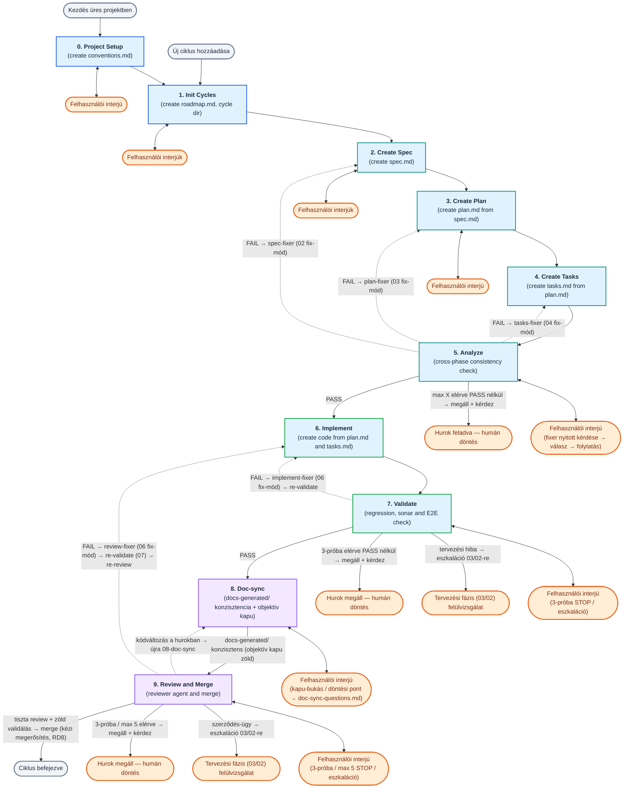
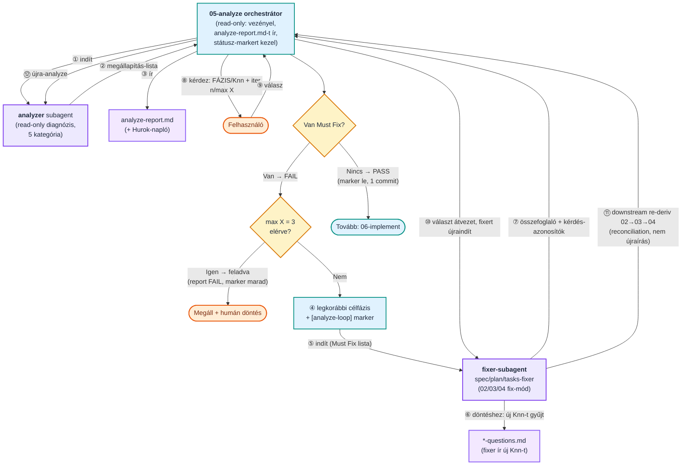
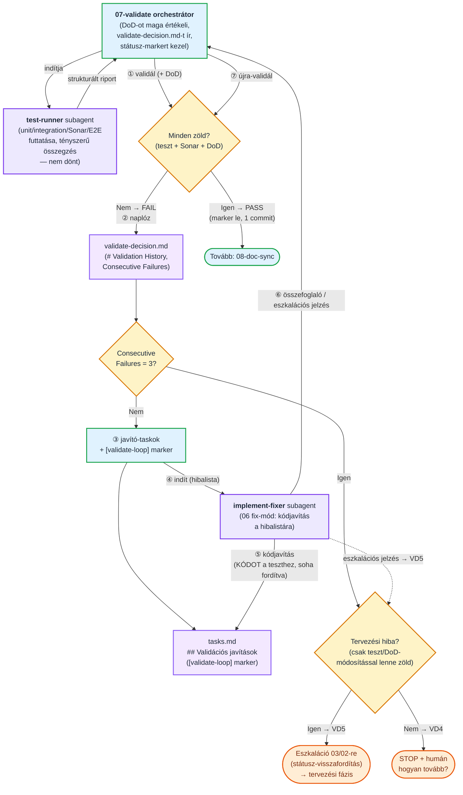
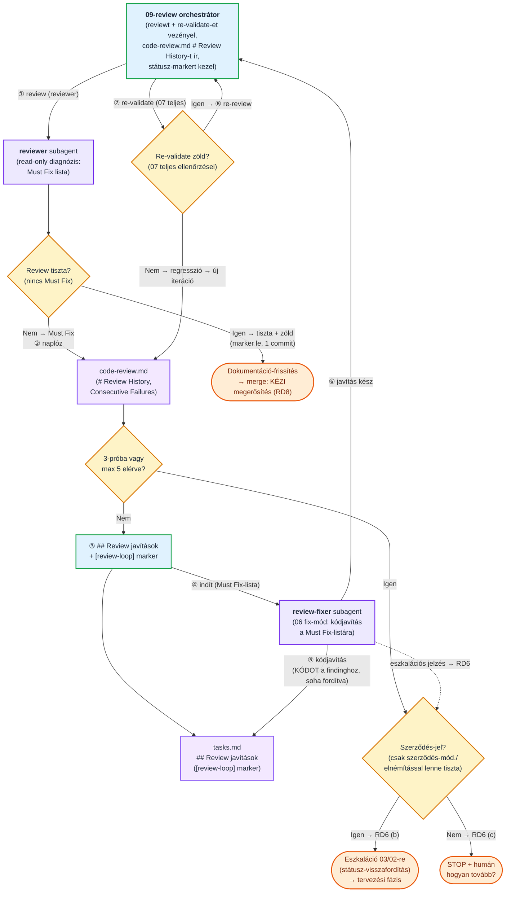

```text
    ╔══════════════════════════════════════════════════════════════════════╗
    ║                                                                      ║
    ║   ██████╗ ███████╗██████╗ ██╗  ██╗██╗███████╗██████╗ ███████╗ ██████╗║
    ║   ██╔══██╗██╔════╝██╔══██╗██║ ██╔╝██║██╔════╝██╔══██╗██╔════╝██╔════╝║
    ║   ██████╔╝█████╗  ██████╔╝█████╔╝ ██║███████╗██████╔╝█████╗  ██║     ║
    ║   ██╔══██╗██╔══╝  ██╔══██╗██╔═██╗ ██║╚════██║██╔═══╝ ██╔══╝  ██║     ║
    ║   ██████╔╝███████╗██║  ██║██║  ██╗██║███████║██║     ███████╗╚██████╗║
    ║   ╚═════╝ ╚══════╝╚═╝  ╚═╝╚═╝  ╚═╝╚═╝╚══════╝╚═╝     ╚══════╝ ╚═════╝║
    ║                                                                      ║
    ╚══════════════════════════════════════════════════════════════════════╝
```

<!-- TOC -->

- [Berki-spec](#berki-spec)
  - [1. Két fejlesztési út — válassz a feladat mérete szerint](#1-két-fejlesztési-út--válassz-a-feladat-mérete-szerint)
  - [2. Installáció](#2-installáció)
    - [Telepítés lépései:](#telepítés-lépései)
    - [Támogatott platformok és ágensek:](#támogatott-platformok-és-ágensek)
    - [Hogyan lehet használni?](#hogyan-lehet-használni)
  - [3. Quick start](#3-quick-start)
    - [A keretrendszer működési elve:](#a-keretrendszer-működési-elve)
    - [Két fejlesztési út:](#két-fejlesztési-út)
    - [Alapvető parancsok (Slash Commands):](#alapvető-parancsok-slash-commands)
  - [4. Mappastruktúra](#4-mappastruktúra)
  - [5. Teljes berki spec flow (00–09)](#5-teljes-berki-spec-flow-0009)
    - [5.1 Magas szintű összefoglalás](#51-magas-szintű-összefoglalás)
    - [5.2 Részletes folyamat](#52-részletes-folyamat)
    - [5.3 Modellek és effort-szintek automatikus választása](#53-modellek-és-effort-szintek-automatikus-választása)
    - [5.4 Az 05-analyze önjavító hurok (részletes)](#54-az-05-analyze-önjavító-hurok-részletes)
    - [5.5 Az 07-validate önjavító hurok (részletes)](#55-az-07-validate-önjavító-hurok-részletes)
    - [5.6 Az 09-review önjavító hurok (részletes)](#56-az-09-review-önjavító-hurok-részletes)
    - [5.7 Önjavító hurkok (analyze + validate + review) — közös konvenciók](#57-önjavító-hurkok-analyze--validate--review--közös-konvenciók)
    - [5.8 Példa prompt-folyam (egy ciklus végigvezetése)](#58-példa-prompt-folyam-egy-ciklus-végigvezetése)
  - [6. Egyszerűsített (lightweight) flow](#6-egyszerűsített-lightweight-flow)
    - [6.1 Folyamatábra](#61-folyamatábra)
    - [6.2 A három fázis röviden](#62-a-három-fázis-röviden)
    - [6.3 Két beépített kör-megszakító](#63-két-beépített-kör-megszakító)
    - [6.4 Opcionális ágensek (mind read-only, egyik sem kötelező)](#64-opcionális-ágensek-mind-read-only-egyik-sem-kötelező)
    - [6.5 Indító prompt (copy-paste)](#65-indító-prompt-copy-paste)
    - [6.6 Példa prompt](#66-példa-prompt)
  - [7. Skill-index](#7-skill-index)
  - [8. Agent-index](#8-agent-index)
  - [9. Frontmatter séma](#9-frontmatter-séma)
  - [10. conventions.md — Projekt konvenciók](#10-conventionsmd--projekt-konvenciók)
  - [11. Egy ciklus artifact fájljai](#11-egy-ciklus-artifact-fájljai)
    - [11.1 Fázisok közötti átadás (`*-input-from-prev.md`)](#111-fázisok-közötti-átadás-input-from-prevmd)
  - [12. docs-generated/ — élő dokumentáció (a 08-doc-sync gazdája)](#12-docs-generated--élő-dokumentáció-a-08-doc-sync-gazdája)
    - [12.1 specs/test-conventions.md — visszatérő teszt-elvárások és receptek (TC1–TC8)](#121-specstest-conventionsmd--visszatérő-teszt-elvárások-és-receptek-tc1tc8)
    - [12.2 export/ — verziózott PDF export (/bs-export-doc)](#122-export--verziózott-pdf-export-bs-export-doc)
  - [13. Kérdéskezelés (spec-questions.md / plan-questions.md / tasks-questions.md / doc-sync-questions.md)](#13-kérdéskezelés-spec-questionsmd--plan-questionsmd--tasks-questionsmd--doc-sync-questionsmd)
  - [14. Egységes `Kész` státusz-lifecycle](#14-egységes-kész-státusz-lifecycle)
  - [15. Sonar minőségellenőrzés](#15-sonar-minőségellenőrzés)
  - [16. Döntési napló (imp-decision.md)](#16-döntési-napló-imp-decisionmd)
  - [17. Validációs napló (validate-decision.md)](#17-validációs-napló-validate-decisionmd)
  - [18. Reviewer agent (agents/reviewer.md)](#18-reviewer-agent-agentsreviewermd)
  - [19. Ágens-specifikus integráció](#19-ágens-specifikus-integráció)
    - [19.1 Antigravity CLI (Google DeepMind)](#191-antigravity-cli-google-deepmind)
      - [17.1.1 Tervezési és naplózási folyamat (Planning Mode)](#1711-tervezési-és-naplózási-folyamat-planning-mode)
      - [17.1.2 Jogosultságok kezelése (Permissions)](#1712-jogosultságok-kezelése-permissions)
      - [17.1.3 Skillek és Ágensek indítása (TUI használat)](#1713-skillek-és-ágensek-indítása-tui-használat)
    - [19.2 Codex CLI (OpenAI)](#192-codex-cli-openai)

<!-- /TOC -->


# Berki-spec

**Berki-spec** egy **spec-driven development (SDD)** keretrendszer AI-ágensekkel való szoftverfejlesztéshez. A munkát önállóan tesztelhető **ciklusokra** bontja, és minden ciklust ugyanazon a fegyelmezett úton vezet végig — a követelmény rögzítésétől (`spec`) a technikai terven (`plan`) és a feladatlistán (`tasks`) át az implementációig, a validálásig és a merge-ig. A folyamat két építőelemből áll: **skillek** (fázis-receptek, amelyeket a fő ágens futtat) és **ágensek** (dedikált, `Task tool` subagentként hívott specialisták).

**Mitől más, mint a piacon lévő SDD eszközök?**

A legtöbb SDD sablon egyetlen, merev „spec → terv → kód" fonalat ad. A Berki-spec ennél tovább megy — a különbség nem a fázisokban van, hanem abban, hogy **mi történik, amikor a valóság eltér a tervtől**:

- **Adaptív, kétsebességes flow.** Nagy feladatra a teljes (00–09) folyamat a minőségi kapuival; kis, jól körülhatárolt feladatra egy egyszerűsített háromfázisú út (`spec → task → implementáció`). A kettő **menet közben átjárható** — nincs felesleges ceremónia egy konfigurációs módosításhoz, és nincs alultervezés egy komplex funkciónál.
- **Önjavító minőségi hurkok, anti-„csalás" fegyelemmel.** Az `analyze`, `validate` és `review` fázis nemcsak *jelzi* a hibát, hanem levezényelt hurokban **automatikusan javítja** is. A kulcsszabály: a **kód igazodik a szerződéshez** (teszt / DoD / review-finding), **soha nem fordítva** — a hurok nem lazítja a tesztet, hogy zöld legyen. Ha valami csak a szerződés módosításával lenne megoldható, **felfelé eszkalál** a tervezési fázisba, ember elé.
- **Élő, „as-built" dokumentáció drift-követéssel.** A `docs-generated/` ciklusról ciklusra szinkronban marad a kóddal, egy **objektív konzisztencia-kapun** átvezetve, és külön nyilvántartja a megvalósult rendszer **eltéréseit a HLD/LLD szándéktól** (design-drift). A dokumentáció nem avul el csendben.
- **Megszakítás-biztos, bárhol folytatható.** Minden fázis fájlban tartja az állapotát és a nyitott kérdéseit (a listából **soha nem törlünk**, csak `[x]`-elünk), státusz-markerekkel — egy új session pontosan onnan folytatja, ahol abbamaradt.
- **Emberi kapuk a döntéseknél.** A fázisváltások **explicit jóváhagyáshoz** kötöttek: az ágens javasol és indokol, de nem „szalad el" — a scope- és irányválasztás a fejlesztőé marad.
- **Eszközfüggetlen, egyetlen forrásból.** Ugyanaz a skill/ágens definíció (single source of truth) fut Claude Code, Cursor, Antigravity és Codex alatt is.
- **Gyenge/olcsó modellekre optimalizálva.** Determinisztikus védőhálók (szűkített fix-mód belépők, kötelező ellenőrzőlisták, egyszerre egy kérdés) csökkentik a hibázás esélyét akkor is, ha nem a legerősebb modell hajtja.
- **Maximális token-megtakarítás — feladatarányos modell- és reasoning-szint-választás.** Minden lépés a hozzá **elégséges legolcsóbb ágensen** fut, **két független tengelyen** hangolva: a *modell* (melyik modell) és az *effort* (mennyi reasoning/thinking-token). A legdrágább (Opus-osztályú) modellt **egyetlen** pont kapja: a legkritikusabb reasoning, az `analyzer` konzisztencia-diagnózisa. A pontos hibalistát célzottan javító fixerek és a mechanikus futtatók **alacsony efforton** dolgoznak (a `default` modellen is), mert nekik nem kell felfedezniük a problémát. A kódkeresést, teszt-futtatást és a determinisztikus lépéseket olcsó subagentek és scriptek végzik, a fő kontextust óvva. A teljes leosztást lásd az [5.3 szekcióban](#53-modellek-és-effort-szintek-automatikus-választása).

## 1. Két fejlesztési út — válassz a feladat mérete szerint

A felhasználónak **két útja** van; a feladat súlya dönti el, melyik a megfelelő:

1. **Teljes berki spec flow (00–09 fázis)** — a nagyobb, összetettebb fejlesztésekhez. Külön `spec.md` → `plan.md` → `tasks.md` dokumentumok, kereszt-fázisos `analyze`, `validate`, `doc-sync` és `review` minőségi kapukkal és önjavító hurkokkal. Üres projektnél a `00-init-project`, új ciklusnál a `01-add-cycles` skillel indul. Ezt írja le a README többi része.

2. **Egyszerűsített (lightweight) flow** — kis, jól körülhatárolt feladatokhoz, amelyek 3-4 lépésben megoldhatók (pl. **konfiguráció összeállítása**, **egyszerűbb script megírása**, kisebb javítás). Egyetlen háromfázisú recept: `spec.md` → `task.md` → implementáció, a `/bs-quick-flow` skillben. Nincs külön plan/bs-analyze/bs-validate/bs-doc-sync fázis; az opcionális ágenseket (`researcher`, `analyzer`, `reviewer`) csak akkor hívja, ha tényleg segítenek.

**Hogyan dönts?**

| Jellemző | Egyszerűsített flow | Teljes berki spec flow |
|---|---|---|
| Tipikus feladat | konfiguráció, egyszerű script, kisebb javítás | új funkció, több komponens, összetett logika |
| Méret | 3-4 lépésben megoldható | önálló, vertikálisan vágható ciklus(ok) |
| Dokumentumok | `spec.md` + `task.md` | `spec.md` + `plan.md` + `tasks.md` |
| Minőségi kapuk | inline + opcionális ágensek | `analyze` / `validate` / `doc-sync` / `review` hurkok |
| Belépő | `/bs-quick-flow` | `/bs-init-project` / `/bs-add-cycles` |

**Alapértelmezett flow:** a projekt jellegét a `00-init-project` fázisban tisztázzuk (termékfejlesztés vs. konfiguráció/scriptelés), és ez alapján egy **default flow** kerül a `conventions.md` `## Fejlesztési módszertan` szekciójának **Alapértelmezett flow** mezőjébe. Ez a kiindulópont — feladatonként felülbírálható.

A két út **átjárható**: ha az egyszerűsített flow közben kiderül, hogy a feladat túlnő rajta (nagyobb kódírás, több komponens, összetett tervezés), a skill megállítja a munkát és **átirányít a teljes folyamatra** (`01-add-cycles`). Fordítva is: a `01-add-cycles` és a `03-write-plan` jelzi, ha a feladat túl egyszerű a teljes ciklushoz, és javasolja az egyszerűsített flow-t.

## 2. Installáció

A BerkiSpec keretrendszer beállítása a célprojektben rendkívül egyszerű és automatizált a mellékelt telepítő script segítségével.

### Telepítés lépései:
1. Nyiss meg egy terminált a `berkispec` repository gyökerében.
2. Futtasd a telepítő scriptet:
   * **Linux/macOS:**
     ```bash
     ./install.sh
     ```
   * **Windows (PowerShell):**
     ```powershell
     .\install.ps1
     ```
3. A script interaktív módon üdvözöl, és bekéri a célprojekted gyökérmappáját.
   * *Tipp:* Az útvonal beírása közben a **Tab** billentyűvel automatikusan kiegészítheted a mappaneveket, míg a **Tab kétszeri megnyomásával** kilistázhatod az aktuális könyvtár tartalmát.
4. Válaszd ki az általad használt AI agent platformot (1–6).

### Támogatott platformok és ágensek:
A keretrendszer öt népszerű fejlesztő platformra képes beállítani a környezetet:

1. **Google Antigravity CLI:**
   * A projekt gyökerében létrehozza a `.agents/` konfigurációs mappát.
   * Az ágenseket a `.agents/agents/<név>/agent.json` mappaszerkezetbe, a skilleket pedig a `.agents/skills/bs-<név>/SKILL.md` könyvtárba linkeli be.
2. **Claude Code:**
   * A projekt gyökerében létrehozza a `.claude/` konfigurációs mappát.
   * Az ágenseket a `.claude/agents/<név>.md` (Markdown) formátumban linkeli be, a skilleket pedig a `.claude/skills/bs-<név>/SKILL.md` alá.
3. **Cursor (Agent CLI):**
   * A projekt gyökerében létrehozza a `.cursor/` konfigurációs mappát.
   * A subagenteket a `.cursor/agents/<név>.md` (Markdown) formátumban linkeli be (a read-only agentek `readonly: true`-t kapnak), a skilleket pedig a `.cursor/skills/bs-<név>/SKILL.md` alá.
4. **GitHub Copilot (CLI & IDE):**
   * A projekt gyökerében létrehozza a `.github/` konfigurációs mappát.
   * Az ágenseket a `.github/agents/<név>.agent.md` fájlként linkeli be, a skilleket pedig globális utasításokként a `.github/instructions/bs-<név>.instructions.md` fájlba rendezi.
5. **Codex CLI:**
   * A subagenteket a `.codex/agents/<név>.toml` **TOML** fájlokként hozza létre (natív `model` + `model_reasoning_effort` mezőkkel; a read-only agentek `sandbox_mode = "read-only"`-t kapnak).
   * A skilleket a `.agents/skills/bs-<név>/SKILL.md` alá helyezi — a Codex a projekt-szintű skilleket innen olvassa.
   * ⚠️ **Figyelem:** a Codex és az Antigravity **közös** `.agents/skills/` mappát használ, ezért egy projektbe a kettő közül csak az egyik telepíthető. A telepítő figyelmeztet és rákérdez, ha a másik már jelen van.

### Hogyan lehet használni?
A telepítés után az adott platform automatikusan beolvassa a symlinkelt definíciókat:
* **Google Antigravity CLI / Claude Code / Cursor Agent CLI / Codex CLI:** Indítsd el a CLI-t a célprojekt mappájában (Cursornál az `agent` paranccsal). A chat felületen a `/` (per) karakter leütésével előhívhatod a skillek listáját. Mindegyik skill egységesen a `berkispec - <fázis>: <leírás>` névvel fog megjelenni, így azonnal láthatod az SDD lépések sorrendjét és célját. Kezdéshez hívd meg a `bs-init-project` skillt! (Codexnél a subagenteket a `/agent` paranccsal listázhatod/válthatsz köztük.)
* **GitHub Copilot:** A Copilot Chat ablakában vagy a Copilot CLI-ben a `@` szimbólummal (pl. `@bs-init-project`) tudod közvetlenül aktiválni a kívánt fázis utasításait.

---


## 3. Quick start

A BerkiSpec egy fegyelmezett, spec-driven development (SDD) keretrendszer AI-ágensekkel való páros programozáshoz.

### A keretrendszer működési elve:
* **Ciklusok (Cycles):** A fejlesztést jól körülhatárolt, egyértelmű céllal leírható, könnyen kézben tartható egységekre (ciklusokra) osztjuk. Minden új ciklus saját Git branch-et kap, és a ciklus összes tervezési és naplózási dokumentuma a projekt gyökerében lévő `specs/cycle-NN-<cycle-name>/` mappába kerül.
* **Fázisok (Phases):** Minden ciklus szigorú fázisokra van bontva, amelyek végigvezetik a folyamatot a követelményektől a megvalósításig és a merge-ig.

### Két fejlesztési út:
A feladat összetettségétől függően kétféle flow áll rendelkezésre:
1. **Teljes SDD Flow:** Részletes specifikációt (`spec.md`), technikai tervet (`plan.md`) és feladatlistát (`tasks.md`) készít, valamint automatikus önjavító minőségi hurkokat (analyze, validate, review) futtat.
2. **Könnyű (Lightweight) Flow:** Kisebb módosításokhoz, konfigurációkhoz vagy egyszerű scriptekhez. Egy lépésben fut le, nincs külön fázisbontása.

### Alapvető parancsok (Slash Commands):
A telepítés után a platform chat felületén a `/` karakter leütésével érheted el a skilleket:

* **`/bs-init-project`**: A projekt legelső inicializálása (létrehozza a `conventions.md` fájlt).
* **`/bs-add-cycles`**: Új fejlesztési ciklus hozzáadása az ütemtervhez (`roadmap.md`).
* **`/bs-write-spec`**: Követelmények rögzítése, új ciklus specifikációjának elkészítése (`spec.md` + `spec-questions.md`).
* **`/bs-write-plan`**: Részletes technikai megvalósítási terv kidolgozása (`plan.md` + `plan-questions.md`).
* **`/bs-write-tasks`**: A technikai terv lebontása mérhető feladatokra (`tasks.md` + `tasks-questions.md`).
* **`/bs-analyze`**: Kereszt-fázisos konzisztencia-ellenőrzés és automatikus javítás (spec/plan/tasks egyezés).
* **`/bs-implement`**: Tényleges kódfejlesztés a feladatlista alapján, a haladás rögzítésével a `tasks.md`-ben.
* **`/bs-validate`**: Tesztek, lint és build ellenőrzése, automatikus javító hurokkal (sikeres futtatás után 'Kész' státusz).
* **`/bs-doc-sync`**: Az élő dokumentáció (`docs-generated/`) és README-k szinkronizálása a kódváltozásokkal, valamint a `specs/test-conventions.md` (visszatérő teszt-elvárások és receptek) karbantartása.
* **`/bs-review-and-merge`**: Automatikus kódreview (reviewer agent) és a branch beolvasztása (merge).
* **`/bs-cycle-status`**: Ciklusok státuszának ellenőrzése (interaktív TUI vagy parancssori státusz).
* **`/bs-quick-flow`**: Az egyszerűsített (lightweight) flow elindítása kis feladatokhoz (spec → task → implementáció).
* **`/bs-export-doc`**: Verziózott PDF export a markdown doksikból (mermaid ábrákkal együtt) az `export/` mappába — paraméter nélkül az `architecture.md`-ből és a `system-overview.md`-ből.

---


## 4. Mappastruktúra

```
berkispec/                            # repo gyökér
├── README.md                         # ez a fájl (a keretrendszer dokumentációja)
└── prompts/
    ├── skills/                       # Fázis-skillek (00–09) — a fő ágens futtatja
    │   ├── 00-init-project.md
    │   ├── 01-add-cycles.md
    │   ├── 02-write-spec.md
    │   ├── 03-write-plan.md
    │   ├── 04-write-tasks.md
    │   ├── 05-analyze.md             # kereszt-fázisos konzisztencia ellenőrzés
    │   ├── 06-implement.md
    │   ├── 07-validate.md
    │   ├── 08-doc-sync.md            # élő dokumentáció-szinkron (docs-generated/)
    │   ├── 09-review-and-merge.md
    │   ├── 10-cycle-status.md        # ciklusok státuszának ellenőrzése (interaktív TUI vagy közvetlen)
    │   ├── quick-flow.md   # egyszerűsített, háromfázisú flow kis feladatokhoz (spec→task→implement)
    │   └── export-doc.md            # verziózott PDF export a markdown doksikból (mermaid ábrákkal)
    ├── agents/                       # Specialista ágensek (Task tool subagent-ként hívva)
    │   ├── reviewer.md               # code review a 09 fázisban
    │   ├── analyzer.md               # kereszt-fázisos elemzés (read-only diagnózis) a 05 fázisban
    │   ├── researcher.md             # kódbázis-/dokumentum-kutatás (00/01/02/03/06) — legolcsóbb tier
    │   ├── test-runner.md            # tesztek/Sonar/E2E mechanikus futtatása a 07 (+ 09 re-validate) fázisban — default tier (szándékosan nem a legolcsóbb, lásd 5.3)
    │   ├── doc-sync-planner.md       # 08 doc-sync: read-only tervkészítő diagnoszta (doc-sync-plan.md + kész csereszöveg-patch)
    │   ├── spec-fixer.md             # 05 önjavító hurok: 02 fix-mód belépő (vékony wrapper)
    │   ├── plan-fixer.md             # 05 önjavító hurok: 03 fix-mód belépő (vékony wrapper)
    │   ├── tasks-fixer.md            # 05 önjavító hurok: 04 fix-mód belépő (vékony wrapper)
    │   ├── implement-fixer.md        # 07 önjavító hurok: 06 fix-mód belépő (vékony wrapper)
    │   ├── review-fixer.md           # 09 önjavító hurok: 06 fix-mód belépő (vékony wrapper)
    │   └── gemini-agent/             # Antigravity-specifikus agent.json másolatok (per-agent almappa)
    ├── shared/                       # Skillek közötti megosztott szövegblokkok (build-time inline)
    │   ├── git-preflight.md          # közös git-preflight (no-VCS kapu, munkafa-ellenőrzés, branch-nyitó preflight); a telepítő a hivatkozó skillekbe beágyazza
    │   └── input-from-prev.md        # közös fázis-átadás leírás (*-input-from-prev.md, IP1); a 01/02/03/04/07 hivatkozza
    ├── templates/                    # jövőbeli sablonok
    ├── scripts/                      # automatizációs scriptek (a telepítő minden *.py-t átmásol a célprojektbe)
    │   ├── install-helper.py         # a telepítő motorja (modell- + effort-hozzárendelés, fájlmásolás) — NEM kerül a célprojektbe
    │   ├── cycle-status.py           # a 10-cycle-status skill futtató scriptje
    │   ├── ds22-gate-check.py        # a 08-doc-sync DS22 Réteg 1 magkapuja (determinisztikus, LLM nélkül)
    │   ├── tc8-gate-check.py         # a 08-doc-sync TC8 kapuja a specs/test-conventions.md-re (determinisztikus)
    │   ├── failure-counter.py        # a 07/09 hurok futás-naplója + per-item 3-próba számláló (determinisztikus)
    │   └── export-doc.py             # a bs-export-doc skill futtató scriptje (pandoc + mermaid-filter → verziózott PDF)
    ├── models.json                   # modell- + effort-konfiguráció platformonként (tier→{model,effort} + per-agent felülírás; lásd 5.3)
    ├── meta-improve-prompts.md       # prompt-fejlesztési meta-sablon
    ├── inprove-list.md               # prompt-fejlesztési lista
    ├── inprove-list2.md              # prompt-fejlesztési lista (folytatás)
    └── inprove-list3.md              # prompt-fejlesztési lista (ciklus = branch a 01 fázisban)
```

> A `specs/`, `docs-generated/` és a forráskód (`src/`, `apps/`, …) **nem** ebben a repóban él — ezeket a keretrendszer akkor hozza létre, amikor egy tényleges projektben használod (lásd a „docs-generated/ — élő dokumentáció" szekciót).

> A `docs-generated/` mappa (a projekt gyökerében, nem a `prompts/` alatt) a `08-doc-sync` fázis által karbantartott **élő, generált dokumentáció** otthona: `system-overview.md` (as-built működésleírás), `architecture.md`, `CHANGELOG.md`, `design-drift.md` és a mappa-index `README.md`. Részletes leírás lent, a „docs-generated/ — élő dokumentáció" szekcióban.

**Skill vs ágens:**
- **Skill** = recept. A `00–09` fázis-promptok statikus módszertanok: leírják a fő ágensnek a HOGYAN-t. Mindig a felhasználó által indított fő ágens futtatja őket.
- **Ágens** = specialista végrehajtó. Az `agents/` alatti fájlok dedikált rendszerpromptok, amelyeket egy skill futás közben **Task tool subagent-ként** indít el (kontextus-őrzés végett).

---

## 5. Teljes berki spec flow (00–09)

Ez a fejezet a **teljes, sokfázisú** fejlesztési utat írja le a folyamatábráival — a projekt-setuptól (00–01) a per-ciklus loopon át (02–09) a merge-ig, az önjavító hurkokkal együtt. A **másik utat**, az egyszerűsített háromfázisú flow-t lentebb, az „Egyszerűsített (lightweight) flow" fejezet részletezi.

> **Kód-jelölések:** a szövegben a `DS`/`VD`/`RD`/`LC`/`SK` + szám alakú kódok (pl. `DS22`, `RD6`, `LC1`) a skill-fájlok belső szabály-azonosítói. A részletes definíciójuk az adott skillben él; itt csak visszakereshető horgonyként szerepelnek, a README megértéséhez nem kell feloldani őket.

### 5.1 Magas szintű összefoglalás

Ez a diagram összefoglalja a 00–09 fázisok egymás utáni folyamatát, a kezdőpontokat, az interjú loopokat és a hibajavítási visszacsatolásokat.



### 5.2 Részletes folyamat

Az alábbi részletes ábra bemutatja az egyes fázisok közötti pontos átmeneteket, a bemeneti/kimeneti fájlokat, a felhasználói interakciós pontokat (User Input), valamint a hibák esetén fellépő visszacsatolási loopokat.

```mermaid
flowchart TD
    %% Styling definitions
    classDef setup fill:#e0f2fe,stroke:#2563eb,stroke-width:2px,color:#1e293b;
    classDef design fill:#e0f2fe,stroke:#0d9488,stroke-width:2px,color:#1e293b;
    classDef dev fill:#e0f2fe,stroke:#16a34a,stroke-width:2px,color:#1e293b;
    classDef decision fill:#fef3c7,stroke:#d97706,stroke-width:2px,color:#1e293b;
    classDef doc fill:#f3e8ff,stroke:#8b5cf6,stroke-width:2px,color:#1e293b;
    classDef userInput fill:#ffedd5,stroke:#ea580c,stroke-width:2px,color:#7c2d12;

    subgraph Setup ["<b>⚙️ PROJEKT SETUP (EGYSZER)</b>"]
        P00["00 — Projekt inicializálás"]:::setup
        P00_Loop{"Vannak még kérdések?"}:::decision
        DocConv["conventions.md"]:::doc
        In00(["User Input: Projekt célok & válaszok"]):::userInput

        P01["01 — Ciklusok kezelése"]:::setup
        P01_Loop{"Vannak még nyitott kérdések?"}:::decision
        DocRoadmap["specs/roadmap.md (Státusz: Kész)"]:::doc
        In01(["User Input: HLD/LLD vagy leírás"]):::userInput
    end

    subgraph Design ["<b>📐 TERVEZÉSI FÁZIS (CIKLUSONKÉNT)</b>"]
        P02["02 — Spec írás"]:::design
        P02_Loop{"Vannak még kérdések? (spec-questions.md)"}:::decision
        DocSpec["specs/cycle-NN-*/spec.md (Státusz: Tervezésre kész)"]:::doc
        In02(["User Input: Ciklus választás & spec válaszok"]):::userInput

        P03["03 — Plan írás"]:::design
        P03_Loop{"Vannak még kérdések? (plan-questions.md)"}:::decision
        DocPlan["specs/cycle-NN-*/plan.md (Státusz: Task írásra kész)"]:::doc
        In03(["User Input: Tervezési válaszok"]):::userInput

        P04["04 — Tasks írás"]:::design
        DocTasks["specs/cycle-NN-*/tasks.md (Státusz: Implementálásra kész)"]:::doc

        P05["05 — Analyze"]:::design
        P05_Check{"Konzisztens? (analyze-report.md)"}:::decision
        DocAnalyze["specs/cycle-NN-*/analyze-report.md (PASS/FAIL)"]:::doc
    end

    subgraph Development ["<b>💻 IMPLEMENTÁCIÓ & ELLENŐRZÉS (ITERATÍV)</b>"]
        P06["06 — Implementálás"]:::dev
        P06_Loop["Kód fejlesztése + tasks.md haladás rögzítése"]:::dev
        DocTasksReady["specs/cycle-NN-*/tasks.md (Státusz: Validálásra kész)"]:::doc
        In06(["User Input: Ciklus implementációs indítása"]):::userInput

        P07["07 — Validálás"]:::dev
        P07_Run{"Tesztek & SonarQube futtatása<br/>(test-runner subagent)"}:::decision
        DocReport["specs/cycle-NN-*/test-report/ (validate-decision.md / sonar-report.md / integration / playwright)"]:::doc
        P07_Check{"Sikeres? (PASS)"}:::decision

        P08["08 — Doc-sync"]:::dev
        P08_Plan["doc-sync-planner subagent<br/>→ doc-sync-plan.md (per-fájl terv<br/>+ kész csereszöveg-patch)"]:::doc
        DocGen["docs-generated/ (system-overview, architecture, CHANGELOG, design-drift, README)"]:::doc
        P08_Gate{"Objektív konzisztencia-kapu zöld?<br/>(DS22 — ds22-gate-check.py<br/>+ TC8 — tc8-gate-check.py)"}:::decision

        P09["09 — Review és Merge"]:::dev
        P09_Review{"Automatikus code review (reviewer subagent)"}:::decision
        DocReview["specs/cycle-NN-*/code-review.md"]:::doc
        P09_Check{"Kritikus hiba (Must Fix)?"}:::decision

        Merge["Merge (lokális squash vagy PR, a conventions.md Merge stratégiája szerint)"]:::setup
        In08(["User Input: Merge megerősítés"]):::userInput
    end

    %% Connections
    Start([Kezdés]) --> P00

    %% User Inputs
    In00 --> P00
    In01 --> P01
    In02 --> P02
    In03 --> P03
    In06 --> P06
    In08 --> Merge

    P00 --> P00_Loop
    P00_Loop -- "Igen" --> P00
    P00_Loop -- "Nem (Lezárva)" --> DocConv
    DocConv --> P01

    P01 --> P01_Loop
    P01_Loop -- "Igen" --> P01
    P01_Loop -- "Nem (Kész)" --> DocRoadmap

    DocRoadmap --> P02
    P02 --> P02_Loop
    P02_Loop -- "Igen" --> P02
    P02_Loop -- "Nem" --> DocSpec

    DocSpec --> P03
    P03 --> P03_Loop
    P03_Loop -- "Igen" --> P03
    P03_Loop -- "Nem" --> DocPlan

    DocPlan --> P04
    P04 --> DocTasks

    DocTasks --> P05
    P05 --> DocAnalyze
    DocAnalyze --> P05_Check

    %% Analyze önjavító hurok (05)
    P05_Check -- "FAIL" --> P05_Fixer["fixer-subagent<br/>(02/03/04 fix-mód, [analyze-loop])"]:::design
    P05_Fixer -- "fixer nyitott kérdést gyűjt<br/>(*-questions.md)" --> P05_Q(["User Input: FÁZIS/Knn válasz<br/>(orchestrátor kérdezi)"]):::userInput
    P05_Q --> P05_Fixer
    P05_Fixer -- "downstream re-deriválás<br/>02→03→04 (reconciliation)" --> P05
    P05_Check -- "max X=3 elérve PASS nélkül" --> P05_Stop["Hurok feladva → analyze-report FAIL<br/>(marker marad) + humán döntés"]:::doc
    P05_Check -- "PASS (marker le, 1 commit)" --> P06

    P06 --> P06_Loop
    P06_Loop --> DocTasksReady

    DocTasksReady --> P07
    P07 --> P07_Run
    P07_Run --> DocReport
    DocReport --> P07_Check

    %% Validate önjavító hurok (07)
    P07_Check -- "FAIL (Nem)" --> P07_Fixer["implement-fixer subagent<br/>(06 fix-mód, [validate-loop])<br/>## Validációs javítások"]:::dev
    P07_Fixer -- "javítás kész → re-validate" --> P07
    P07_Fixer -. "eszkalációs jelzés (VD5)" .-> P07_Esc
    P07_Check -- "3-próba elérve (Consecutive=3)<br/>megrekedt kód-bug" --> P07_Stop["Hurok megáll → STOP + humán<br/>([validate-loop] marker + ## Validációs javítások marad)"]:::doc
    P07_Check -- "tervezési hiba (VD5):<br/>csak teszt/DoD-módosítással lenne zöld" --> P07_Esc["Eszkaláció: státusz-visszafordítás<br/>03/02-re → tervezési fázis"]:::doc
    P07_Esc --> P03

    %% Validation Pass
    P07_Check -- "PASS (Igen)" --> DocStatusKesz["spec.md, plan.md, tasks.md státusza: Kész"]:::doc
    DocStatusKesz --> P08

    %% Doc-sync (08): terv → mechanikus végrehajtás → objektív kapu (NEM önjavító subagent-hurok)
    P08 --> P08_Plan
    P08_Plan --> DocGen
    DocGen --> P08_Gate
    P08_Gate -. "kapu-bukás / döntési pont → doc-sync-questions.md<br/>(ember-vezérelt javítás, DS10)" .-> P08DS_Q(["User Input: doc-sync kérdés / javítás"]):::userInput
    P08DS_Q --> P08_Plan
    P08_Gate -- "kapu zöld → docs-generated/ konzisztens" --> P09

    P09 --> P09_Review
    P09_Review --> DocReview
    DocReview --> P09_Check

    %% Review önjavító hurok (09) — kétfázisú: fix → re-validate → re-review
    P09_Check -- "Igen (Must Fix)" --> P09_Fixer["review-fixer subagent<br/>(06 fix-mód, [review-loop])<br/>## Review javítások"]:::dev
    P09_Fixer -- "javítás kész → re-validate (07 teljes ellenőrzései)" --> P07_Run2["07 Validálási lépések<br/>(test-runner subagent;<br/>nem indítja a 07 saját hurkát)"]:::dev
    P07_Run2 -- "zöld → re-review" --> P09_Review
    P07_Run2 -. "regresszió → új iteráció" .-> P09_Fixer
    P09_Fixer -. "eszkalációs jelzés (RD6)" .-> P09_Esc
    P09_Check -- "3-próba / max 5 → megrekedt" --> P09_Stop["Hurok megáll → STOP + humán<br/>([review-loop] marker + ## Review javítások marad)"]:::doc
    P09_Check -- "szerződés-ügy (RD6):<br/>csak szerződés-módosítással/elnémítással lenne tiszta" --> P09_Esc["Eszkaláció: státusz-visszafordítás<br/>03/02-re → tervezési fázis"]:::doc
    P09_Esc --> P03

    %% Review Pass — kódváltozás esetén a merge előtt újra 08-doc-sync (DS23.2)
    P09_Check -- "Nem (Tiszta) + zöld validálás" --> P09_DocCheck{"Változott kód a hurokban?"}:::decision
    P09_DocCheck -. "Igen → merge előtt újra-doc-sync" .-> P08
    P09_DocCheck -- "Nem → merge" --> Merge["Merge (kézi megerősítés, RD8)"]
    Merge --> End([Ciklus befejezve])
```



### 5.3 Modellek és effort-szintek automatikus választása

> **Elv: maximális token-megtakarítás.** Minden lépés a hozzá **elégséges legolcsóbb ágensen** fut; a drága modellt és a mély reasoningot csak ott költjük, ahol nélkülözhetetlen. A minőséget nem a modell ereje adja, hanem a **szigorú kontraktusok** (kötelező ellenőrzőlisták, „csak összefoglaló", determinisztikus scriptek).

A hangolás **két független tengelyen** történik:
- **Modell** — *melyik* modell fut (tier: `deep_reasoning_agent` / `default` / `research_agent`).
- **Effort** — *mennyi* reasoning/thinking-tokent éget (`high` / `medium` / `low`).

A kettő **nem esik egybe**: pl. a fixerek a `default` **modellen** futnak, de **`low` efforton**, mert pontos, előre azonosított hibalistát kapnak — nem nekik kell felfedezni a problémát.

**Modell-tier — ki mit kap:**

| Tier (`models.json` kulcs) | Ki kapja | Claude / Antigravity / Copilot / Cursor / Codex | Miért ez a tier |
|---|---|---|---|
| `deep_reasoning_agent` (legdrágább) | **kizárólag** `analyzer` (05) | `claude-opus-4-8` / `Claude Opus 4.6` / `Claude Opus 4.8` / `Opus 4.8` / `gpt-5.6-sol` | Kereszt-fázisos konzisztencia-**diagnózis** (spec/plan/tasks/conventions) — a legmélyebb reasoning; egy itt vétett hiba a legdrágább downstream (rossz diagnózisra rossz kód épül). |
| `default` | **minden más:** orchestrátor-skillek (05, 07…), a 4 fixer (`spec`/`plan`/`tasks`/`implement`-fixer), `reviewer`, `review-fixer`, `doc-sync-planner`, `test-runner` | `claude-sonnet-5` / `Gemini 3.5 Flash` / `Claude Sonnet 5` / `Sonnet 5` / `gpt-5.6-luna` | A fixerek **kész, pontos hibalistát** kapnak (megoldás/eszkaláció, nem felfedezés); az orchestrátorok bookkeeping-et végeznek (marker, számláló, routing) a subagent **kész** jelentése alapján — nem diagnózis. |
| `research_agent` (legolcsóbb) | `researcher` (00/01/02/03/06), `10-cycle-status` skill | `claude-haiku-4-5-20251001` / `Gemini 3.5 Flash` (low) / `Claude Haiku 4.5` / `Haiku 4.5` / `gpt-5.4-mini` | Tiszta grep/glob/read fan-out, ill. determinisztikus script-futtatás — **nulla tervezési ítélet**; a „csak összefoglaló, soha nyers fájltartalom" kontraktus véd. Antigravityn nincs Haiku, ezért itt a `default` Flash modell fut, csak `low` efforton. |

**Effort-leosztás — mennyi reasoning:**

| Effort | Ki kapja | Miért |
|---|---|---|
| `high` (default effort) | `analyzer`, és minden nem-felülírt agent | Nyílt végű felfedezés/diagnózis, ahol a mély reasoning fizet. Ez a **biztonságos alapértelmezés** (a `models.json` `default` effortja). |
| `medium` | `reviewer`, `doc-sync-planner` | Ítéletet igényel, de **kötött szempontlista** mentén (nem nyílt felfedezés). |
| `low` | a 4 fixer + `review-fixer`, `test-runner`, `researcher`, `10-cycle-status` | Pontos hibalistát célzottan javító, ill. tisztán mechanikus munka — a reasoning-mélység itt nem fizet, csak tokent éget. |

**Egy szándékos kivétel:** a `test-runner` mechanikus (tesztek/Sonar/E2E futtatása), mégis `default` **modellen** (nem a legolcsóbbon) fut — a több lépéses Bash-orchesztráció (portütközés, config-visszaállítás) és a projektenként eltérő teszt-/Sonar-kimenet megbízható, **konzisztens tesztnevű** összegzése kritikus: egy elgépelt név csendben elronthatná a 07-hurok per-item 3-próba számlálóját (VD4). (Az effortja viszont `low` — a pontosság formakövetés, nem reasoning-mélység kérdése.)

**Konfiguráció és telepítés:**
- **Forrás:** [`prompts/models.json`](prompts/models.json) — platformonként (`claude` / `antigravity` / `copilot` / `cursor` / `codex`) a 3 tier `{model, effort}` objektumként, plusz a defaulttól eltérő agentek **saját nevű sorként** (csak az `effort` mezővel; a modelljük a `default` tierből jön). Az `install-helper.py` `AGENT_MODEL_KEYS` szótára rendeli az `analyzer`/`researcher`/`10-cycle-status` stemeket a tierekhez; ami nincs sem itt, sem saját sorként a `models.json`-ban, `default` modellt és `default` (=`high`) effortot kap.
- **Beírás telepítéskor** (`./install.sh`): Antigravity → `agent.json` `"model"` + `"effort"` kulcs; Claude Code / Copilot / Cursor → az agent-fájl YAML frontmatter `model` + `effort` mezője; Codex → a `.codex/agents/<név>.toml` `model` + `model_reasoning_effort` kulcsa (+ read-only agenteknél `sandbox_mode = "read-only"`).
- **A skillek** (orchestrátor fő ágensek, nem subagentek) **sem `model`-t, sem `effort`-ot nem kapnak** — egyetlen platformon sem. A skill-szintű `model` ugyanis **nem része az Agent Skills alap-szabványnak** (az csak `name`/`description`/`license`/`compatibility`/`metadata`/`allowed-tools`), hanem Claude Code-kiterjesztés, amit a célplatformokon a modellváltás **nem, vagy nem megbízhatóan** követ:
  - **Codex:** a SKILL.md csak `name` + `description`-t ismer → egy `model` inert.
  - **Copilot:** az `.instructions.md` nem ismer `model` mezőt (az csak *prompt*-fájlnál van) → inert.
  - **Antigravity:** a `model` az *agent* frontmatter mezője, a skillé nem → inert.
  - **Cursor:** a `model`-kiterjesztést legfeljebb részlegesen ismeri → nem garantált.
  - **Claude Code:** a dokumentáció ígéri a skill-`model` váltást, de a valóságban **runtime-ban nem hat** ([anthropics/claude-code #45191](https://github.com/anthropics/claude-code/issues/45191), „not planned"-ként lezárva).
  Mivel egy beírt skill-`model` a legjobb esetben inert, a legrosszabban félrevezető (nem létező képességet sugall), **sehová nem injektáljuk**. A modell-hangolás **kizárólag az agentek/subagentek** szintjén hat megbízhatóan (Claude subagent `model`/`effort`, Codex `.codex/agents/*.toml` `model`/`model_reasoning_effort`) — ott marad meg.
- **Effort natív támogatása:** Claude Code-ban a subagent `effort:` frontmatter-mező, Codexben a `.codex/agents/*.toml` `model_reasoning_effort` mezője **natívan hat** (a fájl értéke elsőbbséget élvez). A többi platformon (Antigravity/Copilot/Cursor) az érték **látható ajánlás** (frontmatter + „Recommended Effort" alert), a Cursor `model` mezője viszont natív. Cursornál a read-only agentek (`analyzer`, `researcher`, `doc-sync-planner`) `readonly: true`-t, Codexnél `sandbox_mode = "read-only"`-t kapnak.
- **Manuális váltás:** ha nem a telepített ágensekre támaszkodsz, kövesd a fenti leosztást a CLI/IDE modell- és effort-választójában.

### 5.4 Az 05-analyze önjavító hurok (részletes)

Ez az ábra **kizárólag az 05-analyze lépést** mutatja be, a subagentek és a kérdés-folyam feltüntetésével. Az orchestrátor (05-analyze) read-only: a **diagnózist** az `analyzer` (ez az egyetlen pont a teljes rendszerben, ami a legdrágább, `deep_reasoning_agent` tier-en fut — lásd 5.3), a **javítást** a fixer-subagentek (02/03/04 fix-mód, `default` tier) végzik; a felhasználót mindig az **orchestrátor** (szintén `default` tier) kérdezi, fázis-jelzéssel.



**A működés lépésről lépésre:**

1. **A subagent gyűjti a kérdést, nem kérdez.** A fixer-subagent (02/03/04 fix-mód) a döntést igénylő pontokat **nem teszi fel közvetlenül a felhasználónak** — nincs interaktív csatornája. Ehelyett új `Knn` bejegyzésként felveszi a megfelelő `*-questions.md`-be (`spec-questions.md` / `plan-questions.md` / `tasks-questions.md`).
2. **És visszaadja az orchestrátornak.** A fixer a futása végén tömör összefoglalót ad: mit javított, és milyen új `Knn` kérdés-azonosítókat vett fel. (Az ábrán: ⑥ gyűjt, ⑦ visszaad.)
3. **Az orchestrátor teszi fel a kérdést a felhasználónak**, mindig jelezve, melyik fázishoz kapcsolódik: **fázis-fejléc + `FÁZIS/Knn` prefix** (pl. `[PLAN · iter 2/3 · PLAN/K05]`). Egyszerre egy kérdés, a válasz végén kattintható link az érintett `*-questions.md`-re.
4. **A válasz átvezetése után a hurok folytatódik:** az orchestrátor beírja a döntést a `*-questions.md`-be (`[x]` + összefoglaló), újraindítja a fixert, majd a downstream re-deriválás (`02→03→04`) és az újra-analyze következik. A kérdés-megállás **nem** számít új iterációnak, és nem fogyaszt a `max X`-ből.

A hurok két, egymástól független módon áll le: **PASS** (nincs több `Must Fix` → marker le, egyetlen commit, tovább a 06-ra), vagy **`max X = 3` elérve PASS nélkül** (a report `FAIL`, a `[analyze-loop]` marker az érintett dokumentumokon marad, az orchestrátor összefoglal és humán döntést kér).

### 5.5 Az 07-validate önjavító hurok (részletes)

Ez az ábra **kizárólag az 07-validate lépést** mutatja be, a subagentek feltüntetésével (a fenti analyze-ábra párja). Az orchestrátor (07) PASS-ig **determinisztikus ellenőrző** — a tesztek/Sonar/E2E tényleges futtatását a **`test-runner` subagent** végzi (`default` tier — mechanikus végrehajtás, nem dönt, de a megbízható log-/riport-értelmezés miatt szándékosan nem a legolcsóbb tier-en fut), a DoD-ot és a PASS/FAIL döntést az orchestrátor hozza —, FAIL esetén **orchestrátor**: a **javítást** az `implement-fixer` subagent (= a 06 fix-módja) végzi, a re-validálást és a döntéseket az orchestrátor.



**A működés lépésről lépésre:**

1. **Az orchestrátor (07) elindítja a `test-runner` subagentet** (tesztek + Sonar + E2E futtatása, `default` tier — csak tényszerű összegzést ad vissza, nem dönt), majd a riport alapján maga értékeli a DoD-ot és dönt PASS/FAIL-ről. PASS → **automatikus** (VD7, nincs megerősítés): a `[validate-loop]` marker lekerül, egyetlen lezáró commit, tovább a 08-ra.
2. **FAIL esetén naplóz** a `# Validation History`-ba — a `failure-counter.py` szkripttel, ami determinisztikusan lépteti az itemenkénti `Consecutive Failures` számlálót és a **kilépő kódjával** jelzi a **3-próba korlátot (VD4)** (`exit 3` = megáll); a megállás típusát a **tervezési-hiba heurisztika (VD5)** dönti el. Nincs külön globális számláló, a beragadt elemet a per-item 3-próba fogja meg.
3. **Ha folytatható:** felveszi a javító-taskokat (`## Validációs javítások`), `[validate-loop]` markert tesz a `tasks.md`-re, és elindítja az `implement-fixer` subagentet (= 06 fix-mód) a konkrét hibalistával.
4. **A fixer a KÓDOT igazítja a teszthez/DoD-hoz (VD3 anti-„teszt-csalás") — SOHA fordítva.** Tilos a teszt gyengítése/skip/törlése, hardcode, DoD-leszállítás. A fixer visszaad: javítás-összefoglaló + (ha van) **eszkalációs jelzés**.
5. **Az orchestrátor újra-validál.** Zöld → PASS (1. pont). FAIL → új iteráció (2. ponttól).
6. **Két megállás a 3-próbánál (a hurok user-érintkezése, VD7):** megrekedt **kód-bug** → STOP + humán (VD4, „hogyan tovább?"); **tervezési hiba** → eszkaláció 03/02-re (VD5, státusz-visszafordítással), átadva a tervezési huroknak — a 06-ban körözés helyett. A fixer eszkalációs jelzése a 3. próba bevárása nélkül is kiválthatja az eszkalációt.

### 5.6 Az 09-review önjavító hurok (részletes)

Ez az ábra **kizárólag az 09-review lépést** mutatja be, a subagentek feltüntetésével (az analyze- és validate-ábra párja). Az orchestrátor (09) a **diagnózist** a `reviewer` (read-only) subagenttel adatja, a **javítást** a `review-fixer` (= 06 fix-mód) végzi; a hurok **kétfázisú** (re-validate → re-review), és a merge-et **kézi megerősítés** zárja (RD8).



**A működés lépésről lépésre:**

1. **Az orchestrátor (09) lefuttatja a `reviewer` subagentet** (read-only diagnózis) → `code-review.md`. Ha nincs `Must Fix` **és** a (re-)validálás zöld → a `[review-loop]` marker lekerül, egyetlen lezáró commit, tovább a merge előtti doc-sync ellenőrzésre és a **kézi megerősítésű** merge-re (RD8).
2. **`Must Fix` esetén naplóz** a `# Review History`-ba — ugyanazzal a `failure-counter.py` szkripttel (`--header "Review History"`), ami determinisztikusan lépteti az itemenkénti `Consecutive Failures`-t; a **per-item 3-próba** (`exit 3`) és a **`max 5` globális backstop** szerint dönt.
3. **Ha folytatható:** felveszi a javító-taskokat (`## Review javítások`), `[review-loop]` markert tesz a `tasks.md`-re, és elindítja a `review-fixer` subagentet (= 06 fix-mód) a konkrét `Must Fix`-listával.
4. **A fixer a KÓDOT igazítja a findinghoz és a tesztekhez (RD4 anti-„csalás") — SOHA fordítva.** Tilos a finding kozmetikai elnémítása, teszt-csalás, a `code-review.md` finding törlése. A fixer visszaad: javítás-összefoglaló + (ha van) **eszkalációs jelzés**.
5. **Kétfázisú továbblépés (RD2):** az orchestrátor előbb **re-validál** (a 07 teljes ellenőrzései — regresszió-fogás; nem indítja a 07 saját hurkát). Zöld → **re-review** (vissza az 1. ponthoz a friss diffen). Regresszió → új iteráció (2. ponttól, a regresszált teszt a megrekedt item).
6. **Megállás (a hurok user-érintkezése):** **szerződés-ügy** (a fixer jelzése, vagy a 3-próba kimerül és csak a szerződés módosításával/elnémítással lenne tiszta) → eszkaláció 03/02-re (RD6 b); egyébként **3-próba / `max 5` kimerült** → STOP + humán (RD6 c). A merge **soha nem automatikus** (RD8).

### 5.7 Önjavító hurkok (analyze + validate + review) — közös konvenciók

Három fázis vezényel önjavító hurkot: az **05-analyze** (a tervezési dokumentumok konzisztenciája), az **07-validate** (a kód helyessége) és az **09-review** (a kód-review). A három hurok ugyanazokra a közös konvenciókra épül, hogy ne csússzanak szét:

- **LC1 — Egységes marker.** A hurok suffix-markerrel jelzi a visszanyitott dokumentum státuszát: analyze → `[analyze-loop]` (a tervezési doksikon), validate → `[validate-loop]` (a `tasks.md`-n), review → `[review-loop]` (a `tasks.md`-n). A marker = a hurok aktív (auto-státusz, megerősítés nélkül), és megszakítás után jelzi, ki nyitotta vissza. Lezáráskor (PASS / tiszta review) lekerül; feladáskor (3-próba / `max X` / `max 5`) marad a megrekedt állapot jelzésére.
- **LC2 — Hurok-napló.** Mindhárom hurok iterációnként naplóz: analyze → `analyze-report.md` Hurok-napló; validate → `validate-decision.md` `# Validation History`; review → `code-review.md` `# Review History`. Innen rekonstruálható a megszakított futás.
- **LC3 — Fixer-wrapper.** A javítást vékony `agents/*-fixer.md` wrapper végzi, amely a megfelelő skill **Fix-mód** szekciójára delegál — nincs logika-duplikáció. Analyze → `spec/plan/tasks-fixer` (= 02/03/04 fix-mód); validate → `implement-fixer` (= 06 fix-mód); review → `review-fixer` (= 06 fix-mód, `## Review javítások` bemenettel).
- **LC4 — Commit a hurok végén.** Egyetlen lezáró commit (PASS / tiszta review vagy feladás), nem iterációnként. A megszakítás-biztonságot a marker + a hurok-napló adja.

**A három hurok különbsége:** az analyze korlátja a globális `max X = 3` iteráció; a validate- és a review-hurké a **per-item 3-próba szabály** (a beragadt elemet fogja meg), a review-nál egy **laza `max 5` globális backstop**-pal kiegészítve. A validate- és a review-hurokban a kód a **szerződéshez (teszt/DoD/finding) igazodik — VD3/RD4 anti-„csalás"** —, és ha egy FAIL/finding csak a szerződés módosításával vagy elnémításával lenne zöld/tiszta, az tervezési/szerződés-ügy: a hurok **felfelé eszkalál (VD5/RD6)** a tervezési fázisra (03/02), nem lazítja a tesztet/findinget. **A review-hurok ezen felül (1) kétfázisú** (`fix → re-validate → re-review`, mert egy review-fix tesztet ronthat), **és (2) a végén NEM automatizál: a merge kézi megerősítéssel zárul (RD8)** — szemben a validate auto-PASS-ával.

> **A `08-doc-sync` NEM negyedik önjavító hurok.** Külön kategória: **objektív, projektfüggetlen konzisztencia-kapu (DS22)** + **ember-vezérelt** javítás (`doc-sync-questions.md`, DS10) — nincs LC1–LC4-stílusú subagent-önjavító hurka (a `doc-sync-planner` read-only tervkészítő, nem fixer). A „három fázis vezényel önjavító hurkot" tehát marad **három** (analyze/bs-validate/review). A `08-doc-sync` és a `09-review` ráadásul **független minőségi kapuk** (DS23): a reviewer kizárólag a **kódra** ad findingot (`code-review.md`), a generált doksik helyességét a doc-sync **saját kapuja** garantálja — nincs finding-keveredés a kettő között.

### 5.8 Példa prompt-folyam (egy ciklus végigvezetése)

Egy konkrét ciklus, `cycle-02-oidc-login` végigvitele a promptok sorrendjében. A `00`/`01` **egyszeri** setup, a `02`–`09` **ciklusonként** ismétlődik. Minden fázist a saját indító promptjával, **új chat sessionban** indíts; a `<cycle-name>` és egyéb helyőrzőket cseréld ki. Az alábbi blokkban a `→` sorok a fázisban zajló interakciót (interjú, jóváhagyás, hurok) jelölik.

```
# ①  00 — Projekt inicializálás  (csak üres projektnél, egyszer)
Futtasd a parancsot: `/bs-init-project input: OIDC-alapú bejelentkezés a mobil-bank frontendhez`
   → az ágens végigkérdezi a konvenciókat (tech stack, teszt, merge stratégia) → conventions.md

# ②  01 — Ciklusok kezelése
Futtasd a parancsot: `/bs-add-cycles input: Új ciklus — OIDC login a mobil-bank frontendhez`
   → névjavaslat: cycle-02-oidc-login → "ok" → specs/roadmap.md (Kész) + ciklusmappa

# ③  02 — Spec írás
Futtasd a parancsot: `/bs-write-spec input: @specs/roadmap.md`
   → spec-questions.md kérdések egyenként → válaszok → "a spec kész, mehet" → spec.md (Tervezésre kész)

# ④  03 — Plan írás
Futtasd a parancsot: `/bs-write-plan input: @specs/cycle-02-oidc-login/spec.md`
   → kötelező első kérdés: E2E teszt stratégia → válaszok → "jóváhagyom" → plan.md (Task írásra kész)

# ⑤  04 — Tasks írás
Futtasd a parancsot: `/bs-write-tasks input: @specs/cycle-02-oidc-login/plan.md`
   → "mehet" → tasks.md (Implementálásra kész)

# ⑥  05 — Analyze
Futtasd a parancsot: `/bs-analyze input: @specs/cycle-02-oidc-login`
   → kereszt-fázisos ellenőrzés; FAIL esetén önjavító hurok (kérdésekre válaszolsz) → analyze-report.md (PASS)

# ⑦  06 — Implementálás
Futtasd a parancsot: `/bs-implement input: @specs/cycle-02-oidc-login/tasks.md`
   → kód + tasks.md haladás → tasks.md (Validálásra kész)

# ⑧  07 — Validálás
Futtasd a parancsot: `/bs-validate input: @specs/cycle-02-oidc-login`
   → tesztek + Sonar; FAIL esetén önjavító hurok → PASS → spec/plan/tasks státusz: Kész

# ⑨  08 — Doc-sync
Futtasd a parancsot: `/bs-doc-sync input: @specs/cycle-02-oidc-login`
   → docs-generated/ frissítése + objektív kapu → konzisztens dokumentáció

# ⑩  09 — Review és Merge
Futtasd a parancsot: `/bs-review-and-merge input: @specs/cycle-02-oidc-login`
   → reviewer → Must Fix javítások → tiszta review → merge (kézi megerősítéssel)
```

A következő ciklus (`cycle-03-...`) ismét a `02`-vel indul — a `00`/`01` nem ismétlődik.

## 6. Egyszerűsített (lightweight) flow

A fenti 00–09 ábrák a **teljes berki spec flow-t** írják le. Ez a szekció a **másik utat**, az egyszerűsített, háromfázisú flow-t részletezi — kis, jól körülhatárolt feladatokhoz (konfiguráció, egyszerűbb script, kisebb javítás), amelyek 3-4 lépésben megoldhatók. Kanonikus hívó parancsa a `/bs-quick-flow`; a flow-választásról lásd fent a „Két fejlesztési út" szekciót.

A teljes flow-val szemben itt **nincs** külön `plan.md` (a technikai vázlat a `spec.md`-be kerül), **nincs** `analyze`/`validate`/`doc-sync`/`review` fázis és **nincs** automatizált önjavító hurok — a minőségi kapuk inline futnak, a dokumentáció frissítése pedig a 3. fázis része. A háromfázisú út: `spec.md` → `task.md` → implementáció, minden fázis végén **kötelező konzisztencia-ellenőrzéssel**, a fázisváltások előtt pedig **⛔ explicit felhasználói jóváhagyással**.

**Hogyan indul egy ciklus?** A Felhasználó átad egy feladatot, az ágens előkészíti a git ágat, majd egy rövid **interjúval (grill)** tisztázza a célt — addig kérdez, amíg minden információ megvan a `spec.md`-hez. A **flow-méret döntés ennek az interjúnak az alapján** születik: az ágens folyamatosan mérlegeli, hogy a feladat tényleg belefér-e az egyszerűsített flow-ba (3-4 lépés, egyetlen komponens, nincs összetett előzetes tervezés). Ha a feladat túlnő ezen (nagyobb kódírás, több komponens, integráció, összetett tervezés), az ágens **megáll még a `spec.md` előtt**, és a teljes berki spec folyamatot javasolja (`01-add-cycles`). Csak ha a feladat valóban kicsi, javasol ciklusszámot és nevet, kér jóváhagyást, és hozza létre a ciklusmappát.

### 6.1 Folyamatábra

```mermaid
flowchart TD
    classDef start fill:#f1f5f9,stroke:#64748b,stroke-width:2px,color:#1e293b;
    classDef design fill:#e0f2fe,stroke:#0d9488,stroke-width:2px,color:#1e293b;
    classDef dev fill:#e0f2fe,stroke:#16a34a,stroke-width:2px,color:#1e293b;
    classDef decision fill:#fef3c7,stroke:#d97706,stroke-width:2px,color:#1e293b;
    classDef doc fill:#f3e8ff,stroke:#8b5cf6,stroke-width:2px,color:#1e293b;
    classDef userInput fill:#ffedd5,stroke:#ea580c,stroke-width:2px,color:#7c2d12;

    Start(["Felhasználó átad egy feladatot"]):::userInput
    Git["① Git ág előkészítése<br/>(feature ág, tiszta munkafa)"]:::design
    Interview["② Cél megadása + interjú (grill)<br/>kérdez, amíg minden tiszta a spec.md-hez"]:::design
    SizeCheck{"A feladat tényleg kicsi?<br/>(3-4 lépés · egy komponens ·<br/>nincs összetett tervezés)"}:::decision
    Redirect(["Túlnő rajta → átirányítás<br/>a teljes flow-ra (01-add-cycles)"]):::userInput
    NameApprove["③ Ciklusszám + névjavaslat<br/>→ ⛔ felhasználói jóváhagyás"]:::design
    Dir["④ Ciklusmappa létrehozása<br/>(specs/cycle-NN-...)"]:::design

    P1["<b>1. fázis — Specifikáció (spec.md)</b><br/>cél, paraméterek, technikai vázlat<br/>(plan-helyettesítő), tesztstratégia, README-terv"]:::design
    C1["Konzisztencia-ellenőrzés<br/>(utak, nevek, portok egyeznek)"]:::doc
    Stop1{"⛔ Felhasználói<br/>jóváhagyás?"}:::userInput

    P2["<b>2. fázis — Feladatlista (task.md)</b><br/>pipálható lépések, teszt a dokumentáció elé,<br/>logikus teszt-sorrend"]:::design
    C2["Konzisztencia-ellenőrzés<br/>(task.md ↔ spec.md)"]:::doc
    Stop2{"⛔ Felhasználói<br/>jóváhagyás?"}:::userInput

    P3["<b>3. fázis — Megvalósítás</b><br/>kód a task.md szerint,<br/>valós idejű pipálás, leftover-sweep"]:::dev
    Test{"Tesztek zöldek?"}:::decision
    Stuck{"Beragadás?<br/>(2-3 kör azonos hiba)"}:::decision
    Ask(["Állj meg → célzott,<br/>előremozdító kérdés a Felhasználónak"]):::userInput
    Close(["Lezárás: dokumentáció frissítve<br/>+ Jira-prefixű záró commit"]):::start

    Start --> Git --> Interview --> SizeCheck
    SizeCheck -- "Nem (túlnő rajta)" --> Redirect
    SizeCheck -- "Igen" --> NameApprove --> Dir --> P1
    P1 --> C1 --> Stop1
    Stop1 -- "Nem → várakozás" --> Stop1
    Stop1 -- "Igen" --> P2
    P2 --> C2 --> Stop2
    Stop2 -- "Nem → várakozás" --> Stop2
    Stop2 -- "Igen" --> P3
    P3 --> Test
    Test -- "Nem (bukik) → javít,<br/>majd újra az ÖSSZES teszt" --> Stuck
    Stuck -- "Nem" --> P3
    Stuck -- "Igen" --> Ask
    Ask --> P3
    Test -- "Igen" --> Close
    P3 -. "spec-hiba → vissza az 1. fázisba<br/>+ újra-jóváhagyás" .-> P1
```



### 6.2 A három fázis röviden

| Fázis | Kimenet | Fő szabály | Kapu a fázis végén |
|---|---|---|---|
| **1. Specifikáció** | `spec.md` | Cél + paraméterek + **technikai vázlat** (a `plan.md`-t helyettesítő állványzat: érintett fájlok, kulcs-elemek, végrehajtási sorrend, fő hibaág) + tesztstratégia + README-terv. Projektfájlt itt **nem** módosít. | Konzisztencia-ellenőrzés → **⛔ explicit jóváhagyás** |
| **2. Feladatlista** | `task.md` | A technikai vázlatra épülő, pipálható lépések. A tesztelés a dokumentáció-frissítés **elé** kerül, logikus **teszt-sorrenddel** (erőforrást előbb létrehozni, csak utána ellenőrizni). | Konzisztencia-ellenőrzés (a `spec.md`-vel is) → **⛔ explicit jóváhagyás** |
| **3. Megvalósítás** | kód + frissített dokumentáció | Kizárólag a `task.md` szerint, valós idejű pipálással. Csere/átnevezés után **leftover-sweep** (`grep` a régi alakra). Bukó teszt → javít + **az összes** teszt újra. | Tesztek zöldek + dokumentáció kész + egyeztetve → **Jira-prefixű záró commit** |

### 6.3 Két beépített kör-megszakító

- **Beragadás-felismerés (3. fázis):** ha ugyanaz a hiba 2-3 javítási kör után is bukik, vagy körben jár a megoldás, az ágens **megáll**, összefoglalja mit próbált + a pontos hibaüzenetet + a hipotéziseit, és **célzott, döntésre/adatra lebontott kérdést** tesz fel — nem próbálkozik tovább vakon.
- **Fázis-visszalépés spec-hibára:** ha implementáció közben derül ki, hogy a `spec.md` hiányos vagy téves, **tilos csendben eltérni** tőle — vissza az 1. fázisba, `spec.md` (és ha kell, `task.md`) frissítés, majd **újra-jóváhagyás**, és csak utána tovább.

### 6.4 Opcionális ágensek (mind read-only, egyik sem kötelező)

Az egyszerűsített flow szándékosan **kevés** specialistát használ, és mindet **opcionálisan** — kis feladatnál a fő ágens subagent nélkül is elvégzi a munkát. Gyengébb/olcsóbb modellel bátran kihagyható mind a három.

| Ágens | Fázis | Mit ad | Mikor érdemes |
|---|---|---|---|
| [`researcher`](prompts/agents/researcher.md) | 1. (spec.md) | Érintett forrásfájlok (`path:sor–sor`) + frissítendő dokumentumok listája | Meglévő kódbázis módosításakor, ha nem nyilvánvaló az érintett fájlkör |
| [`analyzer`](prompts/agents/analyzer.md) | 2. (task.md) | `spec.md` ↔ `task.md` konzisztencia-diagnózis (lefedettségi rés, alulspecifikáció) | Több követelményes, könnyen kicsúszó task-listánál |
| [`reviewer`](prompts/agents/reviewer.md) | 3. (commit előtt) | Diff code review → `Must Fix` / `Suggestion` | Nem triviális kódváltozásnál, commit előtti kapuként |

> **Amit ez a flow NEM használ:** a fixer-wrappereket (`spec/plan/tasks/bs-implement/review-fixer`) és a `doc-sync-planner`-t — ezek a teljes flow önjavító hurkainak és a `docs-generated/` szinkronjának belépői. Itt nincs automatizált hurok (a hibákat a fő ágens inline javítja), és nincs külön generált doc-réteg (a dokumentáció a 3. fázis része). Ha ezek valóban indokolttá válnának, az annak a jele, hogy **a teljes berki spec flow-ra kell váltani**.

### 6.5 Indító prompt (copy-paste)

```
/bs-quick-flow input: <a feladat rövid leírása>
```

### 6.6 Példa prompt

Egy kis feladat végigvitele. Itt **egyetlen indító prompt** van; utána a flow **társalgásos** — a fázisváltásokat a te rövid, természetes nyelvű jóváhagyásaid vezérlik a ⛔ kapuknál (nincsenek külön fázis-promptok, mint a teljes flow-ban). Az alábbi blokkban az idézőjeles sorok a te válaszaid:

```
# ①  Indítás — a feladat átadása
/bs-quick-flow input: Adj a legacy-login apphoz egy `/health` végpontot, ami 200 OK-t ad "status: ok" JSON-nal.

# ②  Interjú + méret + név  (az ágens vezeti; te válaszolsz)
   → git ág előkészítése + grill-interjú → mivel a feladat kicsi, javasol: cycle-03-add-health-check
   te: "ok, mehet ezzel a névvel"

# ③  ⛔ 1. fázis — spec.md jóváhagyása
   → spec.md + konzisztencia-ellenőrzés után megáll
   te: "jóváhagyom a spec-et, jöhet a task.md"

# ④  ⛔ 2. fázis — task.md jóváhagyása
   → task.md után megáll
   te: "rendben, kezdheted az implementációt"

# ⑤  3. fázis — megvalósítás
   → implementál a task.md szerint, tesztel, frissíti a dokumentációt → Jira-prefixű záró commit
```

> Ha az interjú (②) alatt kiderül, hogy a feladat mégis nagyobb, az ágens itt megáll, és a teljes flow-t (`01-add-cycles`) javasolja — lásd a 4.1 ábra „túlnő rajta" ágát. A flow-váltás döntése a tiéd.

---

## 7. Skill-index

| Parancs | Fázis | Bemenet | Kimenet (záró státusz) |
|---|---|---|---|
| `/bs-init-project` | Projekt init | Projekt leírás | `conventions.md` |
| `/bs-add-cycles` | Ciklusok kezelése | HLD/LLD vagy leírás | `specs/roadmap.md` (`Kész`) |
| `/bs-write-spec` | Spec | Roadmap + ciklus neve | `spec.md` (`Tervezésre kész`) |
| `/bs-write-plan` | Plan | `spec.md` | `plan.md` (`Task írásra kész`) |
| `/bs-write-tasks` | Tasks | `plan.md` | `tasks.md` (`Implementálásra kész`) |
| `/bs-analyze` | Analyze | ciklus mappa | `analyze-report.md` (PASS/FAIL) — FAIL esetén orchestrált önjavító hurok (fixer-subagentek, `max X=3`) |
| `/bs-implement` | Implementálás | `tasks.md` | kód + `tasks.md` (`Validálásra kész`) |
| `/bs-validate` | Validálás | ciklus mappa | PASS/FAIL + `test-report/`; PASS → státuszok `Kész` — a tesztek/Sonar/E2E tényleges futtatását a `test-runner` subagent végzi (`default` tier), a PASS/FAIL döntést és a DoD-ot az orchestrátor; FAIL esetén orchestrált önjavító hurok (`implement-fixer` subagent, 3-próba korlát, VD5 eszkaláció) |
| `/bs-doc-sync` | Doc-sync | ciklus mappa + `docs-generated/` + `specs/test-conventions.md` | konzisztens `docs-generated/` (system-overview, architecture, CHANGELOG, design-drift, README mappa-index) + komponens README-k + `specs/test-conventions.md` (promóció / `Utolsó futás` bump / elavult tétel törlése, TC1–TC8) + `doc-sync-plan.md` — terv (`doc-sync-planner`) → mechanikus végrehajtás → objektív kapu (DS22, 3/4 pont a `ds22-gate-check.py` scripttel, LLM nélkül) + TC8 kapu a regiszterre (`tc8-gate-check.py`, teljesen szkriptelt); kapu-bukás → ember-vezérelt javítás (`doc-sync-questions.md`) |
| `/bs-review-and-merge` | Review & Merge | cycle branch, `plan.md`, `spec.md` | `code-review.md` (+ `# Review History`) + merged branch — FAIL esetén orchestrált kétfázisú önjavító hurok (`review-fixer` → re-validate → re-review, per-item 3-próba + `max 5`, RD6 eszkaláció); a merge kézi megerősítéssel (RD8) |
| `/bs-quick-flow` | **Egyszerűsített flow** (külön út) | feladat leírása | `spec.md` + `task.md` + implementáció — háromfázisú, kis feladatokhoz; opcionális `researcher`/`analyzer`/`reviewer`; túlnövéskor átirányít a `/bs-add-cycles`-ra |
| `/bs-export-doc` | **PDF export** (segédparancs) | markdown fájl(ok), opcionális — üresen a `docs-generated/architecture.md` és `system-overview.md` | `export/<név>-v<N>.pdf` — fájlonként független verziószám (utolsó + 1, v1-től); pandoc + `mermaid-filter` + xelatex, a ciklus a címlapon (`Lefedve: cycle-NN-ig · vN`). Nem fázis: nincs előfeltétele, nem változtat státuszt. |
| `/bs-cycle-status` | **Státusz ellenőrző** | ciklus neve vagy elérési útja (opcionális) | Kimutatja a ciklusok státuszát (Kész/Folyamatban), és interaktív TUI vagy közvetlen módon részletesen listázza a fázisok előrehaladását (KÉSZ, FOLYAMATBAN, MÉG NEM FUTOTT) felismerve a flow típusát. |

A fázis-skillek (`00–09`) **frontmattere** rögzíti az előfeltételeket, a kimenetet, a szomszédos fázisokat (`prev`/`next`) és a hívott subagenteket. Az egyszerűsített flow skill ettől eltérő, `name`/`description` alapú frontmattert használ (külön út, lásd a „Két fejlesztési út" szekciót).

## 8. Agent-index

| Ágens | Hívja | Mit csinál | Kimenet |
|---|---|---|---|
| `agents/reviewer.md` | 09 | Git diff code review a merge előtt | `code-review.md` (Must Fix + Suggestions) |
| `agents/analyzer.md` | 05 | Kereszt-fázisos konzisztencia **diagnózis** (read-only, 5 kategória); az orchestrált önjavító hurok ezt értékeli. **Az egyetlen agent a rendszerben, ami a legdrágább (`deep_reasoning_agent`, Opus-osztályú) tier-en fut** — lásd 5.3 | megállapítás-lista → `analyze-report.md` |
| `agents/researcher.md` | 00, 01, 02, 03, 06 | **Mód A** (03): forrásfájl-azonosítás + dokumentáció-kutatás a spec alapján. **Mód B** (00/01/02/06): ad-hoc kódbázis-kutatás (modul/szimbólum/nagy fájl megértése egy konkrét kérdésre). Legolcsóbb (`research_agent`) tier — tiszta grep/glob/read fan-out, nincs benne tervezési ítélet | path-listák / tömör összefoglaló, soha nyers fájltartalom |
| `agents/test-runner.md` | 07 (közvetve 09 re-validate is) | Unit/integration/Sonar/E2E/regressziós tesztek lefuttatása, portütközés-elhárítás, ideiglenes erőforrás-takarítás — **tényszerű összegzést ad, nem dönt** PASS/FAIL-ről. `default` tier (szándékosan **nem** a legolcsóbb — a projektenként eltérő teszt-/Sonar-kimenet megbízható, konzisztens összegzése a 3-próba számláló miatt kritikus) | strukturált PASS/FAIL riport kategóriánként |
| `agents/doc-sync-planner.md` | 08 | A `docs-generated/` mappa + ciklus-diff **read-only** diagnózisa; per-fájl pipálható terv + DS22 kapu-leltár. **A csereszöveget is ő írja meg** (sebészi patch: cél-szekció + jelenlegi részlet + új szöveg) — így a fő ágensnek nem kell újraolvasnia/újrakomponálnia a doksikat, csak alkalmaz | `doc-sync-plan.md` tervjavaslat + csereszövegek + `doc-sync-questions.md` kérdések |
| `agents/spec-fixer.md` | 05 | Az önjavító hurok 02 fix-mód belépője (vékony wrapper → `/bs-write-spec` Fix-mód). `default` tier — az `analyzer` már pontos, előre azonosított hibalistát ad neki, nem kell felfedeznie a problémát | javított `spec.md` + új `spec-questions.md` `Knn`-ek |
| `agents/plan-fixer.md` | 05 | Az önjavító hurok 03 fix-mód belépője (vékony wrapper → `/bs-write-plan` Fix-mód). `default` tier (ua. indoklás) | javított `plan.md` + új `plan-questions.md` `Knn`-ek |
| `agents/tasks-fixer.md` | 05 | Az önjavító hurok 04 fix-mód belépője (vékony wrapper → `/bs-write-tasks` Fix-mód). `default` tier (ua. indoklás) | javított `tasks.md` + új `tasks-questions.md` `Knn`-ek |
| `agents/implement-fixer.md` | 07 | A validate-hurok 06 fix-mód belépője (vékony wrapper → `/bs-implement` Fix-mód). `default` tier — a 06 anti-„teszt-csalás" garde-ja kifejezetten számol azzal, hogy olcsóbb LLM futtatja | javított kód + lezárt `## Validációs javítások` taskok (+ esetleges eszkalációs jelzés) |
| `agents/review-fixer.md` | 09 | A review-hurok 06 fix-mód belépője (vékony wrapper → `/bs-implement` Fix-mód, `## Review javítások` bemenet) | javított kód + lezárt `## Review javítások` taskok (+ esetleges eszkalációs jelzés) |

---

## 9. Frontmatter séma

**Skill (`skills/*.md`):**

```yaml
---
phase: 02
name: write-spec
prerequisites:
  - "specs/roadmap.md státusz: Kész"
output:
  - "specs/cycle-NN-<name>/spec.md státusz: Tervezésre kész"
prev: 01-add-cycles
next: 03-write-plan
subagents: []        # Task tool-on hívott specialisták (agents/ alatti fájlok)
shared: []           # opcionális: shared/ alatti közös blokkok, amiket a telepítő build-time inline-ol (pl. a 00/01 shared/git-preflight.md-t)
---
```

**Ágens (`agents/*.md`):**

```yaml
---
name: reviewer
description: "Read-only kód-review diagnoszta a merge előtt (code-review.md). A 09-review-and-merge skill hívja."
role: "Kód-review specialista ágens"
called_by: ["skills/09-review-and-merge.md"]
inputs: [...]
outputs: [...]
tools: ["Read", "Bash", "Grep"]
---
```

- A **`description`** az ágens-regisztráció **kanonikus, kötelező** mezője: a Claude Code (és a Cursor) `name` + `description` alapján ismeri fel a subagentet és dönt a hívásáról, ezért „mit + mikor hívd" jellegű legyen. A `role` egy rövid emberi címke, amely megmarad; ha a `description` hiányozna, a telepítő a Codexnél/Cursornál erre esik vissza, de a Claude/Copilot frontmatterbe a `description` **kell**.
- A **`shared`** (skilleknél) a `shared/` alatti közös szövegblokkokat jelzi, amelyeket a skill `<!-- INCLUDE:shared/<fájl> -->` markerrel hivatkoz, és a telepítő **build-time inline** beágyaz. Jelenleg két ilyen blokk van: a `shared/git-preflight.md`-t a `00`/`01` (branch-nyitó fázisok), a `shared/input-from-prev.md`-t a `01`/`02`/`03`/`04`/`07` (fázisok közötti átadás, IP1) hivatkozza.

A frontmatter egyébként **eszközfüggetlen** (saját séma, nem egy konkrét ágens-eszközhöz kötött); a telepítő fordítja a cél-platform natív formátumára (Claude/Cursor `.md`, Codex `.toml`, Copilot `.agent.md`, Antigravity `agent.json`).

**A `05-analyze` `subagents:` mezője** az `analyzer` (read-only diagnózis) mellett a három fixer-wrappert is felsorolja: `agents/spec-fixer.md`, `agents/plan-fixer.md`, `agents/tasks-fixer.md`. **A `07-validate` `subagents:` mezője** az `agents/test-runner.md`-t (tesztek/Sonar/E2E mechanikus futtatása, `default` tier) és az `agents/implement-fixer.md` wrappert tartalmazza (a validate-hurok javítója). **A `08-doc-sync` `subagents:` mezője** az `agents/doc-sync-planner.md` read-only tervkészítő diagnosztát tartalmazza (a per-fájl `doc-sync-plan.md` szerzője; a doksik tényleges írása a fő ágensé — nincs fixer-wrapper, mert ez nem önjavító hurok). **A `09-review-and-merge` `subagents:` mezője** az `agents/reviewer.md` (read-only diagnózis) és az `agents/review-fixer.md` wrapper (a review-hurok javítója) mellett az `agents/test-runner.md`-t is felsorolja — a re-validate lépés a `07-validate` „Validálási lépésein" keresztül közvetve hívja. **A `00-init-project`, `01-add-cycles`, `02-write-spec` és `06-implement` `subagents:` mezője** az `agents/researcher.md`-t tartalmazza ad-hoc kódbázis-kutatáshoz (Mód B) — ugyanaz az ágens, amit a `03-write-plan` a rendszerezett forrásfájl-azonosításhoz (Mód A) használ. Fontos a skill/agent szétválasztás megőrzése: **a fix-mód viselkedése a skillben él** (a 02/03/04 „Fix-mód (analyze-hurok belépő)" és a 06 „Fix-mód (validate- és review-hurok belépő)" szekciói), a wrapper-agent csak **belépő, amely a megfelelő skill Fix-mód szekciójára delegál** — nincs logika-duplikáció. A `review-fixer` és az `implement-fixer` **ugyanarra a 06 Fix-módra** delegál, csak más bemeneti szekcióval (`## Review javítások`, illetve `## Validációs javítások`).

---

## 10. conventions.md — Projekt konvenciók

**Fájl:** `conventions.md` (projekt gyökér)

**Mikor jön létre:** A `/bs-init-project` parancs futtatásakor jön létre egyszer, új projekt indulásakor.

**Szerepe:** A projekt központi konvenciós dokumentuma — egy helyen rögzíti a projekt-specifikus technikai megállapodásokat, így az ágensnek nem kell ad-hoc döntéseket hoznia. Minden fázis-skill (01–09) hivatkozik rá és beolvassa. **Puszta léte a „kész" jelölés:** ha létezik, a 01–09 csak létezés-ellenőrzést végez (nincs külön státuszmező). A `08-doc-sync` ezen felül a `## Projekt referenciák` szekciót használja forrás-grounding regiszterként (HLD/LLD/openapi/külső doksik útjai a drift-összevetéshez és a DS22 Réteg 2 kapuhoz).

**Mit tartalmaz:**
- **Tech stack & környezet:** projekt áttekintés, nyelvek, runtime-ok, portok.
- **Projekt referenciák:** HLD, LLD, OpenAPI leírók, adatbázis sémák elérési útjai.
- **Tesztelési konvenciók:** tesztszintek és a hozzájuk **ajánlott default** keretrendszerek (a fejlesztő a 00-ban megerősíti vagy felülírja), futtatási parancsok.
- **Merge stratégia:** szolgáltató (GitHub / Bitbucket / GitLab / Lokális), PR target branch, merge típus, access teszt parancs. **Egyetlen igazságforrás a visszaintegrálásra** (ciklus-branch a 09-ben, init-branch a 00-ban); ha nincs döntés/remote, a default a közvetlen merge `main`-be (BQ7).
- **Sonar minőségellenőrzés:** szerver-indítási és scanner parancsok, Quality Gate elvárások.
- **Git és branching konvenciók:** verziókezelő-flag (van git / „NINCS VCS"), fő branch, a **ciklus = branch** modell, branch-elnevezési stratégia, commit granularitás (lásd lent).
- **Kockázatok és korlátok.**

### Branching stratégia — ciklus = branch (a 01 fázisban)

Minden fejlesztési ciklus **külön git branch-en** fut, és a branch **a `01-add-cycles` fázisban jön létre** `main`-ről (nem a 02/06-ban) — a 02+ fázisok már ezen dolgoznak. A modell a `conventions.md` `## Git és branching konvenciók` és `## Merge stratégia` szekcióiból vezérlődik:

- **Branch = ciklus (BD1–BD3):** a ciklus-branch a ciklus legelején, `main`-ről ágazik le. Alapértelmezett név: **`feature/cycle-NN-<name>`** (a `conventions.md` branch-elnevezési stratégiája felülírhatja — pl. Jira-prefix). A **mappanév** ettől függetlenül mindig prefix nélkül, tisztán `cycle-NN-<name>`.
- **Preflight leágazás előtt (BD6/BQ3/BQ4):** a branch-nyitó fázisok (`00`, `01`) a leágazás előtt biztosítják, hogy friss, tiszta `main`-en állunk (nincs commitálatlan vagy nem-pusholt változás → `git pull`); resume esetén (már a ciklus branch-én vagyunk) nincs teendő, nincs figyelmeztetés (BQ3). Ha nem a `main`-en és nem az aktuális ciklus branch-én állunk, a fázis a `## Merge stratégia` szerinti merge/PR-figyelmeztetést ad, és a felhasználót kéri, hogy váltson `main`-re.
- **A 00 saját branch-e (BD12):** a `00-init-project` maga a `feature/init-project` branch-en fut, és a végén a `## Merge stratégia` szerint (BQ7 default: közvetlen merge) integrálódik vissza `main`-be.
- **Számozás branch-scannel (BQ2):** az új ciklusszám a main `roadmap.md`/`ls specs/` **és** a (lokális + remote) feature branch-ek `cycle-NN` számainak maximuma + 1 — így nem ütközik párhuzamosan nyitott, még nem merge-elt ciklusokkal.
- **Visszaintegrálás (BD7/BD15/BQ7):** a 09 a `## Merge stratégia` szerint zárja a ciklust (PR vagy lokális squash merge); ugyanez a szekció adja a 00 init-branch és a 01/00 branch-figyelmeztetés szabályát is — egyetlen igazságforrás.
- **No-VCS ág (BD11):** ha a `conventions.md` szerint nincs (és nem is lesz) verziókezelő, **minden git-lépés kimarad** minden fázisban — csak a `specs/cycle-NN-<name>/` mappa és a `roadmap.md` készül, branch/commit/merge nélkül.

A branch-nyitó fázisok (`00`, `01`) közös git-előkészítését (no-VCS kapu, munkafa-ellenőrzés, friss/tiszta `main` + resume-felismerés) egyetlen megosztott leírás rögzíti — `prompts/shared/git-preflight.md` —, amelyet a telepítő **build-time inline** beágyaz a `00` és `01` skillek telepített változatába, így nincs duplikáció, és a telepített SKILL önmagában teljes (BD13/BD14). A **`02`** csak a `01`-ben létrehozott branch meglétét ellenőrzi, a **`09`** a merge-nél vált branch-et; a **`03`–`08`** fázisoknak csak rövid munkafa-ellenőrzésük van, branch-logika nélkül (fölösleges token-költség elkerülése).

---

## 11. Egy ciklus artifact fájljai

Minden ciklus saját mappát kap: `specs/cycle-NN-<cycle-name>/`

| Fájl | Fázis | Tartalom |
|------|-------|----------|
| `spec.md` | 02 | Üzleti viselkedés, követelmények, érintett területek, mock stratégia, Definition of Done. |
| `spec-questions.md` | 02 | A specifikációval kapcsolatos nyitott kérdések. A spec csak akkor `Tervezésre kész`, ha itt nincs `- [ ]`. |
| `plan.md` | 03 | Technikai végrehajtási terv, érintett komponensek, tervezett módosítások, teszt/ellenőrzési stratégia. |
| `plan-questions.md` | 03 | A tervezési szakasz nyitott kérdései. A plan csak akkor `Task írásra kész`, ha itt nincs `- [ ]`. |
| `tasks.md` | 04 | Checkboxos task lista (`[RED]`/`[GREEN]`/`[CHECK]` jelölésekkel) + prerequisite dokumentumok. |
| `tasks-questions.md` | 04 | A tasks szakasz nyitott kérdései (főleg az 05 fix-mód használja). A `tasks.md` csak akkor `Implementálásra kész`, ha itt nincs `- [ ]`. |
| `spec-input-from-prev.md` | írja: 01 · fogyasztja: **02** | Fázisok közötti átadás (IP1): a 01-ben elhangzott, de a roadmap-be nem illő viselkedési részletek. Csak ha van átadandó infó. |
| `plan-input-from-prev.md` | írja: 01, 02 · fogyasztja: **03** | A spec-ből kivett vagy a kutatás során felszínre került technikai/implementációs részletek. |
| `tasks-input-from-prev.md` | írja: 02, 03 · fogyasztja: **04** | Előkészítő lépések és sorrend-megkötések a task-bontáshoz. |
| `validate-input-from-prev.md` | írja: 03, 04 · fogyasztja: **07** | Futtatási előfeltételek és üzemeltetési tudnivalók a validáláshoz (pl. „a stack indítása előtt VPN kell"). |
| `analyze-report.md` | 05 | Kereszt-fázisos konzisztencia jelentés (PASS/FAIL), 5 kategória, lefedettségi mátrix, **Hurok-napló** (az önjavító hurok iterációnkénti audit-nyoma). |
| `imp-decision.md` | 06 | Implementációs döntési napló: nem egyértelmű megoldások és a 3-próba szabály utáni leállások. |
| `test-report/bs-validate-decision.md` | 07 | Validációs futástörténet, regressziós/Sonar hibák, consecutive failures számlálók — egyben az **07 önjavító hurok naplója** (LC2), a megszakított futás horgonya. |
| `test-report/sonar-report.md` | 07 | SonarQube Quality Gate részletes eredmény (MD + HTML). |
| `doc-sync-plan.md` | 08 | A `doc-sync-planner` per-fájl pipálható terve a `docs-generated/` frissítéséhez (mit kell tenni / nincs teendő + drift-megállapítások). A végrehajtás **és** a megszakítás-utáni folytatás determinisztikus horgonya (a fő ágens pipálja). |
| `doc-sync-questions.md` | 08 | A doc-sync döntési pontjai és kapu-bukásai (`Knn`). A fő ágens kérdez egyenként; nyitott `[ ]` kérdésnél a fázis megáll. Sosem törlünk, csak `[x]`. |
| `code-review.md` | 09 | A `reviewer` ágens code review jelentése (Must Fix + Suggestions) + `# Review History` (a 09 önjavító hurok naplója — az orchestrátor írja). FAIL esetén a `tasks.md` `## Review javítások` szekciója is keletkezik. |

### 11.1 Fázisok közötti átadás (`*-input-from-prev.md`)

**Milyen problémát old meg (IP1):** egy fázisban rendszeresen felszínre kerül olyan információ, ami **értékes, de nem oda tartozik** — túl technikai, túl részletes, vagy egyszerűen a következő fázis dolga. A skillek eddig ezt **törlésre** utasították: a `02-write-spec` szó szerint azt írja, hogy „ha egy mondat technológiát, fájlnevet, függvényt nevez meg → az plan-be való, töröld a spec-ből". Vagyis az infó a kukába ment, nem a következő fázisba — a `03` pedig újra felderítette (vagy nem). Ezek a fájlok adnak neki **célt a kuka helyett**.

| Fájl | Ki írhat bele | Ki fogyasztja |
|---|---|---|
| `spec-input-from-prev.md` | 01-add-cycles | **02**-write-spec |
| `plan-input-from-prev.md` | 01, 02 | **03**-write-plan |
| `tasks-input-from-prev.md` | 02, 03 | **04**-write-tasks |
| `validate-input-from-prev.md` | 03, 04 | **07**-validate |

Mind a ciklus mappájában (`specs/cycle-NN-<name>/`). **Egy fázis több fájlba is írhat** ugyanabban a futásban, ha az infót szét kell szórni (pl. a 02-ben felmerülő technikai részlet a `plan-input`-ba, a belőle következő tesztelési előfeltétel a `validate-input`-ba). A **06-implement** szándékosan nem kap sajátot: az eleve beolvassa a `plan.md`-t és a `tasks.md`-t, tehát az implementációs részlet oda tartozik.

**A legnagyobb „táplálója" a 02 koordináta-kiszűrése (KX).** A spec-be leggyakrabban **környezeti koordináták és eljárás-leírások** szivárognak be (dev hostok, `localhost` portok, image-nevek, deploy-parancsok, teljes deployment-runbookok a `Teszt specifikáció` szekcióban), mert hasznos infónak tűnnek. A `02-write-spec` ezért egy **kötelező kiszűrő rutint** futtat — új spec írásakor **és** meglévő spec újrafutásakor is —, ami ezeket felismeri és **áthelyezi** (nem törli) a `plan-input-from-prev.md`-be, a spec-ben pedig szimbolikus hivatkozást hagy (`{PUBLIC_BASE_URL}`). Az elhatárolás egyetlen szabályban: **az endpoint-útvonal szerződés (spec), a host / base URL / port / namespace / image / parancs koordináta (plan)**. A `03-write-plan` ennek a tükrét futtatja: ha a spec túl technikai maradt, az adatot **átemeli a planbe** és jelzi a felhasználónak (a `spec.md`-t nem írja át) — mert a `plan.md`-nek **önhordónak** kell lennie: a `test-runner` kizárólag azt olvassa, tehát ami nem ott van, az soha nem fut le.

**Tétel-formátum** — checkbox-lista, a kérdés-fájlok mintájára, forrás-megjelöléssel:

```md
- [ ] I01 — [az átadott információ] _(forrás: 02-write-spec)_
- [x] I02 — [az átadott információ] _(forrás: 01-add-cycles)_ → beépítve: plan.md „Tervezett módosítások"
- [x] I03 — [az átadott információ] _(forrás: 02-write-spec)_ → elvetve: a ciklus scope-ján kívül
```

**Szabályok:**

- **Sosem törlünk** — a lezárt tétel `[x]` + egy soros megjegyzés (`→ beépítve: <hova>` / `→ elvetve: <miért>`).
- **Nem blokkol menet közben**, de a **fázis lezárásakor nem maradhat nyitott tétel**: minden fogyasztó fázis minőségellenőrzésében kötelező pont, hogy minden tétel vagy beépült, vagy **explicit indokkal elvetett**. Csendben átlépni tilos — ez a védőháló egy gyengébb modell ellen, amely különben ignorálná a fájlt.
- **Nem kérdez.** Határvonal a `*-questions.md`-hez: a **kérdés** = „nem tudom, döntsd el"; az **input-from-prev** = „tudom, de nem ide tartozik". Ami eldöntendő kérdés is, az kérdésként megy a saját fázis `*-questions.md`-jébe.
- **Üres váz nem készül** — a fájl csak akkor jön létre, ha van mit beleírni; a hiánya nem hiba (ugyanaz az elv, mint a `test-conventions.md`-nél).
- **Ami nem a következő fázisba, hanem egy későbbi CIKLUSBA tartozik**, az a `specs/roadmap.md`-be megy, nem ide. Ami pedig a **jövő összes ciklusában** kell (visszatérő teszt-elvárás), az a `specs/test-conventions.md`-be — annak a `08-doc-sync` a gazdája.
- **Az önjavító hurkok fix-módjai (05/07/09) teljesen figyelmen kívül hagyják** ezeket a fájlokat — sem nem olvassák, sem nem írják. A fix-mód célzott javítás egy `Must Fix` listára; az átadás-mechanizmus újrafuttatása ott csak költség és zaj lenne.
- **Az 05-analyze read-only diagnózisa viszont figyeli:** az `analyzer` subagent a `spec-`/`plan-`/`tasks-input-from-prev.md` nyitott `[ ]` tételét **lefedettségi hiányként** jelzi (a `validate-input`-ot nem, mert annak a fogyasztója utána fut). A `Must Fix` azt nevezi meg, **mi maradt ki** a `spec.md`/`plan.md`/`tasks.md`-ből — nem a pipálást kéri, hiszen a fixer ezeket a fájlokat nem írja.
- A **`quick-flow`** nem érinti: háromfázisú, egy kontextusban fut, nincs mit átadni fázisok között.

A mechanizmus közös leírása egyetlen helyen él — `prompts/shared/input-from-prev.md` —, amelyet a telepítő **build-time inline** beágyaz a hivatkozó skillek (`01`, `02`, `03`, `04`, `07`) telepített változatába; a skill csak a saját, fázis-specifikus részét írja a marker körül (mit olvas be, mely fájlokba írhat).

---

## 12. docs-generated/ — élő dokumentáció (a 08-doc-sync gazdája)

A projekt gyökerében lévő **`docs-generated/`** mappa a `08-doc-sync` fázis által ciklusról ciklusra karbantartott, **generált, „as-built" dokumentáció** otthona. Megkülönböztetendő a kézzel írt `docs/` mappától: **minden, amit az AI/skill gyárt vagy ami projekt-követelmény, ide kerül**, és a doc-sync **garantálja a mappa összes fájljának konzisztenciáját** a megvalósult rendszerrel (DS11). A mappát (és tartalmát) **commitálni kell** — ez a leadandó, nem kerülhet `.gitignore`-ba.

Minden generált doksi **fejléc-blokkot** kap (DS17): `> **Lefedve:** cycle-NN-ig · **Utolsó frissítés:** cycle-NN (dátum) · **Generátor/scope:** <mit fed le, mi alapján tartandó konzisztensen>`. A fájlnevek **angolok** (kódbázis-konvenció), a tartalom **magyar** (mint a skillek).

| Fájl | Mi ez | Ki / mikor írja | Hol él |
|---|---|---|---|
| `README.md` | A mappa **indexe/manifesztje** — egysoros leírás fájlonként. Új generált fájl → kötelezően bekerül; elavult bejegyzés → ki (halmaz-egyezés a tényleges tartalommal, DS21). | A 08-doc-sync hozza létre a mappával együtt, és minden futáskor karbantartja. | `docs-generated/README.md` (külön a `prompts/README.md`-től és a gyökér `README.md`-től) |
| `system-overview.md` | **As-built működési áttekintés** (onboarding/stakeholder magasság): képességek/flow-k (képesség szerint, nem ciklusonként), konszolidált szekvenciák (mermaid), állapotmodell, [feltételes] endpoint-leltár. A hiányzó köztes szint a spec és az `architecture.md` között. | A 08-doc-sync komponálja a `src/` + lezárt spec.md-k + roadmap alapján; a `02-write-spec` „pull"-ként **visszaolvassa** current-truth kiindulásként (DS5). | `docs-generated/system-overview.md` |
| `architecture.md` | **„Hogyan épül/fut"** — komponensek, build, deployment, ops. A korábbi `docs/architecture.md` ide költözött; a 06 `TLAST` architecture-író task **nyugdíjazva** (DS4) — a doc-sync a **kizárólagos gazdája**. | A 08-doc-sync reconciliálja minden ciklusban (a korábbi 09-es dokumentációs lépésből áthozva). | `docs-generated/architecture.md` |
| `CHANGELOG.md` | **Részletes, inkrementális, ciklusonkénti** változásnapló — mit változott a rendszer működésében/doksijában. A `system-overview.md` csak coverage-markert + linket tart rá (nem duplikál). | A 08-doc-sync minden futáskor bővíti egy új ciklus-bejegyzéssel (DS15). | `docs-generated/CHANGELOG.md` |
| `design-drift.md` | A megvalósult rendszer **eltérései a HLD/LLD szándéktól** (DS20) — pl. RFC 8693 token exchange vs. legacy Keycloak. A megoldott eltérés nem törlődik, hanem a „Lezárt eltérések" szekcióba kerül. A `system-overview.md` tiszta as-built marad (a drift nem keveredik bele). | A 08-doc-sync tölti fel inkrementálisan; csak **explicit** (spec által megnevezett) vagy checklist-alapú drift kerül be, bizonytalan eset → `doc-sync-questions.md` (DS24d). | `docs-generated/design-drift.md` |
| _(projekt-specifikus extra doksik)_ | Bármely további generált doksi (a skill **nem** hardcode-olja, pl. külső rendszer konfiguráció-leírás). | A mappa-bejárás találja meg, a `doc-sync-plan.md` veszi fel; a fejléc-scope dönti el az érintettséget. | `docs-generated/<fájl>` |

**Konzisztencia-kapu (DS22):** a doc-sync minden futás végén lefuttat egy objektív, projektfüggetlen magkaput. Három pontja (nincs megszűnt/átnevezett azonosító a doksikban, mappa-index halmaz-egyezés, coverage-marker bump) **teljesen szkriptelt** — a `prompts/scripts/ds22-gate-check.py` végzi, nincs bennük LLM-ítélet, ezért a telepítő minden platform scripts-mappájába (`.claude/scripts/`, `.agents/scripts/`, `.github/scripts/`) automatikusan bemásolja. A 4. pontot (minden forrásbeli ábra átkerült-e) a script csak informatív mermaid-blokk-számlálással segíti, a tényleges pairing-döntés az ágensé. Feltételesen (ha a `conventions.md` `## Projekt referenciák` API-leírót deklarál) egy endpoint/interfész kereszt-ellenőrzés is fut. Bukáskor a konkrét eltérés a `doc-sync-questions.md`-be kerül, és **ember-vezérelt** javítás indul, míg a kapu zöld nem lesz.

### 12.1 specs/test-conventions.md — visszatérő teszt-elvárások és receptek (TC1–TC8)

**Fájl:** `specs/test-conventions.md` (a `specs/roadmap.md` mellett — **nem** a `docs-generated/`-ben). **Gazdája:** a `08-doc-sync`. **Fogyasztói:** a `02-write-spec` és a `03-write-plan` (a `quick-flow` csak olvassa).

**Milyen problémát old meg:** ahogy egy projekt előrehalad, kialakul, hogy **minden ciklusban mit és milyen sorrendben kell letesztelni** — és mihez milyen recept tartozik (pl. „a Keycloak dev image-t buildelni, a registry-be pusholni, a podot újraindítani, majd a token-cserét `curl`-lel ellenőrizni"). Ez a tudás eddig **ciklus-lokális** artefaktumokban (`plan-questions.md`) keletkezett és minden ciklus végén elveszett, így a következő ciklus **újra megkérdezte ugyanazt**. Ez a fájl ennek a párbeszédnek a tartós desztillátuma.

**Szerkezete — pontosan három szekció** (a 2./3. az 1.-re hivatkozik):

| Szekció | Tartalom |
|---|---|
| **1. Recept-regiszter** | Paraméterek, URL-ek, portok, komponens-koordináták (repo-útvonal, image-név, registry-cél, namespace/pod), teszt-userek, példa REST/`curl` hívások, build/deploy/indító parancsok, előfeltételek és sorrend, hatókör-jelölés (`lokális` / `osztott-remote`). |
| **2. Minden körben szükséges lokális (mock alapú) tesztek** | Az 1. szekció receptjeire hivatkozó tételek. |
| **3. Minden körben szükséges integrációs / E2E tesztek** | Ugyanígy. |

**A legfontosabb szabály (TC1/a) — ez NEM futtatható forrás.** A regiszterből semmi nem fut le automatikusan: a `test-runner` subagent ezt a fájlt **nem olvassa**, kizárólag a `plan.md` `Tesztelési stratégia` / `Regressziós érintettség` szekcióit. Egy recept akkor és csak akkor hajtódik végre, ha a `02`/`03` fázis azt tudatosan **beemelte** a ciklus `spec.md`/`plan.md`-jébe — ha kérdéses, a felhasználó interjúztatásával. Ez a beemelés maga az emberi kontroll-pont: **a `plan.md` a futtatás egyetlen igazsága**, a regiszter a memória.

**A beemelés két projekciója** (a meglévő spec/plan határvonal szerint):
- **`spec.md` → `Teszt specifikáció` / `Definition of done`:** a 2./3. szekció azon tételei, amelyeket a ciklus **elfogadási feltételként** vállal — **viselkedés-szinten**, a tétel ID-jára hivatkozva. Parancs, tesztfájl-útvonal, eszköznév ide nem kerül. A puszta „ne törjön el" jellegű regressziós tételek nem mennek a spec-be.
- **`plan.md` → `Tesztelési stratégia` / `E2E infrastruktúra` / `Regressziós érintettség`:** a **maradéktalan, önhordó** beemelés — minden URL, port, namespace/pod, image-név, teszt-user és jelszó, paraméter, **példa `curl` hívás**, build/push/restart parancs, előfeltétel és sorrend **szó szerint**. Puszta hivatkozás és placeholder tilos (a `test-runner` csak ezt látja); a regiszterre csak **provenance**-ként hivatkozunk. Ezt a 03 minőségellenőrzése explicit ellenőrzi.

**Élő snapshot, nem napló (TC4):** minden tétel mellett `Utolsó futás: cycle-NN` marker; a fájl mindig az aktuális állapotot tükrözi. Ha egy komponens megszűnt vagy a tétel már nem értelmezhető, a tétel **törlődik** (nem archiválódik) — a törlés ténye és oka a `CHANGELOG.md`-be kerül, és minden törlés **külön, pipálható terv-tétel** a `doc-sync-plan.md`-ben, hogy a felhasználó lássa. Környezeti koordinátát (URL, pod) nem lehet automatikusan verifikálni, ezért 3+ ciklus régi marker esetén a doc-sync **rákérdez**.

**Bizonyíték-alapú promóció (TC3):** nem „érzésre" dől el, mi az „alapvető". Egy tétel akkor promótálódik, ha (a) egy korábbi ciklusból származik és **ebben** a ciklusban is szerepelt a `plan.md` regressziós listájában vagy tényleg lefutott — azaz bizonyította a ciklus-független relevanciáját —, **vagy** (b) a felhasználó megerősítette. Recept csak akkor, ha **ebben a ciklusban zölden lefutott**; **kitalált parancsot tilos beírni**.

**Titok-osztályozás (TC5)** — hatókör-alapú, mechanikus döntés („személyt hitelesít, vagy osztott platformhoz ad hozzáférést?"):

| Bekerülhet (dev-hatókörű, nem személyhez tartozik) | Csak pointer (személyt hitelesít / osztott platform) |
|---|---|
| seedelt dev teszt-userek + jelszavaik, dev IdP realm-admin, lokális DB-user, mock API-kulcs, dev client-secret | klaszter/OpenShift login, registry push-credential, VPN, cloud IAM, git/CI token, bármi ami test/prod-on is működik |

Bizonytalan eset → kérdés, és amíg nincs válasz, **pointer megy, nem érték**. (A bal oszlop tételei a Clean Slate szabály miatt jellemzően már ma is a repóban vannak a seed/realm-import fájlokban.)

**Bootstrap meglévő projektben (TC6):** a berkispec bekerülhet egy már a 30. ciklusában lévő projektbe, ahol a fájl soha nem létezett. Ekkor a `doc-sync-planner` **javaslatot állít össze** a meglévő anyagból (lezárt `spec.md`/`plan.md` teszt-szekciói, lezárt `plan-questions.md`-k — itt vannak a környezeti koordináták —, `test/` mappa, E2E compose, `conventions.md` referenciák), és a doc-sync **arról** folytat párbeszédet — nem üres lapról kérdez. Ha nincs egyetlen promótálható tétel sem, a fájl **nem jön létre** (üres váz nem készül, mert azt a következő fázis találgatással töltené ki). A bootstrap **független** a `docs-generated/` bootstrap-ágától.

**Kérdés-hatókör (TC7):** minden ciklusban kérdezni kell, de a terjedelem eltér — **bootstrapnél** széles interjú, **steady state-ben** rövid, célzott megerősítés a doc-sync javaslatáról („ezt promótálnám, ezt törölném, ezeket bumpolom — jó?"). A csatorna a `doc-sync-questions.md`, hogy egy megszakadt futás után is folytatható legyen.

**Saját kapu (TC8) — szkriptelt:** a DS22 magkapu a `docs-generated/`-re fut, ez a fájl azon kívül van, ezért saját kapuja van. A kapu **teljesen determinisztikus, LLM-ítélet nélküli** — a `prompts/scripts/tc8-gate-check.py` végzi, amit a telepítő ugyanabba a platform-scripts mappába másol, mint a `ds22-gate-check.py`-t (`.claude/scripts/`, `.agents/scripts/`, `.github/scripts/`, `.codex/scripts/`, `.cursor/scripts/`):

```bash
python3 <platform-scripts-mappa>/tc8-gate-check.py specs/test-conventions.md \
  --project-root . --marker cycle-NN [--stale-after 3]
```

| # | Check | Blokkol? |
|---|---|---|
| 1 | **Útvonal-létezés** — a megnevezett repo-belső útvonalak (tesztfájl, script, compose, komponens-mappa) léteznek-e | **FAIL**, ha a szülő-mappa létezik, de a cél nem (biztos jel az elavulásra); ha repo-belsőként nem oldható fel (külső hivatkozás, image-ref, HTTP endpoint), csak **WARN** |
| 2 | **Lógó hivatkozás** — a 2./3. szekció minden tétele létező 1. szekciós receptre (`R-ID`) hivatkozik-e | **FAIL**; a nem hivatkozott recept **WARN** |
| 3 | **Titok-check (TC5)** — bekerült-e tiltott credential | **FAIL** biztos mintánál (PAT/kulcs-prefix, privát kulcs blokk, `oc login --password`, `docker login -p`); platform-szó + credential-szó egy sorban **WARN** |
| 4 | **`Utolsó futás` marker (TC4)** — van-e marker, és melyik avult el | hiányzó marker **FAIL**; elavult (default 3+ ciklus) **WARN** → kérdés-trigger |

Kilépő kód: `0` = minden kemény check PASS (WARN megengedett), `1` = legalább egy FAIL, `2` = használati hiba. **Ha a fájl nem létezik, a script `0`-val, „kihagyva" jelzéssel tér vissza** (TC6: a hiánya korai ciklusban nem hiba). A WARN nem blokkol, de nem is hagyható figyelmen kívül: mindegyikre javítás vagy `doc-sync-questions.md` kérdés a válasz. Bukáskor ugyanaz az **ember-vezérelt** javító hurok fut, mint a DS22-nél.

**Mi nem tartozik ide:** a `conventions.md` rögzíti, **hogyan** tesztelünk (eszközök, mappastruktúra, parancsok, elvek — ember birtokolja, stabil); a `plan.md` azt, mi az **új** ebben a ciklusban. Ez a fájl azt, **mit és mikor kötelező** tesztelni, komponensenként, as-built.

### 12.2 export/ — verziózott PDF export (`/bs-export-doc`)

**Parancs:** `/bs-export-doc` · **Script:** `prompts/scripts/export-doc.py` · **Kimenet:** `export/<név>-v<N>.pdf`

A `docs-generated/` doksik **markdown**ban élnek — átadható, archiválható változatot viszont PDF-ben kér az élet (stakeholder review, audit, onboarding-csomag). Ez a segédparancs ezt adja, a **mermaid ábrákkal együtt**. **Nem fázis:** nincs előfeltétele, nem változtat státuszt, bármikor futtatható.

**Mit exportál:**
- **paraméter nélkül** a két kötelező generált doksit (`docs-generated/architecture.md`, `docs-generated/system-overview.md`);
- **paraméterrel** a megnevezett fájl(oka)t — a skill oldja fel a szabad szöveget („a cycle-16 plan-jéből is") konkrét útvonalakra, és exportálás előtt visszaolvassa, mit fog csinálni.

**Verziózás:** fájlonként **független** számláló — az `export/` mappában lévő `<név>-v<N>.pdf` fájlok maximuma **+ 1**, üres mappánál `v1`. A **ciklus nem a fájlnévbe**, hanem a PDF **címlapjára** kerül (`Lefedve: cycle-16-ig · v3`), amit a script a doksi fejléc-blokkjából (DS17) olvas ki — így a fájlnév rövid marad, a PDF mégis visszakövethető. A forrásfájlokat a script **soha nem módosítja**: a build-mappába készít másolatot, és arra teszi rá a YAML fejlécet.

**A lánc:** `pandoc` + **`mermaid-filter`** + `xelatex`. A `mermaid-filter` Chromiummal **előre lerendereli** a diagramot (`MERMAID_FILTER_FORMAT=pdf`), így a PDF-motor kész vektorgrafikát kap.

> **Miért ez a lánc — mérési alapon.** A mermaid alapból `foreignObject`-be teszi a címkéket. Egy azonos fixtúrán (sequenceDiagram + flowchart) mérve: **WeasyPrint** alapbeállítással a flowchart **összes címkéjét elveszti** (üres dobozok — a saját, részleges SVG-motorja kihagyja a `foreignObject`-et); `htmlLabels: false`-szal megjavul. A **Chromium-alapú** utak hibátlanok: az `xelatex` azért, mert a `mermaid-filter` már renderelt grafikát ad neki, a **`pagedjs-cli`** pedig azért, mert maga Chromium. Vagyis **nem** a „LaTeX vs CSS" a döntő, hanem a `foreignObject` — és mivel az xelatex úton a diagram alapból hibátlan, a `htmlLabels` átírására **nincs szükség** (a forrás mermaid blokkjai érintetlenek maradnak, a PDF ugyanazt mutatja, mint a szerkesztői preview).

**Miért az `xelatex` a default a `pagedjs` helyett** (ugyanazon a 8–10 oldalas tesztdokumentumon):

| | xelatex | pagedjs-cli |
|---|---|---|
| Oldalszám ugyanarra a tartalomra | **8** | 10 (+25%) |
| Üres oldal | nincs | **van** (a 2. oldal 0,0% tinta) |
| Oldalszám a láblécben / a TOC-ban | van / van, pontozott vezetővel | nincs / nincs |
| Futásidő | 16,8 s | 15,9 s |
| Függőség | pandoc + texlive (rendszercsomag) | + npm-globális `pagedjs-cli` (saját Chromium) |
| Előnye | nyomdai tördelés, tömör oldalkitöltés | **CSS-alapú formázás** — sokkal könnyebb testreszabás |

A motor ezért **paraméter**, nem beépített döntés: `--engine pagedjs` egy flag, ha a kinézetet CSS-ben akarod szabni (a script ilyenkor `@page` margin-boxszal pótolja az oldalszámot).

**A script kulcs-opciói:** `--paper a3` (széles szekvencia-diagramokhoz), `--engine xelatex|pagedjs`, `--check` (csak függőség-ellenőrzés), `--dry-run` (mit készítene, milyen verziószámmal), `--export-dir`, `--keep-build`.

**Amit a script a láncon túl megold** — ezek nélkül kézi `pandoc`-hívással romlik a minőség: beágyazott `header.tex` (kódblokk-dobozolás `tcolorbox`-szal, hosszú útvonalak tördelése `fvextra`-val, `xurl`, magyar karakterek), **széles ábrák automatikus leskálázása** a szövegtükörre (`max width=\linewidth`), `--resource-path` a forrásmappára (a relatív képhivatkozások a build-mappából is feloldódnak), és `PUPPETEER_EXECUTABLE_PATH` a rendszer böngészőjére, hogy ne töltsön le még egy Chromiumot.

**Hiba esetén:** hiányzó függőségnél a script **megáll** (kilépő kód `2`) és kiírja a telepítő parancsot (`npm install -g mermaid-filter`) — mermaid-renderelés nélkül nem készít PDF-et, mert a diagramok nélkül a doksi használhatatlan. Pandoc-hibánál (`1`) kiírja a pandoc stderr-jét, a `mermaid-filter.err`-t és az xelatex logot, és **megtartja a build-mappát** hibakereséshez. Hibás mermaid szintaxis a `docs-generated/` **forráshibája** — a `08-doc-sync` fázisban javítandó, nem az exportban.

**Higiénia:** a `mermaid-filter` a cwd-be írja a `mermaid-filter.err`-t, ezért a pandoc az `export/.build/<név>/` mappában fut — a projekt gyökere nem szemetes. Siker esetén a build-mappa törlődik. Az **`export/` mappa `.gitignore`-ba** való: a PDF bináris, ciklusonként hízik, és bármikor újragenerálható a (verziókezelt) `docs-generated/`-ből — a skill ezt egyszer felajánlja, de csak jóváhagyással írja be.

---

## 13. Kérdéskezelés (spec-questions.md / plan-questions.md / tasks-questions.md / doc-sync-questions.md)

A spec (02), plan (03) és tasks (04) fázisban az ágens nyitott kérdéseit külön fájlban tartja nyilván. A `tasks-questions.md` elsősorban az 05 önjavító hurok fix-módját szolgálja (de a normál 04 flow is hivatkozhat rá). A **08-doc-sync** ugyanezt a mintát követi a `doc-sync-questions.md`-vel: a döntési pontok és a DS22 kapu-bukások `Knn`-ként ide kerülnek, a fő ágens egyenként kérdez, és nyitott `[ ]` kérdésnél a fázis megáll (a subagent — `doc-sync-planner` — sosem kérdez közvetlenül).

**Struktúra:**
```md
# Cycle NN: <cím> — Spec/Plan/Tasks kérdések

- [ ] K01 — [kérdés szövege]
- [x] K02 — [kérdés szövege] → [döntés / válasz röviden]
- [ ] K03 — [kérdés szövege] _(K02-ből merült fel)_
```

**Szabályok:**
- Egyszerre **egy** kérdés kerül a felhasználó elé — az ágens megvárja a választ.
- A listából **soha nem törlünk** — lezárt kérdést `[x]`-szel jelölünk, a döntés megmarad.
- Új kérdés a lista végére kerül a következő `Knn` számmal.
- A fázis csak akkor zárható le, ha minden kérdés `[x]` és a felhasználó explicit megerősítette.

**Az analyze-hurok kérdés-folyama (05):** az önjavító hurok fixer-subagentjei (`spec/plan/tasks-fixer`) is **ide** írnak kérdést, amihez valódi döntés kell — de **nem kérdeznek közvetlenül a felhasználótól**. A kérdést az **orchestrátor (05-analyze)** teszi fel, a párbeszédben **fázis-prefixszel**: `SPEC/K07`, `PLAN/K03`, `TASKS/K02` (a fájlokban a kérdés sima `Knn` marad — a fájl helye kódolja a fázist). A user-felé minden kérdés fázis-fejlécet kap: `[FÁZIS · iter n/max X · FÁZIS/Knn]`.

**Státuszátmenetek:**

| Állapot | Feltétel |
|---------|----------|
| `Piszkozat` | Fázis indításakor |
| `Nyitott kérdések vannak` | Van legalább egy `[ ]` kérdés |
| `Tervezésre kész` / `Task írásra kész` / `Implementálásra kész` | Minden `[x]` + minőségellenőrzés átment + felhasználó megerősítette |

**Loop-markerek (LC1).** Amikor egy önjavító hurok visszanyit egy dokumentumot javításra, a státusz a fázis-megfelelő nem-kész értéket egy **suffix-markerrel** kapja (pl. `Piszkozat [analyze-loop]`, `Implementálásra kész [validate-loop]`). A marker jelentése egységes: **fix-mód aktív** → a fixer a státuszt automatikusan lépteti (felhasználói megerősítés nélkül; a user csak a kérdéseknél és a végső PASS-nál lép be), és a marker egyben a megszakítás-utáni folytatás horgonya. Lezáráskor (PASS / tiszta review) lekerül; feladáskor (`max X` / 3-próba / `max 5` / eszkaláció) a megrekedt állapot jelzésére a dokumentumon marad.

| Marker | Hurok / visszanyitott dokumentum | Fixer | Napló |
|---|---|---|---|
| `[analyze-loop]` | 05-analyze / tervezési doksik (`spec`/`plan`/`tasks`) | `spec`/`plan`/`tasks-fixer` | `analyze-report.md` (Hurok-napló) |
| `[validate-loop]` | 07-validate / `tasks.md` | `implement-fixer` (06 fix-mód) | `validate-decision.md` `# Validation History` |
| `[review-loop]` | 09-review / `tasks.md` | `review-fixer` (06 fix-mód) | `code-review.md` `# Review History` |

---

## 14. Egységes `Kész` státusz-lifecycle

Minden dokumentum a saját fázis-specifikus záró-státuszát kapja a keletkezésekor (`spec.md` → `Tervezésre kész`, `plan.md` → `Task írásra kész`, `tasks.md` → `Implementálásra kész`), majd **`Kész`-re lép, amint a validate (07) PASS lezárja a ciklust**. Így a 08-doc-sync és a 09-review fázis a `spec.md`/`plan.md`/`tasks.md`-t már egységesen `Kész` státuszban várja.

---

## 15. Sonar minőségellenőrzés

A validate fázis (07) — ha a `conventions.md` tartalmaz `## Sonar minőségellenőrzés` szekciót — Podman-alapú SonarQube analízist futtat.

**Folyamat:**
1. SonarQube szerver indítása (ha még nem fut).
2. Scanner és riportgenerálás a `conventions.md`-ben megadott módon (a projekt teszt-tooling scriptjével).
3. A riportok a ciklusmappa `test-report/` almappájába kerülnek; a Quality Gate FAIL non-zero státusszal áll meg.
4. **Severe Issues** (`BLOCKER`, `CRITICAL`, `MAJOR`): kötelezően javítandók. **Minor & Info** (`MINOR`, `INFO`): csak tájékoztató.
5. **PASS:** a validálás folytatódik. **FAIL:** a hibák a `validate-decision.md`-be kerülnek, a `tasks.md` státusza `Implementálásra kész [validate-loop]`-ra vált, és az **07 önjavító hurok** elindítja az `implement-fixer` subagentet (06 fix-mód) a Sonar-hibák javítására, majd újra-validál — a 3-próba korlátig (lásd „Validációs napló").

**Módosítások detektálása (SCM & Git Blame):** a SonarQube a `.git` SCM és Git Blame adatokat használja, és a fő ághoz képest (git diff) választja külön az **új hibákat (New Issues)** az örökölt hibáktól. A Quality Gate csak az újonnan módosított sorokra vonatkozik.

---

## 16. Döntési napló (imp-decision.md)

Az `imp-decision.md` az implement fázis (06) nehéz döntéseinek és zsákutcáinak naplója (`specs/cycle-NN-<cycle-name>/imp-decision.md`). Ha egy task megoldásához legalább 3 sikertelen kísérlet kellett:

```md
## T0XX — <rövid cím>

**Mi volt a gond:** <hiba tömör leírása>
**Mit próbáltunk:** <sikertelen kísérletek röviden>
**Mi lett a megoldás:** <a végül működő megközelítés>
```

---

## 17. Validációs napló (validate-decision.md)

A `test-report/bs-validate-decision.md` a validate fázis (07) futásait, SonarQube eredményeit és teszthibáit követi. Az egymást követő bukásokat elemenként a `failure-counter.py` szkript számolja (determinisztikusan, nem az ágens kézzel) — az alábbi formátumban fűzi hozzá a bejegyzéseket:

```md
# Validation History

- **Run 1 (2025-01-15 10:30) - FAIL**
  - **Failed Item:** TokenExchangeService › should return 403 for invalid token
  - **Consecutive Failures for this item:** 1
  - **Details:** NullPointerException a JWE dekódoláskor

- **Run 3 (2025-01-15 14:20) - PASS**
```

**3-próba szabály:** ha egy elem `Consecutive Failures for this item` értéke eléri a **3**-at (a `failure-counter.py` `exit 3` kilépő kóddal jelzi), a hurok megáll a beragadt elemnél (megrekedt kód-bug → STOP + humán; tervezési hiba → eszkaláció 03/02-re). A hurok teljes mechanikáját (fixer, eszkaláció, anti-„teszt-csalás") lásd a [3.4 szekcióban](#34-az-07-validate-önjavító-hurok-részletes).

---

## 18. Reviewer agent (agents/reviewer.md)

**Mikor hívja meg:** A 09 — Review & Merge fázis automatikusan, a merge előtt.

**Mit csinál:** Task tool subagent-ként átnézi a cycle branch változásait (git diff a fő ág ellen), és strukturált, **gépiesen parszolható** jelentést készít:
- **Kritikus javítandók (Must Fix)** — blokkolók, merge előtt javítandók; `- [ ] <file>:<line> — <leírás>` formátumban.
- **Javasolt fejlesztések (Suggestions)** — nem blokkolók.

**Output:** `specs/cycle-NN-<cycle-name>/code-review.md` (a `# Review History` szekciót üresen hagyja — azt az orchestrátor (09) tölti a hurok során).

A `reviewer` **read-only diagnoszta** (mint az `analyzer`): csak a jelentést írja, javítást nem végez, és nem kérdez. A javítást a `review-fixer` (= 06 fix-mód), a vezénylést a 09 orchestrátor végzi.

**Visszacsatolási kör:**
- **Must Fix** → a 09 levezényli a kétfázisú önjavító hurkot (`review-fixer` → re-validate → re-review). A részletes mechanikát lásd a [3.5 szekcióban](#35-az-09-review-önjavító-hurok-részletes).
- **Suggestion** → nem blokkol; a 09-es ágens csak akkor javítja direktben, ha a scope-on belül marad.
- **Nincs Must Fix + zöld validálás** → merge előtti doc-sync ellenőrzés → **kézi megerősítésű** merge.

---

## 19. Ágens-specifikus integráció

A `prompts/skills/` és `prompts/agents/` a **single source of truth**. A különböző ágensek más-más helyen keresik a skilleket / subagenteket:

| Ágens | Skill-hely | Subagent-hely |
|---|---|---|
| Claude Code | `~/.claude/skills/bs-{skill_name}/SKILL.md` vagy `.claude/skills/…` | `~/.claude/agents/` vagy `.claude/agents/` |
| Cursor (Agent CLI) | `.cursor/skills/bs-{skill_name}/SKILL.md` | `.cursor/agents/{agent_name}.md` |
| Antigravity | `.agents/skills/{skill_name}/SKILL.md` | `.agents/agents/{agent_name}/agent.json` |
| GitHub Copilot | `.github/instructions/bs-{name}.instructions.md` | `.github/agents/{agent_name}.agent.md` |
| Codex CLI | `.agents/skills/bs-{skill_name}/SKILL.md` (közös az Antigravity-vel) | `.codex/agents/{agent_name}.toml` |

Az integrációk beállításához futtasd a [`install.sh`](install.sh) vagy a [`install.ps1`](install.ps1) scriptet:
* **Linux/macOS:**
  ```bash
  chmod +x install.sh
  ./install.sh
  ```
* **Windows (PowerShell):**
  ```powershell
  .\install.ps1
  ```

### 19.1 Antigravity CLI (Google DeepMind)

Ha az **Antigravity** ágenst használod a fejlesztési ciklusok futtatására, a fenti script automatikusan előkészíti a lokális munkakörnyezetet:
1. Létrehozza a `.agents/skills/` könyvtárat, és mindegyik fázishoz symlinkeli a `SKILL.md`-t.
2. Létrehozza a `.agents/agents/` könyvtárat, és a markdown ágens-definíciókat automatikusan a CLI által elvárt `agent.json` formátumra fordítja.

#### 17.1.1 Tervezési és naplózási folyamat (Planning Mode)
Az ágens a saját belső alkalmazásmappájában (`~/.gemini/antigravity-cli/brain/`) naplóz, így ezek a fájlok nem szennyezik a projekt Git repository-ját:
* **Tervezési szakasz:** `implementation_plan.md` tervfájl, jóváhagyásra várva.
* **Végrehajtási szakasz:** `task.md` teendőlista.
* **Validációs szakasz:** `walkthrough.md` összegzés.

#### 17.1.2 Jogosultságok kezelése (Permissions)
* **Fájlmódosítások:** a Trusted Workspace-en belül engedélyezett.
* **Külső parancsok:** futtatás előtt manuális megerősítést igényelnek (`Ask` mód).
* **Delegálás:** `/permissions` vagy `/config` (Allow), `--dangerously-skip-permissions` (session), vagy `~/.gemini/antigravity-cli/settings.json` (globális).

#### 17.1.3 Skillek és Ágensek indítása (TUI használat)
Az integrációs script lefutása után az Antigravity felületén kétféleképpen is elindíthatod az egyes fázisok skill-jeit:
* **Slash parancsok:** Minden betöltött skill automatikusan egyedi slash paranccsá válik a promptban. A parancs neve a `SKILL.md` frontmatterében megadott `name` mezőből származik (sorszám nélkül). Például a 05-ös fázis indításához egyszerűen írd be:
  ```
  /bs-analyze
  ```
* **Interaktív választómenü:** A `/skill` (vagy `/skills`) parancs beírásával egy vizuális menü ugrik fel a terminálban, ahonnan a nyilakkal (`↑/↓`) kiválaszthatod és az `enter` billentyűvel életre hívhatod a kívánt fázist.
* **Egyedi ágensek listázása:** A `/agens` (vagy `/agent`) paranccsal tekintheted meg a regisztrált, egyedileg konfigurált subagenteket.

### 19.2 Codex CLI (OpenAI)

Ha a **Codex CLI**-t használod, a telepítő két különböző helyre dolgozik, mert a Codex az agenteket és a skilleket eltérő formátumban/helyen várja:

1. **Subagentek → `.codex/agents/<név>.toml`.** A Codex subagentek **TOML**-fájlok (nem markdown). A telepítő a markdown agent-definíciókat automatikusan TOML-ra fordítja, és kitölti:
   * `name`, `description` (az agent `role`-jából), `developer_instructions` (a teljes agent-prompt);
   * `model` és `model_reasoning_effort` — ezek **natívan hatnak** (a fájlban megadott érték elsőbbséget élvez a spawn-/`[agents]`-default/parent érték felett);
   * `sandbox_mode = "read-only"` a read-only agenteknél (`analyzer`, `researcher`, `doc-sync-planner`).
   * Futás közben a subagentek a `/agent` paranccsal listázhatók, illetve válthatsz közöttük.
2. **Skillek → `.agents/skills/bs-<név>/SKILL.md`.** A Codex a **projekt-szintű** skilleket a `.agents/skills/` mappából olvassa (a `.codex/skills` csak legacy, user-szintű hely — projekt-szinten nem található meg). A skillek slash-parancsként érhetők el (pl. `/bs-analyze`).

> ⚠️ **Codex ↔ Antigravity kölcsönös kizárás.** A `.agents/skills/` mappát **a Codex ÉS az Antigravity is használja**, ezért egy projektbe a kettő közül gyakorlatilag csak az egyik telepíthető. A telepítő ezt figyeli: a platform kiválasztásakor előre figyelmeztet, és ha a másik platform már jelen van (`.codex/agents/` ↔ `.agents/agents/`), a telepítés előtt rákérdez, folytatod-e.
