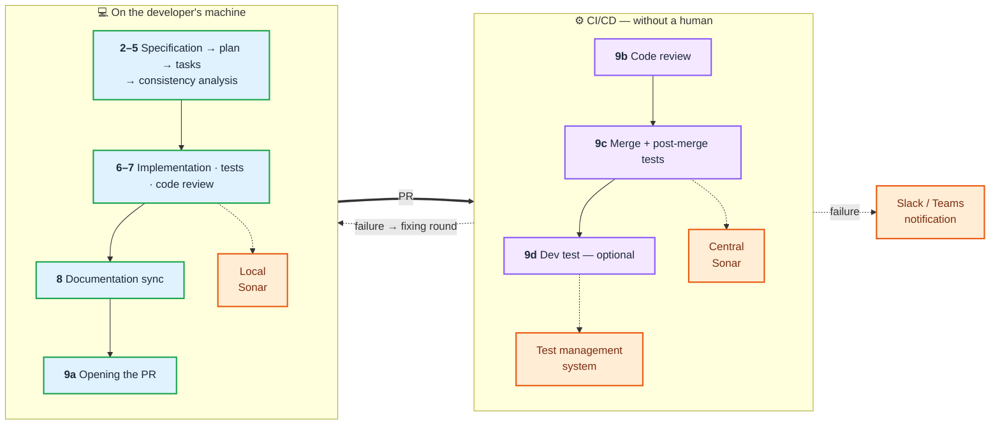
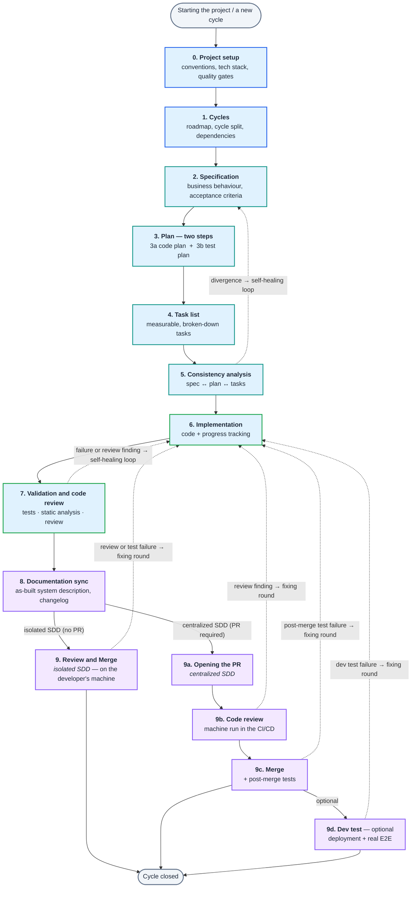
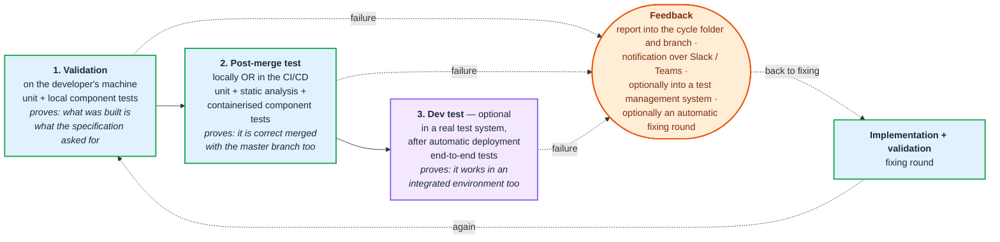

```text
    ╔══════════════════════════════════════════════════════════════════════╗
    ║                                                                      ║
    ║   ██████╗ ███████╗██████╗ ██╗  ██╗██╗███████╗██████╗ ███████╗ ██████╗║
    ║   ██╔══██╗██╔════╝██╔══██╗██║ ██╔╝██║██╔════╝██╔══██╗██╔════╝██╔════╝║
    ║   ██████╔╝█████╗  ██████╔╝█████╔╝ ██║███████╗██████╔╝█████╗  ██║     ║
    ║   ██╔══██╗██╔══╝  ██╔══██╗██╔═██╗ ██║╚════██║██╔═══╝ ██╔══╝  ██║     ║
    ║   ██████╔╝███████╗██║  ██║██║  ██╗██║███████║██║     ███████╗╚██████╗║
    ║   ╚═════╝ ╚══════╝╚═╝  ╚═╝╚═╝  ╚═╝╚═╝╚══════╝╚═╝     ╚══════╝ ╚═════╝║
    ║                                                                      ║
    ╚══════════════════════════════════════════════════════════════════════╝
```

**HUN version → [README-HU.md](README-HU.md)**

# Berki-spec

**Berki-spec** is a **spec-driven development (SDD)** framework for building software with AI agents. It breaks the work into independently testable **cycles**, and drives every cycle down the same disciplined path — from capturing the requirement (`spec`) through the technical design (`plan`) and the task list (`tasks`) to implementation, validation and merge.

**The specification is the source, not the by-product.** A document is not written next to the code afterwards; it is the other way round: the description of the business behaviour is what the design, the task list, the tests and finally the code are derived from — and what every step is measured back against. The process is built from two kinds of building block: **skills** (phase recipes run by the main agent) and **agents** (dedicated specialists invoked as `Task tool` subagents).

**A cycle leaves a production-ready unit behind it** — not a prototype. Tests written and executed, static analysis, code review, up-to-date system documentation and code integrated back into the main branch, all with committed evidence. The process does not end because the agent declares itself done; it ends because the **deterministic gates** are green.

> **Status: alpha — there is no stable release yet.** The prompt contracts are hardened round by round, so an update can bring **breaking changes** to an already-installed project (a renamed artifact or cycle folder, a new mandatory gate). If you need a fixed state, install from a tagged version or pin a commit instead of following `main`.

## 1. What makes it different

Most SDD templates give you a single, rigid "spec → plan → code" thread. Berki-spec goes further on eight counts — and the difference is not in the phases, but in **what happens when reality diverges from the plan**.

### 1.1 Multi-agent architecture — whoever diagnoses does not fix

It is not a single agent working, but a **specialised team**: *diagnosticians* (read only — code review, consistency analysis, codebase exploration, documentation planning), *runners* (executing tests and static analysis, with a factual summary) and *fixers* (targeted repair of the **concrete, listed** defects, not free exploration).

The point is in the division of roles: **whoever diagnoses does not fix, and whoever fixes does not decide whether it is done.** The PASS/FAIL verdict comes from deterministic scripts, not from the model. That way "I think this will do" cannot slip across a phase boundary.

### 1.2 Bilingual — two independent axes

The *language of the prompts* (the language the agent receives its instructions in) and the *language of the project* (the language the deliverable documents are written in) are **freely combinable**; all four pairings are valid. For a Hungarian team the most common is **English prompts + Hungarian documentation**: the English prompt is cheaper in tokens and weaker models follow it more accurately, while the deliverable stays Hungarian.

Both settings are decided at install time and are **wired in** to the installed prompts — no language field of any kind is written into the project. Details: [Installation](docs/en/installation.md).

### 1.3 Optimised for cheap, weaker models

Task-proportional model selection on **two axes**: which model, and how much reasoning budget (effort). The most expensive tier is granted to **exactly one** point — the diagnosis of the consistency analysis — while the fixers correcting a precise defect list and the mechanical runners work at low effort, because they do not have to discover the problem.

Deterministic safety nets keep weak models on the rails: narrowed entry points, mandatory checklists, "one question at a time". Context thrift is the other half of the same thing: exploration and test execution are done by cheap, parallel helper subagents that return only a summary — the raw test log and the `git diff` never enter the model's context. **Whatever can be decided mechanically is decided by a script.** For the full allocation see [Model and effort selection](docs/en/model-selection.md).

### 1.4 Full SDLC — two modes, with a single dividing line

*Isolated SDD*: everything runs on the developer's machine, including the review and the merge back. *Centralized SDD*: submitting the PR starts the CI/CD, and the **code review, the merge and the post-merge testing run on a remote machine, as a machine run**. The dividing line sits at **exactly one point**: the submission of the PR — everything before it is identical.



> **The platform limit of the CI branch:** the Antigravity CLI has **no headless mode** (measured with 1.107.0), so on the CI branch of the centralized route the `command` run mode has to be chosen. For local, interactive work Antigravity is fully supported. Details: [Agent-specific integration](docs/en/platform-integration.md).

### 1.5 Test-first — the test plan before the code

The design phase splits into two steps: first the code plan, **then the test half of the same plan** — with concrete expected results and a machine-readable run table, **still before the implementation**.

It has three consequences. The acceptance criterion and the test **live wired together**, through a machine gate, in both directions. **The code adapts to the contract, never the other way round**: the fixing loop may not weaken a test to make it green — a deterministic check defends this, and if something could only be resolved by changing the contract, the process **escalates upwards**, in front of a human. And the **illusory green is ruled out**: "zero tests executed" is a FAIL, a *skipped* test is not evidence, and an empty test body is hunted by a separate check.

### 1.6 Continuous documentation and test maintenance

Not a closing chore, but **a separate phase in every cycle**: living, "as-built" system documentation behind an objective consistency gate, a living test register (how the stack starts, which call, which test user) and a full test inventory that a machine gate compares against the test files actually present in the repository.

The documentation separately records the **deviations of the implemented system from the design intent** (design drift), so it does not go stale silently. **A year later you can still say what the system does, and what proves that it works.** Details: [docs-generated/ — living documentation](docs/en/living-docs.md).

### 1.7 A deterministic machine — the verdict comes from scripts

The framework installs **scripts** alongside the prompts, and at the phase boundaries it is these that pronounce PASS/FAIL: quality gates (cross-phase consistency, acceptance criterion ↔ evidence, report artifacts, documentation consistency, test inventory), running and evaluation (tests from the machine-readable table of the plan, Sonar from the API, round log and failure counters), defences (catching a modification of the tested contract, tests without substance) and helper tooling (cycle status, out-of-cycle runs, PDF export, worktrees).

**21 files are installed** into the target project (20 standalone scripts + one shared module); the remaining scripts of the repository are maintainer tools that do not ship. Together they are what makes the process rest on something other than the model's self-assessment.

### 1.8 Fitting into the team's tooling

An interactive installer for **five platforms**, with project-level customisation: the framework adapts to the conventions of the project, not the other way round. The closing phases can be wired into CI/CD through a uniform, platform-independent entry point, **taking the verdict from the deterministic gates**.

Notification over **Slack, Teams or your own command** — only on failure and on a human decision, never about a successful run; the secret goes in an environment variable, never as a command-line parameter. The **test management system** is optional and off by default, because an external service must never become a precondition of the cycle running — the official evidence remains the report committed into version control. (The `testdino` and `command` branches are proven; the `reportportal` and `qase` adapters are **under development**.)

## 2. The process



| phase | what happens | what it leaves behind |
|---|---|---|
| **0. Project setup** *(runs once)* | Together with the developer we record the conventions of the project: tech stack, test structure, reporting expectations, git and merge strategy, quality thresholds. | `conventions.md` |
| **1. Cycles** | The requirement is broken into independently deliverable cycles, with dependencies and acceptance criteria. | `roadmap.md` |
| **2. Specification** | **Business behaviour only** — what the system should do, and when we call it done. It designs no implementation. | `spec.md` |
| **3a. Code plan** | The plan of the technical implementation: affected components, planned changes, configuration, data schema. | the code half of `plan.md` |
| **3b. Test plan** | The test half of the same plan: test scenarios, machine-readable run table, environment preparation, specification coverage. | the test half of `plan.md` |
| **4. Task list** | Breaking the plan down into measurable tasks. It adds nothing new. | `tasks.md` |
| **5. Consistency analysis** | Cross-check: do the specification, the plan and the tasks **talk about the same thing**? On a divergence a self-healing loop starts. | analysis report + fix list |
| **6. Implementation** | Writing the code from the plan and the task list, tracking the progress. | code + a ticked task list |
| **7. Validation and code review** | Fast tests → static analysis (Sonar + AI code review) → heavy tests and regression → checking the acceptance criteria. On a failure a self-healing loop, with fixed stopping limits. | validation report + code review |
| **8. Documentation sync** | Keeping the living system documentation current with the code that was actually built: behaviour description, architecture, changelog, component descriptions. | `docs-generated/` |
| **9. Review and Merge** | The integration back. In isolated mode on the developer's machine, in one step; in centralized mode PR opening (9a) → machine code review (9b) → merge (9c), in the CI/CD. | merged branch / PR + closed roadmap |
| **9d. Dev test** *(optional)* | Automatic deployment into an integrated test environment, and real end-to-end tests against it. | test evidence in the cycle folder |

The detailed description of the phases: [The full berki spec flow](docs/en/full-flow.md) · [The self-healing loops](docs/en/self-healing-loops.md) · [The detailed process diagram](docs/en/process-diagram.md).

## 3. Where we test

The process checks at **three points**, and each of the three **proves something different** — which is why none of them replaces another.



**Validation** runs on the developer's machine, on their own branch: unit and local component tests, static analysis and code review. It proves that **what was built is what the specification asked for** — measured against the acceptance criteria, not in general.

**The post-merge test** is the gate **before** the code reaches the main branch, on both routes: we bring the main branch into the cycle branch and run the tests on the *combined* state. It proves that the work is **correct merged with the main branch too** — this is the class of failure that a green test on an isolated branch never sees.

**The dev test** is optional, and only on the centralized route: after an automatic deployment, real end-to-end tests in an integrated environment. It proves that the system **works together with its real dependencies too**. The result of all three rounds goes into the cycle folder as a report, and a failure sends a notification.

## 4. Two development routes

The weight of the task decides which route fits it. The **full flow** (00–09) is for larger, more complex developments, with separate `spec.md` → `plan.md` → `tasks.md` documents and quality gates; the **simplified flow** is for tasks solvable in 3-4 steps, with a single `spec-plan.md` → `tasks.md` → implementation recipe.

| Characteristic | Simplified flow | Full berki spec flow |
|---|---|---|
| Typical task | configuration, simple script, minor fix | new feature, several components, complex logic |
| Size | solvable in 3-4 steps | self-contained, vertically sliceable cycle(s) |
| Documents | `spec-plan.md` + `tasks.md` (both with a status field) | `spec.md` + `plan.md` + `tasks.md` |
| Quality gates | inline + optional agents | `analyze` / `validate` / `doc-sync` / `review` loops |
| Entry point | `/bs-quick-flow` | `/bs-init-project` / `/bs-add-cycles` |

The two routes are **interchangeable mid-flight**: if during the simplified flow it turns out that the task outgrows it, the skill stops the work and redirects to the full process — and the other way round as well. In front of both sits the shared antechamber, `/bs-brainstorm`, for when the question is not yet the size, but **what and how** we want at all. Details: [Two development routes](docs/en/routes.md) · [Simplified flow](docs/en/lightweight-flow.md).

## 5. Installation — quickstart

```bash
git clone <the-url-of-the-berkispec-repo>
cd berkispec
./install.sh          # on Windows: .\install.ps1
```

The installer interactively asks for the folder of the target project, the platform and the **two languages** (prompt language and project language), then links the skills and the agents into the configuration folder of the chosen platform. It can also be automated with flags: `./install.sh --platform claude --prompt-lang en --project-lang hu --path ~/project`.

**Supported platforms:** Google Antigravity CLI · Claude Code · Cursor (Agent CLI) · GitHub Copilot (CLI & IDE) · Codex CLI.

**The two language axes** — independently settable, and they do not have to match:

| Setting | What it determines | Default |
|---|---|---|
| **Language of the prompts** | The language of the instructions the **agent reads**. It does not affect your documents. | **English** |
| **Language of the project** | The language the **agent writes in**: `spec.md`, `plan.md`, reports, `docs-generated/` — and the language it answers you in. | **Magyar** |

> The full installation guide — the steps, the folder structure of the five platforms, the flag table of the non-interactive mode, the defence against language bleed and the questions of updating: **[Installation](docs/en/installation.md)**.

## 6. Basic commands

After installation you can reach the skills in the platform's chat interface by pressing the `/` character (in GitHub Copilot with the `@` symbol). To start: `/bs-init-project`.

| command | what it does |
|---|---|
| `/bs-init-project` | The very first initialisation of the project — it creates the `conventions.md` file. |
| `/bs-add-cycles` | Adding a new development cycle to the roadmap (`roadmap.md`). |
| `/bs-write-spec` | Capturing the requirements, the specification of the cycle (`spec.md`). |
| `/bs-write-code-plan` | The **code side** of the technical plan: coordinates, planned changes, configuration, schema. |
| `/bs-write-test-plan` | The **test half** of the same plan: scenarios, machine-readable run table, test-file data sheets. |
| `/bs-write-tasks` | Breaking the plan down into measurable tasks (`tasks.md`). |
| `/bs-analyze` | Cross-phase consistency check and automatic correction (spec ↔ plan ↔ tasks). |
| `/bs-implement` | The actual code development from the task list, tracking the progress. |
| `/bs-validate` | Tests, lint, build **and code review** in a single automatic fixing loop. |
| `/bs-doc-sync` | Synchronising the living documentation (`docs-generated/`) and the test conventions with the code. |
| `/bs-review-and-merge` | Closing the cycle **in one step** when there is no PR submission: post-merge test round → merge. |
| `/bs-create-pr` → `/bs-review` → `/bs-merge` | The same **in three steps** when there is a PR submission — a machine run in centralized SDD. |
| `/bs-dev-test` | *(optional)* Deployment into an integrated test environment, and real e2e tests. |
| `/bs-brainstorm` | Exploratory ideation **before the spec**, with a persistent working file; at the end it hands over to the flow. |
| `/bs-quick-flow` | Starting the simplified flow for small tasks (spec → task → implementation). |
| `/bs-cycle-status` | Checking the status of the cycles (interactive TUI or command-line output). |
| `/bs-manual-test-plan` | Assembling the **manual test plan** of the cycle: startup, test data, call sequences. |
| `/bs-run-tests` | **Running tests outside a cycle**, per category; its result is never cycle evidence. |
| `/bs-export-doc` | Versioned PDF export from the markdown docs, together with the mermaid diagrams. |

## 7. What this means in practice

- **Predictable quality.** Closing every phase is bound to a machine gate; the AI cannot declare itself done.
- **An auditable trail.** From the requirement to the test evidence every step lives in a committed document — afterwards you can answer why a decision was made, and what proves that it works.
- **Interruptible work.** The state is on disk, not in the memory of a conversation: after a `/clear`, a crash or a return days later the process continues from where it stopped.
- **Controlled cost.** The expensive model is used only where it is genuinely needed — the larger part of the work runs on a cheap model, at low effort.
- **It fits the existing processes.** PR-based review, a protected main branch, CI/CD, Sonar, an integrated test environment, Slack/Teams notification, test management — the framework **fits into these, it does not come instead of them**.

## 8. Documentation

The detailed description lives one topic per page in the [`docs/en/`](docs/en/README.md) tree (in Hungarian: [`docs/hu/`](docs/hu/README.md), with the same file names).

| page | what it answers |
|---|---|
| [Two development routes](docs/en/routes.md) | Which route fits the task — the decision table, and the `/bs-brainstorm` antechamber before either one. |
| [Installation](docs/en/installation.md) | The full install: the steps, the five supported platforms, the two language axes, and what lands in the project. |
| [Quick start](docs/en/quick-start.md) | The operating principle in brief and the first cycle end to end, with the slash commands. |
| [The full berki spec flow (00–09)](docs/en/full-flow.md) | The many-phase route: the high-level diagram, the test points, and an example prompt flow through one cycle. |
| [Automatic selection of models and effort levels](docs/en/model-selection.md) | Which step runs on which model at which effort, and how `models.json` controls it. |
| [The self-healing loops](docs/en/self-healing-loops.md) | The `05-analyze` and `07-validate` loops in detail, plus the conventions they share. |
| [Simplified (lightweight) flow](docs/en/lightweight-flow.md) | The three-phase route: flowchart, loop breakers, optional agents, starter prompt. |
| [Skills, agents and the frontmatter schema](docs/en/skills-and-agents.md) | The skill index, the agent index, and the frontmatter every prompt file carries. |
| [conventions.md — Project conventions](docs/en/conventions.md) | The project conventions file, the branching strategy, worktrees, and the phase-closing commit. |
| [The artifact files of a cycle](docs/en/cycle-artifacts.md) | What a cycle leaves behind, the handover between phases, question handling, and the `Done` status lifecycle. |
| [docs-generated/ — living documentation](docs/en/living-docs.md) | The living system documentation, the test conventions, the PDF export, and out-of-cycle test runs. |
| [Quality gates, decision log and review](docs/en/quality-gates.md) | The Sonar check, the decision log, the validation report, and the reviewer agent. |
| [Agent-specific integration](docs/en/platform-integration.md) | The platform limits: running commands in subagents, Antigravity CLI, Codex CLI. |
| [The detailed process diagram](docs/en/process-diagram.md) | The full process diagram of phases 00–09 in one picture. |
