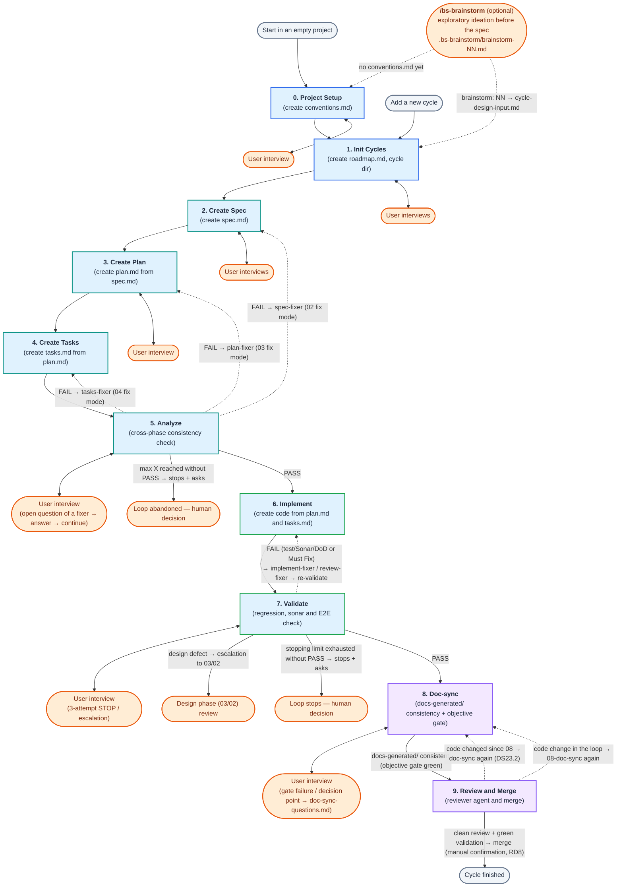
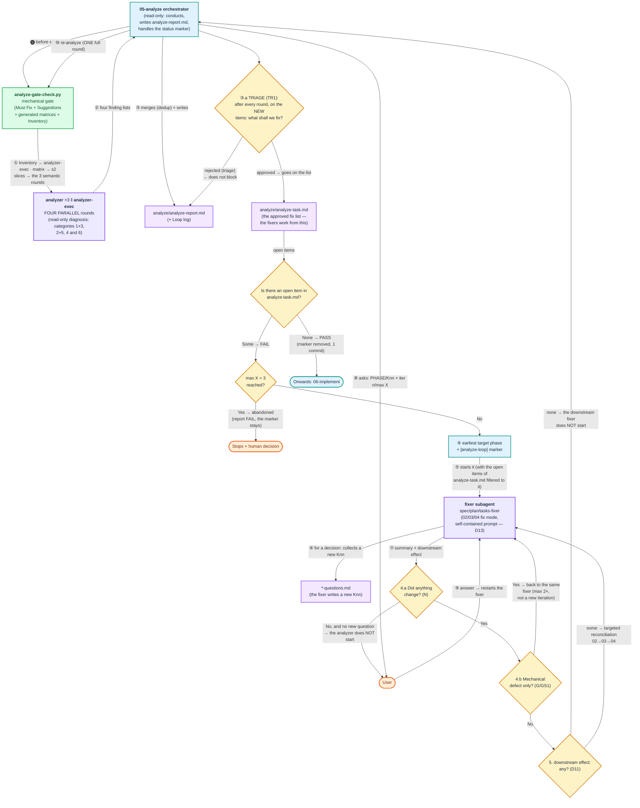
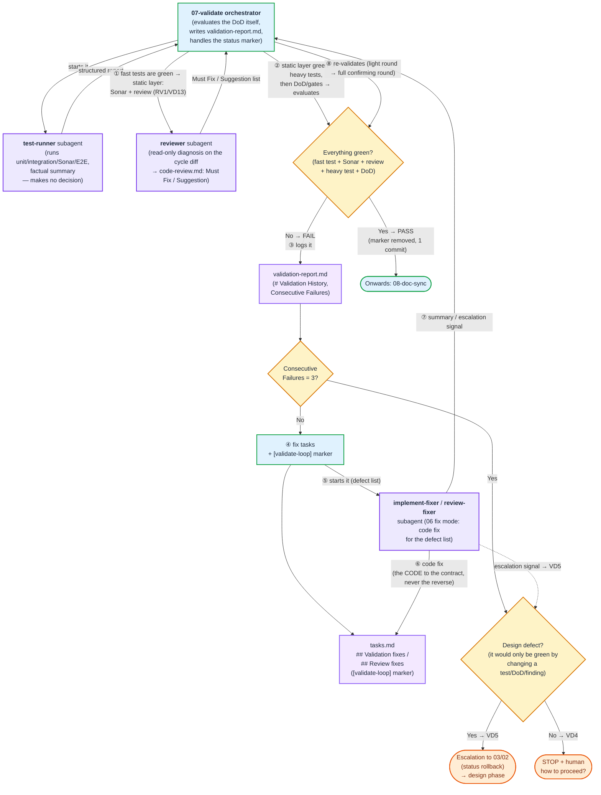

```text
    ╔══════════════════════════════════════════════════════════════════════╗
    ║                                                                      ║
    ║   ██████╗ ███████╗██████╗ ██╗  ██╗██╗███████╗██████╗ ███████╗ ██████╗║
    ║   ██╔══██╗██╔════╝██╔══██╗██║ ██╔╝██║██╔════╝██╔══██╗██╔════╝██╔════╝║
    ║   ██████╔╝█████╗  ██████╔╝█████╔╝ ██║███████╗██████╔╝█████╗  ██║     ║
    ║   ██╔══██╗██╔══╝  ██╔══██╗██╔═██╗ ██║╚════██║██╔═══╝ ██╔══╝  ██║     ║
    ║   ██████╔╝███████╗██║  ██║██║  ██╗██║███████║██║     ███████╗╚██████╗║
    ║   ╚═════╝ ╚══════╝╚═╝  ╚═╝╚═╝  ╚═╝╚═╝╚══════╝╚═╝     ╚══════╝ ╚═════╝║
    ║                                                                      ║
    ╚══════════════════════════════════════════════════════════════════════╝
```

**HUN version → [README-HU.md](README-HU.md)**

<!-- TOC -->

- [Berki-spec](#berki-spec)
  - [1. Two development routes — choose by the size of the task](#1-two-development-routes--choose-by-the-size-of-the-task)
    - [1.1 Before either route (optional): /bs-brainstorm](#11-before-either-route-optional-bs-brainstorm)
  - [2. Installation](#2-installation)
    - [Installation steps:](#installation-steps)
    - [Supported platforms and agents:](#supported-platforms-and-agents)
    - [Language settings — two independent axes](#language-settings--two-independent-axes)
    - [How can it be used?](#how-can-it-be-used)
  - [3. Quick start](#3-quick-start)
    - [The operating principle of the framework:](#the-operating-principle-of-the-framework)
    - [Two development routes:](#two-development-routes)
    - [Basic commands (slash commands):](#basic-commands-slash-commands)
  - [4. The full berki spec flow (00–09)](#4-the-full-berki-spec-flow-0009)
    - [4.1 High-level summary](#41-high-level-summary)
    - [4.2 The detailed process](#42-the-detailed-process)
    - [4.3 Automatic selection of models and effort levels](#43-automatic-selection-of-models-and-effort-levels)
    - [4.4 The 05-analyze self-healing loop (in detail)](#44-the-05-analyze-self-healing-loop-in-detail)
    - [4.5 The 07-validate self-healing loop (in detail) — tests + code review](#45-the-07-validate-self-healing-loop-in-detail--tests--code-review)
    - [4.6 Self-healing loops (analyze + validate) — shared conventions](#46-self-healing-loops-analyze--validate--shared-conventions)
    - [4.7 Example prompt flow (walking through one cycle)](#47-example-prompt-flow-walking-through-one-cycle)
  - [5. Simplified (lightweight) flow](#5-simplified-lightweight-flow)
    - [5.1 Flowchart](#51-flowchart)
    - [5.2 The three phases in brief](#52-the-three-phases-in-brief)
    - [5.3 Two built-in loop breakers](#53-two-built-in-loop-breakers)
    - [5.4 Optional agents (all read-only, none of them mandatory)](#54-optional-agents-all-read-only-none-of-them-mandatory)
    - [5.5 Starter prompt (copy-paste)](#55-starter-prompt-copy-paste)
    - [5.6 Example prompt](#56-example-prompt)
  - [6. Skill index](#6-skill-index)
  - [7. Agent index](#7-agent-index)
  - [8. Frontmatter schema](#8-frontmatter-schema)
  - [9. conventions.md — Project conventions](#9-conventionsmd--project-conventions)
    - [Branching strategy — cycle = branch (in phase 01)](#branching-strategy--cycle--branch-in-phase-01)
    - [Parallel cycles — a design window with a worktree (PW1/PW2, BD16)](#parallel-cycles--a-design-window-with-a-worktree-pw1pw2-bd16)
    - [A fresh base before the analyze (BR1)](#a-fresh-base-before-the-analyze-br1)
    - [An integration refresh before the merge (W2)](#an-integration-refresh-before-the-merge-w2)
    - [The phase-closing commit (PC1)](#the-phase-closing-commit-pc1)
  - [10. The artifact files of a cycle](#10-the-artifact-files-of-a-cycle)
    - [10.1 The handover between phases (*-input-from-prev.md)](#101-the-handover-between-phases--input-from-prevmd)
  - [11. docs-generated/ — living documentation (owned by 08-doc-sync)](#11-docs-generated--living-documentation-owned-by-08-doc-sync)
    - [11.1 specs/test-conventions.md — recurring test expectations and recipes (TC1–TC11)](#111-specstest-conventionsmd--recurring-test-expectations-and-recipes-tc1tc11)
    - [11.2 export/ — versioned PDF export (/bs-export-doc)](#112-export--versioned-pdf-export-bs-export-doc)
  - [12. Question handling (spec-questions.md / plan-questions.md / tasks-questions.md / doc-sync-questions.md)](#12-question-handling-spec-questionsmd--plan-questionsmd--tasks-questionsmd--doc-sync-questionsmd)
  - [13. A uniform Done status lifecycle](#13-a-uniform-done-status-lifecycle)
  - [14. Sonar quality check](#14-sonar-quality-check)
  - [15. The decision log (imp-decision.md)](#15-the-decision-log-imp-decisionmd)
  - [16. The validation report (validation-report.md)](#16-the-validation-report-validation-reportmd)
  - [17. The reviewer agent (agents/reviewer.md)](#17-the-reviewer-agent-agentsreviewermd)
  - [18. Agent-specific integration](#18-agent-specific-integration)
    - [18.0 A platform limitation: running commands in the subagents (EX1)](#180-a-platform-limitation-running-commands-in-the-subagents-ex1)
    - [18.1 Antigravity CLI (Google DeepMind)](#181-antigravity-cli-google-deepmind)
      - [18.1.1 The planning and logging process (Planning Mode)](#1811-the-planning-and-logging-process-planning-mode)
      - [18.1.2 Handling permissions (Permissions)](#1812-handling-permissions-permissions)
      - [18.1.3 Starting the skills and agents (using the TUI)](#1813-starting-the-skills-and-agents-using-the-tui)
    - [18.2 Codex CLI (OpenAI)](#182-codex-cli-openai)

<!-- /TOC -->

# Berki-spec

**Berki-spec** is a **spec-driven development (SDD)** framework for developing software with AI agents. It breaks the work into independently testable **cycles**, and drives every cycle down the same disciplined path — from capturing the requirement (`spec`) through the technical design (`plan`) and the task list (`tasks`) to implementation, validation and merge. The process is built from two kinds of building block: **skills** (phase recipes run by the main agent) and **agents** (dedicated specialists invoked as `Task tool` subagents).

**What makes it different from the SDD tools on the market?**

Most SDD templates give you a single, rigid "spec → plan → code" thread. Berki-spec goes further — and the difference is not in the phases, but in **what happens when reality diverges from the plan**:

- **Adaptive, two-speed flow.** For a large task, the full (00–09) process with its quality gates; for a small, well-bounded task, a simplified three-phase route (`spec → task → implementation`). The two are **interchangeable mid-flight** — no needless ceremony for a configuration change, and no under-design for a complex feature.
- **Self-healing quality loops, with anti-"cheating" discipline.** The `analyze`, `validate` and `review` phases do not merely *report* a defect, they **fix it automatically** in an orchestrated loop. The key rule: the **code adapts to the contract** (test / DoD / review finding), **never the other way round** — the loop does not weaken a test to make it green. If something could only be resolved by changing the contract, it **escalates upwards** into the design phase, in front of a human.
- **Living, "as-built" documentation with drift tracking.** `docs-generated/` stays in sync with the code cycle by cycle, driven through an **objective consistency gate**, and separately records the **deviations of the implemented system from the HLD/LLD intent** (design drift). Documentation does not go stale silently.
- **Interruption-safe, resumable anywhere.** Every phase keeps its state and its open questions in files (we **never delete** from the list, we only tick `[x]`), with status markers — a new session picks up exactly where the previous one stopped.
- **Human gates at the decisions.** Phase transitions are bound to **explicit approval**: the agent proposes and justifies, but does not "run away with it" — the choice of scope and direction stays with the developer.
- **Tool-independent, from a single source.** The same skill/agent definition (single source of truth) runs under Claude Code, Cursor, Antigravity and Codex alike.
- **Optimised for weak/cheap models.** Deterministic safety nets (narrowed fix-mode entry points, mandatory checklists, one question at a time) reduce the chance of error even when it is not the strongest model driving.
- **Maximum token saving — task-proportional model and reasoning-level selection.** Every step runs on the **cheapest agent sufficient for it**, tuned on **two independent axes**: the *model* (which model) and the *effort* (how many reasoning/thinking tokens). The most expensive (Opus-class) model is granted to **exactly one** point: the most critical reasoning, the consistency diagnosis of the `analyzer`. The fixers that correct a precise defect list and the mechanical runners work at **low effort** (on the `default` model too), because they do not have to discover the problem. Code search, test execution and the deterministic steps are done by cheap subagents and scripts, sparing the main context. For the full allocation see [section 4.3](#43-automatic-selection-of-models-and-effort-levels).

## 1. Two development routes — choose by the size of the task

The user has **two routes**; the weight of the task decides which one fits:

1. **The full berki spec flow (phases 00–09)** — for larger, more complex developments. Separate `spec.md` → `plan.md` → `tasks.md` documents, with cross-phase `analyze`, `validate`, `doc-sync` and `review` quality gates and self-healing loops. On an empty project it starts with the `00-init-project` skill, for a new cycle with `01-add-cycles`. The rest of this README describes this route.

2. **The simplified (lightweight) flow** — for small, well-bounded tasks that can be solved in 3-4 steps (e.g. **assembling a configuration**, **writing a simpler script**, a minor fix). A single three-phase recipe: `spec.md` → `task.md` → implementation, in the `/bs-quick-flow` skill. There is no separate plan/bs-analyze/bs-validate/bs-doc-sync phase; it calls the optional agents (`researcher`, `analyzer`, `reviewer`) only when they genuinely help.

**How to decide?**

| Characteristic | Simplified flow | Full berki spec flow |
|---|---|---|
| Typical task | configuration, simple script, minor fix | new feature, several components, complex logic |
| Size | solvable in 3-4 steps | self-contained, vertically sliceable cycle(s) |
| Documents | `spec.md` + `task.md` | `spec.md` + `plan.md` + `tasks.md` |
| Quality gates | inline + optional agents | `analyze` / `validate` / `doc-sync` / `review` loops |
| Entry point | `/bs-quick-flow` | `/bs-init-project` / `/bs-add-cycles` |

**Default flow:** the character of the project is clarified in the `00-init-project` phase (product development vs. configuration/scripting), and based on that a **default flow** is written into the **Default flow** field of the `## Development methodology` section of `conventions.md`. That is the starting point — it can be overridden per task.

The two routes are **interchangeable**: if during the simplified flow it turns out that the task outgrows it (more code to write, several components, complex design), the skill stops the work and **redirects to the full process** (`01-add-cycles`). And the other way round: `01-add-cycles` and `03a-write-code-plan` will flag it if the task is too simple for a full cycle, and suggest the simplified flow.

### 1.1 Before either route (optional): `/bs-brainstorm`

The **shared antechamber** of the two routes is the `/bs-brainstorm` helper command — for the case when the question is not yet the *size*, but **what and how** we want at all. ("How should we implement central certificate management?", "Is it worth extracting auth?") This gap sits **before** the `00–09` flow: `01-add-cycles` already assumes that you know what you want (it only has to be split into cycles), and `/bs-quick-flow` assumes the task is small and clear.

**What it does:**
- **Orients itself** in the project: `conventions.md`, `docs-generated/system-overview.md` (the as-built truth), `docs-generated/README.md` (folder index), `specs/roadmap.md` — and, depending on the topic, `architecture.md` and `design-drift.md`. Grinding through the whole `specs/` tree is forbidden (BS6).
- **It explores the codebase with cheap, parallel `researcher` subagents** (Mode B, read-only, cheapest tier, "never raw file content") — so the context of the conversation carries a list of findings rather than dozens of files (BS7).
- **It converses, it does not monologue:** **one** question at a time, for every proposal **2–3 alternatives with trade-offs + an explicit recommendation**, mandatory fitting to the existing system and to `conventions.md`, and sycophancy is forbidden — a risk that was not raised is the agent's fault (BS8–BS13).
- **It persists:** the material of the session goes into the `.bs-brainstorm/brainstorm-NN-<slug>.md` working file with a fixed skeleton (*Goal · Discovered facts with sources · Alternatives · Decisions · Open questions · Proposed cycle split · Log*). After every substantive round it **grows** — it is never rewritten (BS14). So it can be continued after a `/clear`, a crash or a return days later: `/bs-brainstorm let's continue number 04`.

**Hard limits (BS1):** it writes no code, runs no `git`, and modifies **not a single file** outside the `.bs-brainstorm/` folder — with one exception: on the first run it offers to add the `.bs-brainstorm/*` entry to `.gitignore` (after approval, once). At the end it **recommends**, but does not enter the next skill.

**The bridge towards the flow (BS18):** the raw working file is **local and gitignored** (raw thinking, not a deliverable) — whatever is worth keeping is distilled into the cycle's `cycle-design-input.md`, and *that* is what gets committed:

```
/bs-brainstorm how should central cert management work
        ↓                      .bs-brainstorm/brainstorm-04-central-cert.md   (gitignored)
/bs-add-cycles brainstorm: 04
        ↓                      specs/cycle-NN-<name>/cycle-design-input.md    (committed)
/bs-write-spec
```

`01-add-cycles` takes the `## 6. Proposed cycle split` section as the starting point of the roadmap proposal, and asks the unticked items of `## 5. Open questions` **as questions** — whatever the working file already answers, it does not ask again. **One bridge, one direction:** `02-write-spec` does not read the brainstorm, it reads `cycle-design-input.md`.

## 2. Installation

Setting up the BerkiSpec framework in the target project is extremely simple and automated with the help of the bundled installer script.

### Installation steps:
1. Open a terminal in the root of the `berkispec` repository.
2. Run the installer script:
   * **Linux/macOS:**
     ```bash
     ./install.sh
     ```
   * **Windows (PowerShell):**
     ```powershell
     .\install.ps1
     ```
3. The script greets you interactively and asks for the root folder of your target project.
   * *Tip:* while typing the path you can auto-complete folder names with the **Tab** key, and **pressing Tab twice** lists the contents of the current directory.
   * **On reinstall the most recent target folder is offered automatically** — on Linux/macOS it appears pre-filled (Enter = accept, editable with the arrow keys), on Windows the script prints it and accepts it on an empty Enter. For this the installer uses the **`history`** file in the repo root (`LAST_PROJECT_PATH`, `LAST_PLATFORM`, `LAST_INSTALL`). The file is machine-specific, so `.gitignore` excludes it; if the folder stored in it has disappeared in the meantime, the script says so and asks for a new one.
4. Select the AI agent platform you use (1–6).
5. Select the **two languages** — see the *Language settings* section below. Both have a default, acceptable with Enter:
   * **Language of the prompts** (what the agent *reads*): `1) English [default]` / `2) Magyar`
   * **Language of the project** (what the agent *writes*): `1) Magyar [default]` / `2) English`

**Non-interactive (scripted) installation.** If you give **no** flag at all, the interactive route above runs unchanged. With flags, however, it can be automated:

```bash
./install.sh --platform claude --prompt-lang en --project-lang hu --path ~/project
```

| Flag (`install.sh`) | PowerShell | Value | Default |
|---|---|---|---|
| `--platform` | `-Platform` | `claude` \| `codex` \| `antigravity` \| `cursor` \| `copilot` | — (asks) |
| `--prompt-lang` | `-PromptLang` | `hu` \| `en` | `en` |
| `--project-lang` | `-ProjectLang` | `hu` \| `en` | `hu` |
| `--path` | `-Path` | the directory of the target project | — (asks) |
| `--force` | `-Force` | overwrite on conflict | — |
| `--help` | `-Help` | help | — |

If flags are given partially, it uses the ones provided and asks for the rest interactively. **On a conflict without `--force` the non-interactive mode STOPS** — it does not overwrite silently.

### Supported platforms and agents:
The framework can set up the environment for five popular developer platforms:
1. **Google Antigravity CLI:**
   * Creates the `.agents/` configuration folder in the project root.
   * Links the agents into the `.agents/agents/<name>/agent.json` folder structure, and the skills into the `.agents/skills/bs-<name>/SKILL.md` directory.
2. **Claude Code:**
   * Creates the `.claude/` configuration folder in the project root.
   * Links the agents in `.claude/agents/<name>.md` (Markdown) format, and the skills under `.claude/skills/bs-<name>/SKILL.md`.
3. **Cursor (Agent CLI):**
   * Creates the `.cursor/` configuration folder in the project root.
   * Links the subagents in `.cursor/agents/<name>.md` (Markdown) format (the read-only agents get `readonly: true`), and the skills under `.cursor/skills/bs-<name>/SKILL.md`.
4. **GitHub Copilot (CLI & IDE):**
   * Creates the `.github/` configuration folder in the project root.
   * Links the agents as `.github/agents/<name>.agent.md` files, and arranges the skills as global instructions in `.github/instructions/bs-<name>.instructions.md`.
5. **Codex CLI:**
   * Creates the subagents as `.codex/agents/<name>.toml` **TOML** files (with native `model` + `model_reasoning_effort` fields; the read-only agents get `sandbox_mode = "read-only"`).
   * Places the skills under `.agents/skills/bs-<name>/SKILL.md` — Codex reads project-level skills from there.
   * ⚠️ **Caution:** Codex and Antigravity use a **shared** `.agents/skills/` folder, so only one of the two can be installed into a given project. The installer warns and asks if the other one is already present.

### Language settings — two independent axes

The framework knows **two mutually independent** language settings. They are not the same thing, and they **do not have to match**:

| Setting | What it determines | Default |
|---|---|---|
| **Language of the prompts** | The language of the **instructions the agent reads** (the language of the `skills-*` / `agents-*` / `shared-*` tree). It does not affect your documents. | **English** |
| **Language of the project** | The language the **agent writes in**: `spec.md`, `plan.md`, `tasks.md`, `conventions.md`, reports, `docs-generated/` — and the language it **answers you** in, in the chat. | **Magyar** |

**The four combinations:**

| Prompt | Project | When this is the right one |
|---|---|---|
| **EN** | **HU** | *The default.* Hungarian team, Hungarian deliverable documentation — but the agent gets English instructions, which are cheaper in tokens and which weaker/cheaper models follow more accurately. |
| HU | HU | If you want to read/maintain the prompt text in Hungarian too. |
| EN | EN | International project. |
| HU | EN | Rare, but valid: Hungarian maintainer, English deliverable. |

**Both are decided at install time and are WIRED IN to the installed prompts.** **No language field of any kind is written into the project** — neither into `conventions.md` nor anywhere else — therefore:

- afterwards it can be changed **only by reinstalling**;
- for an existing project there is **no migration to do**: until you reinstall, everything stays as it was;
- the installer's **closing summary prints both languages** — this is the only place where you are confronted with your choice.

> **The main risk: language bleed.** With English instructions + a Hungarian project, the model (especially a weaker one) tends to bleed English words into the Hungarian document, or to write the whole artifact in English. The main weapon against this is the **`output-language` block**: at the very beginning of every skill and every agent — right after the H1 — a block is inserted which states, **in the language of the project**, what has to be written in that language (artifacts, sentences addressed to the user), what stays English (identifiers, file names, commands, rule IDs), and that **mixing is a defect to be fixed**. A rule phrased in the target language is at once an instruction and a linguistic anchor — it measurably holds better than a "write in Hungarian" phrased in English.

> **The gate scripts follow the language of the project too.** The deterministic gates (report gate, DoD check, round log, analyze gate, TC8) do not match on hardcoded Hungarian text: the installer writes the dictionary of the chosen project language next to the scripts (`lang-keys.json`), and the scripts take the section titles, field names and status values from it. So what they *search for* and what they *write* into the artifact is in the language of the project. Their input, on the other hand, is **language-independent**: they accept the forms of both languages, so a project that started in Hungarian does not fall out after an English reinstall.
>
> **⚠️ One remainder with `project = English`:** the **console messages** of the gate scripts are Hungarian (these address the runner and the agent, they never end up in an artifact). The installer flags this separately at the point of choice.

### How can it be used?
After installation the given platform reads the symlinked definitions automatically:
* **Google Antigravity CLI / Claude Code / Cursor Agent CLI / Codex CLI:** Start the CLI in the folder of the target project (with the `agent` command in the case of Cursor). In the chat interface you can bring up the list of skills by pressing the `/` (slash) character. Every skill appears uniformly under the name `berkispec - <phase>: <description>`, so you can see the order and purpose of the SDD steps immediately. To start, invoke the `bs-init-project` skill! (In Codex you can list/switch between subagents with the `/agent` command.)
* **GitHub Copilot:** In the Copilot Chat window or in the Copilot CLI you can activate the instructions of the desired phase directly with the `@` symbol (e.g. `@bs-init-project`).

---


## 3. Quick start

BerkiSpec is a disciplined, spec-driven development (SDD) framework for pair programming with AI agents.

### The operating principle of the framework:
* **Cycles:** development is divided into well-bounded units (cycles) that can be described with an unambiguous goal and kept easily under control. Every new cycle gets its own Git branch, and all design and logging documents of the cycle go into the `specs/cycle-NN-<cycle-name>/` folder in the project root.
* **Phases:** every cycle is broken down into strict phases that lead the process from the requirements through to implementation and merge.

### Two development routes:
Depending on the complexity of the task, two flows are available:
1. **Full SDD flow:** produces a detailed specification (`spec.md`), a technical plan (`plan.md`) and a task list (`tasks.md`), and runs automatic self-healing quality loops (analyze, validate, review).
2. **Lightweight flow:** for smaller changes, configurations or simple scripts. It runs in one step, without a separate phase breakdown.

### Basic commands (slash commands):
After installation you can reach the skills in the platform's chat interface by pressing the `/` character:

* **`/bs-init-project`**: the very first initialisation of the project (creates the `conventions.md` file).
* **`/bs-add-cycles`**: adding a new development cycle to the roadmap (`roadmap.md`).
* **`/bs-write-spec`**: capturing the requirements, producing the specification of a new cycle (`spec.md` + `spec-questions.md`).
* **`/bs-write-code-plan`**: the **code side** of the technical implementation plan (the code sections of `plan.md` + `plan-questions.md`) — coordinates, planned changes, configuration, schema.
* **`/bs-write-test-plan`**: the **test half** of the same `plan.md` — `TS-NN` scenarios, the machine-readable run table, environment preparation, test-file data sheets.
* **`/bs-write-tasks`**: breaking the technical plan down into measurable tasks (`tasks.md` + `tasks-questions.md`).
* **`/bs-analyze`**: cross-phase consistency check and automatic correction (spec/plan/tasks agreement).
* **`/bs-implement`**: actual code development based on the task list, recording the progress in `tasks.md`.
* **`/bs-validate`**: checking tests, lint, build **and code review** (reviewer agent) in a single automatic fixing loop (after a successful run, the 'Done' status).
* **`/bs-doc-sync`**: synchronising the living documentation (`docs-generated/`) and the READMEs with the code changes, and maintaining `specs/test-conventions.md` (recurring test expectations and recipes).
* **`/bs-merge`**: merging the cycle branch (local squash or PR), with mandatory user confirmation. The code review has already run in `/bs-validate`.
* **`/bs-cycle-status`**: checking the status of the cycles (interactive TUI or command-line status).
* **`/bs-brainstorm`**: exploratory ideation and joint design **before the spec** — with a persistent working file (`.bs-brainstorm/`) and cheap `researcher` exploration; at the end it hands over to `/bs-add-cycles` or `/bs-quick-flow`.
* **`/bs-quick-flow`**: starting the simplified (lightweight) flow for small tasks (spec → task → implementation).
* **`/bs-export-doc`**: versioned PDF export from the markdown docs (together with the mermaid diagrams) into the `export/` folder — with no parameter, from `architecture.md` and `system-overview.md`.
* **`/bs-manual-test-plan`**: assembling the **manual test plan** for the cycle (`manual-test-plan.md`): component startup, test data, manual call sequences (`curl` + `.http`), expected results and the location of the automated test results. Two modes: `Planned` (before implementation, based on `plan.md`) or `As-built` (after validation, verified against the code). Its prerequisite is the `PASS` status of `analyze-report.md`; it is not a phase, it does not change the cycle status, and it can be re-run at any time (it preserves the manual additions).

---
## 4. The full berki spec flow (00–09)

This chapter describes the **full, many-phase** development route with its flowcharts — from the project setup (00–01) through the per-cycle loop (02–09) to the merge, including the self-healing loops. The **other route**, the simplified three-phase flow, is detailed further down, in the "Simplified (lightweight) flow" chapter.
> **Code markers:** in the text, codes of the form `DS`/`VD`/`RD`/`LC`/`SK` + a number (e.g. `DS22`, `RD6`, `LC1`) are the internal rule identifiers of the skill files. Their detailed definition lives in the given skill; here they only serve as searchable anchors, you do not need to resolve them to understand the README.

### 4.1 High-level summary

This diagram summarises the sequential process of phases 00–09, the entry points, the interview loops and the defect-fixing feedback paths.



### 4.2 The detailed process
The detailed diagram below shows the exact transitions between the individual phases, the input/output files, the points of user interaction (User Input), and the feedback loops that kick in when something fails.

```mermaid
flowchart TD
    %% Styling definitions
    classDef setup fill:#e0f2fe,stroke:#2563eb,stroke-width:2px,color:#1e293b;
    classDef design fill:#e0f2fe,stroke:#0d9488,stroke-width:2px,color:#1e293b;
    classDef dev fill:#e0f2fe,stroke:#16a34a,stroke-width:2px,color:#1e293b;
    classDef decision fill:#fef3c7,stroke:#d97706,stroke-width:2px,color:#1e293b;
    classDef doc fill:#f3e8ff,stroke:#8b5cf6,stroke-width:2px,color:#1e293b;
    classDef userInput fill:#ffedd5,stroke:#ea580c,stroke-width:2px,color:#7c2d12;

    subgraph Setup ["<b>⚙️ PROJECT SETUP (ONCE)</b>"]
        P00["00 — Project initialisation"]:::setup
        P00_Loop{"Any questions left?"}:::decision
        DocConv["conventions.md"]:::doc
        In00(["User Input: project goals & answers"]):::userInput

        P01["01 — Managing cycles"]:::setup
        P01_Loop{"Any open questions left?"}:::decision
        DocRoadmap["specs/roadmap.md (Status: Done)"]:::doc
        In01(["User Input: HLD/LLD or description"]):::userInput
    end

    subgraph Design ["<b>📐 DESIGN PHASE (PER CYCLE)</b>"]
        P02["02 — Writing the spec"]:::design
        P02_Loop{"Any questions left? (spec-questions.md)"}:::decision
        DocSpec["specs/cycle-NN-*/spec.md (Status: Ready for planning)"]:::doc
        In02(["User Input: cycle selection & spec answers"]):::userInput

        P03["03 — Writing the plan"]:::design
        P03_Loop{"Any questions left? (plan-questions.md)"}:::decision
        DocPlan["specs/cycle-NN-*/plan.md (Status: Ready for tasks)"]:::doc
        In03(["User Input: design answers"]):::userInput

        P04["04 — Writing the tasks"]:::design
        DocTasks["specs/cycle-NN-*/tasks.md (Status: Ready for implementation)"]:::doc

        P05["05 — Analyze"]:::design
        P05_Check{"Consistent? (analyze-report.md)"}:::decision
        DocAnalyze["specs/cycle-NN-*/analyze/analyze-report.md (PASS/FAIL)"]:::doc
    end

    subgraph Development ["<b>💻 IMPLEMENTATION & VERIFICATION (ITERATIVE)</b>"]
        P06["06 — Implementation"]:::dev
        P06_Loop["Developing the code + recording progress in tasks.md"]:::dev
        DocTasksReady["specs/cycle-NN-*/tasks.md (Status: Ready for validation)"]:::doc
        In06(["User Input: starting the implementation of the cycle"]):::userInput

        P07["07 — Validation and code review"]:::dev
        P07_Run{"Running the tests & SonarQube<br/>(test-runner subagent)"}:::decision
        P07_Review{"Green tests → code review<br/>(reviewer subagent, RV1)"}:::decision
        DocReport["specs/cycle-NN-*/test-report/<br/>validation-report.md + code-review.md<br/>+ validate/round-NN/ (reports, sonar)"]:::doc
        P07_Check{"Successful? (PASS)<br/>green tests + clean review"}:::decision

        P08["08 — Doc-sync"]:::dev
        P08_Plan["doc-sync-planner subagent<br/>→ doc-sync-plan.md (per-file plan<br/>+ finished replacement-text patch)"]:::doc
        DocGen["docs-generated/ (system-overview, architecture, CHANGELOG, design-drift, README)"]:::doc
        P08_Gate{"Objective consistency gate green?<br/>(DS22 — ds22-gate-check.py<br/>+ TC8 — tc8-gate-check.py)"}:::decision

        P09["09 — Merge"]:::dev
        P09_DocCheck{"Code changed since 08?"}:::decision

        Merge["Merge (local squash or PR, per the Merge strategy of conventions.md)"]:::setup
        In08(["User Input: merge confirmation"]):::userInput
    end

    %% Connections
    Start([Start]) --> P00

    %% User Inputs
    In00 --> P00
    In01 --> P01
    In02 --> P02
    In03 --> P03
    In06 --> P06
    In08 --> Merge

    P00 --> P00_Loop
    P00_Loop -- "Yes" --> P00
    P00_Loop -- "No (Closed)" --> DocConv
    DocConv --> P01

    P01 --> P01_Loop
    P01_Loop -- "Yes" --> P01
    P01_Loop -- "No (Done)" --> DocRoadmap

    DocRoadmap --> P02
    P02 --> P02_Loop
    P02_Loop -- "Yes" --> P02
    P02_Loop -- "No" --> DocSpec

    DocSpec --> P03
    P03 --> P03_Loop
    P03_Loop -- "Yes" --> P03
    P03_Loop -- "No" --> DocPlan

    DocPlan --> P04
    P04 --> DocTasks

    DocTasks --> P05
    P05 --> DocAnalyze
    DocAnalyze --> P05_Check

    %% The analyze self-healing loop (05)
    P05_Check -- "FAIL" --> P05_Fixer["fixer subagent<br/>(02/03/04 fix mode, [analyze-loop])"]:::design
    P05_Fixer -- "the fixer collects open questions<br/>(*-questions.md)" --> P05_Q(["User Input: PHASE/Knn answer<br/>(asked by the orchestrator)"]):::userInput
    P05_Q --> P05_Fixer
    P05_Fixer -- "downstream re-derivation<br/>02→03→04 (reconciliation)" --> P05
    P05_Check -- "max X=3 reached without PASS" --> P05_Stop["Loop abandoned → analyze-report FAIL<br/>(the marker stays) + human decision"]:::doc
    P05_Check -- "PASS (marker removed, 1 commit)" --> P06

    P06 --> P06_Loop
    P06_Loop --> DocTasksReady

    DocTasksReady --> P07
    P07 --> P07_Run
    P07_Run -- "green (steps 1-3 of the full round)" --> P07_Review
    P07_Run -. "failed test / Sonar / DoD<br/>(the review does not even run)" .-> DocReport
    P07_Review --> DocReport
    DocReport --> P07_Check

    %% The validate self-healing loop (07) — tests AND review in one loop
    P07_Check -- "FAIL: test / Sonar / DoD" --> P07_Fixer["implement-fixer subagent<br/>(06 fix mode, [validate-loop])<br/>## Validation fixes"]:::dev
    P07_Check -- "FAIL: Must Fix finding (MF-NN)" --> P07_RFixer["review-fixer subagent<br/>(06 fix mode, [validate-loop])<br/>## Review fixes"]:::dev
    P07_Fixer -- "fix done → light round,<br/>then a full confirming round" --> P07
    P07_RFixer -- "fix done → light round,<br/>then a full confirming round + re-review" --> P07
    P07_Fixer -. "escalation signal (VD5)" .-> P07_Esc
    P07_RFixer -. "escalation signal (VD5)" .-> P07_Esc
    P07_Check -- "3 attempts / 5 total / 5 FAIL runs<br/>stuck code bug" --> P07_Stop["Loop stops → STOP + human<br/>(the [validate-loop] marker + fix sections stay)"]:::doc
    P07_Check -- "design defect (VD5):<br/>it would only be green by changing a test/DoD/finding" --> P07_Esc["Escalation: status rollback<br/>to 03/02 → design phase"]:::doc
    P07_Esc --> P03

    %% Validation Pass
    P07_Check -- "PASS (Yes)" --> DocStatusKesz["status of spec.md, plan.md, tasks.md: Done"]:::doc
    DocStatusKesz --> P08

    %% Doc-sync (08): plan → mechanical execution → objective gate (NOT a self-healing subagent loop)
    P08 --> P08_Plan
    P08_Plan --> DocGen
    DocGen --> P08_Gate
    P08_Gate -. "gate failure / decision point → doc-sync-questions.md<br/>(human-driven correction, DS10)" .-> P08DS_Q(["User Input: doc-sync question / correction"]):::userInput
    P08DS_Q --> P08_Plan
    P08_Gate -- "gate green → docs-generated/ consistent" --> P09

    %% Merge (09) — no loop, no subagent; the review has already run in 07
    P09 --> P09_DocCheck
    P09_DocCheck -. "Yes → doc-sync again before the merge (DS23.2)" .-> P08
    P09_DocCheck -- "No → merge" --> Merge["Merge (manual confirmation, RD8)"]
    Merge --> End([Cycle finished])
```


### 4.3 Automatic selection of models and effort levels

> **Principle: maximum token saving.** Every step runs on the **cheapest agent sufficient for it**; we spend the expensive model and deep reasoning only where it is indispensable. Quality does not come from the strength of the model, but from the **strict contracts** (mandatory checklists, "summary only", deterministic scripts).

The tuning happens on **two independent axes**:
- **Model** — *which* model runs (tier: `deep_reasoning_agent` / `default` / `research_agent`).
- **Effort** — *how many* reasoning/thinking tokens it burns (`high` / `medium` / `low`).

The two **do not coincide**: e.g. the fixers run on the `default` **model**, but at **`low` effort**, because they receive a precise, pre-identified defect list — they do not have to discover the problem.

**Model tier — who gets what:**

| Tier (`models.json` key) | Who gets it | Claude / Antigravity / Copilot / Cursor / Codex | Why this tier |
|---|---|---|---|
| `deep_reasoning_agent` (most expensive) | **exclusively** the `analyzer` (05) — **three parallel rounds** per iteration, each with a sliced input (SH1) | `claude-opus-4-8` / `pro` (tier) / `Claude Opus 4.8` / `claude-opus-5` / `gpt-5.6-sol` | Cross-phase consistency **diagnosis** (spec/plan/tasks/conventions) — the deepest reasoning; a mistake made here is the most expensive downstream (bad code is built on a bad diagnosis). |
| `default` | **everything else:** orchestrator skills (05, 07…), the 4 fixers (`spec`/`plan`/`tasks`/`implement`-fixer), `reviewer`, `review-fixer`, `doc-sync-planner`, `test-runner` | `claude-sonnet-5` / `flash` (tier) / `Claude Sonnet 5` / `claude-sonnet-5` / `gpt-5.6-luna` | The fixers receive a **finished, precise defect list** (solution/escalation, not discovery); the orchestrators do bookkeeping (marker, counter, routing) based on the **finished** report of the subagent — not diagnosis. |
| `research_agent` (cheapest) | `researcher` (00/01/02/03/06 + `bs-brainstorm`), the `cycle-status` skill | `claude-haiku-4-5-20251001` / `flash` (tier) / `Claude Haiku 4.5` / `claude-sonnet-5` (low) / `gpt-5.4-mini` | Pure grep/glob/read fan-out, or deterministic script execution — **zero design judgement**; the "summary only, never raw file content" contract protects it. On Antigravity there is no tier cheaper than `flash`, so there it coincides with the `default` tier; in Cursor there is no Haiku, so there the `default` Sonnet 5 runs at `low` effort. |

**Effort allocation — how much reasoning:**

| Effort | Who gets it | Why |
|---|---|---|
| `high` (default effort) | `analyzer`, and every non-overridden agent | Open-ended discovery/diagnosis, where deep reasoning pays. This is the **safe default** (the `default` effort of `models.json`). |
| `medium` | `reviewer`, `doc-sync-planner` | Requires judgement, but along a **fixed list of criteria** (not open-ended discovery). |
| `low` | the 4 fixers + `review-fixer`, `test-runner`, `researcher`, `cycle-status` | Work that fixes a precise defect list in a targeted way, or is purely mechanical — reasoning depth does not pay here, it only burns tokens. |

**One deliberate exception:** the `test-runner` is mechanical (running tests/Sonar/E2E), yet it runs on the `default` **model** (not the cheapest) — the multi-step Bash orchestration (port collision, config restoration) and the reliable summarisation of test/Sonar output that differs per project **with consistent test names** is critical: a mistyped name could silently corrupt the per-item 3-attempt counter of the 07 loop (VD4). (Its effort, however, is `low` — accuracy here is a matter of following a form, not of reasoning depth.)

**Configuration and installation:**
- **Source:** [`prompts/models.json`](prompts/models.json) — per platform (`claude` / `antigravity` / `copilot` / `cursor` / `codex`) the 3 tiers as `{model, effort}` objects, plus the agents that differ from the default **as rows named after themselves** (with only the `effort` field; their model comes from the `default` tier). The `AGENT_MODEL_KEYS` dictionary of `install-helper.py` maps the `analyzer`/`researcher`/`cycle-status` stems to the tiers (`analyzer-exec` is deliberately not in it: the inventory of the gate hands it the candidates ready-made, so it runs on the `default` tier); whatever is in neither place, nor as its own row in `models.json`, gets the `default` model and the `default` (=`high`) effort.
- **Writing it in at install time** (`./install.sh`): Antigravity → the `"model"` key of `agent.json`, with a **tier value** (`pro` / `flash` / `inherit`); Claude Code / Copilot → the `model` + `effort` fields of the agent file's YAML frontmatter; Cursor → the `model` field of the agent file's YAML frontmatter, **with a model identifier and a parameter in brackets**: `model: claude-opus-5[effort=high]` (Cursor knows no separate `effort:` field); Codex → the `model` + `model_reasoning_effort` keys of `.codex/agents/<name>.toml` (+ `sandbox_mode = "read-only"` for the read-only agents).
- **The skills** (orchestrator main agents, not subagents) **get neither a `model` nor an `effort`** — on any platform. A skill-level `model` is namely **not part of the base Agent Skills standard** (that only has `name`/`description`/`license`/`compatibility`/`metadata`/`allowed-tools`), but a Claude Code extension, which the target platforms **do not, or do not reliably, honour** for switching models:
  - **Codex:** SKILL.md only knows `name` + `description` → a `model` is inert.
  - **Copilot:** `.instructions.md` knows no `model` field (that only exists for a *prompt* file) → inert.
  - **Antigravity:** `model` is a field of the *agent* frontmatter, not of the skill → inert.
  - **Cursor:** it knows the `model` extension at best partially → not guaranteed.
  - **Claude Code:** the documentation promises the skill-`model` switch, but in reality it **has no effect at runtime** ([anthropics/claude-code #45191](https://github.com/anthropics/claude-code/issues/45191), closed as "not planned").
  Since a skill-`model` written in is inert in the best case and misleading in the worst (it suggests a capability that does not exist), **we inject it nowhere**. Model tuning takes reliable effect **exclusively at the level of the agents/subagents** (Claude subagent `model`/`effort`, Codex `.codex/agents/*.toml` `model`/`model_reasoning_effort`) — that is where it stays.
- **Native support for effort:** in Claude Code the subagent `effort:` frontmatter field, and in Codex the `model_reasoning_effort` field of `.codex/agents/*.toml`, **take effect natively** (the value in the file takes precedence). On the other platforms (Antigravity/Copilot) the value is a **visible recommendation** (frontmatter + a "Recommended Effort" alert) — Antigravity's schema has no `effort` field at all, so there it only goes into the alert. Cursor's `model` field, on the other hand, is native — there the effort also takes effect natively in the `[effort=...]` parameter. Important: Cursor expects the **model identifier** (`claude-opus-5`), not a display name ("Opus 4.8"); on an invalid identifier it silently falls back to the parent agent's model. In Cursor the read-only agents (`analyzer`, `analyzer-exec`, `researcher`, `doc-sync-planner`) get `readonly: true`, and in Codex `sandbox_mode = "read-only"`.
- **Manual switching:** if you do not rely on the installed agents, follow the allocation above in the model and effort selector of your CLI/IDE.

**Antigravity specifics — the `model` field is a TIER, not a model name** ([Antigravity: Subagents](https://antigravity.google/docs/subagents))

In Antigravity's custom agent schema the `model` field takes a **model tier**, not the name of a concrete model:

```
model: pro       # the strongest tier
model: flash     # the fast/cheap tier
model: inherit   # the parent agent's model (default)
```

- **The model name is invalid.** The `"model": "Claude Opus 4.6"` written in earlier is not a tier → the subagent falls back to the `inherit` default, i.e. it **runs on the parent agent's model** (typically Flash). This is silent: the "correct" model name sits there in the file, yet the run is the parent's — this is exactly why the `analyzer` ran on Flash even when `agent.json` said Opus.
- **There is no `effort` field in the schema.** The tier itself carries the capability level; that is why we write the `effort` value out only as a **visible recommendation** (alert), not into `agent.json`. This has one consequence for the allocation: since there is no tier cheaper than `flash`, `research_agent` and `default` **get the same thing** — the effort-based distinction cannot be enforced mechanically here.
- **Tier mapping:** `deep_reasoning_agent` → `pro`, `default` and `research_agent` → `flash`.

> The `.agents/agents/<name>/agent.json` format is no longer mentioned by the current Antigravity docs — the documented location is `.agents/agents/<name>.md` with YAML frontmatter. In practice `agent.json` still loads (the installed agents appear and run), so for now we stay with it; if Antigravity drops support for it, the `process_antigravity` function of the installer is the point where the switch to the `.md` format has to be made.

**Cursor specifics — the subagent `model` field** ([Cursor: Subagents](https://cursor.com/docs/subagents))

The fields of a Cursor subagent frontmatter: `name`, `description`, `model`, `readonly`, `is_background`. **There is no separate `effort:` field** — the parameters attach to the model's identifier in square brackets, separated by commas:

```yaml
model: claude-opus-5[effort=high]        # effort= / context= / fast=
model: claude-sonnet-5[effort=low]
model: inherit                            # the parent agent's model (default)
```

Three things that easily mislead:

1. **It expects an identifier, not a display name.** The form `model: Opus 4.8` is not valid; it has to be `claude-opus-5` / `claude-sonnet-5`.
2. **The labels of the model picker UI are not the frontmatter form.** The slugs visible in Cursor's interface in the style of `claude-opus-5-thinking-high` / `gpt-5.6-sol-medium` are the names of the *picker*; the documented frontmatter form is the identifier + `[effort=…]`. From Claude, only `-thinking-high` exists in the slug list, so the forms `-thinking-low` / `-thinking-medium` are invalid — and they would fail precisely for the low-effort agents (fixers, `test-runner`, `researcher`).
3. **An invalid value is SILENT.** If Cursor does not recognise the identifier — or recognises it but there is no entitlement for it (an admin disabled it, the plan does not include it, or with a legacy request-based plan Max Mode would be needed) — then it **falls back to the parent agent's model without an error message**. The symptom only shows in the behaviour: e.g. the `analyzer` seemingly runs, but not on Opus 5.

For this reason, always write a **model identifier into the `cursor` section** of `models.json`; the effort is appended by the installer (`install-helper.py` → `inject_cursor_agent`). One tier divergence belongs here too: **there is no Haiku in Cursor**, so `research_agent` gets the `default` Sonnet 5 at `low` effort — the same solution as with Flash on Antigravity.

### 4.4 The 05-analyze self-healing loop (in detail)

This diagram shows **only the 05-analyze step**, with the subagents and the question flow indicated. The orchestrator (05-analyze) is read-only: the **mechanical layer** is done by the `analyze-gate-check.py` gate, the **semantic diagnosis** by the **three parallel rounds** of the `analyzer` (this is the only point in the whole system that runs on the most expensive, `deep_reasoning_agent` tier — see 4.3), the **executability diagnosis** by `analyzer-exec` (`default` tier, **in parallel** with them), and the **correction** by the fixer subagents (02/03/04 fix mode, `default` tier); the user is always asked by the **orchestrator** (also `default` tier), with a phase indicator.

There are four shortcut branches in it, because these deliver the bulk of the phase's savings: the fixer **runs the gate itself before returning** (GS1), so the gate round after the fixer (G) has softened into a safety net — if it did find a merely mechanical defect after all, that goes back to the same fixer, without an analyzer round and without consuming an iteration; if the fixer **changed nothing** (N), the loop does not start an analyzer, but stops and asks; and if every `Must Fix` is **local**, the fixers start **in a single message, in parallel**, without downstream re-derivation (LF1).

The fifth — and biggest-saving — branch is the **triage stop (TR1)**: **after every diagnostician round** the loop stops, and in a single question the user decides which **new** `Must Fix` items to fix at all. The approved items go onto the **`analyze-task.md`** fix list — the fixers work exclusively from that — while the rejected ones stay in the report with the state `rejected (triage)` (an audit trail), and do not block the `PASS`. Within a round the loop does not ask: it works through the list, and whatever it finds as new in the meantime is asked about in the **next** triage. It never asks again about an item already decided; and purely mechanical (gate) items go onto the list without a question.

**The folder of the analysis (AD1).** Every file of the analysis lives in the cycle's `analyze/` subfolder: `analyze-report.md`, `analyze-task.md`, the `slices/` cut out by the gate (gitignored) and every helper file. The root of the cycle thus stays that of the design documents.


**How it works, step by step:**

1. **The subagent collects the question, it does not ask it.** The fixer subagent (02/03/04 fix mode) **does not put** the points requiring a decision **to the user directly** — it has no interactive channel. Instead it adds them as a new `Knn` entry to the appropriate `*-questions.md` (`spec-questions.md` / `plan-questions.md` / `tasks-questions.md`).
2. **And it returns them to the orchestrator.** At the end of its run the fixer gives a concise summary: what it fixed, and which new `Knn` question identifiers it added. (In the diagram: ⑥ collects, ⑦ returns.)
3. **The orchestrator puts the question to the user**, always indicating which phase it belongs to: **phase header + `PHASE/Knn` prefix** (e.g. `[PLAN · iter 2/3 · PLAN/K05]`). One question at a time, with a clickable link to the affected `*-questions.md` at the end of the answer.
4. **Once the answer has been carried through, the loop continues:** the orchestrator writes the decision into `*-questions.md` (`[x]` + summary), restarts the fixer, and then the downstream re-derivation (`02→03→04`) and the re-analyze follow. A question stop does **not** count as a new iteration and does not consume from `max X`.

The loop stops in two mutually independent ways: **PASS** (no more `Must Fix` → marker removed, a single commit, onwards to 06), or **`max X = 3` reached without a PASS** (the report is `FAIL`, the `[analyze-loop]` marker stays on the affected documents, the orchestrator summarises and asks for a human decision).

### 4.5 The 07-validate self-healing loop (in detail) — tests + code review

This diagram shows **only the 07-validate step**, with the subagents indicated (the counterpart of the analyze diagram above). Up to PASS the orchestrator (07) is a **deterministic checker** — the actual execution of the tests/Sonar/E2E is done by the **`test-runner` subagent** (`default` tier — mechanical execution, it makes no decisions, but it deliberately does not run on the cheapest tier because of the reliable interpretation of logs/reports), and the DoD and the PASS/FAIL decision are made by the orchestrator — and on FAIL it becomes an **orchestrator**: the **correction** is done by the `implement-fixer` subagent (= the fix mode of 06), and the re-validation and the decisions by the orchestrator.

**The deterministic layer of the phase — "if there is a script for it, do not read a file" (VD11/b).** 07 is the most script-driven phase of the framework, because most of its questions are machine-decidable:

| Question | Who answers it | What it saves |
|---|---|---|
| Did the tests run, how many green/red? | `run-tests.py`, from the **machine-readable run table** of `plan.md` | the `test-runner` subagent **and** the raw test log (the biggest token item of the phase) — the subagent remains as a fallback if there is no table |
| Did the Quality Gate pass, is there a blocking finding? | `sonar-gate.py` (Sonar Web API) | reading `sonar-report.md` and filtering by severity; QG1 (threshold vs. finding) is a separate exit code |
| Are the DoD points satisfied? | `dod-check.py` — a join between the spec's `· _evidence:_` fields and the JUnit results of the round | the ✓ given from memory; only a point without evidence remains a judgement call |
| Did the fixer touch the contract? | `contract-guard.py` (protected paths + cheating patterns) | reading the full `git diff` after **every** fixer return |
| Is every task/DoD/IP1 item/finding closed, does the round block match? | `validate-gate-check.py` | reading five files, in a single call |
| Is the test body an empty skeleton, does the `[CHECK]` selector exist? | `test-substance-check.py` (`TB1`/`TB2`) | letting through a test that is green but proves nothing — `TB2` catches an orphaned selector **without running** the test file |
| Is there failure evidence for a `[RED]`, did the `[CHECK]`s run one by one? | `validate-gate-check.py` — the `RED1` + `CK1` join on `check-log.md` | reading the log by hand; `CK1` catches the unfiltered, merged run and the missing log line |
| Did the non-local category really address the target host? | `run-tests.py` — `EV6`, from the TR3 table of `conventions.md` | the "the audit log is there, so it is fine" mistake: an inherited `127.0.0.1` file is not evidence |
| Was the artifact of the round folder produced IN this round? | `report-gate-check.py` — `TR7` (an mtime floor at the round's `started_at`) | the "full folder" effect of files inherited from earlier rounds |
| Has the round log been produced? | `round-log.py open/step/close` | ~1–1.5k output tokens per round, and the "no report was produced" defect class |

What **deliberately stays an LLM:** the `reviewer` (semantic diff judgement), the fixers (writing code), the diagnosis of a missing plan, the VD5 escalation decision, the QG1 "can it be fixed within the scope of the cycle" question, and judging the DoD points without evidence — where a script would give a false green or a false alarm.

**The loop is incremental (VD10).** A full round — fast tests → Sonar + code review → heavy tests/regression → DoD/gates — runs only **twice**: the **first** one and the **closing confirming** one. In the intermediate fixing rounds the **complete fast test set** runs (plus exclusively the one item, if the failure was a heavy test, Sonar or a review finding — in the latter case the `reviewer` runs incrementally, only on the open `MF-NN`s), because re-running Sonar and the containerised E2E per round accounts for most of the phase's cost, while the fix targeted a single item. **PASS can only be given from a full round** — after a green light round, the confirming full round is mandatory. A light round is a round too: the logging of `failure-counter.py` and the 3/5/5 stopping limit keep counting unchanged.

**What the 07 orchestrator deliberately does NOT do (VD11/VD12).** It does not read the whole `plan.md` into the main context (that is read by the `test-runner`; the main agent is left with a targeted `grep` to check for a missing plan), it **does not read the modified files through** (the diff is reviewed by the `reviewer` subagent — the up-to-dateness of code comments/docstrings is with it too), and it does not check **component READMEs** (that is the exclusive output of `08-doc-sync`). The orchestrator evaluates the *evidence* and the *acceptance criteria*; detailed reading belongs to the subagents.

**The evidence of 06: the failure of a `[RED]` and the verbatim `[CHECK]` (RED1 · CK1).** A `[RED]` task is not finished when the test file comes into existence but when the targeted run of the test is **red** — that is the only evidence that the test checks anything at all — and the failure goes into `check-log.md` too, with a `✗` result (the exception is `RED-EXEMPT`: a task updating an existing test, with a justification). And the command of a `[CHECK]` must be issued **verbatim, on its own**, together with the test filter: one `[CHECK]` = one run = **one** log line with **one** task identifier — merging several `[CHECK]`s into one run, or carrying the result of a broader run over to several tasks, is forbidden. The filter is the only thing that binds the task to the test case of the plan (`TX1`), and if the name of the test has changed in the meantime, the filtered command **fails immediately**, while the merged run passes green. The gate of `07` measures both back from the log (`RED1`, `CK1`).

**06-implement processes the task list in a single run (IM1).** Closing a task — the tick in `tasks.md`, the `check-log` entry, the task commit — is **not** the end of the phase: right after the commit the agent takes the next unfinished task, in the same round. The phase stops for five reasons only: a *Stopping rule* was met, the `Machine prerequisite:` block of a chapter is not satisfied, the task explicitly requires running infrastructure and that cannot be verified, the `[CHECK]` failed three times, or every task is done. This rule has to be stated because in the rest of the framework's phases the sentence "**At the end of the answer, place the clickable link to …**" is a **stop signal** (a question or the end of a phase) — which is why in 06 that sentence does **not** appear per task, only in the closing message of the phase. Without this, the agent handed control back after every task, and the phase only progressed on manual "continue" messages.



**How it works, step by step:**

1. **The orchestrator (07) starts the `test-runner` subagent** (running tests + Sonar + E2E, `default` tier — it only returns a factual summary, it makes no decision), then evaluates the DoD itself based on the report and decides PASS/FAIL. **The runner works from two sources and nothing else (TR4):** every **cycle-specific** detail (commands, URLs, ports, test users, token acquisition, startup order) comes from **`plan.md`** — which is why phase 03 requires a self-contained plan (TC1/a) — and the project-level tooling information (runner, folder structure, report table, Sonar) from `conventions.md`. It does not read `test-conventions.md`, it does not work from old cycles, and it **does not guess**: if a run detail is missing from the plan, it reports a `Plan gap` — and the orchestrator **does not start a fixer for it, it escalates to design** (fixing the code does not resolve the gap). The subagent's report is **evidence-bound (TR1)**: per category, the command issued + `X passed / Y failed / Z skipped`; and **0 executed tests is a FAIL, not a PASS (TR2)** — this rules out the "vacuous PASS". If the **fast tests** are green in a full round, the orchestrator starts the **static layer** (VD13): `sonar-gate.py` and the **`reviewer` subagent** (RV1) on the cycle diff — read-only diagnosis, `test-report/code-review.md`. The **heavy tests (E2E/regression) run only after this**, and only if the static layer is clean: Sonar and the review run without a stack, but fixing their findings changes the code, so in the reverse order the price of every static finding would be a discarded E2E run. The Sonar and the review findings go **into one batch**: one log entry, one fixer pass, one VD3a gate. `Must Fix` findings turn the round to FAIL, running into the same log and the same limits as test failures; `Suggestions` do not block. PASS → **automatic** (VD7, no confirmation): the `[validate-loop]` marker comes off, a single closing commit, onwards to 08.
2. **It logs the result of the round** into `# Validation History` — with the `failure-counter.py` script. **One validation round = one run entry (VD4a):** logging a partial result (e.g. "the fast tests are green") separately is forbidden, because an interposed PASS would break the chain of consecutive failures, and the stop would never take effect.
3. **Three stopping limits, all from the script's exit code (`exit 3`):** per item **3 consecutive** failures (the classic 3-attempt rule, VD4), per item **5 total** failures (this catches the broken chain too), and **5 consecutive FAIL runs** (VD4b, a global backstop for a diverging loop, where a different item fails in each round). `exit 1` means a bad invocation — the log was not modified, and logging by hand is forbidden. The type of the stop is decided by the **design-defect heuristic (VD5)**.
4. **If it can continue:** it adds the fix tasks — test/Sonar/DoD → `## Validation fixes`, review finding → `## Review fixes` — puts a `[validate-loop]` marker on `tasks.md`, and starts the fixer belonging to the type of failure (`implement-fixer` or `review-fixer`, both = 06 fix mode) with the concrete defect list. **No iteration starts with an empty defect list** — the "Quality Gate FAIL, but there is no BLOCKER/CRITICAL/MAJOR" case (QG1) is a separate branch: a threshold fixable on the code side → a concrete task, otherwise STOP + human.
5. **The fixer adapts the CODE to the test/DoD/finding (VD3, anti-"test cheating") — NEVER the other way round.** Weakening/skipping/deleting a test, hardcoding, lowering the DoD, silencing or deleting a `Must Fix` without a fix are all forbidden. The fixer returns: a fix summary + (if any) an **escalation signal**.
6. **The contract-integrity gate (VD3a) — deterministic, not a matter of trust.** After the fixer returns, **still before the re-validation**, the orchestrator uses `git diff` to check whether it touched the test files, `spec.md`, `code-review.md` or the Sonar config. In case of weakening: restore with `git checkout --` + escalation — it does not try the same item again. Without this, VD3 would be mere intent, and a loosened assertion would run all the way to a false PASS.
7. **The orchestrator re-validates** (a new round → a new log entry). Green → PASS (point 1). FAIL → a new iteration (from point 2).
8. **Stopping at the limits (the user contact of the loop, VD7):** a stuck **code bug** → STOP + human ("how to proceed?"); a **diverging loop** → STOP + human with the fact of non-convergence; a **design defect** → escalation to 03/02 (VD5, with a status rollback), handing over to the design loop — instead of circling in 06. The fixer's escalation signal and a hit of the VD3a gate trigger the escalation without waiting for the limit.
9. **`validation-report.md` = the full validation report (VD9):** not a one-line run log, but a run journal. One `## Round N` block per round — the **execution order with timestamps** (what ran, what was left out and why), the `test-runner`'s evidence verbatim, the failed items with their counters, the `DoD-NN` table, the trace of the fixing round (tasks added → the fixer's feedback → the result of the VD3a gate), and the verdict of the round. The blocks are **appended** (an earlier round is not overwritten), so the re-runs are visible; the `## Overall summary` collects which items ran more than once. At the end of the file comes the `# Validation History` written by the script. The rounds of the review go here too — on a single shared counter with the test failures. After a `/clear` this is the only place where the validation can be reconstructed — the chat is not.

### 4.6 Self-healing loops (analyze + validate) — shared conventions

Two phases orchestrate a self-healing loop: **05-analyze** (the consistency of the design documents) and **07-validate** (the correctness of the code **and** the code review — RV1). The two loops build on the same shared conventions so that they do not drift apart:

**The `05-analyze` loop has a deterministic layer, and there is ONE analyzer run per iteration (AG1/AG3/AG4/D10/D11/D13/E/G).** Before every run the **mechanical gate** (`analyze-gate-check.py`) executes: the machine-decidable checks (plan-`[P-…]` ↔ task reference in both directions, marker presence, `[OPS]` on a repo file, the status-updating task, `⟂` symmetry, `DoD-NN` uniqueness, the presence of mandatory tables — **and the mechanical layer of executability: the existence of executed artifacts, the resolution of plan `path:line` anchors, the hard floor of artifact voice**) run in a script, not in an LLM — more cheaply and without false alarms. On top of that, the gate hands an **inventory** to the `analyzer-exec` (the text of the anchored lines, the state of the artifacts, the voice hits requiring judgement, AG3): thanks to this, category 6 **does not have to run repo-discovery `Grep`/`Glob` rounds**, only to judge. Every diagnostician round's run is **complete within its own scope**, and there is **one** per iteration — from the 2nd run onwards it receives the previous `Must Fix` list (item-by-item verification) and the `git diff` of the design documents (**navigation**, not scope narrowing). **PASS can only be given from a full round, i.e. from all four diagnostician rounds having run.** *(There used to be two runs here — a "delta" one and, immediately after it, without any fix, a "closing full sweep" — which never saved a run, it only doubled the most expensive step of the phase.)* The **downstream re-derivation is conditional**: the mandatory `downstream-effect:` field of the fixer's return summary decides whether the `03`/`04` fixer has to be started at all — after a rewording, re-running the whole chain is pointless. The **fixer subagents do not read a phase skill (D13)**: the Fix-mode section and the phase's quality gate are there in the wrapper prompt, **included at build time** from `prompts/shared-hu/{fix-mode,quality-check}-*.md`, so the correction stays targeted (instead of reading ~900 lines in the case of 03).

**What else the gate took over from the LLM (AG4/G/E).** The `DoD-NN → [P-…] → task` coverage chain is **transitively closed**, so the script derives it: the **two report tables** of `05` (`Coverage matrix`, `Plan section ↔ task`) arrive **generated**, and the orchestrator splices them into the report verbatim. For this, the first column of the `Reverse coverage` table of `03` carries the section's `[P-…]` identifier (`S3` check). What is left for the `analyzer` is thus the **substantive** judgement ("does the task really cover the intent of the DoD"), not the assembly of the table — and it is precisely the part that the prompt itself describes as prone to confirmation bias that disappeared. Also moved into the gate: the placeholder and the empty cell of `Environment coordinates` (`C6` — KO1: the plan's mandatory coordinate section, where the URLs, ports, startup commands, example REST calls, test users and their passwords live), the empty cell of `Configuration lifecycle` (`C4`), the TP1 completeness of `Spec coverage` (`C3`) and the **shell variable crossing a task boundary** (`C5`: `VAR=` in one task, `$VAR` in another → a separate shell, an empty variable, an invalid deploy/rollback) — this last one was the most frequently slipping case of 6.f. The **candidates of 6.b/6.f** (a test promised in prose, a destructive operation) are collected into an inventory by the gate, so the `analyzer-exec` does not read through sections looking for a target, but judges a list.

**Iteration thrift: mechanical feedback after the fixer (G).** The most frequent repetition of the loop is not semantic; it is that the fixer breaks the referential order (a missing `— plan [P-…]`, a stale `Plan coverage` table, a marker) — the prompt of the `tasks-fixer` calls this "the most frequent silent destruction of the loop". That is why the fixer **runs the gate itself before returning** (GS1) and reports the result in the `gate:` field — mechanical regression is thus fixed where it arose, without a single subagent round trip. The orchestrator's gate run (G) is then a **safety net**: if there is a mechanical hit after all, it goes back **to the same fixer** — without an analyzer run and without incrementing the loop counter (at most twice within one iteration). Originally such a round cost a full analyzer run and a whole iteration, and before GS1 an orchestrator↔fixer round trip.

**Parallel diagnosis (E/SH1).** The read-only diagnosis is performed by **four rounds**, started in a single message: the `analyzer` definition **three times**, with a scope parameter (`s1-dup-underspec` = categories 1+3, `s2-coverage` = 2+5, `s3-conventions` = category 4), and `analyzer-exec` once for category 6. The output of the four scopes is disjoint, so the elapsed time of the phase becomes that of the slowest round, not the sum of the four. So that the price of this is not a tripling of the token cost, the gate's `--emit-slices` mode **cuts out** each round's own input (`analyze/slices/<scope>.md`) — this way no round reads the full foursome, and because of the overlap of the slices the total input stays roughly 1.3–1.5×, not 3×. The merging (a unified `Must Fix` list → the earliest target phase, deduplication, a separate identifier prefix per round: `AF`/`AC`/`AN`/`AX`) belongs to the orchestrator.

**Truncation-freedom: the elaborated artifacts of the spec go into the plan verbatim (KX3).** `plan.md` has to be self-contained (the `test-runner` does not read the spec), yet 03 regularly **"abstracted into a plan"** the material already elaborated in the spec: in place of the OpenAPI descriptor came "the spec defines this in detail", in place of the full payload a list of field names, and in place of the ten-step test scenario a single summary line. Up to now 02 **did** have protection against merging (`KX2` — "do not compress the test cases"), while 03 did **not**; on the contrary, three counter-pressures worked against it: the rule "*the plan is a design, not an archive*" (which addresses the source files of the repo), the phrasing "*the abstraction level of the spec has to be resolved, not reproduced*", and the **duplication category** of `05-analyze`, which could classify the spec→plan carry-over as redundancy. `KX3` releases all three, and states the direction: **expansion and clarification yes, merging and omission no**. The mechanical gate also **measures** the rule: the `V1` check looks for the characteristic lines of the spec's contract blocks (OpenAPI/JSON/YAML/SQL/`curl`) in the plan, and `V2` compares the extent of the two test sections — while the truncation of content elaborated in prose or a table remains in category 3 of the `analyzer`. Both also run at the closing of `03` (`--plan-only`), so the defect surfaces where it arose.

**A green test does not prove WHERE it was green (EV1–EV5).** A live cycle deployed to the OpenShift dev environment, yet its tests ran against a **local** target: `apps/mobile-bank/playwright.dev-e2e.config.ts` — the config belonging to an npm script **named** `test:playwright:dev-e2e` — carried the value `baseURL: "http://127.0.0.1:5178"`. Every test went green, the validation closed with a PASS, and so it never came to light that the component deployed to dev had not even started. The defect did **not** come from a superficial plan: the `Environment coordinates` section listed dev URLs throughout. The trouble was that **the actual target of the test was nowhere visible**: the command of the machine-readable run table (`npm --prefix apps/mobile-bank run test:playwright:dev-e2e`) pointed at the name of an npm script, and the address lived in a config file — and the evidence (JUnit XML, Allure) does not record which host the run addressed either. **The name of the command is not evidence; the address is.** Five deterministic checks close this: `EV1` is the cycle's mandatory `**Target environment:**` field, `EV2` the run table's new `Environment` column per category, `EV3` requires the target host to be **literally** in the command of a non-local category (with an env variable or a switch — not hidden in a config), `EV4` a **reachability probe** to the same host in the `Prerequisite` cell (`run-tests.py` executes the prerequisite, so a deploy that never ran gives a FAIL, not a green tick), and `EV5` excludes `localhost` from the non-local categories and — if the target environment is not local — from the calls of the `TS-NN` scenarios. At runtime `run-tests.py` checks the same thing **before the run** (`exit 4`), and writes the category's environment into `results.json` and into the output (`@ dev`), so that it can be seen from the round's evidence afterwards too where it was green. The `Environment` column is the **eighth**, last column of the table: the old, seven-column tables keep running unchanged.

**A test scenario is not prose (TS1–TS6).** A recurring complaint: `03` takes over the spec's test cases "in broad strokes" — the type and the affected file yes, the step, the call and the expected result no — and this happened even when the user had described it step by step in the spec. From the prompt side **every rule was in place** (TC1/a self-containedness, KX3 truncation-freedom, the "step-by-step call chain" point of `quality-check-plan`), only none of them was **checkable**: the `Testing strategy` was free prose, and the `V2` gate measured an **aggregated** line count against the spec's test section — with the length of the machine-readable run table and the bootstrapping, the individual cases could still be one-liners. The solution is a **mandatory, per-test-case structure**: the `### Test scenarios` section of `plan.md` consists of `TS-NN` blocks (`What we test` · `Prerequisite` · a four-column step table · `Cleanup`), and the existing `analyze-gate-check.py` measures it with six deterministic checks (TS1: does it exist at all · TS2: is the block complete · TS3: is the call and the expected result filled in and concrete **per step** · TS4: placeholder prohibition · TS5: **bidirectional** `DoD-NN` ↔ `TS-NN` coverage · TS6: gapless identifiers). The hard floor of TS3 is the key: the "expected result" cell must contain at least one backticked value or number — "runs successfully" is not decidable, so it is not an expected result. The form is not new: the `TG-NN` groups of `bs-manual-test-plan` use exactly this, they just run **after** `05` and "assemble" — so if the plan was thin, the manual test plan became thin too. `TS-NN` is the **upward move** of the same thing to the place where it arises, where the `test-runner` reads it too.

**A preserving rule creates no test — a generating recipe is needed too (TD0–TD7).** After the introduction of `TS1–TS6` the complaint **did not go away**, it only moved: `03` now wrote formally flawless `TS-NN` blocks, but in substance still a single request-response pair in a single step. The diagnosis: every test rule in the framework was **preserving** — `KX2`/`KX3` protect the detail that the input **carries**, and `TS3` provides a **hard floor** (at least one backticked value in the expected result). A weak model, however, optimises exactly to the floor: one step, one backtick, gate green. From a one-sentence input ("token renewal must not be duplicated when several instances run") zero detail survives, because there was zero — so the missing step is not **preservation** but **creation**. The user had been compensating for this by hand: writing the scenario step by step into `spec.md`, which meant the **only source** of the detail was the user. The new shared block (`prompts/shared-hu/test-scenario-design.md`, included by the `03` skill and the `plan-fixer`) turns this around — it converts test design into **questions to be answered**, so that it does not have to be inferred: **`TD1`** a dimension inventory over six dimensions (instance count/concurrency, initial state, lifecycle band, resource scope, input class, order/timing), with the product written out — this decides **how many** scenarios are needed, and it is what makes a "2 scopes × 2 expiry bands = 4 scenarios" list derivable rather than ad hoc; **`TD2`** the **observation quartet** — direct response · **counted** side effect · **directly read** state · **negative control** — because following the template produces only the first, and a wrong store key name is **invisible** in a 200 response; **`TD3`** countability: an "exactly once" / "is not duplicated" / "produces no logs" expectation can only be proved by counting, so the **source of the count** must be named (mock request journal, counter, metric), otherwise it has to be planned in or it becomes a question; **`TD4`** the negative control for isolation: a `DoD-NN` committing to isolation is **not covered** until the path meant to be protected is exercised while the effect is under way, with `unchangedness` as the expected result; **`TD5`** a **filled-in, nine-step calibration sample** (copy the density, not the subject), because a weak model copies a shape, it does not follow a rule; **`TD6`** a six-point self-check before the section is closed. The **`TD0`** scope marker keeps the spec/plan boundary: in the spec phase steps 1–2 run at **behaviour level** and commands are FORBIDDEN, in `<sec:plan_test_scenarios>` the same six rules run with literal values. **This block is deliberately a recipe, not a gate:** the points of `TD6` are the candidates for a later deterministic check (a mandatory state-verification row, and a spec-test-case ↔ `TS-NN` step-count ratio), but it is only worth paying for gate teeth once a real cycle shows that the recipe alone is not enough.

**A recipe is not enough if the phase never opens the section — and the plan owes the PURPOSE too (TS7 · TA1 · WY1).** After `TD0–TD6` was introduced, a real cycle (cycle-30) showed the next gap — exactly the one `TD6` had flagged as a candidate. `03` carried over the **own structure** of the test section of the spec — `Test case 0`…`Test case 7` headings with a "REST sequence" and a "Verification" bullet list under them — while the mandatory `### Test scenarios` section **was never even created**. Formally every test "was in" the plan; in practice: the `TS1–TS6` checks found nothing to measure, the `test-runner` gets no executable step table, `bs-manual-test-plan` can assemble nothing, and the "expected result" is not decidable step by step. The general lesson: **the rule of a mandatory section only forces anything if its absence is measurable as well** — structure copying falls exactly into the blind spot of the measurement. Hence three new deterministic checks in `analyze-gate-check.py`: **`TS7`** — **every row** of the `Spec coverage` table names at least one `TS-NN` (or the justification that the case cannot be tested in this cycle), so every test case of the spec has to be **converted** into a scenario, not copied over as prose; **`TA1`** — under every `#### <test file path>` heading the **test artifact data sheet** is mandatory: `How to run` (framework + the command narrowed to this one file, runnable verbatim), `Fixtures and test data` (with path and content; whatever is new also appears in the `Planned changes`) and `Test cases` (test function name → `TC-ID`/`TS-NN`) — because designing a new test **does not end with listing the test cases**: if it is not stated with what and how it can be run, the implementer guesses, and the `[CHECK]` task runs a different artifact than the plan; **`WY1`** — **every `[P-…]` entry** of the `Planned changes` carries a `Purpose and rationale` line: what will be true AFTER the change, what trouble it eliminates, and which `DoD-NN` it follows from. This last one is a gate because "what we rewrite" on its own decides neither whether a different solution is acceptable, nor when the change is done — the user had been **writing it in by hand** for every entry. The same gap was there in the **test cases**, so the `TD0–TD6` recipe grew a **`TD7`**: every test case — `TS-NN` block, unit table row, integration/E2E flow, test file data sheet — states BEFORE the steps **what it verifies and why**, as a decidable claim and with a `DoD-NN` reference; repeating the title (“concurrency test”) is not a purpose. This is measured by the content floor of `TS2` (the `What we test` line must not be the title), the mandatory `What it verifies` line of `TA1` and the mandatory `What it verifies` column of the test case table. A test without a purpose is most expensive in `07`: it cannot be decided whether a failure is a real defect or a bad test, and the fixer takes the easiest path that turns it green. Its prompt-side counterpart: the `<sec:planned_changes>` section of the `03` skill carries a calibration sample for a filled-in entry, and the test section a filled-in data sheet.

**The status field is self-declared — the receiving phase should check (EG1 · GS2 · TT1 · T6).** A real cycle failed at the **phase boundary** of the framework, not at its rules: `plan.md` stood with a `Ready for tasks` status while the mechanical gate gave seven blocking findings on it (no `Test scenarios`, no `Machine-readable run table`, no `Spec coverage`). `04` **read the status and believed it** — the gate existed, the rules existed, only nobody ran them. So the direction of the fix is not "even more rules into 03": the closing phase has no interest in failing its own gate, **the receiving one does**, because it is the one writing a bad list from an incomplete input. Hence **`EG1`**: the first script call of `04` is `analyze-gate-check.py --plan-only`, and on failure no tasks list is born — it directs back to `03`. Its complement is **`GS2`**: `03` writes the result of the gate into the header of `plan.md` (the `Gate:` field) and into the phase-closing message — the `GA1` suggestion-check flags its absence. The same cycle showed that the coverage chain (`DoD-NN → [P-…] → task`) **left the tests out**: the eight test cases of the plan collapsed into a single `[RED]` task ("write a test file with 8 test cases"), and the `[CHECK]`s ran the whole suite — **four of them into the same log file, with `>`**, so one piece of evidence remained out of five runs. Hence **`TT1`** (a mandatory `Test coverage` table in `tasks.md`: every `TS-NN` and every run category names its creating and running task, or justifies why there is none) and **`T6`** (two `[CHECK]`s must not write with `>` into the same file). This is complemented by the **shared test namespace (TI1 · TI2 · TX1)**: two families of identifiers live in a cycle — `TS-NN` for the scenarios, `TC-NN` for the cases of the test tables —, both **continuous across the cycle** (the per-file `TC-<module>-01` form is gone), and `tasks.md` refers to them at the end of the line, following the pattern of `— plan [P-…]`: `— test [TC-01]`. This is what makes a task and a test case of the plan **unambiguously linkable**, measured in both directions (a non-existent reference → `TI2`; an ownerless plan test → `TT1`). And since a “run the unit tests” line does not say which test case ran, `TX1` requires **every test to be run to be a separate checkbox**: one `[CHECK]` runs exactly one identifier, with a test-filtering command (`-t`, `-k`) — so the tick becomes a claim bound to an identifier, not a collective receipt. Generalized: **wherever one phase trusts a field another phase wrote for itself, a mechanical check is needed** — and at a coverage chain one must always ask whether the tests are in it, not only the plan sections.

**The same call for two audiences — and who runs it, in which phase (TS8 · PH1).** Two further needs coming from practice. (1) The `Call` cell of the `TS-NN` step table is **one line**, because it speaks to `run-tests.py` and to the agent — a human, however, needs to see the request with its headers and body. `bs-manual-test-plan` already required this (`curl` **and** `.http`, MG9/MT11), only **one phase later**: if the plan did not carry it, the manual test plan did not assemble but invented. Hence `TS8`: at the end of every `TS-NN` block containing a REST step there stands a ```http code block (the VSCode REST Client / IntelliJ form), with the same values, referring to the step number — the gate measures it in both directions. (2) The machine-readable run table used to state only the **type** of the round (`gyors`/`nehéz`, for the light vs. full round of 07), not which **phase** runs the category. The new `Phase` column (`PH1`) provides this: `implement` / `validate` / `both`, and **an empty cell means `both`** — silence never means skipping, so a cell left empty by accident cannot make a test disappear. `run-tests.py` filters with the `--phase` switch: `06` runs the `implement` set once at the end of the phase (next to the per-task `[CHECK]`s, with machine counts into `test-report/implement/`), and `07` runs the `validate` set. The dangerous case is stated and measured: **a test proving a `DoD-NN` cannot be `implement`-only**, because `dod-check.py` joins evidence from the validation round — if not a single row of the table runs in validate, the gate fails with `PH1`, and a `nehéz`-type implement-only row gets a suggestion.

**One concept, three path forms (TR5/c) — and the official report phase (TR6).** In the `test-report/` folder of a live cycle two recursive trees appeared (`test-report/test-report/validate/round-04/`, `test-report/specs/cycle-NN-.../test-report/...`), while the REST request/response audit logs were nowhere to be found. Neither was an accident: **three bases** of the same round/phase folder live in the system — `run-tests.py --round-dir` (repo root), `report-gate-check.py --report-subdir` (cycle folder) and the `<phase-dir>` / `REPORT_PHASE_DIR` form of the project's report commands (`test-report/`) — and the `07` skill wrote two of them out 170 lines apart from each other, without explanation, while not mentioning the third at all. In the machine-readable table of `plan.md` the same thing landed on the `{round}` placeholder (`…/test-report/{round}`). A base spoiled this way **does not produce an error message, it produces a recursive report tree**, which nothing measured. The solution has four layers: **(a)** section 0/a of `07` defines all three forms and their bases once, in a table, and the top level of `test-report/` is a **closed list** (a foreign folder = a path defect, not evidence to be kept — the cleanup prohibition covers only `round-NN/`); **(b)** the scripts **accept and normalise** all three forms, and `run-tests.py` prints the correct `REPORT_PHASE_DIR=` value on every run; **(c)** the table of `plan.md` gets two non-interchangeable placeholders (`{round}` = the full path, `{phase}` = the phase folder), and `run-tests.py` catches the double prefix **before the run** (`exit 3` — it does not fall back to the `test-runner`, because this is a gap in `03`); **(d)** the **layout guard** of `report-gate-check.py` fails with `exit 1` at the closing of the round on every foreign folder, naming which form landed on the wrong base. The missing audit logs are a separate lesson: the TR3 gate holds **only the rows of the table** to account, not the prose of the section — which is why the template of `00-init` now states that application-side evidence is a table row too. Finally, `test-report/implement/` became an **official phase folder** (TR6): the `**Report phases:**` field decides whether `06` writes only `check-log.md` (the default), or the full report set about the closing state as well — in the latter case the same gate closes it, with `--report-subdir test-report/implement`. Earlier the `06` skill explicitly forbade report generation, while projects were using `implement/` as a phase folder: **no gate ever ran** on its contents.

**The gate configuration moves together with the structure (GC1) — and the TR5 migration guard (TR5/b).** A live cycle reshaped the structure of `test-report/` and updated `specs/test-conventions.md` — but not the `## Test reporting` table of `conventions.md`, even though **that** is what the TR3 gate of 07 reads (`report-gate-check.py`). The defect would have surfaced two phases after it arose, in the validation. Two mutually reinforcing framework gaps were behind it: **(a)** with TR5 (2026-08-07) the **meaning** of the table's last column changed (`test-report/` root → the **round folder**), while its **format did not** — so the table of every previously initialised project is silently reinterpreted, and nothing flagged it; **(b)** it was not stated when and how a cycle may modify `conventions.md`, nor that updating a gate-read convention is part of the cycle. The solution: the `**Artifact path base:**` marker is **mandatory** in the `## Test reporting` section (`round folder` or `test-report`), and in the absence of the marker the TR3 gate **does not guess** — `exit 2` + the line to be supplied (and with the old, flat scheme it resolves the paths to the `test-report/` root in explicit mode, so it does not produce a false failure before the migration either). The `GC1` rule (`prompts/shared-hu/conventions-change.md`, included by the 03 skill and the 03 quality gate) lists **which gate reads which section**, and states the four conditions under which a cycle may modify a convention (an explicit decision + the plan designs it with concrete content + there is a `[GREEN]` task for it + the gate runs again in the same cycle). The gate of `05` flags it mechanically (`G1`), and the `TC1/c` boundary states: **report artifact, path base and report command → `conventions.md`; test recipe and coordinate → `specs/test-conventions.md`** — updating one does not substitute for the other.

**The empty test is green too — a green test does not even prove that anything was checked (CK1 · RED1 · TB1–TB3 · EV6 · TR7 · RV-FB1).** `EV1–EV5` (`7/g`) settled that a green test does not prove **where** it was green. A live cycle (cycle-30) showed that the chain breaks one step earlier as well: `assert True` skeletons got into the test file, instead of the eight `[CHECK]` tasks **a single, unfiltered** run went into the log (with a `T030a-T037` interval in its `Task` cell), and three `[CHECK]` selectors referred to an **already renamed** function — and all of this was green. Why nothing caught it: the `passed` counter grew, `dod-check.py` joined on the **name** of the test (the name existed, its content did not), the `rest-logs` folder looked full of files **from earlier rounds**, and the review ran on the **fallback branch**, where the criteria list was not even physically present. A prose anti-stub rule is not enough here: the implementer has an interest in the tick (`7/j`), and an LLM reviewer is not a gate. Hence seven deterministic gates, all working from files that already exist:

| ID | What it measures | Where it runs |
|---|---|---|
| `CK1` | the `[CHECK]` ran verbatim, one by one: **one log line = one task** (an interval or an enumeration in the `Task` cell is forbidden), and every `[CHECK]` task has its own line | `validate-gate-check.py` (07), on `check-log.md` |
| `RED1` | every `[RED]` task has a **failed** run (`✗`) in the log — an exemption only with a `RED-EXEMPT: <task> — <why it cannot fail>` line | `validate-gate-check.py` (07) |
| `TB1` | the test files listed in the `TA1` data sheets of the plan contain **no vacuous body** (`assert True`, `pass`, a test function without an assertion) | `test-substance-check.py` (end of phase 06 + 07) |
| `TB2` | the test selector of the `[CHECK]` command **exists** in the test file — it catches an orphaned selector without running anything | `test-substance-check.py` (start of 07) |
| `TB3` | *(a suggestion)* **every** case in a result file has `time="0.000"` — a conservative runtime heuristic, it does not fail the round | `run-tests.py` (07) |
| `EV6` | for a non-local category, the audit artifact **produced in this round** contains the target host (an inherited `127.0.0.1` log is not evidence) | `run-tests.py` (07), based on the TR3 table |
| `TR7` | the artifact of the round folder was produced **during the round** (an mtime floor at the round's `started_at`, which `run-tests.py` writes into `results.json`) | `report-gate-check.py` (06/07) |

`RV-FB1` is a structural rule rather than a measuring one: the review criteria list comes from a shared block and is inlined **at build time into both execution branches** (the subagent and the `07` fallback). The gates were also measured **retroactively**: the logs of `cycle-26`–`-29` contain not a single interval `Task` cell (the log discipline held retroactively too), yet all of them are **missing** log lines for `[CHECK]` tasks — verified by hand to be real gaps rather than parse errors, which is why `CK1` stayed at `bad` level. Generalized, in three questions: **(a)** if a phase's "done" signal rests on a **counter** or a **name** matching, what proves that anything actually happened behind the counter? **(b)** if a rule applies to the **plan** (`TX1`: one `[CHECK]`, one test), what checks that the **execution** went that way too? **(c)** if a rule lives in a **subagent's** prompt, what happens on the **fallback** branch, where that prompt does not even run?

**The path convention in a single place (RP1).** The "use a relative path" rule used to live in **three places with differing content**, and it contradicted itself: the quality gate of 03/04 asked for a form relative to the **file's own directory** (`../../src/app.ts`), while the plan's structure examples used one relative to the **repo root** (`src/file.ts:14`), whereas the anchor check of the mechanical gate (`A2`) resolves to the repo root — meaning a plan that followed the gate's rule would have failed in its own gate. The resolution lives in a single shared block (`prompts/shared-hu/path-format.md`, included by the quality gate of 02/03/04): a **code and file reference** (affected component, planned change, `path:line` anchor, argument of a command) → relative to **the repo root**, because the commands run there and the gate resolves there too; a **document link** → relative to **the file's own directory**, so that it is clickable; an absolute, machine-specific (`/home/…`, `C:\Users\…`) or `file://` form is not valid in either case. The `R1` check of the gate flags this mechanically, and it **resolves the old, file-relative anchors and gives a suggestion** (`A2c`) — it does not throw a running cycle back over it.

**Shift-left: the gate also runs at the closing of THREE phases (M).** The same script runs at the closing of `03a-code-plan` in **`--plan-code-only`** mode (the code-side checks only: `[P-…]` format, the two code-side mandatory tables, `C4` KF1, `C6` KO1, `EV1`, `WY1`, `GC1`, anchors, path format, artifact voice, `DoD-NN` identifiers — the test side does not exist yet), at the closing of `03b-test-plan` in **`--plan-only`** mode (the **full** plan: the above + `S1`, `S3`, `C1`, `C3` TP1, `TS1–TS8`, `TA1`, `TI1`, `PH1`, `TS7`), and at the closing of `04-tasks` in full mode. The entry gate of `04` (EG1) stays `--plan-only`, and the entry gate of `03b` runs `--plan-code-only` the same way (D5). Any `Must Fix` → **no status change**: the phase itself fixes it, in a fresh context. This reduces the iteration count of `05`, and fixes the defect where it arose — not two phases later, at the price of a fixer subagent and an analyzer round.

**The "did anything change at all?" sentinel (N).** If after a fixer the `git diff` on the cycle folder is empty **and** no new `Knn` question was born either, the next analyzer round would certainly return the same list — so in that case the loop **stops and asks**, without an analyzer run. This is the failure mode (the fixer cannot decide the fix, but also forgets to record the question) that, without a sentinel, burns through all three iterations on the same `Must Fix` list.

- **LC1 — A uniform marker.** The loop indicates the status of a reopened document with a suffix marker: analyze → `[analyze-loop]` (on the design docs), validate → `[validate-loop]` (on `tasks.md` — this one marker for both test and review fixes). The marker = the loop is active (auto status, without confirmation), and after an interruption it shows who reopened it. At the closing (PASS) it comes off; on abandonment (any stopping limit exhausted) it stays, to signal the stuck state.
- **LC2 — The loop log.** Both loops log per iteration: analyze → the Loop log of `analyze-report.md`; validate → `# Validation History` in `test-report/validation-report.md` (the rounds of the review go here too, on a **shared** counter with the test failures). An interrupted run can be reconstructed from here.
- **LC3 — The fixer wrapper.** The correction is done by a thin `agents/*-fixer.md` wrapper that delegates to the **Fix-mode** section of the appropriate skill — there is no logic duplication. Analyze → `spec/plan/tasks-fixer` (= 02/03/04 fix mode); validate → `implement-fixer` (= 06 fix mode, `## Validation fixes`) and `review-fixer` (= 06 fix mode, `## Review fixes`).
- **LC4 — A commit at the end of the loop.** A single closing commit (PASS or abandonment), not one per iteration. Interruption safety is provided by the marker + the loop log.

**The difference between the two loops:** the limit of analyze is the global `max X = 3` iterations; in the validate loop **three limits run in parallel**, all enforced by `failure-counter.py` through its exit code: per item **3 consecutive** failures (this catches the stuck item), per item **5 total** failures (the flapping item), and **5 consecutive FAIL iterations** (a global backstop for a diverging loop). The entries of the loop log are produced **once per iteration** — logging a partial result would break the failure chain, and the stop would not take effect. In the validate loop the code adapts **to the contract (test/DoD/finding) — VD3, anti-"cheating"** — and if a FAIL/finding could only be turned green/clean by modifying or silencing the contract, that is a design/contract matter: the loop **escalates upwards (VD5)** to the design phase (03/02), it does not weaken the test/finding. This is backed by a **deterministic gate** (VD3a): after the fixer returns, `git diff` checks the test files / `spec.md` / `code-review.md` / the Sonar config, and any weakening of the contract is restored (`git checkout --`) + classified as an escalation.

**Why are the test and the review one loop (RV1)?** A review fix can break a test, so after a fix you have to test again — earlier this was done by the separate "re-validate" branch of `09-review`, repeating the whole machinery of 07 (round folders, report gate, counters). In a single loop the review is **step 2 of the full round** (one half of the static layer, next to Sonar): it runs only after green fast tests, but still before the expensive heavy tests (VD13), its findings run into the same log and the same limits, and all that is left of phase `09` is the **manually confirmed merge** (RD8).

> **`08-doc-sync` is NOT a third self-healing loop.** It is a separate category: an **objective, project-independent consistency gate (DS22)** + **human-driven** correction (`doc-sync-questions.md`, DS10) — it has no LC1–LC4-style subagent self-healing loop (the `doc-sync-planner` is a read-only planner, not a fixer). So the number of "phases that orchestrate a self-healing loop" stays **two** (analyze / validate+review). On top of that, `08-doc-sync` and the review gate of 07 are **independent quality gates** (DS23): the reviewer gives findings exclusively on the **code** (`test-report/code-review.md`), while the correctness of the generated docs is guaranteed by doc-sync's **own gate** — there is no finding mix-up between the two.

### 4.7 Example prompt flow (walking through one cycle)

Walking through a concrete cycle, `cycle-02-oidc-login`, in the order of the prompts. `00`/`01` are a **one-off** setup, `02`–`09` repeat **per cycle**. Start every phase with its own starting prompt, in a **new chat session**; replace `<cycle-name>` and the other placeholders. In the block below, the `→` lines mark the interaction taking place in the phase (interview, approval, loop).

```
# ①  00 — Project initialisation  (only for an empty project, once)
Run the command: `/bs-init-project input: OIDC-based login for the mobile bank frontend`
   → the agent asks through the conventions (tech stack, tests, merge strategy) → conventions.md

# ②  01 — Managing cycles
Run the command: `/bs-add-cycles input: New cycle — OIDC login for the mobile bank frontend`
   → name proposal: cycle-02-oidc-login → "ok" → specs/roadmap.md (Done) + the cycle folder

# ③  02 — Writing the spec
Run the command: `/bs-write-spec input: @specs/roadmap.md`
   → spec-questions.md questions one by one → answers → "the spec is ready, go" → spec.md (Ready for planning)

# ④  03a — Writing the code plan
Run the command: `/bs-write-code-plan input: @specs/cycle-02-oidc-login/spec.md`
   → mandatory first question: E2E test strategy → answers → "approved" → plan.md (Ready for test planning)

# ⑤  /clear, then 03b — Writing the test plan (into the same plan.md)
Run the command: `/bs-write-test-plan input: @specs/cycle-02-oidc-login/plan.md`
   → the phase ITSELF runs the gate of the code plan (D5) → TS-NN scenarios → "approved" → plan.md (Ready for tasks)

# ⑥  04 — Writing the tasks
Run the command: `/bs-write-tasks input: @specs/cycle-02-oidc-login/plan.md`
   → "go" → tasks.md (Ready for implementation)

# ⑦  05 — Analyze
Run the command: `/bs-analyze input: @specs/cycle-02-oidc-login`
   → cross-phase check; from the items found, YOU choose (triage) what it should fix → self-healing loop on analyze-task.md → analyze-report.md (PASS)

# ⑧  06 — Implementation
Run the command: `/bs-implement input: @specs/cycle-02-oidc-login/tasks.md`
   → code + progress in tasks.md → tasks.md (Ready for validation)

# (at any time after 05, an unnumbered step) — the manual test plan
# Run the command: `/bs-manual-test-plan input: @specs/cycle-02-oidc-login`
#    → manual-test-plan.md (in Planned or As-built mode) — not a phase, it changes no status

# ⑨  07 — Validation
Run the command: `/bs-validate input: @specs/cycle-02-oidc-login`
   → fast tests → Sonar + code review (reviewer subagent) → heavy tests + DoD;
     on FAIL a self-healing loop → PASS → status of spec/plan/tasks: Done

# ⑩  08 — Doc-sync
Run the command: `/bs-doc-sync input: @specs/cycle-02-oidc-login`
   → updating docs-generated/ + the objective gate → consistent documentation

# ⑪  09 — Merge
Run the command: `/bs-merge input: @specs/cycle-02-oidc-login`
   → checking the gates (status + clean review + doc-sync) → merge (with manual confirmation)
```

The next cycle (`cycle-03-...`) starts with `02` again — `00`/`01` do not repeat.

## 5. Simplified (lightweight) flow

The 00–09 diagrams above describe the **full berki spec flow**. This section details the **other route**, the simplified, three-phase flow — for small, well-bounded tasks (configuration, a simpler script, a minor fix) that can be solved in 3-4 steps. Its canonical invoking command is `/bs-quick-flow`; for choosing between the flows see the "Two development routes" section above.

Compared with the full flow, here there is **no** separate `plan.md` (the technical outline goes into `spec.md`), **no** `analyze`/`validate`/`doc-sync`/`review` phase and **no** automated self-healing loop — the quality gates run inline, and updating the documentation is part of phase 3. The three-phase route: `spec.md` → `task.md` → implementation, with a **mandatory consistency check** at the end of every phase, and **⛔ explicit user approval** before every phase transition.

**How does a cycle start?** The user hands over a task, the agent prepares the git branch, and then clarifies the goal with a short **interview (grill)** — it keeps asking until it has all the information for `spec.md`. The **flow-size decision is made on the basis of this interview**: the agent continuously weighs whether the task really fits into the simplified flow (3-4 steps, a single component, no complex up-front design). If the task outgrows this (more code to write, several components, integration, complex design), the agent **stops even before `spec.md`** and proposes the full berki spec process (`01-add-cycles`). Only if the task really is small does it propose a cycle number and a name, ask for approval, and create the cycle folder.

### 5.1 Flowchart

```mermaid
flowchart TD
    classDef start fill:#f1f5f9,stroke:#64748b,stroke-width:2px,color:#1e293b;
    classDef design fill:#e0f2fe,stroke:#0d9488,stroke-width:2px,color:#1e293b;
    classDef dev fill:#e0f2fe,stroke:#16a34a,stroke-width:2px,color:#1e293b;
    classDef decision fill:#fef3c7,stroke:#d97706,stroke-width:2px,color:#1e293b;
    classDef doc fill:#f3e8ff,stroke:#8b5cf6,stroke-width:2px,color:#1e293b;
    classDef userInput fill:#ffedd5,stroke:#ea580c,stroke-width:2px,color:#7c2d12;

    Start(["The user hands over a task"]):::userInput
    Git["① Preparing the git branch<br/>(feature branch, clean working tree)"]:::design
    Interview["② Giving the goal + interview (grill)<br/>it asks until everything is clear for spec.md"]:::design
    SizeCheck{"Is the task really small?<br/>(3-4 steps · one component ·<br/>no complex design)"}:::decision
    Redirect(["It outgrows this → redirect<br/>to the full flow (01-add-cycles)"]):::userInput
    NameApprove["③ Cycle number + name proposal<br/>→ ⛔ user approval"]:::design
    Dir["④ Creating the cycle folder<br/>(specs/cycle-NN-...)"]:::design

    P1["<b>Phase 1 — Specification (spec.md)</b><br/>goal, parameters, technical outline<br/>(plan substitute), test strategy, README plan"]:::design
    C1["Consistency check<br/>(paths, names, ports match)"]:::doc
    Stop1{"⛔ User<br/>approval?"}:::userInput

    P2["<b>Phase 2 — Task list (task.md)</b><br/>tickable steps, the test before the documentation,<br/>a logical test order"]:::design
    C2["Consistency check<br/>(task.md ↔ spec.md)"]:::doc
    Stop2{"⛔ User<br/>approval?"}:::userInput

    P3["<b>Phase 3 — Implementation</b><br/>code per task.md,<br/>real-time ticking, leftover sweep"]:::dev
    Test{"Are the tests green?"}:::decision
    Stuck{"Stuck?<br/>(2-3 rounds, same defect)"}:::decision
    Ask(["Stop → a targeted,<br/>forward-moving question to the user"]):::userInput
    Close(["Closing: documentation updated<br/>+ closing commit with a Jira prefix"]):::start

    Start --> Git --> Interview --> SizeCheck
    SizeCheck -- "No (it outgrows this)" --> Redirect
    SizeCheck -- "Yes" --> NameApprove --> Dir --> P1
    P1 --> C1 --> Stop1
    Stop1 -- "No → waiting" --> Stop1
    Stop1 -- "Yes" --> P2
    P2 --> C2 --> Stop2
    Stop2 -- "No → waiting" --> Stop2
    Stop2 -- "Yes" --> P3
    P3 --> Test
    Test -- "No (it fails) → fix,<br/>then ALL the tests again" --> Stuck
    Stuck -- "No" --> P3
    Stuck -- "Yes" --> Ask
    Ask --> P3
    Test -- "Yes" --> Close
    P3 -. "spec defect → back to phase 1<br/>+ re-approval" .-> P1
```



### 5.2 The three phases in brief

| Phase | Output | Main rule | Gate at the end of the phase |
|---|---|---|---|
| **1. Specification** | `spec.md` | Goal + parameters + a **technical outline** (the scaffolding that substitutes for `plan.md`: affected files, key elements, execution order, main error branch) + test strategy + README plan. It modifies **no** project file here. | Consistency check → **⛔ explicit approval** |
| **2. Task list** | `task.md` | Tickable steps built on the technical outline. Testing comes **before** the documentation update, in a logical **test order** (create the resource first, only then check it). | Consistency check (against `spec.md` too) → **⛔ explicit approval** |
| **3. Implementation** | code + updated documentation | Exclusively per `task.md`, with real-time ticking. After a replacement/rename, a **leftover sweep** (`grep` for the old form). A failing test → fix + **all** the tests again. | Tests green + documentation done + agreed → **closing commit with a Jira prefix** |

### 5.3 Two built-in loop breakers
- **Stuck detection (phase 3):** if the same defect still fails after 2-3 fixing rounds, or the solution goes round in circles, the agent **stops**, summarises what it tried + the exact error message + its hypotheses, and asks a **targeted question broken down to a decision or a piece of data** — it does not keep trying blindly.
- **Phase rollback on a spec defect:** if it turns out during the implementation that `spec.md` is incomplete or wrong, **deviating from it silently is forbidden** — back to phase 1, update `spec.md` (and `task.md` if needed), then **re-approval**, and only then onwards.

### 5.4 Optional agents (all read-only, none of them mandatory)

The simplified flow deliberately uses **few** specialists, and all of them **optionally** — for a small task the main agent does the work without a subagent too. With a weaker/cheaper model all three can be safely skipped.

| Agent | Phase | What it gives | When it is worth it |
|---|---|---|---|
| [`researcher`](prompts/agents-hu/researcher.md) | 1 (spec.md) | Affected source files (`path:line–line`) + a list of documents to update | When modifying an existing codebase, if the set of affected files is not obvious |
| [`analyzer`](prompts/agents-hu/analyzer.md) | 2 (task.md) | `spec.md` ↔ `task.md` consistency diagnosis (coverage gap, under-specification) | For a task list with several requirements that easily slips |
| [`reviewer`](prompts/agents-hu/reviewer.md) | 3 (before the commit) | Diff code review → `Must Fix` / `Suggestion` | For a non-trivial code change, as a gate before the commit |

> **What this flow does NOT use:** the fixer wrappers (`spec/plan/tasks/bs-implement/review-fixer`) and the `doc-sync-planner` — these are the entry points of the full flow's self-healing loops and of the `docs-generated/` sync. There is no automated loop here (defects are fixed inline by the main agent), and there is no separate generated doc layer (the documentation is part of phase 3). If these genuinely became warranted, that is the sign that **you have to switch to the full berki spec flow**.

### 5.5 Starter prompt (copy-paste)

```
/bs-quick-flow input: <a short description of the task>
```

### 5.6 Example prompt

Walking through a small task. There is **a single starting prompt** here; after that the flow is **conversational** — the phase transitions are driven by your short, natural-language approvals at the ⛔ gates (there are no separate phase prompts as in the full flow). In the block below, the quoted lines are your answers:

```
# ①  Start — handing over the task
/bs-quick-flow input: Add a `/health` endpoint to the legacy-login app that returns 200 OK with a "status: ok" JSON.

# ②  Interview + size + name  (the agent leads; you answer)
   → preparing the git branch + the grill interview → since the task is small, it proposes: cycle-03-add-health-check
   you: "ok, go with that name"

# ③  ⛔ Phase 1 — approving spec.md
   → it stops after spec.md + the consistency check
   you: "I approve the spec, task.md can come"

# ④  ⛔ Phase 2 — approving task.md
   → it stops after task.md
   you: "fine, you can start the implementation"

# ⑤  Phase 3 — implementation
   → it implements per task.md, tests, updates the documentation → closing commit with a Jira prefix
```

> If it turns out during the interview (②) that the task is bigger after all, the agent stops here and proposes the full flow (`01-add-cycles`) — see the "it outgrows this" branch of diagram 5.1. The decision to switch flows is yours.

---

## 6. Skill index

| Command | Phase | Input | Output (closing status) |
|---|---|---|---|
| `/bs-init-project` | Project init | Project description | `conventions.md` |
| `/bs-add-cycles` | Managing cycles | HLD/LLD or a description | `specs/roadmap.md` (`Done`) |
| `/bs-write-spec` | Spec | Roadmap + the name of the cycle | `spec.md` (`Ready for planning`) |
| `/bs-write-code-plan` | Plan — the code half (03a) | `spec.md` | the code sections of `plan.md` (`Ready for test planning`): `Goal`, `Affected components`, `Environment coordinates` (KO1), `Planned changes` (with a purpose, WY1), `New dependencies`, `Configuration`, `Schema artifacts`, `Reverse coverage` (SC1), `Risks`. **Self-contained and truncation-free** (KX3); before the closing, the **Closing gate (TP2-code)** + the **mechanical gate** (`analyze-gate-check.py --plan-code-only`, M) |
| `/bs-write-test-plan` | Plan — the test half (03b) | the code half of `plan.md` + the test section and `DoD` of the spec | the test sections of the same `plan.md` (`Ready for tasks`): `Testing strategy`, `Test scenarios` (`TS-NN`, TS1–TS8), `Machine-readable run table` (TP4/PH1), `E2E infrastructure` (TP3), `Regression impact`, `Test specification` (TI1/TA1/`Spec coverage`), `Execution order`, `Verification strategy`. **Entry gate (D5):** it runs `--plan-code-only` itself; before the closing, the **Closing gate (TP2-test)** + the **mechanical gate** (`analyze-gate-check.py --plan-only`, M) |
| `/bs-write-tasks` | Tasks | `plan.md` | `tasks.md` (`Ready for implementation`) — before the closing, the **mechanical gate** (`analyze-gate-check.py`, M): on a `Must Fix` there is no status change |
| `/bs-analyze` | Analyze | the cycle folder | `analyze/analyze-report.md` (PASS/FAIL) + `analyze/analyze-task.md` (the fix list approved in the triage) — the mechanical gate + **four parallel diagnostician rounds** (`analyzer` × 3 scopes for categories 1–5, `analyzer-exec` for category 6); the two coverage tables are **generated** by the gate. On FAIL, an orchestrated self-healing loop (fixer subagents, `max X=3`, **one** analyzer round per iteration) |
| `/bs-implement` | Implementation | `tasks.md` | code + `tasks.md` (`Ready for validation`) + `test-report/implement/check-log.md` (the append-only log of the `[CHECK]` runs), and if the project has declared `implement` a report phase (TR6), the full report set of `test-report/implement/` too — it processes the task list **in a single run** (IM1): a task commit is not the end of the phase |
| `/bs-validate` | Validation + code review | the cycle folder | PASS/FAIL + `test-report/` (`validation-report.md`, `code-review.md`, `validate/round-NN/`); PASS → statuses become `Done` — the tests/Sonar/E2E are run by the `test-runner` and the diff is reviewed by the `reviewer` subagent, while the PASS/FAIL decision and the DoD are the orchestrator's; on FAIL, an orchestrated self-healing loop (`implement-fixer` / `review-fixer`, three stopping limits, the VD3a contract gate, VD5 escalation) |
| `/bs-doc-sync` | Doc-sync | the cycle folder + `docs-generated/` + `specs/test-conventions.md` | a consistent `docs-generated/` (system-overview, architecture, CHANGELOG, design-drift, README folder index) + component READMEs + `specs/test-conventions.md` (promotion / `Last run` bump / deletion of a stale item, TC1–TC11) + `doc-sync-plan.md` — plan (`doc-sync-planner`) → mechanical execution → the objective gate (DS22, 3 of 4 points with the `ds22-gate-check.py` script, without an LLM) + the TC8 gate on the register (`tc8-gate-check.py`, fully scripted); on a gate failure → human-driven correction (`doc-sync-questions.md`) |
| `/bs-merge` | Merge | the cycle folder, `conventions.md` | a merged branch / PR + a closed roadmap — there is no loop and no subagent; a failure of the gates (status, clean review, doc-sync) redirects back to `07` or `08`; the merge happens with manual confirmation (RD8) |
| `/bs-quick-flow` | **Simplified flow** (a separate route) | a description of the task | `spec.md` + `task.md` + implementation — three-phase, for small tasks; optional `researcher`/`analyzer`/`reviewer`; on outgrowing it, it redirects to `/bs-add-cycles` |
| `/bs-brainstorm` | **Ideation** (a helper command, before the flow) | a topic in free text, or `let's continue number NN` | `.bs-brainstorm/brainstorm-NN-<slug>.md` — a persistent working file (facts with sources, alternatives with trade-offs, decisions, open questions, a proposed cycle split). Not a phase, it changes no status; it writes no code and nothing outside the folder. Handover: `/bs-add-cycles brainstorm: NN` (BS18) or `/bs-quick-flow`. |
| `/bs-export-doc` | **PDF export** (a helper command) | markdown file(s), optional — empty means `docs-generated/architecture.md` and `system-overview.md` | `export/<name>-v<N>.pdf` — an independent version number per file (the last one + 1, from v1); pandoc + `mermaid-filter` + xelatex, with the cycle on the title page (`Covered: up to cycle-NN · vN`). Not a phase: it has no prerequisite and changes no status. |
| `/bs-manual-test-plan` | **Manual test plan** (a helper command, any time after 05) | the cycle folder (optional), optionally `mode: planned` / `mode: as-built` | `manual-test-plan.md` — component startup, test data, `TG-NN` test groups (`curl` + `.http`, with concrete expected results), bidirectional `DoD-NN` coverage and the location of the automated test results. Prerequisite: `analyze-report.md` = `PASS`. A deterministic gate (`manual-test-gate-check.py`, MG1–MG10). Not a phase: it changes no cycle status, and on a re-run it does a silent merge + a `Change log`. |
| `/bs-cycle-status` | **Status checker** | the name or path of a cycle (optional) | It reports the status of the cycles (Done/In progress), and lists the progress of the phases in detail (DONE, DONE*, IN PROGRESS, NOT YET RUN) in an interactive TUI or directly, recognising the type of the flow. |

The **frontmatter** of the phase skills (`00–09`) records the prerequisites, the output, the neighbouring phases (`prev`/`next`) and the subagents called. The simplified-flow skill and the helper commands (`bs-brainstorm`, `bs-export-doc`, `bs-manual-test-plan`) use a different, `name`/`description`-based frontmatter (they are not phases, see the "Two development routes" section).

## 7. Agent index

| Agent | Called by | What it does | Output |
|---|---|---|---|
| `agents/reviewer.md` | 07 | Git diff code review as step 2 of the validation round (the static layer — after green fast tests, before the heavy tests) | `test-report/code-review.md` (Must Fix + Suggestions) |
| `agents/analyzer.md` | 05 | Cross-phase **semantic** consistency diagnosis (read-only, **categories 1–5**: duplication, ambiguity, under-specification, convention clash, the **substantive** judgement of coverage on the gate's generated matrix). **It runs in three parallel rounds with a scope parameter** (SH1), each round from the slice cut out by the gate. It does not touch the repo. **The only agent in the system that runs on the most expensive (`deep_reasoning_agent`, Opus-class) tier** — see 4.3 | a finding list → `analyze-report.md` |
| `agents/analyzer-exec.md` | 05 | **Executability** diagnosis (read-only, **category 6**: a test promised in prose, artifact ownership, the completeness of a destructive operation, anchor symbol, artifact voice) from the trio of `plan.md` + `tasks.md` + the gate inventory. It runs **in parallel** with the `analyzer` (E), on the `default` tier: the inventory hands it the candidates ready-made, so it does not discover, it judges a bounded list | a finding list + an Executability inventory |
| `agents/researcher.md` | 00, 01, 02, 03, 06, `bs-brainstorm` | **Mode A** (03): source file identification + documentation research based on the spec. **Mode B** (00/01/02/06 + brainstorm): ad-hoc codebase research (understanding a module/symbol/large file for a concrete question; in the brainstorm **started in parallel**, giving findings, not judgements). The cheapest (`research_agent`) tier — pure grep/glob/read fan-out, with no design judgement in it | path lists / a concise summary, never raw file content |
| `agents/test-runner.md` | 07 | Running unit/integration/Sonar/E2E/regression tests, resolving port collisions, cleaning up temporary resources — **it gives a factual summary, it does not decide** PASS/FAIL. `default` tier (deliberately **not** the cheapest — the reliable, consistent summarisation of test/Sonar output that differs per project is critical because of the 3-attempt counter) | a structured PASS/FAIL report per category |
| `agents/doc-sync-planner.md` | 08 | The **read-only** diagnosis of the `docs-generated/` folder + the cycle diff; a tickable per-file plan + the DS22 gate inventory. **It writes the replacement text too** (a surgical patch: target section + the current snippet + the new text) — so the main agent does not have to re-read/re-compose the docs, it only applies | the `doc-sync-plan.md` plan proposal + replacement texts + `doc-sync-questions.md` questions |
| `agents/spec-fixer.md` | 05 | The 02 fix-mode entry point of the self-healing loop (a thin wrapper → the Fix mode of `/bs-write-spec`). `default` tier — the `analyzer` already gives it a precise, pre-identified defect list, it does not have to discover the problem. **Before returning it runs the mechanical gate itself** (GS1) | a corrected `spec.md` + new `spec-questions.md` `Knn`s |
| `agents/plan-fixer.md` | 05 | The 03 fix-mode entry point of the self-healing loop (a thin wrapper → the Fix mode of `/bs-write-code-plan` and `/bs-write-test-plan`). **It may correct both halves** in the same `plan.md`, which is why it includes both quality gates. `default` tier (same rationale) | a corrected `plan.md` + new `plan-questions.md` `Knn`s |
| `agents/tasks-fixer.md` | 05 | The 04 fix-mode entry point of the self-healing loop (a thin wrapper → the Fix mode of `/bs-write-tasks`). `default` tier (same rationale) | a corrected `tasks.md` + new `tasks-questions.md` `Knn`s |
| `agents/implement-fixer.md` | 07 | The 06 fix-mode entry point of the validate loop (a thin wrapper → the Fix mode of `/bs-implement`). `default` tier — the anti-"test cheating" guard of 06 explicitly reckons with a cheaper LLM running it | corrected code + closed `## Validation fixes` tasks (+ a possible escalation signal) |
| `agents/review-fixer.md` | 09 | The 06 fix-mode entry point of the review loop (a thin wrapper → the Fix mode of `/bs-implement`, with a `## Review fixes` input) | corrected code + closed `## Review fixes` tasks (+ a possible escalation signal) |

---

## 8. Frontmatter schema

**Skill (`skills/*.md`):**

```yaml
---
phase: 02
name: write-spec
prerequisites:
  - "specs/roadmap.md status: Done"
output:
  - "specs/cycle-NN-<name>/spec.md status: Ready for planning"
prev: 01-add-cycles
next: 03a-write-code-plan
subagents: []        # specialists invoked via the Task tool (files under agents/)
shared: []           # optional: shared blocks under shared/ that the installer inlines at build time (e.g. 00/01 include shared/git-preflight.md)
---
```

**Agent (`agents/*.md`):**

```yaml
---
name: reviewer
description: "Read-only code review diagnostician (test-report/code-review.md). Called by the 07-validate skill."
role: "Code review specialist agent"
called_by: ["skills/07-validate.md"]
inputs: [...]
outputs: [...]
tools: ["Read", "Bash", "Grep"]
---
```

- **`description`** is the **canonical, mandatory** field of the agent registration: Claude Code (and Cursor) recognises the subagent from `name` + `description` and decides about calling it on that basis, so it should be of the "what + when to call it" kind. `role` is a short human label that is kept; if `description` were missing, the installer falls back to it for Codex/Cursor, but for the Claude/Copilot frontmatter `description` **is required**.
- **`shared`** (for skills) indicates the shared text blocks under `shared/` that the skill references with a `<!-- INCLUDE:shared/<file> -->` marker and that the installer embeds **inline at build time**. `shared/context-check.md` is referenced by **every phase skill**, `shared/python-cmd.md` by every skill that calls a script (`03`, `04`, `05`, `07`, `08`, `10`, `export-doc`), `shared/git-preflight.md` by `00`/`01` (the branch-opening phases), `shared/input-from-prev.md` by `01`/`02`/`03`/`04`/`07` (the handover between phases, IP1), `shared/artifact-voice.md` by `02`/`03`/`04` (artifact voice, AV1), `shared/phase-commit.md` by `02`/`03`/`04`/`05`/`07` (the phase-closing commit, PC1), `shared/path-format.md` by the quality gate of `02`/`03`/`04` (the path convention, RP1), and `shared/conventions-change.md` by `03` (the gate configuration, GC1). **The subagent prompts may use the marker too** (`prompts/agents-hu/*.md` and the `Instructions` section of the gemini `agent.json`), and the included file may itself contain a marker (the installer resolves them recursively). D13 hinges on this: `shared/quality-check-{spec,plan,tasks}.md` and `shared/fix-mode-{spec,plan,tasks}.md` go into the phase skill and into the prompt of its matching fixer agent at the same time, so the fixer **does not read a phase skill** for the correction.

The frontmatter is otherwise **tool-independent** (its own schema, not tied to a concrete agent tool); the installer translates it into the native format of the target platform (Claude/Cursor `.md`, Codex `.toml`, Copilot `.agent.md`, Antigravity `agent.json`).

**The `subagents:` field of `05-analyze`** lists, besides the two read-only diagnostician definitions (`analyzer` — with three scopes, started in parallel — and `analyzer-exec`), the three fixer wrappers too: `agents/spec-fixer.md`, `agents/plan-fixer.md`, `agents/tasks-fixer.md`. **The `subagents:` field of `07-validate`** contains `agents/test-runner.md` (the mechanical execution of tests/Sonar/E2E, `default` tier), `agents/reviewer.md` (read-only code diagnosis as step 2 of the round) and the two fixer wrappers — `agents/implement-fixer.md` (test/Sonar/DoD) and `agents/review-fixer.md` (Must Fix findings). **The `subagents:` field of `08-doc-sync`** contains the `agents/doc-sync-planner.md` read-only planning diagnostician (the author of the per-file `doc-sync-plan.md`; the actual writing of the docs belongs to the main agent — there is no fixer wrapper, because this is not a self-healing loop). **Phase `09-merge` has no `subagents:` field** — the review moved into 07, and the merge phase only checks gates and merges. **The `subagents:` field of `00-init-project`, `01-add-cycles`, `02-write-spec` and `06-implement`** contains `agents/researcher.md` for ad-hoc codebase research (Mode B) — the same agent that `03a-write-code-plan` uses for the systematic identification of source files (Mode A). Preserving the skill/agent separation matters: **the behaviour of the fix mode lives in a single place**, and the wrapper agent is only an entry point — there is no logic duplication. This has **two implementations**:
- **02/03/04 (the analyze loop, D13):** the fix mode and the phase's quality gate live in the `prompts/shared-hu/{fix-mode,quality-check}-*.md` files, and are **included at build time into the skill AND into the fixer wrapper**. The fixer thus **does not read a phase skill** — its prompt is self-contained (the `plan-fixer` is ~80 lines instead of reading the 584-line `03a-write-code-plan.md` + the 683-line `03b-write-test-plan.md`). **Since the split, the quality gate of `03` lives in TWO shared files** (`quality-check-plan-code.md` + `quality-check-plan-test.md`): `03a` includes the first, `03b` the second, and the `plan-fixer` **both** — because the fixer may correct both halves of `plan.md`.
- **06 (the self-healing loop of 07):** the `implement-fixer` and the `review-fixer` still delegate **by reading the "Fix mode" section of `06-implement.md`** (with a `## Validation fixes` or a `## Review fixes` input section respectively, on identical mechanics). Here the extraction has not happened yet — the 06 skill is considerably shorter (294 lines), but the 07 loop calls the fixer once per round, so the same saving is available if the section is moved into `shared/` the same way.

---

## 9. conventions.md — Project conventions

**File:** `conventions.md` (project root)

**When it is created:** it is created once, when the `/bs-init-project` command is run at the start of a new project.

**Its role:** the central conventions document of the project — it records the project-specific technical agreements in one place, so that the agent does not have to make ad-hoc decisions. Every phase skill (01–09) references and reads it. **Its mere existence is the "done" marker:** if it exists, 01–09 only perform an existence check (there is no separate status field). On top of that, `08-doc-sync` uses the `## Project references` section as a source-grounding register (the paths of the HLD/LLD/openapi/external docs for the drift comparison and for the DS22 Layer 2 gate).

**What it contains:**
- **Tech stack & environment:** project overview, languages, runtimes, ports.
- **Project references:** the paths of the HLD, the LLD, OpenAPI descriptors and database schemas.
- **Testing conventions:** the test levels and the frameworks **recommended as defaults** for them (the developer confirms or overrides them in 00), and the run commands.
- **Sonar quality check (an optional section):** besides the scanner command, the **host URL** and the **name of the token's env variable** go here as well (the token itself **never**) — this is how `sonar-gate.py` finds the project. Alternatives: the `SONAR_HOST_URL` / `SONAR_PROJECT_KEY` / `SONAR_TOKEN` environment variables, or the repo's `sonar-project.properties`.
- **Test reporting (TR3 — a mandatory section):** per category, the tool, the **report-generating command** and the **artifact name** that has to end up in every cycle's `test-report/` folder — and within that, in the **subfolder of the validation round** (`validate/round-NN/`) — (Allure/Playwright HTML, pytest-html, JUnit XML, coverage). The last column of the table is **relative to the round folder**. Phase 00 fills it in together with the user (a mandatory question, no placeholder may remain), and `07-validate` holds it to account with a **deterministic gate** (`report-gate-check.py`): a missing artifact → the validation cannot be closed with a PASS. If the project deliberately generates no report, that is recorded by `**Report generation required:** no` + a justification. The `**Report phases:**` field (TR6) says **which phases** are obliged to produce the set: `validate` (the default value), `implement`, or both — in the case of `implement`, `06-implement` generates before the status change and closes with the same gate. **Application-side evidence is a table row too, not prose:** the REST request/response audit log, the correlation trace and the application log excerpt go into the table just like the report of a test tool — what the table does not ask for, the gate does not look for either.
- **Merge strategy:** provider (GitHub / Bitbucket / GitLab / Local), PR target branch, merge type, access test command. **The single source of truth for re-integration** (the cycle branch in 09, the init branch in 00); if there is no decision/remote, the default is a direct merge into `main` (BQ7).
- **Sonar quality check:** server startup and scanner commands, Quality Gate expectations.
- **Git and branching conventions:** the version-control flag (git present / "NO VCS"), the main branch, the **cycle = branch** model, the branch naming strategy, commit granularity (see below).
- **Risks and limitations.**

### Branching strategy — cycle = branch (in phase 01)

Every development cycle runs **on a separate git branch**, and the branch **is created in the `01-add-cycles` phase** off `main` (not in 02/06) — phases 02+ already work on it. The model is driven from the `## Git and branching conventions` and `## Merge strategy` sections of `conventions.md`:

- **Branch = cycle (BD1–BD3):** the cycle branch forks off `main` at the very beginning of the cycle. The default name: **`feature/cycle-NN-<name>`** (the branch naming strategy of `conventions.md` may override it — e.g. with a Jira prefix). The **folder name**, independently of that, is always without a prefix, purely `cycle-NN-<name>`.
- **Preflight before forking (BD6/BQ3/BQ4):** before forking, the branch-opening phases (`00`, `01`) make sure we are standing on a fresh, clean `main` (no uncommitted or unpushed changes → `git pull`); in the case of a resume (we are already on the cycle branch) there is nothing to do and no warning (BQ3). If we are neither on `main` nor on the current cycle's branch, the phase gives the merge/PR warning per `## Merge strategy` and asks the user to switch to `main`.
- **The own branch of 00 (BD12):** `00-init-project` itself runs on the `feature/init-project` branch, and at the end it is integrated back into `main` per `## Merge strategy` (BQ7 default: a direct merge).
- **Numbering by scanning branches (BQ2):** the new cycle number is the maximum of the `cycle-NN` numbers in main's `roadmap.md`/`ls specs/` **and** in the (local + remote) feature branches, + 1 — this way it does not collide with cycles opened in parallel that have not been merged yet.
- **Re-integration (BD7/BD15/BQ7):** 09 closes the cycle per `## Merge strategy` (a PR or a local squash merge); the same section also gives the rule for the 00 init branch and for the 01/00 branch warning — a single source of truth.
- **The no-VCS branch (BD11):** if per `conventions.md` there is no version control (and there will not be one), **every git step is skipped** in every phase — only the `specs/cycle-NN-<name>/` folder and `roadmap.md` are produced, without a branch/commit/merge.

The shared git preparation of the branch-opening phases (`00`, `01`) — the no-VCS gate, the working-tree check, a fresh/clean `main` + resume detection — is recorded by a single shared description, `prompts/shared-hu/git-preflight.md`, which the installer embeds **inline at build time** into the installed version of the `00` and `01` skills, so there is no duplication and the installed SKILL is complete on its own (BD13/BD14). **`02`** only checks the existence of the branch created in `01`, and **`09`** switches branches at the merge; phases **`03`–`08`** only have a short working-tree check, without branch logic (to avoid needless token cost).

### Parallel cycles — a design window with a worktree (PW1/PW2, BD16)

Two cycles **can also progress in parallel**, in separate `git worktree`s, in separate agent sessions — but only in the **design band**. The `06`–`09` stretch is **single-threaded**: `06` writes the source tree (a real merge conflict), `07` consumes shared runtime resources (ports, dev deploy, registry tag, a shared DB/IdP), `08` writes guaranteed-conflicting files (`docs-generated/`, `specs/test-conventions.md`), and `09` requires `main`.

| Phase | Parallel? |
|---|---|
| `01`–`05` (cycle, spec, plan, tasks, analyze) | **yes** — they only write the `specs/cycle-NN-<name>/` folder |
| `06`–`09` (implementation, validation, doc-sync, merge) | **no** — `PW1`: only one cycle can be in this stretch at a time |

**Starting it** (`main` stays in the main worktree, there is no need to switch):

```bash
git fetch origin
git worktree add ../<project>-cNN -b feature/cycle-NN-<name> origin/main
python3 <platform-scripts-folder>/worktree-setup.py ../<project>-cNN   # PW4 — supplying the tool folders
# in the second terminal: cd ../<project>-cNN, then /bs-write-spec input: cycleNN
```

**`PW5` — the agent has to be moved over too.** An agentic tool is bound to the **starting folder** of the session: after creating the worktree it has to be closed, then `cd ../<project>-cNN` in the CLI, and **restarted there** — the same tool. That is why, on the `PW3/B` branch, `01` **stops** after creating the worktree — it creates no cycle folder and writes nothing into the roadmap — and instead issues the relocation instruction with the **absolute path** of the worktree and the tool's start command; the design then runs in the new folder, from the beginning.

**`PW4` — supplying the agentic tool folders.** A worktree only receives the files **tracked** by git. The configuration of the agentic tools (`.claude/`, `.agents/`, `.codex/`, `.cursor/`, `.github/`, `AGENTS.md`, `CLAUDE.md`, `.mcp.json`) is committed in some projects and gitignored in others — in the latter case the new worktree **does not have the `bs-*` skills, the subagents and the gate scripts**, so the agent starting there stands blind. `worktree-setup.py` copies the **missing** files over from the root of the main worktree; it never overwrites or deletes an existing one (it is idempotent, and can be previewed with `--dry-run`), `__pycache__`/`node_modules`/`.venv` are excluded, and further content can be brought along with `--extra <path>`. The `PW3/B` branch of `01` runs this step by itself, and it also checks on returning into the linked worktree whether the tool folder is there.

The list covers the target folder of **all five platforms** of the installer (`claude` → `.claude/`, `antigravity` → `.agents/`, `codex` → `.codex/` + `.agents/skills/`, `copilot` → `.github/`, `cursor` → `.cursor/`) — the installer writes nothing into the project root, and the root files (`CLAUDE.md`, `AGENTS.md`, `GEMINI.md`, `.mcp.json`) are the tools' own conventions. Two subtleties: the script never copies a file **tracked by git** (the worktree receives that per its own branch — otherwise a committed `.github/` would leave untracked litter in `git status` with the main branch's version), and it **recognises and flags** a root folder outside the list that looks agentic (`skills/bs-*`, `agents/` or a gate script in `scripts/`), so that a platform added later does not silently stay uncopied.

**This is how it looks in the editor.** VS Code lists the **linked worktrees of the opened repo as separate repositories** in the Source Control panel — the main checkout on the `master`/`main` branch, and indented under it the worktree on the cycle's feature branch:


What is worth noticing in the picture: under `CHANGES` there are **two separate commit boxes**, and each one commits **to its own branch** (`Commit on "master"` ↔ `Commit on "feature/c…"`). These are two physically separate working trees with a shared `.git` — mistaking the box is the only real risk in this arrangement: a commit written into the main box goes to `main`, not to the cycle's branch. The `Publish Branch` button that appears at the worktree only means that the new feature branch has no upstream yet (`git push -u origin <branch>`).

A linked worktree receives the **whole tree** in the state of its branch, with its own HEAD and index: the working-tree checks of the two agents do not see each other, and the `specs/cycle-MM-*/` folder of the other cycle **does not even appear** until it has been merged. This is exactly why the cycle numbering scans the branch names (BQ2), not `ls specs/`. `node_modules/`/`target/`/the build cache are untracked, so they are separate per worktree — a disk cost, but full build isolation.

**`PW3` — `01` offers it by itself (you do not have to ask).** The **first** step of the `git-preflight` is to assess the worktree situation (`git worktree list` + `git rev-parse --git-common-dir`), and only after that does it look at the branch. If, when `01` is started, we are standing on the feature branch of **another cycle that has not been closed yet**, the agent does not ask for a switch to `main`, but offers both routes **in a single question**: **A)** serial — closing the other cycle (merge/PR), then switching to `main` and designing in the main folder; **B)** parallel — a separate worktree, and the design starts from there. If the other cycle cannot be closed yet, **B)** is the recommended one. In that case the cycle name does not exist yet, so the worktree is created with a **detached** HEAD (`git worktree add --detach ../<project>-cNN origin/main`), and the branch is created in it after the naming, per `BD5`.

**`PW2` — crossing the boundary before `06` (the gate of `06` enforces it):** (1) the other cycle is merged, (2) **moving back into the main worktree** (`git worktree remove`, then `git switch feature/cycle-NN-<name>` there), so that `06`–`09` run exactly as in single-threaded work, (3) **re-running `05-analyze`** — this brings in the fresh main branch itself (BR1, see below) and validates on that. `06` only opens after a `PASS`; neither the user nor the agent has to do a separate rebase step.

### A fresh base before the analyze (BR1)

The value of `05-analyze` comes from measuring the design against the **actual** codebase (`path:line` anchors, the existence of executed artifacts, plan↔code consistency). That is why the prerequisite of the phase checks whether the main branch has moved forward since the cycle branch forked off (`git log $(git merge-base HEAD origin/main)..origin/main`) — and **only then** does it bring it in (a rebase if the branch has not been pushed; a merge if a PR is open on it), without asking for separate permission, with a STOP in case of a conflict. If the list is empty — in the parallel window this is the normal case, because the other cycle has not been merged yet — the phase **does not touch the branch's history**: `05` can run several times inside the self-healing loop, and needlessly rewriting history would provoke a force push on a pushed branch. This way `05` becomes the **gate of base consistency**: the PW2 gate of `06` does not prescribe a separate rebase, but a fresh `05` `PASS`. The `W2` step of `09` runs the same mechanics before the merge.

If BR1 **did** bring something in, two more things happen. First, the phase produces the **rebase file list** (`git diff --name-only "$PRE" HEAD -- . ':(exclude)specs/*'`) and puts it into the input of **all four diagnostician rounds** with the question of whether the references, anchors and signature assumptions of the plan/tasks still hold for these files (BR1/a). This is needed because the analyzer's navigation diff (D10) looks at the **design documents** — whereas the rebase changed the **source tree**, of which it would otherwise see nothing. The file list is a focus, not a scope narrowing, and there is **no separate "rebase fixing round"**: any misalignment found goes the usual way, `Must Fix` → the earliest target phase → a fixer. Second, the **`Validated base`** goes into the header of `analyze-report.md` (the name and SHA of the main branch, the tip of the cycle branch, and whether BR1 brought anything in) — the gate of `06` and the `W2` of `09` **compare this with the state at their own run**, so it becomes deterministically clear if a `PASS` has gone stale in the meantime.

The rule lives in a single place — `prompts/shared-hu/parallel-cycles.md` — and is inlined at build time into the `01` (the explanation) and the `06` (the gate) skill. To this, `09` adds two deterministic checks: **`W1`** (in a linked worktree, `git switch main` is refused → STOP, move back) and **`W3`** (if the cycle's branch is checked out in a worktree, `git worktree remove` before `git branch -D`).

### An integration refresh before the merge (W2)

**Before** the merge confirmation, `09` checks whether the main branch has moved forward since the cycle branch forked off (`git log $(git merge-base HEAD origin/main)..origin/main`). If it has, the green tests of `07` and the docs of `08` were produced **on a stale base**, so the merge would create a combination that was never tested. In that case the phase brings the main branch into the cycle branch (a rebase or a merge, depending on the push/PR state), and then routes according to the nature of the change: **source/test changed → back to `07`**, **a generated doc / `conventions.md` / `test-conventions.md` changed → back to `08`** (generated content is not resolved by hand, `08` regenerates it). This gate **works and is useful without a worktree too**: up to now `09` merged even if `main` had moved forward in the meantime.

### The phase-closing commit (PC1)

The three artifact-writing phases (`02`-spec, `03`-plan, `04`-tasks) **close and commit at the moment of the user's approval**: confirmation → writing the status → `git add specs/cycle-NN-<name>/` + `git commit -m "cycle-NN: <phase-tag>"` → a deterministic check (`git log -1 --oneline` + an empty `git status --short` on the cycle folder) → the commit's identifier goes into the closing message. The three steps are **a single, uninterruptible sequence**: a phase is not done because the status flips, but because the status change has been committed — which is why the stopping rules of the skills separately forbid the "status done, no commit" state. We do not ask for separate permission for the commit (the approval of the phase's closing includes it); on the no-VCS branch the whole step is skipped. **The same mandatory commit applies to the two self-healing loop phases too** (`05`-analyze, `07`-validate), with one difference: there is **no** intermediate commit **during** the loop, the phase-closing commit happens **once**, at the closing of the loop — but it is mandatory **on every closing branch** (PASS, `max X`/3-attempt STOP, upward escalation, a Quality Gate failure), and it requires no user confirmation. **Phase boundary (PE1):** the phase ends with the closing message (the commit identifier + `/clear` + the command of the next phase) — in the same round the agent **must not start anything** from the next phase, it must not even create the next artifact (`plan.md`, `tasks.md`, code). This rule **overrides** every context summary/checkpoint that encourages moving on, every earlier plan of its own, and every "let's go through the whole process" request from an earlier round; only the user's **explicit request for this round** overrides it. The message of the commit is exactly `cycle-NN: <phase-tag>` — without a conventional-commit prefix (`docs(...)`, `feat:`), because 07/09 search back for this format. The shared procedure lives in one place — `prompts/shared-hu/phase-commit.md` — and is inlined at build time into the `02`/`03`/`04`/`05`/`07` skills; `01`, `06` and `08` carry the same phase-boundary rule in their own closing section. The three-phase `quick-flow` follows the same pattern with its own (Jira-prefixed) commit convention, at the approval of `spec.md` and `task.md`.

---

## 10. The artifact files of a cycle

Every cycle gets its own folder: `specs/cycle-NN-<cycle-name>/`

| File | Phase | Content |
|------|-------|----------|
| `spec.md` | 02 | Business behaviour, requirements, affected areas, mock strategy, Definition of Done. The DoD points get a **stable `DoD-NN` identifier** (DI1) and — strongly recommended — an **`· _evidence:_`** field (DI2: a test name / `cmd:` / `manual:`), from which 07 evaluates with a **machine join** using `dod-check.py`, without an LLM judgement. |
| `spec-questions.md` | 02 | The open questions relating to the specification. The spec is only `Ready for planning` if there is no `- [ ]` here. |
| `plan.md` | 03 | The technical execution plan, the affected components, the planned changes, the test/verification strategy. **Self-contained:** every test case and `DoD-NN` point of the spec is mapped onto a plan test case (TP1, the `Spec coverage` table), the recipes of `test-conventions.md` are physically copied in (TC1/a), the **environment preparation** (token acquisition, starting the stack, the build/deploy/rollback of an individual component, seeding) with verbatim commands (TP3), the mandatory **`## Environment coordinates`** section (KO1: component base URLs, ports, health endpoints, verbatim start/stop commands, example REST calls including the token acquisition, test and API users with their passwords, every parameter — without a placeholder or an empty cell, enforced by the `C6` gate), the **configuration lifecycle** for every run mode (KF1) and the **reverse coverage** (a spec source for every plan capability — SC1) — before the closing, the full *Closing gate* (TP2) is mandatory. A mandatory part of it is the **`### Machine-readable run table (run-tests.py)`** (TP4): category / type (`fast`\|`heavy`) / prerequisite / command / result file / format / cleanup / environment / **phase** (PH1: `implement`\|`validate`\|`both`; empty = both) — 07 runs from this with a script, so the raw test log never enters the LLM context. In its absence, 07 falls back to the `test-runner` subagent. Also mandatory is the **`### Test scenarios`** section (TS1): one `TS-NN` block per test case with a `DoD-NN` reference, with `What we test` / `Prerequisite` / a step table / `Cleanup` rows — every row of the step table carries a **verbatim runnable call** and a **concrete, checkable expected result**, and for REST steps the block also carries the call in `.http` form (TS8) (the hard floor of TS3 rules out phrasings of the "runs successfully" kind). This is the primary source of the `TG-NN` groups of `bs-manual-test-plan`. The **design** of the scenarios is driven by the `TD0–TD6` recipe (`shared-hu/test-scenario-design.md`): a dimension inventory for the count (TD1), the observation quartet for the content (TD2 — a counted side effect, directly read state, a negative control), countability (TD3), proof of isolation (TD4), a calibration sample (TD5) and a self-check before the closing (TD6). Every `[P-…]` entry carries a **`Purpose and rationale`** line (WY1: what will be true after the change, what trouble it eliminates, which `DoD-NN` it follows from), every row of the `Spec coverage` table names a `TS-NN` (TS7 — the test cases of the spec have to be converted, not copied over as prose), and under every `#### <test file path>` heading stands the **test artifact data sheet** (TA1: `How to run` · `Fixtures and test data` · `Test cases`). The **`**Target environment:**`** field (EV1) and the **`Environment`** column of the run table (EV2) are mandatory: for a non-local category the target host stands **in the command** (EV3), the `Prerequisite` calls the same place with a reachability probe (EV4), and `localhost` is forbidden (EV5). |
| `plan-questions.md` | 03 | The open questions of the design stage. The plan is only `Ready for tasks` if there is no `- [ ]` here. |
| `tasks.md` | 04 | A checkboxed task list (with `[RED]`/`[GREEN]`/`[CHECK]`/`[OPS]` markers — a marker is mandatory on every task) + the prerequisite documents. For a destructive `[OPS]` operation affecting a shared environment, the approver and the rollback task are mandatory. **The plan link (PID1):** every task references the plan's stable `[P-…]` section identifier (not a serial number), a single primary source, with a sub-scope marker in the case of several tasks; the group headers list the plan IDs covered, and at the end of the file the reverse `Plan coverage` table (plan section → tasks) **and the `Test coverage` table** (TT1: every `TS-NN` scenario and every run-table category → creating task + running task, or a justification) are mandatory. **Entry gate (EG1):** the first step of the phase is actually running `analyze-gate-check.py --plan-only` — the status field of the plan is self-declared, and on a failing gate there is no tasks list. The command of a `[CHECK]` is the one-file command of the plan's test data sheet, and two `[CHECK]`s must not write with `>` into the same log file (T6). **The test link (TI2/TX1):** every test-writing and test-running task refers to the plan's test case at the end of the line in the form `— test [TC-01]` / `— test [TS-03]`, and **every test to be run is a separate checkbox** — one `[CHECK]` runs exactly one identifier, with a test-filtering command. |
| `tasks-questions.md` | 04 | The open questions of the tasks stage (used mostly by the 05 fix mode). `tasks.md` is only `Ready for implementation` if there is no `- [ ]` here. |
| `cycle-design-input.md` | created by: 01 · **filled in by: the user** · consumed by: **02, 03** | The cycle design input (CD1): a free-form cycle specification written by the user in their own words (expectations, an outline, examples). 01 creates it as an empty template in the cycle folder and draws attention to it; **filling it in is optional**. If there is content in it, `bs-write-spec` processes its **behavioural** part (next to the entry in `roadmap.md`, as a primary input), and `bs-write-code-plan` reads it automatically and lifts its **technical/procedural** part — self-containedly — into `plan.md`. Neither phase rewrites the file. |
| `spec-input-from-prev.md` | written by: 01 · consumed by: **02** | The handover between phases (IP1): behavioural details that came up in 01 but do not fit into the roadmap. Only if there is information to hand over. |
| `plan-input-from-prev.md` | written by: 01, 02 · consumed by: **03** | Technical/implementation details taken out of the spec or surfaced during the research. |
| `tasks-input-from-prev.md` | written by: 02, 03 · consumed by: **04** | Preparatory steps and ordering constraints for the task breakdown. |
| `validate-input-from-prev.md` | written by: 03, 04 · consumed by: **07** | Run prerequisites and operational knowledge for the validation (e.g. "a VPN is needed before starting the stack"). |
| `analyze/analyze-report.md` | 05 | The cross-phase consistency report (PASS/FAIL), 6 categories (1+3, 2+5 and 4 are the three scopes of the `analyzer`, 6 is the `analyzer-exec`), the coverage matrix and the `Plan section ↔ task` table **generated by the gate** (the orchestrator splices them in verbatim, then corrects them per the `Affected DoD rows`), an **executability inventory**, and a **Loop log** (the per-iteration audit trail of the self-healing loop). **Every file of the analysis lives in the cycle's `analyze/` subfolder** (AD1). |
| `analyze/analyze-task.md` | 05 | The **fix list approved in the triage (TR1)** — the fixer subagents work exclusively on its open items. Only what the user marked for fixing gets here (plus the items of the mechanical gate, without a question); the rejected items stay in a separate section, which is the memory for filtering in later rounds. Its only writer is the orchestrator. |
| `analyze/slices/` | 05 | The output of the mechanical gate's `--emit-slices`: the input of the three semantic `analyzer` rounds, as a verbatim excision of the design documents. It hides itself with a `.gitignore` and is not committed. |
| `imp-decision.md` | 06 | The implementation decision log: non-obvious solutions and the stops after the 3-attempt rule. |
| `test-report/implement/` | 06 | **An official phase folder (TR6).** It always contains `check-log.md`; if the `**Report phases:**` field of `conventions.md` lists `implement`, then also the full report set of the closing state of 06 (the same table, the same `report-gate-check.py` gate, with `--report-subdir test-report/implement`). If not, the evidence is given by the first FULL round of 07. |
| `test-report/implement/check-log.md` | 06 | The append-only log of the `[CHECK]` runs: time, task, which attempt, mode (normal / validate-loop), the **command actually issued** and the counts (`X passed / Y failed / Z skipped`) — including the failed attempts. Without it, all that would remain from the implementation phase is the `- [x]` tick, which asserts the green but does not prove it (after a `/clear` the chat is gone). |
| `test-report/validation-report.md` | 07 | **The `## Round N` blocks are written by `round-log.py`** (open/step/close) and the `# Validation History` by `failure-counter.py` — the orchestrator only supplies the free-text fields. The validation run history, regression/Sonar defects, consecutive-failure counters — and at the same time the **log of the 07 self-healing loop** (LC2), the anchor of an interrupted run. The **type of the rounds is visible too** (FULL / LIGHT — VD10): the expensive steps (E2E, regression, Sonar, review) only run in the first and the closing confirming round, and in the intermediate fixing rounds the complete fast test set runs. PASS can be given **only from a full round**. |
| `test-report/validate/round-NN/` | 07 | A separate folder per round with **all** the test artifacts of the round (per the `## Test reporting` table of `conventions.md`: Allure/Playwright HTML, coverage, JUnit XML) **and** with `sonar-report.md`/`.html`. The number of the folder = the serial number of the `## Round N`; the folders of earlier rounds are never overwritten (TR5). |
| `manual-test-plan.md` | *(not a phase — `/bs-manual-test-plan`, any time after 05)* | The manual test plan: `Environment and startup` (component, port, health endpoint, verbatim start/stop command), `Test data` (users with passwords, tokens, seed, cleanup — with the TC5 secret rule), `Automated tests` (the plan's machine-readable run table + the location of the results), `TG-NN` **manual test groups** (what we test · prerequisite · a step table with concrete expected results · a `curl` **and** a `.http` block · cleanup), `Not manually testable` (MT10: a justification + what covers it), `Coverage` (`DoD-NN → TG-NN`) and a `Change log`. **Two modes:** `Planned` (from the design, not verified against real code) or `As-built` (verified against the code — in case of a divergence the code wins). A deterministic gate: `manual-test-gate-check.py` (MG1–MG10). **Zero feedback:** neither 07 nor 09 gates on it, and no result file is produced. |
| `doc-sync-plan.md` | 08 | The per-file tickable plan of the `doc-sync-planner` for updating `docs-generated/` (what has to be done / no action + drift findings). The deterministic anchor of the execution **and** of resuming after an interruption (the main agent ticks it). |
| `doc-sync-questions.md` | 08 | The decision points and gate failures of the doc-sync (`Knn`). The main agent asks them one by one; on an open `[ ]` question the phase stops. We never delete, we only tick `[x]`. |
| `test-report/code-review.md` | 07 | The code review report of the `reviewer` agent: `MF-NN` **Must Fix** (blocking) + `S-NN` **Suggestions** (non-blocking). It contains no log — the rounds of the review go into `# Validation History` in `validation-report.md`, on a counter shared with the test failures. In the case of an open finding, the `## Review fixes` section of `tasks.md` is also created. |

### 10.1 The handover between phases (`*-input-from-prev.md`)

**What problem it solves (IP1):** in a phase, information regularly surfaces that is **valuable but does not belong there** — too technical, too detailed, or simply the business of the next phase. Up to now the skills instructed that this be **deleted**: `02-write-spec` literally says that "if a sentence names a technology, a file name or a function → that belongs in the plan, delete it from the spec". So the information went into the bin, not into the next phase — and `03` then rediscovered it (or did not). These files give it **a destination instead of the bin**.

| File | Who may write into it | Who consumes it |
|---|---|---|
| `spec-input-from-prev.md` | 01-add-cycles | **02**-write-spec |
| `plan-input-from-prev.md` | 01, 02 | **03**-write-plan |
| `tasks-input-from-prev.md` | 02, 03 | **04**-write-tasks |
| `validate-input-from-prev.md` | 03, 04 | **07**-validate |

All of them in the cycle's folder (`specs/cycle-NN-<name>/`). **One phase may write into several files** in the same run, if the information has to be spread out (e.g. a technical detail arising in 02 into `plan-input`, and the testing prerequisite following from it into `validate-input`). **06-implement** deliberately does not get its own: it reads `plan.md` and `tasks.md` anyway, so an implementation detail belongs there.

**Its biggest "feeder" is the coordinate filtering of 02 (KX).** What most often bleeds into the spec is **environment coordinates and procedure descriptions** (dev hosts, `localhost` ports, image names, deploy commands, complete deployment runbooks in the `Test specification` section), because they look like useful information. That is why `02-write-spec` runs a **mandatory filtering routine** — both when writing a new spec **and** when re-running on an existing one — that recognises these and **moves** them (it does not delete them) into `plan-input-from-prev.md`, leaving a symbolic reference in the spec (`{PUBLIC_BASE_URL}`). The delimitation in a single rule: **the endpoint path is a contract (spec), while the host / base URL / port / namespace / image / command is a coordinate (plan)**. `03a-write-code-plan` runs the mirror image of this: if the spec stayed too technical, it **lifts the data into the plan** and tells the user (it does not rewrite `spec.md`) — because `plan.md` has to be **self-contained**: the `test-runner` reads only that, so whatever is not there will never run.

**On the consuming side, a reference is not enough (dereferencing).** A handed-over item is often phrased at a high level of abstraction (*"build the image and push it to the registry by running `build.sh`"*). `03a-write-code-plan` **must not reproduce the abstraction level of the input**: if an item **references** a script, a procedure, an existing test or an external API, it has to **resolve the reference from the source** — the actual commands of the script, the registry host, the full JSON payload with every mandatory field — and write the concrete detail into `plan.md`, with the source indicated. For a large or scattered source it calls the `researcher` subagent, **asking for literal values**; the researcher received a narrow exception to its "never raw file content" rule for this (short, verbatim snippets: a command, a URL, a payload, a signature — but not a whole file, and a pointer instead of a secret). This is critical because `04`, `06` and the `test-runner` **no longer see the spec or the source**: whatever did not make it into `plan.md` does not exist for them.

**Item format** — a checkbox list, modelled on the question files, with the source indicated:

```md
- [ ] I01 — [the handed-over information] _(source: 02-write-spec)_
- [x] I02 — [the handed-over information] _(source: 01-add-cycles)_ → incorporated: plan.md "Planned changes"
- [x] I03 — [the handed-over information] _(source: 02-write-spec)_ → rejected: outside the scope of the cycle
```

**Rules:**

- **We never delete** — a closed item gets `[x]` + a one-line note (`→ incorporated: <where>` / `→ rejected: <why>`).
- **It does not block along the way**, but **no open item may remain when the phase is closed**: it is a mandatory point in the quality check of every consuming phase that every item has either been incorporated or **rejected with an explicit reason**. Stepping over it silently is forbidden — this is the safety net against a weaker model that would otherwise ignore the file.
- **It does not ask.** The boundary against `*-questions.md`: a **question** = "I do not know, you decide"; an **input-from-prev** = "I know, but it does not belong here". Whatever is also a question to be decided goes as a question into its own phase's `*-questions.md`.
- **No empty skeleton is created** — the file is only created if there is something to write into it; its absence is not a defect (the same principle as with `test-conventions.md`).
- **Whatever belongs not in the next phase but in a later CYCLE** goes into `specs/roadmap.md`, not here. And whatever is needed in **every future cycle** (a recurring test expectation) goes into `specs/test-conventions.md` — whose owner is `08-doc-sync`.
- **The fix modes of the self-healing loops (05/07/09) ignore these files completely** — they neither read nor write them. Fix mode is a targeted correction for a `Must Fix` list; re-running the handover mechanism there would be nothing but cost and noise.
- **The read-only diagnosis of 05-analyze does watch them, though:** the `s2-coverage` round flags an open `[ ]` item of `spec-`/`plan-`/`tasks-input-from-prev.md` as a **coverage gap** (not `validate-input`, because its consumer runs afterwards). The `Must Fix` names **what was left out** of `spec.md`/`plan.md`/`tasks.md` — it does not ask for the ticking, since the fixer does not write these files.
- It does not touch **`quick-flow`**: that is three-phase, runs in one context, and has nothing to hand over between phases.

The shared description of the mechanism lives in one place — `prompts/shared-hu/input-from-prev.md` — which the installer embeds **inline at build time** into the installed version of the referencing skills (`01`, `02`, `03`, `04`, `07`); the skill only writes its own, phase-specific part around the marker (what it reads, which files it may write into).

---

## 11. docs-generated/ — living documentation (owned by 08-doc-sync)

The **`docs-generated/`** folder in the project root is the home of the **generated, "as-built" documentation** maintained cycle by cycle by the `08-doc-sync` phase. It is to be distinguished from the hand-written `docs/` folder: **everything that the AI/skill produces or that is a project requirement goes here**, and doc-sync **guarantees the consistency of every file in the folder** with the implemented system (DS11). The folder (and its contents) **must be committed** — it is the deliverable and must not go into `.gitignore`.

Every generated doc gets a **header block** (DS17): `> **Covered:** up to cycle-NN · **Last updated:** cycle-NN (date) · **Generator/scope:** <what it covers, and on what basis it is to be kept consistent>`. The file names are **English** (a codebase convention), while the content is in the **project language** (as with the skills).
| File | What it is | Who writes it / when | Where it lives |
|---|---|---|---|
| `README.md` | The **index/manifest** of the folder — a one-line description per file. A new generated file → it must be added; a stale entry → out (set equality with the actual contents, DS21). | 08-doc-sync creates it together with the folder, and maintains it on every run. | `docs-generated/README.md` (separate from `prompts/README.md` and from the root `README.md`) |
| `system-overview.md` | An **as-built functional overview** (at onboarding/stakeholder altitude): capabilities/flows (by capability, not by cycle), consolidated sequences (mermaid), the state model, [conditionally] an endpoint inventory. The missing intermediate level between the spec and `architecture.md`. | 08-doc-sync composes it from `src/` + the closed spec.md files + the roadmap; `02-write-spec` **reads it back** as a "pull", as a current-truth starting point (DS5). | `docs-generated/system-overview.md` |
| `architecture.md` | **"How it is built/runs"** — components, build, deployment, ops. The earlier `docs/architecture.md` moved here; the `TLAST` architecture-writing task of 06 has been **retired** (DS4) — doc-sync is its **exclusive owner**. | 08-doc-sync reconciles it in every cycle (carried over from the earlier documentation step of 09). | `docs-generated/architecture.md` |
| `CHANGELOG.md` | A **detailed, incremental, per-cycle** change log — what changed in the behaviour/documentation of the system. `system-overview.md` only keeps a coverage marker + a link to it (it does not duplicate). | 08-doc-sync extends it with a new cycle entry on every run (DS15). | `docs-generated/CHANGELOG.md` |
| `design-drift.md` | The **deviations of the implemented system from the HLD/LLD intent** (DS20) — e.g. RFC 8693 token exchange vs. legacy Keycloak. A resolved deviation is not deleted, it moves into the "Closed deviations" section. `system-overview.md` stays purely as-built (the drift does not get mixed into it). | 08-doc-sync fills it up incrementally; only **explicit** drift (named by the spec) or checklist-based drift gets in, and an uncertain case → `doc-sync-questions.md` (DS24d). | `docs-generated/design-drift.md` |
| _(project-specific extra docs)_ | Any further generated doc (the skill does **not** hardcode them, e.g. the configuration description of an external system). | The folder walk finds it and `doc-sync-plan.md` picks it up; the header scope decides the affectedness. | `docs-generated/<file>` |

**The consistency gate (DS22):** at the end of every run, doc-sync executes an objective, project-independent core gate. Three of its points (no discontinued/renamed identifier in the docs, set equality of the folder index, the coverage-marker bump) are **fully scripted** — they are done by `prompts/scripts/ds22-gate-check.py`, there is no LLM judgement in them, and that is why the installer automatically copies it into the scripts folder of every platform (`.claude/scripts/`, `.agents/scripts/`, `.github/scripts/`). The 4th point (whether every diagram in the source has been carried over) is only assisted by the script with an informative mermaid-block count; the actual pairing decision belongs to the agent. Conditionally (if the `## Project references` section of `conventions.md` declares an API descriptor) an endpoint/interface cross-check also runs. On a failure, the concrete divergence goes into `doc-sync-questions.md` and a **human-driven** correction starts, until the gate goes green.

### 11.1 specs/test-conventions.md — recurring test expectations and recipes (TC1–TC11)

**File:** `specs/test-conventions.md` (next to `specs/roadmap.md` — **not** in `docs-generated/`). **Its owner:** `08-doc-sync`. **Its consumers:** `02-write-spec`, `03a-write-code-plan` and `03b-write-test-plan` (`quick-flow` only reads it).

**What problem it solves:** as a project progresses, it emerges **what has to be tested in every cycle and in what order** — and which recipe belongs to what (e.g. "build the Keycloak dev image, push it to the registry, restart the pod, then check the token exchange with `curl`"). Up to now this knowledge arose in **cycle-local** artifacts (`plan-questions.md`) and was lost at the end of every cycle, so the next cycle **asked the same thing again**. This file is the durable distillate of that dialogue.

**Its structure — a mandatory coordinate block + three sections** (2/3 reference 1, and 1 references 0):

| Section | Content |
|---|---|
| **0. Coordinates** (TC13 — mandatory, at the beginning of the file) | **Every concrete value in one place, searchably:** environments and endpoints (environment, component, URL+port, health endpoint), test users/clients/secrets (environment, identifier, the secret **or a pointer**, scope), parameters and env files. This is the source of truth: the recipes reference it, they do not copy it — if a port or a host changes, it is enough to change it here. The TC5 secret rule applies here too (a shared-platform credential only as a pointer). The TC8 gate checks that it exists, stands at the front, and contains a **filled-in** (not placeholder) row. |
| **1. Recipe register** | Parameters, URLs, ports, component coordinates (repo path, image name, registry target, namespace/pod), test users, example REST/`curl` calls, build/deploy/start commands, prerequisites and order, a scope marker (`local` / `shared-remote`). |
| **2. Local (mock-based) tests needed in every round** | Items referencing the recipes of section 1. |
| **3. Integration / E2E tests needed in every round** | The same. |

**Promotion is always the user's decision (TC12).** In every doc-sync run the phase **offers the cycle's tests item by item**: from the Testing strategy of `plan.md`, the `[RED]`/`[CHECK]`/`TREG` tasks of `tasks.md` and the actual runs in `test-report/` it assembles a candidate list, and for each one it writes down the **self-contained behaviour description** (this is how it would be added), the target section, the recipe needed (an existing `R-ID` or a new one) and a **recommendation + a reason** — then, **in a single round**, it asks in `doc-sync-questions.md` which ones it should lift to project level. This is a **blocking question**: no promotion happens without an answer, and the phase cannot be closed with an open promotion question either. Whatever is not added goes into the **`## Non-promoted candidates (decision log)`** appendix at the end of the file, so that the next cycle **does not ask about it again**. Only a test that **actually ran and was green** in this cycle may be offered (TC3).

**Two quality rules that the TC8 gate enforces:**

- **TC10 — self-contained items.** The "What it verifies" description of sections 2/3 **must not reference another document**: neither a spec section number (`1.2. FlowX Mock negative tests`) nor a cycle (`Cycle 19 init-hash tests`). The reader (a 02/03 phase with a fresh context, or a new colleague) will not open the closed `spec.md` files. Instead, a **behaviour-level** description is required: *"the mock `/start-process` returns 201 for a valid `processName`, and 400 for a missing body"*. The cycle number belongs in the `Last run` / `Evidence` column.
- **TC10/b — the detailed description of the test comes over too.** The table is an **index**, not a test case: for every promoted item a `### <ID>` **detail block** is mandatory below the table — `Goal` / `Prerequisite` / `Steps` / `Expected result`. The content of the test description written in the cycle's `spec.md`/`plan.md` **comes over in full** (if there were three steps and two error codes there, there will be as many here), but **normalised to be self-contained**: the spec numbering, the cycle reference and any "see above" are resolved or deleted, and the secrets are replaced with pointers. The "do not write prose" rule applies **only to narrative explanation** (justifications, lessons), not to the structured description of the test cases — the skill now explicitly rules out this misunderstanding.
- **TC11 — runnable coordinates.** The mandatory elements of every recipe: **`Startup`** (how I bring up the environment needed + a health check; for a unit test an explicit `N/A`), **`Example call`** (the full URL, headers, payload, expected response — a `curl` or `.http` block; if a token is needed, the call to obtain the token too), and **`Shutdown / cleanup`**. The environment prerequisites of section 3 (*"a local Keycloak is running"*) **have to reference an `R-ID`** — otherwise it does not become clear how they can be satisfied, and the test is not reproducible.

**The most important rule (TC1/a) — this is NOT a runnable source.** Nothing runs automatically from the register: the `test-runner` subagent **does not read** this file, only the `Testing strategy` / `Regression impact` sections of `plan.md`. A recipe is executed if and only if the `02`/`03` phase has consciously **lifted** it into the cycle's `spec.md`/`plan.md` — if in doubt, by interviewing the user. That lifting is itself the human control point: **`plan.md` is the single truth of the execution**, and the register is the memory.

**The two projections of the lifting** (per the existing spec/plan boundary):
- **`spec.md` → `Test specification` / `Definition of done`:** those items of sections 2/3 that the cycle takes on as an **acceptance criterion** — at **behaviour level**, referencing the item's ID. No command, test file path or tool name goes here. Purely "must not break" style regression items do not go into the spec.
- **`plan.md` → `Testing strategy` / `E2E infrastructure` / `Regression impact`:** the **complete, self-contained** lifting — every URL, port, namespace/pod, image name, test user and password, parameter, **example `curl` call**, build/push/restart command, prerequisite and order, **verbatim**. A bare reference or a placeholder is forbidden (the `test-runner` sees only this); the register is referenced only as **provenance**. The quality check of 03 explicitly verifies this.

**A living snapshot, not a journal (TC4):** next to every item there is a `Last run: cycle-NN` marker; the file always reflects the current state. If a component has been discontinued or the item is no longer meaningful, the item is **deleted** (not archived) — the fact and the reason for the deletion go into `CHANGELOG.md`, and every deletion is a **separate, tickable plan item** in `doc-sync-plan.md`, so that the user can see it. An environment coordinate (URL, pod) cannot be verified automatically, so with a marker 3+ cycles old doc-sync **asks about it**.

**Evidence-based promotion (TC3):** what counts as "fundamental" is not decided "by feel". An item is promoted if (a) it comes from an earlier cycle and appeared in the regression list of `plan.md` in **this** cycle too, or actually ran — i.e. it has proved its cycle-independent relevance — **or** (b) the user has confirmed it. A recipe only if it **ran green in this cycle**; **writing in an invented command is forbidden**.

**Secret classification (TC5)** — a scope-based, mechanical decision ("does it authenticate a person, or does it grant access to a shared platform?"):

| May be included (dev-scoped, not belonging to a person) | Pointer only (authenticates a person / a shared platform) |
|---|---|
| seeded dev test users + their passwords, a dev IdP realm admin, a local DB user, a mock API key, a dev client secret | cluster/OpenShift login, a registry push credential, VPN, cloud IAM, a git/CI token, anything that also works on test/prod |

An uncertain case → a question, and until there is an answer, **a pointer goes in, not a value**. (Because of the Clean Slate rule, the items in the left column are typically already in the repo today, in the seed/realm-import files.)

**Bootstrap in an existing project (TC6):** berkispec may be introduced into a project already in its 30th cycle, where the file has never existed. In that case the `doc-sync-planner` **assembles a proposal** from the existing material (the test sections of closed `spec.md`/`plan.md` files, closed `plan-questions.md` files — this is where the environment coordinates are —, the `test/` folder, the E2E compose file, the `conventions.md` references), and doc-sync holds a dialogue **about that** — it does not ask from a blank page. If there is not a single promotable item, the file **is not created** (no empty skeleton is produced, because the next phase would fill that in by guessing). The bootstrap is **independent** of the bootstrap branch of `docs-generated/`.

**Question scope (TC7):** it has to ask in every cycle, but the extent differs — a **broad interview at bootstrap**, and in **steady state** a short, targeted confirmation of doc-sync's proposal ("I would promote this, delete that, and bump these — ok?"). The channel is `doc-sync-questions.md`, so that it can be continued even after an interrupted run.

**Its own gate (TC8) — scripted:** the DS22 core gate runs on `docs-generated/`, and this file is outside that, so it has its own gate. The gate is **fully deterministic, without an LLM judgement** — it is done by `prompts/scripts/tc8-gate-check.py`, which the installer copies into the same platform scripts folder as `ds22-gate-check.py` (`.claude/scripts/`, `.agents/scripts/`, `.github/scripts/`, `.codex/scripts/`, `.cursor/scripts/`):

```bash
python3 <platform-scripts-folder>/tc8-gate-check.py specs/test-conventions.md \
  --project-root . --marker cycle-NN [--stale-after 3]
```

| # | Check | Blocking? |
|---|---|---|
| 1 | **Path existence** — do the named repo-internal paths (test file, script, compose, component folder) exist | **FAIL** if the parent folder exists but the target does not (a sure sign of staleness); if it cannot be resolved as repo-internal (an external reference, an image ref, an HTTP endpoint), only **WARN** |
| 2 | **Dangling reference** — does every item of sections 2/3 reference an existing section-1 recipe (`R-ID`) | **FAIL**; an unreferenced recipe is a **WARN** |
| 3 | **Secret check (TC5)** — has a forbidden credential been included | **FAIL** on a certain pattern (a PAT/key prefix, a private key block, `oc login --password`, `docker login -p`); a platform word + a credential word in the same line is a **WARN** |
| 4 | **The `Last run` marker (TC4)** — is there a marker, and which one has gone stale | a missing marker is a **FAIL**; a stale one (3+ cycles by default) is a **WARN** → a question trigger |

Exit code: `0` = every hard check PASSed (a WARN is allowed), `1` = at least one FAIL, `2` = a usage error. **If the file does not exist, the script returns `0` with a "skipped" indication** (TC6: its absence in an early cycle is not a defect). A WARN does not block, but it must not be ignored either: the answer to each one is a fix or a `doc-sync-questions.md` question. On a failure, the same **human-driven** fixing loop runs as with DS22.

**What does not belong here:** `conventions.md` records **how** we test (tools, folder structure, commands, principles — owned by a human, stable); `plan.md` records what is **new** in this cycle. This file records **what has to be tested and when**, per component, as-built.

### 11.2 export/ — versioned PDF export (`/bs-export-doc`)

**Command:** `/bs-export-doc` · **Script:** `prompts/scripts/export-doc.py` · **Output:** `export/<name>-v<N>.pdf`

The `docs-generated/` docs live in **markdown** — but life asks for a shareable, archivable version in PDF (stakeholder review, audit, an onboarding pack). This helper command provides that, **together with the mermaid diagrams**. **It is not a phase:** it has no prerequisite, it changes no status, and it can be run at any time.

**What it exports:**
- **without a parameter**, the two mandatory generated docs (`docs-generated/architecture.md`, `docs-generated/system-overview.md`);
- **with a parameter**, the named file(s) — the skill resolves the free text ("from the cycle-16 plan too") into concrete paths, and reads back what it is going to do before exporting.

**Versioning:** an **independent** counter per file — the maximum of the `<name>-v<N>.pdf` files in the `export/` folder **+ 1**, and `v1` for an empty folder. **The cycle goes not into the file name** but onto the **title page** of the PDF (`Covered: up to cycle-16 · v3`), which the script reads out of the doc's header block (DS17) — this way the file name stays short while the PDF remains traceable. The script **never modifies** the source files: it makes a copy into the build folder and puts the YAML header on that.

**The chain:** `pandoc` + **`mermaid-filter`** + `xelatex`. `mermaid-filter` **pre-renders** the diagram with Chromium (`MERMAID_FILTER_FORMAT=pdf`), so the PDF engine receives finished vector graphics.

> **Why this chain — on the basis of measurement.** By default mermaid puts the labels into a `foreignObject`. Measured on an identical fixture (a sequenceDiagram + a flowchart): **WeasyPrint** with default settings **loses every label of the flowchart** (empty boxes — its own, partial SVG engine skips the `foreignObject`); with `htmlLabels: false` it is fixed. The **Chromium-based** routes are flawless: `xelatex` because `mermaid-filter` hands it already-rendered graphics, and **`pagedjs-cli`** because it is Chromium itself. So the decisive factor is **not** "LaTeX vs CSS" but the `foreignObject` — and since on the xelatex route the diagram is flawless by default, there is **no need** to rewrite `htmlLabels` (the mermaid blocks of the source stay untouched, and the PDF shows the same thing as the editor preview).

**Why `xelatex` is the default instead of `pagedjs`** (on the same 8–10 page test document):

| | xelatex | pagedjs-cli |
|---|---|---|
| Page count for the same content | **8** | 10 (+25%) |
| Blank page | none | **there is one** (page 2 has 0.0% ink) |
| Page number in the footer / in the TOC | yes / yes, with a dotted leader | no / no |
| Runtime | 16.8 s | 15.9 s |
| Dependency | pandoc + texlive (a system package) | + the npm-global `pagedjs-cli` (its own Chromium) |
| Its advantage | print-quality typesetting, dense page filling | **CSS-based formatting** — much easier to customise |

That is why the engine is a **parameter**, not a built-in decision: `--engine pagedjs` is a flag, in case you want to shape the look in CSS (in that case the script supplies the page number with an `@page` margin box).

**The key options of the script:** `--paper a3` (for wide sequence diagrams), `--engine xelatex|pagedjs`, `--check` (a dependency check only), `--dry-run` (what it would produce, with what version number), `--export-dir`, `--keep-build`.

**What the script solves beyond the chain** — without these, quality degrades with a manual `pandoc` call: an embedded `header.tex` (boxing code blocks with `tcolorbox`, breaking long paths with `fvextra`, `xurl`, accented characters), the **automatic scaling down of wide diagrams** to the text block (`max width=\linewidth`), `--resource-path` to the source folder (so that relative image references resolve from the build folder too), and `PUPPETEER_EXECUTABLE_PATH` pointing at the system browser, so that it does not download yet another Chromium.

**In case of an error:** on a missing dependency the script **stops** (exit code `2`) and prints the install command (`npm install -g mermaid-filter`) — it does not produce a PDF without mermaid rendering, because without the diagrams the doc is useless. On a pandoc error (`1`) it prints pandoc's stderr, `mermaid-filter.err` and the xelatex log, and **keeps the build folder** for debugging. Broken mermaid syntax is a **source defect of `docs-generated/`** — to be fixed in the `08-doc-sync` phase, not in the export.

**Hygiene:** `mermaid-filter` writes `mermaid-filter.err` into the cwd, so pandoc runs in the `export/.build/<name>/` folder — the project root does not get littered. On success the build folder is deleted. The **`export/` folder belongs in `.gitignore`**: the PDF is binary, it grows per cycle, and it can be regenerated at any time from the (version-controlled) `docs-generated/` — the skill offers this once, but only writes it in with approval.

---

## 12. Question handling (spec-questions.md / plan-questions.md / tasks-questions.md / doc-sync-questions.md)

In the spec (02), plan (03) and tasks (04) phases the agent keeps its open questions in a separate file. `tasks-questions.md` primarily serves the fix mode of the 05 self-healing loop (but the normal 04 flow may reference it too). **08-doc-sync** follows the same pattern with `doc-sync-questions.md`: the decision points and the DS22 gate failures go here as `Knn`s, the main agent asks them one by one, and on an open `[ ]` question the phase stops (the subagent — `doc-sync-planner` — never asks directly).

**Structure:**
```md
# Cycle NN: <title> — Spec/Plan/Tasks questions

- [ ] K01 — [the text of the question]
- [x] K02 — [the text of the question] → [the decision / the answer in brief]
- [ ] K03 — [the text of the question] _(arose from K02)_
```

**Rules:**
- **One** question at a time is put in front of the user — the agent waits for the answer.
- We **never delete** from the list — a closed question is marked with `[x]`, and the decision is preserved.
- A new question goes to the end of the list with the next `Knn` number.
- The phase can only be closed if every question is `[x]` and the user has explicitly confirmed it.

**The question flow of the analyze loop (05):** the fixer subagents of the self-healing loop (`spec/plan/tasks-fixer`) also write questions **here** when a real decision is needed — but they **do not ask the user directly**. The question is put by the **orchestrator (05-analyze)**, in the dialogue with a **phase prefix**: `SPEC/K07`, `PLAN/K03`, `TASKS/K02` (in the files the question stays a plain `Knn` — the location of the file encodes the phase). Towards the user, every question gets a phase header: `[PHASE · iter n/max X · PHASE/Knn]`.

**Status transitions:**

| State | Condition |
|---------|----------|
| `Draft` | When the phase is started |
| `Open questions` | There is at least one `[ ]` question |
| `Ready for planning` / **`Ready for test planning`** / `Ready for tasks` / `Ready for implementation` | Everything `[x]` + the quality check passed + the user confirmed |

> **The status chain of `plan.md` has two steps (03a → 03b):** `Ready for planning` (the spec) → **`Ready for test planning`** (`03a` closes the code plan) → `Ready for tasks` (`03b` closes the test plan). `Ready for test planning` is **not** the end of the phase from the cycle's point of view: starting `04` with it is an error, and its entry gate (EG1) catches it.

**Loop markers (LC1).** When a self-healing loop reopens a document for correction, the status takes the phase-appropriate not-done value with a **suffix marker** (e.g. `Draft [analyze-loop]`, `Ready for implementation [validate-loop]`). The meaning of the marker is uniform: **fix mode is active** → the fixer steps the status automatically (without user confirmation; the user only steps in at the questions and at the final PASS), and the marker is at the same time the anchor for resuming after an interruption. At the closing (PASS / a clean review) it comes off; on abandonment (`max X` / 3 attempts / `max 5` / escalation) it stays on the document to signal the stuck state.

| Marker | Loop / reopened document | Fixer | Log |
|---|---|---|---|
| `[analyze-loop]` | 05-analyze / the design docs (`spec`/`plan`/`tasks`) | `spec`/`plan`/`tasks-fixer` | `analyze/analyze-report.md` (the Loop log) + `analyze/analyze-task.md` |
| `[validate-loop]` | 07-validate / `tasks.md` | `implement-fixer` (test/Sonar/DoD) and `review-fixer` (Must Fix) — both 06 fix mode | `# Validation History` in `validation-report.md` |

---

## 13. A uniform `Done` status lifecycle

Every document gets its own phase-specific closing status when it is created (`spec.md` → `Ready for planning`, `plan.md` → `Ready for test planning`, then `Ready for tasks`, `tasks.md` → `Ready for implementation`), and then **moves to `Done` as soon as the validate (07) closes the cycle with a PASS**. This way the 08-doc-sync and 09-merge phases expect `spec.md`/`plan.md`/`tasks.md` uniformly in the `Done` status.

---

## 14. Sonar quality check

The validate phase (07) — if `conventions.md` contains a `## Sonar quality check` section — runs a Podman-based SonarQube analysis.

**The process:**
1. Starting the SonarQube server (if it is not running yet).
2. Running the scanner as specified in `conventions.md` (with the project's test-tooling script).
3. The reports go into the folder of the **current validation round** (`test-report/validate/round-NN/sonar-report.md` + `.html`); a Quality Gate FAIL stops with a non-zero status.
4. **The evaluation of the Quality Gate is deterministic — it is done by `sonar-gate.py` from the Sonar Web API** (`/api/qualitygates/project_status` + `/api/issues/search`), not by reading the report with an LLM. The exit code decides:
   - **`0`** — QG OK (the `MINOR`/`INFO` hits do not block);
   - **`1`** — QG FAIL **because of a finding**: the printed `BLOCKER`/`CRITICAL`/`MAJOR` list in `file:line + message` form is the source of the fix tasks (the severity filtering has already happened);
   - **`3`** — QG FAIL **because of a threshold, without a blocking finding** (QG1): the script names the failed condition (e.g. `new_coverage: 71.2 (threshold: < 80)`). In that case **starting a fixer with an empty defect list is forbidden** — either a concrete coverage task is created, or STOP + human;
   - **`2`** — a usage error (a missing URL/projectKey/token) → Sonar then runs through the `test-runner` subagent, the old way.

   With the `--out` switch the script also generates the `sonar-report.md` evidence into the round folder (TR3).

   > **⚠ The Quality Gate typically measures ONLY the new code.** The gate can be `OK` even next to a legacy `BLOCKER` (or one coming from a first analysis without a baseline) — verified on a live SonarQube. If the project wants to close this gap, with the `--fail-on BLOCKER` (or `BLOCKER,CRITICAL`) switch the script gives a FAIL even with a green gate. **Deliberately opt-in:** switched on in an old codebase, the loop would start producing fix tasks for legacy findings outside the scope of the cycle.
5. **PASS:** the validation continues. **FAIL:** the defects go into `validation-report.md`, the status of `tasks.md` changes to `Ready for implementation [validate-loop]`, and the **07 self-healing loop** starts the `implement-fixer` subagent (06 fix mode) to fix the Sonar defects, and then re-validates — up to the 3-attempt limit (see "The validation log").

**Detecting modifications (SCM & Git Blame):** SonarQube uses the `.git` SCM and Git Blame data, and separates the **New Issues** from the legacy ones relative to the main branch (a git diff). The Quality Gate applies only to the newly modified lines.

---

## 15. The decision log (imp-decision.md)

`imp-decision.md` is the log of the hard decisions and dead ends of the implement phase (06) (`specs/cycle-NN-<cycle-name>/imp-decision.md`). If solving a task required at least 3 unsuccessful attempts:
```md
## T0XX — <short title>

**What the trouble was:** <a concise description of the defect>
**What we tried:** <the unsuccessful attempts in brief>
**What the solution turned out to be:** <the approach that finally worked>
```

---

## 16. The validation report (validation-report.md)

`test-report/validation-report.md` tracks the runs, SonarQube results and test failures of the validate phase (07). **The file is not written by hand by the orchestrator:** the `## Round N` blocks are opened (`open`), filled (`step`) and closed (`close`) by `round-log.py` — including the creation of the `round-NN/` folder with the same serial number — and the `# Validation History` by `failure-counter.py`. The orchestrator only adds the free-text fields (the verdict of the round, the DoD justification). Consecutive failures are counted per item by the `failure-counter.py` script (deterministically, not by the agent by hand) — it appends the entries in the following format:

```md
# Validation History

- **Run 1 (2025-01-15 10:30) - FAIL**
  - **Failed Item:** TokenExchangeService › should return 403 for invalid token
  - **Consecutive Failures for this item:** 1
  - **Details:** NullPointerException during the JWE decoding

- **Run 3 (2025-01-15 14:20) - PASS**
```

**Stopping limits:** `failure-counter.py` stops with `exit 3` if an item reaches **3 consecutive** or **5 total** failures, or if the loop still has not converged after **5 consecutive FAIL runs** (a stuck code bug → STOP + human; a design defect → escalation to 03/02). **One validation round = one `Run` entry** — logging a partial result is forbidden, because an interposed PASS would break the failure chain.

**The file is not just a log, but a full report (VD9):** above the `# Validation History` there is one `## Round N` block per round — the execution order with timestamps (what ran, what was left out and why), the evidence of the `test-runner` (the command + `X passed / Y failed / Z skipped`), the result of the **test report gate (TR3)**, the `DoD-NN` table, the trace of the fixing round (tasks → fixer → the VD3a contract gate) and the verdict of the round; and at the end, an `## Overall summary` with the re-run items. The full mechanics of the loop are described in section 4.5.

**The `test-report/` folder belongs to the reports too — broken down per round (TR5):** the artifacts declared in the `## Test reporting` table of `conventions.md` (Allure/Playwright HTML, coverage, JUnit XML) go here in every cycle, and are part of the cycle's git diff. Not into the root, but into **a separate subfolder per round**, so that the evidence of every round of a self-healing loop is preserved — this way the report belonging to a failure indicated in the step table of `validation-report.md` can be opened:

```
specs/cycle-NN-<name>/test-report/
├── validation-report.md        # the log of 07 — spanning several rounds, append-only
├── implement/
│   └── check-log.md            # the log of the [CHECK] runs of 06 (command, attempt, counts)
└── validate/
    ├── round-01/               # every artifact of the 1st validation round (+ sonar-report.md/.html)
    └── round-02/               # those of the 2nd — it never overwrites those of the 1st
```

The number in the folder name **must match** the serial number of the `## Round N` in `validation-report.md`. The gate of `report-gate-check.py` checks the folder of the given round with the `--report-subdir test-report/validate/round-NN` switch — **mandatorily in a full round, not in a light one** (in a light round not every test category runs deliberately, so the full report table cannot be satisfied either). The folders of the rounds are never deleted: those of the failed rounds are the most valuable for tracking down a defect.

---

## 17. The reviewer agent (agents/reviewer.md)

**When it is called:** by the **07 — Validation and code review** phase, as **step 2** of the validation round (RV1) — one half of the "static layer", next to the Sonar Quality Gate. It runs exclusively in a **full** round (in a light round only incrementally, on the open `MF-NN`s), and only if the **fast tests** (unit/typecheck) are green; at that point the heavy tests (E2E/regression) have **not yet run**. It does not start alongside a failing fast test: the code cannot even be compiled. The rationale for the order (VD13): fixing review findings changes the code, so it is cheaper to review first and to spend the E2E stack only on a review-clean diff.

**What it does:** as a Task tool subagent it reviews the changes of the cycle branch (a git diff against the main branch), and produces a structured, **machine-parseable** report:
- **Critical fixes (Must Fix)** — blocking; in the form `- [ ] **MF-NN** — <file>:<line> — <description>`. `MF-NN` is a **stable identifier**: this is what the orchestrator uses to step the per-item stopping counter, so it must not be renumbered at a re-review.
- **Suggested improvements (Suggestions)** — non-blocking, with an `S-NN` identifier.

**Output:** `specs/cycle-NN-<cycle-name>/test-report/code-review.md`. **It writes no log:** the history of the loop, the attempt counters and the stopping limits live in `# Validation History` in `validation-report.md`, on a counter **shared** with the test failures.

**The criteria list lives in a shared block, and the fallback branch gets it too (RV-FB1).** The `## Review criteria` section and the `Must Fix` vs `Suggestion` dividing line live in a single copy in `prompts/shared-en/review-checklist.md`, and the installer inlines it into **two** places: the prompt of the `reviewer` **and** the reviewer-fallback block of `07`. By definition the fallback does not read the subagent's prompt — without this the review there falls back to a "look through the diff" level, which is exactly what happened in a live cycle. The **decidable question about an empty test body** (`TB1`) went into this list as well: a new or modified test function in the diff with no assertion → `Must Fix`.

The `reviewer` is a **read-only diagnostician** (like the `analyzer`): it only writes the report, it performs no correction and it does not ask. The correction is done by the `review-fixer` (= 06 fix mode), and the orchestration by the 07 orchestrator.

**The feedback loop:**
- **Must Fix** → the **FAIL of the round** (not a separate loop): the findings go among the `## Review fixes` tasks under the name `MF-NN`, the `review-fixer` fixes them, and then a light round + a mandatory full confirming round follow, **with a re-review**. For the detailed mechanics see [section 4.5](#45-the-07-validate-self-healing-loop-in-detail--tests--code-review).
- **Suggestion** → does not block; the orchestrator only fixes it directly if it stays within scope and is risk-free (the next round will test it anyway).
- **No Must Fix + green tests** → the validation is a PASS, onwards to `08-doc-sync`.

---

## 18. Agent-specific integration

`prompts/skills-hu/` and `prompts/agents-hu/` are the **single source of truth**. The various agents look for the skills / subagents in different places:

| Agent | Location of the skills | Location of the subagents |
|---|---|---|
| Claude Code | `~/.claude/skills/bs-{skill_name}/SKILL.md` or `.claude/skills/…` | `~/.claude/agents/` or `.claude/agents/` |
| Cursor (Agent CLI) | `.cursor/skills/bs-{skill_name}/SKILL.md` | `.cursor/agents/{agent_name}.md` |
| Antigravity | `.agents/skills/{skill_name}/SKILL.md` | `.agents/agents/{agent_name}/agent.json` |
| GitHub Copilot | `.github/instructions/bs-{name}.instructions.md` | `.github/agents/{agent_name}.agent.md` |
| Codex CLI | `.agents/skills/bs-{skill_name}/SKILL.md` (shared with Antigravity) | `.codex/agents/{agent_name}.toml` |

To set up the integrations, run the [`install.sh`](install.sh) or the [`install.ps1`](install.ps1) script:
* **Linux/macOS:**
  ```bash
  chmod +x install.sh
  ./install.sh
  ```
* **Windows (PowerShell):**
  ```powershell
  .\install.ps1
  ```

### 18.0 A platform limitation: running commands in the subagents (EX1)

**The subagents cannot run commands everywhere.** The reason is not the tool declaration (in the Antigravity `agent.json`, `run_command` is there in the `toolNames` list of `test-runner`, `reviewer`, `implement-fixer`, `review-fixer` and `doc-sync-planner`), but the **approval**: a subagent cannot show a permission prompt to the user, so every command that is not auto-approved fails. On Antigravity we saw this as confirmed behaviour.

| Who runs a command | Where it runs | Is it affected by EX1 |
|---|---|---|
| `run-tests.py`, `round-log.py`, the gates | the **main agent** (the skill itself) | no — with the main agent the approval works |
| the `test-runner` subagent | a subagent | **yes** — the fallback branch may be disabled |
| the `[CHECK]` runs of `implement-fixer` / `review-fixer` | a subagent | **yes** — the fix is made, but the verification is left out |
| the `git diff` of the `reviewer` | a subagent | **yes** — which is why the diff is handed over by the orchestrator as an input |

**Two solutions, complementing each other:**

1. **Architectural (this is the default).** Every important run of 07 happens in the **main agent**, with scripts — that is why the `### Machine-readable run table` (TP4) of `plan.md` became mandatory, and why only the `test-runner` is a fallback. Where a subagent is blocked after all, the **EX1 contract** takes effect: the agent returns with a `## Run blocked (EX1)` section, and it **never invents a result** — and the caller then runs the script itself. If the machine-readable table is missing too AND the subagent is blocked, the phase is a **STOP + human**, not a PASS.
2. **Platform-side (optional).** If the agent tool knows an auto-run allowlist, add the framework's scripts and the project's test commands to it (e.g. `python3 .agents/scripts/*`, `npm test`, `npx playwright`, `git diff`) — with that the subagents can run things too, and the fallback branch is restored.

> **Why we do not "generously" let a blocked subagent carry on:** a `test-runner` that cannot run anything but still reports would give a false `43 passed` — out of which 07 makes an automatic `Done` status and a commit. That is why EX1 explicitly forbids inventing a result, and stops the phase instead.

---

### 18.1 Antigravity CLI (Google DeepMind)

If you use the **Antigravity** agent to run the development cycles, the script above prepares the local working environment automatically:
1. It creates the `.agents/skills/` directory and symlinks the `SKILL.md` for each phase.
2. It creates the `.agents/agents/` directory and automatically translates the markdown agent definitions into the `agent.json` format expected by the CLI.

#### 18.1.1 The planning and logging process (Planning Mode)
The agent logs in its own internal application folder (`~/.gemini/antigravity-cli/brain/`), so these files do not pollute the project's Git repository:
* **Planning stage:** the `implementation_plan.md` plan file, awaiting approval.
* **Execution stage:** the `task.md` to-do list.
* **Validation stage:** the `walkthrough.md` summary.

#### 18.1.2 Handling permissions (Permissions)
* **File modifications:** allowed inside the Trusted Workspace.
* **External commands:** they require manual confirmation before running (`Ask` mode).
* **Delegation:** `/permissions` or `/config` (Allow), `--dangerously-skip-permissions` (per session), or `~/.gemini/antigravity-cli/settings.json` (global).

#### 18.1.3 Starting the skills and agents (using the TUI)
After the integration script has run, you can start the skills of the individual phases in two ways in the Antigravity interface:
* **Slash commands:** every loaded skill automatically becomes a unique slash command in the prompt. The name of the command comes from the `name` field given in the frontmatter of `SKILL.md` (without the serial number). For example, to start phase 05, simply type:
  ```
  /bs-analyze
  ```
* **An interactive selection menu:** by typing the `/skill` (or `/skills`) command, a visual menu pops up in the terminal, from which you can select the desired phase with the arrows (`↑/↓`) and bring it to life with the `enter` key.
* **Listing the custom agents:** with the `/agens` (or `/agent`) command you can view the registered, individually configured subagents.

### 18.2 Codex CLI (OpenAI)

If you use the **Codex CLI**, the installer works into two different places, because Codex expects the agents and the skills in a different format/location:

1. **Subagents → `.codex/agents/<name>.toml`.** Codex subagents are **TOML** files (not markdown). The installer automatically translates the markdown agent definitions into TOML, and fills in:
   * `name`, `description` (from the agent's `role`), `developer_instructions` (the full agent prompt);
   * `model` and `model_reasoning_effort` — these **take effect natively** (the value given in the file takes precedence over the spawn/`[agents]` default/parent value);
   * `sandbox_mode = "read-only"` for the read-only agents (`analyzer`, `researcher`, `doc-sync-planner`).
   * During a run the subagents can be listed with the `/agent` command, and you can switch between them.
2. **Skills → `.agents/skills/bs-<name>/SKILL.md`.** Codex reads the **project-level** skills from the `.agents/skills/` folder (`.codex/skills` is only a legacy, user-level location — it is not found at project level). The skills are available as slash commands (e.g. `/bs-analyze`).

> ⚠️ **Codex ↔ Antigravity mutual exclusion.** The `.agents/skills/` folder is used by **both Codex AND Antigravity**, so in practice only one of the two can be installed into a given project. The installer watches for this: it warns you in advance when the platform is selected, and if the other platform is already present (`.codex/agents/` ↔ `.agents/agents/`), it asks before the installation whether you want to continue.
