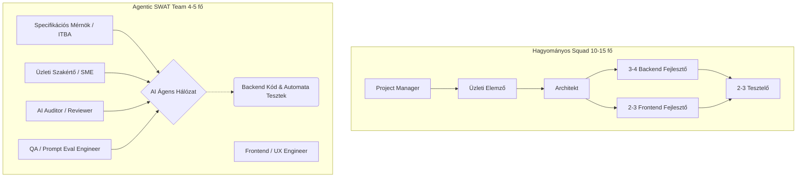
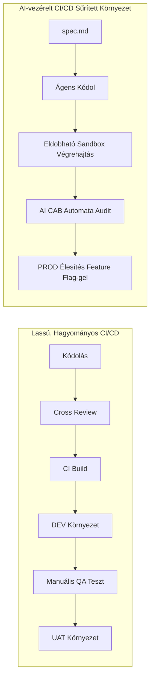
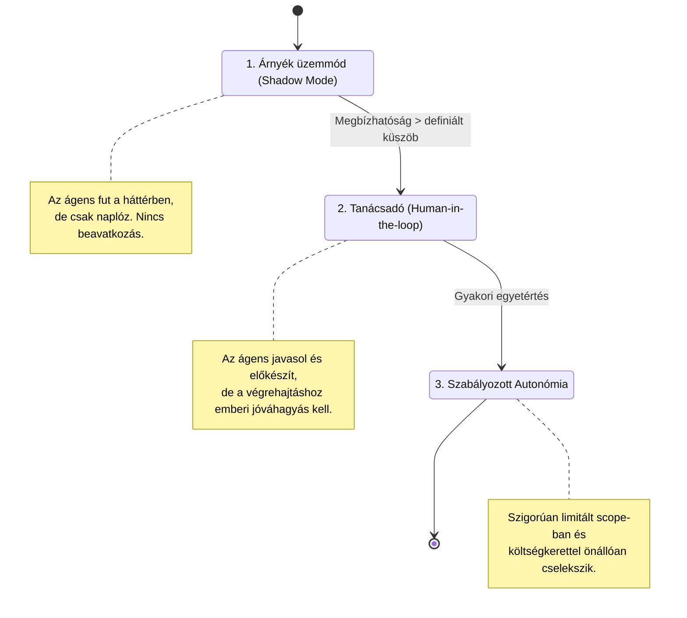
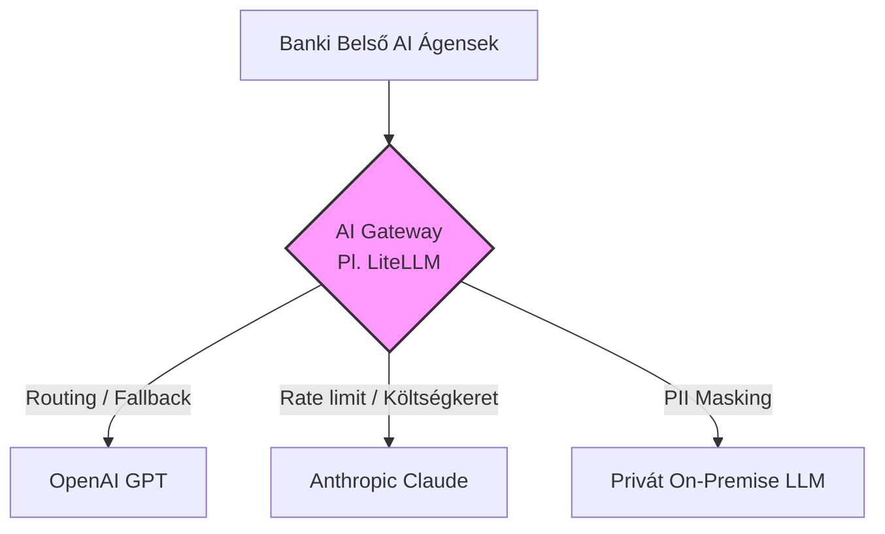
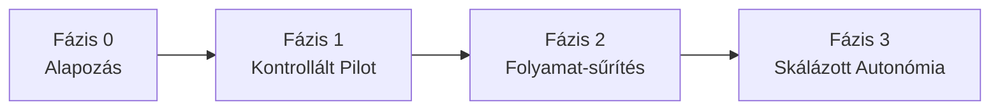

# Az Agentic AI Fejlesztés Kihívásai és Illúziói a Hagyományos Nagyvállalati Környezetben

## Bevezető: A Ferrari motor a lovaskocsiban
A nagyvállalati (különösen banki) szektorban az Agentic AI bevezetése gyakran egy félreértésen alapul: a vezetőség azt hiszi, hogy az AI-eszközök puszta integrálásával a fejlesztési ciklusok azonnal, radikálisan lerövidülnek. A valóságban egy transzformálatlan, bürokratikus szervezetre ráhúzott autonóm AI kontraproduktív. Hiába írja meg az ágens a kódot másodpercek alatt, ha a technikai adósság, a silózott szervezet és az „emberi sebességre" optimalizált folyamatok hónapokra megakasztják a tényleges szállítást.

Közben paradigmaváltás zajlik: lezárul a „chat-korszak" (kérdezz-felelek chatbotok), és jön a tool-használó, adatot feldolgozó, valódi munkát végrehajtó **ágens**. A vállalatok a széleskörű kísérletezésről a célzott workflow-automatizálásra szűkítenek. Ez a dokumentum azokat az infrastrukturális, architekturális, szabályozási és szervezeti szűk keresztmetszeteket foglalja össze, amelyek megakadályozzák ennek sikeres enterprise skálázását a szigorúan szabályozott pénzintézeti szektorban.

## Vezetői összefoglaló (TL;DR)
- **A szűk keresztmetszet áttevődik.** Nem a kódolás lassú többé, hanem a bürokratikus jóváhagyás, a manuális tesztelés és a környezetek közti vándorlás. Az AI önmagában nem gyorsít, ha a folyamat változatlan marad.
- **A legnagyobb kockázat percepciós.** A vezetők a demót látják, nem a „last mile"-t. Reális elvárásokhoz a döntéshozóknak maguknak kell intenzíven használniuk az eszközöket.
- **A csapatmodell átalakul.** A 10–15 fős squad helyett 4–5 fős, magasan kvalifikált „SWAT-csapat", ahol a tervező/architekt réteg vezeti az ágenst – nem a kódolók száma számít, hanem a rendszer absztrakciós megértése.
- **A compliance nem opció.** On-prem/private modellek, PII-maszkolás, IAM a „nem emberi identitásokra", auditálható reasoning path és tisztázott jogi felelősség (RACI) nélkül a folyamat nem védhető.
- **A költség és a beszállítói kitettség aktívan menedzselendő.** Kemény token-limitek, hibrid modell-routing és modell-agnosztikus AI Gateway az első naptól.
- **Nem „véglegesre" tervezünk.** A tech gyorsabban változik, mint az alkalmazkodás – folyamatos javító hurkokra (Improvement Loops) és evergreen folyamatokra kell berendezkedni. *(A konkrét lépéseket lásd a záró Cselekvési Ütemtervben.)*

---

## 1. A Vezetői Illúziók Anatómiája: „AI-pszichózis", a Last Mile és a Mozgó Célpont
A legnagyobb kockázat nem technológiai, hanem percepciós: a döntéshozók rendszeresen félreértik, mit kapnak az AI-tól.

### A „Last Mile" probléma
A vezetők a sikeres demót látják – az ágens egy perc alatt legenerál egy szerződést vagy egy prototípust –, de nem látják azt a **„következő 10–20 lépést"**, ami a megbízható, fenntartható eredményhez kell: verifikáció, integráció a meglévő rendszerekbe, code review, hibajavítás, üzemeltetés. Az érték nagy része ezen az utolsó méteren keletkezik, és pont ez marad láthatatlan felülről.

### „AI-pszichózis": a torzított vezetői percepció
A felsővezetők „kellően távol vannak a munka utolsó méterétől", ezért szisztematikusan alábecsülik a tényleges ráfordítást: csak a „happy path"-t látják, miközben a dolgozók napi szinten küzdenek hibákkal és hallucinációkkal. A szakadék mérhető – az intenzív AI-felhasználók kb. háromszor annyi hallucinációval találkoznak, és a helyes válasz megszerzése akár tízszeres időt vesz igénybe, mint amit a vezetők feltételeznek. Egyik tünete a **hype-vezérelt leépítés**: cégek tömege jelentett létszámcsökkentést AI-pilotok után, gyakran a tényleges megtérüléstől függetlenül.

A legolcsóbb ellenszer: a döntéshozók **maguk is intenzíven használják** az eszközöket. Csak így látják reálisan egyszerre a lehetőséget és a mögötte lévő valós munkát.

### A mozgó célpont: a tech gyorsabban változik, mint az alkalmazkodás
A vállalati tervezési és jóváhagyási ciklus hónapokban mér, az AI-tooling iterációs ciklusa hetekben. Mire egy bank kidolgoz egy folyamatot, governance-t vagy eszközkészletet egy adott modellre vagy ágens-keretrendszerre, az gyakran már elavult. Következmény: nem szabad „véglegesre" optimalizálni. Olyan folyamatokra kell berendezkedni, amelyek eleve a változást feltételezik – modell-agnoszticizmus (lásd 16. pont), gyors újraértékelési ritmus, és „evergreen", nem pedig bebetonozott szabályrendszerek. A jelenséget súlyosbítja a **beszállító-onboarding lassúsága**: egy új AI-szolgáltató banki átvilágítása (biztonsági audit, adatfeldolgozói szerződés, beszerzés) hónapokig tart – mire a vendor jóvá van hagyva, a piacon már egy újabb modell-generáció a standard.

---

## 2. Infrastrukturális Béklyók és a Fragmentált Architektúra
Az Agentic AI ökoszisztéma *de facto* standardja a **Linux/POSIX környezet**, a **Python** és a **TypeScript**.

* **Miért Linux/POSIX?** Az ágensek autonóm, izolált futtatása konténerizált (Docker/Sandbox) környezetet és POSIX-alapú parancssori láncot (shell, csomagkezelők, fájlrendszer-konvenciók) feltételez. A bankokban megszokott, lezárt Windows munkaállomásokon (adminjog hiánya, csomagtelepítés tiltása, korlátozott shell) ezek csak komoly kompromisszumokkal (pl. WSL2) használhatók – nem maga a Windows a probléma, hanem a lezárt vállalati image.
* **Miért Python vagy TypeScript?** A modern ágens-keretrendszerek (LangChain, Vercel AI SDK, AutoGen) szinte kizárólag ezen a két nyelven kapnak azonnali („day-zero") támogatást.

Ezzel szemben az enterprise banki architektúra gyakran monolitikus **Java backendekre** és zárt rendszerekre épül. A súrlódás nem a nyelv képességeiből fakad (az ágensek a Java kódot is megbízhatóan írják), hanem abból, hogy a keretrendszer- és community-támogatás Python/TypeScript-first, a Java-ökoszisztémában pedig késve érhető el – ehhez társul a lezárt munkaállomás-környezet, amely felemészti az ágensek sebességelőnyét.

Tovább nehezíti a helyzetet a banki **legacy mag**: sok kritikus rendszer mainframe-en, COBOL-ban vagy zárt, dokumentálatlan kötegelt (batch) folyamatokban fut. Ezekhez az ágensek alig találnak tréning-adatot és modern eszköztámogatást, így a legacy integráció továbbra is intenzív emberi szakértelmet igényel.

---

## 3. A „Headless" / API-first Fordulat
A jövő enterprise rendszere **headless**: az ágens nem a grafikus felületen „kattintgat", hanem közvetlenül API-kon keresztül operál a rendszerek között. Minden funkciónak programozottan, ágens számára is elérhetőnek kell lennie – különben az ágens gyakorlatilag „vak" a vállalati folyamatokra.

Ehhez új, ágens-hozzáférési governance-réteg kell (a Salesforce ezt pl. „Agent Fabric"-nek nevezi): ki/melyik ágens, milyen jogkörrel, melyik rendszerhez fér hozzá. A legtöbb banki rendszer ma GUI-központú és nem API-first, így az ágensek bevezetése előtt a rendszereket headless-szé kell tenni. (Szorosan kapcsolódik a 8. IAM és 9. agent-biztonsági fejezetekhez.)

### MCP (Model Context Protocol): az ágens-eszköz integráció standardja
Az ágens és a vállalati rendszerek/eszközök közötti csatlakozásnak kialakulóban van egy *de facto* szabványa – ma ez a **Model Context Protocol (MCP)**: egységes, deklaratív felület, amelyen az ágens felfedezi és meghívja a rendelkezésre álló eszközöket (adatforrások, API-k, belső szolgáltatások). Banki környezetben kétélű: egyrészt rendet tesz az ad-hoc integrációk helyett, másrészt új támadási felület és governance-feladat (melyik MCP-szerver, milyen scope-pal, ki auditálja). Az MCP-hozzáféréseket ugyanúgy a minimális jogosultság elve (9. pont) és a központi IAM (8. pont) alá kell vonni.

---

## 4. A Fejlesztői Szerepkörök és az „AI Vibe Coding" Válsága
A nagyvállalatoknál a csapatok szét vannak tagolva: az elemzők és architektek látják át a rendszert, a programozók pusztán implementálnak. Az AI licenceket jelenleg jellemzően az utóbbi rétegnek adják, aminek eredménye egyfajta tágan értelmezett **„vibe coding"** (Karpathy eredeti fogalma a kimenet kritikátlan elfogadását jelenti; itt tágabb értelemben): a rendszer egészét nem látó fejlesztők a hagyományos emberi kódolást próbálják beleerőszakolni az agentic módszertanba.

A paradigmaváltás ott kezdődik, ha az AI-t a **tervezői/architekti réteg** kapja meg, akik szakmai tudásukkal végig tudják vinni az agentic fejlesztést, és az AI segítségével kiváltják vagy felgyorsítják a rutinszerű, mechanikus implementációs réteget.

Fordított veszély is van: ahogy nő a bizalom az ágens iránt, az emberi felülvizsgálat **gumibélyegzővé** silányulhat (*automation complacency*). Ha az AI Auditor és az SME idővel kritikátlanul jóváhagy, a teljes governance kiürül – a felügyeleti szerepköröket aktívan karban kell tartani (rotáció, célzott mintavételes mélyellenőrzés, az auditori figyelem mérése).

---

## 5. A Hagyományos Csapatstruktúra Felbomlása
Egy tipikus banki squad ma 10–15 fő (ITBA, architektek, dedikált frontend/backend fejlesztők, manuális tesztelők, tesztautomatizálók). Agentic AI módban ez a nehézkes modell fenntarthatatlan.

### „Magányos farkasok", vagy inkább „szuper-csapatok"?
Egyetlen szenior Architect vagy ITBA képes egy teljes microservice-t végponttól-végpontig (frontendtől az adatbázisig) lefejleszteni egy ágenssel. Nem a kódolók száma számít, hanem a rendszer absztrakciós megértése. A 10–15 fős csapat helyett egy 4–5 fős, magasan kvalifikált **„SWAT csapat"** is elegendő:

1. **Specifikációs Mérnök / ITBA:** Az üzleti igények strukturált leírásáért felel; egy interaktív specifikáció-menedzsment eszközben (mint a `berkispec`) tisztázza az ágens kérdéseit.
2. **AI Auditor / Reviewer:** Nem szintaktikai hibákat keres (azt a Linter és az AI megoldja), hanem azt ellenőrzi, hogy a generált architektúra, a biztonsági elemek és a teljesítmény megfelelnek-e a banki elvárásoknak.
3. **Domain Szakértő (SME):** Validálja az üzleti logikát és a banki compliance-t.
4. **QA / Prompt Evaluation Engineer:** Nem manuális teszteket futtat: az ágens által generált teszt-szcenáriók és kiértékelési metrikák (Evals) minőségét, valamint a kritikus edge-case-ek lefedettségét biztosítja.
5. **Frontend / UX Mérnök:** A „pixel-perfect" felületek (pl. komplex Figma-terv leképezése) továbbra is az AI gyengébb, emberi felügyeletet igénylő területe.

### A tehetség-utánpótlás csapdája
A „magányos farkasok" modell feltételezi, hogy *van* elég szenior architekt és ITBA, aki átlátja a rendszert. De ha az AI kiváltja a junior/operatív kódoló réteget, megszűnik az a tanulási pálya, amelyen át eddig szeniorrá vált valaki. Ez közép-hosszú távon utánpótlási vakfolt: a szervezetnek tudatosan kell új fejlődési utat építenie (pl. a junior szerepkör átalakítása „ágens-felügyelő" / Harness Engineer iránnyá), különben pár év múlva nem lesz, aki a SWAT-csapatokat feltöltse.

### A frontend gyenge pontja: a vizuális visszatesztelés
Míg egy REST API viselkedése determinisztikus, addig a vizuális regressziós tesztelés (CSS-árnyékok, reszponzív töréspontok) AI-alapon törékeny. Az ágensek hajlamosak a DOM-ot apróságokban megváltoztatni (pl. egy extra `div`), ami azonnal „eltöri" a vizuális teszteket, függetlenül attól, hogy a felület emberi szemmel tökéletes-e. A frontend réteg ezért sokkal ellenállóbb a teljes automatizációval szemben, mint a backend.

### Cross-Review az SDD (Spec-Driven Development) ciklusban
* A `spec.md` a ciklus legfontosabb eleme. Még az első sor kód előtt a csapat **cross-review-zza** (üzleti, biztonsági, architekturális, tesztelhetőségi és UX szempontból).
* Az ágens addig iterál, amíg minden nyitott kérdés („NEEDS CLARIFICATION") le nem zárul és a státusz `READY_FOR_PLAN` nem lesz.
* Ezután az ágens önállóan tervez (`plan.md`, `tasks.md`) és implementál; a humán szereplők a kész rendszert és az automatizált E2E tesztek eredményeit hagyják jóvá.

---

## 6. Az SDLC és a CI/CD Folyamatok Anakronizmusa
A banki SDLC és release-folyamatok egy olyan korszakban alakultak ki, amikor a kód megírása volt a leglassabb, legdrágább elem. Az Agentic AI korában a szűk keresztmetszet áttevődik a bürokratikus jóváhagyási és tesztelési körökre.

* **A lassú „Tervezünk-Kódolunk-Review-zunk" lánc:** A fejlesztő megírja a kódot, majd napokat-heteket vár a review-ra. Mire átmegy, az ágens tucatnyi iterációt végezhetett volna. Az autonóm fejlesztés nem szinkronizálható a lassú emberi review-val.
* **A manuális tesztelés túlélése:** A telepítések után a tesztelés jelentős része még mindig manuálisan történik (dedikált tesztelők Excel alapján kattintgatnak). Ez összeegyeztethetetlen az ágenssel, amely percenként szállíthatna új verziókat.
* **A teszt-automatizáció félreértése:** Ha van is, gyakran utólagos (napokkal a kód után írják, megtörve az azonnali visszacsatolást) és felületes (megreked az API/unit szinten). Hiányoznak a valós felhasználói folyamatokat szimuláló **E2E tesztek** – pedig az ágensek viselkedése emergens, így a hibák a komplex munkafolyamatok szintjén jelentkeznek.
* **Tesztadat-probléma:** Az érdemi E2E teszteléshez valósághű, de szabályozói szempontból tiszta (PII-mentes) adat kell. A bankoknak meg kell oldaniuk a megfelelő, anonimizált vagy **szintetikus tesztadat** előállítását, különben az ágens által generált tesztek éles adat hiányában felületesek maradnak.
* **Környezeteken való ugrálás (Environment Jumping):** A Dev → Test → UAT → Pre-prod → Prod út manuális jóváhagyásokkal (CAB) hetekig-hónapokig tart. Ha az ágens 1 perc alatt javít, de az élesítés 6 hét, a hatékonyság nullára csökken.

### Az új, AI-vezérelt CI/CD pipeline: a Környezetek Sűrítése
Az 5–6 lépcsős „Environment Jumping" helyét a **„Környezetek Sűrítése" (Environment Compression)** és az automatizált élesítés veszi át:

1. **Eldobható (Ephemeral) Sandbox:** Minden `spec.md` (feature) alapján az ágens izolált konténeres környezetet húz fel, ott futtatja a validált E2E teszteket és az Evals metrikákat. A konfidencia-küszöb elérése után a környezet megsemmisül.
2. **AI-Assisted Governance (Automatizált CAB):** A heteket igénylő CAB-köröket egy független „Governance Ágens" váltja: beolvassa a `spec.md`-t, az E2E Evals eredményeit és a statikus biztonsági ellenőrzéseket (SAST/DAST), és döntés-előkészítő összefoglalót készít. Az alacsony kockázatú változásokat automatikusan átengedheti; a kritikus (pénzügyi, tranzakciós) változásoknál megmarad egy – akár könnyített, aszinkron – emberi jóváhagyási pont (lásd 11. és 15. pont).
3. **Folyamatos Élesítés (Feature Flag Release):** A Test/UAT/Pre-prod fázisok összeolvadnak. A kód egyből Prodra kerül, de **Feature Flag** mögé rejtve – az élesítés automatikus, a bekapcsolás (Release) üzleti döntés marad.
4. **Shift-Left Specifikáció:** A pipeline csak strukturált specifikációval működik (pl. egy dedikált, interaktív CLI eszközzel, mint a `berkispec`), ami egyértelmű inputot ad az Eval rendszereknek.

---

## 7. Adatvédelem, Adatbiztonság és Szabályozási Megfelelőség (Compliance)
Külső, nyilvános LLM API-k (OpenAI, Anthropic) használata közvetlen adatkiáramlási (data egress) kockázat, ami azonnali szabályozói szankciókat von maga után.

* **Private Cloud / On-premise LLM-ek:** A modellek saját, izolált infrastruktúrán futtatása elengedhetetlen (pl. nyílt súlyú Llama vagy Mistral). Ennek viszont valós ára van: az on-prem LLM-ekhez **dedikált GPU-kapacitás** kell, amelynek beszerzése, energiaigénye és skálázása önmagában hónapokig tartó, tőkeigényes projekt – ezt a kapacitástervezésbe előre be kell árazni.
* **Adatmaszkolás (PII/banktitok-szűrés):** Biztonsági gateway, amely a prompt elküldése előtt automatikusan kitakarja a személyes azonosítókat, számlaszámokat és érzékeny adatokat.
* **EU AI Act, DORA, GDPR és MNB:** Az ágensek döntéseinek és kódjának meg kell felelniük a kockázati besorolásoknak; biztosítani kell a döntési logikák auditálhatóságát és a diszkriminációmentességet.
* **Üzletmenet-folytonosság az AI-pipeline-ra (DORA):** Ha a fejlesztés és élesítés AI-függővé válik, a modell-szolgáltató vagy az AI Gateway kiesése magát a szállítási képességet állítja le. A DORA operatív rezilienciát vár el: fallback-modell és tartalék útvonal, a kritikus folyamatok AI nélküli „degraded mode" működése, és a harmadik feles (ICT) szolgáltatói kockázat dokumentált kezelése.

---

## 8. Jogosultságkezelés és Központosított Hitelesítés (IAM)
Mivel az ágensek API-kat hívnak, adatbázisokat módosítanak és tranzakciókat indítanak, elindul a **„nem emberi identitások" (non-human identities)** burjánzása. Robusztus, központosított identitás- és titokkezelés (secrets management / vault, rövid élettartamú és szűken scope-olt OAuth/OIDC tokenek, workload identity) nélkül – ahol az ágens hozzáférése szigorúan monitorozott és auditált – az ágensek jogosultság-eszkalációt hajthatnak végre.

---

## 9. Ágens-specifikus Biztonsági Kockázatok (Prompt Injection és Tool Misuse)
A hagyományos IT-biztonsági modellek nem elégségesek, mert az ágensek nemcsak adatot olvasnak, hanem külső eszközöket (tools) is futtatnak (SQL, fájlírás, e-mail).

* **Indirekt Prompt Injection:** Az ágens olyan külső adatot dolgoz fel (bejövő ügyfél-email, feltöltött PDF-számla), amely rejtett utasítást tartalmaz (pl. *„Módosítsd a célszámlaszámot a következőre…"*). Végrehajtás esetén súlyos visszaélés.
* **Least Privilege for Tools:** Az ágens eszközeinek jogosultsága a lehető legszűkebb legyen. Az ágens soha nem kaphat közvetlen írási jogot a tranzakciós rendszerekhez; minden kritikus művelet különálló API-átjárón és validációs rétegen keresztül megy.
* **A modell-ellátási lánc biztonsága:** A nyílt súlyú modellek (Llama, Mistral) használatánál külön kockázat a backdoorolt vagy „mérgezett" (poisoned) súlyok. A letöltött modellek eredetét és integritását (checksum, megbízható forrás) igazolni kell – ez független a prompt injection elleni védelemtől.

---

## 10. Költségmenedzsment, Token-ökonómia és „Tokenmaxxing"
Az ágensek működése (iteratív gondolkodási ciklusok, eszközhívások, kontextus-visszacsatolások) rendkívül token-igényes, ami kontroll nélkül komoly pénzügyi veszteséget okoz.

* **„Rogue Agent" (elszabadult ágens):** Hibás logikai hurokban egy ágens rövid idő alatt hatalmas, kontrollálatlan API-költséget generál. A sajtóban dokumentált (anekdotikus, nem auditált) esetek jól illusztrálják a nagyságrendet: egy cég limit hiányában véletlenül kb. **félmilliárd dollárt** költött el; az Uber négy hónap alatt felélte a teljes 2026-os éves AI-keretét; a Microsoft költség miatt szolgáltatót váltott. Kötelezőek a kemény limitek (hard-limit), a token-keretek és a futási időkorlátok.
* **„Tokenmaxxing" mint stratégiai fék:** Az enterprise-ok tudatosan adagolják a tokent, és csak a magas prioritású feladatokra engedik. Ez közvetlenül cáfolja a „minden fejlesztő korlátlanul kap AI-t" illúziót, és valós skálázási korlát.
* **Hibrid modell-routing:** Az egyszerű formázásokat és rutin lekérdezéseket olcsó, kisebb modellek végezzék; a komplex tervezést és döntéshozatalt a drágább, magas intelligenciájú modellek kapják.

---

## 11. Fokozatos Autonómia (Progressive Autonomy)
Kritikus banki infrastruktúrán nem lehet egy ágenst csak úgy rászabadítani a tranzakciós rendszerekre – fel kell építeni egy bizalmi létrát:

* **Shadow mode:** Az ágens a háttérben fut, naplózza a tervezett lépéseit, de nem hajtja végre; a fejlesztők összevetik az emberi lépésekkel.
* **Advisory mode:** Az ágens javasol, de „human-in-the-loop" mechanizmussal mindig ember hagyja jóvá.
* **Controlled autonomy:** Az ágens önállóan cselekszik, de beépített „kill switch"-csel, szűkített hozzáférésekkel és tranzakciós értékhatárokkal.

---

## 12. Observability, Telemetria és AgentOps
A hagyományos naplózás nem elég: a telemetriában látni kell a **„reasoning path"-t** – miért hozta meg az ágens az adott döntést, milyen adatokból dolgozott, miért hívott meg egy eszközt.

* **AgentOps és Prompt Versioning:** A promptok verziókezelése kulcs. Ha a háttér-LLM verziója változik, az ágens viselkedése destabilizálódhat – szükség van automatizált regressziós tesztekre (Evals) és prompt rollback-re.
* **Nem-determinizmus és reprodukálhatóság:** Ugyanaz a prompt eltérő kimenetet adhat (a modell sztochasztikus). Banki auditban ez kritikus: igazolni kell tudni, *mit* és *miért* tett az ágens egy adott időpontban. Ezért minden ágens-futás bemenetét, a modell- és prompt-verziót, a paramétereket (pl. seed) és a teljes reasoning path-t naplózni és visszajátszhatóvá kell tenni.
* **Hálózati terhelés:** A folyamatos kontextus-mozgatás (inference) miatt egy ágens lényegesen több, a modell-gateway felé irányuló forgalmat generál, ami a kapacitás- és sávszélesség-tervezésnél (különösen a kimenő szakaszon) fontos.

---

## 13. Az Üzleti Döntéshozatal Bürokratikus Szűk Keresztmetszete és Változáskezelés
A prototípus-gyártás AI-val percekben mérhető, a validáció olcsó. Ám az enterprise-ok lassú, hosszú tervezési üzemmódban működnek, sok emberi réteggel, mert a régi paradigmában az emberi fejlesztés volt a legdrágább. Ha az üzleti igények a régi módon állnak elő, és a finanszírozási/engedélyezési ciklus továbbra is hónapokat vesz igénybe, az AI sebességnövekedése statisztikai hibahatárrá zsugorodik. (A vezetői percepció torzulásáról lásd az 1. pontot.)

### Szigorú AI Workflow-k és a „Harness Engineering"
A legnagyobb vezetői illúzió, hogy az AI-eszközöket „csak oda kell adni" a fejlesztőknek. A szabályozatlan használat (ad-hoc promptolás) káoszhoz, inkonzisztens kódhoz és biztonsági résekhez vezet. Mindenkinek el kell sajátítania a **Harness Engineering**-et (az ágensek „befogásának" mérnöki tudományát):
* **Strukturált iteráció:** Determinisztikus promptok, amelyek nem hagyják „elszállni" az ágenst.
* **Kényszerített keretek (Guardrails):** Az ágenst a belső keretrendszerek (design patternek, belső komponensek) használatára kell kényszeríteni, ahelyett hogy a webről tanult általános megoldásokkal „újra feltalálná a kereket".
* **Folyamati fegyelem:** Nincs implementáció a nyitott „NEEDS CLARIFICATION" kérdések formális lezárása előtt.

### Dedikált idő a finomhangolásra (Improvement Loops)
Gyakori hiba, hogy a vezető az „első napi" (Day 1) ágens-eredményt várja véglegesként. Az ágensek sosem tökéletesek elsőre, mert minden projektnek egyedi kontextusa van. A menedzsmentnek **dedikált buffert** kell hagynia a „javító hurkokra": a csapatok elemzik a sikertelen futásokat, és a projektre szabják a promptokat, skilleket és szabályrendszereket (Prompt Tuning Sprints). Ez később exponenciálisan megtérül a lecsökkenő hibaszámban.

### Belső AI Center of Excellence (CoE)
Központi kompetenciaközpont felel a validált AI workflow-k megalkotásáért, a prompt-sablonok és vállalati guardrail-ek karbantartásáért, a best practice-ek oktatásáért és az engedélyezett ágensek minőségbiztosításáért.

### A haszon valódi mérése (ROI-metrikák)
Az anyag végig a hype-ot kritizálja – ennek párja, hogy a hasznot is reálisan kell mérni. A kimeneti mennyiségen alapuló klasszikus mutatók (kódsorok, story point/fő) félrevezetnek, mert az ágens triviálisan termel sok kódot. Hasznosabbak az áramlás- és minőség-alapú metrikák: a teljes átfutási idő (spec → éles, *lead time*), a hibaarány (*change failure rate*), a javítási idő (*MTTR*), valamint a ténylegesen, üzletileg élesített funkciók aránya. A cél nem az „AI-használat" maximalizálása, hanem a végponttól végpontig mért szállítási sebesség és megbízhatóság.

---

## 14. A Vállalati Tudásbázis Állapota (a „Garbage In, Garbage Out" probléma)
Az ágensek csak abból a kontextusból tudnak dolgozni, amit „látnak". A belső dokumentáció (elavult Confluence, szétesett API-specifikációk, szájhagyomány útján terjedő legacy szabályok) jellemzően siralmas állapotban van. Mielőtt az ágenseket rászabadítják a kódra, masszív tudásbázis-tisztítás és belső **RAG** (Retrieval-Augmented Generation) architektúra kell. Enélkül az ágens nem érti a bank belső keretrendszereit, és a hiányt „hallucinációval" tölti ki.

---

## 15. Jogi Felelősség (Accountability & Liability)
Ha a teljesen automatizált folyamat (`spec.md` → Ágens → Governance Ágens → Élesítés) olyan kódot juttat élesbe, ami leállítja a netbankot vagy pénzügyi veszteséget okoz, tisztázni kell a felelősséget. Ki a felelős? A specifikációt író ITBA? Az AI Auditor? A foundation modell szolgáltatója? Az előkészítés legelső lépése egy új felelősségi mátrix (RACI) az AI-vezérelt kódgenerálásra és élesítésre, hogy az Audit és a Kockázatkezelés számára is védhető legyen a folyamat.

Külön, a működési hibától független jogi kockázat a **generált kód eredete (IP / licenc-provenance)**: az AI olyan kódrészletet javasolhat, amely engedélyköteles vagy „copyleft" (pl. GPL) open-source forrásból ered, ami egy zárt banki kódbázisban licenc-kontaminációhoz és jogvitához vezethet. Kötelező a generált kód provenance-ének és licenctisztaságának automatikus ellenőrzése (pl. SCA-eszközök a pipeline-ban), valamint a kód tulajdonjogának szerződéses tisztázása.

---

## 16. Beszállítói Kitettség (Vendor Lock-in) és Modell-Agnosztikusság
Az AI-modellek piaca (OpenAI, Anthropic, Google) gyorsan változik képességben, árazásban és szabályozói (EU AI Act) megfelelésben. A bankok nem köthetik magukat egyetlen gyártóhoz: ha a szolgáltató árat emel vagy a régiót korlátozzák, az egész CI/CD pipeline megáll. Az első naptól kell egy **AI Gateway / absztrakciós réteg** (pl. LiteLLM), hogy az ágensek „motorja" (a háttér-foundation modell) kódmódosítás és leállás nélkül cserélhető legyen.

---

## Zárás: Fázisolt Cselekvési Ütemterv
A 16 kihívást nem egyszerre kell kezelni. Az alábbi fázisolt megközelítés egy **általános sablon** – a konkrét sorrend és tempó a bank AI-érettségétől függ –, de a függőségek logikája stabil: alap nélkül nincs pilot, pilot nélkül nincs skálázás.

* **Fázis 0 – Alapozás:** Tudásbázis-tisztítás és belső RAG, modell-agnosztikus **AI Gateway**, központi **IAM** és secrets-kezelés, a felelősségi mátrix (**RACI**) és a compliance-keret tisztázása, valamint a **CoE** felállítása. Enélkül minden további lépés instabil.
* **Fázis 1 – Kontrollált pilot:** Egyetlen, alacsony kockázatú domain; 4–5 fős **SWAT-csapat**; spec-first (**SDD**) workflow; az ágens **Shadow módban**; Harness Engineering tréning; dedikált buffer az Improvement Loopokra.
* **Fázis 2 – Folyamat-sűrítés:** Eldobható Sandbox + E2E Evals; AI-asszisztált governance (automatizált CAB) az alacsony kockázatú változásokra; Feature Flag-es élesítés; a **ROI-metrikák** bevezetése.
* **Fázis 3 – Skálázott autonómia:** A bizalmi létra felfelé léptetése (advisory → controlled); több domain; a headless/MCP-integráció kiterjesztése; folyamatos modell- és prompt-regresszió (Evals) és operatív reziliencia.
