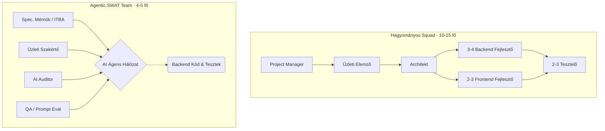
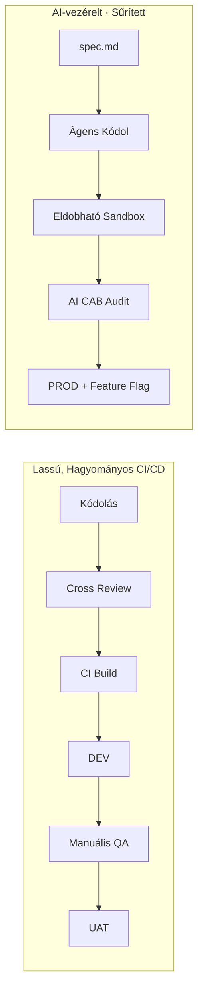
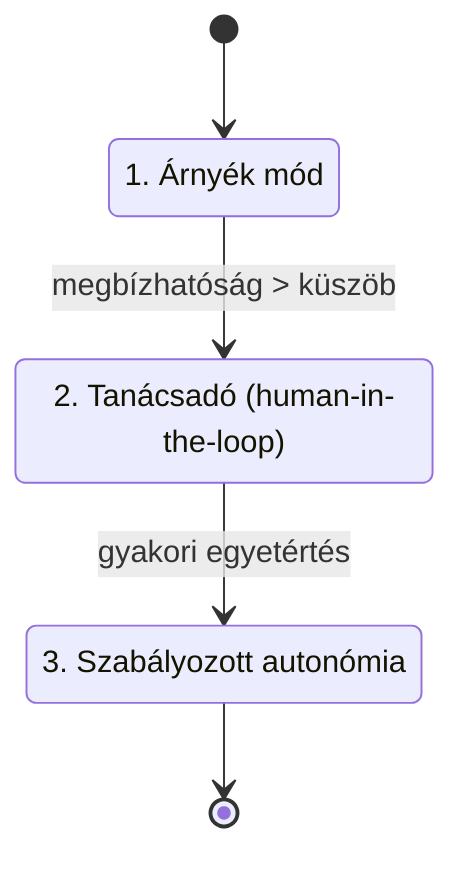
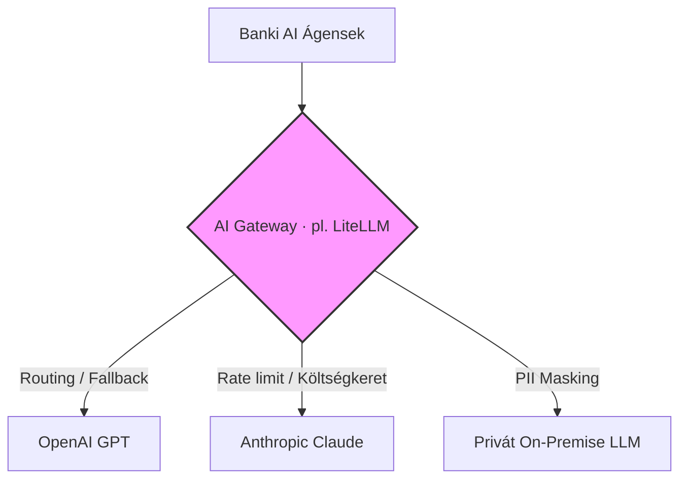
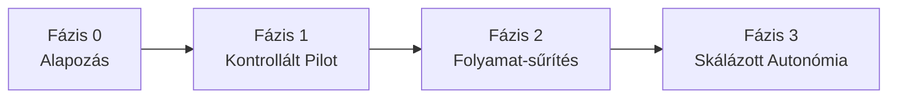

# Az Agentic AI a Nagyvállalati Környezetben

## Kihívások és illúziók a szabályozott pénzintézeti szektorban

  Infrastruktúra · Architektúra · Folyamat · Compliance · Szervezet

---
layout: statement
---

# „Ferrari motor a lovaskocsiban"

Egy transzformálatlan, bürokratikus szervezetre ráhúzott autonóm AI **kontraproduktív**.

Hiába írja meg az ágens a kódot másodpercek alatt, ha a technikai adósság, 
a silózott szervezet és az „emberi sebességre" optimalizált folyamatok 
<b>hónapokra megakasztják</b> a tényleges szállítást.

---

# Paradigmaváltás: a chat-korszak vége

### 🗨️ Chat-korszak
- Kérdezz–felelek chatbotok
- Az ember tesz mindent
- Széleskörű kísérletezés

### 🤖 Agent-korszak
- Tool-használat, adatfeldolgozás
- **Valódi munkavégzés** autonóm módon
- Célzott workflow-automatizálás

A kérdés már nem „mit tud az AI", hanem <b>„hogyan skálázzuk biztonságosan az enterprise-ban".</b>

---
layout: default
---

# Vezetői összefoglaló (TL;DR)

- 🚦 **A szűk keresztmetszet áttevődik** — nem a kódolás lassú, hanem a jóváhagyás, a manuális tesztelés és a környezet-vándorlás. Az AI önmagában nem gyorsít.
- 🧠 **A legnagyobb kockázat percepciós** — a vezetők a demót látják, nem a „last mile"-t. Maguknak is használniuk kell az eszközöket.
- 👥 **A csapatmodell átalakul** — 10–15 fős squad helyett 4–5 fős „SWAT-csapat"; nem a kódolók száma, hanem az absztrakciós megértés számít.
- 🔒 **A compliance nem opció** — on-prem modellek, PII-maszkolás, IAM, auditálható reasoning path, tisztázott jogi felelősség (RACI).
- 💸 **A költség és a vendor-kitettség menedzselendő** — kemény token-limitek, hibrid routing, modell-agnosztikus AI Gateway az első naptól.
- 🔄 **Nem „véglegesre" tervezünk** — a tech gyorsabban változik, mint az alkalmazkodás; folyamatos javító hurkokra kell berendezkedni.

---
layout: section
---

# I. A vezetői illúziók

---

# A vezetői illúziók anatómiája

### 🎯 Last Mile
A demó látható, a **„következő 10–20 lépés"** nem: verifikáció, integráció, code review, üzemeltetés. Az érték itt keletkezik.

### 🧠 „AI-pszichózis"
A vezetők csak a „happy path"-t látják. A valóság mérhető: **~3× több hallucináció**, **~10× hosszabb** válaszidő. Tünet: hype-vezérelt leépítés.

### 🔄 Mozgó célpont
A tervezési ciklus hónap, a tooling hét. Mire kész a folyamat, **már elavult**. Nem „véglegesre" optimalizálunk.

A legolcsóbb ellenszer: a döntéshozók <b>maguk is intenzíven használják</b> az eszközöket.

---
layout: section
---

# II. Technológia & Architektúra

---

# Infrastrukturális béklyók

### Az ágens-ökoszisztéma standardja
- **Linux/POSIX** — izolált, konténerizált futtatás
- **Python / TypeScript** — „day-zero" keretrendszer-támogatás

### A banki valóság
- Lezárt **Windows** image (adminjog, csomag, shell tiltva → WSL2)
- Monolitikus **Java** backend (késő community-támogatás)
- **Legacy mag**: mainframe / COBOL / batch

A súrlódás nem a nyelv képességéből fakad — a lezárt környezet felemészti az ágens sebességelőnyét.

---

# A „Headless" / API-first fordulat

- A jövő rendszere **headless**: az ágens nem GUI-n „kattintgat", hanem **API-kon** operál.
- Minden funkció programozottan elérhető — különben az ágens „vak" a folyamatokra.
- Új governance-réteg kell: *ki / melyik ágens / milyen scope / melyik rendszerhez*.

### 🔌 MCP (Model Context Protocol)
Az ágens–eszköz integráció kialakuló *de facto* szabványa: egységes felület az eszközök felfedezésére és hívására.

> Kétélű: rendet tesz az ad-hoc integrációk helyett, **de** új támadási felület → minimális jogosultság + központi IAM alá kell vonni.

---
layout: section
---

# III. Folyamat & Csapat

---

# A csapatstruktúra felbomlása

Nem a kódolók száma számít, hanem a rendszer <b>absztrakciós megértése</b>.

---

# Az új SWAT-csapat szerepei

- **Specifikációs Mérnök / ITBA** — strukturált üzleti igény; tisztázza az ágens kérdéseit (`spec.md`).
- **AI Auditor** — nem szintaxist néz, hanem architektúrát, biztonságot, teljesítményt.
- **Domain Szakértő (SME)** — üzleti logika és banki compliance validálása.
- **QA / Prompt Eval Engineer** — az ágens-generálta teszt-szcenáriók és Evals minősége.
- **Frontend / UX Mérnök** — a „pixel-perfect" UI az AI gyengébb területe.

⚠️ **Két új kockázat:** a *tehetség-utánpótlás* (honnan lesz a következő szenior?) és az *automation complacency* (a felülvizsgálat gumibélyegzővé silányul).

---

# Az SDLC anakronizmusa

A szűk keresztmetszet áttevődik a kódolásról a **bürokratikus jóváhagyásra**:

- 🐢 **Lassú review-lánc** — napok/hetek, míg az ágens tucat iterációt tenne.
- 🖱️ **Manuális tesztelés túlélése** — Excel-alapú kattintgatás vs. percenkénti szállítás.
- 🧪 **Félreértett automatizálás** — utólagos, felületes (unit/API), hiányzó **E2E**.
- 🧫 **Tesztadat-probléma** — valósághű, de PII-mentes (szintetikus) adat kell.
- 🪜 **Environment Jumping** — Dev→Test→UAT→Pre-prod→Prod, CAB-kapukkal, hetekig.

Ha az ágens 1 perc alatt javít, de az élesítés 6 hét → a hatékonyság <b>nullára esik</b>.

---

# Új CI/CD: a környezetek sűrítése

- **Eldobható Sandbox** — feature-enkénti izolált környezet, E2E Evals, majd megsemmisül.
- **AI-asszisztált Governance** — Governance Ágens előminősít; kritikusnál marad emberi pont.
- **Feature Flag Release** — Prodra kerül, de kapcsoló mögött; a *bekapcsolás* üzleti döntés.
- **Shift-Left Specifikáció** — strukturált `spec.md` (pl. `berkispec`) hajtja a pipeline-t.

---
layout: section
---

# IV. Biztonság, Compliance & Költség

---

# Adatvédelem, IAM & ágens-biztonság

### 🛡️ Compliance (DORA, GDPR, EU AI Act, MNB)
- On-prem / private cloud LLM-ek (Llama, Mistral)
- PII / banktitok **maszkolás** prompt előtt
- Auditálhatóság, diszkriminációmentesség
- **Üzletmenet-folytonosság**: fallback, „degraded mode"

### 🔑 IAM & ágens-kockázatok
- „Nem emberi identitások" burjánzása → vault, rövid scope-olt token
- **Indirekt prompt injection** (pl. fertőzött PDF)
- **Least privilege** az eszközökre
- **Modell-ellátási lánc**: poisoned weights, provenance

---

# Költség & Token-ökonómia

### 🔥 „Rogue Agent" kockázat
Végtelen ciklus → kontrollálatlan költség.

*Dokumentált esetek:*
- ~**félmilliárd \$** limit nélkül
- Uber: éves keret **4 hónap** alatt
- Microsoft: szolgáltatóváltás költség miatt

### 🎛️ Kontroll-mechanizmusok
- **Hard-limit**, token-keret, időkorlát
- **Tokenmaxxing** — tudatos adagolás, csak magas prioritásra
- **Hibrid routing** — olcsó modell rutinra, drága a komplexre

---
layout: section
---

# V. Irányítás & Kockázat

---

# Fokozatos autonómia (bizalmi létra)

- **Shadow** — fut és naplóz, de **nem cselekszik**; összevetés az emberi lépésekkel.
- **Advisory** — javasol és előkészít, de **ember hagyja jóvá**.
- **Controlled** — önállóan cselekszik, de kill switch + szűk scope + értékhatár mellett.

---

# Observability, döntéshozatal, tudás, jog

### 👁️ Observability & AgentOps
- **Reasoning path** naplózása (miért döntött)
- Prompt-verziózás + Evals + rollback
- **Nem-determinizmus** → visszajátszhatóság

### 🏢 Döntéshozatal & változáskezelés
- A vezetői illúzió: „csak add oda" → **Harness Engineering**
- Improvement Loops (dedikált buffer)
- Belső **CoE**; **ROI** áramlás-metrikákkal (nem kódsor)

### 📚 Tudásbázis (Garbage In/Out)
- Elavult Confluence, szétesett API-k
- Tisztítás + belső **RAG** kell a hallucináció ellen

### ⚖️ Jogi felelősség
- Új **RACI** az AI-generált kódra/élesítésre
- **IP / licenc-provenance** (copyleft kontamináció) → SCA a pipeline-ban

---

# Beszállítói kitettség & modell-agnosztikusság

A piac (OpenAI, Anthropic, Google) gyorsan változik árban, képességben, szabályozásban. **Egyetlen gyártóhoz kötődni = a teljes pipeline kockázata.**

<b>AI Gateway / absztrakciós réteg az első naptól</b> — a „motor" leállás nélkül cserélhető.

---
layout: section
---

# Cselekvési ütemterv

---

# Fázisolt roadmap

**Fázis 0 — Alapozás**
RAG + tudásbázis, AI Gateway, IAM/secrets, RACI, CoE. *Enélkül minden instabil.*

**Fázis 1 — Kontrollált pilot**
1 alacsony kockázatú domain, SWAT-csapat, SDD, **Shadow mód**, Harness tréning.

**Fázis 2 — Folyamat-sűrítés**
Sandbox + E2E Evals, automatizált CAB, Feature Flag, **ROI-metrikák**.

**Fázis 3 — Skálázott autonómia**
Advisory → Controlled, több domain, headless/MCP kiterjesztés, folyamatos Evals.

---
layout: center
class: text-center
---

# Összefoglalva

Az Agentic AI **nem eszközkérdés, hanem szervezeti transzformáció**.

A kódolás megszűnt szűk keresztmetszet lenni — 
a verseny most a <b>folyamatok, a governance és a kultúra</b> átalakításán dől el.

Köszönöm a figyelmet!

