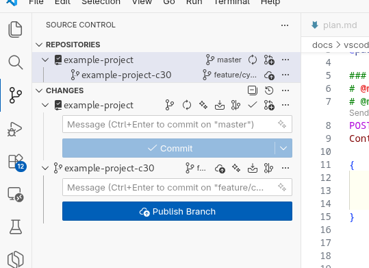

# conventions.md — Project conventions

← [Back to the main page](../../README.md) · [Page index](README.md)

**File:** `conventions.md` (project root)

**When it is created:** it is created once, when the `/bs-init-project` command is run at the start of a new project.

**Its role:** the central conventions document of the project — it records the project-specific technical agreements in one place, so that the agent does not have to make ad-hoc decisions. Every phase skill (01–09) references and reads it. **Its mere existence is the "done" marker:** if it exists, 01–09 only perform an existence check (there is no separate status field). On top of that, `08-doc-sync` uses the `## Project references` section as a source-grounding register (the paths of the HLD/LLD/openapi/external docs for the drift comparison and for the DS22 Layer 2 gate).

**What it contains:**
- **Tech stack & environment:** project overview, languages, runtimes, ports.
- **Project references:** the paths of the HLD, the LLD, OpenAPI descriptors and database schemas.
- **Testing conventions:** the test levels and the frameworks **recommended as defaults** for them (the developer confirms or overrides them in 00), and the run commands.
- **Sonar quality check (an optional section):** besides the scanner command, the **host URL** and the **name of the token's env variable** go here as well (the token itself **never**) — this is how `sonar-gate.py` finds the project. Alternatives: the `SONAR_HOST_URL` / `SONAR_PROJECT_KEY` / `SONAR_TOKEN` environment variables, or the repo's `sonar-project.properties`.
- **Test reporting (TR3 — a mandatory section):** per category, the tool, the **report-generating command** and the **artifact name** that has to end up in every cycle's `test-report/` folder — and within that, in the **subfolder of the validation round** (`validate/round-NN/`) — (Allure/Playwright HTML, pytest-html, JUnit XML, coverage). The last column of the table is **relative to the round folder**. Phase 00 fills it in together with the user (a mandatory question, no placeholder may remain), and `07-validate` holds it to account with a **deterministic gate** (`report-gate-check.py`): a missing artifact → the validation cannot be closed with a PASS. If the project deliberately generates no report, that is recorded by `**Report generation required:** no` + a justification. The `**Report phases:**` field (TR6) says **which phases** are obliged to produce the set: `validate` (the default value), `implement`, or both — in the case of `implement`, `06-implement` generates before the status change and closes with the same gate. **Application-side evidence is a table row too, not prose:** the REST request/response audit log, the correlation trace and the application log excerpt go into the table just like the report of a test tool — what the table does not ask for, the gate does not look for either.
- **Test manager integration (`TM1`–`TM10`, optional, OFF by default):** six fields of the same section (`Test manager` · `shape` · `token env var` · `phases` · `required` · `command`) connect an external test manager (TestDino, ReportPortal, Qase — or anything else through the `command` branch). **The upload is never evidence** (`TM7`): the evidence of the cycle remains the **committed** `test-report/<phase>/` set, and the run URL is only a pointer in the report, in the notification and in `cycle-status.md`. **⚠ Of the four adapters only `testdino` has been tried out live** (2026-09-22, with a real account); `reportportal` and `qase` are **`under development`** — their code is there and keeps the contract, but it has never run against a real provider, so `test-manager.py` warns in every mode and until then the `command` branch is the honest choice. There are two integration shapes, because the market has two: the `reporter` shape streams from the **reporter chain** of the test runner (the framework does not upload, it only extracts the run URL), while the `import` shape pushes the finished `junit.xml` **afterwards**. **By default only the `dev-test` phase uploads** (`TM4`) — `07` must not become token- and network-dependent, otherwise the isolated SDD mode breaks and an offline developer cannot close a cycle. The secret lives **exclusively in an env var**, and only the NAME of the variable goes into `conventions.md` (`TM5`). A failed upload does **not** fail the phase by default (`Test manager required: no`), but it never stays unmarked: an `uploaded <url>` / `FAILED <reason>` / `skipped (<phase> not listed)` line goes into the report of the round and into `results.json`. **The upload counts as done if and only if the run URL has appeared** — measured: with a wrong token the runner finishes green, with `exit 0`, while nothing has been uploaded.
- **Merge strategy:** provider (GitHub / Bitbucket / GitLab / Local), PR target branch, merge type, access test command. **The single source of truth for re-integration** (the cycle branch in 09, the init branch in 00); if there is no decision/remote, the default is a direct merge into `main` (BQ7).
- **Review and merge (RM8 — the switchboard of the cycle end, with ENGLISH literals):** `PR submission` (one skill or three) · `SDD mode` (`isolated` / `centralized`) · `Post-merge tests` + `Skip post-merge tests if master unchanged` (the `VP2` round and whether it may be skipped) · `Dev deployment test` + `Dev deployment command` (the `VP3` round) · `Failure handling` (`notify` / `auto-fix-loop`) · `Notification channel` + `secret (env var)` + `command` · `CI agent` + `CI agent command`. **The field names and the values are language-independent**, because a machine reads them — the explanatory prose stays in the language of the project. `00-init-project` **rejects** contradictory combinations at write time (`centralized` + `PR submission: no`; `Dev deployment test: yes` + `isolated`), and it also **tries out** the CI agent (`ci-run-skill.sh --selftest`) and the notification — exactly as it does with the access of the merge provider. **🔴 Three of the four named agents can be run on a CI** (`claude-code`, `cursor`, `copilot`); the **Antigravity CLI (1.107.0) has no headless mode** — there the `CI agent: command` branch is the honest answer. On top of that, `cursor-agent` exits with `0` even after an authentication failure: this is why the verdict of the phase comes from the **deterministic gates**, not from the exit code of the agent. In a no-VCS project the whole section is `n/a`, and none of the skills of the cycle end runs.
- **Sonar quality check:** server startup and scanner commands, Quality Gate expectations.
- **Git and branching conventions:** the version-control flag (git present / "NO VCS"), the main branch, the **cycle = branch** model, the branch naming strategy, commit granularity (see below).
- **Risks and limitations.**

## Branching strategy — cycle = branch (in phase 01)

Every development cycle runs **on a separate git branch**, and the branch **is created in the `01-add-cycles` phase** off `main` (not in 02/06) — phases 02+ already work on it. The model is driven from the `## Git and branching conventions` and `## Merge strategy` sections of `conventions.md`:

- **Branch = cycle (BD1–BD3):** the cycle branch forks off `main` at the very beginning of the cycle. The default name: **`feature/cycle-NN-<name>`** (the branch naming strategy of `conventions.md` may override it — e.g. with a Jira prefix). The **folder name**, independently of that, is always without a prefix, purely `cycle-NN-<name>`.
- **Preflight before forking (BD6/BQ3/BQ4):** before forking, the branch-opening phases (`00`, `01`) make sure we are standing on a fresh, clean `main` (no uncommitted or unpushed changes → `git pull`); in the case of a resume (we are already on the cycle branch) there is nothing to do and no warning (BQ3). If we are neither on `main` nor on the current cycle's branch, the phase gives the merge/PR warning per `## Merge strategy` and asks the user to switch to `main`.
- **The own branch of 00 (BD12):** `00-init-project` itself runs on the `feature/init-project` branch, and at the end it is integrated back into `main` per `## Merge strategy` (BQ7 default: a direct merge).
- **Numbering by scanning branches (BQ2):** the new cycle number is the maximum of the `cycle-NN` numbers in main's `roadmap.md`/`ls specs/` **and** in the (local + remote) feature branches, + 1 — this way it does not collide with cycles opened in parallel that have not been merged yet.
- **Re-integration (BD7/BD15/BQ7):** 09 closes the cycle per `## Merge strategy` (a PR or a local squash merge); the same section also gives the rule for the 00 init branch and for the 01/00 branch warning — a single source of truth.
- **The no-VCS branch (BD11):** if per `conventions.md` there is no version control (and there will not be one), **every git step is skipped** in every phase — only the `specs/cycle-NN-<name>/` folder and `roadmap.md` are produced, without a branch/commit/merge.

The shared git preparation of the branch-opening phases (`00`, `01`) — the no-VCS gate, the working-tree check, a fresh/clean `main` + resume detection — is recorded by a single shared description, `prompts/shared-hu/git-preflight.md`, which the installer embeds **inline at build time** into the installed version of the `00` and `01` skills, so there is no duplication and the installed SKILL is complete on its own (BD13/BD14). **`02`** only checks the existence of the branch created in `01`, and **`09`** switches branches at the merge; phases **`03`–`08`** only have a short working-tree check, without branch logic (to avoid needless token cost).

## Parallel cycles — a design window with a worktree (PW1/PW2, BD16)

Two cycles **can also progress in parallel**, in separate `git worktree`s, in separate agent sessions — but only in the **design band**. The `06`–`09` stretch is **single-threaded**: `06` writes the source tree (a real merge conflict), `07` consumes shared runtime resources (ports, dev deploy, registry tag, a shared DB/IdP), `08` writes guaranteed-conflicting files (`docs-generated/`, `specs/test-conventions.md`), and `09` requires `main`.

| Phase | Parallel? |
|---|---|
| `01`–`05` (cycle, spec, plan, tasks, analyze) | **yes** — they only write the `specs/cycle-NN-<name>/` folder |
| `06`–`09` (implementation, validation, doc-sync, merge) | **no** — `PW1`: only one cycle can be in this stretch at a time |

**Starting it** (`main` stays in the main worktree, there is no need to switch):

```bash
git fetch origin
git worktree add ../<project>-cNN -b feature/cycle-NN-<name> origin/main
python3 <platform-scripts-folder>/worktree-setup.py ../<project>-cNN   # PW4 — supplying the tool folders
# in the second terminal: cd ../<project>-cNN, then /bs-write-spec input: cycleNN
```

**`PW5` — the agent has to be moved over too.** An agentic tool is bound to the **starting folder** of the session: after creating the worktree it has to be closed, then `cd ../<project>-cNN` in the CLI, and **restarted there** — the same tool. That is why, on the `PW3/B` branch, `01` **stops** after creating the worktree — it creates no cycle folder and writes nothing into the roadmap — and instead issues the relocation instruction with the **absolute path** of the worktree and the tool's start command; the design then runs in the new folder, from the beginning.

**`PW4` — supplying the agentic tool folders.** A worktree only receives the files **tracked** by git. The configuration of the agentic tools (`.claude/`, `.agents/`, `.codex/`, `.cursor/`, `.github/`, `AGENTS.md`, `CLAUDE.md`, `.mcp.json`) is committed in some projects and gitignored in others — in the latter case the new worktree **does not have the `bs-*` skills, the subagents and the gate scripts**, so the agent starting there stands blind. `worktree-setup.py` copies the **missing** files over from the root of the main worktree; it never overwrites or deletes an existing one (it is idempotent, and can be previewed with `--dry-run`), `__pycache__`/`node_modules`/`.venv` are excluded, and further content can be brought along with `--extra <path>`. The `PW3/B` branch of `01` runs this step by itself, and it also checks on returning into the linked worktree whether the tool folder is there.

The list covers the target folder of **all five platforms** of the installer (`claude` → `.claude/`, `antigravity` → `.agents/`, `codex` → `.codex/` + `.agents/skills/`, `copilot` → `.github/`, `cursor` → `.cursor/`) — the installer writes nothing into the project root, and the root files (`CLAUDE.md`, `AGENTS.md`, `GEMINI.md`, `.mcp.json`) are the tools' own conventions. Two subtleties: the script never copies a file **tracked by git** (the worktree receives that per its own branch — otherwise a committed `.github/` would leave untracked litter in `git status` with the main branch's version), and it **recognises and flags** a root folder outside the list that looks agentic (`skills/bs-*`, `agents/` or a gate script in `scripts/`), so that a platform added later does not silently stay uncopied.

**This is how it looks in the editor.** VS Code lists the **linked worktrees of the opened repo as separate repositories** in the Source Control panel — the main checkout on the `master`/`main` branch, and indented under it the worktree on the cycle's feature branch:



What is worth noticing in the picture: under `CHANGES` there are **two separate commit boxes**, and each one commits **to its own branch** (`Commit on "master"` ↔ `Commit on "feature/c…"`). These are two physically separate working trees with a shared `.git` — mistaking the box is the only real risk in this arrangement: a commit written into the main box goes to `main`, not to the cycle's branch. The `Publish Branch` button that appears at the worktree only means that the new feature branch has no upstream yet (`git push -u origin <branch>`).

A linked worktree receives the **whole tree** in the state of its branch, with its own HEAD and index: the working-tree checks of the two agents do not see each other, and the `specs/cycle-MM-*/` folder of the other cycle **does not even appear** until it has been merged. This is exactly why the cycle numbering scans the branch names (BQ2), not `ls specs/`. `node_modules/`/`target/`/the build cache are untracked, so they are separate per worktree — a disk cost, but full build isolation.

**`PW3` — `01` offers it by itself (you do not have to ask).** The **first** step of the `git-preflight` is to assess the worktree situation (`git worktree list` + `git rev-parse --git-common-dir`), and only after that does it look at the branch. If, when `01` is started, we are standing on the feature branch of **another cycle that has not been closed yet**, the agent does not ask for a switch to `main`, but offers both routes **in a single question**: **A)** serial — closing the other cycle (merge/PR), then switching to `main` and designing in the main folder; **B)** parallel — a separate worktree, and the design starts from there. If the other cycle cannot be closed yet, **B)** is the recommended one. In that case the cycle name does not exist yet, so the worktree is created with a **detached** HEAD (`git worktree add --detach ../<project>-cNN origin/main`), and the branch is created in it after the naming, per `BD5`.

**`PW2` — crossing the boundary before `06` (the gate of `06` enforces it):** (1) the other cycle is merged, (2) **moving back into the main worktree** (`git worktree remove`, then `git switch feature/cycle-NN-<name>` there), so that `06`–`09` run exactly as in single-threaded work, (3) **re-running `05-analyze`** — this brings in the fresh main branch itself (BR1, see below) and validates on that. `06` only opens after a `PASS`; neither the user nor the agent has to do a separate rebase step.

## A fresh base before the analyze (BR1)

The value of `05-analyze` comes from measuring the design against the **actual** codebase (`path:line` anchors, the existence of executed artifacts, plan↔code consistency). That is why the prerequisite of the phase checks whether the main branch has moved forward since the cycle branch forked off (`git log $(git merge-base HEAD origin/main)..origin/main`) — and **only then** does it bring it in (a rebase if the branch has not been pushed; a merge if a PR is open on it), without asking for separate permission, with a STOP in case of a conflict. If the list is empty — in the parallel window this is the normal case, because the other cycle has not been merged yet — the phase **does not touch the branch's history**: `05` can run several times inside the self-healing loop, and needlessly rewriting history would provoke a force push on a pushed branch. This way `05` becomes the **gate of base consistency**: the PW2 gate of `06` does not prescribe a separate rebase, but a fresh `05` `PASS`. The `W2` step of `09` runs the same mechanics before the merge.

If BR1 **did** bring something in, two more things happen. First, the phase produces the **rebase file list** (`git diff --name-only "$PRE" HEAD -- . ':(exclude)specs/*'`) and puts it into the input of **all four diagnostician rounds** with the question of whether the references, anchors and signature assumptions of the plan/tasks still hold for these files (BR1/a). This is needed because the analyzer's navigation diff (D10) looks at the **design documents** — whereas the rebase changed the **source tree**, of which it would otherwise see nothing. The file list is a focus, not a scope narrowing, and there is **no separate "rebase fixing round"**: any misalignment found goes the usual way, `Must Fix` → the earliest target phase → a fixer. Second, the **`Validated base`** goes into the header of `analyze-report.md` (the name and SHA of the main branch, the tip of the cycle branch, and whether BR1 brought anything in) — the gate of `06` and the `W2` of `09` **compare this with the state at their own run**, so it becomes deterministically clear if a `PASS` has gone stale in the meantime.

The rule lives in a single place — `prompts/shared-hu/parallel-cycles.md` — and is inlined at build time into the `01` (the explanation) and the `06` (the gate) skill. To this, `09` adds two deterministic checks: **`W1`** (in a linked worktree, `git switch main` is refused → STOP, move back) and **`W3`** (if the cycle's branch is checked out in a worktree, `git worktree remove` before `git branch -D`).

## An integration refresh before the merge (W2)

**Before** the merge confirmation, `09` checks whether the main branch has moved forward since the cycle branch forked off (`git log $(git merge-base HEAD origin/main)..origin/main`). If it has, the green tests of `07` and the docs of `08` were produced **on a stale base**, so the merge would create a combination that was never tested. In that case the phase brings the main branch into the cycle branch (a rebase or a merge, depending on the push/PR state), and then routes according to the nature of the change: **source/test changed → back to `07`**, **a generated doc / `conventions.md` / `test-conventions.md` changed → back to `08`** (generated content is not resolved by hand, `08` regenerates it). This gate **works and is useful without a worktree too**: up to now `09` merged even if `main` had moved forward in the meantime.

## The phase-closing commit (PC1)

The three artifact-writing phases (`02`-spec, `03`-plan, `04`-tasks) **close and commit at the moment of the user's approval**: confirmation → writing the status → `git add specs/cycle-NN-<name>/` + `git commit -m "cycle-NN: <phase-tag>"` → a deterministic check (`git log -1 --oneline` + an empty `git status --short` on the cycle folder) → the commit's identifier goes into the closing message. The three steps are **a single, uninterruptible sequence**: a phase is not done because the status flips, but because the status change has been committed — which is why the stopping rules of the skills separately forbid the "status done, no commit" state. We do not ask for separate permission for the commit (the approval of the phase's closing includes it); on the no-VCS branch the whole step is skipped. **The same mandatory commit applies to the two self-healing loop phases too** (`05`-analyze, `07`-validate), with one difference: there is **no** intermediate commit **during** the loop, the phase-closing commit happens **once**, at the closing of the loop — but it is mandatory **on every closing branch** (PASS, `max X`/3-attempt STOP, upward escalation, a Quality Gate failure), and it requires no user confirmation. **Phase boundary (PE1):** the phase ends with the closing message (the commit identifier + `/clear` + the command of the next phase) — in the same round the agent **must not start anything** from the next phase, it must not even create the next artifact (`plan.md`, `tasks.md`, code). This rule **overrides** every context summary/checkpoint that encourages moving on, every earlier plan of its own, and every "let's go through the whole process" request from an earlier round; only the user's **explicit request for this round** overrides it. The message of the commit is exactly `cycle-NN: <phase-tag>` — without a conventional-commit prefix (`docs(...)`, `feat:`), because 07/09 search back for this format. The shared procedure lives in one place — `prompts/shared-hu/phase-commit.md` — and is inlined at build time into the `02`/`03`/`04`/`05`/`07` skills; `01`, `06` and `08` carry the same phase-boundary rule in their own closing section. The three-phase `quick-flow` follows the same pattern at the approval of `spec.md` and `tasks.md` — writing the status + the commit in a single step pair, with the deterministic check and the PE1 phase boundary — with one difference: the format of the commit message comes there from the git section of `conventions.md` (the Jira prefix being one case of it), not from the `cycle-NN: <phase-tag>` form, which 07/09 search back for and which does not run in that flow.

---
