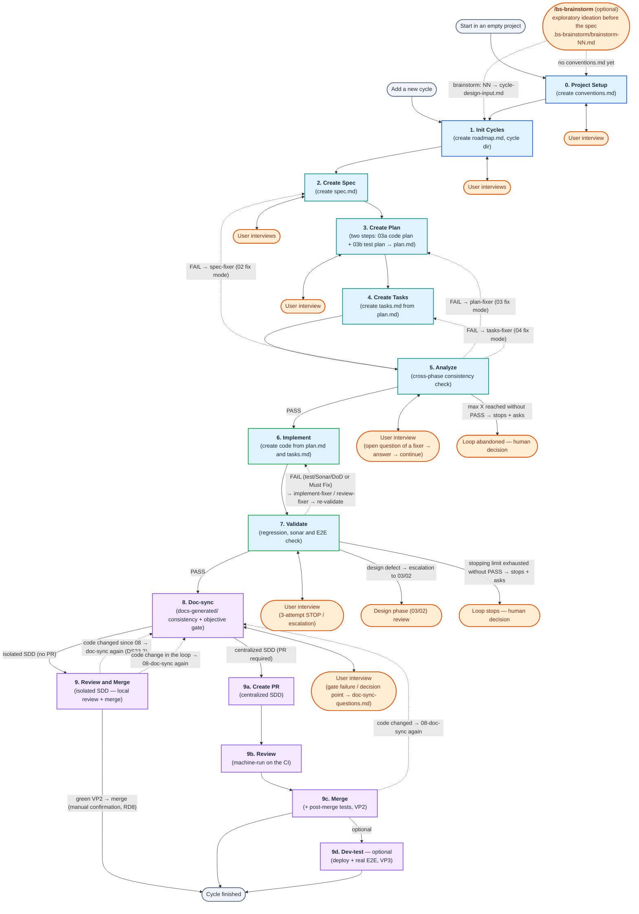
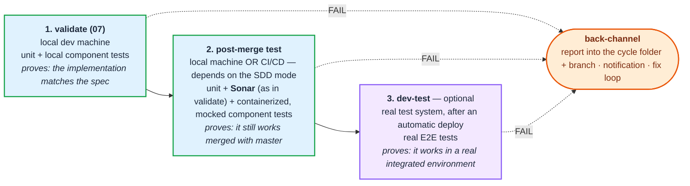

# The full berki spec flow (00–09)

← [Back to the main page](../../README.md) · [Page index](README.md)

This chapter describes the **full, many-phase** development route with its flowcharts — from the project setup (00–01) through the per-cycle loop (02–09) to the merge, including the self-healing loops. The **other route**, the simplified three-phase flow, is detailed further down, in the "Simplified (lightweight) flow" chapter.
> **Code markers:** in the text, codes of the form `DS`/`VD`/`RD`/`LC`/`SK` + a number (e.g. `DS22`, `RD6`, `LC1`) are the internal rule identifiers of the skill files. Their detailed definition lives in the given skill; here they only serve as searchable anchors, you do not need to resolve them to understand the README.

## 4.1 High-level summary

This diagram summarises the sequential process of phases 00–09, the entry points, the interview loops and the defect-fixing feedback paths.



## 4.2 Test points — where we test, and what it proves

In the `bs` SDD we **test in three places, for three different reasons**. The three points are not redundancy: each one proves something **different**, and the other two cannot replace the third.

1. **`validate` (07)** — we validate the implementation produced by the agent **against the spec**, on the developer's **local machine**. Typically unit and locally running component tests.
2. **post-merge test (`VP2`)** — **after merging with the main branch**. Where it runs depends on which SDD we use: it can be **part of the CI/CD process** and it can run on the **local machine**. With CI/CD: unit tests, **Sonar**, and **containerized, mocked** component tests. **Sonar is needed here too — exactly as it is in `validate`:** the merge brings in code that the Sonar round of `07` never saw, and static defects can arise from it just as runtime ones can. This is zero new machinery: the same `sonar-gate.py`, with the same `conventions.md` thresholds.
3. **dev test (`VP3`)** — after an **automatic deploy**, in a **real test system**, with e2e tests. It only makes sense on the centralized path (`/bs-dev-test`).

**And all three have to be channeled back** — this is the fourth element of the diagram, not a footnote: the report goes onto the **path of the cycle** (`test-report/<phase>/`, committed), the **notification** goes out, and the failure either goes back to the developer or — if it is switched on — into the **fix loop** of the CI.



> **The cycle is done when the LAST enabled verification is green.** Which one is the last is stated by the `## Review and merge` section of `conventions.md` (`Post-merge tests`, `Dev deployment test`). Until then the cycle row of the roadmap carries the `⏳ waiting for verification` mark, and the generated `cycle-status.md` shows the same.

> *The earlier, full detailed process diagram lives on on its own page: [The detailed process diagram](process-diagram.md).*

## 4.7 Example prompt flow (walking through one cycle)

Walking through a concrete cycle, `cycle-02-oidc-login`, in the order of the prompts. `00`/`01` are a **one-off** setup, `02`–`09` repeat **per cycle**. Start every phase with its own starting prompt, in a **new chat session**; replace `<cycle-name>` and the other placeholders. In the block below, the `→` lines mark the interaction taking place in the phase (interview, approval, loop).

```
# ①  00 — Project initialisation  (only for an empty project, once)
Run the command: `/bs-init-project input: OIDC-based login for the mobile bank frontend`
   → the agent asks through the conventions (tech stack, tests, merge strategy) → conventions.md

# ②  01 — Managing cycles
Run the command: `/bs-add-cycles input: New cycle — OIDC login for the mobile bank frontend`
   → name proposal: cycle-02-oidc-login → "ok" → specs/roadmap.md (Done) + the cycle folder

# ③  02 — Writing the spec
Run the command: `/bs-write-spec input: @specs/roadmap.md`
   → spec-questions.md questions one by one → answers → "the spec is ready, go" → spec.md (Ready for planning)

# ④  03a — Writing the code plan
Run the command: `/bs-write-code-plan input: @specs/cycle-02-oidc-login/spec.md`
   → mandatory first question: E2E test strategy → answers → "approved" → plan.md (Ready for test planning)

# ⑤  /clear, then 03b — Writing the test plan (into the same plan.md)
Run the command: `/bs-write-test-plan input: @specs/cycle-02-oidc-login/plan.md`
   → the phase ITSELF runs the gate of the code plan (D5) → TS-NN scenarios → "approved" → plan.md (Ready for tasks)

# ⑥  04 — Writing the tasks
Run the command: `/bs-write-tasks input: @specs/cycle-02-oidc-login/plan.md`
   → "go" → tasks.md (Ready for implementation)

# ⑦  05 — Analyze
Run the command: `/bs-analyze input: @specs/cycle-02-oidc-login`
   → cross-phase check; from the items found, YOU choose (triage) what it should fix → self-healing loop on analyze-task.md → analyze-report.md (PASS)

# ⑧  06 — Implementation
Run the command: `/bs-implement input: @specs/cycle-02-oidc-login/tasks.md`
   → code + progress in tasks.md → tasks.md (Ready for validation)

# (at any time after 05, an unnumbered step) — the manual test plan
# Run the command: `/bs-manual-test-plan input: @specs/cycle-02-oidc-login`
#    → manual-test-plan.md (in Planned or As-built mode) — not a phase, it changes no status

# ⑨  07 — Validation
Run the command: `/bs-validate input: @specs/cycle-02-oidc-login`
   → fast tests → Sonar + code review (reviewer subagent) → heavy tests + DoD;
     on FAIL a self-healing loop → PASS → status of spec/plan/tasks: Done

# ⑩  08 — Doc-sync
Run the command: `/bs-doc-sync input: @specs/cycle-02-oidc-login`
   → updating docs-generated/ + the objective gate → consistent documentation

# ⑪  09 — Review and merge  (the PR-less path; with a PR: /bs-create-pr → /bs-review → /bs-merge)
Run the command: `/bs-review-and-merge input: @specs/cycle-02-oidc-login`
   → gates (status + clean review + doc-sync) → bring in main → VP2 round (tests + Sonar)
   → merge (with manual confirmation) → closing the roadmap + cycle-status.md
```

The next cycle (`cycle-03-...`) starts with `02` again — `00`/`01` do not repeat.
