# Simplified (lightweight) flow

← [Back to the main page](../../README.md) · [Page index](README.md)

The 00–09 diagrams above describe the **full berki spec flow**. This section details the **other route**, the simplified, three-phase flow — for small, well-bounded tasks (configuration, a simpler script, a minor fix) that can be solved in 3-4 steps. Its canonical invoking command is `/bs-quick-flow`; for choosing between the flows see the "Two development routes" section above.

Compared with the full flow, here there is **no** separate `plan.md` (the technical outline goes into `spec-plan.md`), **no** `analyze`/`validate`/`doc-sync`/`review` phase and **no** automated self-healing loop — the quality gates run inline, and updating the documentation is part of phase 3. The cycle folder of this route carries the marker in its name — `specs/cycle-NN_quick-flow_<cycle-name>/` (QF22) — so it is visible at a glance which cycles were made on the simplified route. The three-phase route: `spec-plan.md` → `tasks.md` → implementation, with a **mandatory consistency check** and the **deterministic RP1 path gate** (`analyze-gate-check.py --paths-only` — the only mandatory gate script of this flow) at the end of every phase, and **⛔ explicit user approval** before every phase transition. The approval does not stay in the conversation: both artifacts get a **`Status` field** (`Draft` → `Ready for tasks`, and `Draft` → `Ready for implementation` → `Done`), and writing the status + the commit is a single, uninterruptible step pair — this is what lets the cycle survive a `/clear` or an interruption. The git convention (main branch, branch naming, No-VCS, commit format) comes from the `Git and branching conventions` section of `conventions.md`, it is not hardwired in the skill.

**How does a cycle start?** The user hands over a task, the agent prepares the git branch, and then clarifies the goal with a short **interview (grill)** — it keeps asking until it has all the information for `spec-plan.md`. The **flow-size decision is made on the basis of this interview**: the agent continuously weighs whether the task really fits into the simplified flow (3-4 steps, a single component, no complex up-front design). If the task outgrows this (more code to write, several components, integration, complex design), the agent **stops even before `spec-plan.md`** and proposes the full berki spec process (`01-add-cycles`). Only if the task really is small does it propose a cycle number and a name, ask for approval, and create the cycle folder.

## 5.1 Flowchart

```mermaid
flowchart TD
    classDef start fill:#f1f5f9,stroke:#64748b,stroke-width:2px,color:#1e293b;
    classDef design fill:#e0f2fe,stroke:#0d9488,stroke-width:2px,color:#1e293b;
    classDef dev fill:#e0f2fe,stroke:#16a34a,stroke-width:2px,color:#1e293b;
    classDef decision fill:#fef3c7,stroke:#d97706,stroke-width:2px,color:#1e293b;
    classDef doc fill:#f3e8ff,stroke:#8b5cf6,stroke-width:2px,color:#1e293b;
    classDef userInput fill:#ffedd5,stroke:#ea580c,stroke-width:2px,color:#7c2d12;

    Start(["The user hands over a task"]):::userInput
    Git["① Preparing the git branch<br/>(feature branch, clean working tree)"]:::design
    Interview["② Giving the goal + interview (grill)<br/>it asks until everything is clear for spec-plan.md"]:::design
    SizeCheck{"Is the task really small?<br/>(3-4 steps · one component ·<br/>no complex design)"}:::decision
    Redirect(["It outgrows this → redirect<br/>to the full flow (01-add-cycles)"]):::userInput
    NameApprove["③ Cycle number + name proposal<br/>→ ⛔ user approval"]:::design
    Dir["④ Creating the cycle folder<br/>(specs/cycle-NN_quick-flow_...)"]:::design

    P1["<b>Phase 1 — Specification (spec-plan.md)</b><br/>goal, parameters, technical outline (plan substitute),<br/>test strategy WITH A TARGET ENVIRONMENT, README plan"]:::design
    C1["Consistency check + RP1 path gate<br/>(paths, names, ports match)"]:::doc
    Stop1{"⛔ User<br/>approval?"}:::userInput

    P2["<b>Phase 2 — Task list (tasks.md)</b><br/>tickable steps with a [local]/[remote] label,<br/>the test before the documentation, a logical test order"]:::design
    C2["Consistency check + RP1 path gate<br/>(tasks.md ↔ spec-plan.md)"]:::doc
    Stop2{"⛔ User<br/>approval?"}:::userInput

    P3["<b>Phase 3 — Implementation</b><br/>code per tasks.md in ONE pass,<br/>real-time ticking, leftover sweep"]:::dev
    Test{"Are the tests green?"}:::decision
    Stuck{"Stuck?<br/>(2-3 rounds, same defect)"}:::decision
    Ask(["Stop → a targeted,<br/>forward-moving question to the user"]):::userInput
    Close(["Closing: tasks.md → Done, documentation updated,<br/>closing commit + roadmap/drift note"]):::start

    Start --> Git --> Interview --> SizeCheck
    SizeCheck -- "No (it outgrows this)" --> Redirect
    SizeCheck -- "Yes" --> NameApprove --> Dir --> P1
    P1 --> C1 --> Stop1
    Stop1 -- "No → waiting" --> Stop1
    Stop1 -- "Yes → status: Ready for tasks + commit" --> P2
    P2 --> C2 --> Stop2
    Stop2 -- "No → waiting" --> Stop2
    Stop2 -- "Yes → status: Ready for implementation + commit" --> P3
    P3 --> Test
    Test -- "No (it fails) → fix, then THE SAME<br/>step again, with its selector" --> Stuck
    Stuck -- "No" --> P3
    Stuck -- "Yes" --> Ask
    Ask --> P3
    Test -- "Yes" --> Close
    P3 -. "spec defect → back to phase 1<br/>+ re-approval" .-> P1
```



## 5.2 The three phases in brief

| Phase | Output | Main rule | Gate at the end of the phase |
|---|---|---|---|
| **1. Specification** | `spec-plan.md` (`Draft`) | Goal + parameters + a **technical outline** (the scaffolding that substitutes for `plan.md`: affected files, key elements, execution order, main error branch) + test strategy + README plan. The six mandatory elements of the test strategy: a **`Target environment` field**, for a non-local target a **literal target host + a reachability probe + a `localhost` ban**, a **`[local]`/`[remote]` label**, a **"what it verifies and why" assertion** (with a calibration sample), a **vacuous-test ban**, and **`skipped` is not evidence**. It modifies **no** project file here. | Consistency check + the **RP1 path gate** → **⛔ explicit approval** → status `Ready for tasks` + commit |
| **2. Task list** | `tasks.md` (`Draft`) | Tickable steps built on the technical outline; on entry, a **status gate** on `spec-plan.md`. Testing comes **before** the documentation update, in a logical **test order** (create the resource first, only then check it); every test step carries the `[local]`/`[remote]` label, the assertion, the probe and the **selector-scoped** command. The regression run is a separate, **last** step. | Consistency check (against `spec-plan.md` too) + the **RP1 path gate** → **⛔ explicit approval** → status `Ready for implementation` + commit |
| **3. Implementation** | code + updated documentation | Exclusively per `tasks.md`, **in a single pass** (IM1: ticking off a task is not the end of a phase), with real-time ticking. After a replacement/rename, a **leftover sweep** (`grep` for the old form). **One run = one identifiable test:** a failing test → fix + **the same step** again with its selector; a collective run does not replace the per-step ones. | Tests green (the skipped ones stated) + documentation done + `docs-generated/` drift note + agreed → `tasks.md` = `Done` + **closing commit per `conventions.md`** |

## 5.3 Two built-in loop breakers
- **Stuck detection (phase 3):** if the same defect still fails after 2-3 fixing rounds, or the solution goes round in circles, the agent **stops**, summarises what it tried + the exact error message + its hypotheses, and asks a **targeted question broken down to a decision or a piece of data** — it does not keep trying blindly.
- **Phase rollback on a spec defect:** if it turns out during the implementation that `spec-plan.md` is incomplete or wrong, **deviating from it silently is forbidden** — back to phase 1, update `spec-plan.md` (and `tasks.md` if needed), then **re-approval**, and only then onwards.

## 5.4 Optional agents (all read-only, none of them mandatory)

The simplified flow deliberately uses **few** specialists, and all of them **optionally** — for a small task the main agent does the work without a subagent too. With a weaker/cheaper model all three can be safely skipped.

| Agent | Phase | What it gives | When it is worth it |
|---|---|---|---|
| [`researcher`](../../prompts/agents-hu/researcher.md) | 1 (spec-plan.md) | Affected source files (`path:line–line`) + a list of documents to update | When modifying an existing codebase, if the set of affected files is not obvious |
| [`analyzer`](../../prompts/agents-hu/analyzer.md) | 2 (tasks.md) | `spec-plan.md` ↔ `tasks.md` consistency diagnosis (coverage gap, under-specification) | For a task list with several requirements that easily slips |
| [`reviewer`](../../prompts/agents-hu/reviewer.md) | 3 (before the commit) | Diff code review → `Must Fix` / `Suggestion` | For a non-trivial code change, as a gate before the commit |

> **Contract substitutions (given by the skill; the body of the agent prompts is unchanged):** the `analyzer` gets **no scope parameter** (it carries all five categories) and runs without a slice file, and its input is the `spec-plan.md` + `tasks.md` **pair** — its input point referencing `plan.md` is empty. The `reviewer` gets the **technical outline** of `spec-plan.md` instead of the mandatory `plan.md`, and writes into `specs/cycle-NN_quick-flow_<cycle-name>/code-review.md` (in the cycle root, without a `test-report/` subfolder); the `Must Fix` identifiers and the incremental writing are kept, there is no self-healing loop.

> **What this flow does NOT use:** the fixer wrappers (`spec/plan/tasks/bs-implement/review-fixer`) and the `doc-sync-planner` — these are the entry points of the full flow's self-healing loops and of the `docs-generated/` sync. There is no automated loop here (defects are fixed inline by the main agent), and there is no separate generated doc layer (the documentation is part of phase 3). If these genuinely became warranted, that is the sign that **you have to switch to the full berki spec flow**.

## 5.5 Starter prompt (copy-paste)

```
/bs-quick-flow input: <a short description of the task>
```

Taken over from a brainstorm (`NN` is the number of the `.bs-brainstorm/` working file):

```
/bs-quick-flow brainstorm: NN
```

## 5.6 Example prompt

Walking through a small task. There is **a single starting prompt** here; after that the flow is **conversational** — the phase transitions are driven by your short, natural-language approvals at the ⛔ gates (there are no separate phase prompts as in the full flow). In the block below, the quoted lines are your answers:

```
# ①  Start — handing over the task
/bs-quick-flow input: Add a `/health` endpoint to the legacy-login app that returns 200 OK with a "status: ok" JSON.

# ②  Interview + size + name  (the agent leads; you answer)
   → preparing the git branch + the grill interview → since the task is small, it proposes: cycle-03_quick-flow_add-health-check
   you: "ok, go with that name"

# ③  ⛔ Phase 1 — approving spec-plan.md
   → it stops after spec-plan.md + the consistency check + the RP1 path gate
   you: "I approve the spec, tasks.md can come"

# ④  ⛔ Phase 2 — approving tasks.md
   → it stops after tasks.md (status: Ready for implementation + commit)
   you: "fine, you can start the implementation"

# ⑤  Phase 3 — implementation
   → it implements per tasks.md in ONE pass, selector-scoped tests, documentation → tasks.md = Done + closing commit
```

> If it turns out during the interview (②) that the task is bigger after all, the agent stops here and proposes the full flow (`01-add-cycles`) — see the "it outgrows this" branch of diagram 5.1. The decision to switch flows is yours.

---
