# The detailed process diagram

← [Back to the main page](../../README.md) · [Page index](README.md)

The detailed diagram below shows the exact transitions between the individual phases, the input/output files, the points of user interaction (User Input), and the feedback loops that kick in when something fails.

```mermaid
flowchart TD
    %% Styling definitions
    classDef setup fill:#e0f2fe,stroke:#2563eb,stroke-width:2px,color:#1e293b;
    classDef design fill:#e0f2fe,stroke:#0d9488,stroke-width:2px,color:#1e293b;
    classDef dev fill:#e0f2fe,stroke:#16a34a,stroke-width:2px,color:#1e293b;
    classDef decision fill:#fef3c7,stroke:#d97706,stroke-width:2px,color:#1e293b;
    classDef doc fill:#f3e8ff,stroke:#8b5cf6,stroke-width:2px,color:#1e293b;
    classDef userInput fill:#ffedd5,stroke:#ea580c,stroke-width:2px,color:#7c2d12;

    subgraph Setup ["<b>⚙️ PROJECT SETUP (ONCE)</b>"]
        P00["00 — Project initialisation"]:::setup
        P00_Loop{"Any questions left?"}:::decision
        DocConv["conventions.md"]:::doc
        In00(["User Input: project goals & answers"]):::userInput

        P01["01 — Managing cycles"]:::setup
        P01_Loop{"Any open questions left?"}:::decision
        DocRoadmap["specs/roadmap.md (Status: Done)"]:::doc
        In01(["User Input: HLD/LLD or description"]):::userInput
    end

    subgraph Design ["<b>📐 DESIGN PHASE (PER CYCLE)</b>"]
        P02["02 — Writing the spec"]:::design
        P02_Loop{"Any questions left? (spec-questions.md)"}:::decision
        DocSpec["specs/cycle-NN-*/spec.md (Status: Ready for planning)"]:::doc
        In02(["User Input: cycle selection & spec answers"]):::userInput

        P03a["03a — Writing the code plan"]:::design
        P03b["03b — Writing the test plan"]:::design
        P03_Loop{"Any questions left? (plan-questions.md)"}:::decision
        DocPlan["specs/cycle-NN-*/plan.md (Status: Ready for tasks)"]:::doc
        In03(["User Input: design answers"]):::userInput

        P04["04 — Writing the tasks"]:::design
        DocTasks["specs/cycle-NN-*/tasks.md (Status: Ready for implementation)"]:::doc

        P05["05 — Analyze"]:::design
        P05_Check{"Consistent? (analyze-report.md)"}:::decision
        DocAnalyze["specs/cycle-NN-*/analyze/analyze-report.md (PASS/FAIL)"]:::doc
    end

    subgraph Development ["<b>💻 IMPLEMENTATION & VERIFICATION (ITERATIVE)</b>"]
        P06["06 — Implementation"]:::dev
        P06_Loop["Developing the code + recording progress in tasks.md"]:::dev
        DocTasksReady["specs/cycle-NN-*/tasks.md (Status: Ready for validation)"]:::doc
        In06(["User Input: starting the implementation of the cycle"]):::userInput

        P07["07 — Validation and code review"]:::dev
        P07_Run{"Running the tests & SonarQube<br/>(test-runner subagent)"}:::decision
        P07_Review{"Green tests → code review<br/>(reviewer subagent, RV1)"}:::decision
        DocReport["specs/cycle-NN-*/test-report/<br/>validation-report.md + code-review.md<br/>+ validate/round-NN/ (reports, sonar)"]:::doc
        P07_Check{"Successful? (PASS)<br/>green tests + clean review"}:::decision

        P08["08 — Doc-sync"]:::dev
        P08_Plan["doc-sync-planner subagent<br/>→ doc-sync-plan.md (per-file plan<br/>+ finished replacement-text patch)"]:::doc
        DocGen["docs-generated/ (system-overview, architecture, CHANGELOG, design-drift, README)"]:::doc
        P08_Gate{"Objective consistency gate green?<br/>(DS22 — ds22-gate-check.py<br/>+ TC8 — tc8-gate-check.py)"}:::decision

        P09["09 — Merge"]:::dev
        P09_DocCheck{"Code changed since 08?"}:::decision

        Merge["Merge (local squash or PR, per the Merge strategy of conventions.md)"]:::setup
        In08(["User Input: merge confirmation"]):::userInput
    end

    %% Connections
    Start([Start]) --> P00

    %% User Inputs
    In00 --> P00
    In01 --> P01
    In02 --> P02
    In03 --> P03a
    In03 --> P03b
    In06 --> P06
    In08 --> Merge

    P00 --> P00_Loop
    P00_Loop -- "Yes" --> P00
    P00_Loop -- "No (Closed)" --> DocConv
    DocConv --> P01

    P01 --> P01_Loop
    P01_Loop -- "Yes" --> P01
    P01_Loop -- "No (Done)" --> DocRoadmap

    DocRoadmap --> P02
    P02 --> P02_Loop
    P02_Loop -- "Yes" --> P02
    P02_Loop -- "No" --> DocSpec

    DocSpec --> P03a
    P03a -- "code half done (Ready for test planning)" --> P03b
    P03b --> P03_Loop
    P03_Loop -- "Yes" --> P03b
    P03_Loop -- "No" --> DocPlan

    DocPlan --> P04
    P04 --> DocTasks

    DocTasks --> P05
    P05 --> DocAnalyze
    DocAnalyze --> P05_Check

    %% The analyze self-healing loop (05)
    P05_Check -- "FAIL" --> P05_Fixer["fixer subagent<br/>(02/03/04 fix mode, [analyze-loop])"]:::design
    P05_Fixer -- "the fixer collects open questions<br/>(*-questions.md)" --> P05_Q(["User Input: PHASE/Knn answer<br/>(asked by the orchestrator)"]):::userInput
    P05_Q --> P05_Fixer
    P05_Fixer -- "downstream re-derivation<br/>02→03→04 (reconciliation)" --> P05
    P05_Check -- "max X=3 reached without PASS" --> P05_Stop["Loop abandoned → analyze-report FAIL<br/>(the marker stays) + human decision"]:::doc
    P05_Check -- "PASS (marker removed, 1 commit)" --> P06

    P06 --> P06_Loop
    P06_Loop --> DocTasksReady

    DocTasksReady --> P07
    P07 --> P07_Run
    P07_Run -- "green (steps 1-3 of the full round)" --> P07_Review
    P07_Run -. "failed test / Sonar / DoD<br/>(the review does not even run)" .-> DocReport
    P07_Review --> DocReport
    DocReport --> P07_Check

    %% The validate self-healing loop (07) — tests AND review in one loop
    P07_Check -- "FAIL: test / Sonar / DoD" --> P07_Fixer["implement-fixer subagent<br/>(06 fix mode, [validate-loop])<br/>## Validation fixes"]:::dev
    P07_Check -- "FAIL: Must Fix finding (MF-NN)" --> P07_RFixer["review-fixer subagent<br/>(06 fix mode, [validate-loop])<br/>## Review fixes"]:::dev
    P07_Fixer -- "fix done → light round,<br/>then a full confirming round" --> P07
    P07_RFixer -- "fix done → light round,<br/>then a full confirming round + re-review" --> P07
    P07_Fixer -. "escalation signal (VD5)" .-> P07_Esc
    P07_RFixer -. "escalation signal (VD5)" .-> P07_Esc
    P07_Check -- "3 attempts / 5 total / 5 FAIL runs<br/>stuck code bug" --> P07_Stop["Loop stops → STOP + human<br/>(the [validate-loop] marker + fix sections stay)"]:::doc
    P07_Check -- "design defect (VD5):<br/>it would only be green by changing a test/DoD/finding" --> P07_Esc["Escalation: status rollback<br/>to 03/02 → design phase"]:::doc
    P07_Esc --> P03a

    %% Validation Pass
    P07_Check -- "PASS (Yes)" --> DocStatusKesz["status of spec.md, plan.md, tasks.md: Done"]:::doc
    DocStatusKesz --> P08

    %% Doc-sync (08): plan → mechanical execution → objective gate (NOT a self-healing subagent loop)
    P08 --> P08_Plan
    P08_Plan --> DocGen
    DocGen --> P08_Gate
    P08_Gate -. "gate failure / decision point → doc-sync-questions.md<br/>(human-driven correction, DS10)" .-> P08DS_Q(["User Input: doc-sync question / correction"]):::userInput
    P08DS_Q --> P08_Plan
    P08_Gate -- "gate green → docs-generated/ consistent" --> P09

    %% Merge (09) — no loop, no subagent; the review has already run in 07
    P09 --> P09_DocCheck
    P09_DocCheck -. "Yes → doc-sync again before the merge (DS23.2)" .-> P08
    P09_DocCheck -- "No → according to `## Review and merge` in conventions.md" --> Merge["09 — Review and merge (no PR)<br/>bring in main → VP2 (tests + Sonar) → merge (RD8)"]
    P09_DocCheck -- "PR submission: yes" --> MergePR["09a create-pr → 09b review → 09c merge<br/>VP2 is the gate BEFORE the push"]
    MergePR -. "Dev deployment test: yes" .-> DevTest["09d — dev-test (VP3)<br/>deploy + real e2e in the integrated environment"]
    Merge --> End([Cycle finished])
    MergePR --> End
    DevTest --> End
```

