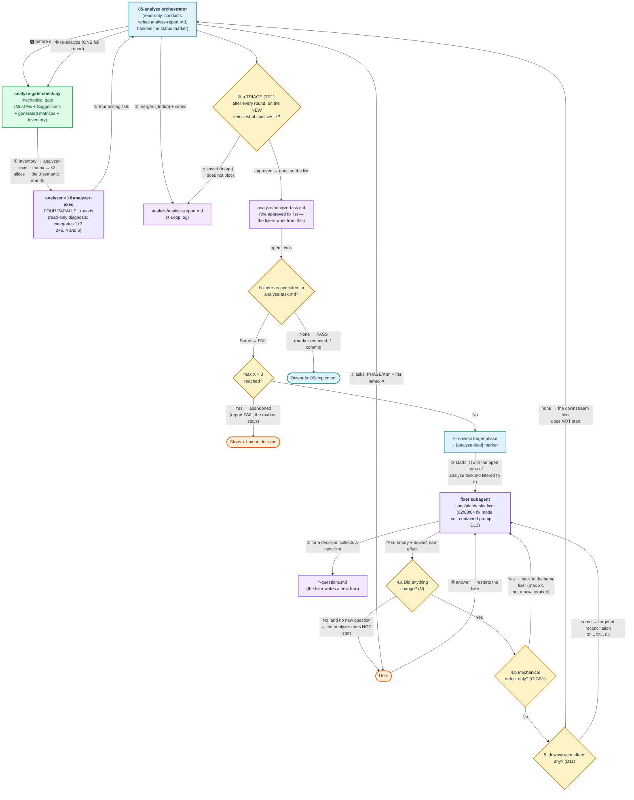
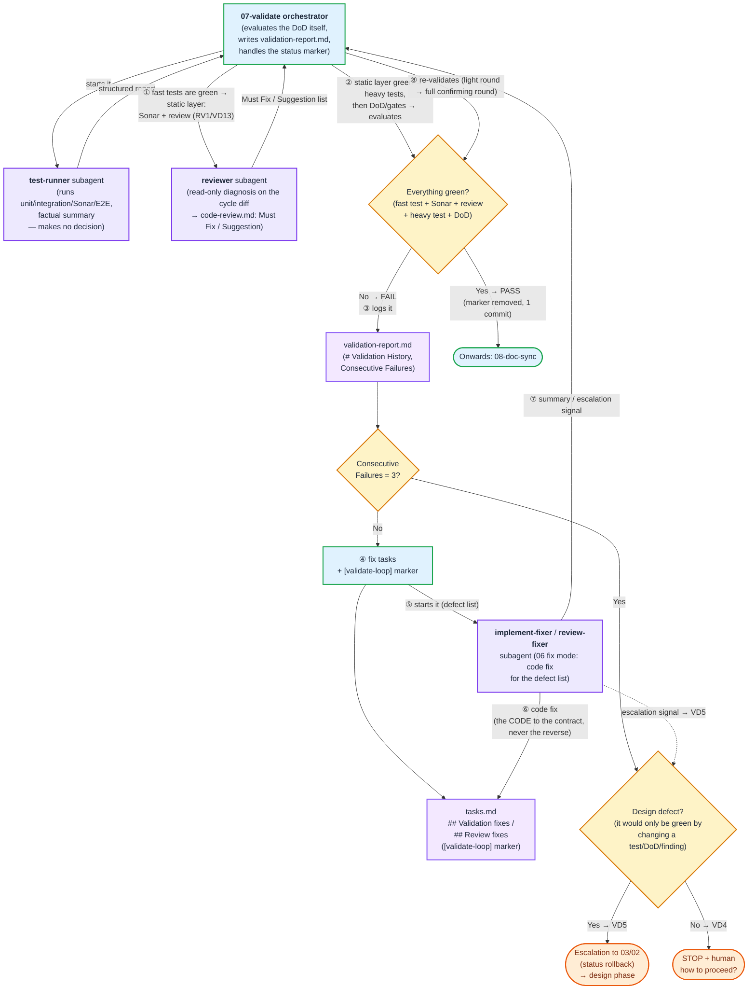

# The self-healing loops (05-analyze, 07-validate)

← [Back to the main page](../../README.md) · [Page index](README.md)

## 4.4 The 05-analyze self-healing loop (in detail)

This diagram shows **only the 05-analyze step**, with the subagents and the question flow indicated. The orchestrator (05-analyze) is read-only: the **mechanical layer** is done by the `analyze-gate-check.py` gate, the **semantic diagnosis** by the **three parallel rounds** of the `analyzer` (this is the only point in the whole system that runs on the most expensive, `deep_reasoning_agent` tier — see 4.3), the **executability diagnosis** by `analyzer-exec` (`default` tier, **in parallel** with them), and the **correction** by the fixer subagents (02/03/04 fix mode, `default` tier); the user is always asked by the **orchestrator** (also `default` tier), with a phase indicator.

There are four shortcut branches in it, because these deliver the bulk of the phase's savings: the fixer **runs the gate itself before returning** (GS1), so the gate round after the fixer (G) has softened into a safety net — if it did find a merely mechanical defect after all, that goes back to the same fixer, without an analyzer round and without consuming an iteration; if the fixer **changed nothing** (N), the loop does not start an analyzer, but stops and asks; and if every `Must Fix` is **local**, the fixers start **in a single message, in parallel**, without downstream re-derivation (LF1).

The fifth — and biggest-saving — branch is the **triage stop (TR1)**: **after every diagnostician round** the loop stops, and in a single question the user decides which **new** `Must Fix` items to fix at all. The approved items go onto the **`analyze-task.md`** fix list — the fixers work exclusively from that — while the rejected ones stay in the report with the state `rejected (triage)` (an audit trail), and do not block the `PASS`. Within a round the loop does not ask: it works through the list, and whatever it finds as new in the meantime is asked about in the **next** triage. It never asks again about an item already decided; and purely mechanical (gate) items go onto the list without a question.

**The folder of the analysis (AD1).** Every file of the analysis lives in the cycle's `analyze/` subfolder: `analyze-report.md`, `analyze-task.md`, the `slices/` cut out by the gate (gitignored) and every helper file. The root of the cycle thus stays that of the design documents.


**How it works, step by step:**

1. **The subagent collects the question, it does not ask it.** The fixer subagent (02/03/04 fix mode) **does not put** the points requiring a decision **to the user directly** — it has no interactive channel. Instead it adds them as a new `Knn` entry to the appropriate `*-questions.md` (`spec-questions.md` / `plan-questions.md` / `tasks-questions.md`).
2. **And it returns them to the orchestrator.** At the end of its run the fixer gives a concise summary: what it fixed, and which new `Knn` question identifiers it added. (In the diagram: ⑥ collects, ⑦ returns.)
3. **The orchestrator puts the question to the user**, always indicating which phase it belongs to: **phase header + `PHASE/Knn` prefix** (e.g. `[PLAN · iter 2/3 · PLAN/K05]`). One question at a time, with a clickable link to the affected `*-questions.md` at the end of the answer.
4. **Once the answer has been carried through, the loop continues:** the orchestrator writes the decision into `*-questions.md` (`[x]` + summary), restarts the fixer, and then the downstream re-derivation (`02→03→04`) and the re-analyze follow. A question stop does **not** count as a new iteration and does not consume from `max X`.

The loop stops in two mutually independent ways: **PASS** (no more `Must Fix` → marker removed, a single commit, onwards to 06), or **`max X = 3` reached without a PASS** (the report is `FAIL`, the `[analyze-loop]` marker stays on the affected documents, the orchestrator summarises and asks for a human decision).

## 4.5 The 07-validate self-healing loop (in detail) — tests + code review

This diagram shows **only the 07-validate step**, with the subagents indicated (the counterpart of the analyze diagram above). Up to PASS the orchestrator (07) is a **deterministic checker** — the actual execution of the tests/Sonar/E2E is done by the **`test-runner` subagent** (`default` tier — mechanical execution, it makes no decisions, but it deliberately does not run on the cheapest tier because of the reliable interpretation of logs/reports), and the DoD and the PASS/FAIL decision are made by the orchestrator — and on FAIL it becomes an **orchestrator**: the **correction** is done by the `implement-fixer` subagent (= the fix mode of 06), and the re-validation and the decisions by the orchestrator.

**The deterministic layer of the phase — "if there is a script for it, do not read a file" (VD11/b).** 07 is the most script-driven phase of the framework, because most of its questions are machine-decidable:

| Question | Who answers it | What it saves |
|---|---|---|
| Did the tests run, how many green/red? | `run-tests.py`, from the **machine-readable run table** of `plan.md` | the `test-runner` subagent **and** the raw test log (the biggest token item of the phase) — the subagent remains as a fallback if there is no table |
| Did the Quality Gate pass, is there a blocking finding? | `sonar-gate.py` (Sonar Web API) | reading `sonar-report.md` and filtering by severity; QG1 (threshold vs. finding) is a separate exit code |
| Are the DoD points satisfied? | `dod-check.py` — a join between the spec's `· _evidence:_` fields and the JUnit results of the round | the ✓ given from memory; only a point without evidence remains a judgement call |
| Did the fixer touch the contract? | `contract-guard.py` (protected paths + cheating patterns) | reading the full `git diff` after **every** fixer return |
| Is every task/DoD/IP1 item/finding closed, does the round block match? | `validate-gate-check.py` | reading five files, in a single call |
| Did EVERY `validate`-phase category of the plan actually run? | `validate-gate-check.py` — the `RUN1` join between the machine table of the plan and the `results.json` of the round | the "a green round means everything ran" mistake: a missing `results.json` means the round was **not** driven from the machine table |
| Is a skipped test evidence? | `dod-check.py` (a `skipped` case yields `?`, not ✓) + `validate-gate-check.py` (`SK1`) | the "evidence" value of a single `pytest.skip` — a silently skipped test verifies nothing |
| **WHERE did this CONCRETE test run?** | `validate-gate-check.py` — `RL1` (does the `rest-logs/remote/<test>/` log really contain a non-local address) + `RL2` (is there a log for every `[remote]` scenario) | the gap of category-grained evidence: a test marked `remote` that ran locally, and a remote scenario that produced **no** log at all |
| Is the test body an empty skeleton, does the `[CHECK]` selector exist? | `test-substance-check.py` (`TB1`/`TB2`) | letting through a test that is green but proves nothing — `TB2` catches an orphaned selector **without running** the test file |
| Is there failure evidence for a `[RED]`, did the `[CHECK]`s run one by one? | `validate-gate-check.py` — the `RED1` + `CK1` join on `check-log.md` | reading the log by hand; `CK1` catches the unfiltered, merged run and the missing log line |
| Did the non-local category really address the target host? | `run-tests.py` — `EV6`, from the TR3 table of `conventions.md` | the "the audit log is there, so it is fine" mistake: an inherited `127.0.0.1` file is not evidence |
| Was the artifact of the round folder produced IN this round? | `report-gate-check.py` — `TR7` (an mtime floor at the round's `started_at`) | the "full folder" effect of files inherited from earlier rounds |
| Has the round log been produced? | `round-log.py open/step/close` | ~1–1.5k output tokens per round, and the "no report was produced" defect class |

What **deliberately stays an LLM:** the `reviewer` (semantic diff judgement), the fixers (writing code), the diagnosis of a missing plan, the VD5 escalation decision, the QG1 "can it be fixed within the scope of the cycle" question, and judging the DoD points without evidence — where a script would give a false green or a false alarm.

**The loop is incremental (VD10).** A full round — fast tests → Sonar + code review → heavy tests/regression → DoD/gates — runs only **twice**: the **first** one and the **closing confirming** one. In the intermediate fixing rounds the **complete fast test set** runs (plus exclusively the one item, if the failure was a heavy test, Sonar or a review finding — in the latter case the `reviewer` runs incrementally, only on the open `MF-NN`s), because re-running Sonar and the containerised E2E per round accounts for most of the phase's cost, while the fix targeted a single item. **PASS can only be given from a full round** — after a green light round, the confirming full round is mandatory. A light round is a round too: the logging of `failure-counter.py` and the 3/5/5 stopping limit keep counting unchanged.

**What the 07 orchestrator deliberately does NOT do (VD11/VD12).** It does not read the whole `plan.md` into the main context (that is read by the `test-runner`; the main agent is left with a targeted `grep` to check for a missing plan), it **does not read the modified files through** (the diff is reviewed by the `reviewer` subagent — the up-to-dateness of code comments/docstrings is with it too), and it does not check **component READMEs** (that is the exclusive output of `08-doc-sync`). The orchestrator evaluates the *evidence* and the *acceptance criteria*; detailed reading belongs to the subagents.

**The evidence of 06: the failure of a `[RED]` and the verbatim `[CHECK]` (RED1 · CK1).** A `[RED]` task is not finished when the test file comes into existence but when the targeted run of the test is **red** — that is the only evidence that the test checks anything at all — and the failure goes into `check-log.md` too, with a `✗` result (the exception is `RED-EXEMPT`: a task updating an existing test, with a justification). And the command of a `[CHECK]` must be issued **verbatim, on its own**, together with the test filter: one `[CHECK]` = one run = **one** log line with **one** task identifier — merging several `[CHECK]`s into one run, or carrying the result of a broader run over to several tasks, is forbidden. The filter is the only thing that binds the task to the test case of the plan (`TX1`), and if the name of the test has changed in the meantime, the filtered command **fails immediately**, while the merged run passes green. The gate of `07` measures both back from the log (`RED1`, `CK1`).

**06-implement processes the task list in a single run (IM1).** Closing a task — the tick in `tasks.md`, the `check-log` entry, the task commit — is **not** the end of the phase: right after the commit the agent takes the next unfinished task, in the same round. The phase stops for five reasons only: a *Stopping rule* was met, the `Machine prerequisite:` block of a chapter is not satisfied, the task explicitly requires running infrastructure and that cannot be verified, the `[CHECK]` failed three times, or every task is done. This rule has to be stated because in the rest of the framework's phases the sentence "**At the end of the answer, place the clickable link to …**" is a **stop signal** (a question or the end of a phase) — which is why in 06 that sentence does **not** appear per task, only in the closing message of the phase. Without this, the agent handed control back after every task, and the phase only progressed on manual "continue" messages.



**How it works, step by step:**

1. **The orchestrator (07) starts the `test-runner` subagent** (running tests + Sonar + E2E, `default` tier — it only returns a factual summary, it makes no decision), then evaluates the DoD itself based on the report and decides PASS/FAIL. **The runner works from two sources and nothing else (TR4):** every **cycle-specific** detail (commands, URLs, ports, test users, token acquisition, startup order) comes from **`plan.md`** — which is why phase 03 requires a self-contained plan (TC1/a) — and the project-level tooling information (runner, folder structure, report table, Sonar) from `conventions.md`. It does not read `test-conventions.md`, it does not work from old cycles, and it **does not guess**: if a run detail is missing from the plan, it reports a `Plan gap` — and the orchestrator **does not start a fixer for it, it escalates to design** (fixing the code does not resolve the gap). The subagent's report is **evidence-bound (TR1)**: per category, the command issued + `X passed / Y failed / Z skipped`; and **0 executed tests is a FAIL, not a PASS (TR2)** — this rules out the "vacuous PASS". If the **fast tests** are green in a full round, the orchestrator starts the **static layer** (VD13): `sonar-gate.py` and the **`reviewer` subagent** (RV1) on the cycle diff — read-only diagnosis, `test-report/code-review.md`. The **heavy tests (E2E/regression) run only after this**, and only if the static layer is clean: Sonar and the review run without a stack, but fixing their findings changes the code, so in the reverse order the price of every static finding would be a discarded E2E run. The Sonar and the review findings go **into one batch**: one log entry, one fixer pass, one VD3a gate. `Must Fix` findings turn the round to FAIL, running into the same log and the same limits as test failures; `Suggestions` do not block. PASS → **automatic** (VD7, no confirmation): the `[validate-loop]` marker comes off, a single closing commit, onwards to 08.
2. **It logs the result of the round** into `# Validation History` — with the `failure-counter.py` script. **One validation round = one run entry (VD4a):** logging a partial result (e.g. "the fast tests are green") separately is forbidden, because an interposed PASS would break the chain of consecutive failures, and the stop would never take effect.
3. **Three stopping limits, all from the script's exit code (`exit 3`):** per item **3 consecutive** failures (the classic 3-attempt rule, VD4), per item **5 total** failures (this catches the broken chain too), and **5 consecutive FAIL runs** (VD4b, a global backstop for a diverging loop, where a different item fails in each round). `exit 1` means a bad invocation — the log was not modified, and logging by hand is forbidden. The type of the stop is decided by the **design-defect heuristic (VD5)**.
4. **If it can continue:** it adds the fix tasks — test/Sonar/DoD → `## Validation fixes`, review finding → `## Review fixes` — puts a `[validate-loop]` marker on `tasks.md`, and starts the fixer belonging to the type of failure (`implement-fixer` or `review-fixer`, both = 06 fix mode) with the concrete defect list. **No iteration starts with an empty defect list** — the "Quality Gate FAIL, but there is no BLOCKER/CRITICAL/MAJOR" case (QG1) is a separate branch: a threshold fixable on the code side → a concrete task, otherwise STOP + human.
5. **The fixer adapts the CODE to the test/DoD/finding (VD3, anti-"test cheating") — NEVER the other way round.** Weakening/skipping/deleting a test, hardcoding, lowering the DoD, silencing or deleting a `Must Fix` without a fix are all forbidden. The fixer returns: a fix summary + (if any) an **escalation signal**.
6. **The contract-integrity gate (VD3a) — deterministic, not a matter of trust.** After the fixer returns, **still before the re-validation**, the orchestrator uses `git diff` to check whether it touched the test files, `spec.md`, `code-review.md` or the Sonar config. In case of weakening: restore with `git checkout --` + escalation — it does not try the same item again. Without this, VD3 would be mere intent, and a loosened assertion would run all the way to a false PASS.
7. **The orchestrator re-validates** (a new round → a new log entry). Green → PASS (point 1). FAIL → a new iteration (from point 2).
8. **Stopping at the limits (the user contact of the loop, VD7):** a stuck **code bug** → STOP + human ("how to proceed?"); a **diverging loop** → STOP + human with the fact of non-convergence; a **design defect** → escalation to 03/02 (VD5, with a status rollback), handing over to the design loop — instead of circling in 06. The fixer's escalation signal and a hit of the VD3a gate trigger the escalation without waiting for the limit.
9. **`validation-report.md` = the full validation report (VD9):** not a one-line run log, but a run journal. One `## Round N` block per round — the **execution order with timestamps** (what ran, what was left out and why), the `test-runner`'s evidence verbatim, the failed items with their counters, the `DoD-NN` table, the trace of the fixing round (tasks added → the fixer's feedback → the result of the VD3a gate), and the verdict of the round. The blocks are **appended** (an earlier round is not overwritten), so the re-runs are visible; the `## Overall summary` collects which items ran more than once. At the end of the file comes the `# Validation History` written by the script. The rounds of the review go here too — on a single shared counter with the test failures. After a `/clear` this is the only place where the validation can be reconstructed — the chat is not.

## 4.6 Self-healing loops (analyze + validate) — shared conventions

Two phases orchestrate a self-healing loop: **05-analyze** (the consistency of the design documents) and **07-validate** (the correctness of the code **and** the code review — RV1). The two loops build on the same shared conventions so that they do not drift apart:

**The `05-analyze` loop has a deterministic layer, and there is ONE analyzer run per iteration (AG1/AG3/AG4/D10/D11/D13/E/G).** Before every run the **mechanical gate** (`analyze-gate-check.py`) executes: the machine-decidable checks (plan-`[P-…]` ↔ task reference in both directions, marker presence, `[OPS]` on a repo file, the status-updating task, `⟂` symmetry, `DoD-NN` uniqueness, the presence of mandatory tables — **and the mechanical layer of executability: the existence of executed artifacts, the resolution of plan `path:line` anchors, the hard floor of artifact voice**) run in a script, not in an LLM — more cheaply and without false alarms. On top of that, the gate hands an **inventory** to the `analyzer-exec` (the text of the anchored lines, the state of the artifacts, the voice hits requiring judgement, AG3): thanks to this, category 6 **does not have to run repo-discovery `Grep`/`Glob` rounds**, only to judge. Every diagnostician round's run is **complete within its own scope**, and there is **one** per iteration — from the 2nd run onwards it receives the previous `Must Fix` list (item-by-item verification) and the `git diff` of the design documents (**navigation**, not scope narrowing). **PASS can only be given from a full round, i.e. from all four diagnostician rounds having run.** *(There used to be two runs here — a "delta" one and, immediately after it, without any fix, a "closing full sweep" — which never saved a run, it only doubled the most expensive step of the phase.)* The **downstream re-derivation is conditional**: the mandatory `downstream-effect:` field of the fixer's return summary decides whether the `03`/`04` fixer has to be started at all — after a rewording, re-running the whole chain is pointless. The **fixer subagents do not read a phase skill (D13)**: the Fix-mode section and the phase's quality gate are there in the wrapper prompt, **included at build time** from `prompts/shared-hu/{fix-mode,quality-check}-*.md`, so the correction stays targeted (instead of reading ~900 lines in the case of 03).

**What else the gate took over from the LLM (AG4/G/E).** The `DoD-NN → [P-…] → task` coverage chain is **transitively closed**, so the script derives it: the **two report tables** of `05` (`Coverage matrix`, `Plan section ↔ task`) arrive **generated**, and the orchestrator splices them into the report verbatim. For this, the first column of the `Reverse coverage` table of `03` carries the section's `[P-…]` identifier (`S3` check). What is left for the `analyzer` is thus the **substantive** judgement ("does the task really cover the intent of the DoD"), not the assembly of the table — and it is precisely the part that the prompt itself describes as prone to confirmation bias that disappeared. Also moved into the gate: the placeholder and the empty cell of `Environment coordinates` (`C6` — KO1: the plan's mandatory coordinate section, where the URLs, ports, startup commands, example REST calls, test users and their passwords live), the empty cell of `Configuration lifecycle` (`C4`), the TP1 completeness of `Spec coverage` (`C3`) and the **shell variable crossing a task boundary** (`C5`: `VAR=` in one task, `$VAR` in another → a separate shell, an empty variable, an invalid deploy/rollback) — this last one was the most frequently slipping case of 6.f. The **candidates of 6.b/6.f** (a test promised in prose, a destructive operation) are collected into an inventory by the gate, so the `analyzer-exec` does not read through sections looking for a target, but judges a list.

**Iteration thrift: mechanical feedback after the fixer (G).** The most frequent repetition of the loop is not semantic; it is that the fixer breaks the referential order (a missing `— plan [P-…]`, a stale `Plan coverage` table, a marker) — the prompt of the `tasks-fixer` calls this "the most frequent silent destruction of the loop". That is why the fixer **runs the gate itself before returning** (GS1) and reports the result in the `gate:` field — mechanical regression is thus fixed where it arose, without a single subagent round trip. The orchestrator's gate run (G) is then a **safety net**: if there is a mechanical hit after all, it goes back **to the same fixer** — without an analyzer run and without incrementing the loop counter (at most twice within one iteration). Originally such a round cost a full analyzer run and a whole iteration, and before GS1 an orchestrator↔fixer round trip.

**Parallel diagnosis (E/SH1).** The read-only diagnosis is performed by **four rounds**, started in a single message: the `analyzer` definition **three times**, with a scope parameter (`s1-dup-underspec` = categories 1+3, `s2-coverage` = 2+5, `s3-conventions` = category 4), and `analyzer-exec` once for category 6. The output of the four scopes is disjoint, so the elapsed time of the phase becomes that of the slowest round, not the sum of the four. So that the price of this is not a tripling of the token cost, the gate's `--emit-slices` mode **cuts out** each round's own input (`analyze/slices/<scope>.md`) — this way no round reads the full foursome, and because of the overlap of the slices the total input stays roughly 1.3–1.5×, not 3×. The merging (a unified `Must Fix` list → the earliest target phase, deduplication, a separate identifier prefix per round: `AF`/`AC`/`AN`/`AX`) belongs to the orchestrator.

**Truncation-freedom: the elaborated artifacts of the spec go into the plan verbatim (KX3).** `plan.md` has to be self-contained (the `test-runner` does not read the spec), yet 03 regularly **"abstracted into a plan"** the material already elaborated in the spec: in place of the OpenAPI descriptor came "the spec defines this in detail", in place of the full payload a list of field names, and in place of the ten-step test scenario a single summary line. Up to now 02 **did** have protection against merging (`KX2` — "do not compress the test cases"), while 03 did **not**; on the contrary, three counter-pressures worked against it: the rule "*the plan is a design, not an archive*" (which addresses the source files of the repo), the phrasing "*the abstraction level of the spec has to be resolved, not reproduced*", and the **duplication category** of `05-analyze`, which could classify the spec→plan carry-over as redundancy. `KX3` releases all three, and states the direction: **expansion and clarification yes, merging and omission no**. The mechanical gate also **measures** the rule: the `V1` check looks for the characteristic lines of the spec's contract blocks (OpenAPI/JSON/YAML/SQL/`curl`) in the plan, and `V2` compares the extent of the two test sections — while the truncation of content elaborated in prose or a table remains in category 3 of the `analyzer`. Both also run at the closing of `03` (`--plan-only`), so the defect surfaces where it arose.

**A green test does not prove WHERE it was green (EV1–EV5).** A live cycle deployed to the OpenShift dev environment, yet its tests ran against a **local** target: `apps/mobile-bank/playwright.dev-e2e.config.ts` — the config belonging to an npm script **named** `test:playwright:dev-e2e` — carried the value `baseURL: "http://127.0.0.1:5178"`. Every test went green, the validation closed with a PASS, and so it never came to light that the component deployed to dev had not even started. The defect did **not** come from a superficial plan: the `Environment coordinates` section listed dev URLs throughout. The trouble was that **the actual target of the test was nowhere visible**: the command of the machine-readable run table (`npm --prefix apps/mobile-bank run test:playwright:dev-e2e`) pointed at the name of an npm script, and the address lived in a config file — and the evidence (JUnit XML, Allure) does not record which host the run addressed either. **The name of the command is not evidence; the address is.** Five deterministic checks close this: `EV1` is the cycle's mandatory `**Target environment:**` field, `EV2` the run table's new `Environment` column per category, `EV3` requires the target host to be **literally** in the command of a non-local category (with an env variable or a switch — not hidden in a config), `EV4` a **reachability probe** to the same host in the `Prerequisite` cell (`run-tests.py` executes the prerequisite, so a deploy that never ran gives a FAIL, not a green tick), and `EV5` excludes `localhost` from the non-local categories and — if the target environment is not local — from the calls of the `TS-NN` scenarios. At runtime `run-tests.py` checks the same thing **before the run** (`exit 4`), and writes the category's environment into `results.json` and into the output (`@ dev`), so that it can be seen from the round's evidence afterwards too where it was green. The `Environment` column is the **eighth**, last column of the table: the old, seven-column tables keep running unchanged.

**A test scenario is not prose (TS1–TS6).** A recurring complaint: `03` takes over the spec's test cases "in broad strokes" — the type and the affected file yes, the step, the call and the expected result no — and this happened even when the user had described it step by step in the spec. From the prompt side **every rule was in place** (TC1/a self-containedness, KX3 truncation-freedom, the "step-by-step call chain" point of `quality-check-plan`), only none of them was **checkable**: the `Testing strategy` was free prose, and the `V2` gate measured an **aggregated** line count against the spec's test section — with the length of the machine-readable run table and the bootstrapping, the individual cases could still be one-liners. The solution is a **mandatory, per-test-case structure**: the `### Test scenarios` section of `plan.md` consists of `TS-NN` blocks (`What we test` · `Prerequisite` · a four-column step table · `Cleanup`), and the existing `analyze-gate-check.py` measures it with six deterministic checks (TS1: does it exist at all · TS2: is the block complete · TS3: is the call and the expected result filled in and concrete **per step** · TS4: placeholder prohibition · TS5: **bidirectional** `DoD-NN` ↔ `TS-NN` coverage · TS6: gapless identifiers). The hard floor of TS3 is the key: the "expected result" cell must contain at least one backticked value or number — "runs successfully" is not decidable, so it is not an expected result. The form is not new: the `TG-NN` groups of `bs-manual-test-plan` use exactly this, they just run **after** `05` and "assemble" — so if the plan was thin, the manual test plan became thin too. `TS-NN` is the **upward move** of the same thing to the place where it arises, where the `test-runner` reads it too.

**A preserving rule creates no test — a generating recipe is needed too (TD0–TD7).** After the introduction of `TS1–TS6` the complaint **did not go away**, it only moved: `03` now wrote formally flawless `TS-NN` blocks, but in substance still a single request-response pair in a single step. The diagnosis: every test rule in the framework was **preserving** — `KX2`/`KX3` protect the detail that the input **carries**, and `TS3` provides a **hard floor** (at least one backticked value in the expected result). A weak model, however, optimises exactly to the floor: one step, one backtick, gate green. From a one-sentence input ("token renewal must not be duplicated when several instances run") zero detail survives, because there was zero — so the missing step is not **preservation** but **creation**. The user had been compensating for this by hand: writing the scenario step by step into `spec.md`, which meant the **only source** of the detail was the user. The new shared block (`prompts/shared-hu/test-scenario-design.md`, included by the `03` skill and the `plan-fixer`) turns this around — it converts test design into **questions to be answered**, so that it does not have to be inferred: **`TD1`** a dimension inventory over six dimensions (instance count/concurrency, initial state, lifecycle band, resource scope, input class, order/timing), with the product written out — this decides **how many** scenarios are needed, and it is what makes a "2 scopes × 2 expiry bands = 4 scenarios" list derivable rather than ad hoc; **`TD2`** the **observation quartet** — direct response · **counted** side effect · **directly read** state · **negative control** — because following the template produces only the first, and a wrong store key name is **invisible** in a 200 response; **`TD3`** countability: an "exactly once" / "is not duplicated" / "produces no logs" expectation can only be proved by counting, so the **source of the count** must be named (mock request journal, counter, metric), otherwise it has to be planned in or it becomes a question; **`TD4`** the negative control for isolation: a `DoD-NN` committing to isolation is **not covered** until the path meant to be protected is exercised while the effect is under way, with `unchangedness` as the expected result; **`TD5`** a **filled-in, nine-step calibration sample** (copy the density, not the subject), because a weak model copies a shape, it does not follow a rule; **`TD6`** a six-point self-check before the section is closed. The **`TD0`** scope marker keeps the spec/plan boundary: in the spec phase steps 1–2 run at **behaviour level** and commands are FORBIDDEN, in `<sec:plan_test_scenarios>` the same six rules run with literal values. **This block is deliberately a recipe, not a gate:** the points of `TD6` are the candidates for a later deterministic check (a mandatory state-verification row, and a spec-test-case ↔ `TS-NN` step-count ratio), but it is only worth paying for gate teeth once a real cycle shows that the recipe alone is not enough.

**A recipe is not enough if the phase never opens the section — and the plan owes the PURPOSE too (TS7 · TA1 · WY1).** After `TD0–TD6` was introduced, a real cycle (cycle-30) showed the next gap — exactly the one `TD6` had flagged as a candidate. `03` carried over the **own structure** of the test section of the spec — `Test case 0`…`Test case 7` headings with a "REST sequence" and a "Verification" bullet list under them — while the mandatory `### Test scenarios` section **was never even created**. Formally every test "was in" the plan; in practice: the `TS1–TS6` checks found nothing to measure, the `test-runner` gets no executable step table, `bs-manual-test-plan` can assemble nothing, and the "expected result" is not decidable step by step. The general lesson: **the rule of a mandatory section only forces anything if its absence is measurable as well** — structure copying falls exactly into the blind spot of the measurement. Hence three new deterministic checks in `analyze-gate-check.py`: **`TS7`** — **every row** of the `Spec coverage` table names at least one `TS-NN` (or the justification that the case cannot be tested in this cycle), so every test case of the spec has to be **converted** into a scenario, not copied over as prose; **`TA1`** — under every `#### <test file path>` heading the **test artifact data sheet** is mandatory: `How to run` (framework + the command narrowed to this one file, runnable verbatim), `Fixtures and test data` (with path and content; whatever is new also appears in the `Planned changes`) and `Test cases` (test function name → `TC-ID`/`TS-NN`) — because designing a new test **does not end with listing the test cases**: if it is not stated with what and how it can be run, the implementer guesses, and the `[CHECK]` task runs a different artifact than the plan; **`WY1`** — **every `[P-…]` entry** of the `Planned changes` carries a `Purpose and rationale` line: what will be true AFTER the change, what trouble it eliminates, and which `DoD-NN` it follows from. This last one is a gate because "what we rewrite" on its own decides neither whether a different solution is acceptable, nor when the change is done — the user had been **writing it in by hand** for every entry. The same gap was there in the **test cases**, so the `TD0–TD6` recipe grew a **`TD7`**: every test case — `TS-NN` block, unit table row, integration/E2E flow, test file data sheet — states BEFORE the steps **what it verifies and why**, as a decidable claim and with a `DoD-NN` reference; repeating the title (“concurrency test”) is not a purpose. This is measured by the content floor of `TS2` (the `What we test` line must not be the title), the mandatory `What it verifies` line of `TA1` and the mandatory `What it verifies` column of the test case table. A test without a purpose is most expensive in `07`: it cannot be decided whether a failure is a real defect or a bad test, and the fixer takes the easiest path that turns it green. Its prompt-side counterpart: the `<sec:planned_changes>` section of the `03` skill carries a calibration sample for a filled-in entry, and the test section a filled-in data sheet.

**The status field is self-declared — the receiving phase should check (EG1 · GS2 · TT1 · T6).** A real cycle failed at the **phase boundary** of the framework, not at its rules: `plan.md` stood with a `Ready for tasks` status while the mechanical gate gave seven blocking findings on it (no `Test scenarios`, no `Machine-readable run table`, no `Spec coverage`). `04` **read the status and believed it** — the gate existed, the rules existed, only nobody ran them. So the direction of the fix is not "even more rules into 03": the closing phase has no interest in failing its own gate, **the receiving one does**, because it is the one writing a bad list from an incomplete input. Hence **`EG1`**: the first script call of `04` is `analyze-gate-check.py --plan-only`, and on failure no tasks list is born — it directs back to `03`. Its complement is **`GS2`**: `03` writes the result of the gate into the header of `plan.md` (the `Gate:` field) and into the phase-closing message — the `GA1` suggestion-check flags its absence. The same cycle showed that the coverage chain (`DoD-NN → [P-…] → task`) **left the tests out**: the eight test cases of the plan collapsed into a single `[RED]` task ("write a test file with 8 test cases"), and the `[CHECK]`s ran the whole suite — **four of them into the same log file, with `>`**, so one piece of evidence remained out of five runs. Hence **`TT1`** (a mandatory `Test coverage` table in `tasks.md`: every `TS-NN` and every run category names its creating and running task, or justifies why there is none) and **`T6`** (two `[CHECK]`s must not write with `>` into the same file). This is complemented by the **shared test namespace (TI1 · TI2 · TX1)**: two families of identifiers live in a cycle — `TS-NN` for the scenarios, `TC-NN` for the cases of the test tables —, both **continuous across the cycle** (the per-file `TC-<module>-01` form is gone), and `tasks.md` refers to them at the end of the line, following the pattern of `— plan [P-…]`: `— test [TC-01]`. This is what makes a task and a test case of the plan **unambiguously linkable**, measured in both directions (a non-existent reference → `TI2`; an ownerless plan test → `TT1`). And since a “run the unit tests” line does not say which test case ran, `TX1` requires **every test to be run to be a separate checkbox**: one `[CHECK]` runs exactly one identifier, with a test-filtering command (`-t`, `-k`) — so the tick becomes a claim bound to an identifier, not a collective receipt. Generalized: **wherever one phase trusts a field another phase wrote for itself, a mechanical check is needed** — and at a coverage chain one must always ask whether the tests are in it, not only the plan sections.

**The same call for two audiences — and who runs it, in which phase (TS8 · PH1).** Two further needs coming from practice. (1) The `Call` cell of the `TS-NN` step table is **one line**, because it speaks to `run-tests.py` and to the agent — a human, however, needs to see the request with its headers and body. `bs-manual-test-plan` already required this (`curl` **and** `.http`, MG9/MT11), only **one phase later**: if the plan did not carry it, the manual test plan did not assemble but invented. Hence `TS8`: at the end of every `TS-NN` block containing a REST step there stands a ```http code block (the VSCode REST Client / IntelliJ form), with the same values, referring to the step number — the gate measures it in both directions. (2) The machine-readable run table used to state only the **type** of the round (`gyors`/`nehéz`, for the light vs. full round of 07), not which **phase** runs the category. The new `Phase` column (`PH1`) provides this: `implement` / `validate` / `both`, and **an empty cell means `both`** — silence never means skipping, so a cell left empty by accident cannot make a test disappear. `run-tests.py` filters with the `--phase` switch: `06` runs the `implement` set once at the end of the phase (next to the per-task `[CHECK]`s, with machine counts into `test-report/implement/`), and `07` runs the `validate` set. The dangerous case is stated and measured: **a test proving a `DoD-NN` cannot be `implement`-only**, because `dod-check.py` joins evidence from the validation round — if not a single row of the table runs in validate, the gate fails with `PH1`, and a `nehéz`-type implement-only row gets a suggestion.

**One concept, three path forms (TR5/c) — and the official report phase (TR6).** In the `test-report/` folder of a live cycle two recursive trees appeared (`test-report/test-report/validate/round-04/`, `test-report/specs/cycle-NN-.../test-report/...`), while the REST request/response audit logs were nowhere to be found. Neither was an accident: **three bases** of the same round/phase folder live in the system — `run-tests.py --round-dir` (repo root), `report-gate-check.py --report-subdir` (cycle folder) and the `<phase-dir>` / `REPORT_PHASE_DIR` form of the project's report commands (`test-report/`) — and the `07` skill wrote two of them out 170 lines apart from each other, without explanation, while not mentioning the third at all. In the machine-readable table of `plan.md` the same thing landed on the `{round}` placeholder (`…/test-report/{round}`). A base spoiled this way **does not produce an error message, it produces a recursive report tree**, which nothing measured. The solution has four layers: **(a)** section 0/a of `07` defines all three forms and their bases once, in a table, and the top level of `test-report/` is a **closed list** (a foreign folder = a path defect, not evidence to be kept — the cleanup prohibition covers only `round-NN/`); **(b)** the scripts **accept and normalise** all three forms, and `run-tests.py` prints the correct `REPORT_PHASE_DIR=` value on every run; **(c)** the table of `plan.md` gets two non-interchangeable placeholders (`{round}` = the full path, `{phase}` = the phase folder), and `run-tests.py` catches the double prefix **before the run** (`exit 3` — it does not fall back to the `test-runner`, because this is a gap in `03`); **(d)** the **layout guard** of `report-gate-check.py` fails with `exit 1` at the closing of the round on every foreign folder, naming which form landed on the wrong base. The missing audit logs are a separate lesson: the TR3 gate holds **only the rows of the table** to account, not the prose of the section — which is why the template of `00-init` now states that application-side evidence is a table row too. Finally, `test-report/implement/` became an **official phase folder** (TR6): the `**Report phases:**` field decides whether `06` writes only `check-log.md` (the default), or the full report set about the closing state as well — in the latter case the same gate closes it, with `--report-subdir test-report/implement`. Earlier the `06` skill explicitly forbade report generation, while projects were using `implement/` as a phase folder: **no gate ever ran** on its contents.

**The gate configuration moves together with the structure (GC1) — and the TR5 migration guard (TR5/b).** A live cycle reshaped the structure of `test-report/` and updated `specs/test-conventions.md` — but not the `## Test reporting` table of `conventions.md`, even though **that** is what the TR3 gate of 07 reads (`report-gate-check.py`). The defect would have surfaced two phases after it arose, in the validation. Two mutually reinforcing framework gaps were behind it: **(a)** with TR5 (2026-08-07) the **meaning** of the table's last column changed (`test-report/` root → the **round folder**), while its **format did not** — so the table of every previously initialised project is silently reinterpreted, and nothing flagged it; **(b)** it was not stated when and how a cycle may modify `conventions.md`, nor that updating a gate-read convention is part of the cycle. The solution: the `**Artifact path base:**` marker is **mandatory** in the `## Test reporting` section (`round folder` or `test-report`), and in the absence of the marker the TR3 gate **does not guess** — `exit 2` + the line to be supplied (and with the old, flat scheme it resolves the paths to the `test-report/` root in explicit mode, so it does not produce a false failure before the migration either). The `GC1` rule (`prompts/shared-hu/conventions-change.md`, included by the 03 skill and the 03 quality gate) lists **which gate reads which section**, and states the four conditions under which a cycle may modify a convention (an explicit decision + the plan designs it with concrete content + there is a `[GREEN]` task for it + the gate runs again in the same cycle). The gate of `05` flags it mechanically (`G1`), and the `TC1/c` boundary states: **report artifact, path base and report command → `conventions.md`; test recipe and coordinate → `specs/test-conventions.md`** — updating one does not substitute for the other.

**The empty test is green too — a green test does not even prove that anything was checked (CK1 · RED1 · TB1–TB3 · EV6 · TR7 · RV-FB1).** `EV1–EV5` (`7/g`) settled that a green test does not prove **where** it was green. A live cycle (cycle-30) showed that the chain breaks one step earlier as well: `assert True` skeletons got into the test file, instead of the eight `[CHECK]` tasks **a single, unfiltered** run went into the log (with a `T030a-T037` interval in its `Task` cell), and three `[CHECK]` selectors referred to an **already renamed** function — and all of this was green. Why nothing caught it: the `passed` counter grew, `dod-check.py` joined on the **name** of the test (the name existed, its content did not), the `rest-logs` folder looked full of files **from earlier rounds**, and the review ran on the **fallback branch**, where the criteria list was not even physically present. A prose anti-stub rule is not enough here: the implementer has an interest in the tick (`7/j`), and an LLM reviewer is not a gate. Hence seven deterministic gates, all working from files that already exist:

| ID | What it measures | Where it runs |
|---|---|---|
| `CK1` | the `[CHECK]` ran verbatim, one by one: **one log line = one task** (an interval or an enumeration in the `Task` cell is forbidden), and every `[CHECK]` task has its own line | `validate-gate-check.py` (07), on `check-log.md` |
| `RED1` | every `[RED]` task has a **failed** run (`✗`) in the log — an exemption only with a `RED-EXEMPT: <task> — <why it cannot fail>` line | `validate-gate-check.py` (07) |
| `TB1` | the test files listed in the `TA1` data sheets of the plan contain **no vacuous body** (`assert True`, `pass`, a test function without an assertion) | `test-substance-check.py` (end of phase 06 + 07) |
| `TB2` | the test selector of the `[CHECK]` command **exists** in the test file — it catches an orphaned selector without running anything | `test-substance-check.py` (start of 07) |
| `TB3` | *(a suggestion)* **every** case in a result file has `time="0.000"` — a conservative runtime heuristic, it does not fail the round | `run-tests.py` (07) |
| `EV6` | for a non-local category, the audit artifact **produced in this round** contains the target host (an inherited `127.0.0.1` log is not evidence) | `run-tests.py` (07), based on the TR3 table |
| `TR7` | the artifact of the round folder was produced **during the round** (an mtime floor at the round's `started_at`, which `run-tests.py` writes into `results.json`) | `report-gate-check.py` (06/07) |

`RV-FB1` is a structural rule rather than a measuring one: the review criteria list comes from a shared block and is inlined **at build time into both execution branches** (the subagent and the `07` fallback). The gates were also measured **retroactively**: the logs of `cycle-26`–`-29` contain not a single interval `Task` cell (the log discipline held retroactively too), yet all of them are **missing** log lines for `[CHECK]` tasks — verified by hand to be real gaps rather than parse errors, which is why `CK1` stayed at `bad` level. Generalized, in three questions: **(a)** if a phase's "done" signal rests on a **counter** or a **name** matching, what proves that anything actually happened behind the counter? **(b)** if a rule applies to the **plan** (`TX1`: one `[CHECK]`, one test), what checks that the **execution** went that way too? **(c)** if a rule lives in a **subagent's** prompt, what happens on the **fallback** branch, where that prompt does not even run?

**A green round does not prove that the CATEGORY ran (RUN1 · TP4/b · EV7 · SK1).** `7/l` asked at the level of the **test** what proves that anything happened. The same question had not yet been asked at the level of the **category**: a `dev` category stood in the machine run table of the plan of `cycle-30`, the dev mode of the tests **was never even written**, the category **never ran** — and the round closed as a `PASS`. **Two agents analysed** the validation problems and neither noticed, because this is an **absence** claim ("a declared category did not run"), which an LLM review is structurally bad at seeing; deterministically, however, it is a trivial **join** of two artifacts that already exist. The measurement (`cycle-26`…`-30`): not a **single** `results.json` was produced from the four-row table of `cycle-30`, and the **closing, FULL, PASS** round of `cycle-29` also closed without a `results.json` — that is, there is no machine trace of what ran in the round that gave the PASS. The chain broke at four points, and four deterministic gates close it:

| ID | What it measures | Where it runs |
|---|---|---|
| `TP4/b` | the **columns of the machine run table follow the framework's schema** (`Category · Type · … · Result file · …`), `Type` is `gyors`/`nehéz`, `Result file` is a path — not a timeout | `analyze-gate-check.py --plan-only` (closing `03b`) |
| `RUN1` | in a **FULL** round every `validate`-phase category of the plan appears in the `results.json` of the round; a missing `results.json` means the round was not driven from the table (exemptible with a `RUN-EXEMPT:` line, in the round's block) | `validate-gate-check.py --stage close` (07) |
| `EV7` | *(a suggestion)* whether the name of an env variable set in the command of a **non-local** category appears in the test code being run — if it does not, the setting is decoration | `run-tests.py` (06/07) |
| `SK1` | a `<skipped>` case is **not** a `PASS`: in `dod-check.py` it yields `?` (a DoD point without evidence), and in the gate of `07` it fails the round if the data sheet of the plan refers to it as `TC-NN` (exemptible with a `SKIP-EXEMPT:` line) | `dod-check.py` + `validate-gate-check.py` (07) |

The **root cause** was `TP4/b`: the table of `cycle-30` was written with a `Recipe | Category | Prerequisite | Command | Timeout | …` header, while `run-tests.py` reads with **fixed column positions** — the header showed up as a data row, and `60s` stood where the result file should be. The table "existed" (the section-existence check of `S1` let it through), yet it was unusable by machine; hence the ad-hoc manual commands, and from then on **not a single `EV` gate ran**. We deliberately did **not** make the parser "smart" (header-based column detection): that would hide the fault. A latent bug came to light in the same place: `parse_matrix()` recognised the header by the word `kategória`/`kategoria`, so on an **English** project-language table it would have run the header row as a data row (`Command` as a shell command) — now it recognises it structurally (the row preceding the separator row). The lesson generalised, in two questions: **(a)** if a phase uses a **machine descriptor** (a table, a manifest, a configuration) as its input, what guarantees that the descriptor is **parseable**, and what happens if it is not — an error message, or a silent fallback to a manual route? **(b)** if a piece of evidence can have **three states** (pass / fail / skipped), does the gate reckon with all three, or does it quietly file the third under the good ones?

**A green category does not say WHERE ONE CONCRETE test ran (EV8 · EV9 · EV10 · RL1 · RL2).** `RUN1` closed the question at the level of the category. A third level remained: **where one concrete test ran.** The evidence was **category-grained** throughout: `results.json` writes the *declared* environment (not the measured one), the `EV6` traffic check looks at the content of the log produced in the round per category, and the JUnit XML **does not record the host**. And the `rest-logs/` folder was **one flat heap**: the `round-01/e2e/rest-logs/` folder of `cycle-30` held **50 log files**, all of them inherited from an earlier round and all on `127.0.0.1` — the folder *looked full*. `TR7` (the mtime floor) and `EV6` (host content) did catch this afterwards, but only at the category level; it still could not be told which log files the `TS-03` scenario produced. The second gap is its counterpart: in `cycle-30` the dev mode of the tests meant for dev **was never even written**, and **nothing asked whether a cycle with a remote target environment has a remote test at all** — a planner could write eight local scenarios in a cycle aimed at OpenShift, and every gate stayed green.

The resolution **separates the intent from the evidence**, because a bare `[remote]` label would be self-declaration (`7/g`: the name is not evidence, the address is):

| ID | What it measures | Where it runs |
|---|---|---|
| `EV8` | the header of every `TS-NN` carries a `[local]`/`[remote]` **scope label** (a language-independent literal) | `analyze-gate-check.py --plan-only` (closing `03b`) |
| `EV9` | **a cycle with a non-local target environment has at least one `[remote]` scenario** (exemptible with a `REMOTE-N/A: <reason>` line) | `analyze-gate-check.py --plan-only` (03b) |
| `EV10` | if there is a `[remote]` scenario, the machine run table has a non-local category too — otherwise nothing runs it against a remote target | `analyze-gate-check.py --plan-only` (03b) |
| `RL1` | does the `rest-logs/remote/<test>/` log really contain **a non-local address** (and the one under `local/` not only remote ones); a **declared** port-forward address is exempt | `validate-gate-check.py --stage close` (07) |
| `RL2` | is there a log in this round for the test function of every scenario marked `[remote]` (exemptible with a `SCOPE-EXEMPT:` line) | `validate-gate-check.py --stage close` (07) |

**The value is in the JOIN of the two:** a test marked `[remote]` whose logs ended up under `local/` — or which has no log at all — is a **self-contradiction**, and that is the signature of `cycle-30`, at the level of the test, deterministically. Two design decisions made it workable. **(a) The label is a language-independent literal** (`[local]`/`[remote]`, not a `<status:…>` token), because it **joins onto a path** (`rest-logs/remote/<test>/`), and folder names always stand in English in the framework — a project-language label would need a translation layer in the gate **and** in the logging fixture, and the two would silently drift apart. **(b) The logger classifies from the test's OWN marking, not from the address called**, because address-based classification errs in both directions: a `127.0.0.1:8080` behind an `oc port-forward` is **remote** (the component runs in the cluster), while a compose service name is **local**. It follows that the **path alone is not evidence** — the evidence is the **content** of the folder (`RL1`) — and that the port-forward is **declared**: the local-looking addresses in the `remote` rows of the `Environments and endpoints` table are the exempted ones. That declaration has value in itself: today it is entirely invisible that a "local" test calls a cluster. The lesson generalized, in two questions: **(a)** if the **grain** of a piece of evidence is coarser than that of the decision it supports (category-level evidence for a test-level claim), what fills the gap — or do we merely hope that the coarse evidence holds for the fine claim too? **(b)** if a rule says "always **think** this through", what proves that it was thought through — is there an artifact from which the omission can be read as an **absence**?

**The path convention in a single place (RP1).** The "use a relative path" rule used to live in **three places with differing content**, and it contradicted itself: the quality gate of 03/04 asked for a form relative to the **file's own directory** (`../../src/app.ts`), while the plan's structure examples used one relative to the **repo root** (`src/file.ts:14`), whereas the anchor check of the mechanical gate (`A2`) resolves to the repo root — meaning a plan that followed the gate's rule would have failed in its own gate. The resolution lives in a single shared block (`prompts/shared-hu/path-format.md`, included by the quality gate of 02/03/04): a **code and file reference** (affected component, planned change, `path:line` anchor, argument of a command) → relative to **the repo root**, because the commands run there and the gate resolves there too; a **document link** → relative to **the file's own directory**, so that it is clickable; an absolute, machine-specific (`/home/…`, `C:\Users\…`) or `file://` form is not valid in either case. The `R1` check of the gate flags this mechanically, and it **resolves the old, file-relative anchors and gives a suggestion** (`A2c`) — it does not throw a running cycle back over it.

**Shift-left: the gate also runs at the closing of THREE phases (M).** The same script runs at the closing of `03a-code-plan` in **`--plan-code-only`** mode (the code-side checks only: `[P-…]` format, the two code-side mandatory tables, `C4` KF1, `C6` KO1, `EV1`, `WY1`, `GC1`, anchors, path format, artifact voice, `DoD-NN` identifiers — the test side does not exist yet), at the closing of `03b-test-plan` in **`--plan-only`** mode (the **full** plan: the above + `S1`, `S3`, `C1`, `C3` TP1, `TS1–TS8`, `TA1`, `TI1`, `PH1`, `TS7`), and at the closing of `04-tasks` in full mode. The entry gate of `04` (EG1) stays `--plan-only`, and the entry gate of `03b` runs `--plan-code-only` the same way (D5). Any `Must Fix` → **no status change**: the phase itself fixes it, in a fresh context. This reduces the iteration count of `05`, and fixes the defect where it arose — not two phases later, at the price of a fixer subagent and an analyzer round.

**The "did anything change at all?" sentinel (N).** If after a fixer the `git diff` on the cycle folder is empty **and** no new `Knn` question was born either, the next analyzer round would certainly return the same list — so in that case the loop **stops and asks**, without an analyzer run. This is the failure mode (the fixer cannot decide the fix, but also forgets to record the question) that, without a sentinel, burns through all three iterations on the same `Must Fix` list.

- **LC1 — A uniform marker.** The loop indicates the status of a reopened document with a suffix marker: analyze → `[analyze-loop]` (on the design docs), validate → `[validate-loop]` (on `tasks.md` — this one marker for both test and review fixes). The marker = the loop is active (auto status, without confirmation), and after an interruption it shows who reopened it. At the closing (PASS) it comes off; on abandonment (any stopping limit exhausted) it stays, to signal the stuck state.
- **LC2 — The loop log.** Both loops log per iteration: analyze → the Loop log of `analyze-report.md`; validate → `# Validation History` in `test-report/validation-report.md` (the rounds of the review go here too, on a **shared** counter with the test failures). An interrupted run can be reconstructed from here.
- **LC3 — The fixer wrapper.** The correction is done by a thin `agents/*-fixer.md` wrapper that delegates to the **Fix-mode** section of the appropriate skill — there is no logic duplication. Analyze → `spec/plan/tasks-fixer` (= 02/03/04 fix mode); validate → `implement-fixer` (= 06 fix mode, `## Validation fixes`) and `review-fixer` (= 06 fix mode, `## Review fixes`).
- **LC4 — A commit at the end of the loop.** A single closing commit (PASS or abandonment), not one per iteration. Interruption safety is provided by the marker + the loop log.

**The difference between the two loops:** the limit of analyze is the global `max X = 3` iterations; in the validate loop **three limits run in parallel**, all enforced by `failure-counter.py` through its exit code: per item **3 consecutive** failures (this catches the stuck item), per item **5 total** failures (the flapping item), and **5 consecutive FAIL iterations** (a global backstop for a diverging loop). The entries of the loop log are produced **once per iteration** — logging a partial result would break the failure chain, and the stop would not take effect. In the validate loop the code adapts **to the contract (test/DoD/finding) — VD3, anti-"cheating"** — and if a FAIL/finding could only be turned green/clean by modifying or silencing the contract, that is a design/contract matter: the loop **escalates upwards (VD5)** to the design phase (03/02), it does not weaken the test/finding. This is backed by a **deterministic gate** (VD3a): after the fixer returns, `git diff` checks the test files / `spec.md` / `code-review.md` / the Sonar config, and any weakening of the contract is restored (`git checkout --`) + classified as an escalation.

**Why are the test and the review one loop (RV1)?** A review fix can break a test, so after a fix you have to test again — earlier this was done by the separate "re-validate" branch of `09-review`, repeating the whole machinery of 07 (round folders, report gate, counters). In a single loop the review is **step 2 of the full round** (one half of the static layer, next to Sonar): it runs only after green fast tests, but still before the expensive heavy tests (VD13), its findings run into the same log and the same limits, and all that is left of phase `09` is the **manually confirmed merge** (RD8).

> **`08-doc-sync` is NOT a third self-healing loop.** It is a separate category: an **objective, project-independent consistency gate (DS22)** + **human-driven** correction (`doc-sync-questions.md`, DS10) — it has no LC1–LC4-style subagent self-healing loop (the `doc-sync-planner` is a read-only planner, not a fixer). So the number of "phases that orchestrate a self-healing loop" stays **two** (analyze / validate+review). On top of that, `08-doc-sync` and the review gate of 07 are **independent quality gates** (DS23): the reviewer gives findings exclusively on the **code** (`test-report/code-review.md`), while the correctness of the generated docs is guaranteed by doc-sync's **own gate** — there is no finding mix-up between the two.
