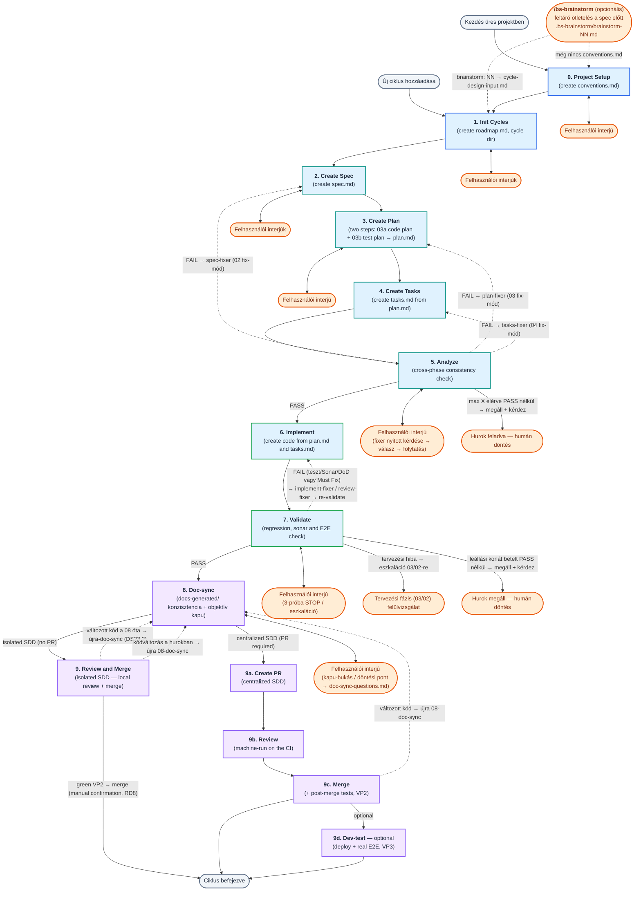
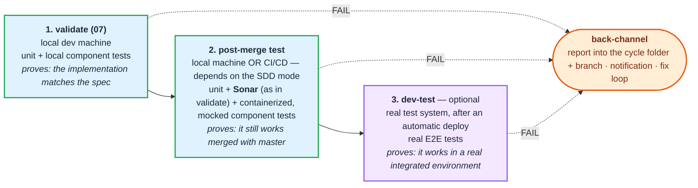

# Teljes berki spec flow (00–09)

← [Vissza a főoldalra](../../README-HU.md) · [Oldalindex](README.md)

Ez a fejezet a **teljes, sokfázisú** fejlesztési utat írja le a folyamatábráival — a projekt-setuptól (00–01) a per-ciklus loopon át (02–09) a merge-ig, az önjavító hurkokkal együtt. A **másik utat**, az egyszerűsített háromfázisú flow-t lentebb, az „Egyszerűsített (lightweight) flow" fejezet részletezi.

> **Kód-jelölések:** a szövegben a `DS`/`VD`/`RD`/`LC`/`SK` + szám alakú kódok (pl. `DS22`, `RD6`, `LC1`) a skill-fájlok belső szabály-azonosítói. A részletes definíciójuk az adott skillben él; itt csak visszakereshető horgonyként szerepelnek, a README megértéséhez nem kell feloldani őket.

## 4.1 Magas szintű összefoglalás

Ez a diagram összefoglalja a 00–09 fázisok egymás utáni folyamatát, a kezdőpontokat, az interjú loopokat és a hibajavítási visszacsatolásokat.



## 4.2 Tesztelési pontok — hol tesztelünk, és mit bizonyít

A `bs` SDD-ben **három helyen tesztelünk, három különböző okból**. A három pont nem redundancia: mindegyik **mást** bizonyít, és a harmadikat a másik kettő nem tudja kiváltani.

1. **`validate` (07)** — az ágens által készített implementációt validáljuk **a spec ellenében**, a fejlesztő **lokális gépén**. Tipikusan unit és lokálisan futó komponens tesztek.
2. **post-merge teszt (`VP2`)** — a **fő branch-csel egyesítés után**. Hogy hol fut, az attól függ, milyen SDD-t használunk: lehet a **CI/CD folyamat része** és a **lokális gépen** is. CI/CD esetén unit tesztek, **Sonar**, és **konténerizált, mockolt** komponens tesztek. **A Sonar itt is kell — ugyanúgy, ahogy a `validate`-ben van:** az egyesítés olyan kódot hoz be, amit a `07` Sonar-köre sosem látott, és a statikus hibák ugyanúgy keletkezhetnek belőle, mint a futásidejűek. Ez nulla új gépezet: ugyanaz a `sonar-gate.py`, ugyanazokkal a `conventions.md` küszöbökkel.
3. **dev-teszt (`VP3`)** — egy **automatikus deploy után**, egy **valódi teszt rendszerben**, e2e tesztek. Csak központosított úton értelmes (`/bs-dev-test`).

**És mindhármat vissza kell csatornázni** — ez az ábra negyedik eleme, nem lábjegyzet: a riport a **ciklus útvonalára** kerül (`test-report/<fázis>/`, commitolva), megy az **értesítés**, és a bukás vagy a fejlesztőhöz megy vissza, vagy — ha be van kapcsolva — a CI **javító hurkába**.



> **A ciklus akkor kész, ha az UTOLSÓ engedélyezett verifikáció zöld.** Melyik az utolsó, azt a `conventions.md` `## Review and merge` szekciója mondja meg (`Post-merge tests`, `Dev deployment test`). Addig a roadmap ciklus-sora `⏳ verifikációra vár` jelölést visel, és a generált `cycle-status.md` is ezt mutatja.

> *A korábbi, teljes részletes folyamatábra saját oldalon él tovább: [A részletes folyamatábra](process-diagram.md).*

## 4.7 Példa prompt-folyam (egy ciklus végigvezetése)

Egy konkrét ciklus, `cycle-02-oidc-login` végigvitele a promptok sorrendjében. A `00`/`01` **egyszeri** setup, a `02`–`09` **ciklusonként** ismétlődik. Minden fázist a saját indító promptjával, **új chat sessionban** indíts; a `<cycle-name>` és egyéb helyőrzőket cseréld ki. Az alábbi blokkban a `→` sorok a fázisban zajló interakciót (interjú, jóváhagyás, hurok) jelölik.

```
# ①  00 — Projekt inicializálás  (csak üres projektnél, egyszer)
Futtasd a parancsot: `/bs-init-project input: OIDC-alapú bejelentkezés a mobil-bank frontendhez`
   → az ágens végigkérdezi a konvenciókat (tech stack, teszt, merge stratégia) → conventions.md

# ②  01 — Ciklusok kezelése
Futtasd a parancsot: `/bs-add-cycles input: Új ciklus — OIDC login a mobil-bank frontendhez`
   → névjavaslat: cycle-02-oidc-login → "ok" → specs/roadmap.md (Kész) + ciklusmappa

# ③  02 — Spec írás
Futtasd a parancsot: `/bs-write-spec input: @specs/roadmap.md`
   → spec-questions.md kérdések egyenként → válaszok → "a spec kész, mehet" → spec.md (Tervezésre kész)

# ④  03a — Kód-terv írás
Futtasd a parancsot: `/bs-write-code-plan input: @specs/cycle-02-oidc-login/spec.md`
   → kötelező első kérdés: E2E teszt stratégia → válaszok → "jóváhagyom" → plan.md (Teszt-tervezésre kész)

# ⑤  /clear, majd 03b — Teszt-terv írás (ugyanabba a plan.md-be)
Futtasd a parancsot: `/bs-write-test-plan input: @specs/cycle-02-oidc-login/plan.md`
   → a fázis MAGA futtatja a kód-terv kapuját (D5) → TS-NN forgatókönyvek → "jóváhagyom" → plan.md (Task írásra kész)

# ⑥  04 — Tasks írás
Futtasd a parancsot: `/bs-write-tasks input: @specs/cycle-02-oidc-login/plan.md`
   → "mehet" → tasks.md (Implementálásra kész)

# ⑦  05 — Analyze
Futtasd a parancsot: `/bs-analyze input: @specs/cycle-02-oidc-login`
   → kereszt-fázisos ellenőrzés; a talált tételekből TE választod ki (triázs), mit javítson → önjavító hurok az analyze-task.md-n → analyze-report.md (PASS)

# ⑧  06 — Implementálás
Futtasd a parancsot: `/bs-implement input: @specs/cycle-02-oidc-login/tasks.md`
   → kód + tasks.md haladás → tasks.md (Validálásra kész)

# (bármikor az 05 után, nem számozott lépés) — kézi tesztterv
# Futtasd a parancsot: `/bs-manual-test-plan input: @specs/cycle-02-oidc-login`
#    → manual-test-plan.md (Tervezett vagy As-built módban) — nem fázis, nem változtat státuszt

# ⑨  07 — Validálás
Futtasd a parancsot: `/bs-validate input: @specs/cycle-02-oidc-login`
   → gyors tesztek → Sonar + kódreview (reviewer subagent) → nehéz tesztek + DoD;
     FAIL esetén önjavító hurok → PASS → spec/plan/tasks státusz: Kész

# ⑩  08 — Doc-sync
Futtasd a parancsot: `/bs-doc-sync input: @specs/cycle-02-oidc-login`
   → docs-generated/ frissítése + objektív kapu → konzisztens dokumentáció

# ⑪  09 — Review and merge  (PR nélküli út; PR esetén: /bs-create-pr → /bs-review → /bs-merge)
Futtasd a parancsot: `/bs-review-and-merge input: @specs/cycle-02-oidc-login`
   → kapuk (státusz + tiszta review + doc-sync) → main behozása → VP2 kör (tesztek + Sonar)
   → merge (kézi megerősítéssel) → roadmap-lezárás + cycle-status.md
```

A következő ciklus (`cycle-03-...`) ismét a `02`-vel indul — a `00`/`01` nem ismétlődik.
