# Egyszerűsített (lightweight) flow

← [Vissza a főoldalra](../../README-HU.md) · [Oldalindex](README.md)

A fenti 00–09 ábrák a **teljes berki spec flow-t** írják le. Ez a szekció a **másik utat**, az egyszerűsített, háromfázisú flow-t részletezi — kis, jól körülhatárolt feladatokhoz (konfiguráció, egyszerűbb script, kisebb javítás), amelyek 3-4 lépésben megoldhatók. Kanonikus hívó parancsa a `/bs-quick-flow`; a flow-választásról lásd fent a „Két fejlesztési út" szekciót.

A teljes flow-val szemben itt **nincs** külön `plan.md` (a technikai vázlat a `spec-plan.md`-be kerül), **nincs** `analyze`/`validate`/`doc-sync`/`review` fázis és **nincs** automatizált önjavító hurok — a minőségi kapuk inline futnak, a dokumentáció frissítése pedig a 3. fázis része. Az út ciklusmappája a nevében hordozza a jelölést — `specs/cycle-NN_quick-flow_<cycle-name>/` (QF22) —, így ránézésre látszik, mely ciklusok készültek az egyszerűsített úton. A háromfázisú út: `spec-plan.md` → `tasks.md` → implementáció, minden fázis végén **kötelező konzisztencia-ellenőrzéssel** és a **determinisztikus RP1 útvonal-kapuval** (`analyze-gate-check.py --paths-only` — ez a flow egyetlen kötelező kapu-scriptje), a fázisváltások előtt pedig **⛔ explicit felhasználói jóváhagyással**. A jóváhagyás nem a beszélgetésben marad: mindkét artefaktum **`Státusz` mezőt** kap (`Piszkozat` → `Task írásra kész`, illetve `Piszkozat` → `Implementálásra kész` → `Kész`), és a státuszírás + commit egyetlen, megszakíthatatlan lépéspár — ettől éli túl a ciklus a `/clear`-t és a megszakadást. A git-konvenciót (fő branch, branch-elnevezés, No-VCS, commit-formátum) a `conventions.md` `Git és branching konvenciók` szekciója adja, nem a skill drótozza be.

**Hogyan indul egy ciklus?** A Felhasználó átad egy feladatot, az ágens előkészíti a git ágat, majd egy rövid **interjúval (grill)** tisztázza a célt — addig kérdez, amíg minden információ megvan a `spec-plan.md`-hez. A **flow-méret döntés ennek az interjúnak az alapján** születik: az ágens folyamatosan mérlegeli, hogy a feladat tényleg belefér-e az egyszerűsített flow-ba (3-4 lépés, egyetlen komponens, nincs összetett előzetes tervezés). Ha a feladat túlnő ezen (nagyobb kódírás, több komponens, integráció, összetett tervezés), az ágens **megáll még a `spec-plan.md` előtt**, és a teljes berki spec folyamatot javasolja (`01-add-cycles`). Csak ha a feladat valóban kicsi, javasol ciklusszámot és nevet, kér jóváhagyást, és hozza létre a ciklusmappát.

## 5.1 Folyamatábra

```mermaid
flowchart TD
    classDef start fill:#f1f5f9,stroke:#64748b,stroke-width:2px,color:#1e293b;
    classDef design fill:#e0f2fe,stroke:#0d9488,stroke-width:2px,color:#1e293b;
    classDef dev fill:#e0f2fe,stroke:#16a34a,stroke-width:2px,color:#1e293b;
    classDef decision fill:#fef3c7,stroke:#d97706,stroke-width:2px,color:#1e293b;
    classDef doc fill:#f3e8ff,stroke:#8b5cf6,stroke-width:2px,color:#1e293b;
    classDef userInput fill:#ffedd5,stroke:#ea580c,stroke-width:2px,color:#7c2d12;

    Start(["Felhasználó átad egy feladatot"]):::userInput
    Git["① Git ág előkészítése<br/>(feature ág, tiszta munkafa)"]:::design
    Interview["② Cél megadása + interjú (grill)<br/>kérdez, amíg minden tiszta a spec-plan.md-hez"]:::design
    SizeCheck{"A feladat tényleg kicsi?<br/>(3-4 lépés · egy komponens ·<br/>nincs összetett tervezés)"}:::decision
    Redirect(["Túlnő rajta → átirányítás<br/>a teljes flow-ra (01-add-cycles)"]):::userInput
    NameApprove["③ Ciklusszám + névjavaslat<br/>→ ⛔ felhasználói jóváhagyás"]:::design
    Dir["④ Ciklusmappa létrehozása<br/>(specs/cycle-NN_quick-flow_...)"]:::design

    P1["<b>1. fázis — Specifikáció (spec-plan.md)</b><br/>cél, paraméterek, technikai vázlat (plan-helyettesítő),<br/>tesztstratégia CÉL-KÖRNYEZETTEL, README-terv"]:::design
    C1["Konzisztencia-ellenőrzés + RP1 útvonal-kapu<br/>(utak, nevek, portok egyeznek)"]:::doc
    Stop1{"⛔ Felhasználói<br/>jóváhagyás?"}:::userInput

    P2["<b>2. fázis — Feladatlista (tasks.md)</b><br/>pipálható lépések [local]/[remote] címkével,<br/>teszt a dokumentáció elé, logikus teszt-sorrend"]:::design
    C2["Konzisztencia-ellenőrzés + RP1 útvonal-kapu<br/>(tasks.md ↔ spec-plan.md)"]:::doc
    Stop2{"⛔ Felhasználói<br/>jóváhagyás?"}:::userInput

    P3["<b>3. fázis — Megvalósítás</b><br/>kód a tasks.md szerint EGY futásban,<br/>valós idejű pipálás, leftover-sweep"]:::dev
    Test{"Tesztek zöldek?"}:::decision
    Stuck{"Beragadás?<br/>(2-3 kör azonos hiba)"}:::decision
    Ask(["Állj meg → célzott,<br/>előremozdító kérdés a Felhasználónak"]):::userInput
    Close(["Lezárás: tasks.md → Kész, dokumentáció frissítve,<br/>záró commit + roadmap/drift-jelzés"]):::start

    Start --> Git --> Interview --> SizeCheck
    SizeCheck -- "Nem (túlnő rajta)" --> Redirect
    SizeCheck -- "Igen" --> NameApprove --> Dir --> P1
    P1 --> C1 --> Stop1
    Stop1 -- "Nem → várakozás" --> Stop1
    Stop1 -- "Igen → státusz: Task írásra kész + commit" --> P2
    P2 --> C2 --> Stop2
    Stop2 -- "Nem → várakozás" --> Stop2
    Stop2 -- "Igen → státusz: Implementálásra kész + commit" --> P3
    P3 --> Test
    Test -- "Nem (bukik) → javít, majd újra<br/>UGYANAZ a lépés, szelektorral" --> Stuck
    Stuck -- "Nem" --> P3
    Stuck -- "Igen" --> Ask
    Ask --> P3
    Test -- "Igen" --> Close
    P3 -. "spec-hiba → vissza az 1. fázisba<br/>+ újra-jóváhagyás" .-> P1
```



## 5.2 A három fázis röviden

| Fázis | Kimenet | Fő szabály | Kapu a fázis végén |
|---|---|---|---|
| **1. Specifikáció** | `spec-plan.md` (`Piszkozat`) | Cél + paraméterek + **technikai vázlat** (a `plan.md`-t helyettesítő állványzat: érintett fájlok, kulcs-elemek, végrehajtási sorrend, fő hibaág) + tesztstratégia + README-terv. A tesztstratégia hat kötelező eleme: **`Cél-környezet` mező**, nem lokális célnál **literál cél-host + elérhetőségi probe + `localhost`-tilalom**, **`[local]`/`[remote]` címke**, **„mit ellenőriz és miért" állítás** (kalibrációs mintával), **vacuous-teszt tilalom**, **`skipped` nem bizonyíték**. Projektfájlt itt **nem** módosít. | Konzisztencia-ellenőrzés + **RP1 útvonal-kapu** → **⛔ explicit jóváhagyás** → státusz `Task írásra kész` + commit |
| **2. Feladatlista** | `tasks.md` (`Piszkozat`) | A technikai vázlatra épülő, pipálható lépések; belépéskor **státusz-kapu** a `spec-plan.md`-n. A tesztelés a dokumentáció-frissítés **elé** kerül, logikus **teszt-sorrenddel** (erőforrást előbb létrehozni, csak utána ellenőrizni); minden teszt-lépés viseli a `[local]`/`[remote]` címkét, az állítást, a probe-ot és a **szelektoros** parancsot. A regressziós összefutás külön, **utolsó** lépés. | Konzisztencia-ellenőrzés (a `spec-plan.md`-vel is) + **RP1 útvonal-kapu** → **⛔ explicit jóváhagyás** → státusz `Implementálásra kész` + commit |
| **3. Megvalósítás** | kód + frissített dokumentáció | Kizárólag a `tasks.md` szerint, **egy futásban** (IM1: a task kipipálása nem fázis-vég), valós idejű pipálással. Csere/átnevezés után **leftover-sweep** (`grep` a régi alakra). **Egy futtatás = egy azonosítható teszt:** bukó teszt → javít + **ugyanaz a lépés** szelektorral újra; a gyűjtő futás nem helyettesíti a lépésenkéntit. | Tesztek zöldek (a skippeltek kimondva) + dokumentáció kész + `docs-generated/` drift-jelzés + egyeztetve → `tasks.md` = `Kész` + **záró commit a `conventions.md` szerint** |

## 5.3 Két beépített kör-megszakító

- **Beragadás-felismerés (3. fázis):** ha ugyanaz a hiba 2-3 javítási kör után is bukik, vagy körben jár a megoldás, az ágens **megáll**, összefoglalja mit próbált + a pontos hibaüzenetet + a hipotéziseit, és **célzott, döntésre/adatra lebontott kérdést** tesz fel — nem próbálkozik tovább vakon.
- **Fázis-visszalépés spec-hibára:** ha implementáció közben derül ki, hogy a `spec-plan.md` hiányos vagy téves, **tilos csendben eltérni** tőle — vissza az 1. fázisba, `spec-plan.md` (és ha kell, `tasks.md`) frissítés, majd **újra-jóváhagyás**, és csak utána tovább.

## 5.4 Opcionális ágensek (mind read-only, egyik sem kötelező)

Az egyszerűsített flow szándékosan **kevés** specialistát használ, és mindet **opcionálisan** — kis feladatnál a fő ágens subagent nélkül is elvégzi a munkát. Gyengébb/olcsóbb modellel bátran kihagyható mind a három.

| Ágens | Fázis | Mit ad | Mikor érdemes |
|---|---|---|---|
| [`researcher`](../../prompts/agents-hu/researcher.md) | 1. (spec-plan.md) | Érintett forrásfájlok (`path:sor–sor`) + frissítendő dokumentumok listája | Meglévő kódbázis módosításakor, ha nem nyilvánvaló az érintett fájlkör |
| [`analyzer`](../../prompts/agents-hu/analyzer.md) | 2. (tasks.md) | `spec-plan.md` ↔ `tasks.md` konzisztencia-diagnózis (lefedettségi rés, alulspecifikáció) | Több követelményes, könnyen kicsúszó task-listánál |
| [`reviewer`](../../prompts/agents-hu/reviewer.md) | 3. (commit előtt) | Diff code review → `Must Fix` / `Suggestion` | Nem triviális kódváltozásnál, commit előtti kapuként |

> **Kontraktus-helyettesítések (a skill adja meg őket, az agent-promptok törzse változatlan):** az `analyzer` **hatókör-paramétert nem** kap (mind az öt kategóriát viszi) és szelet-fájl nélkül fut, a bemenete a `spec-plan.md` + `tasks.md` **pár** — a `plan.md`-re hivatkozó bemeneti pontja üres. A `reviewer` a kötelező `plan.md` helyett a `spec-plan.md` **technikai vázlatát** kapja, és a `specs/cycle-NN_quick-flow_<cycle-name>/code-review.md`-be ír (a ciklus gyökerében, `test-report/` almappa nélkül); a `Must Fix` azonosítók és az inkrementális írás megmarad, önjavító hurok nincs.

> **Amit ez a flow NEM használ:** a fixer-wrappereket (`spec/plan/tasks/bs-implement/review-fixer`) és a `doc-sync-planner`-t — ezek a teljes flow önjavító hurkainak és a `docs-generated/` szinkronjának belépői. Itt nincs automatizált hurok (a hibákat a fő ágens inline javítja), és nincs külön generált doc-réteg (a dokumentáció a 3. fázis része). Ha ezek valóban indokolttá válnának, az annak a jele, hogy **a teljes berki spec flow-ra kell váltani**.

## 5.5 Indító prompt (copy-paste)

```
/bs-quick-flow input: <a feladat rövid leírása>
```

Brainstormból átvéve (az `NN` a `.bs-brainstorm/` munkafájl sorszáma):

```
/bs-quick-flow brainstorm: NN
```

## 5.6 Példa prompt

Egy kis feladat végigvitele. Itt **egyetlen indító prompt** van; utána a flow **társalgásos** — a fázisváltásokat a te rövid, természetes nyelvű jóváhagyásaid vezérlik a ⛔ kapuknál (nincsenek külön fázis-promptok, mint a teljes flow-ban). Az alábbi blokkban az idézőjeles sorok a te válaszaid:

```
# ①  Indítás — a feladat átadása
/bs-quick-flow input: Adj a legacy-login apphoz egy `/health` végpontot, ami 200 OK-t ad "status: ok" JSON-nal.

# ②  Interjú + méret + név  (az ágens vezeti; te válaszolsz)
   → git ág előkészítése + grill-interjú → mivel a feladat kicsi, javasol: cycle-03_quick-flow_add-health-check
   te: "ok, mehet ezzel a névvel"

# ③  ⛔ 1. fázis — spec-plan.md jóváhagyása
   → spec-plan.md + konzisztencia-ellenőrzés + RP1 útvonal-kapu után megáll
   te: "jóváhagyom a spec-et, jöhet a tasks.md"

# ④  ⛔ 2. fázis — tasks.md jóváhagyása
   → tasks.md után megáll (státusz: Implementálásra kész + commit)
   te: "rendben, kezdheted az implementációt"

# ⑤  3. fázis — megvalósítás
   → implementál a tasks.md szerint EGY futásban, szelektoros tesztek, dokumentáció → tasks.md = Kész + záró commit
```

> Ha az interjú (②) alatt kiderül, hogy a feladat mégis nagyobb, az ágens itt megáll, és a teljes flow-t (`01-add-cycles`) javasolja — lásd az 5.1 ábra „túlnő rajta" ágát. A flow-váltás döntése a tiéd.

---
