# A részletes folyamatábra

← [Vissza a főoldalra](../../README-HU.md) · [Oldalindex](README.md)

Az alábbi részletes ábra bemutatja az egyes fázisok közötti pontos átmeneteket, a bemeneti/kimeneti fájlokat, a felhasználói interakciós pontokat (User Input), valamint a hibák esetén fellépő visszacsatolási loopokat.

```mermaid
flowchart TD
    %% Styling definitions
    classDef setup fill:#e0f2fe,stroke:#2563eb,stroke-width:2px,color:#1e293b;
    classDef design fill:#e0f2fe,stroke:#0d9488,stroke-width:2px,color:#1e293b;
    classDef dev fill:#e0f2fe,stroke:#16a34a,stroke-width:2px,color:#1e293b;
    classDef decision fill:#fef3c7,stroke:#d97706,stroke-width:2px,color:#1e293b;
    classDef doc fill:#f3e8ff,stroke:#8b5cf6,stroke-width:2px,color:#1e293b;
    classDef userInput fill:#ffedd5,stroke:#ea580c,stroke-width:2px,color:#7c2d12;

    subgraph Setup ["<b>⚙️ PROJEKT SETUP (EGYSZER)</b>"]
        P00["00 — Projekt inicializálás"]:::setup
        P00_Loop{"Vannak még kérdések?"}:::decision
        DocConv["conventions.md"]:::doc
        In00(["User Input: Projekt célok & válaszok"]):::userInput

        P01["01 — Ciklusok kezelése"]:::setup
        P01_Loop{"Vannak még nyitott kérdések?"}:::decision
        DocRoadmap["specs/roadmap.md (Státusz: Kész)"]:::doc
        In01(["User Input: HLD/LLD vagy leírás"]):::userInput
    end

    subgraph Design ["<b>📐 TERVEZÉSI FÁZIS (CIKLUSONKÉNT)</b>"]
        P02["02 — Spec írás"]:::design
        P02_Loop{"Vannak még kérdések? (spec-questions.md)"}:::decision
        DocSpec["specs/cycle-NN-*/spec.md (Státusz: Tervezésre kész)"]:::doc
        In02(["User Input: Ciklus választás & spec válaszok"]):::userInput

        P03a["03a — Kód-terv írás"]:::design
        P03b["03b — Teszt-terv írás"]:::design
        P03_Loop{"Vannak még kérdések? (plan-questions.md)"}:::decision
        DocPlan["specs/cycle-NN-*/plan.md (Státusz: Task írásra kész)"]:::doc
        In03(["User Input: Tervezési válaszok"]):::userInput

        P04["04 — Tasks írás"]:::design
        DocTasks["specs/cycle-NN-*/tasks.md (Státusz: Implementálásra kész)"]:::doc

        P05["05 — Analyze"]:::design
        P05_Check{"Konzisztens? (analyze-report.md)"}:::decision
        DocAnalyze["specs/cycle-NN-*/analyze/analyze-report.md (PASS/FAIL)"]:::doc
    end

    subgraph Development ["<b>💻 IMPLEMENTÁCIÓ & ELLENŐRZÉS (ITERATÍV)</b>"]
        P06["06 — Implementálás"]:::dev
        P06_Loop["Kód fejlesztése + tasks.md haladás rögzítése"]:::dev
        DocTasksReady["specs/cycle-NN-*/tasks.md (Státusz: Validálásra kész)"]:::doc
        In06(["User Input: Ciklus implementációs indítása"]):::userInput

        P07["07 — Validálás és kódreview"]:::dev
        P07_Run{"Tesztek & SonarQube futtatása<br/>(test-runner subagent)"}:::decision
        P07_Review{"Zöld tesztek → kódreview<br/>(reviewer subagent, RV1)"}:::decision
        DocReport["specs/cycle-NN-*/test-report/<br/>validation-report.md + code-review.md<br/>+ validate/round-NN/ (riportok, sonar)"]:::doc
        P07_Check{"Sikeres? (PASS)<br/>zöld tesztek + tiszta review"}:::decision

        P08["08 — Doc-sync"]:::dev
        P08_Plan["doc-sync-planner subagent<br/>→ doc-sync-plan.md (per-fájl terv<br/>+ kész csereszöveg-patch)"]:::doc
        DocGen["docs-generated/ (system-overview, architecture, CHANGELOG, design-drift, README)"]:::doc
        P08_Gate{"Objektív konzisztencia-kapu zöld?<br/>(DS22 — ds22-gate-check.py<br/>+ TC8 — tc8-gate-check.py)"}:::decision

        P09["09 — Merge"]:::dev
        P09_DocCheck{"Változott kód a 08 óta?"}:::decision

        Merge["Merge (lokális squash vagy PR, a conventions.md Merge stratégiája szerint)"]:::setup
        In08(["User Input: Merge megerősítés"]):::userInput
    end

    %% Connections
    Start([Kezdés]) --> P00

    %% User Inputs
    In00 --> P00
    In01 --> P01
    In02 --> P02
    In03 --> P03a
    In03 --> P03b
    In06 --> P06
    In08 --> Merge

    P00 --> P00_Loop
    P00_Loop -- "Igen" --> P00
    P00_Loop -- "Nem (Lezárva)" --> DocConv
    DocConv --> P01

    P01 --> P01_Loop
    P01_Loop -- "Igen" --> P01
    P01_Loop -- "Nem (Kész)" --> DocRoadmap

    DocRoadmap --> P02
    P02 --> P02_Loop
    P02_Loop -- "Igen" --> P02
    P02_Loop -- "Nem" --> DocSpec

    DocSpec --> P03a
    P03a -- "kód-fél kész (Teszt-tervezésre kész)" --> P03b
    P03b --> P03_Loop
    P03_Loop -- "Igen" --> P03b
    P03_Loop -- "Nem" --> DocPlan

    DocPlan --> P04
    P04 --> DocTasks

    DocTasks --> P05
    P05 --> DocAnalyze
    DocAnalyze --> P05_Check

    %% Analyze önjavító hurok (05)
    P05_Check -- "FAIL" --> P05_Fixer["fixer-subagent<br/>(02/03/04 fix-mód, [analyze-loop])"]:::design
    P05_Fixer -- "fixer nyitott kérdést gyűjt<br/>(*-questions.md)" --> P05_Q(["User Input: FÁZIS/Knn válasz<br/>(orchestrátor kérdezi)"]):::userInput
    P05_Q --> P05_Fixer
    P05_Fixer -- "downstream re-deriválás<br/>02→03→04 (reconciliation)" --> P05
    P05_Check -- "max X=3 elérve PASS nélkül" --> P05_Stop["Hurok feladva → analyze-report FAIL<br/>(marker marad) + humán döntés"]:::doc
    P05_Check -- "PASS (marker le, 1 commit)" --> P06

    P06 --> P06_Loop
    P06_Loop --> DocTasksReady

    DocTasksReady --> P07
    P07 --> P07_Run
    P07_Run -- "zöld (teljes kör 1-3. lépés)" --> P07_Review
    P07_Run -. "bukott teszt / Sonar / DoD<br/>(a review nem is fut)" .-> DocReport
    P07_Review --> DocReport
    DocReport --> P07_Check

    %% Validate önjavító hurok (07) — tesztek ÉS review egy hurokban
    P07_Check -- "FAIL: teszt / Sonar / DoD" --> P07_Fixer["implement-fixer subagent<br/>(06 fix-mód, [validate-loop])<br/>## Validációs javítások"]:::dev
    P07_Check -- "FAIL: Must Fix finding (MF-NN)" --> P07_RFixer["review-fixer subagent<br/>(06 fix-mód, [validate-loop])<br/>## Review javítások"]:::dev
    P07_Fixer -- "javítás kész → könnyű kör,<br/>majd teljes megerősítő kör" --> P07
    P07_RFixer -- "javítás kész → könnyű kör,<br/>majd teljes megerősítő kör + re-review" --> P07
    P07_Fixer -. "eszkalációs jelzés (VD5)" .-> P07_Esc
    P07_RFixer -. "eszkalációs jelzés (VD5)" .-> P07_Esc
    P07_Check -- "3-próba / 5 összes / 5 FAIL-futás<br/>megrekedt kód-bug" --> P07_Stop["Hurok megáll → STOP + humán<br/>([validate-loop] marker + javító-szekciók maradnak)"]:::doc
    P07_Check -- "tervezési hiba (VD5):<br/>csak teszt/DoD/finding-módosítással lenne zöld" --> P07_Esc["Eszkaláció: státusz-visszafordítás<br/>03/02-re → tervezési fázis"]:::doc
    P07_Esc --> P03a

    %% Validation Pass
    P07_Check -- "PASS (Igen)" --> DocStatusKesz["spec.md, plan.md, tasks.md státusza: Kész"]:::doc
    DocStatusKesz --> P08

    %% Doc-sync (08): terv → mechanikus végrehajtás → objektív kapu (NEM önjavító subagent-hurok)
    P08 --> P08_Plan
    P08_Plan --> DocGen
    DocGen --> P08_Gate
    P08_Gate -. "kapu-bukás / döntési pont → doc-sync-questions.md<br/>(ember-vezérelt javítás, DS10)" .-> P08DS_Q(["User Input: doc-sync kérdés / javítás"]):::userInput
    P08DS_Q --> P08_Plan
    P08_Gate -- "kapu zöld → docs-generated/ konzisztens" --> P09

    %% Merge (09) — nincs hurok, nincs subagent; a review már a 07-ben lefutott
    P09 --> P09_DocCheck
    P09_DocCheck -. "Igen → merge előtt újra-doc-sync (DS23.2)" .-> P08
    P09_DocCheck -- "Nem → a conventions.md `## Review and merge` szerint" --> Merge["09 — Review and merge (PR nélkül)<br/>main behozása → VP2 (tesztek + Sonar) → merge (RD8)"]
    P09_DocCheck -- "PR submission: yes" --> MergePR["09a create-pr → 09b review → 09c merge<br/>a VP2 a push ELŐTTI kapu"]
    MergePR -. "Dev deployment test: yes" .-> DevTest["09d — dev-test (VP3)<br/>deploy + valódi e2e az integrált környezetben"]
    Merge --> End([Ciklus befejezve])
    MergePR --> End
    DevTest --> End
```

