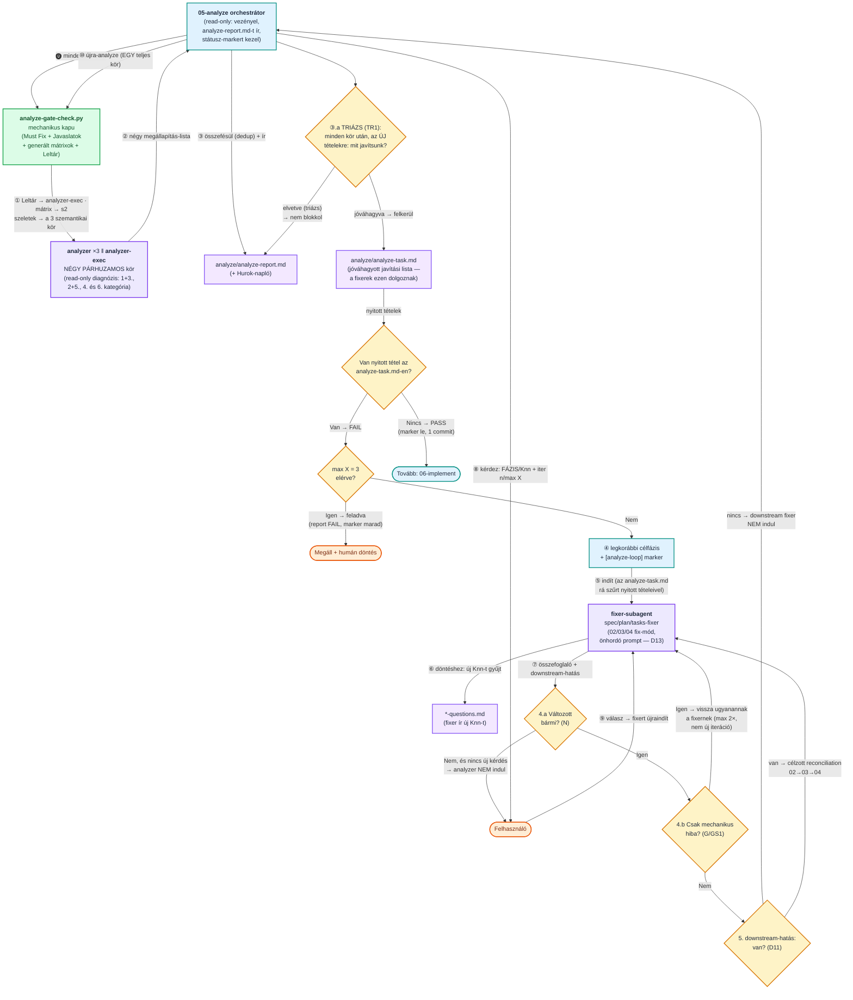
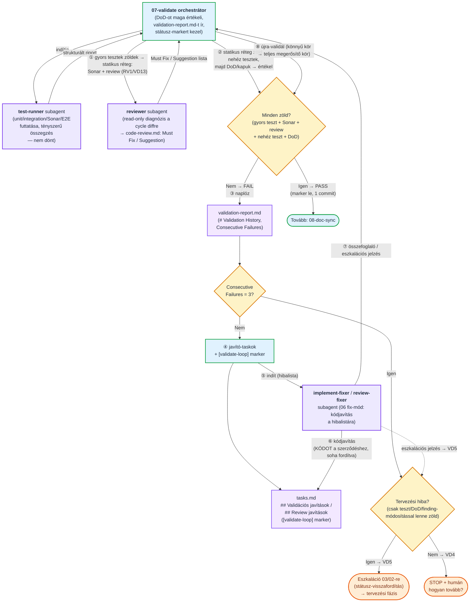

# Az önjavító hurkok (05-analyze, 07-validate)

← [Vissza a főoldalra](../../README-HU.md) · [Oldalindex](README.md)

## 4.4 Az 05-analyze önjavító hurok (részletes)

Ez az ábra **kizárólag az 05-analyze lépést** mutatja be, a subagentek és a kérdés-folyam feltüntetésével. Az orchestrátor (05-analyze) read-only: a **gépies réteget** a `analyze-gate-check.py` kapu, a **szemantikai diagnózist** az `analyzer` **három párhuzamos köre** (ez az egyetlen pont a teljes rendszerben, ami a legdrágább, `deep_reasoning_agent` tier-en fut — lásd 4.3), a **végrehajthatósági diagnózist** az `analyzer-exec` (`default` tier, velük **párhuzamosan**), a **javítást** a fixer-subagentek (02/03/04 fix-mód, `default` tier) végzik; a felhasználót mindig az **orchestrátor** (szintén `default` tier) kérdezi, fázis-jelzéssel.

Négy rövidítő ág van benne, mert ezek adják a fázis megtakarításának nagy részét: a fixer **maga futtatja a kaput visszatérés előtt** (GS1), így a fixer utáni kapu-kör (G) védőhálóvá szelídült — ha mégis csak mechanikus hibát talált, az visszamegy ugyanahhoz a fixerhez, analyzer-kör és iteráció-fogyasztás nélkül; ha a fixer **semmit nem változtatott** (N), a hurok nem indít analyzert, hanem megáll és kérdez; és ha minden `Must Fix` **lokális**, a fixerek **egyetlen üzenetben, párhuzamosan** indulnak, downstream re-deriválás nélkül (LF1).

Az ötödik — és a legnagyobb megtakarítást hozó — ág a **triázs-megállás (TR1)**: **minden diagnoszta-kör után** a hurok megáll, és egyetlen kérdésben a felhasználó dönti el, mely **új** `Must Fix` tételeket javítsuk egyáltalán. A jóváhagyott tételek az **`analyze-task.md`** javítási listára kerülnek — a fixerek kizárólag ezen dolgoznak —, az elvetettek pedig `elvetve (triázs)` állapottal a riportban maradnak (audit-nyom), és nem blokkolják a `PASS`-t. Egy körön belül a hurok nem kérdez: végigmegy a listán, és amit közben újként talál, arról a **következő** triázsban kérdez. Már eldöntött tételre soha nem kérdez rá újra; a tisztán mechanikus (kapu-)tételek pedig kérdés nélkül kerülnek a listára.

**Az analízis mappája (AD1).** Az analízis minden fájlja a ciklus `analyze/` almappájában él: `analyze-report.md`, `analyze-task.md`, a kapu által kimetszett `slices/` (gitignore-olt) és minden segédfájl. A ciklus gyökere így a tervezési dokumentumoké marad.



**A működés lépésről lépésre:**

1. **A subagent gyűjti a kérdést, nem kérdez.** A fixer-subagent (02/03/04 fix-mód) a döntést igénylő pontokat **nem teszi fel közvetlenül a felhasználónak** — nincs interaktív csatornája. Ehelyett új `Knn` bejegyzésként felveszi a megfelelő `*-questions.md`-be (`spec-questions.md` / `plan-questions.md` / `tasks-questions.md`).
2. **És visszaadja az orchestrátornak.** A fixer a futása végén tömör összefoglalót ad: mit javított, és milyen új `Knn` kérdés-azonosítókat vett fel. (Az ábrán: ⑥ gyűjt, ⑦ visszaad.)
3. **Az orchestrátor teszi fel a kérdést a felhasználónak**, mindig jelezve, melyik fázishoz kapcsolódik: **fázis-fejléc + `FÁZIS/Knn` prefix** (pl. `[PLAN · iter 2/3 · PLAN/K05]`). Egyszerre egy kérdés, a válasz végén kattintható link az érintett `*-questions.md`-re.
4. **A válasz átvezetése után a hurok folytatódik:** az orchestrátor beírja a döntést a `*-questions.md`-be (`[x]` + összefoglaló), újraindítja a fixert, majd a downstream re-deriválás (`02→03→04`) és az újra-analyze következik. A kérdés-megállás **nem** számít új iterációnak, és nem fogyaszt a `max X`-ből.

A hurok két, egymástól független módon áll le: **PASS** (nincs több `Must Fix` → marker le, egyetlen commit, tovább a 06-ra), vagy **`max X = 3` elérve PASS nélkül** (a report `FAIL`, a `[analyze-loop]` marker az érintett dokumentumokon marad, az orchestrátor összefoglal és humán döntést kér).

## 4.5 Az 07-validate önjavító hurok (részletes) — tesztek + kódreview

Ez az ábra **kizárólag az 07-validate lépést** mutatja be, a subagentek feltüntetésével (a fenti analyze-ábra párja). Az orchestrátor (07) PASS-ig **determinisztikus ellenőrző** — a tesztek/Sonar/E2E tényleges futtatását a **`test-runner` subagent** végzi (`default` tier — mechanikus végrehajtás, nem dönt, de a megbízható log-/riport-értelmezés miatt szándékosan nem a legolcsóbb tier-en fut), a DoD-ot és a PASS/FAIL döntést az orchestrátor hozza —, FAIL esetén **orchestrátor**: a **javítást** az `implement-fixer` subagent (= a 06 fix-módja) végzi, a re-validálást és a döntéseket az orchestrátor.

**A fázis determinisztikus rétege — „ha van rá szkript, ne olvass fájlt" (VD11/b).** A 07 a keretrendszer legszkriptesebb fázisa, mert a kérdéseinek nagy része gépi:

| Kérdés | Ki válaszolja | Mit vált ki |
|---|---|---|
| Lefutottak-e a tesztek, hány zöld/piros? | `run-tests.py` a `plan.md` **gépi futtatási táblájából** | a `test-runner` subagentet **és** a nyers teszt-logot (a fázis legnagyobb token-tétele) — a subagent fallback marad, ha nincs tábla |
| Átment-e a Quality Gate, van-e blokkoló finding? | `sonar-gate.py` (Sonar Web API) | a `sonar-report.md` elolvasását és a severity-szűrést; a QG1 (küszöb vs. finding) külön kilépő kód |
| Teljesülnek-e a DoD-pontok? | `dod-check.py` — join a spec `· _bizonyíték:_` mezői és a kör JUnit-eredményei között | az emlékezetből adott ✓-t; csak a bizonyíték nélküli pont marad ítéletnek |
| Nyúlt-e a fixer a szerződéshez? | `contract-guard.py` (védett útvonalak + csalás-minták) | a teljes `git diff` elolvasását **minden** fixer-visszatérés után |
| Zárt-e minden task/DoD/IP1-tétel/finding, stimmel-e a kör-blokk? | `validate-gate-check.py` | öt fájl beolvasását egyetlen hívásra |
| Lefutott-e a plan MINDEN `validate`-fázisú kategóriája? | `validate-gate-check.py` — `RUN1` join a plan gépi táblája és a kör `results.json`-ja között | a „zöld kör = minden lefutott" tévedést: hiányzó `results.json` = a kört **nem** a gépi táblából hajtották |
| Bizonyíték-e a kihagyott teszt? | `dod-check.py` (a `skipped` eset `?`, nem ✓) + `validate-gate-check.py` (`SK1`) | egyetlen `pytest.skip` „bizonyíték"-értékét — a némán kihagyott teszt nem ellenőriz semmit |
| **HOL futott ez a KONKRÉT teszt?** | `validate-gate-check.py` — `RL1` (a `rest-logs/remote/<teszt>/` napló tartalmaz-e valóban nem-lokális címet) + `RL2` (minden `[remote]` forgatókönyvhöz van-e napló) | a kategória-szemcsés bizonyíték rését: a `remote`-nak jelölt, de lokálisan futott tesztet, és a naplót **egyáltalán nem** termelő remote forgatókönyvet |
| Üres váz-e a teszt törzse, létezik-e a `[CHECK]` szelektora? | `test-substance-check.py` (`TB1`/`TB2`) | a „zöld, de semmit nem bizonyító" teszt átengedését — a `TB2` a tesztfájl **futtatása nélkül** fogja meg az elorphanodott szelektort |
| Van-e a `[RED]`-hez bukás-bizonyíték, egyenként futottak-e a `[CHECK]`-ek? | `validate-gate-check.py` — `RED1` + `CK1` join a `check-log.md`-re | a napló kézi átolvasását; a `CK1` a szűrő nélküli, összevont futást és a hiányzó naplósort fogja meg |
| Tényleg a cél-hostot szólította-e meg a nem-lokális kategória? | `run-tests.py` — `EV6` a `conventions.md` TR3 táblájából | a „megvan az audit-napló, tehát rendben" tévedést: az örökölt, `127.0.0.1`-es fájl nem bizonyíték |
| A kör-mappa artefaktuma a KÖRBEN keletkezett-e? | `report-gate-check.py` — `TR7` (mtime-padló a kör `started_at`-jéhez) | a korábbi körökből örökölt fájlok „teli mappa" hatását |
| Elkészült-e a kör-napló? | `round-log.py open/step/close` | körönként ~1–1,5k output tokent, és a „nem keletkezett riport" hibaosztályt |

Ami **szándékosan LLM marad:** a `reviewer` (szemantikai diff-ítélet), a fixerek (kódírás), a plan-hiány diagnózisa, a VD5 eszkalációs döntés, a QG1 „javítható-e a ciklus hatókörében" kérdés, és a bizonyíték nélküli DoD-pontok megítélése — ahol egy szkript hamis zöldet vagy hamis riasztást adna.

**A hurok inkrementális (VD10).** Teljes kör — gyors tesztek → Sonar + kódreview → nehéz tesztek/regresszió → DoD/kapuk — csak **kettő** fut: az **első** és a **záró megerősítő**. A köztes javító körökben a **teljes gyors teszt-készlet** fut (plusz kizárólag az az egy item, ha a bukás nehéz teszt, Sonar vagy review-finding volt — utóbbinál a `reviewer` inkrementálisan, csak a nyitott `MF-NN`-ekre), mert a Sonar és a konténeres E2E újrafuttatása körönként a fázis költségének a nagy részét adja, miközben a javítás egyetlen itemre irányult. **PASS kizárólag teljes körből adható** — egy zöld könnyű kör után kötelező a megerősítő teljes kör. A könnyű kör is egy kör: a `failure-counter.py` naplózása és a 3/5/5 leállási korlát változatlanul számol.

**Amit a 07 orchestrátor szándékosan NEM csinál (VD11/VD12).** Nem olvassa be a teljes `plan.md`-t a fő kontextusba (azt a `test-runner` olvassa; a fő ágensnek célzott `grep` marad a plan-hiány ellenőrzésére), **nem olvassa végig a módosított fájlokat** (a diffet a `reviewer` subagent nézi át — kódkommentek/docstringek naprakészsége is nála van), és nem ellenőriz **komponens-README-ket** (az a `08-doc-sync` kizárólagos outputja). Az orchestrátor a *bizonyítékot* és az *elfogadási feltételeket* értékeli, a részletes olvasás a subagenteké.

**A 06 bizonyítékai: a `[RED]` bukása és a szó szerinti `[CHECK]` (RED1 · CK1).** Egy `[RED]` task nem a tesztfájl létrejöttével készül el, hanem azzal, hogy a célzottan lefuttatott teszt **vörös** — ez az egyetlen bizonyíték arra, hogy a teszt tényleg ellenőriz valamit —, és a bukás a `check-log.md`-be is bekerül `✗` eredménnyel (kivétel a `RED-EXEMPT`: meglévő tesztet frissítő task, indoklással). A `[CHECK]` parancsát pedig **szó szerint, önmagában** kell kiadni, a teszt-szűrővel együtt: egy `[CHECK]` = egy futás = **egy** naplósor **egy** task-azonosítóval — tilos több `[CHECK]`-et egy futásba vonni vagy egy bővebb futás eredményét több taskra rávezetni. A szűrő az egyetlen dolog, ami a taskot a plan tesztesetéhez köti (`TX1`), és ha a teszt neve közben megváltozott, a szűrt parancs **azonnal hibát ad**, míg az összevont futás zölden átmegy. Mindkettőt a `07` kapuja méri vissza a naplóból (`RED1`, `CK1`).

**A 06-implement egy futásban dolgozza fel a task listát (IM1).** Egy task lezárása — pipa a `tasks.md`-ben, `check-log` bejegyzés, task-commit — **nem** fázis-vég: az ágens a commit után azonnal a következő elvégzetlen taskot veszi, ugyanabban a körben. A fázis csak öt okból áll meg: teljesült egy *Megállási szabály*, nem teljesül egy fejezet `Gépi előfeltétel:` blokkja, a task explicit futó infrastruktúrát követel és az nem ellenőrizhető, a `[CHECK]` háromszor bukott, vagy minden task kész. Ez a szabály azért kell kimondva, mert a keretrendszer többi fázisában a „**A válasz végén helyezd el a … kattintható linkjét**" mondat **megállás-jelző** (kérdés vagy fázis-vég) — a 06-ban ez a mondat ezért taskonként **nem** szerepel, csak a fázis záró üzenetében. Enélkül az ágens minden task után visszaadta a szót, és a fázis csak kézi „folytasd" üzenetekkel haladt.



**A működés lépésről lépésre:**

1. **Az orchestrátor (07) elindítja a `test-runner` subagentet** (tesztek + Sonar + E2E futtatása, `default` tier — csak tényszerű összegzést ad vissza, nem dönt), majd a riport alapján maga értékeli a DoD-ot és dönt PASS/FAIL-ről. **A runner két forrásból dolgozik, semmi másból (TR4):** minden **ciklus-specifikus** részlet (parancsok, URL-ek, portok, teszt-userek, token-szerzés, indítási sorrend) a **`plan.md`**-ből — ezért követeli meg a 03 fázis az önhordó plant (TC1/a) —, a projekt-szintű eszköz-információ (futtató, mappastruktúra, riport-tábla, Sonar) a `conventions.md`-ből. A `test-conventions.md`-t nem olvassa, régi ciklusokból nem dolgozik, és **nem találgat**: ha egy futtatási részlet hiányzik a planból, `Plan-hiány`-t jelent — az orchestrátor pedig **nem fixert indít rá, hanem a tervezéshez eszkalál** (a hiányt a kód javítása nem oldja meg). A subagent jelentése **bizonyítékköteles (TR1)**: kategóriánként a kiadott parancs + `X passed / Y failed / Z skipped`; a **0 futtatott teszt FAIL, nem PASS (TR2)** — ez zárja ki a „vacuous PASS"-t. Ha a **gyors tesztek** zöldek egy teljes körben, az orchestrátor elindítja a **statikus réteget** (VD13): a `sonar-gate.py`-t és a **`reviewer` subagentet** (RV1) a cycle diffre — read-only diagnózis, `test-report/code-review.md`. A **nehéz tesztek (E2E/regresszió) csak ez után** futnak, és csak ha a statikus réteg tiszta: a Sonar és a review stack nélkül fut, a findingjaik javítása viszont megváltoztatja a kódot, tehát fordított sorrendben minden statikus finding ára egy eldobott E2E-futás lenne. A Sonar- és a review-findingok **egy batchbe** kerülnek: egy naplóbejegyzés, egy fixer-menet, egy VD3a kapu. A `Must Fix` findingok a kört FAIL-re fordítják, ugyanabba a naplóba és ugyanazokba a korlátokba futva, mint a teszthibák; a `Suggestions` nem blokkol. PASS → **automatikus** (VD7, nincs megerősítés): a `[validate-loop]` marker lekerül, egyetlen lezáró commit, tovább a 08-ra.
2. **A kör eredményét naplózza** a `# Validation History`-ba — a `failure-counter.py` szkripttel. **Egy validálási kör = egy futás-bejegyzés (VD4a):** részeredményt (pl. „a gyors tesztek zöldek") tilos külön naplózni, mert a közbeiktatott PASS megszakítaná az egymást követő bukások láncát, és a leállás soha nem lépne életbe.
3. **Három leállási korlát, mind a szkript kilépő kódjából (`exit 3`):** per-item **3 egymást követő** bukás (a klasszikus 3-próba, VD4), per-item **5 összes** bukás (a megszakított láncot is megfogja), és **5 egymást követő FAIL-futás** (VD4b globális backstop a divergáló hurokra, amikor körönként más elem bukik). Az `exit 1` hibás hívást jelent — a napló nem módosult, kézzel naplózni tilos. A megállás típusát a **tervezési-hiba heurisztika (VD5)** dönti el.
4. **Ha folytatható:** felveszi a javító-taskokat — teszt/Sonar/DoD → `## Validációs javítások`, review-finding → `## Review javítások` —, `[validate-loop]` markert tesz a `tasks.md`-re, és elindítja a bukás típusához tartozó fixert (`implement-fixer` ill. `review-fixer`, mindkettő = 06 fix-mód) a konkrét hibalistával. **Üres hibalistával nem indul iteráció** — a „Quality Gate FAIL, de nincs BLOCKER/CRITICAL/MAJOR" eset (QG1) külön ág: kód-oldalon javítható küszöb → konkrét task, egyébként STOP + humán.
5. **A fixer a KÓDOT igazítja a teszthez/DoD-hoz/findinghoz (VD3 anti-„teszt-csalás") — SOHA fordítva.** Tilos a teszt gyengítése/skip/törlése, hardcode, DoD-leszállítás, a `Must Fix` elnémítása vagy törlése javítás nélkül. A fixer visszaad: javítás-összefoglaló + (ha van) **eszkalációs jelzés**.
6. **Szerződés-integritás kapu (VD3a) — determinisztikus, nem bizalmi kérdés.** A fixer visszatérése után, **még az újra-validálás előtt**, az orchestrátor `git diff`-fel megnézi, hozzányúlt-e a tesztfájlokhoz, a `spec.md`-hez, a `code-review.md`-hez vagy a Sonar-konfighoz. Gyengítés esetén: `git checkout --` visszaállítás + eszkaláció — nem próbálkozik ugyanazzal az itemmel újra. Enélkül a VD3 csak szándék lenne, és egy lazított assertion hamis PASS-ig futna.
7. **Az orchestrátor újra-validál** (új kör → új naplóbejegyzés). Zöld → PASS (1. pont). FAIL → új iteráció (2. ponttól).
8. **Megállás a korlátoknál (a hurok user-érintkezése, VD7):** megrekedt **kód-bug** → STOP + humán („hogyan tovább?"); **divergáló hurok** → STOP + humán a nem-konvergálás tényével; **tervezési hiba** → eszkaláció 03/02-re (VD5, státusz-visszafordítással), átadva a tervezési huroknak — a 06-ban körözés helyett. A fixer eszkalációs jelzése és a VD3a kapu találata a korlát bevárása nélkül is kiváltja az eszkalációt.
9. **A `validation-report.md` = teljes validálási riport (VD9):** nem egysoros run-log, hanem futásnapló. Körönként egy `## Kör N` blokk — **végrehajtási sorrend időbélyeggel** (mi futott, mi maradt ki és miért), a `test-runner` bizonyítékai szó szerint, a bukott elemek a számlálóikkal, `DoD-NN` tábla, a javító kör nyoma (felvett taskok → fixer visszajelzése → VD3a kapu eredménye), és a kör döntése. A blokkok **hozzáfűződnek** (korábbi kör nem íródik felül), így az újrafuttatások láthatók; az `## Összegzés` kigyűjti, mely elemek futottak többször. A fájl végén a szkript írta `# Validation History`. A review körei is ide kerülnek — egyetlen közös számlálón a teszthibákkal. `/clear` után ez az egyetlen hely, ahol a validálás rekonstruálható — a chat nem az.

## 4.6 Önjavító hurkok (analyze + validate) — közös konvenciók

Két fázis vezényel önjavító hurkot: az **05-analyze** (a tervezési dokumentumok konzisztenciája) és az **07-validate** (a kód helyessége **és** a kód-review — RV1). A két hurok ugyanazokra a közös konvenciókra épül, hogy ne csússzanak szét:

**Az `05-analyze` hurka determinisztikus rétegű, és iterációnként EGY analyzer-futás (AG1/AG3/AG4/D10/D11/D13/E/G).** Minden futás előtt lefut a **mechanikus kapu** (`analyze-gate-check.py`): a gépiesen eldönthető ellenőrzések (plan-`[P-…]` ↔ task-hivatkozás mindkét irányban, marker-jelenlét, `[OPS]` repo-fájlon, státusz-frissítő task, `⟂` szimmetria, `DoD-NN` egyediség, kötelező táblák megléte — **és a végrehajthatóság gépies rétege: futtatott artefaktumok létezése, plan-`path:sor` horgonyok feloldása, artefaktum-hang kemény padlója**) szkriptben futnak, nem LLM-ben — olcsóbban és hamis riasztás nélkül. A kapu emellett **leltárt** ad az `analyzer-exec`-nek (a horgonyzott sorok szövege, az artefaktumok állapota, az ítéletet igénylő hang-találatok, AG3): ettől a 6. kategóriához **nem kell repó-felderítő `Grep`/`Glob` köröket futtatni**, csak ítélni. Minden diagnoszta-kör futása **teljes a saját hatókörében**, és iterációnként **egy** — a 2. futástól megkapja az előző `Must Fix` listát (tételenkénti verifikáció) és a tervezési dokumentumok `git diff`-jét (**navigáció**, nem hatókör-szűkítés). **PASS kizárólag teljes körből adható, vagyis mind a négy diagnoszta-kör lefutásából.** *(Korábban itt két futás állt — egy „delta" és egy közvetlenül utána, javítás nélküli „záró teljes sweep" —, ami soha nem takarított meg futást, csak duplázta a fázis legdrágább lépését.)* A **downstream re-deriválás feltételes**: a fixer visszatérési összefoglalójának kötelező `downstream-hatás:` mezője dönti el, hogy a `03`/`04` fixert egyáltalán el kell-e indítani — egy megfogalmazás-pontosítás után a teljes lánc újrafuttatása felesleges. A **fixer-subagentek nem olvasnak fázis-skillt (D13)**: a Fix-mód szekció és a fázis minőségi kapuja `prompts/shared-hu/{fix-mode,quality-check}-*.md`-ből **build-time beemelve** ott van a wrapper-promptban, így a javítás célzott marad (a 03 esetében ~900 sor beolvasása helyett).

**Amit a kapu ezen felül átvett az LLM-től (AG4/G/E).** A `DoD-NN → [P-…] → task` lefedettségi lánc **tranzitívan zárt**, ezért a szkript vezeti le: a `05` **két riport-táblája** (`Lefedettségi mátrix`, `Plan-szekció ↔ task`) **generálva** érkezik, és az orchestrátor szó szerint fűzi a riportba. Ehhez a `03` `Fordított lefedettség` táblájának első oszlopa viseli a szekció `[P-…]` azonosítóját (`S3` check). Az `analyzer`-nek így a **tartalmi** ítélet marad („a task valóban lefedi-e a DoD szándékát"), nem a tábla összerakása — épp az a rész tűnt el, amiről a prompt maga írja, hogy megerősítés-torzításra hajlamos. Szintén a kapuba került a `Környezeti koordináták` placeholdere és üres cellája (`C6` — KO1: a plan kötelező koordináta-szekciója, ahol az URL-ek, portok, indító parancsok, példa REST hívások, teszt-userek és jelszavaik élnek), a `Konfiguráció-életút` üres cellája (`C4`), a `Spec-lefedettség` TP1-teljessége (`C3`) és a **task-határon átnyúló shell-változó** (`C5`: `VAR=` az egyik taskban, `$VAR` egy másikban → külön shell, üres változó, érvénytelen deploy/rollback) — ez utóbbi a 6.f leggyakrabban átcsúszó esete volt. A **6.b/6.f jelöltjeit** (prózában ígért teszt, destruktív művelet) a kapu leltárba szedi, így az `analyzer-exec` nem szekciókat olvas át célpontot keresve, hanem listát ítél meg.

**Iteráció-takarékosság: mechanikus visszacsatolás a fixer után (G).** A hurok leggyakoribb ismétlődése nem szemantikai, hanem az, hogy a fixer eltöri a hivatkozási rendet (`— plan [P-…]` hiány, elavult `Plan-lefedettség` tábla, marker) — a `tasks-fixer` promptja ezt „a hurok leggyakoribb csendes rombolásának" nevezi. Ezért a fixer **a visszatérése előtt maga futtatja a kaput** (GS1), és a `kapu:` mezőben jelenti az eredményt — a mechanikus regresszió így ott javul, ahol keletkezett, egyetlen subagent-körfordulás nélkül. Az orchestrátor kapu-futása (G) ezután **védőháló**: ha mégis mechanikus találat van, az **ugyanahhoz a fixerhez** megy vissza — analyzer-futás nélkül, a hurokszámláló növelése nélkül (legfeljebb kétszer egy iterációban). Egy ilyen kör eredetileg egy teljes analyzer-futásba és egy egész iterációba került, a GS1 előtt pedig egy orchestrátor↔fixer körfordulásba.

**Párhuzamos diagnózis (E/SH1).** A read-only diagnózist **négy kör** végzi, egyetlen üzenetben indítva: az `analyzer` definíció **háromszor**, hatókör-paraméterrel (`s1-dup-underspec` = 1+3., `s2-coverage` = 2+5., `s3-conventions` = 4. kategória), az `analyzer-exec` egyszer a 6.-ra. A négy hatókör kimenete diszjunkt, ezért a fázis eltelt ideje a leglassabb köré lesz, nem a négy összege. Hogy ennek ne a token-költség háromszorozása legyen az ára, a kapu `--emit-slices` módja **kimetszi** minden körnek a saját bemenetét (`analyze/slices/<hatókör>.md`) — így egyik kör sem olvassa a teljes négyest, és a szeletek átfedése miatt a teljes bemenet nagyságrendileg 1,3–1,5× marad, nem 3×. Az összefésülés (egyesített `Must Fix` lista → legkorábbi célfázis, duplikátum-szűrés, körönként külön azonosító-prefix: `AF`/`AC`/`AN`/`AX`) az orchestrátoré.

**Csonkítás-mentesség: a spec kidolgozott artefaktumai szó szerint kerülnek a plan-be (KX3).** A `plan.md`-nek önhordónak kell lennie (a `test-runner` a spec-et nem olvassa), a 03 mégis rendszeresen **„tervvé absztrahálta"** a spec-ben már kidolgozott anyagot: az OpenAPI-leíró helyére „a spec részletesen definiálja" került, a teljes payload helyére mezőnév-lista, a tízlépéses teszt-forgatókönyv helyére egy összefoglaló sor. A 02-nek eddig **volt** védelme az összevonás ellen (`KX2` — „ne zanzásítsd a teszteseteket"), a 03-nak **nem**, sőt három ellen-nyomás dolgozott ellene: a „*a plan terv, nem archívum*" szabály (ami a repó forrásfájljaira szól), a „*a spec absztrakciós szintjét fel kell oldani, nem reprodukálni*" megfogalmazás, és a `05-analyze` **duplikáció-kategóriája**, ami a spec→plan átvételt redundanciának minősíthette. A `KX3` mindhármat feloldja, és kimondja az irányt: **bővítés és pontosítás igen, összevonás és elhagyás nem**. A szabályt a mechanikus kapu **méri** is: a `V1` check a spec szerződés-blokkjainak (OpenAPI/JSON/YAML/SQL/`curl`) jellegzetes sorait keresi a plan-ben, a `V2` a két teszt-szekció terjedelmét veti össze — a prózában vagy táblában kidolgozott tartalom csonkítása pedig az `analyzer` 3. kategóriájában marad. Mindkettő a `03` lezárásakor is fut (`--plan-only`), tehát a hiba a keletkezése helyén derül ki.

**Egy zöld teszt nem bizonyítja, HOL volt zöld (EV1–EV5).** Egy éles ciklus az OpenShift dev környezetre telepített, a tesztjei viszont **lokális** célpontra futottak: az `apps/mobile-bank/playwright.dev-e2e.config.ts` — egy `test:playwright:dev-e2e` **nevű** npm-scripthez tartozó config — `baseURL: "http://127.0.0.1:5178"` értéket hordozott. Minden teszt zöld lett, a validálás PASS-ra zárt, és így nem derült ki, hogy a dev-re telepített komponens el sem indult. A hiba **nem** a plan felületességéből jött: a `Környezeti koordináták` szekció végig dev URL-eket sorolt. A baj az volt, hogy **a teszt tényleges célpontja sehol nem volt látható**: a gépi futtatási tábla parancsa (`npm --prefix apps/mobile-bank run test:playwright:dev-e2e`) egy npm-script nevére mutatott, a cím pedig egy konfigfájlban lakott — és a bizonyíték (JUnit XML, Allure) sem rögzíti, melyik hostot szólította meg a futás. **A parancs neve nem bizonyíték, a cím az.** Öt determinisztikus check zárja: `EV1` a ciklus kötelező `**Cél-környezet:**` mezője, `EV2` a futtatási tábla új `Környezet` oszlopa kategóriánként, `EV3` a nem-lokális kategória parancsában **literálisan** ott a cél-host (env-változóval vagy kapcsolóval — nem konfigba rejtve), `EV4` az `Előfeltétel` cellában ugyanarra a hostra menő **elérhetőségi probe** (a `run-tests.py` az előfeltételt futtatja, tehát egy le sem futó deploy FAIL-t ad, nem zöld pipát), `EV5` pedig kizárja a `localhost`-ot a nem-lokális kategóriákból és — ha a cél-környezet nem lokális — a `TS-NN` forgatókönyvek hívásaiból. Futásidőben a `run-tests.py` ugyanezt **futtatás előtt** ellenőrzi (`exit 4`), és a kategória környezetét beírja a `results.json`-ba és a kimenetbe (`@ dev`), hogy a kör bizonyítékából utólag is látszódjon, hol volt zöld. A `Környezet` oszlop a tábla **nyolcadik**, utolsó oszlopa: a régi, hét oszlopos táblák változatlanul futnak.

**A teszt-forgatókönyv nem próza (TS1–TS6).** Egy visszatérő panasz: a `03` a spec teszteseteit „nagy vonalakban" veszi át — típus és érintett fájl igen, lépés, hívás és elvárt eredmény nem —, és ez akkor is így történt, amikor a felhasználó a spec-ben lépésről lépésre leírta. A prompt oldaláról **minden szabály megvolt** (TC1/a önhordóság, KX3 csonkítás-mentesség, a `quality-check-plan` „lépésenkénti híváslánc" pontja), csak egyik sem volt **ellenőrizhető**: a `Tesztelési stratégia` szabad próza volt, a `V2` kapu pedig **aggregált** sorszámot mért a spec teszt-szekciójához képest — a gépi futtatási tábla és a bootstrapping hosszától az egyes esetek még lehettek egymondatosak. A megoldás egy **kötelező, per-teszteset szerkezet**: a `plan.md` `### Teszt-forgatókönyvek` szekciója `TS-NN` blokkokból áll (`Mit tesztelünk` · `Előfeltétel` · négyoszlopos lépés-tábla · `Takarítás`), és a meglévő `analyze-gate-check.py` hat determinisztikus checkkel méri (TS1: van-e egyáltalán · TS2: teljes-e a blokk · TS3: **lépésenként** kitöltött és konkrét-e a hívás és az elvárt eredmény · TS4: placeholder-tilalom · TS5: **kétirányú** `DoD-NN` ↔ `TS-NN` lefedettség · TS6: hézagmentes azonosítók). A TS3 kemény padlója a kulcs: az „elvárt eredmény" cellában legalább egy backtickes érték vagy szám kell álljon — a „sikeresen lefut" nem eldönthető, tehát nem elvárt eredmény. A forma nem új: a `bs-manual-test-plan` `TG-NN` csoportjai pontosan ezt használják, csak az `05` **után** futnak és „összeszerelnek" — így ha a plan vékony volt, a kézi tesztterv is az lett. A `TS-NN` ugyanennek a **felfelé mozgatása** a keletkezés helyére, ahol a `test-runner` is olvassa.

**A konzerváló szabály nem hoz létre tesztet — kell egy generáló recept is (TD0–TD7).** A `TS1–TS6` bevezetése után a panasz **nem szűnt meg**, csak áthelyeződött: a `03` immár formailag hibátlan `TS-NN` blokkokat írt, tartalmilag viszont továbbra is egyetlen kérés-válasz párt egyetlen lépésben. A diagnózis: a keretben **minden teszt-szabály konzerváló** volt — a `KX2`/`KX3` megvédi a részletet, amit a bemenet **hordoz**, a `TS3` pedig **kemény padlót** ad (legalább egy backtickes érték az elvárt eredményben). Egy gyenge modell viszont pontosan a padlóra optimalizál: egy lépés, egy backtick, kapu zöld. Egy mondatos bemenetből („a token megújítása többpéldányos futásnál ne duplikálódjon") nulla részlet marad meg, mert nulla volt — a hiányzó lépés tehát nem a **megőrzés**, hanem a **létrehozás**. A felhasználó ezt addig kézzel kompenzálta: a `spec.md`-be írta le lépésről lépésre a forgatókönyvet, vagyis a részletesség **egyetlen forrása ő maga** volt. Az új közös blokk (`prompts/shared-hu/test-scenario-design.md`, a `03` skill és a `plan-fixer` beemeli) ezt fordítja meg — **kitöltendő kérdésekké** alakítja a teszt-tervezést, hogy ne következtetni kelljen rá: **`TD1`** dimenzió-leltár hat dimenzión (példányszám/párhuzamosság, kiinduló állapot, életciklus-sáv, erőforrás-hatókör, bemenet-osztály, sorrend/időzítés), a szorzat kiírásával — ez dönti el, **hány** forgatókönyv kell, és ettől lesz egy „2 hatókör × 2 lejárati sáv = 4 forgatókönyv" lista levezethető, nem ötletszerű; **`TD2`** a **megfigyelési négyes** — közvetlen válasz · **megszámolt** mellékhatás · **közvetlenül kiolvasott** állapot · **negatív kontroll** —, mert a sablon-követés csak az elsőt termeli, és egy hibás tároló-kulcsnév a 200-as válaszból **nem látszik**; **`TD3`** megszámolhatóság: a „pontosan egyszer" / „nem duplikálódik" / „nem termel logot" elvárás csak számlálással igazolható, tehát meg kell nevezni a **számlálás forrását** (mock hívásnapló, számláló, metrika), különben be kell tervezni vagy kérdés lesz; **`TD4`** negatív kontroll: izolációt vállaló `DoD-NN` **nincs lefedve**, amíg a védettnek szánt utat nem gyakoroljuk a hatás alatt, `változatlanság` elvárt eredménnyel; **`TD5`** egy **kitöltött, kilenc lépéses kalibrációs minta** (a sűrűséget kell másolni, nem a témát), mert a gyenge modell alakot másol, szabályt nem követ; **`TD6`** hat pontos önteszt a szekció lezárása előtt. A **`TD0`** hatókör-jelölés tartja a spec/plan határvonalat: a `<sec:test_specification>`-ban az 1–2. lépés **viselkedés-szinten** fut és a parancs TILOS, a `<sec:plan_test_scenarios>`-ban ugyanaz a hat szabály literál értékekkel. **Ez a blokk szándékosan recept, nem kapu:** a `TD6` pontjai a jelöltek egy későbbi determinisztikus checkhez (kötelező állapot-ellenőrző sor, illetve spec-teszteset ↔ `TS-NN` lépésszám-arány), de kapu-fogat csak akkor érdemes fizetni, ha egy valódi ciklus megmutatja, hogy a recept önmagában nem elég.

**A recept nem elég, ha a fázis meg sem nyitja a szekciót — és a terv a CÉLT is tartozik megmondani (TS7 · TA1 · WY1).** A `TD0–TD6` bevezetése után egy valódi ciklus (cycle-30) megmutatta a következő rést, és pont azt, amit a `TD6` jelöltként előre jelzett. A `03` a spec teszt-szekciójának **saját szerkezetét** hozta át — `Teszteset 0`…`Teszteset 7` címsorok, alattuk „REST szekvencia" és „Verifikáció" felsorolás —, a kötelező `### Teszt-forgatókönyvek` szekció pedig **létre sem jött**. Formálisan minden teszt „benne volt" a planben, gyakorlatilag viszont: a `TS1–TS6` checkek nem találtak mérnivalót, a `test-runner` nem kap végrehajtható lépés-táblát, a `bs-manual-test-plan` nem tud összeszerelni semmit, és az „elvárt eredmény" lépésenként nem eldönthető. A tanulság általánosan: **egy kötelező szekció szabálya csak akkor kényszerít, ha a hiánya is mérhető** — a szerkezet-másolás pont a mérés vakfoltjába esik. Ezért három új determinisztikus check került az `analyze-gate-check.py`-ba: **`TS7`** — a `Spec-lefedettség` tábla **minden sora megnevez legalább egy `TS-NN`-t** (vagy azt az indoklást, hogy az eset ebben a ciklusban nem tesztelhető), tehát a spec minden tesztesetét **konvertálni** kell forgatókönyvvé, nem prózaként átmásolni; **`TA1`** — minden `#### <tesztfájl path>` fejléc alatt kötelező a **teszt-artefaktum adatlap**: `Futtatás` (keret + az egy fájlra szűkített, szó szerint futtatható parancs), `Fixture-ök és tesztadat` (útvonallal és tartalommal; ami új, az a `Tervezett módosítások`-ban is szerepel) és `Teszt-esetek` (teszt-függvény neve → `TC-ID`/`TS-NN`) — mert egy új teszt megtervezése **nem ér véget a tesztesetek felsorolásával**: ha nincs kimondva, mivel és hogyan futtatható, az implementáló találgat, és a `[CHECK]` task más állományt futtat, mint a terv; **`WY1`** — a `Tervezett módosítások` **minden `[P-…]` bejegyzése** visel `Cél és indoklás` sort: mi lesz igaz a változás UTÁN, milyen bajt szüntet meg, és melyik `DoD-NN`-ből következik. Ez utóbbi azért kapu, mert a „mit írunk át" önmagában nem dönti el, hogy egy eltérő megoldás is jó-e, és azt sem, mikor van kész a változtatás — a felhasználó eddig **kézzel írta bele** minden bejegyzésbe. Ugyanez a hiány a **teszteseteknél** is megvolt, ezért a `TD0–TD6` recept **`TD7`**-tel bővült: minden teszteset — `TS-NN` blokk, unit-táblasor, integrációs/E2E flow, tesztfájl-adatlap — a lépések ELŐTT kimondja, **mit ellenőriz és miért**, eldönthető állításként és `DoD-NN` hivatkozással; a cím megismétlése („konkurencia-teszt”) nem cél. Ezt a `TS2` tartalmi padlója (a `Mit tesztelünk` sor nem lehet a cím), a `TA1` kötelező `Mit ellenőriz` sora és a teszteset-tábla kötelező `Mit ellenőriz` oszlopa méri. A cél nélküli teszt a `07`-ben a legdrágább: nem eldönthető, hogy a bukás valódi hiba-e vagy rossz teszt, és a fixer a legkönnyebb zöldítő utat választja. A prompt-oldali pár: a `03` skill `<sec:planned_changes>` szekciójában kalibrációs minta áll egy kitöltött bejegyzésre, a teszt-szekcióban pedig egy kitöltött adatlap.

**A státusz-mező önbevallás — a fogadó fázis ellenőrizzen (EG1 · GS2 · TT1 · T6).** Egy éles ciklus a keret **fázishatárán** bukott el, nem a szabályain: a `plan.md` `Task írásra kész` státusszal állt, miközben a mechanikus kapu hét blokkoló megállapítást adott rá (nincs `Teszt-forgatókönyvek`, nincs `Gépi futtatási tábla`, nincs `Spec-lefedettség`). A `04` a státuszt **elolvasta és elhitte** — a kapu megvolt, a szabályok megvoltak, csak épp senki nem futtatta le. A javítás iránya ezért nem „még több szabály a 03-ba": a lezáró fázisnak nincs érdeke megbukni a saját kapuján, **a fogadónak viszont van**, mert a hiányos bemenetből ő ír rossz listát. Innen az **`EG1`**: a `04` első szkript-hívása az `analyze-gate-check.py --plan-only`, és bukás esetén nem születik tasks lista, hanem visszairányít a `03`-ra. Kiegészítője a **`GS2`**: a `03` a kapu eredményét a `plan.md` fejlécébe (`Kapu:` mező) és a fázis-záró üzenetébe is kiírja — a `GA1` javaslat-check ennek a hiányát jelzi. Ugyanez a ciklus mutatta meg, hogy a lefedettségi lánc (`DoD-NN → [P-…] → task`) **a teszteket kihagyta**: a plan nyolc tesztesete egyetlen `[RED]` taskba mosódott („tesztfájl megírása 8 tesztesettel"), a `[CHECK]`-ek pedig a teljes suite-ot futtatták — **négyen ugyanabba a logfájlba, `>`-tal**, tehát öt futásból egyetlen bizonyíték maradt. Erre jött a **`TT1`** (kötelező `Teszt-lefedettség` tábla a `tasks.md`-ben: minden `TS-NN` és minden futtatási kategória megnevezi a létrehozó és a futtató taskot, vagy indokolja, miért nincs) és a **`T6`** (két `[CHECK]` nem írhat `>`-tal ugyanabba a fájlba). Ezt egészíti ki a **közös teszt-névtér (TI1 · TI2 · TX1)**: a ciklusban két azonosító-család él — `TS-NN` a forgatókönyvekre, `TC-NN` a teszt-táblák eseteire —, mindkettő **ciklus-szinten folytonos** (a fájlonként újrakezdett `TC-<modul>-01` alak megszűnt), a `tasks.md` pedig a `— plan [P-…]` mintájára a sor végén hivatkozik rájuk: `— test [TC-01]`. Ettől lesz **egyértelműen összeköthető** egy task és a plan tesztesete, mindkét irányban mérve (nem létező hivatkozás → `TI2`; gazdátlan plan-teszt → `TT1`). És mivel egy „futtasd a unit teszteket” sor nem mondja meg, melyik teszteset futott le, a `TX1` kiköti, hogy **minden futtatandó teszt külön checkbox**: egy `[CHECK]` pontosan egy azonosítót futtat, teszt-szűrős paranccsal (`-t`, `-k`) — a pipa így azonosítóhoz kötött állítás lesz, nem gyűjtőnyugta. A tanulság általánosítva: **ahol egy fázis egy másik fázis saját magának írt mezőjében bízik, oda gépi ellenőrzés kell** — és egy lefedettségi láncnál mindig meg kell kérdezni, hogy a tesztek benne vannak-e, nem csak a terv-szekciók.

**Ugyanaz a hívás két közönségnek — és ki futtatja, melyik fázisban (TS8 · PH1).** Két további, gyakorlatból jövő igény. (1) A `TS-NN` lépés-tábla `Hívás` cellája **egysoros**, mert a `run-tests.py`-nak és az ágensnek szól — egy embernek viszont a fejlécekkel és a body-val együtt kell látnia a kérést. A `bs-manual-test-plan` ezt már megkövetelte (`curl` **és** `.http`, MG9/MT11), csak épp **egy fázissal később**: ha a plan nem hordozta, a kézi tesztterv nem összeszerelt, hanem kitalált. Ezért a `TS8`: minden REST-lépést tartalmazó `TS-NN` blokk végén ott a ```http kódblokk (VSCode REST Client / IntelliJ alak), ugyanazokkal az értékekkel, lépésszámra hivatkozva — a kapu mindkét irányban méri. (2) A gépi futtatási tábla eddig csak a kör **típusát** mondta meg (`gyors`/`nehéz`, a 07 könnyű vs. teljes köréhez), azt nem, hogy melyik **fázis** futtatja a kategóriát. Az új `Fázis` oszlop (`PH1`) ezt adja: `implement` / `validate` / `mindkettő`, és **az üres cella `mindkettő`** — a hallgatás soha nem jelent kihagyást, tehát egy véletlenül üresen maradt cella nem tüntet el tesztet. A `run-tests.py` `--phase` kapcsolóval szűr: a `06` a fázis végén, **egyszer** futtatja az `implement` készletet (a taskonkénti `[CHECK]` mellé, gépi darabszámokkal a `test-report/implement/`-be), a `07` pedig a `validate` készletet. A veszélyes eset kimondva és mérve: **`DoD-NN`-t bizonyító teszt nem lehet `implement`-only**, mert a `dod-check.py` a validálási kör bizonyítékaiból joinol — ha a tábla egyetlen sora sem fut validate-ben, a kapu `PH1`-gyel bukik, és a `nehéz` típusú, implement-only sor javaslatot kap.

**Egy fogalom, három útvonal-alak (TR5/c) — és a hivatalos riport-fázis (TR6).** Egy éles ciklus `test-report/` mappájában két rekurzív fa keletkezett (`test-report/test-report/validate/round-04/`, `test-report/specs/cycle-NN-.../test-report/...`), a REST kérés/válasz audit-naplók pedig sehol nem voltak meg. Egyik sem véletlen: ugyanannak a kör-/fázis-mappának **három bázisa** él a rendszerben — `run-tests.py --round-dir` (repó gyökér), `report-gate-check.py --report-subdir` (ciklus-mappa) és a projekt riport-parancsainak `<phase-dir>` / `REPORT_PHASE_DIR` alakja (`test-report/`) —, a `07` skill kettőt írt ki egymástól 170 sorra, magyarázat nélkül, a harmadikat pedig meg sem említette. A `plan.md` gépi táblájában ugyanez a `{round}` helyőrzőn csapódott le (`…/test-report/{round}`). Az így elrontott bázis **nem hibaüzenetet ad, hanem egy rekurzív riport-fát**, amit semmi nem mért. A megoldás négy rétegű: **(a)** a `07` 0/a szekciója egy táblában, egyszer definiálja mind a három alakot és a bázisukat, a `test-report/` felső szintje pedig **zárt lista** (idegen mappa = útvonal-hiba, nem megőrzendő bizonyíték — a takarítási tilalom csak a `round-NN/`-re szól); **(b)** a szkriptek mind a három alakot **elfogadják és normalizálják**, a `run-tests.py` pedig minden futásnál kiírja a helyes `REPORT_PHASE_DIR=` értéket; **(c)** a `plan.md` táblája két, nem felcserélhető helyőrzőt kap (`{round}` = teljes útvonal, `{phase}` = fázis-mappa), és a `run-tests.py` a **futtatás előtt** megfogja a dupla prefixet (`exit 3` — nem esik vissza a `test-runner`-re, mert ez a `03` hiánya); **(d)** a `report-gate-check.py` **layout-őre** a kör lezárásakor `exit 1`-gyel bukat minden idegen mappát, megnevezve, melyik alak került rossz bázisra. A hiányzó audit-naplók külön tanulság: a TR3 kapu **kizárólag a tábla sorait** kéri számon, a szekció prózáját nem — ezért a `00-init` sablonja most kimondja, hogy az alkalmazás-oldali bizonyíték is táblasor. Végül a `test-report/implement/` **hivatalos fázis-mappa** lett (TR6): a `**Riport-fázisok:**` mező dönti el, hogy a `06` csak a `check-log.md`-t írja-e (alapértelmezés), vagy a záró állapotról a teljes riport-készletet is — utóbbi esetben ugyanaz a kapu zárja, `--report-subdir test-report/implement`-tel. Korábban a `06` skillje kimondottan tiltotta a riport-generálást, miközben a projektek fázis-mappaként használták az `implement/`-et: a tartalmára **soha nem futott kapu**.

**A kapu-konfiguráció együtt mozog a struktúrával (GC1) — és a TR5 migrációs őr (TR5/b).** Egy éles ciklus a `test-report/` szerkezetét alakította át, és frissítette a `specs/test-conventions.md`-t — a `conventions.md` `## Teszt-riportolás` tábláját viszont nem, holott **azt olvassa** a 07 TR3 kapuja (`report-gate-check.py`). A hiba két fázissal a keletkezése után, a validálásban derült volna ki. Két, egymást erősítő keretrendszer-hiány állt mögötte: **(a)** a TR5-tel (2026-08-07) megváltozott a tábla utolsó oszlopának **jelentése** (`test-report/` gyökér → **kör-mappa**), a **formátuma viszont nem** — így minden korábban inicializált projekt táblája csendben át van értelmezve, és semmi nem jelezte; **(b)** nem volt kimondva, hogy egy ciklus mikor és hogyan módosíthatja a `conventions.md`-t, sem hogy a kapu-olvasott konvenció frissítése a ciklus része. A megoldás: a `## Teszt-riportolás` szekcióban **kötelező** az `**Artefaktum-útvonal alapja:**` jelölő (`kör-mappa` vagy `test-report`), és a TR3 kapu a jelölő hiányában **nem találgat** — `exit 2` + a pótlandó sor (régi, flat sémánál pedig explicit módban a `test-report/` gyökérhez oldja fel az útvonalakat, tehát a migráció előtt sem ad hamis bukást). A `GC1` szabály (`prompts/shared-hu/conventions-change.md`, a 03 skill és a 03 minőségi kapuja beemeli) felsorolja, **melyik kapu melyik szekciót olvassa**, és kimondja a négy feltételt, ami mellett egy ciklus konvenciót módosíthat (explicit döntés + a plan tervezi konkrét tartalommal + van rá `[GREEN]` task + a kapu ugyanebben a ciklusban újra fut). A `05` kapuja gépiesen jelzi (`G1`), a `TC1/c` határvonal pedig kimondja: **riport-artefaktum, útvonal-alap és riport-parancs → `conventions.md`; teszt-recept és koordináta → `specs/test-conventions.md`** — az egyik frissítése nem helyettesíti a másikat.

**Az üres teszt is zöld — egy zöld teszt azt sem bizonyítja, hogy ellenőriztünk valamit (CK1 · RED1 · TB1–TB3 · EV6 · TR7 · RV-FB1).** Az `EV1–EV5` (`7/g`) azt zárta le, hogy egy zöld teszt nem bizonyítja, **hol** volt zöld. Egy éles ciklus (cycle-30) megmutatta, hogy a lánc egy lépéssel korábban is elszakad: a tesztfájlba `assert True` vázak kerültek, a nyolc `[CHECK]` task helyett **egyetlen, szűrő nélküli** futás került a naplóba (annak `Task` cellájában `T030a-T037` intervallummal), három `[CHECK]` szelektor pedig már **átnevezett** függvényre hivatkozott — és mindez zöld volt. Miért nem fogta meg semmi: a `passed` számláló nőtt, a `dod-check.py` a teszt **nevére** joinolt (a név megvolt, a tartalma nem), a `rest-logs` mappa **korábbi körök** fájljaitól látszott telinek, a review pedig a **fallback ágon** futott, ahol a szempontlista fizikailag nem is volt jelen. A prózai anti-stub szabály itt kevés: az implementálónak érdeke a pipa (`7/j`), az LLM-reviewer pedig nem kapu. Ezért hét determinisztikus kapu zárja, mind a meglévő fájlokból dolgozva:

| ID | Mit mér | Hol fut |
|---|---|---|
| `CK1` | a `[CHECK]` szó szerint, egyenként futott: **egy naplósor = egy task** (intervallumos/felsorolásos `Task` cella tilos), és minden `[CHECK]` taskhoz van saját sor | `validate-gate-check.py` (07), a `check-log.md`-re |
| `RED1` | minden `[RED]` taskhoz tartozik **bukott** futás (`✗`) a naplóban — felmentés csak `RED-EXEMPT: <task> — <miért nem tud bukni>` sorral | `validate-gate-check.py` (07) |
| `TB1` | a plan `TA1` adatlapjaiban felsorolt tesztfájlokban **nincs vacuous törzs** (`assert True`, `pass`, asszertáció nélküli test-függvény) | `test-substance-check.py` (06 fázis-vég + 07) |
| `TB2` | a `[CHECK]` parancs teszt-szelektora **létezik** a tesztfájlban — futtatás nélkül fogja meg az elorphanodott szelektort | `test-substance-check.py` (07 indulás) |
| `TB3` | *(javaslat)* egy eredményfájl **minden** esete `time="0.000"` — konzervatív futásidő-heurisztika, nem bukat | `run-tests.py` (07) |
| `EV6` | nem-lokális kategóriánál a **körben keletkezett** audit-artefaktum tartalmazza a cél-hostot (az örökölt, `127.0.0.1`-es napló nem bizonyíték) | `run-tests.py` (07), a TR3 tábla alapján |
| `TR7` | a kör-mappa artefaktuma **a kör alatt** keletkezett (mtime-padló a kör `started_at`-jéhez, amit a `run-tests.py` ír a `results.json`-ba) | `report-gate-check.py` (06/07) |

A `RV-FB1` szerkezeti, nem mérő szabály: a review-szempontlista közös blokkból, **build-time mindkét végrehajtási ágra** bekerül (subagent + `07`-fallback). A kapuk **visszamenőleg is mértek**: a `cycle-26`–`-29` naplóiban egyetlen intervallumos `Task` cella sincs (a napló-fegyelem visszamenőleg is állt), viszont mindegyikben **hiányoznak** naplósorok `[CHECK]` taskokhoz — kézzel ellenőrizve valódi rések, nem parse-hiba, ezért a `CK1` `bad` szinten maradt. A tanulság általánosítva, három kérdésben: **(a)** ha egy fázis „kész" jelzése egy **számláló** vagy egy **név** egyezésén áll, mi bizonyítja, hogy a számláló mögött történt is valami? **(b)** ha egy szabály a **tervre** vonatkozik (`TX1`: egy `[CHECK]` egy teszt), mi ellenőrzi, hogy a **végrehajtás** is így ment? **(c)** ha egy szabály egy **subagent** promptjában él, mi történik a **fallback** ágon, ahol az a prompt nem is fut?

**A zöld kör nem bizonyítja, hogy a KATEGÓRIA lefutott (RUN1 · TP4/b · EV7 · SK1).** A `7/l` a **teszt** szintjén kérdezte meg, mi bizonyítja, hogy történt is valami. Ugyanez a kérdés a **kategória** szintjén még nem volt feltéve: a `cycle-30` planjének gépi futtatási táblájában ott állt egy `dev` kategória, a tesztek dev-módja **meg sem íródott**, a kategória **soha nem futott le** — és a kör `PASS`-ra zárt. A validálási problémákat **két ágens is elemezte**, egyik sem vette észre, mert ez **hiány**-állítás („egy deklarált kategória nem futott le"), amit egy LLM-review szerkezetileg rosszul lát; determinisztikusan viszont két meglévő artefaktum triviális **joinja**. A mérés (`cycle-26`…`-30`): a `cycle-30` négysoros táblájából **egyetlen** `results.json` sem született, a `cycle-29` **záró, TELJES, PASS** köre pedig szintén `results.json` nélkül zárt — vagyis a PASS-t adó körről nincs gépi nyoma, mi futott. A lánc négy ponton szakadt, és négy determinisztikus kapu zárja:

| ID | Mit mér | Hol fut |
|---|---|---|
| `TP4/b` | a gépi futtatási tábla **oszlopai a keret sémáját követik** (`Kategória · Típus · … · Eredményfájl · …`), a `Típus` `gyors`/`nehéz`, az `Eredményfájl` útvonal — nem időkorlát | `analyze-gate-check.py --plan-only` (a `03b` lezárása) |
| `RUN1` | **TELJES** körben a plan minden `validate`-fázisú kategóriája szerepel a kör `results.json`-jában; hiányzó `results.json` = a kört nem a táblából hajtották (`RUN-EXEMPT:` sorral felmenthető, a kör blokkjában) | `validate-gate-check.py --stage close` (07) |
| `EV7` | *(javaslat)* egy **nem-lokális** kategória parancsában beállított env-változó neve megjelenik-e a futtatott teszt-kódban — ha nem, a beállítás dekoráció | `run-tests.py` (06/07) |
| `SK1` | a `<skipped>` eset **nem** `PASS`: a `dod-check.py`-ban `?`-t ad (bizonyíték nélküli DoD-pont), a `07` kapujában pedig bukat, ha a plan adatlapja `TC-NN`-ként hivatkozik rá (`SKIP-EXEMPT:` sorral felmenthető) | `dod-check.py` + `validate-gate-check.py` (07) |

A **gyökérok** a `TP4/b` volt: a `cycle-30` táblája `Recept | Kategória | Előfeltétel | Parancs | Időkorlát | …` fejléccel készült, a `run-tests.py` viszont **fix oszlop-pozíciókkal** olvas — a fejléc adatsorként jelent meg, az `Eredményfájl` helyén `60s` állt. A tábla „megvolt" (az `S1` szekció-létezés-checkje átengedte), gépileg mégis használhatatlan volt; innen az ad-hoc kézi parancsok, és onnantól **egyetlen `EV` kapu sem futott le**. A parsert szándékosan **nem** tettük „okossá" (fejléc-alapú oszlop-felismerés): az elrejtené a hibát. Ugyanitt derült ki egy latens hiba is: a `parse_matrix()` a fejlécet a `kategória`/`kategoria` szóra ismerte fel, tehát egy **angol** projekt-nyelvű táblán a fejlécsort adatsorként futtatta volna (`Command` mint shell parancs) — most szerkezetből ismeri fel (az elválasztó sort megelőző sor). A tanulság általánosítva, két kérdésben: **(a)** ha egy fázis egy **gépi leírót** (tábla, manifest, konfiguráció) használ bemenetként, mi garantálja, hogy a leíró **parse-olható**, és mi történik, ha nem — hibaüzenet, vagy néma visszaesés kézi útra? **(b)** ha egy bizonyíték **három állapotú** lehet (pass / fail / skipped), a kapu mindhárommal számol-e, vagy a harmadikat csendben a jóhoz sorolja?

**A zöld kategória nem mondja meg, HOL futott EGY KONKRÉT teszt (EV8 · EV9 · EV10 · RL1 · RL2).** A `RUN1` a kategória szintjén zárta le a kérdést. Maradt egy harmadik szint: **egy konkrét teszt hol futott.** A bizonyíték ugyanis végig **kategória-szemcsés** volt: a `results.json` a *deklarált* környezetet írja (nem a mértet), az `EV6` forgalmi check a körben keletkezett napló tartalmát nézi kategóriánként, a JUnit XML pedig **hostot nem rögzít**. A `rest-logs/` mappa pedig egy **lapos halom** volt: a `cycle-30` `round-01/e2e/rest-logs/` mappájában **50 naplófájl** állt, mind egy korábbi körből örökölt és `127.0.0.1`-es — a mappa *telinek látszott*. A `TR7` (mtime-padló) és az `EV6` (host-tartalom) ezt utólag megfogta, de csak kategória-szinten; azt továbbra sem lehetett megmondani, hogy a `TS-03` forgatókönyv **melyik** naplófájlokat termelte. A második rés ugyanennek a párja: a `cycle-30`-ban a dev-re szánt tesztek dev-módja **meg sem íródott**, és **semmi nem kérdezett rá arra, hogy egy remote cél-környezetű ciklusban van-e egyáltalán remote teszt** — a tervező leírhatott nyolc lokális forgatókönyvet egy OpenShiftre szóló ciklusban, és minden kapu zöld maradt.

A feloldás **kettéválasztja a szándékot és a bizonyítékot**, mert egy puszta `[remote]` címke önbevallás volna (`7/g`: a név nem bizonyíték, a cím az):

| ID | Mit mér | Hol fut |
|---|---|---|
| `EV8` | minden `TS-NN` fejléce hordoz `[local]`/`[remote]` **hatókör-címkét** (nyelvfüggetlen literál) | `analyze-gate-check.py --plan-only` (a `03b` lezárása) |
| `EV9` | **nem-lokális cél-környezetű ciklusban van legalább egy `[remote]` forgatókönyv** (`REMOTE-N/A: <indok>` sorral felmenthető) | `analyze-gate-check.py --plan-only` (03b) |
| `EV10` | ha van `[remote]` forgatókönyv, a gépi futtatási táblában is van nem-lokális kategória — különben semmi nem futtatja le remote célpont ellen | `analyze-gate-check.py --plan-only` (03b) |
| `RL1` | a `rest-logs/remote/<teszt>/` napló tartalmaz-e **valóban nem-lokális címet** (és a `local/` alatti nem csak távolit); a **deklarált** port-forward-cím felmentett | `validate-gate-check.py --stage close` (07) |
| `RL2` | minden `[remote]`-nak jelölt forgatókönyv teszt-függvényéhez van-e napló ebben a körben (`SCOPE-EXEMPT:` sorral felmenthető) | `validate-gate-check.py --stage close` (07) |

**Az érték a kettő JOINJÁBAN van:** egy `[remote]`-nak jelölt teszt, amelynek naplói `local/` alá kerültek — vagy amelynek egyáltalán nincs naplója —, **önellentmondás**, és ez a `cycle-30` szignatúrája, teszt-szinten, determinisztikusan. Két tervezési döntés tette működőképessé. **(a) A címke nyelvfüggetlen literál** (`[local]`/`[remote]`, nem `<status:…>` token), mert **útvonalra joinol** (`rest-logs/remote/<teszt>/`), a mappanevek pedig a keretben mindig angolul állnak — projekt-nyelvi címke mellé fordítási réteg kellene a kapuban **és** a naplózó fixture-ben, és a kettő csendben szétcsúszna. **(b) A naplózó a teszt SAJÁT jelöléséből sorol be, nem a hívott címből**, mert a cím-alapú besorolás mindkét irányban téved: egy `oc port-forward` mögötti `127.0.0.1:8080` **remote** (a komponens a klaszterben fut), egy compose service-név viszont **local**. Ebből következik, hogy az **útvonal önmagában nem bizonyíték** — a bizonyíték a mappa **tartalma** (`RL1`) —, a port-forward pedig **deklarált**: a `Környezetek és végpontok` tábla `remote` környezetű sorainak lokálisnak látszó címei a felmentett címek. Ez a deklaráció önmagában is érték: ma teljesen láthatatlan, hogy egy „lokális" teszt klasztert hív. A tanulság általánosítva, két kérdésben: **(a)** ha egy bizonyíték **szemcsézettsége** durvább, mint a döntésé, amit alátámaszt (kategória-szintű bizonyíték egy teszt-szintű állításhoz), mi tölti ki a rést — vagy csak reméljük, hogy a durva bizonyíték a finom állításra is igaz? **(b)** ha egy szabály azt mondja, „ezt mindig **gondold** végig", mi bizonyítja, hogy végig lett gondolva — van-e olyan artefaktum, amiből a mulasztás **hiányként** kiolvasható?

**Útvonal-konvenció egyetlen helyen (RP1).** A „relatív útvonalat használj" szabály korábban **három helyen, eltérő tartalommal** élt, és önmagával ütközött: a 03/04 minőségi kapuja a **fájl saját könyvtárához** képest relatív alakot kért (`../../src/app.ts`), a plan struktúra-példái viszont **repó-gyökérhez** relatívat (`src/file.ts:14`), miközben a mechanikus kapu horgony-checkje (`A2`) a repó gyökeréhez oldja fel — vagyis a kapu szabályát követő plan a saját kapujában bukott volna meg. A feloldás egyetlen közös blokkban él (`prompts/shared-hu/path-format.md`, a 02/03/04 minőségi kapuja beemeli): **kód- és fájl-hivatkozás** (érintett komponens, tervezett módosítás, `path:sor` horgony, parancs argumentuma) → **a repó gyökeréhez** képest relatív, mert a parancsok ott futnak és a kapu is oda oldja fel; **dokumentum-link** → **a fájl saját könyvtárához** képest relatív, hogy kattintható legyen; abszolút, gép-specifikus (`/home/…`, `C:\Users\…`) és `file://` alak egyik esetben sem érvényes. A kapu `R1` checkje ezt gépiesen jelzi, a régi, fájl-relatív horgonyokat pedig **feloldja és javaslatot ad** (`A2c`) — futó ciklust nem dob vissza miatta.

**Shift-left: a kapu HÁROM fázis lezárásakor is fut (M).** Ugyanaz a szkript a `03a-code-plan` lezárásánál **`--plan-code-only`** módban (csak a kód-oldali checkek: `[P-…]` formátum, a két kód-oldali kötelező tábla, `C4` KF1, `C6` KO1, `EV1`, `WY1`, `GC1`, horgonyok, útvonal-formátum, artefaktum-hang, `DoD-NN` azonosítók — a teszt-oldal még nem létezik), a `03b-test-plan` lezárásánál **`--plan-only`** módban (a **teljes** plan: a fentiek + `S1`, `S3`, `C1`, `C3` TP1, `TS1–TS8`, `TA1`, `TI1`, `PH1`, `TS7`), a `04-tasks` lezárásánál pedig teljes módban. A `04` belépő kapuja (EG1) változatlanul a `--plan-only`, és a `03b` belépő kapuja ugyanígy lefuttatja a `--plan-code-only`-t (D5). Bármely `Must Fix` → **nincs státuszváltás**: a saját fázis javítja, friss kontextusban. Ez a `05` iterációszámát csökkenti, és a hibát ott javítja, ahol keletkezett — nem két fázissal később, egy fixer-subagent és egy analyzer-kör árán.

**„Változott-e egyáltalán?" őrszem (N).** Ha egy fixer után a `git diff` a ciklus mappáján üres **és** új `Knn` kérdés sem született, a következő analyzer-kör bizonyosan ugyanazt a listát adná — ezért a hurok ilyenkor **megáll és kérdez**, analyzer-futás nélkül. Ez az a hibamód (a fixer nem tudja eldönteni a javítást, de a kérdés felvételét is elfelejti), amely őrszem nélkül mindhárom iterációt végigégeti ugyanazon a `Must Fix` listán.

- **LC1 — Egységes marker.** A hurok suffix-markerrel jelzi a visszanyitott dokumentum státuszát: analyze → `[analyze-loop]` (a tervezési doksikon), validate → `[validate-loop]` (a `tasks.md`-n — teszt- és review-javításnál egyaránt ez az egy marker). A marker = a hurok aktív (auto-státusz, megerősítés nélkül), és megszakítás után jelzi, ki nyitotta vissza. Lezáráskor (PASS) lekerül; feladáskor (bármelyik leállási korlát betelt) marad a megrekedt állapot jelzésére.
- **LC2 — Hurok-napló.** Mindkét hurok iterációnként naplóz: analyze → `analyze-report.md` Hurok-napló; validate → `test-report/validation-report.md` `# Validation History` (a review körei is ide, **közös** számlálón a teszthibákkal). Innen rekonstruálható a megszakított futás.
- **LC3 — Fixer-wrapper.** A javítást vékony `agents/*-fixer.md` wrapper végzi, amely a megfelelő skill **Fix-mód** szekciójára delegál — nincs logika-duplikáció. Analyze → `spec/plan/tasks-fixer` (= 02/03/04 fix-mód); validate → `implement-fixer` (= 06 fix-mód, `## Validációs javítások`) és `review-fixer` (= 06 fix-mód, `## Review javítások`).
- **LC4 — Commit a hurok végén.** Egyetlen lezáró commit (PASS vagy feladás), nem iterációnként. A megszakítás-biztonságot a marker + a hurok-napló adja.

**A két hurok különbsége:** az analyze korlátja a globális `max X = 3` iteráció; a validate-hurokban **három korlát fut párhuzamosan**, mindet a `failure-counter.py` érvényesíti a kilépő kódjával: per-item **3 egymást követő** bukás (a beragadt elemet fogja meg), per-item **5 összes** bukás (az ingadozó elemet), és **5 egymást követő FAIL-iteráció** (globális backstop a divergáló hurokra). A hurok-napló bejegyzései **iterációnként egyszer** készülnek — részeredmény naplózása megszakítaná a bukás-láncot, és a leállás nem lépne életbe. A validate-hurokban a kód a **szerződéshez (teszt/DoD/finding) igazodik — VD3 anti-„csalás"** —, és ha egy FAIL/finding csak a szerződés módosításával vagy elnémításával lenne zöld/tiszta, az tervezési/szerződés-ügy: a hurok **felfelé eszkalál (VD5)** a tervezési fázisra (03/02), nem lazítja a tesztet/findinget. Ezt **determinisztikus kapu** támasztja alá (VD3a): a fixer visszatérése után `git diff` ellenőrzi a tesztfájlokat / `spec.md`-t / `code-review.md`-t / Sonar-konfigot, és a szerződés gyengítését visszaállítja (`git checkout --`) + eszkalációnak minősíti.

**Miért egy hurok a teszt és a review (RV1)?** Egy review-javítás elronthat egy tesztet, ezért fix után újra kell tesztelni — korábban ezt a `09-review` saját „re-validate" ága csinálta, a 07 teljes gépezetének (kör-mappák, riport-kapu, számlálók) megismétlésével. Egyetlen hurokban a review a **teljes kör 2. lépése** (a statikus réteg fele, a Sonar mellett): csak zöld gyors tesztek után fut, de még a drága nehéz tesztek előtt (VD13), a findingjei ugyanabba a naplóba és ugyanazokba a korlátokba futnak, és a `09` fázisból csak a **kézi megerősítésű merge** marad (RD8).

> **A `08-doc-sync` NEM harmadik önjavító hurok.** Külön kategória: **objektív, projektfüggetlen konzisztencia-kapu (DS22)** + **ember-vezérelt** javítás (`doc-sync-questions.md`, DS10) — nincs LC1–LC4-stílusú subagent-önjavító hurka (a `doc-sync-planner` read-only tervkészítő, nem fixer). A „fázis vezényel önjavító hurkot" tehát **kettő** marad (analyze / validate+review). A `08-doc-sync` és a 07 review-kapuja ráadásul **független minőségi kapuk** (DS23): a reviewer kizárólag a **kódra** ad findingot (`test-report/code-review.md`), a generált doksik helyességét a doc-sync **saját kapuja** garantálja — nincs finding-keveredés a kettő között.
