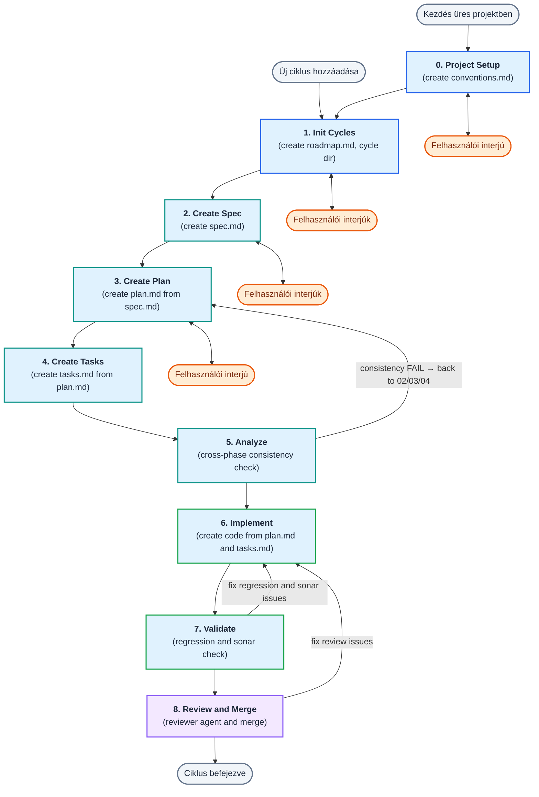

# Prompts

Ez a mappa a spec-driven fejlesztési ciklus **skilljeit** (fázis-receptek) és **ágenseit** (specialista végrehajtók) tartalmazza.

## Mappastruktúra

```
prompts/
├── skills/                       # Fázis-skillek (00–08) — a fő ágens futtatja
│   ├── 00-init-project.md
│   ├── 01-add-cycles.md
│   ├── 02-write-spec.md
│   ├── 03-write-plan.md
│   ├── 04-write-tasks.md
│   ├── 05-analyze.md             # kereszt-fázisos konzisztencia ellenőrzés
│   ├── 06-implement.md
│   ├── 07-validate.md
│   └── 08-review-and-merge.md
├── agents/                       # Specialista ágensek (Task tool subagent-ként hívva)
│   ├── reviewer.md               # code review a 08 fázisban
│   ├── analyzer.md               # kereszt-fázisos elemzés a 05 fázisban
│   └── researcher.md             # forrásfájl- és dokumentáció-kutatás a 03 fázisban
├── templates/                    # jövőbeli sablonok
├── scripts/                      # automatizációs scriptek (ágens-integráció)
├── README.md                     # ez a fájl
├── meta-improve-prompts.md       # prompt-fejlesztési meta-sablon
└── inprove-list.md               # prompt-fejlesztési lista
```

**Skill vs ágens:**
- **Skill** = recept. A `00–08` fázis-promptok statikus módszertanok: leírják a fő ágensnek a HOGYAN-t. Mindig a felhasználó által indított fő ágens futtatja őket.
- **Ágens** = specialista végrehajtó. Az `agents/` alatti fájlok dedikált rendszerpromptok, amelyeket egy skill futás közben **Task tool subagent-ként** indít el (kontextus-őrzés végett).

---

## Folyamatábra

### Magas szintű összefoglalás

Ez a diagram összefoglalja a 00–08 fázisok egymás utáni folyamatát, a kezdőpontokat, az interjú loopokat és a hibajavítási visszacsatolásokat.



### Részletes folyamat

Az alábbi részletes ábra bemutatja az egyes fázisok közötti pontos átmeneteket, a bemeneti/kimeneti fájlokat, a felhasználói interakciós pontokat (User Input), valamint a hibák esetén fellépő visszacsatolási loopokat.

```mermaid
flowchart TD
    %% Styling definitions
    classDef setup fill:#e0f2fe,stroke:#2563eb,stroke-width:2px,color:#1e293b;
    classDef design fill:#e0f2fe,stroke:#0d9488,stroke-width:2px,color:#1e293b;
    classDef dev fill:#e0f2fe,stroke:#16a34a,stroke-width:2px,color:#1e293b;
    classDef decision fill:#fef3c7,stroke:#d97706,stroke-width:2px,color:#1e293b;
    classDef doc fill:#f3e8ff,stroke:#8b5cf6,stroke-width:2px,color:#1e293b;
    classDef userInput fill:#ffedd5,stroke:#ea580c,stroke-width:2px,color:#7c2d12;

    subgraph Setup ["<b>⚙️ PROJEKT SETUP (EGYSZER)</b>"]
        P00["00 — Projekt inicializálás"]:::setup
        P00_Loop{"Vannak még kérdések?"}:::decision
        DocConv["conventions.md"]:::doc
        In00(["User Input: Projekt célok & válaszok"]):::userInput

        P01["01 — Ciklusok kezelése"]:::setup
        P01_Loop{"Vannak még nyitott kérdések?"}:::decision
        DocRoadmap["specs/roadmap.md (Státusz: Kész)"]:::doc
        In01(["User Input: HLD/LLD vagy leírás"]):::userInput
    end

    subgraph Design ["<b>📐 TERVEZÉSI FÁZIS (CIKLUSONKÉNT)</b>"]
        P02["02 — Spec írás"]:::design
        P02_Loop{"Vannak még kérdések? (spec-questions.md)"}:::decision
        DocSpec["specs/cycle-NN-*/spec.md (Státusz: Tervezésre kész)"]:::doc
        In02(["User Input: Ciklus választás & spec válaszok"]):::userInput

        P03["03 — Plan írás"]:::design
        P03_Loop{"Vannak még kérdések? (plan-questions.md)"}:::decision
        DocPlan["specs/cycle-NN-*/plan.md (Státusz: Task írásra kész)"]:::doc
        In03(["User Input: Tervezési válaszok"]):::userInput

        P04["04 — Tasks írás"]:::design
        DocTasks["specs/cycle-NN-*/tasks.md (Státusz: Implementálásra kész)"]:::doc

        P05["05 — Analyze"]:::design
        P05_Check{"Konzisztens? (analyze-report.md)"}:::decision
        DocAnalyze["specs/cycle-NN-*/analyze-report.md (PASS/FAIL)"]:::doc
    end

    subgraph Development ["<b>💻 IMPLEMENTÁCIÓ & ELLENŐRZÉS (ITERATÍV)</b>"]
        P06["06 — Implementálás"]:::dev
        P06_Loop["Kód fejlesztése + tasks.md haladás rögzítése"]:::dev
        DocTasksReady["specs/cycle-NN-*/tasks.md (Státusz: Validálásra kész)"]:::doc
        In06(["User Input: Ciklus implementációs indítása"]):::userInput

        P07["07 — Validálás"]:::dev
        P07_Run{"Tesztek & SonarQube futtatása"}:::decision
        DocReport["specs/cycle-NN-*/test-report/ (validate-decision.md / sonar-report.md / integration / playwright)"]:::doc
        P07_Check{"Sikeres? (PASS)"}:::decision

        P08["08 — Review és Merge"]:::dev
        P08_Review{"Automatikus code review (reviewer subagent)"}:::decision
        DocReview["specs/cycle-NN-*/code-review.md"]:::doc
        P08_Check{"Kritikus hiba (Must Fix)?"}:::decision

        Merge["Merge (lokális squash vagy PR, a conventions.md Merge stratégiája szerint)"]:::setup
        In08(["User Input: Merge megerősítés"]):::userInput
    end

    %% Connections
    Start([Kezdés]) --> P00

    %% User Inputs
    In00 --> P00
    In01 --> P01
    In02 --> P02
    In03 --> P03
    In06 --> P06
    In08 --> Merge

    P00 --> P00_Loop
    P00_Loop -- "Igen" --> P00
    P00_Loop -- "Nem (Lezárva)" --> DocConv
    DocConv --> P01

    P01 --> P01_Loop
    P01_Loop -- "Igen" --> P01
    P01_Loop -- "Nem (Kész)" --> DocRoadmap

    DocRoadmap --> P02
    P02 --> P02_Loop
    P02_Loop -- "Igen" --> P02
    P02_Loop -- "Nem" --> DocSpec

    DocSpec --> P03
    P03 --> P03_Loop
    P03_Loop -- "Igen" --> P03
    P03_Loop -- "Nem" --> DocPlan

    DocPlan --> P04
    P04 --> DocTasks

    DocTasks --> P05
    P05 --> DocAnalyze
    DocAnalyze --> P05_Check

    %% Analyze Fail Loop
    P05_Check -- "FAIL (vissza 02/03/04, státusz-visszafordítás)" --> P03
    P05_Check -- "PASS" --> P06

    P06 --> P06_Loop
    P06_Loop --> DocTasksReady

    DocTasksReady --> P07
    P07 --> P07_Run
    P07_Run --> DocReport
    DocReport --> P07_Check

    %% Validation Fail Loop
    P07_Check -- "FAIL (Nem)" --> FailAction["Hibák rögzítése a tasks.md ## Validációs javítások szekcióba, státusz visszaállítása 'Implementálásra kész'-re"]:::dev
    FailAction --> P06

    %% Validation Pass
    P07_Check -- "PASS (Igen)" --> DocStatusKesz["spec.md, plan.md, tasks.md státusza: Kész"]:::doc
    DocStatusKesz --> P08

    P08 --> P08_Review
    P08_Review --> DocReview
    DocReview --> P08_Check

    %% Review Fail Loop
    P08_Check -- "Igen (Kritikus hiba)" --> ReviewFailAction["Hibák rögzítése a tasks.md ## Review javítások szekcióba, státusz visszaállítása 'Implementálásra kész'-re"]:::dev
    ReviewFailAction --> P06

    %% Review Pass
    P08_Check -- "Nem (Tiszta)" --> Merge
    Merge --> End([Ciklus befejezve])
```



## Használat

Minden skill egy-egy fázist vezérel. Indításhoz add be a fázishoz tartozó **Prompt** blokkot egy új chat session elejére, cseréld ki a `<cycle-name>` és egyéb helyőrzőket, majd küldd el.

Minden fázisban kötelező betartani a **Token Sparing Workflow** elveit: sebészi fájlolvasás, minimális kontextus terhelés, subagentek használata komplex kutatáshoz.

**A bemenet-jelölés egységes:** a copy-paste prompt blokkokban a fájlokat backtick-kel jelöljük (`` `specs/...` ``). Ha az adott ágens támogatja a `@`-fájlhivatkozást (pl. Claude Code), a backtickes utak helyett `@` is használható.

**Két különböző link-szabály — ne keverd:**
- **Chat-válasz végén álló, kattintható link** (amikor az ágens kérdez vagy jóváhagyást kér): ez a fejlesztő kényelmét szolgálja, lehet abszolút `file://` link (pl. `[spec.md](file:///.../spec.md)`).
- **Dokumentumba (spec/plan/tasks/docs) írt fájl-elérési út:** mindig a fájl aktuális könyvtárához képest **relatív** út (pl. `../../apps/legacy-login/README.md`); abszolút út vagy `file://` séma **tilos** a dokumentumok tartalmában.

### A teljes workflow

**Projekt szintű lépések (egyszer):**
- `00` — Projekt inicializálás
- `01` — Ciklusok kezelése

**Per-ciklus loop (ismétlődik minden ciklusra):**
- `02` → `03` → `04` → `05` → `06` → `07` → `08`

### Indító promptok (copy-paste)

```
# 00 — Projekt inicializálás
Kövesd a `prompts/skills/00-init-project.md` utasításait.
Input: <projekt céljának rövid leírása>

# 01 — Ciklusok kezelése (teljes roadmap vagy új ciklus)
Kövesd a `prompts/skills/01-add-cycles.md` utasításait.
Input: <HLD/LLD elérési út vagy rövid leírás — új ciklusnál elhagyható>

# 02 — Spec írás
Kövesd a `prompts/skills/02-write-spec.md` utasításait.
Input: `specs/roadmap.md` (ciklus kontextus), ciklus: cycle-NN-<cycle-name>

# 03 — Plan írás
Kövesd a `prompts/skills/03-write-plan.md` utasításait.
Input: `specs/cycle-NN-<cycle-name>/spec.md`

# 04 — Tasks írás
Kövesd a `prompts/skills/04-write-tasks.md` utasításait.
Input: `specs/cycle-NN-<cycle-name>/plan.md`

# 05 — Analyze
Kövesd a `prompts/skills/05-analyze.md` utasításait.
Input: `specs/cycle-NN-<cycle-name>`

# 06 — Implementálás
Kövesd a `prompts/skills/06-implement.md` utasításait.
Input: `specs/cycle-NN-<cycle-name>/tasks.md`

# 07 — Validálás
Kövesd a `prompts/skills/07-validate.md` utasításait.
Input: `specs/cycle-NN-<cycle-name>`

# 08 — Review és Merge
Kövesd a `prompts/skills/08-review-and-merge.md` utasításait.
Input: `specs/cycle-NN-<cycle-name>`
```

---

## Skill-index

| Skill | Fázis | Bemenet | Kimenet (záró státusz) |
|---|---|---|---|
| `skills/00-init-project.md` | Projekt init | Projekt leírás | `conventions.md` |
| `skills/01-add-cycles.md` | Ciklusok kezelése | HLD/LLD vagy leírás | `specs/roadmap.md` (`Kész`) |
| `skills/02-write-spec.md` | Spec | Roadmap + ciklus neve | `spec.md` (`Tervezésre kész`) |
| `skills/03-write-plan.md` | Plan | `spec.md` | `plan.md` (`Task írásra kész`) |
| `skills/04-write-tasks.md` | Tasks | `plan.md` | `tasks.md` (`Implementálásra kész`) |
| `skills/05-analyze.md` | Analyze | ciklus mappa | `analyze-report.md` (PASS/FAIL) |
| `skills/06-implement.md` | Implementálás | `tasks.md` | kód + `tasks.md` (`Validálásra kész`) |
| `skills/07-validate.md` | Validálás | ciklus mappa | PASS/FAIL + `test-report/`; PASS → státuszok `Kész` |
| `skills/08-review-and-merge.md` | Review & Merge | cycle branch, `plan.md`, `spec.md` | `code-review.md` + merged branch |

Minden skill **frontmattere** rögzíti az előfeltételeket, a kimenetet, a szomszédos fázisokat (`prev`/`next`) és a hívott subagenteket.

## Agent-index

| Ágens | Hívja | Mit csinál | Kimenet |
|---|---|---|---|
| `agents/reviewer.md` | 08 | Git diff code review a merge előtt | `code-review.md` (Must Fix + Suggestions) |
| `agents/analyzer.md` | 05 | Kereszt-fázisos konzisztencia elemzés (5 kategória) | megállapítás-lista → `analyze-report.md` |
| `agents/researcher.md` | 03 | Forrásfájl-azonosítás + dokumentáció-kutatás | path-listák összefoglalóval |

---

## Frontmatter séma

**Skill (`skills/*.md`):**

```yaml
---
phase: 02
name: write-spec
prerequisites:
  - "specs/roadmap.md státusz: Kész"
output:
  - "specs/cycle-NN-<name>/spec.md státusz: Tervezésre kész"
prev: 01-add-cycles
next: 03-write-plan
subagents: []        # Task tool-on hívott specialisták (agents/ alatti fájlok)
---
```

**Ágens (`agents/*.md`):**

```yaml
---
name: reviewer
role: "Kód-review specialista ágens"
called_by: ["skills/08-review-and-merge.md"]
inputs: [...]
outputs: [...]
tools: ["Read", "Bash", "Grep"]
---
```

A frontmatter **eszközfüggetlen** (saját séma, nem egy konkrét ágens-eszközhöz kötött). Ha később natív skill-integrációra megyünk (pl. Claude Code), a konvertálás mechanikus.

---

## conventions.md — Projekt konvenciók

**Fájl:** `conventions.md` (projekt gyökér)

**Mikor jön létre:** A `skills/00-init-project.md` skill hozza létre egyszer, új projekt indulásakor.

**Szerepe:** A projekt központi konvenciós dokumentuma — egy helyen rögzíti a projekt-specifikus technikai megállapodásokat, így az ágensnek nem kell ad-hoc döntéseket hoznia. Minden fázis-skill (01–08) hivatkozik rá és beolvassa. **Puszta léte a „kész" jelölés:** ha létezik, a 01–08 csak létezés-ellenőrzést végez (nincs külön státuszmező).

**Mit tartalmaz:**
- **Tech stack & környezet:** projekt áttekintés, nyelvek, runtime-ok, portok.
- **Projekt referenciák:** HLD, LLD, OpenAPI leírók, adatbázis sémák elérési útjai.
- **Tesztelési konvenciók:** tesztszintek és a hozzájuk **ajánlott default** keretrendszerek (a fejlesztő a 00-ban megerősíti vagy felülírja), futtatási parancsok.
- **Merge stratégia:** szolgáltató (GitHub / Bitbucket / GitLab / Lokális), PR target branch, merge típus, access teszt parancs.
- **Sonar minőségellenőrzés:** szerver-indítási és scanner parancsok, Quality Gate elvárások.
- **Kódszervezési szabályok:** struktúra, naming, git branch/commit konvenciók.
- **Kockázatok és korlátok.**

---

## Egy ciklus artifact fájljai

Minden ciklus saját mappát kap: `specs/cycle-NN-<cycle-name>/`

| Fájl | Fázis | Tartalom |
|------|-------|----------|
| `spec.md` | 02 | Üzleti viselkedés, követelmények, érintett területek, mock stratégia, Definition of Done. |
| `spec-questions.md` | 02 | A specifikációval kapcsolatos nyitott kérdések. A spec csak akkor `Tervezésre kész`, ha itt nincs `- [ ]`. |
| `plan.md` | 03 | Technikai végrehajtási terv, érintett komponensek, tervezett módosítások, teszt/ellenőrzési stratégia. |
| `plan-questions.md` | 03 | A tervezési szakasz nyitott kérdései. A plan csak akkor `Task írásra kész`, ha itt nincs `- [ ]`. |
| `tasks.md` | 04 | Checkboxos task lista (`[RED]`/`[GREEN]`/`[CHECK]` jelölésekkel) + prerequisite dokumentumok. |
| `analyze-report.md` | 05 | Kereszt-fázisos konzisztencia jelentés (PASS/FAIL), 5 kategória, lefedettségi mátrix, FAIL→visszalépés. |
| `imp-decision.md` | 06 | Implementációs döntési napló: nem egyértelmű megoldások és a 3-próba szabály utáni leállások. |
| `test-report/validate-decision.md` | 07 | Validációs futástörténet, regressziós/Sonar hibák, consecutive failures számlálók. |
| `test-report/sonar-report.md` | 07 | SonarQube Quality Gate részletes eredmény (MD + HTML). |
| `code-review.md` | 08 | A `reviewer` ágens code review jelentése (Must Fix + Suggestions). |

---

## Kérdéskezelés (spec-questions.md / plan-questions.md)

A spec (02) és plan (03) fázisban az ágens nyitott kérdéseit külön fájlban tartja nyilván.

**Struktúra:**
```md
# Cycle NN: <cím> — Spec/Plan kérdések

- [ ] K01 — [kérdés szövege]
- [x] K02 — [kérdés szövege] → [döntés / válasz röviden]
- [ ] K03 — [kérdés szövege] _(K02-ből merült fel)_
```

**Szabályok:**
- Egyszerre **egy** kérdés kerül a felhasználó elé — az ágens megvárja a választ.
- A listából **soha nem törlünk** — lezárt kérdést `[x]`-szel jelölünk, a döntés megmarad.
- Új kérdés a lista végére kerül a következő `Knn` számmal.
- A fázis csak akkor zárható le, ha minden kérdés `[x]` és a felhasználó explicit megerősítette.

**Státuszátmenetek:**

| Állapot | Feltétel |
|---------|----------|
| `Piszkozat` | Fázis indításakor |
| `Nyitott kérdések vannak` | Van legalább egy `[ ]` kérdés |
| `Tervezésre kész` / `Task írásra kész` | Minden `[x]` + minőségellenőrzés átment + felhasználó megerősítette |

---

## Egységes `Kész` státusz-lifecycle

Minden dokumentum a saját fázis-specifikus záró-státuszát kapja a keletkezésekor (`spec.md` → `Tervezésre kész`, `plan.md` → `Task írásra kész`, `tasks.md` → `Implementálásra kész`), majd **`Kész`-re lép, amint a validate (07) PASS lezárja a ciklust**. Így a 08 fázis a `spec.md`/`plan.md`/`tasks.md`-t már egységesen `Kész` státuszban várja.

---

## Sonar minőségellenőrzés

A validate fázis (07) — ha a `conventions.md` tartalmaz `## Sonar minőségellenőrzés` szekciót — Podman-alapú SonarQube analízist futtat.

**Folyamat:**
1. SonarQube szerver indítása (ha még nem fut).
2. Scanner és riportgenerálás a `conventions.md`-ben megadott módon (a projekt teszt-tooling scriptjével).
3. A riportok a ciklusmappa `test-report/` almappájába kerülnek; a Quality Gate FAIL non-zero státusszal áll meg.
4. **Severe Issues** (`BLOCKER`, `CRITICAL`, `MAJOR`): kötelezően javítandók. **Minor & Info** (`MINOR`, `INFO`): csak tájékoztató.
5. **PASS:** a validálás folytatódik. **FAIL:** a hibák a `validate-decision.md`-be kerülnek, a `tasks.md` státusza visszaáll, és a folyamat visszalép a `06-implement` fázisba.

**Módosítások detektálása (SCM & Git Blame):** a SonarQube a `.git` SCM és Git Blame adatokat használja, és a `master` ághoz képest (git diff) választja külön az **új hibákat (New Issues)** az örökölt hibáktól. A Quality Gate csak az újonnan módosított sorokra vonatkozik.

---

## Döntési napló (imp-decision.md)

Az `imp-decision.md` az implement fázis (06) nehéz döntéseinek és zsákutcáinak naplója (`specs/cycle-NN-<cycle-name>/imp-decision.md`). Ha egy task megoldásához legalább 3 sikertelen kísérlet kellett:

```md
## T0XX — <rövid cím>

**Mi volt a gond:** <hiba tömör leírása>
**Mit próbáltunk:** <sikertelen kísérletek röviden>
**Mi lett a megoldás:** <a végül működő megközelítés>
```

---

## Validációs napló (validate-decision.md)

A `test-report/validate-decision.md` a validate fázis (07) futásait, SonarQube eredményeit és teszthibáit követi. Az ágens számolja az egymást követő bukásokat elemenként:

```md
# Validation History

- **Run 1 (2025-01-15 10:30) - FAIL**
  - **Failed Item:** TokenExchangeService › should return 403 for invalid token
  - **Consecutive Failures for this item:** 1
  - **Details:** NullPointerException a JWE dekódoláskor

- **Run 3 (2025-01-15 14:20) - PASS**
```

**3-próba szabály:** ha bármelyik teszt vagy a Sonar Quality Gate `Consecutive Failures for this item` értéke eléri a **3**-at, az ágens leáll és humán beavatkozást kér.

---

## Reviewer agent (agents/reviewer.md)

**Mikor hívja meg:** A 08 — Review & Merge fázis automatikusan, a merge előtt.

**Mit csinál:** Task tool subagent-ként átnézi a cycle branch változásait (git diff vs `master`), és strukturált, **gépiesen parszolható** jelentést készít:
- **Kritikus javítandók (Must Fix)** — blokkolók, merge előtt javítandók; `- [ ] <file>:<line> — <leírás>` formátumban.
- **Javasolt fejlesztések (Suggestions)** — nem blokkolók.

**Output:** `specs/cycle-NN-<cycle-name>/code-review.md`

**Visszacsatolási kör:**
- Must Fix → vissza a `06-implement` fázisba, javítás után új review.
- Suggestion → nem blokkol; a 08-as ágens csak akkor javítja direktben, ha a scope-on belül marad.
- Nincs Must Fix → merge.

---

## Ágens-specifikus integráció

A `prompts/skills/` és `prompts/agents/` a **single source of truth**. A különböző ágensek más-más helyen keresik a skilleket / subagenteket:

| Ágens | Skill-hely | Subagent-hely |
|---|---|---|
| Claude Code | `~/.claude/commands/` vagy `.claude/commands/` | `~/.claude/agents/` vagy `.claude/agents/` |
| Cursor | `.cursor/rules/` vagy `.cursor/commands/` | — |
| Antigravity | nincs natív skill-konvenció (manuális másolás) | — |
| Codex CLI | nincs standard skill-rendszer (manuális másolás) | — |

A `prompts/scripts/init-project.sh` (későbbi implementáció) symlinkekkel köti be ezeket a helyeket a `prompts/skills/` és `prompts/agents/` mappákhoz. Addig a fázisok manuális prompt-bemásolással indíthatók.

### Antigravity CLI (Google DeepMind)

Ha az **Antigravity** ágenst használod a fejlesztési ciklusok futtatására:

#### 1. Tervezési és naplózási folyamat (Planning Mode)
Az ágens a saját belső alkalmazásmappájában (`~/.gemini/antigravity-cli/brain/`) naplóz, így ezek a fájlok nem szennyezik a projekt Git repository-ját:
* **Tervezési szakasz:** `implementation_plan.md` tervfájl, jóváhagyásra várva.
* **Végrehajtási szakasz:** `task.md` teendőlista.
* **Validációs szakasz:** `walkthrough.md` összegzés.

#### 2. Jogosultságok kezelése (Permissions)
* **Fájlmódosítások:** a Trusted Workspace-en belül engedélyezett.
* **Külső parancsok:** futtatás előtt manuális megerősítést igényelnek (`Ask` mód).
* **Delegálás:** `/permissions` vagy `/config` (Allow), `--dangerously-skip-permissions` (session), vagy `~/.gemini/antigravity-cli/settings.json` (globális).
