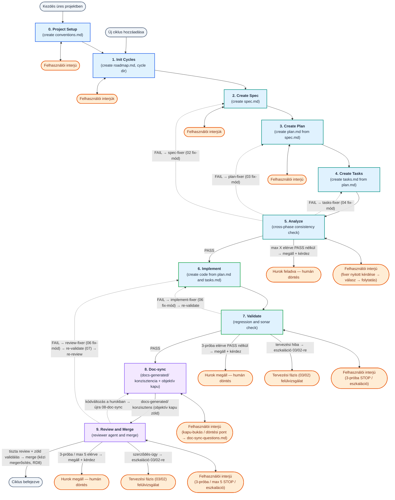
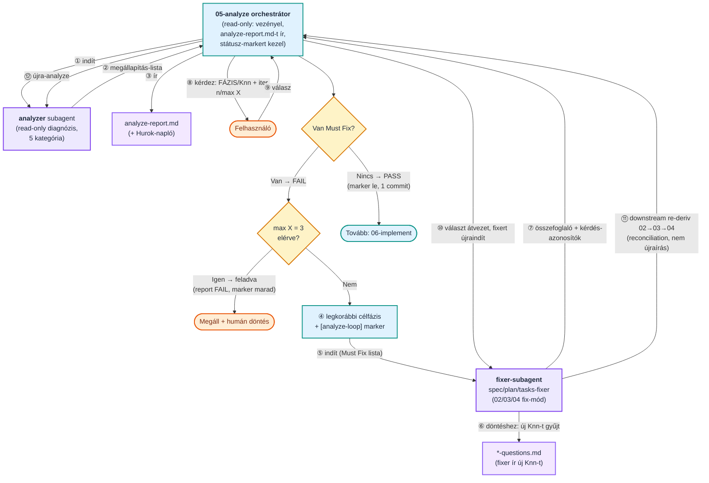
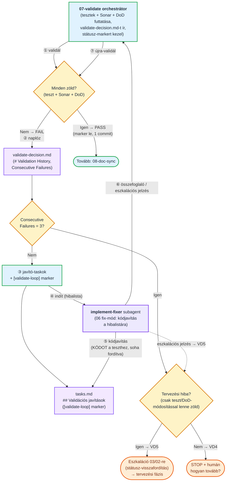
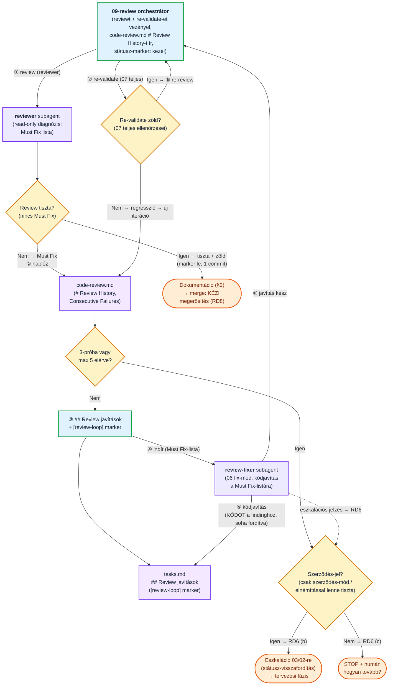

# Prompts

Ez a mappa a spec-driven fejlesztési ciklus **skilljeit** (fázis-receptek) és **ágenseit** (specialista végrehajtók) tartalmazza.

## Két fejlesztési út — válassz a feladat mérete szerint

A felhasználónak **két útja** van; a feladat súlya dönti el, melyik a megfelelő:

1. **Teljes berki spec flow (00–09 fázis)** — a nagyobb, összetettebb fejlesztésekhez. Külön `spec.md` → `plan.md` → `tasks.md` dokumentumok, kereszt-fázisos `analyze`, `validate`, `doc-sync` és `review` minőségi kapukkal és önjavító hurkokkal. Üres projektnél a `00-init-project`, új ciklusnál a `01-add-cycles` skillel indul. Ezt írja le a README többi része.

2. **Egyszerűsített (lightweight) flow** — kis, jól körülhatárolt feladatokhoz, amelyek 3-4 lépésben megoldhatók (pl. **konfiguráció összeállítása**, **egyszerűbb script megírása**, kisebb javítás). Egyetlen háromfázisú recept: `spec.md` → `task.md` → implementáció, a [`skills/sdd-lightweight-flow.md`](skills/sdd-lightweight-flow.md) skillben. Nincs külön plan/analyze/validate/doc-sync fázis; az opcionális ágenseket (`researcher`, `analyzer`, `reviewer`) csak akkor hívja, ha tényleg segítenek.

**Hogyan dönts?**

| Jellemző | Egyszerűsített flow | Teljes berki spec flow |
|---|---|---|
| Tipikus feladat | konfiguráció, egyszerű script, kisebb javítás | új funkció, több komponens, összetett logika |
| Méret | 3-4 lépésben megoldható | önálló, vertikálisan vágható ciklus(ok) |
| Dokumentumok | `spec.md` + `task.md` | `spec.md` + `plan.md` + `tasks.md` |
| Minőségi kapuk | inline + opcionális ágensek | `analyze` / `validate` / `doc-sync` / `review` hurkok |
| Belépő | `skills/sdd-lightweight-flow.md` | `00-init-project` / `01-add-cycles` |

**Alapértelmezett flow:** a projekt jellegét a `00-init-project` fázisban tisztázzuk (termékfejlesztés vs. konfiguráció/scriptelés), és ez alapján egy **default flow** kerül a `conventions.md` `## Fejlesztési módszertan` szekciójának **Alapértelmezett flow** mezőjébe. Ez a kiindulópont — feladatonként felülbírálható.

A két út **átjárható**: ha az egyszerűsített flow közben kiderül, hogy a feladat túlnő rajta (nagyobb kódírás, több komponens, összetett tervezés), a skill megállítja a munkát és **átirányít a teljes folyamatra** (`01-add-cycles`). Fordítva is: a `01-add-cycles` és a `03-write-plan` jelzi, ha a feladat túl egyszerű a teljes ciklushoz, és javasolja az egyszerűsített flow-t.

## Mappastruktúra

```
prompts/
├── skills/                       # Fázis-skillek (00–09) — a fő ágens futtatja
│   ├── 00-init-project.md
│   ├── 01-add-cycles.md
│   ├── 02-write-spec.md
│   ├── 03-write-plan.md
│   ├── 04-write-tasks.md
│   ├── 05-analyze.md             # kereszt-fázisos konzisztencia ellenőrzés
│   ├── 06-implement.md
│   ├── 07-validate.md
│   ├── 08-doc-sync.md            # élő dokumentáció-szinkron (docs-generated/)
│   ├── 09-review-and-merge.md
│   └── sdd-lightweight-flow.md   # egyszerűsített, háromfázisú flow kis feladatokhoz (spec→task→implement)
├── agents/                       # Specialista ágensek (Task tool subagent-ként hívva)
│   ├── reviewer.md               # code review a 09 fázisban
│   ├── analyzer.md               # kereszt-fázisos elemzés (read-only diagnózis) a 05 fázisban
│   ├── researcher.md             # forrásfájl- és dokumentáció-kutatás a 03 fázisban
│   ├── doc-sync-planner.md       # 08 doc-sync: read-only tervkészítő diagnoszta (doc-sync-plan.md)
│   ├── spec-fixer.md             # 05 önjavító hurok: 02 fix-mód belépő (vékony wrapper)
│   ├── plan-fixer.md             # 05 önjavító hurok: 03 fix-mód belépő (vékony wrapper)
│   ├── tasks-fixer.md            # 05 önjavító hurok: 04 fix-mód belépő (vékony wrapper)
│   ├── implement-fixer.md        # 07 önjavító hurok: 06 fix-mód belépő (vékony wrapper)
│   └── review-fixer.md           # 09 önjavító hurok: 06 fix-mód belépő (vékony wrapper)
├── templates/                    # jövőbeli sablonok
├── scripts/                      # automatizációs scriptek (ágens-integráció)
├── README.md                     # ez a fájl
├── meta-improve-prompts.md       # prompt-fejlesztési meta-sablon
└── inprove-list.md               # prompt-fejlesztési lista
```

> A `docs-generated/` mappa (a projekt gyökerében, nem a `prompts/` alatt) a `08-doc-sync` fázis által karbantartott **élő, generált dokumentáció** otthona: `system-overview.md` (as-built működésleírás), `architecture.md`, `CHANGELOG.md`, `design-drift.md` és a mappa-index `README.md`. Részletes leírás lent, a „docs-generated/ — élő dokumentáció" szekcióban.

**Skill vs ágens:**
- **Skill** = recept. A `00–09` fázis-promptok statikus módszertanok: leírják a fő ágensnek a HOGYAN-t. Mindig a felhasználó által indított fő ágens futtatja őket.
- **Ágens** = specialista végrehajtó. Az `agents/` alatti fájlok dedikált rendszerpromptok, amelyeket egy skill futás közben **Task tool subagent-ként** indít el (kontextus-őrzés végett).

---

## Folyamatábra

### Magas szintű összefoglalás

Ez a diagram összefoglalja a 00–09 fázisok egymás utáni folyamatát, a kezdőpontokat, az interjú loopokat és a hibajavítási visszacsatolásokat.



### Részletes folyamat

Az alábbi részletes ábra bemutatja az egyes fázisok közötti pontos átmeneteket, a bemeneti/kimeneti fájlokat, a felhasználói interakciós pontokat (User Input), valamint a hibák esetén fellépő visszacsatolási loopokat.

```mermaid
flowchart TD
    %% Styling definitions
    classDef setup fill:#e0f2fe,stroke:#2563eb,stroke-width:2px,color:#1e293b;
    classDef design fill:#e0f2fe,stroke:#0d9488,stroke-width:2px,color:#1e293b;
    classDef dev fill:#e0f2fe,stroke:#16a34a,stroke-width:2px,color:#1e293b;
    classDef decision fill:#fef3c7,stroke:#d97706,stroke-width:2px,color:#1e293b;
    classDef doc fill:#f3e8ff,stroke:#8b5cf6,stroke-width:2px,color:#1e293b;
    classDef userInput fill:#ffedd5,stroke:#ea580c,stroke-width:2px,color:#7c2d12;

    subgraph Setup ["<b>⚙️ PROJEKT SETUP (EGYSZER)</b>"]
        P00["00 — Projekt inicializálás"]:::setup
        P00_Loop{"Vannak még kérdések?"}:::decision
        DocConv["conventions.md"]:::doc
        In00(["User Input: Projekt célok & válaszok"]):::userInput

        P01["01 — Ciklusok kezelése"]:::setup
        P01_Loop{"Vannak még nyitott kérdések?"}:::decision
        DocRoadmap["specs/roadmap.md (Státusz: Kész)"]:::doc
        In01(["User Input: HLD/LLD vagy leírás"]):::userInput
    end

    subgraph Design ["<b>📐 TERVEZÉSI FÁZIS (CIKLUSONKÉNT)</b>"]
        P02["02 — Spec írás"]:::design
        P02_Loop{"Vannak még kérdések? (spec-questions.md)"}:::decision
        DocSpec["specs/cycle-NN-*/spec.md (Státusz: Tervezésre kész)"]:::doc
        In02(["User Input: Ciklus választás & spec válaszok"]):::userInput

        P03["03 — Plan írás"]:::design
        P03_Loop{"Vannak még kérdések? (plan-questions.md)"}:::decision
        DocPlan["specs/cycle-NN-*/plan.md (Státusz: Task írásra kész)"]:::doc
        In03(["User Input: Tervezési válaszok"]):::userInput

        P04["04 — Tasks írás"]:::design
        DocTasks["specs/cycle-NN-*/tasks.md (Státusz: Implementálásra kész)"]:::doc

        P05["05 — Analyze"]:::design
        P05_Check{"Konzisztens? (analyze-report.md)"}:::decision
        DocAnalyze["specs/cycle-NN-*/analyze-report.md (PASS/FAIL)"]:::doc
    end

    subgraph Development ["<b>💻 IMPLEMENTÁCIÓ & ELLENŐRZÉS (ITERATÍV)</b>"]
        P06["06 — Implementálás"]:::dev
        P06_Loop["Kód fejlesztése + tasks.md haladás rögzítése"]:::dev
        DocTasksReady["specs/cycle-NN-*/tasks.md (Státusz: Validálásra kész)"]:::doc
        In06(["User Input: Ciklus implementációs indítása"]):::userInput

        P07["07 — Validálás"]:::dev
        P07_Run{"Tesztek & SonarQube futtatása"}:::decision
        DocReport["specs/cycle-NN-*/test-report/ (validate-decision.md / sonar-report.md / integration / playwright)"]:::doc
        P07_Check{"Sikeres? (PASS)"}:::decision

        P08["08 — Doc-sync"]:::dev
        P08_Plan["doc-sync-planner subagent<br/>→ doc-sync-plan.md (per-fájl terv)"]:::doc
        DocGen["docs-generated/ (system-overview, architecture, CHANGELOG, design-drift, README)"]:::doc
        P08_Gate{"Objektív konzisztencia-kapu zöld? (DS22)"}:::decision

        P09["09 — Review és Merge"]:::dev
        P09_Review{"Automatikus code review (reviewer subagent)"}:::decision
        DocReview["specs/cycle-NN-*/code-review.md"]:::doc
        P09_Check{"Kritikus hiba (Must Fix)?"}:::decision

        Merge["Merge (lokális squash vagy PR, a conventions.md Merge stratégiája szerint)"]:::setup
        In08(["User Input: Merge megerősítés"]):::userInput
    end

    %% Connections
    Start([Kezdés]) --> P00

    %% User Inputs
    In00 --> P00
    In01 --> P01
    In02 --> P02
    In03 --> P03
    In06 --> P06
    In08 --> Merge

    P00 --> P00_Loop
    P00_Loop -- "Igen" --> P00
    P00_Loop -- "Nem (Lezárva)" --> DocConv
    DocConv --> P01

    P01 --> P01_Loop
    P01_Loop -- "Igen" --> P01
    P01_Loop -- "Nem (Kész)" --> DocRoadmap

    DocRoadmap --> P02
    P02 --> P02_Loop
    P02_Loop -- "Igen" --> P02
    P02_Loop -- "Nem" --> DocSpec

    DocSpec --> P03
    P03 --> P03_Loop
    P03_Loop -- "Igen" --> P03
    P03_Loop -- "Nem" --> DocPlan

    DocPlan --> P04
    P04 --> DocTasks

    DocTasks --> P05
    P05 --> DocAnalyze
    DocAnalyze --> P05_Check

    %% Analyze önjavító hurok (05)
    P05_Check -- "FAIL" --> P05_Fixer["fixer-subagent<br/>(02/03/04 fix-mód, [analyze-loop])"]:::design
    P05_Fixer -- "fixer nyitott kérdést gyűjt<br/>(*-questions.md)" --> P05_Q(["User Input: FÁZIS/Knn válasz<br/>(orchestrátor kérdezi)"]):::userInput
    P05_Q --> P05_Fixer
    P05_Fixer -- "downstream re-deriválás<br/>02→03→04 (reconciliation)" --> P05
    P05_Check -- "max X=3 elérve PASS nélkül" --> P05_Stop["Hurok feladva → analyze-report FAIL<br/>(marker marad) + humán döntés"]:::doc
    P05_Check -- "PASS (marker le, 1 commit)" --> P06

    P06 --> P06_Loop
    P06_Loop --> DocTasksReady

    DocTasksReady --> P07
    P07 --> P07_Run
    P07_Run --> DocReport
    DocReport --> P07_Check

    %% Validate önjavító hurok (07)
    P07_Check -- "FAIL (Nem)" --> P07_Fixer["implement-fixer subagent<br/>(06 fix-mód, [validate-loop])<br/>## Validációs javítások"]:::dev
    P07_Fixer -- "javítás kész → re-validate" --> P07
    P07_Fixer -. "eszkalációs jelzés (VD5)" .-> P07_Esc
    P07_Check -- "3-próba elérve (Consecutive=3)<br/>megrekedt kód-bug" --> P07_Stop["Hurok megáll → STOP + humán<br/>([validate-loop] marker + ## Validációs javítások marad)"]:::doc
    P07_Check -- "tervezési hiba (VD5):<br/>csak teszt/DoD-módosítással lenne zöld" --> P07_Esc["Eszkaláció: státusz-visszafordítás<br/>03/02-re → tervezési fázis"]:::doc
    P07_Esc --> P03

    %% Validation Pass
    P07_Check -- "PASS (Igen)" --> DocStatusKesz["spec.md, plan.md, tasks.md státusza: Kész"]:::doc
    DocStatusKesz --> P08

    %% Doc-sync (08): terv → mechanikus végrehajtás → objektív kapu (NEM önjavító subagent-hurok)
    P08 --> P08_Plan
    P08_Plan --> DocGen
    DocGen --> P08_Gate
    P08_Gate -. "kapu-bukás / döntési pont → doc-sync-questions.md<br/>(ember-vezérelt javítás, DS10)" .-> P08DS_Q(["User Input: doc-sync kérdés / javítás"]):::userInput
    P08DS_Q --> P08_Plan
    P08_Gate -- "kapu zöld → docs-generated/ konzisztens" --> P09

    P09 --> P09_Review
    P09_Review --> DocReview
    DocReview --> P09_Check

    %% Review önjavító hurok (09) — kétfázisú: fix → re-validate → re-review
    P09_Check -- "Igen (Must Fix)" --> P09_Fixer["review-fixer subagent<br/>(06 fix-mód, [review-loop])<br/>## Review javítások"]:::dev
    P09_Fixer -- "javítás kész → re-validate (07 teljes ellenőrzései)" --> P07_Run2["07 Validálási lépések<br/>(nem indítja a 07 saját hurkát)"]:::dev
    P07_Run2 -- "zöld → re-review" --> P09_Review
    P07_Run2 -. "regresszió → új iteráció" .-> P09_Fixer
    P09_Fixer -. "eszkalációs jelzés (RD6)" .-> P09_Esc
    P09_Check -- "3-próba / max 5 → megrekedt" --> P09_Stop["Hurok megáll → STOP + humán<br/>([review-loop] marker + ## Review javítások marad)"]:::doc
    P09_Check -- "szerződés-ügy (RD6):<br/>csak szerződés-módosítással/elnémítással lenne tiszta" --> P09_Esc["Eszkaláció: státusz-visszafordítás<br/>03/02-re → tervezési fázis"]:::doc
    P09_Esc --> P03

    %% Review Pass — kódváltozás esetén a merge előtt újra 08-doc-sync (DS23.2)
    P09_Check -- "Nem (Tiszta) + zöld validálás" --> P09_DocCheck{"Változott kód a hurokban?"}:::decision
    P09_DocCheck -. "Igen → merge előtt újra-doc-sync" .-> P08
    P09_DocCheck -- "Nem → merge" --> Merge["Merge (kézi megerősítés, RD8)"]
    Merge --> End([Ciklus befejezve])
```



### Az 05-analyze önjavító hurok (részletes)

Ez az ábra **kizárólag az 05-analyze lépést** mutatja be, a subagentek és a kérdés-folyam feltüntetésével. Az orchestrátor (05-analyze) read-only: a **diagnózist** az `analyzer`, a **javítást** a fixer-subagentek (02/03/04 fix-mód) végzik; a felhasználót mindig az **orchestrátor** kérdezi, fázis-jelzéssel.



**A működés prózában:**

1. **A subagent gyűjti a kérdést, nem kérdez.** A fixer-subagent (02/03/04 fix-mód) a döntést igénylő pontokat **nem teszi fel közvetlenül a felhasználónak** — nincs interaktív csatornája. Ehelyett új `Knn` bejegyzésként felveszi a megfelelő `*-questions.md`-be (`spec-questions.md` / `plan-questions.md` / `tasks-questions.md`).
2. **És visszaadja az orchestrátornak.** A fixer a futása végén tömör összefoglalót ad: mit javított, és milyen új `Knn` kérdés-azonosítókat vett fel. (Az ábrán: ⑥ gyűjt, ⑦ visszaad.)
3. **Az orchestrátor teszi fel a kérdést a felhasználónak**, mindig jelezve, melyik fázishoz kapcsolódik: **fázis-fejléc + `FÁZIS/Knn` prefix** (pl. `[PLAN · iter 2/3 · PLAN/K05]`). Egyszerre egy kérdés, a válasz végén kattintható link az érintett `*-questions.md`-re.
4. **A válasz átvezetése után a hurok folytatódik:** az orchestrátor beírja a döntést a `*-questions.md`-be (`[x]` + összefoglaló), újraindítja a fixert, majd a downstream re-deriválás (`02→03→04`) és az újra-analyze következik. A kérdés-megállás **nem** számít új iterációnak, és nem fogyaszt a `max X`-ből.

A hurok két, egymástól független módon áll le: **PASS** (nincs több `Must Fix` → marker le, egyetlen commit, tovább a 06-ra), vagy **`max X = 3` elérve PASS nélkül** (a report `FAIL`, a `[analyze-loop]` marker az érintett dokumentumokon marad, az orchestrátor összefoglal és humán döntést kér).

### Az 07-validate önjavító hurok (részletes)

Ez az ábra **kizárólag az 07-validate lépést** mutatja be, a subagent feltüntetésével (a fenti analyze-ábra párja). Az orchestrátor (07) PASS-ig **determinisztikus ellenőrző** (tesztek + Sonar + DoD), FAIL esetén **orchestrátor**: a **javítást** az `implement-fixer` subagent (= a 06 fix-módja) végzi, a re-validálást és a döntéseket az orchestrátor.



**A működés prózában:**

1. **Az orchestrátor (07) futtatja a determinisztikus ellenőrzéseket** (tesztek + Sonar + DoD). PASS → **automatikus** (VD7, nincs megerősítés): a `[validate-loop]` marker lekerül, egyetlen lezáró commit, tovább a 08-ra.
2. **FAIL esetén naplóz** a `# Validation History`-ba (itemenkénti `Consecutive Failures`), majd a **3-próba korlát (VD4)** és a **tervezési-hiba heurisztika (VD5)** szerint dönt — nincs külön globális számláló, a beragadt elemet a per-item 3-próba fogja meg.
3. **Ha folytatható:** felveszi a javító-taskokat (`## Validációs javítások`), `[validate-loop]` markert tesz a `tasks.md`-re, és elindítja az `implement-fixer` subagentet (= 06 fix-mód) a konkrét hibalistával.
4. **A fixer a KÓDOT igazítja a teszthez/DoD-hoz (VD3 anti-„teszt-csalás") — SOHA fordítva.** Tilos a teszt gyengítése/skip/törlése, hardcode, DoD-leszállítás. A fixer visszaad: javítás-összefoglaló + (ha van) **eszkalációs jelzés**.
5. **Az orchestrátor újra-validál.** Zöld → PASS (1. pont). FAIL → új iteráció (2. ponttól).
6. **Két megállás a 3-próbánál (a hurok user-érintkezése, VD7):** megrekedt **kód-bug** → STOP + humán (VD4, „hogyan tovább?"); **tervezési hiba** → eszkaláció 03/02-re (VD5, státusz-visszafordítással), átadva a tervezési huroknak — a 06-ban körözés helyett. A fixer eszkalációs jelzése a 3. próba bevárása nélkül is kiválthatja az eszkalációt.

### Az 09-review önjavító hurok (részletes)

Ez az ábra **kizárólag az 09-review lépést** mutatja be, a subagentek feltüntetésével (az analyze- és validate-ábra párja). Az orchestrátor (09) a **diagnózist** a `reviewer` (read-only) subagenttel adatja, a **javítást** a `review-fixer` (= 06 fix-mód) végzi; a hurok **kétfázisú** (re-validate → re-review), és a merge-et **kézi megerősítés** zárja (RD8).



**A működés prózában:**

1. **Az orchestrátor (09) lefuttatja a `reviewer` subagentet** (read-only diagnózis) → `code-review.md`. Ha nincs `Must Fix` **és** a (re-)validálás zöld → a `[review-loop]` marker lekerül, egyetlen lezáró commit, tovább a merge előtti doc-sync ellenőrzésre (§2) és a **kézi megerősítésű** merge-re (RD8).
2. **`Must Fix` esetén naplóz** a `# Review History`-ba (itemenkénti `Consecutive Failures`), majd a **per-item 3-próba** és a **`max 5` globális backstop** szerint dönt.
3. **Ha folytatható:** felveszi a javító-taskokat (`## Review javítások`), `[review-loop]` markert tesz a `tasks.md`-re, és elindítja a `review-fixer` subagentet (= 06 fix-mód) a konkrét `Must Fix`-listával.
4. **A fixer a KÓDOT igazítja a findinghoz és a tesztekhez (RD4 anti-„csalás") — SOHA fordítva.** Tilos a finding kozmetikai elnémítása, teszt-csalás, a `code-review.md` finding törlése. A fixer visszaad: javítás-összefoglaló + (ha van) **eszkalációs jelzés**.
5. **Kétfázisú továbblépés (RD2):** az orchestrátor előbb **re-validál** (a 07 teljes ellenőrzései — regresszió-fogás; nem indítja a 07 saját hurkát). Zöld → **re-review** (vissza az 1. ponthoz a friss diffen). Regresszió → új iteráció (2. ponttól, a regresszált teszt a megrekedt item).
6. **Megállás (a hurok user-érintkezése):** **szerződés-ügy** (a fixer jelzése, vagy a 3-próba kimerül és csak a szerződés módosításával/elnémítással lenne tiszta) → eszkaláció 03/02-re (RD6 b); egyébként **3-próba / `max 5` kimerült** → STOP + humán (RD6 c). A merge **soha nem automatikus** (RD8).

### Önjavító hurkok (analyze + validate + review) — közös konvenciók

Három fázis vezényel önjavító hurkot: az **05-analyze** (a tervezési dokumentumok konzisztenciája), az **07-validate** (a kód helyessége) és az **09-review** (a kód-review). A három hurok ugyanazokra a közös konvenciókra épül, hogy ne csússzanak szét:

- **LC1 — Egységes marker.** A hurok suffix-markerrel jelzi a visszanyitott dokumentum státuszát: analyze → `[analyze-loop]` (a tervezési doksikon), validate → `[validate-loop]` (a `tasks.md`-n), review → `[review-loop]` (a `tasks.md`-n). A marker = a hurok aktív (auto-státusz, megerősítés nélkül), és megszakítás után jelzi, ki nyitotta vissza. Lezáráskor (PASS / tiszta review) lekerül; feladáskor (3-próba / `max X` / `max 5`) marad a megrekedt állapot jelzésére.
- **LC2 — Hurok-napló.** Mindhárom hurok iterációnként naplóz: analyze → `analyze-report.md` Hurok-napló; validate → `validate-decision.md` `# Validation History`; review → `code-review.md` `# Review History`. Innen rekonstruálható a megszakított futás.
- **LC3 — Fixer-wrapper.** A javítást vékony `agents/*-fixer.md` wrapper végzi, amely a megfelelő skill **Fix-mód** szekciójára delegál — nincs logika-duplikáció. Analyze → `spec/plan/tasks-fixer` (= 02/03/04 fix-mód); validate → `implement-fixer` (= 06 fix-mód); review → `review-fixer` (= 06 fix-mód, `## Review javítások` bemenettel).
- **LC4 — Commit a hurok végén.** Egyetlen lezáró commit (PASS / tiszta review vagy feladás), nem iterációnként. A megszakítás-biztonságot a marker + a hurok-napló adja.

**A három hurok különbsége:** az analyze korlátja a globális `max X = 3` iteráció; a validate- és a review-hurké a **per-item 3-próba szabály** (a beragadt elemet fogja meg), a review-nál egy **laza `max 5` globális backstop**-pal kiegészítve. A validate- és a review-hurokban a kód a **szerződéshez (teszt/DoD/finding) igazodik — VD3/RD4 anti-„csalás"** —, és ha egy FAIL/finding csak a szerződés módosításával vagy elnémításával lenne zöld/tiszta, az tervezési/szerződés-ügy: a hurok **felfelé eszkalál (VD5/RD6)** a tervezési fázisra (03/02), nem lazítja a tesztet/findinget. **A review-hurok ezen felül (1) kétfázisú** (`fix → re-validate → re-review`, mert egy review-fix tesztet ronthat), **és (2) a végén NEM automatizál: a merge kézi megerősítéssel zárul (RD8)** — szemben a validate auto-PASS-ával.

> **A `08-doc-sync` NEM negyedik önjavító hurok.** Külön kategória: **objektív, projektfüggetlen konzisztencia-kapu (DS22)** + **ember-vezérelt** javítás (`doc-sync-questions.md`, DS10) — nincs LC1–LC4-stílusú subagent-önjavító hurka (a `doc-sync-planner` read-only tervkészítő, nem fixer). A „három fázis vezényel önjavító hurkot" tehát marad **három** (analyze/validate/review). A `08-doc-sync` és a `09-review` ráadásul **független minőségi kapuk** (DS23): a reviewer kizárólag a **kódra** ad findingot (`code-review.md`), a generált doksik helyességét a doc-sync **saját kapuja** garantálja — nincs finding-keveredés a kettő között.

## Használat

Minden skill egy-egy fázist vezérel. Indításhoz add be a fázishoz tartozó **Prompt** blokkot egy új chat session elejére, cseréld ki a `<cycle-name>` és egyéb helyőrzőket, majd küldd el.

Minden fázisban kötelező betartani a **Token Sparing Workflow** elveit: sebészi fájlolvasás, minimális kontextus terhelés, subagentek használata komplex kutatáshoz.

**A bemenet-jelölés egységes:** a copy-paste prompt blokkokban a fájlokat backtick-kel jelöljük (`` `specs/...` ``). Ha az adott ágens támogatja a `@`-fájlhivatkozást (pl. Claude Code), a backtickes utak helyett `@` is használható.

**Két különböző link-szabály — ne keverd:**
- **Chat-válasz végén álló, kattintható link** (amikor az ágens kérdez vagy jóváhagyást kér): ez a fejlesztő kényelmét szolgálja, lehet abszolút `file://` link (pl. `[spec.md](file:///.../spec.md)`).
- **Dokumentumba (spec/plan/tasks/docs) írt fájl-elérési út:** mindig a fájl aktuális könyvtárához képest **relatív** út (pl. `../../apps/legacy-login/README.md`); abszolút út vagy `file://` séma **tilos** a dokumentumok tartalmában.

### A teljes workflow

**Projekt szintű lépések (egyszer):**
- `00` — Projekt inicializálás
- `01` — Ciklusok kezelése

**Per-ciklus loop (ismétlődik minden ciklusra):**
- `02` → `03` → `04` → `05` → `06` → `07` → `08` → `09`

### Indító promptok (copy-paste)

```
# 00 — Projekt inicializálás
Kövesd a `prompts/skills/00-init-project.md` utasításait.
Input: <projekt céljának rövid leírása>

# 01 — Ciklusok kezelése (teljes roadmap vagy új ciklus)
Kövesd a `prompts/skills/01-add-cycles.md` utasításait.
Input: <HLD/LLD elérési út vagy rövid leírás — új ciklusnál elhagyható>

# 02 — Spec írás
Kövesd a `prompts/skills/02-write-spec.md` utasításait.
Input: `specs/roadmap.md` (ciklus kontextus), ciklus: cycle-NN-<cycle-name>

# 03 — Plan írás
Kövesd a `prompts/skills/03-write-plan.md` utasításait.
Input: `specs/cycle-NN-<cycle-name>/spec.md`

# 04 — Tasks írás
Kövesd a `prompts/skills/04-write-tasks.md` utasításait.
Input: `specs/cycle-NN-<cycle-name>/plan.md`

# 05 — Analyze
Kövesd a `prompts/skills/05-analyze.md` utasításait.
Input: `specs/cycle-NN-<cycle-name>`

# 06 — Implementálás
Kövesd a `prompts/skills/06-implement.md` utasításait.
Input: `specs/cycle-NN-<cycle-name>/tasks.md`

# 07 — Validálás
Kövesd a `prompts/skills/07-validate.md` utasításait.
Input: `specs/cycle-NN-<cycle-name>`

# 08 — Doc-sync
Kövesd a `prompts/skills/08-doc-sync.md` utasításait.
Input: `specs/cycle-NN-<cycle-name>`

# 09 — Review és Merge
Kövesd a `prompts/skills/09-review-and-merge.md` utasításait.
Input: `specs/cycle-NN-<cycle-name>`
```

---

## Skill-index

| Skill | Fázis | Bemenet | Kimenet (záró státusz) |
|---|---|---|---|
| `skills/00-init-project.md` | Projekt init | Projekt leírás | `conventions.md` |
| `skills/01-add-cycles.md` | Ciklusok kezelése | HLD/LLD vagy leírás | `specs/roadmap.md` (`Kész`) |
| `skills/02-write-spec.md` | Spec | Roadmap + ciklus neve | `spec.md` (`Tervezésre kész`) |
| `skills/03-write-plan.md` | Plan | `spec.md` | `plan.md` (`Task írásra kész`) |
| `skills/04-write-tasks.md` | Tasks | `plan.md` | `tasks.md` (`Implementálásra kész`) |
| `skills/05-analyze.md` | Analyze | ciklus mappa | `analyze-report.md` (PASS/FAIL) — FAIL esetén orchestrált önjavító hurok (fixer-subagentek, `max X=3`) |
| `skills/06-implement.md` | Implementálás | `tasks.md` | kód + `tasks.md` (`Validálásra kész`) |
| `skills/07-validate.md` | Validálás | ciklus mappa | PASS/FAIL + `test-report/`; PASS → státuszok `Kész` — FAIL esetén orchestrált önjavító hurok (`implement-fixer` subagent, 3-próba korlát, VD5 eszkaláció) |
| `skills/08-doc-sync.md` | Doc-sync | ciklus mappa + `docs-generated/` | konzisztens `docs-generated/` (system-overview, architecture, CHANGELOG, design-drift, README mappa-index) + komponens README-k + `doc-sync-plan.md` — terv (`doc-sync-planner`) → mechanikus végrehajtás → objektív kapu (DS22); kapu-bukás → ember-vezérelt javítás (`doc-sync-questions.md`) |
| `skills/09-review-and-merge.md` | Review & Merge | cycle branch, `plan.md`, `spec.md` | `code-review.md` (+ `# Review History`) + merged branch — FAIL esetén orchestrált kétfázisú önjavító hurok (`review-fixer` → re-validate → re-review, per-item 3-próba + `max 5`, RD6 eszkaláció); a merge kézi megerősítéssel (RD8) |
| `skills/sdd-lightweight-flow.md` | **Egyszerűsített flow** (külön út) | feladat leírása | `spec.md` + `task.md` + implementáció — háromfázisú, kis feladatokhoz; opcionális `researcher`/`analyzer`/`reviewer`; túlnövéskor átirányít a `01-add-cycles`-ra |

A fázis-skillek (`00–09`) **frontmattere** rögzíti az előfeltételeket, a kimenetet, a szomszédos fázisokat (`prev`/`next`) és a hívott subagenteket. Az egyszerűsített flow skill ettől eltérő, `name`/`description` alapú frontmattert használ (külön út, lásd a „Két fejlesztési út" szekciót).

## Agent-index

| Ágens | Hívja | Mit csinál | Kimenet |
|---|---|---|---|
| `agents/reviewer.md` | 09 | Git diff code review a merge előtt | `code-review.md` (Must Fix + Suggestions) |
| `agents/analyzer.md` | 05 | Kereszt-fázisos konzisztencia **diagnózis** (read-only, 5 kategória); az orchestrált önjavító hurok ezt értékeli | megállapítás-lista → `analyze-report.md` |
| `agents/researcher.md` | 03 | Forrásfájl-azonosítás + dokumentáció-kutatás | path-listák összefoglalóval |
| `agents/doc-sync-planner.md` | 08 | A `docs-generated/` mappa + ciklus-diff **read-only** diagnózisa; per-fájl pipálható terv + DS22 kapu-leltár | `doc-sync-plan.md` tervjavaslat + `doc-sync-questions.md` kérdések |
| `agents/spec-fixer.md` | 05 | Az önjavító hurok 02 fix-mód belépője (vékony wrapper → `skills/02-write-spec.md` Fix-mód) | javított `spec.md` + új `spec-questions.md` `Knn`-ek |
| `agents/plan-fixer.md` | 05 | Az önjavító hurok 03 fix-mód belépője (vékony wrapper → `skills/03-write-plan.md` Fix-mód) | javított `plan.md` + új `plan-questions.md` `Knn`-ek |
| `agents/tasks-fixer.md` | 05 | Az önjavító hurok 04 fix-mód belépője (vékony wrapper → `skills/04-write-tasks.md` Fix-mód) | javított `tasks.md` + új `tasks-questions.md` `Knn`-ek |
| `agents/implement-fixer.md` | 07 | A validate-hurok 06 fix-mód belépője (vékony wrapper → `skills/06-implement.md` Fix-mód) | javított kód + lezárt `## Validációs javítások` taskok (+ esetleges eszkalációs jelzés) |
| `agents/review-fixer.md` | 09 | A review-hurok 06 fix-mód belépője (vékony wrapper → `skills/06-implement.md` Fix-mód, `## Review javítások` bemenet) | javított kód + lezárt `## Review javítások` taskok (+ esetleges eszkalációs jelzés) |

---

## Frontmatter séma

**Skill (`skills/*.md`):**

```yaml
---
phase: 02
name: write-spec
prerequisites:
  - "specs/roadmap.md státusz: Kész"
output:
  - "specs/cycle-NN-<name>/spec.md státusz: Tervezésre kész"
prev: 01-add-cycles
next: 03-write-plan
subagents: []        # Task tool-on hívott specialisták (agents/ alatti fájlok)
---
```

**Ágens (`agents/*.md`):**

```yaml
---
name: reviewer
role: "Kód-review specialista ágens"
called_by: ["skills/09-review-and-merge.md"]
inputs: [...]
outputs: [...]
tools: ["Read", "Bash", "Grep"]
---
```

A frontmatter **eszközfüggetlen** (saját séma, nem egy konkrét ágens-eszközhöz kötött). Ha később natív skill-integrációra megyünk (pl. Claude Code), a konvertálás mechanikus.

**A `05-analyze` `subagents:` mezője** az `analyzer` (read-only diagnózis) mellett a három fixer-wrappert is felsorolja: `agents/spec-fixer.md`, `agents/plan-fixer.md`, `agents/tasks-fixer.md`. **A `07-validate` `subagents:` mezője** az `agents/implement-fixer.md` wrappert tartalmazza (a validate-hurok javítója). **A `08-doc-sync` `subagents:` mezője** az `agents/doc-sync-planner.md` read-only tervkészítő diagnosztát tartalmazza (a per-fájl `doc-sync-plan.md` szerzője; a doksik tényleges írása a fő ágensé — nincs fixer-wrapper, mert ez nem önjavító hurok). **A `09-review-and-merge` `subagents:` mezője** az `agents/reviewer.md` (read-only diagnózis) mellett az `agents/review-fixer.md` wrappert tartalmazza (a review-hurok javítója). Fontos a skill/agent szétválasztás megőrzése: **a fix-mód viselkedése a skillben él** (a 02/03/04 „Fix-mód (analyze-hurok belépő)" és a 06 „Fix-mód (validate- és review-hurok belépő)" szekciói), a wrapper-agent csak **belépő, amely a megfelelő skill Fix-mód szekciójára delegál** — nincs logika-duplikáció. A `review-fixer` és az `implement-fixer` **ugyanarra a 06 Fix-módra** delegál, csak más bemeneti szekcióval (`## Review javítások`, illetve `## Validációs javítások`).

---

## conventions.md — Projekt konvenciók

**Fájl:** `conventions.md` (projekt gyökér)

**Mikor jön létre:** A `skills/00-init-project.md` skill hozza létre egyszer, új projekt indulásakor.

**Szerepe:** A projekt központi konvenciós dokumentuma — egy helyen rögzíti a projekt-specifikus technikai megállapodásokat, így az ágensnek nem kell ad-hoc döntéseket hoznia. Minden fázis-skill (01–09) hivatkozik rá és beolvassa. **Puszta léte a „kész" jelölés:** ha létezik, a 01–09 csak létezés-ellenőrzést végez (nincs külön státuszmező). A `08-doc-sync` ezen felül a `## Projekt referenciák` szekciót használja forrás-grounding regiszterként (HLD/LLD/openapi/külső doksik útjai a drift-összevetéshez és a DS22 Réteg 2 kapuhoz).

**Mit tartalmaz:**
- **Tech stack & környezet:** projekt áttekintés, nyelvek, runtime-ok, portok.
- **Projekt referenciák:** HLD, LLD, OpenAPI leírók, adatbázis sémák elérési útjai.
- **Tesztelési konvenciók:** tesztszintek és a hozzájuk **ajánlott default** keretrendszerek (a fejlesztő a 00-ban megerősíti vagy felülírja), futtatási parancsok.
- **Merge stratégia:** szolgáltató (GitHub / Bitbucket / GitLab / Lokális), PR target branch, merge típus, access teszt parancs.
- **Sonar minőségellenőrzés:** szerver-indítási és scanner parancsok, Quality Gate elvárások.
- **Kódszervezési szabályok:** struktúra, naming, git branch/commit konvenciók.
- **Kockázatok és korlátok.**

---

## Egy ciklus artifact fájljai

Minden ciklus saját mappát kap: `specs/cycle-NN-<cycle-name>/`

| Fájl | Fázis | Tartalom |
|------|-------|----------|
| `spec.md` | 02 | Üzleti viselkedés, követelmények, érintett területek, mock stratégia, Definition of Done. |
| `spec-questions.md` | 02 | A specifikációval kapcsolatos nyitott kérdések. A spec csak akkor `Tervezésre kész`, ha itt nincs `- [ ]`. |
| `plan.md` | 03 | Technikai végrehajtási terv, érintett komponensek, tervezett módosítások, teszt/ellenőrzési stratégia. |
| `plan-questions.md` | 03 | A tervezési szakasz nyitott kérdései. A plan csak akkor `Task írásra kész`, ha itt nincs `- [ ]`. |
| `tasks.md` | 04 | Checkboxos task lista (`[RED]`/`[GREEN]`/`[CHECK]` jelölésekkel) + prerequisite dokumentumok. |
| `tasks-questions.md` | 04 | A tasks szakasz nyitott kérdései (főleg az 05 fix-mód használja). A `tasks.md` csak akkor `Implementálásra kész`, ha itt nincs `- [ ]`. |
| `analyze-report.md` | 05 | Kereszt-fázisos konzisztencia jelentés (PASS/FAIL), 5 kategória, lefedettségi mátrix, **Hurok-napló** (az önjavító hurok iterációnkénti audit-nyoma). |
| `imp-decision.md` | 06 | Implementációs döntési napló: nem egyértelmű megoldások és a 3-próba szabály utáni leállások. |
| `test-report/validate-decision.md` | 07 | Validációs futástörténet, regressziós/Sonar hibák, consecutive failures számlálók — egyben az **07 önjavító hurok naplója** (LC2), a megszakított futás horgonya. |
| `test-report/sonar-report.md` | 07 | SonarQube Quality Gate részletes eredmény (MD + HTML). |
| `doc-sync-plan.md` | 08 | A `doc-sync-planner` per-fájl pipálható terve a `docs-generated/` frissítéséhez (mit kell tenni / nincs teendő + drift-megállapítások). A végrehajtás **és** a megszakítás-utáni folytatás determinisztikus horgonya (a fő ágens pipálja). |
| `doc-sync-questions.md` | 08 | A doc-sync döntési pontjai és kapu-bukásai (`Knn`). A fő ágens kérdez egyenként; nyitott `[ ]` kérdésnél a fázis megáll. Sosem törlünk, csak `[x]`. |
| `code-review.md` | 09 | A `reviewer` ágens code review jelentése (Must Fix + Suggestions) + `# Review History` (a 09 önjavító hurok naplója — az orchestrátor írja). FAIL esetén a `tasks.md` `## Review javítások` szekciója is keletkezik. |

---

## docs-generated/ — élő dokumentáció (a 08-doc-sync gazdája)

A projekt gyökerében lévő **`docs-generated/`** mappa a `08-doc-sync` fázis által ciklusról ciklusra karbantartott, **generált, „as-built" dokumentáció** otthona. Megkülönböztetendő a kézzel írt `docs/` mappától: **minden, amit az AI/skill gyárt vagy ami projekt-követelmény, ide kerül**, és a doc-sync **garantálja a mappa összes fájljának konzisztenciáját** a megvalósult rendszerrel (DS11). A mappát (és tartalmát) **commitálni kell** — ez a leadandó, nem kerülhet `.gitignore`-ba.

Minden generált doksi **fejléc-blokkot** kap (DS17): `> **Lefedve:** cycle-NN-ig · **Utolsó frissítés:** cycle-NN (dátum) · **Generátor/scope:** <mit fed le, mi alapján tartandó konzisztensen>`. A fájlnevek **angolok** (kódbázis-konvenció), a tartalom **magyar** (mint a skillek).

| Fájl | Mi ez | Ki / mikor írja | Hol él |
|---|---|---|---|
| `README.md` | A mappa **indexe/manifesztje** — egysoros leírás fájlonként. Új generált fájl → kötelezően bekerül; elavult bejegyzés → ki (halmaz-egyezés a tényleges tartalommal, DS21). | A 08-doc-sync hozza létre a mappával együtt, és minden futáskor karbantartja. | `docs-generated/README.md` (külön a `prompts/README.md`-től és a gyökér `README.md`-től) |
| `system-overview.md` | **As-built működési áttekintés** (onboarding/stakeholder magasság): képességek/flow-k (képesség szerint, nem ciklusonként), konszolidált szekvenciák (mermaid), állapotmodell, [feltételes] endpoint-leltár. A hiányzó köztes szint a spec és az `architecture.md` között. | A 08-doc-sync komponálja a `src/` + lezárt spec.md-k + roadmap alapján; a `02-write-spec` „pull"-ként **visszaolvassa** current-truth kiindulásként (DS5). | `docs-generated/system-overview.md` |
| `architecture.md` | **„Hogyan épül/fut"** — komponensek, build, deployment, ops. A korábbi `docs/architecture.md` ide költözött; a 06 `TLAST` architecture-író task **nyugdíjazva** (DS4) — a doc-sync a **kizárólagos gazdája**. | A 08-doc-sync reconciliálja minden ciklusban (a mai 09 §2-ből áthozva). | `docs-generated/architecture.md` |
| `CHANGELOG.md` | **Részletes, inkrementális, ciklusonkénti** változásnapló — mit változott a rendszer működésében/doksijában. A `system-overview.md` csak coverage-markert + linket tart rá (nem duplikál). | A 08-doc-sync minden futáskor bővíti egy új ciklus-bejegyzéssel (DS15). | `docs-generated/CHANGELOG.md` |
| `design-drift.md` | A megvalósult rendszer **eltérései a HLD/LLD szándéktól** (DS20) — pl. RFC 8693 token exchange vs. legacy Keycloak. A megoldott eltérés nem törlődik, hanem a „Lezárt eltérések" szekcióba kerül. A `system-overview.md` tiszta as-built marad (a drift nem keveredik bele). | A 08-doc-sync tölti fel inkrementálisan; csak **explicit** (spec által megnevezett) vagy checklist-alapú drift kerül be, bizonytalan eset → `doc-sync-questions.md` (DS24d). | `docs-generated/design-drift.md` |
| _(projekt-specifikus extra doksik)_ | Bármely további generált doksi (a skill **nem** hardcode-olja, pl. külső rendszer konfiguráció-leírás). | A mappa-bejárás találja meg, a `doc-sync-plan.md` veszi fel; a fejléc-scope dönti el az érintettséget. | `docs-generated/<fájl>` |

**Konzisztencia-kapu (DS22):** a doc-sync minden futás végén lefuttat egy objektív, projektfüggetlen magkaput: (1) nincs megszűnt/átnevezett azonosító a doksikban (`grep`, a ciklus **deklarált** átnevezéseire), (2) minden forrásbeli ábra átkerült, (3) mappa-index halmaz-egyezés, (4) coverage-marker bump. Feltételesen (ha a `conventions.md` `## Projekt referenciák` API-leírót deklarál) egy endpoint/interfész kereszt-ellenőrzés is fut. Bukáskor a konkrét eltérés a `doc-sync-questions.md`-be kerül, és **ember-vezérelt** javítás indul, míg a kapu zöld nem lesz.

---

## Kérdéskezelés (spec-questions.md / plan-questions.md / tasks-questions.md / doc-sync-questions.md)

A spec (02), plan (03) és tasks (04) fázisban az ágens nyitott kérdéseit külön fájlban tartja nyilván. A `tasks-questions.md` elsősorban az 05 önjavító hurok fix-módját szolgálja (de a normál 04 flow is hivatkozhat rá). A **08-doc-sync** ugyanezt a mintát követi a `doc-sync-questions.md`-vel: a döntési pontok és a DS22 kapu-bukások `Knn`-ként ide kerülnek, a fő ágens egyenként kérdez, és nyitott `[ ]` kérdésnél a fázis megáll (a subagent — `doc-sync-planner` — sosem kérdez közvetlenül).

**Struktúra:**
```md
# Cycle NN: <cím> — Spec/Plan/Tasks kérdések

- [ ] K01 — [kérdés szövege]
- [x] K02 — [kérdés szövege] → [döntés / válasz röviden]
- [ ] K03 — [kérdés szövege] _(K02-ből merült fel)_
```

**Szabályok:**
- Egyszerre **egy** kérdés kerül a felhasználó elé — az ágens megvárja a választ.
- A listából **soha nem törlünk** — lezárt kérdést `[x]`-szel jelölünk, a döntés megmarad.
- Új kérdés a lista végére kerül a következő `Knn` számmal.
- A fázis csak akkor zárható le, ha minden kérdés `[x]` és a felhasználó explicit megerősítette.

**Az analyze-hurok kérdés-folyama (05):** az önjavító hurok fixer-subagentjei (`spec/plan/tasks-fixer`) is **ide** írnak kérdést, amihez valódi döntés kell — de **nem kérdeznek közvetlenül a felhasználótól**. A kérdést az **orchestrátor (05-analyze)** teszi fel, a párbeszédben **fázis-prefixszel**: `SPEC/K07`, `PLAN/K03`, `TASKS/K02` (a fájlokban a kérdés sima `Knn` marad — a fájl helye kódolja a fázist). A user-felé minden kérdés fázis-fejlécet kap: `[FÁZIS · iter n/max X · FÁZIS/Knn]`.

**Státuszátmenetek:**

| Állapot | Feltétel |
|---------|----------|
| `Piszkozat` | Fázis indításakor |
| `Nyitott kérdések vannak` | Van legalább egy `[ ]` kérdés |
| `Tervezésre kész` / `Task írásra kész` / `Implementálásra kész` | Minden `[x]` + minőségellenőrzés átment + felhasználó megerősítette |

**`[analyze-loop]` státusz-marker:** amikor az 05 önjavító hurok visszanyit egy tervezési dokumentumot javításra, annak státusza a fázis-megfelelő nem-kész értéket **`[analyze-loop]` suffixszel** kapja (pl. `Piszkozat [analyze-loop]`). A marker jelentése: a doksit a hurok nyitotta vissza, **fix-mód aktív** → a fixerek a státuszt automatikusan léptetik, felhasználói megerősítés nélkül (a user csak a kérdéseknél és a végső PASS-nál lép be). A marker a hurok lezárásakor kerül le (PASS → normál záró-státusz; `max X` feladás → a marker az érintett doksikon marad, jelezve a megrekedt állapotot). A marker egyúttal a megszakítás-utáni folytatás horgonya.

**`[validate-loop]` státusz-marker:** a párja az 07-validate hurokban — amikor a hurok a `tasks.md`-t visszanyitja kódjavításra, a státusza `Implementálásra kész [validate-loop]` lesz. Jelentése azonos (LC1): a hurok nyitotta vissza, **fix-mód aktív** → az `implement-fixer` (= 06 fix-mód) a státuszt automatikusan lépteti, megerősítés nélkül. A marker PASS-kor lekerül (`Kész`); 3-próba feladás vagy VD5 eszkaláció esetén a `tasks.md`-n marad a megrekedt állapot jelzésére, egyben a megszakítás-utáni folytatás horgonyaként (a `# Validation History`-val együtt).

**`[review-loop]` státusz-marker:** a harmadik a sorban, a 09-review hurokban — amikor a hurok a `tasks.md`-t visszanyitja a `Must Fix`-ek javítására, a státusza `Implementálásra kész [review-loop]` lesz. Jelentése azonos (LC1): a hurok nyitotta vissza, **fix-mód aktív** → a `review-fixer` (= 06 fix-mód) a státuszt automatikusan lépteti, megerősítés nélkül. A marker tiszta review + zöld validálás esetén lekerül (`Kész`); 3-próba / `max 5` feladás vagy RD6 eszkaláció esetén a `tasks.md`-n marad a megrekedt állapot jelzésére, egyben a megszakítás-utáni folytatás horgonyaként (a `code-review.md` `# Review History`-jával együtt).

---

## Egységes `Kész` státusz-lifecycle

Minden dokumentum a saját fázis-specifikus záró-státuszát kapja a keletkezésekor (`spec.md` → `Tervezésre kész`, `plan.md` → `Task írásra kész`, `tasks.md` → `Implementálásra kész`), majd **`Kész`-re lép, amint a validate (07) PASS lezárja a ciklust**. Így a 08-doc-sync és a 09-review fázis a `spec.md`/`plan.md`/`tasks.md`-t már egységesen `Kész` státuszban várja.

---

## Sonar minőségellenőrzés

A validate fázis (07) — ha a `conventions.md` tartalmaz `## Sonar minőségellenőrzés` szekciót — Podman-alapú SonarQube analízist futtat.

**Folyamat:**
1. SonarQube szerver indítása (ha még nem fut).
2. Scanner és riportgenerálás a `conventions.md`-ben megadott módon (a projekt teszt-tooling scriptjével).
3. A riportok a ciklusmappa `test-report/` almappájába kerülnek; a Quality Gate FAIL non-zero státusszal áll meg.
4. **Severe Issues** (`BLOCKER`, `CRITICAL`, `MAJOR`): kötelezően javítandók. **Minor & Info** (`MINOR`, `INFO`): csak tájékoztató.
5. **PASS:** a validálás folytatódik. **FAIL:** a hibák a `validate-decision.md`-be kerülnek, a `tasks.md` státusza `Implementálásra kész [validate-loop]`-ra vált, és az **07 önjavító hurok** elindítja az `implement-fixer` subagentet (06 fix-mód) a Sonar-hibák javítására, majd újra-validál — a 3-próba korlátig (lásd „Validációs napló").

**Módosítások detektálása (SCM & Git Blame):** a SonarQube a `.git` SCM és Git Blame adatokat használja, és a `master` ághoz képest (git diff) választja külön az **új hibákat (New Issues)** az örökölt hibáktól. A Quality Gate csak az újonnan módosított sorokra vonatkozik.

---

## Döntési napló (imp-decision.md)

Az `imp-decision.md` az implement fázis (06) nehéz döntéseinek és zsákutcáinak naplója (`specs/cycle-NN-<cycle-name>/imp-decision.md`). Ha egy task megoldásához legalább 3 sikertelen kísérlet kellett:

```md
## T0XX — <rövid cím>

**Mi volt a gond:** <hiba tömör leírása>
**Mit próbáltunk:** <sikertelen kísérletek röviden>
**Mi lett a megoldás:** <a végül működő megközelítés>
```

---

## Validációs napló (validate-decision.md)

A `test-report/validate-decision.md` a validate fázis (07) futásait, SonarQube eredményeit és teszthibáit követi. Az ágens számolja az egymást követő bukásokat elemenként:

```md
# Validation History

- **Run 1 (2025-01-15 10:30) - FAIL**
  - **Failed Item:** TokenExchangeService › should return 403 for invalid token
  - **Consecutive Failures for this item:** 1
  - **Details:** NullPointerException a JWE dekódoláskor

- **Run 3 (2025-01-15 14:20) - PASS**
```

**3-próba szabály (a validate-hurok korlátja):** ha bármelyik teszt vagy a Sonar Quality Gate `Consecutive Failures for this item` értéke eléri a **3**-at, az önjavító hurok megáll a beragadt elemnél — nincs külön globális számláló. A megállás kétféle: megrekedt **kód-bug** → STOP + humán; **tervezési hiba** (csak a teszt/DoD módosításával lenne zöld, amit a VD3 anti-„teszt-csalás" tilt) → eszkaláció a tervezési fázisra (03/02). A javítást a hurokban az `implement-fixer` (= 06 fix-mód) végzi, a kódot a teszthez/DoD-hoz igazítva — soha fordítva.

---

## Reviewer agent (agents/reviewer.md)

**Mikor hívja meg:** A 09 — Review & Merge fázis automatikusan, a merge előtt.

**Mit csinál:** Task tool subagent-ként átnézi a cycle branch változásait (git diff vs `master`), és strukturált, **gépiesen parszolható** jelentést készít:
- **Kritikus javítandók (Must Fix)** — blokkolók, merge előtt javítandók; `- [ ] <file>:<line> — <leírás>` formátumban.
- **Javasolt fejlesztések (Suggestions)** — nem blokkolók.

**Output:** `specs/cycle-NN-<cycle-name>/code-review.md` (a `# Review History` szekciót üresen hagyja — azt az orchestrátor (09) tölti a hurok során).

A `reviewer` **read-only diagnoszta** (mint az `analyzer`): csak a jelentést írja, javítást nem végez, és nem kérdez. A javítást a `review-fixer` (= 06 fix-mód), a vezénylést a 09 orchestrátor végzi.

**Visszacsatolási kör (orchestrált önjavító hurok — RD1):**
- Must Fix → a 09 **levezényli** a kétfázisú hurkot: `review-fixer` (06 fix-mód) → re-validate (07 teljes ellenőrzései) → re-review, amíg tiszta + zöld, vagy a per-item 3-próba / `max 5` backstop / RD6 eszkaláció megállítja. (Nem egyszerű „vissza a 06-ra".)
- Suggestion → nem blokkol; a 09-es ágens csak akkor javítja direktben, ha a scope-on belül marad.
- Nincs Must Fix + zöld validálás → merge előtti doc-sync ellenőrzés (§2) → **kézi megerősítésű** merge (RD8).

---

## Ágens-specifikus integráció

A `prompts/skills/` és `prompts/agents/` a **single source of truth**. A különböző ágensek más-más helyen keresik a skilleket / subagenteket:

| Ágens | Skill-hely | Subagent-hely |
|---|---|---|
| Claude Code | `~/.claude/commands/` vagy `.claude/commands/` | `~/.claude/agents/` vagy `.claude/agents/` |
| Cursor | `.cursor/rules/` vagy `.cursor/commands/` | — |
| Antigravity | `.agents/skills/{skill_name}/SKILL.md` | `.agents/agents/{agent_name}/agent.json` |
| Codex CLI | nincs standard skill-rendszer (manuális másolás) | — |

Az integrációk beállításához futtasd a [prompts/scripts/init-project.sh](file:///home/adam/repositories/OTP/sajat/flowx-token-exchange/prompts/scripts/init-project.sh) scriptet:
```bash
chmod +x prompts/scripts/init-project.sh
./prompts/scripts/init-project.sh
```

### Antigravity CLI (Google DeepMind)

Ha az **Antigravity** (agy) ágenst használod a fejlesztési ciklusok futtatására, a fenti script automatikusan előkészíti a lokális munkakörnyezetet:
1. Létrehozza a `.agents/skills/` könyvtárat, és mindegyik fázishoz symlinkeli a `SKILL.md`-t.
2. Létrehozza a `.agents/agents/` könyvtárat, és a markdown ágens-definíciókat automatikusan a CLI által elvárt `agent.json` formátumra fordítja.

#### 1. Tervezési és naplózási folyamat (Planning Mode)
Az ágens a saját belső alkalmazásmappájában (`~/.gemini/antigravity-cli/brain/`) naplóz, így ezek a fájlok nem szennyezik a projekt Git repository-ját:
* **Tervezési szakasz:** `implementation_plan.md` tervfájl, jóváhagyásra várva.
* **Végrehajtási szakasz:** `task.md` teendőlista.
* **Validációs szakasz:** `walkthrough.md` összegzés.

#### 2. Jogosultságok kezelése (Permissions)
* **Fájlmódosítások:** a Trusted Workspace-en belül engedélyezett.
* **Külső parancsok:** futtatás előtt manuális megerősítést igényelnek (`Ask` mód).
* **Delegálás:** `/permissions` vagy `/config` (Allow), `--dangerously-skip-permissions` (session), vagy `~/.gemini/antigravity-cli/settings.json` (globális).

#### 3. Skillek és Ágensek indítása (TUI használat)
Az integrációs script lefutása után az Antigravity felületén kétféleképpen is elindíthatod az egyes fázisok skill-jeit:
* **Slash parancsok:** Minden betöltött skill automatikusan egyedi slash paranccsá válik a promptban. A parancs neve a `SKILL.md` frontmatterében megadott `name` mezőből származik (sorszám nélkül). Például a 05-ös fázis indításához egyszerűen írd be:
  ```
  /analyze
  ```
* **Interaktív választómenü:** A `/skill` (vagy `/skills`) parancs beírásával egy vizuális menü ugrik fel a terminálban, ahonnan a nyilakkal (`↑/↓`) kiválaszthatod és az `enter` billentyűvel életre hívhatod a kívánt fázist.
* **Egyedi ágensek listázása:** A `/agens` (vagy `/agent`) paranccsal tekintheted meg a regisztrált, egyedileg konfigurált subagenteket.
