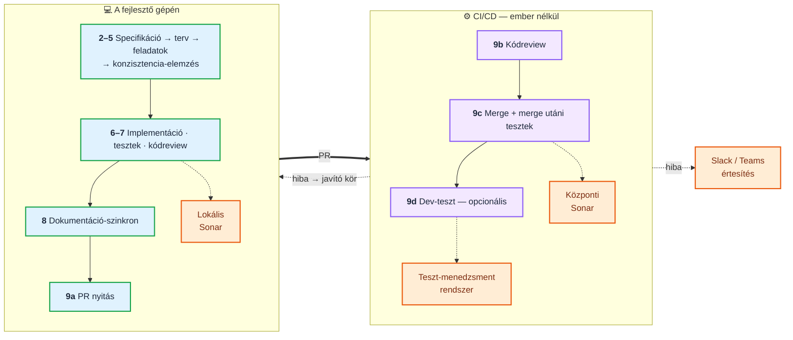
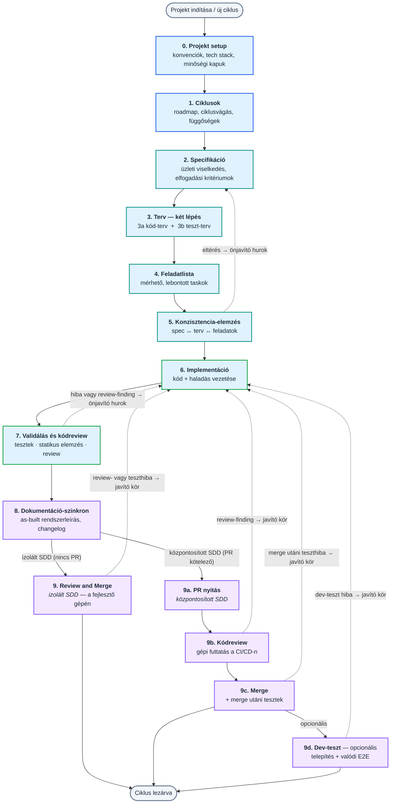
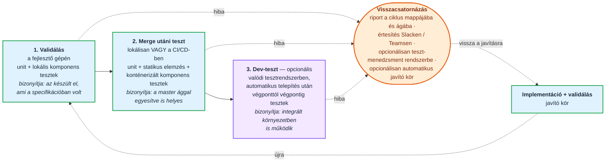

# „A README ne egy ömlesztett 50 oldalas doksi legyen" — hierarchikus dokumentáció

> **Státusz: TERV (2026-09-22).** Ez a kör **még nincs végrehajtva**. A dokumentum a
> Felhasználó követelményeit (3–6. szakasz), a repó **mért** mai állapotát (7. szakasz), a
> **lezárt döntéseket** (8. szakasz) és a **pipálható task-listát** (10.c) tartalmazza.
> Ütközésnél **a 8. szakasz döntése nyer** a 3–6. szakasz követelmény-tételei felett.
>
> **Amit ez a kör csinál:** a repó gyökerében álló két, egyenként ~1700 soros README-t
> **háromrétegű dokumentációra** bontja — egy rövid, értékorientált **nyitólap** (`README.md` /
> `README-HU.md`), egy **tartalomjegyzék**, ami **fizikai aloldalakra** visz, és a `docs/en/` +
> `docs/hu/` fában élő **témaoldalak**, plusz egy determinisztikus **kapu**, ami a fa
> szétcsúszását és a törött hivatkozásokat kiszűri.
>
> **Amit NEM csinál:** nem ír át egyetlen promptot sem (`prompts/skills-*`, `agents-*`,
> `shared-*`, `lang/*`), nem változtat a telepített kimeneten, és nem nyúl a folyamat
> szabályaihoz. Ez **dokumentáció-átrendezés**, nem keményítő kör — a `7/*` tervezési elvek
> ezért itt nem új szabályként, hanem **ellenőrző kérdésként** jelennek meg (10.c/E5).
>
> **Előzmény:** `prompts/improve-list13.md` (a ciklusvég szétvágása izolált és központosított
> SDD-re) — **végrehajtva** (2026-09-22). Ez a kör a `list13` után keletkezett dokumentációs
> adósságot rendezi: a két README abban a körben nőtt a mai méretére.

---

## 0. Hogyan használd ezt a dokumentumot

1. **A 2. szakasz a fogalmi keret** (három olvasói szándék → három réteg) — enélkül az
   oldal-vágások önkényesnek tűnnek.
2. A `DH`/`LP`/`SP`/`DG` tételek a **követelmények**. Ha valamelyik átfogalmazásra szorul, azt a
   11. szakaszba (napló) írd, ne írd felül a tételt.
3. A 7. szakasz **mérés**, nem vélemény: minden állítás mellett ott a fájl és a sor, ahol
   ellenőrizhető. A mérés dátuma **2026-09-22**, a `b98aba6` commit állapota.
4. **Ütközésnél a 8. szakasz döntése nyer.** A tizennégy döntésből **kilenc** a Felhasználóval
   egyeztetve született (`L14-D1`–`L14-D4` a kör elején, `L14-D10`–`L14-D14` a `Q1`–`Q6`
   válaszaként) — **ezeket ne nyisd újra**. A többi (`L14-D5`–`L14-D9`) ezekből levezetett
   végrehajtási döntés. **Nyitott kérdés nincs** (8.b).
5. **Ha üres kontextusból indulsz:** olvasd el a fejlécet, a 2. szakaszt, az 5.1 leképezési
   táblát, a 8. szakasz **összes** döntését, majd a 10.c task-listát. A 7. szakasz mérései akkor
   kellenek, amikor egy konkrét fájlhoz nyúlsz; a **12. függelék** akkor, amikor a `B` csomagot
   írod. **Külső fájlra nincs szükség** (`L14-D14`) — ez a dokumentum önhordó.
6. **Pipálj a 10.c-ben minden elvégzett tétel után** — ez a dokumentum egyetlen olyan része,
   amit a végrehajtás közben írni kell.

---

## 0.1 A hivatkozott keret-azonosítók — hol nézd meg őket

> Ez a dokumentum a keret meglévő szabályaira hivatkozik a rövid azonosítóikkal. **Nem másolja át
> őket** — ha egy hivatkozás nem világos, itt találod meg a forrását.

| azonosító(k) | mit rögzít | hol nézd meg |
|---|---|---|
| `7/*` (pl. `7/m`, `7/o`, `7/q`) | a keret tervezési elvei | `prompts/meta-improve-prompts.md` → „Tervezési elvek" |
| `LG1`–`LG25` | a kétnyelvűség két tengelye és a paritás-kapu | `prompts/scripts/lang-parity-check.py` docstring + `prompts/improve-list6.md` |
| `DS22` · `DS23.2` | a doc-sync objektív kapuja, **kiemelten a mappa-index halmaz-egyezés** | `prompts/scripts/ds22-gate-check.py` → `check_folder_index()` |
| `VP1`–`VP3` · `L13-D1`–`L13-D30` | a három bizonyítási pont és a ciklusvég topológiája | `prompts/improve-list13.md` 8. szakasz |
| `BD15` | a `<platform-scripts-mappa>` helyőrző | `prompts/scripts/install-helper.py` |

---

## 1. A kiváltó megfigyelés

A repó gyökerében **két, egyenként ~1700 soros README** áll (`README.md` angolul, `README-HU.md`
magyarul). Ez egyszerre **három különböző olvasónak** próbál megfelelni, és emiatt **egyiknek sem
felel meg**:

- aki **most találta meg a projektet**, és el akarja dönteni, érdekli-e egyáltalán, annak a
  „Amiben más" bekezdés után rögtön 1600 sor referencia-anyag jön;
- aki **telepíteni akarja**, annak a telepítés a 2. szakaszban van, de a döntéséhez szükséges
  nyelvi tengelyek és platform-korlátok szétszórva;
- aki **egy konkrét szabályt keres** (mit ír a `conventions.md` `## Review and merge` szekciója?
  hogyan működik a `07` hurok?), annak a fájlon belüli horgony-navigáció az egyetlen eszköze —
  egy 60 soros, automatikusan generált tartalomjegyzékkel (`<!-- TOC -->`, 7.5).

A Felhasználó szavaival: *„Ne egy ömlesztett 50 oldalas doksi legyen."*

Van egy **kész referencia-minta** is arra, hogy a nyitólap milyen legyen: a
`alerant-spec/README.md` (a Felhasználó másik repójában) — ugyanennek a módszertannak a
**rövid bemutatója**, értékorientált szakaszokkal (`1. Amiben más` → `2. A folyamat` →
`3. Hol tesztelünk` → `4. Mit jelent a gyakorlatban` → `5. Státusz`), mermaid-ábrákkal és
fázistáblával. Ez a kör **azt a modellt** hozza át a berkispec nyitólapjára — kiegészítve azzal,
ami a bemutatóból hiányzik, de egy repó-README-ből nem hiányozhat: a **telepítéssel** és a
**tartalomjegyzékkel**.

---

## 2. A fogalmi keret — három olvasói szándék, három réteg

A szétvágás nem méret-, hanem **szándék-alapú**. Három olvasói szándék van, és mindegyikhez egy
réteg tartozik:

| réteg | kinek | mire válaszol | hol él | méret |
|---|---|---|---|---|
| **1. Nyitólap** | aki most találta meg | *Mi ez, miben más, megéri-e, hogyan indulok el?* | `README.md` · `README-HU.md` | ≤ 400 sor |
| **2. Tartalomjegyzék** | aki keres valamit | *Melyik oldalon találom, amit keresek?* | a nyitólap záró szakasza + `docs/<lang>/README.md` | ~25 sor |
| **3. Témaoldalak** | aki dolgozik vele | *Pontosan hogyan működik ez az egy dolog?* | `docs/en/*.md` · `docs/hu/*.md` | oldalanként 40–260 sor |

**A réteghatár szabálya:** a nyitólap **állítást** tesz („a folyamat három ponton ellenőriz, és
mindhárom mást bizonyít"), a témaoldal **kifejti** („a `VP2` a fő branch behozása utáni, a
merge előtti kapu, a bizonyítéka a `test-report/post-merge/`"). Ha egy bekezdés a nyitólapon
azonosítókat sorol (`VD13`, `TC8`, `L13-D14`), az **rossz rétegben van**.

**Miért fizikai aloldal, és nem horgony?** Mert a horgony nem oldja meg a problémát: a fájl
ugyanúgy 1700 soros marad, a GitHub ugyanúgy egyben rendereli, a `git diff` ugyanúgy egy fájlon
csattan, és a mobil-nézetben ugyanúgy végig kell görgetni. A fizikai szétvágás az, ami a
**betöltött szöveg mennyiségét** csökkenti — nem a navigációt javítja, hanem a terhet veszi le.

---

## 3. A követelmények tételesen — a dokumentáció-hierarchia (`DH1`–`DH9`)

> Ezek a Felhasználó kérésének tételes alakja. Ahol egy döntés felülírja, ott a hivatkozás ott áll.

- **`DH1`** — A **fő doksi legyen rövid és lényegre törő**. Referencia-minta:
  `alerant-spec/README.md`. → a konkrét szakaszlista: 4. szakasz.
- **`DH2`** — A fő doksiban legyen **tartalomjegyzék, ami fizikai aloldalakra visz** — nem
  fájlon belüli horgonyokra.
- **`DH3`** — Az aloldalakon **részletesen** el lehessen olvasni a témákat: a mai README
  **teljes tartalma megmarad**, csak máshol. Ez a kör **nem tartalomvágás**. → `L14-D5`.
- **`DH4`** — Az aloldalak a **repóban** éljenek, a `docs/` fa alatt. → `L14-D1`.
- **`DH5`** — A GitHub wiki funkcionalitása **felhasználható**, de nem ebben a körben és nem
  igazságforrásként. → `L14-D1`, plusz a 9. anti-lista.
- **`DH6`** — A **kétnyelvűség megmarad**: az aloldalak is két fában élnek (`docs/en/` +
  `docs/hu/`), a fájlnevek **azonosak**. → `L14-D2`, `L14-D6`.
- **`DH7`** — A nyitólap **megtartja a telepítést**: `git clone` után az első lépés ne legyen
  egy kattintásra. → `L14-D3`.
- **`DH8`** — A szétvágást **gépi kapu** védje: nyelvi paritás + link-ellenőrzés. → `L14-D4`,
  6. szakasz.
- **`DH9`** — A kör tételei **ebben a fájlban** (`prompts/improve-list14.md`) gyűlnek —
  a `improve-list*.md` sorozat konvenciója szerint.

---

## 4. A nyitólap — mi kerüljön bele (`LP1`–`LP11`)

**Cél-méret: ~353 sor, kemény felső korlát 400** (ma: 1695; a korlátot a `DG5` méri, `L14-D12`).
A sorrend maga is üzenet: előbb *miért érdekel*, aztán *hogyan indulok el*, végül *hol olvasok
tovább*.

| # | szakasz | forrás | ~sor |
|---|---|---|---|
| `LP1` | ASCII-hero + nyelvváltó (`HUN version → README-HU.md`) | mai `README.md` 1–14 — **változatlan** | 14 |
| `LP2` | **Mi ez** — 3 bekezdés: SDD-keretrendszer, a spec a forrás, a ciklus **production-ready** egységet hagy maga után | **12. függelék** bevezetője + mai `# Berki-spec` bekezdés | 20 |
| `LP3` | **Státusz: alpha** — a breaking-change figyelmeztetés | mai `README.md` 80–82 — **változatlan** | 4 |
| `LP4` | **Amiben más** — nyolc alszakasz, egyenként 4–10 sor: multi-ágens architektúra · kétnyelvűség · olcsó modellekre optimalizálva · teljes SDLC (izolált vs. központosított, **mermaid**) · test-first · élő dokumentáció és teszt-regiszter · determinisztikus gépezet (scriptek) · illeszkedés a csapat eszközeihez (értesítés, teszt-menedzsment) | **12.4** kulcsállítások + **12.5** eltérés-lista (kötelező igazítások) | 110 |
| `LP5` | **A folyamat** — a fő mermaid folyamatábra + a **fázistábla** (0–9 + 9d, „mi történik" / „mi marad utána") | **12.2** (ábra + fázistábla); a fázistábla a `list13` topológiájával | 60 |
| `LP6` | **Hol tesztelünk** — a `VP1`/`VP2`/`VP3` ábra + 3 rövid bekezdés | **12.3** ábra ≈ mai `4.2` tömörítve | 35 |
| `LP7` | **Két fejlesztési út** — a döntési tábla („Jellemző / Egyszerűsített / Teljes") + 3 mondat | mai `1.` szakasz **táblája**; a próza és a `1.1 brainstorm` aloldalra megy | 20 |
| `LP8` | **Telepítés — quickstart** — a `git clone` + `./install.sh`, a platform-lista egy sorban, a két nyelvi tengely 4 sorban, és egy link a teljes telepítési oldalra | mai `2.` szakasz **tömörítve** (100 → 25 sor) | 25 |
| `LP9` | **Alapvető parancsok** — a slash-parancs tábla | mai `3.` szakasz táblája | 25 |
| `LP10` | **Mit jelent ez a gyakorlatban** — 5 pont (kiszámítható minőség, auditálható nyom, megszakítható munka, kontrollált költség, illeszkedés) | **12.6** öt pontja | 15 |
| `LP11` | **Dokumentáció — tartalomjegyzék** — a 14 témaoldal, egysoros leírásokkal, **relatív linkekkel** (`docs/en/…` ill. `docs/hu/…`) | **ÚJ** (`DH2`) | 25 |

**`LP-X` — ami a nyitólapról KIESIK:** az automatikusan generált `<!-- TOC -->` blokk (60 sor,
7.5). A helyére a `LP11` kézzel írt, aloldalakra mutató tartalomjegyzék lép. **A `<!-- TOC -->`
markert is el kell távolítani**, nem csak a tartalmát — különben a szerkesztő-bővítmény az első
mentésnél visszagenerálja (a kapu `DG5` tétele pont ezt méri).

---

## 5. Az aloldal-fa (`SP1`–`SP14`)

A fa **két tükrözött ágból** áll, **azonos fájlnevekkel** (`L14-D6`):

```text
docs/
├── en/
│   ├── README.md          ← az oldalindex (a mappa tartalomjegyzéke)
│   ├── installation.md
│   ├── quick-start.md
│   ├── routes.md
│   ├── full-flow.md
│   ├── model-selection.md
│   ├── self-healing-loops.md
│   ├── lightweight-flow.md
│   ├── skills-and-agents.md
│   ├── conventions.md
│   ├── cycle-artifacts.md
│   ├── living-docs.md
│   ├── quality-gates.md
│   ├── platform-integration.md
│   └── process-diagram.md
└── hu/
    └── … ugyanez a 15 fájlnév
```

### 5.1 A leképezési tábla — a mai szakasz → az új oldal

> A „sor" oszlop a **mért** mai súly (7.1), fence-tudatos számolással, az angol fán. A magyar fa
> ±2 soron belül ugyanaz.

| # | új oldal | mai `README.md` szakasz(ok) | sor | mit tartalmaz |
|---|---|---|---|---|
| `SP1` | `installation.md` | `2.` (Installation, telepítési lépések, platformok, nyelvi tengelyek, „Hogyan lehet használni?") | 100 | a teljes telepítési folyamat; a nyitólapon csak a quickstart marad (`LP8`) |
| `SP2` | `quick-start.md` | `3.` (Quick start, működési elv, alapparancsok) | 37 | az első ciklus végigvitele; a parancstábla a nyitólapon is szerepel (`LP9`) |
| `SP3` | `routes.md` | `1.` + `1.1` (két út, döntési tábla, `/bs-brainstorm`) | 46 | a két út részletes összevetése és az előszoba |
| `SP4` | `full-flow.md` | `4.` fejléc + `4.1` + `4.2` + `4.7` | 208 | a magas szintű összefoglalás, a tesztelési pontok, a példa prompt-folyam |
| `SP5` | `model-selection.md` | `4.3` | 75 | modell- és effort-tábla, a `models.json` |
| `SP6` | `self-healing-loops.md` | `4.4` + `4.5` + `4.6` | 242 | az `05` és a `07` hurok részletesen, plusz a közös konvenciók |
| `SP7` | `lightweight-flow.md` | `5.` (`5.1`–`5.6`) | 125 | a quick-flow, benne az **indító prompt** blokk |
| `SP8` | `skills-and-agents.md` | `6.` + `7.` + `8.` | 90 | skill-index, agent-index, frontmatter-séma |
| `SP9` | `conventions.md` | `9.` (branching, worktree, `BR1`, `W2`, `PC1`) | 88 | a projekt-konvenciók fájlja és a git-stratégia |
| `SP10` | `cycle-artifacts.md` | `10.` + `10.1` + `12.` + `13.` | 118 | a ciklus fájljai, az átadás, a kérdéskezelés, a státusz-lifecycle |
| `SP11` | `living-docs.md` | `11.` + `11.1` + `11.2` + `11.3` | 133 | `docs-generated/`, `test-conventions.md`, PDF-export, `test-runs/` |
| `SP12` | `quality-gates.md` | `14.` + `15.` + `16.` + `17.` | 92 | Sonar, döntési napló, validációs riport, reviewer ágens |
| `SP13` | `platform-integration.md` | `18.` (`18.0`–`18.2`) | 86 | `EX1`, Antigravity, Codex — a platform-korlátok |
| `SP14` | `process-diagram.md` | Függelék | 161 | a részletes folyamatábra |
| — | `README.md` (oldalindex) | **ÚJ** | ~25 | a 14 oldal listája egysoros leírásokkal (`DG4` méri) |

**Összesen: 1601 sor a mai 1620 soros törzsből.** A maradék **19 sor** a `# Berki-spec` bevezető
blokk, ami a nyitólapon marad (`LP2`/`LP3` alapanyaga). A 14 soros hero és a 60 soros generált
TOC a törzsön kívül van. A vágásnál keletkező oldalcímek, `SP-R` navigációs sorok és vissza-linkek
ezen felül **~60 sort** tesznek hozzá.

**`SP-R` — minden oldal kötelező kerete:** `# <cím>` fejléc, alatta **egy** navigációs sor, a fa
nyelvén, a végén semmi. Ez az egyetlen tartalom, ami **nem** a mai README-ből jön:

| fa | a navigációs sor |
|---|---|
| `docs/hu/` | `← [Vissza a főoldalra](../../README-HU.md) · [Oldalindex](README.md)` |
| `docs/en/` | `← [Back to the main page](../../README.md) · [Page index](README.md)` |

A `../../` a `docs/<lang>/` mélységből a repó gyökeréig lép vissza; az `README.md` **saját
mappán belüli** hivatkozás az oldalindexre. Mindkettőt a `DG3` méri.

---

## 6. A kapu (`DG1`–`DG6`) — `prompts/scripts/docs-tree-check.py`

> **Miért kell:** a `lang-parity-check.py` docstringje pontosan ezt a hibaosztályt írja le a
> prompt-fákra — *„kézzel tartva CSENDBEN szétcsúsznak"* —, és a `docs/` fa ugyanígy fog. A
> szétvágás ráadásul **új** hibaosztályt is behoz: a törött relatív linket, ami egy egyfájlos
> README-ben definíció szerint nem létezett.

| tétel | mit ellenőriz | minta |
|---|---|---|
| `DG1` | **Fájlhalmaz-paritás:** `docs/en/*.md` névhalmaza ≡ `docs/hu/*.md` névhalmaza | `lang-parity-check.py` 11.1 |
| `DG2` | **Szakasz-paritás:** fájlpáronként a `##`/`###` fejlécek **száma és mélység-sorrendje** egyezik (a *szövegük* nem — az fordítás) | `lang-parity-check.py` 11.3 |
| `DG3` | **Link-feloldás:** minden relatív link létező fájlra mutat; minden `](#…)` horgony létező fejlécre **a saját fájlján belül** | ÚJ |
| `DG4` | **Index halmaz-egyezés:** a `docs/<lang>/README.md` bejegyzései ≡ a mappa tényleges `.md` fájljai, és a gyökér-README tartalomjegyzéke ≡ ugyanez a halmaz | `ds22-gate-check.py` → `check_folder_index()` |
| `DG5` | **A nyitólap nem hízik vissza:** a gyökér-README-k ≤ 400 sorosak (**FAIL**, nem WARN — `L14-D12`), és **nem tartalmaznak** `<!-- TOC -->` markert | ÚJ (`LP-X`) |
| `DG6` | **Ábra-paritás:** a ```` ```mermaid ```` blokkok száma fájlpáronként egyezik | ÚJ |

**Szerződés (a többi kapu-scripttel egyezően):** kilépő kód `0` = nincs hiba (WARN megengedett),
`1` = legalább egy FAIL, `2` = használati hiba. Kapcsolók: `--check` (csendesebb kimenet).

**Fontos:** a script **repó-karbantartó**, nem a célprojekt eszköze — ezért fel kell venni a
`prompts/scripts/install-helper.py` `copy_helper_scripts()` kizárási listájába (a
`lang-parity-check.py` és a `sync-gemini-agents.py` mellé, 7.6).

---

## 7. Mérés — a repó mai állapota

> Minden szám a `b98aba6` commit állapota, 2026-09-22.

### 7.1 A két README súlya szakaszonként

`README.md` **1695 sor** (ebből 76 a hero + a generált TOC → **1620 sor törzs**),
`README-HU.md` **1705 sor** (78 + **1628**).

| szakasz | EN sor | HU sor |
|---|---|---|
| `# Berki-spec` (bevezető + alpha + „Amiben más") | 19 | 19 |
| `1.` Két fejlesztési út | 46 | 46 |
| `2.` Installáció | 100 | 101 |
| `3.` Quick start | 37 | 39 |
| **`4.` Teljes berki spec flow** | **525** | **527** |
| `5.` Egyszerűsített flow | 125 | 126 |
| `6.` Skill-index | 28 | 28 |
| `7.` Agent-index | 18 | 18 |
| `8.` Frontmatter séma | 44 | 44 |
| `9.` conventions.md | 88 | 88 |
| `10.` Ciklus-artefaktumok | 70 | 70 |
| `11.` docs-generated/ | 133 | 134 |
| `12.` Kérdéskezelés | 40 | 40 |
| `13.` Státusz-lifecycle | 8 | 8 |
| `14.` Sonar | 23 | 23 |
| `15.` Döntési napló | 13 | 14 |
| `16.` Validációs riport | 35 | 35 |
| `17.` Reviewer ágens | 21 | 21 |
| `18.` Ágens-specifikus integráció | 86 | 86 |
| Függelék — részletes folyamatábra | 161 | 161 |

**Amit ez megmutat:** a `4.` szakasz egymaga a törzs **32%-a** (525 / 1620), és három, egymástól
független témát hordoz — a flow leírása (208 sor), a modell-választás (75), a két önjavító hurok
(242) —, ezért hasad három oldalra (`SP4`, `SP5`, `SP6`). A másik véglet: a 19 szakaszból **kilenc
legfeljebb 40 soros** — ezek önálló oldalként csonkok lennének, ezért témánként vonódnak össze
(`SP10`, `SP12`). A vágás tehát **téma szerint** történik, nem méret szerint.

### 7.2 A belső hivatkozások — a ripple valódi mérete

A törzsben **mindössze 3 horgony-hivatkozás** van, mindkét nyelven ugyanannyi:

| EN sor | cél | az új helye |
|---|---|---|
| 94 | `#43-automatic-selection-of-models-and-effort-levels` | `docs/en/model-selection.md` |
| 427 | `#appendix--the-detailed-process-diagram` | `docs/en/process-diagram.md` |
| 1444 | `#45-the-07-validate-self-healing-loop-in-detail--tests--code-review` | `docs/en/self-healing-loops.md` |

**Amit ez megmutat:** a szétvágás **kockázata kicsi** — nem egy sűrűn összelinkelt hálót vágunk
szét, hanem egy lineáris, alig hivatkozó szöveget. A generált TOC 60 sora **teljes egészében
eldobható** (nem hivatkozik rá senki).

A törzs **külső** linkjei (10 db) érintetlenül átkerülnek; közülük egy fájlra mutat a repón
belül (`docs/worktree-vscode-source-control.png`) — ennek az útvonala az aloldalra kerüléssel
**megváltozik** (`../worktree-vscode-source-control.png`), és ezt a `DG3` méri.

### 7.3 A README-kre mutató külső hivatkozások — az átvezetendők

| hol | mit mond ma | mi legyen |
|---|---|---|
| `prompts/meta-improve-prompts.md:114` | „a `README-HU.md` „Indító prompt (copy-paste)" szekciója tartalmazza…" | `docs/hu/lightweight-flow.md` |
| `prompts/meta-improve-prompts.md:303` | „A hurkok közös konvencióit a `README-HU.md` „Önjavító hurkok" szekciója rögzíti." | `docs/hu/self-healing-loops.md` |
| `prompts/meta-improve-prompts.md:328` | „két olvasnivaló: … a `README-HU.md` (flow-ábrákkal és a hurkok konvencióival)" | a nyitólap + a `docs/hu/` fa releváns oldalai, tételesen |
| `berki-spec-directory-structure.md:3` | „a [`README.md`](README.md) (magyarul: `README-HU.md`) részletes társa" | marad, de a `docs/` fára is hivatkozik |
| `berki-spec-directory-structure.md:23` | a `README.md` / `README-HU.md` sorok az 1.1 táblában | át kell írni: a nyitólap + a `docs/<lang>/` fa szerepe |
| `berki-spec-directory-structure.md` 1.1 tábla `docs/` sora | „Kézzel írt illusztrációk a dokumentációhoz" | a `docs/en/` + `docs/hu/` fa leírása + az illusztrációk helye |

**Nincs több.** A `prompts/` fában szereplő összes többi `README` találat a **célprojekt**
komponens-README-iről vagy a `docs-generated/README.md` mappa-indexről szól — azokhoz **nem
nyúlunk** (9. anti-lista).

### 7.4 A `docs/` mappa mai tartalma — ütközés

A `docs/` mappa ma **nem** dokumentáció-fa, hanem vegyes, verziókezelt anyag:

```text
docs/ai-transformation-in-enterprise-env.md       (31 kB)  ← prezentáció-anyag
docs/ai-transformation-in-enterprise-env.md.bak   (27 kB)  ← .bak
docs/ai-transformation-in-enterprise-env.pdf     (131 kB)
docs/ai-transformation-slides.md                  (13 kB)
docs/ai_ugyek-adam.md                            (8,5 kB)
docs/AI_ugyek_egyeztetes_tisztitott.odp           (37 kB)
docs/elerheto-modellek.png                       (136 kB)
docs/mermaid-filter.err                          (0 byte)  ← üres melléktermék
docs/worktree-vscode-source-control.png           (49 kB)  ← a README hivatkozza
```

**A `Q1` lezárva (`L14-D10`):** a prezentáció-anyag `docs/talks/`-ba, a `worktree-…png`
`docs/assets/`-be költözik, a `.bak` és a 0 bájtos `mermaid-filter.err` törlésre kerül (utóbbi
mellé egy `.gitignore` sor). A `docs/` gyökerében négy mappa marad: `en/`, `hu/`, `talks/`,
`assets/`.

**Mért ripple:** a hat prezentáció-fájlra **semmi nem hivatkozik** a repóban; a
`worktree-vscode-source-control.png`-re **három** fájl (`README.md`, `README-HU.md`,
`berki-spec-directory-structure.md:27`).

### 7.5 A TOC generálása

Mindkét README-ben a 16–75. sor egy **automatikusan generált** blokk `<!-- TOC -->` /
`<!-- /TOC -->` markerek között (a VS Code *Markdown All in One* bővítmény formátuma). Ez 60 sor,
és **fájlon belüli** horgonyokra mutat — pont az, amit a `DH2` kivált. A markert is el kell
távolítani, különben a bővítmény visszagenerálja (`DG5`).

### 7.6 A telepítő és a README

Sem az `install.sh`-ban, sem az `install.ps1`-ben **nincs** egyetlen `README` vagy `docs/`
hivatkozás sem (mért: 0 találat mindkettőben): a repó-dokumentáció
**nem települ** a célprojektbe. Ez azt jelenti, hogy **a szétvágásnak nulla hatása van a
telepített kimenetre** — a `10.c/E2` bizonyítja is.

A `prompts/scripts/install-helper.py:190` `copy_helper_scripts()` viszont **minden** `*.py` és
`*.sh` fájlt átmásol a `prompts/scripts/`-ből, egy kézi kizárási lista kivételével
(`install-helper.py`, `sync-gemini-agents.py`, `lang-parity-check.py`, `acceptance-check.sh`,
`init-project.sh`). Az új `docs-tree-check.py`-t **fel kell venni ide** — különben minden
célprojektbe települne egy olyan script, amelynek a `docs/en` fája ott nem is létezik.

---

## 8. Lezárt döntések

> A `L14-D1`–`L14-D4` a Felhasználóval egyeztetve született (2026-09-22) — **ne nyisd újra**.
> A `L14-D5`–`L14-D9` ezekből levezetett végrehajtási döntés.

### `L14-D1` — Az aloldalak a repóban élnek, a `docs/` fa alatt (2026-09-22)

**Döntés:** a témaoldalak verziókezelt markdown fájlok a repóban, **nem** GitHub wiki lapok.

**Miért:** a wiki külön git repó (`berkispec.wiki`), amely **nem tageződik a kóddal** és **nem
jön a klónnal**. Ez a keretrendszer ugyanakkor **tagelt állapotból telepíthető** (a fejléc alpha
figyelmeztetése kifejezetten erre utal) — egy olyan dokumentáció, ami nem mozog együtt a
verzióval, pont a legfontosabb kérdésre („mit csinál *ez* a verzió?") nem tud válaszolni. A
repóban élő fa ráadásul **PR-ben review-zható**, offline is megvan, és ugyanaz a kapu-gépezet
védi, ami a promptokat.

**A wiki nincs kizárva**, csak nem igazságforrás: ha később kell, a `docs/` fa **tükrözhető**
bele — de az másik kör (9. anti-lista).

### `L14-D2` — Két tükrözött nyelvi ág: `docs/en/` + `docs/hu/` (2026-09-22)

**Döntés:** a fa két ága `docs/en/` és `docs/hu/`, a gyökérben a `README.md` (EN) és a
`README-HU.md` (HU) nyitólappal.

**Miért:** ez a `prompts/skills-{hu,en}/` mintája, tehát a karbantartó **már ismeri**, és
ugyanaz a paritás-logika alkalmazható rá scripttel (`DG1`, `DG2`). A lapos, utótagos alternatíva
(`docs/<téma>-hu.md`) ugyanabban a mappában keverné a nyelveket a mai vegyes tartalommal (7.4).

**A mai kétnyelvűség nem csorbul:** mindkét fa teljes; a „csak angol aloldalak" változat
elvetve.

### `L14-D3` — A nyitólap az `alerant-spec` modellt követi, de megtartja a telepítést (2026-09-22)

**Döntés:** a nyitólap szakaszai a 4. szakasz `LP1`–`LP11` táblája szerint; 250–350 sor.

**Miért:** az `alerant-spec/README.md` egy **bemutató** — nincs benne telepítés, mert nem repó
README. A berkispec nyitólapja viszont az a fájl, amit a `git clone` után elsőként megnyitnak: a
telepítés quickstartja (`LP8`) és a parancstábla (`LP9`) ezért a nyitólapon marad, a **teljes**
telepítési leírás pedig aloldalra megy (`SP1`).

**Következmény:** a nyitólap hosszabb lesz, mint a referencia — ez elfogadott. A `LP1`–`LP11`
tervezett össz-sorszáma **353**; a felső korlát **400 sor**, és ezt a `DG5` **kemény kapuként**
méri (`L14-D12`).

### `L14-D4` — A szétvágást gépi kapu védi: paritás + link-ellenőrzés (2026-09-22)

**Döntés:** új `prompts/scripts/docs-tree-check.py`, a 6. szakasz `DG1`–`DG6` tételeivel.

**Miért:** a keret alapelve, hogy *ami gépiesen eldönthető, azt script dönti el*. A kétnyelvű
kézi karbantartás **csendes** szétcsúszása mért, ismert hibaosztály (a `lang-parity-check.py`
születésének oka), a törött relatív link pedig a szétvágás **saját**, új hibaosztálya.

**Miért új script, és miért nem a `lang-parity-check.py` bővítése:** az a script prompt-specifikus
fogalmakra épül (`INCLUDE`/`ANCHOR` markerek, `status-keys.json` tokenek, féloldalas fordítási
mód), amelyek a `docs/` fában nem léteznek. Egy `--docs` üzemmód a docstringjétől a kilépő
kódjáig kétfelé ágaztatná — olcsóbb egy ~150 soros önálló script.

### `L14-D5` — Ez a kör NEM ír át tartalmat: vágás, nem újraírás (2026-09-22)

**Döntés:** az `A` csomag (10. szakasz) a mai szakaszokat **változatlanul** emeli át az
aloldalakra. Egyetlen kivétel a szerkesztés: a fejléc-szintek egy szinttel feljebb csúsznak
(`##` → `#` az oldal címén), a horgony-linkek relatív linkekké válnak (7.2), és minden oldal
megkapja az `SP-R` navigációs sorát.

**Miért:** ha a vágás és az újraírás egy commitban keveredik, a `git diff` **olvashatatlan**, és
nem lehet megállapítani, hogy elveszett-e tartalom. A tiszta mozgatás után a `B` csomag
(nyitólap) diffje már csak arról szól, ami tényleg új.

**Következmény:** átmenetileg lesz **átfedés** — a mai `2.`, `3.`, `1.` szakasz tartalma az `A`
után az aloldalon *és* a nyitólapon is ott áll. A `B` csomag zárja ezt le.

### `L14-D6` — A fájlnevek angolul, mindkét fában azonosan (2026-09-22)

**Döntés:** `docs/hu/installation.md`, nem `docs/hu/telepites.md`.

**Miért:** a `DG1` fájlhalmaz-paritás csak azonos nevekkel értelmezhető; ez a
`prompts/skills-{hu,en}/` mintája is (ott is `09c-merge.md` mindkét fában). A **tartalom**
természetesen a fa nyelvén van.

### `L14-D7` — Nincs sorszám-prefix a fájlneveken; az olvasási sorrendet az index adja (2026-09-22)

**Döntés:** `installation.md`, nem `01-installation.md`.

**Miért:** a sorszám **átnevezéssel** jár, valahányszor egy oldal beékelődik — és minden
átnevezés **két fában** töri el a linkeket. Az olvasási sorrendet a `docs/<lang>/README.md`
oldalindex és a nyitólap tartalomjegyzéke hordozza, ahol az átrendezés egy sor mozgatása.

**Mellékhaszon:** ha később wiki-tükör készül (`L14-D1`), a wiki lapcímek a fájlnevekből
képződnek — a sorszám ott zajt csinálna.

### `L14-D8` — A 19 mai szakaszból 14 oldal lesz; a legfeljebb 40 soros szakaszok összevonódnak (2026-09-22)

**Döntés:** az 5.1 leképezési tábla a kötelező vágás — se több, se kevesebb oldal.

**Miért:** a mérés (7.1) szerint kilenc szakasz legfeljebb 40 soros. Külön oldalként ezek
**csonkok** lennének, és a tartalomjegyzéket zajossá tennék; ugyanakkor a 4. szakasz 525 sora
**három** független témát hordoz, tehát nem maradhat egyben. A vágás tehát nem egyenletes:
**téma szerint** történik, nem méret szerint.

### `L14-D9` — A `docs-tree-check.py` nem települ a célprojektbe (2026-09-22)

**Döntés:** fel kell venni a `install-helper.py` `copy_helper_scripts()` kizárási listájába.

**Miért:** repó-karbantartó eszköz; a célprojektben nincs `docs/en` fa, amit ellenőrizne (7.6).
Ez a `copy_helper_scripts()` „mindent másolok, kivéve a listát" logikájából következő **kötelező**
lépés — kihagyva némán rossz scriptet telepítenénk öt platformra.

### `L14-D10` — A `docs/` gyökere a szétvágással együtt rendbe kerül (2026-09-22)

**Döntés:** az új nyelvi fák mellett a mappa mai, vegyes tartalma is a helyére kerül:

| fájl | hova |
|---|---|
| `ai-transformation-in-enterprise-env.md` · `.pdf` · `ai-transformation-slides.md` · `ai_ugyek-adam.md` · `AI_ugyek_egyeztetes_tisztitott.odp` · `elerheto-modellek.png` | `docs/talks/` |
| `worktree-vscode-source-control.png` | `docs/assets/` |
| `ai-transformation-in-enterprise-env.md.bak` · `mermaid-filter.err` | **törlés** |

A `docs/` gyökerében így négy mappa marad: `en/`, `hu/`, `talks/`, `assets/`.

**Miért:** a fa gyökere az első dolog, amit a tartalomjegyzékről érkező olvasó lát — ha ott
prezentáció-anyag és egy `.bak` fájl fogadja, a hierarchia üzenete azonnal elveszik.

**Miért kockázatmentes (mért):** a hat prezentáció-fájlra **semmi nem hivatkozik** a repóban. A
`worktree-vscode-source-control.png`-re **három** fájl: `README.md`, `README-HU.md` és a
`berki-spec-directory-structure.md:27` — ez a három az `A0d` tétel.

**A `mermaid-filter.err` külön eset:** nem kézzel odatett fájl, hanem az `export-doc.py`
melléktermékének (`mermaid-filter` a **cwd-be** írja, lásd `export-doc.py:24`) egy régi, kézi
pandoc-futásból ittfelejtett, 0 bájtos maradéka. Törlés **plusz** egy `mermaid-filter.err` sor a
`.gitignore`-ba, hogy ne jöjjön vissza.

**Sorrend:** ez a mozgatás az `A` csomag **legelső**, önálló commitja (`A0`–`A0d`), még a
szétvágás előtt — így a `git mv`-k diffje nem keveredik a tartalmi vágáséval (`L14-D5` logikája).

### `L14-D11` — A nyitólap NEM kap pandoc-frontmattert (2026-09-22)

**Döntés:** a nyitólapok az ASCII-heróval kezdődnek, ahogy ma; nincs YAML-frontmatter, és nincs
külön export-változat sem.

**Miért:** a pandoc-frontmatternek a fájl **legelső** sorától kell állnia, tehát vagy a hero
csúszik alá (és a GitHub-nézet tetején egy nyers metablokk fogad), vagy a frontmatter nem
működik. Cserébe semmit nem kapnánk: a `/bs-export-doc` a **célprojekt** `docs-generated/`
anyagát exportálja, nem a keretrendszer repó-README-jét, és PDF-bemutatóra már létezik az
`alerant-spec/README.md`.

**Ha később mégis kell:** a helye nem a nyitólap, hanem egy generált export-változat — de az
külön kör, mert két helyen karbantartott azonos szöveget senki nem tart karban.

### `L14-D12` — A `DG5` nyitólap-korlát KEMÉNY kapu, 400 sornál (2026-09-22)

**Döntés:** ha bármelyik nyitólap 400 sor fölé nő, a `docs-tree-check.py` **FAIL**-lel (kilépő
kód `1`) áll meg. Nem WARN.

**Miért:** a lágy korlátot pont az a lassú hízás lépi át, ami ellen a kör egyáltalán indult — egy
figyelmeztetés, amit három körön át átlépnek, nem korlát, hanem zaj. A precedens a `7/q`
(a quick-flow ≤ 445 telepített sora): az is kemény, és pontosan azért, mert a puha változata már
egyszer nem tartott meg semmit.

**A korlát nem önkényes:** a `LP1`–`LP11` tervezett össz-sorszáma 353 — a 400 ad ~13% mozgásteret
a fogalmazásnak, de nem fér bele még egy szakasz.

### `L14-D13` — A kör hatóköre LEZÁRT; a végrehajtás a `terv/improve-list13` branchen megy (2026-09-22)

**Döntés:** a `list14` **egyetlen témát** visz végig — a README háromrétegű szétvágását. Minden
további dokumentációs ötlet (CONTRIBUTING, CHANGELOG, verziózás, wiki-tükör, badge-ek) az
`improve-list15.md`-be megy, **nem ide**. A végrehajtás nem nyit új branchet: a `terv/improve-list13`
ágon folytatódik, csomagonként külön committal.

**Miért a zárt hatókör:** egy gyűjtő kör task-listája a végrehajtás közben mozog, és akkor a
„pipálj minden tétel után" (0./6) elveszti az értelmét — nem lehet megmondani, mikor van kész.
A `list12` és a `list13` is egy-egy témával futott végig.

**Miért nincs új branch:** a `list13` végrehajtása ugyanezen az ágon zárult, és ez a kör **egyetlen
promptot sem ír át** (9. anti-lista) — nincs ütközési felület, amit egy külön ág megvédene.

### `L14-D14` — A nyitólap forrásanyaga a tervbe kerül; a kör önhordó (2026-09-22)

**Döntés:** az `alerant-spec/README.md` lényege — a három mermaid-ábra, a fázistábla, a `LP4`
nyolc alszakaszának kulcsállításai és a `LP10` öt pontja — a **12. függelékbe** került. A terv
innentől **külső fájl nélkül, üres kontextusból is végrehajtható**.

**Miért:** a forrás a repón kívül él (a Felhasználó gépén, egy másik projekt mappájában). Egy
friss sessziónak nincs hozzá útvonala, és egy abszolút útvonal gépfüggő lenne — a `B` csomag
hét tétele vált volna végrehajthatatlanná. Ez a keret **13. tervezési elvének** (megszakadás-
tűrés) a dokumentumra alkalmazott alakja: *ami a lemezen van, az éli túl a kontextus elvesztését.*

**Amit a függelék NEM old meg:** a forrás egy **másik** repó bemutatója, négy ponton elavult vagy
más a berkispecre nézve (12.5) — ezek a `B3` kötelező igazításai, nem opcionális finomhangolás.

**Ezzel együtt zárt három kisebb hézag is:** az `SP-R` navigáció mindkét nyelven definiálva
(5. szakasz), a vágás módszere kimondva (`A2`), és az `E3` telepítés-próba eljárása leírva.

---

## 8.b Nyitott kérdések — MIND LEZÁRVA (2026-09-22)

> A három kérdést a Felhasználó **egyesével** válaszolta meg; a válaszok `L14-D10`–`L14-D12`
> döntésként a 8. szakaszban állnak. **A végrehajtás előtt nincs nyitott kérdés.**

| eredeti kérdés | válasz | döntés |
|---|---|---|
| `Q1` — Mi legyen a `docs/` mai, vegyes tartalmával? | költöztetés (`talks/` + `assets/`) **és** takarítás (`.bak`, `mermaid-filter.err`) | `L14-D10` |
| `Q2` — Kapjon-e a nyitólap pandoc-frontmattert? | nem | `L14-D11` |
| `Q3` — A `DG5` 400 soros korlát FAIL vagy WARN? | **FAIL**, kemény kapu | `L14-D12` |
| `Q4` — A `list14` lezárt kör, vagy tovább gyűjt? | **lezárt** — csak a README-szétvágás | `L14-D13` |
| `Q5` — Új branch kell-e a végrehajtáshoz? | nem, a `terv/improve-list13` ágon megy | `L14-D13` |
| `Q6` — Hogyan legyen önhordó a nyitólap forrásanyaga? | **beépítve** a 12. függelékbe | `L14-D14` |

**Ha a végrehajtás közben ÚJ kérdés merül fel:** ide írd be `Q4`-től, és **állj meg vele** — a
3. tervezési elv szerint egyszerre egy kérdés, a válasz pedig döntésként a 8. szakaszba kerül,
nem a task-listába.

---

## 9. Anti-lista — amihez ebben a körben NEM nyúlunk

- **Egyetlen prompthoz sem.** `prompts/skills-{hu,en}/`, `agents-{hu,en}/`, `shared-{hu,en}/`,
  `lang/{hu,en}/` — érintetlen. Ebből következik, hogy a **`7/o` kérdés** („igaz-e ez a másik
  útra is?") itt **nem értelmezett**: a quick-flow szabályai nem változnak.
- **A telepített kimenethez.** A `docs/` fa nem települ; a `10.c/E2` byte-azonossági próba ezt
  bizonyítja is.
- **A folyamat szabályaihoz.** A `list13` huszonhat + négy döntése (`L13-D1`–`L13-D30`) érvényben
  marad; ez a kör **leírja** őket máshol, nem írja át őket.
- **A célprojekt `docs-generated/` fájához és a komponens-README-khez.** Azok a `08-doc-sync`
  tulajdonai (`DS4`) — a repó saját dokumentációjának átrendezése nem érinti őket.
- **A GitHub wiki feltöltéséhez.** Engedélyezve van a repón, de ebben a körben üresen marad
  (`L14-D1`). A tükrözés külön kör, ha egyáltalán kell.
- **A `README-HU.md` fájlnévhez.** Csábító lenne `docs/hu/`-ba költöztetni, de a gyökérben álló
  magyar nyitólapra a `meta-improve-prompts.md` és a `berki-spec-directory-structure.md` is
  hivatkozik, és a GitHub-on a gyökér az, ami látszik. **Marad.**

---

## 10. Végrehajtási sorrend — a csomagok

| csomag | mit csinál | miért ebben a sorrendben |
|---|---|---|
| **A** | Két önálló commit: (1) a `docs/` rendrakása — `talks/`, `assets/`, takarítás (`L14-D10`); (2) a fa felállítása: `docs/en/` + `docs/hu/`, a 14+14 oldal **változatlan** tartalommal, fejléc-szint igazítással, `SP-R` navigációval, a 3 horgony relatív linkké alakításával | tiszta mozgatás, olvasható diff (`L14-D5`) |
| **B** | A nyitólapok újraírása mindkét nyelven: `LP1`–`LP11`, a `<!-- TOC -->` blokk eltávolítása, a `LP11` tartalomjegyzék megírása | csak az `A` után látszik, mi az, ami tényleg átfed |
| **C** | A kapu: `docs-tree-check.py` megírása (`DG1`–`DG6`) + az `install-helper.py` kizárás (`L14-D9`) | a kapunak akkor van értelme, ha van mit mérnie |
| **D** | A ripple átvezetése: `meta-improve-prompts.md` 114/303/328, `berki-spec-directory-structure.md` (7.3) | a végleges útvonalak csak a `B` után ismertek |
| **E** | Zárás: kapuk + telepítés-próba + kézi olvasópróba | — |

### 10.c Pipálható task-lista

> **Pipálj minden elvégzett tétel után.** Ez a dokumentum egyetlen, végrehajtás közben írandó
> része.

**A csomag — a `docs/` rendrakása, majd a fa felállítása**

> Az `A0`–`A0d` **önálló commit**, még a szétvágás előtt (`L14-D10`) — a `git mv`-k diffje ne
> keveredjen a tartalmi vágáséval.

- [ ] `A0` — `git mv` a hat prezentáció-fájl `docs/talks/`-ba (`ai-transformation-in-enterprise-env.md`,
      `.pdf`, `ai-transformation-slides.md`, `ai_ugyek-adam.md`,
      `AI_ugyek_egyeztetes_tisztitott.odp`, `elerheto-modellek.png`)
- [ ] `A0b` — `git mv docs/worktree-vscode-source-control.png docs/assets/`
- [ ] `A0c` — `git rm docs/ai-transformation-in-enterprise-env.md.bak docs/mermaid-filter.err`,
      plusz egy `mermaid-filter.err` sor a `.gitignore`-ba (az `export-doc.py` a cwd-be írja,
      `export-doc.py:24`)
- [ ] `A0d` — A `worktree-…png` **három** hivatkozásának átírása az új útvonalra: `README.md`,
      `README-HU.md`, `berki-spec-directory-structure.md:27`
- [ ] `A1` — `docs/en/` és `docs/hu/` mappa létrehozása
- [ ] `A2` — A 14 angol oldal kivágása a `README.md`-ből az 5.1 tábla szerint, **változatlan**
      tartalommal. **A vágás fejléc szerint megy, nem sorszám szerint:** a `##` szakaszhatárokat
      kell megkeresni (kódblokk-tudatosan — a ```` ``` ```` fence-eken belüli `#` sorok NEM
      fejlécek — a mai README-ben mindkét nyelven 23 ilyen sor van). A 7.1 sorszámai **ellenőrzésre** valók: a
      kivágott oldal sorszáma ±2-n belül egyezzen a táblával
- [ ] `A3` — A 14 magyar oldal kivágása a `README-HU.md`-ből, ugyanazokkal a fájlnevekkel
      (`L14-D6`)
- [ ] `A4` — Fejléc-szint igazítás minden oldalon: az oldal címe `#`, alatta a mai szintek egy
      szinttel feljebb
- [ ] `A5` — `SP-R` navigációs sor minden oldal tetejére (vissza a nyitólapra + oldalindex)
- [ ] `A6` — A 3 horgony-hivatkozás átírása oldalközi relatív linkre, mindkét fában (7.2)
- [ ] `A7` — A worktree-kép hivatkozásának javítása a `conventions.md` oldalon:
      `../assets/worktree-vscode-source-control.png` (az `A0b` utáni útvonal)
- [ ] `A8` — `docs/en/README.md` és `docs/hu/README.md` oldalindex megírása (14 bejegyzés,
      egysoros leírással)
- [ ] `A9` — **Ellenőrzés:** a `docs/<lang>/*.md` összsora ≥ a mai README-törzs sorszáma mínusz
      a nyitólapon maradó szakaszok — semmi nem veszett el

**B csomag — a nyitólapok**

- [ ] `B1` — A `<!-- TOC -->` … `<!-- /TOC -->` blokk **és a markerek** törlése mindkét
      README-ből
- [ ] `B2` — `LP2` (Mi ez) + `LP3` (alpha státusz) megírása mindkét nyelven
- [ ] `B3` — `LP4` (Amiben más, nyolc alszakasz) megírása a **12.4** kulcsállításokból, a **12.5**
      eltérés-lista **mind a négy** kötelező igazításával (script-szám, Antigravity CI-korlát,
      az `under development` adapterek, az alpha státusz)
- [ ] `B4` — `LP5` (A folyamat: mermaid + fázistábla) — a fázistábla a `list13` topológiájával
      (09 · 09a–09d)
- [ ] `B5` — `LP6` (Hol tesztelünk: `VP1`/`VP2`/`VP3`)
- [ ] `B6` — `LP7` (Két út, döntési tábla) + `LP8` (telepítés-quickstart) + `LP9` (parancstábla)
- [ ] `B7` — `LP10` (Mit jelent a gyakorlatban)
- [ ] `B8` — `LP11` — **a tartalomjegyzék**: 14 sor, egysoros leírásokkal, `docs/en/…` ill.
      `docs/hu/…` relatív linkekkel (`DH2`)
- [ ] `B9` — A `B` után a nyitólapon **nem marad** olyan szakasz, amit az `A` aloldalra vitt
      (az `L14-D5` szerinti átmeneti átfedés feloldása)
- [ ] `B10` — Mindkét nyitólap ≤ 400 sor

**C csomag — a kapu**

- [ ] `C1` — `prompts/scripts/docs-tree-check.py` megírása: `DG1` fájlhalmaz-paritás
- [ ] `C2` — `DG2` szakasz-paritás (fejléc-szám és mélység-sorrend)
- [ ] `C3` — `DG3` link- és horgony-feloldás
- [ ] `C4` — `DG4` index halmaz-egyezés (`ds22-gate-check.py` mintájára)
- [ ] `C5` — `DG5` nyitólap-korlát (**400 sor, FAIL** — `L14-D12`) + `<!-- TOC -->` marker tiltása
- [ ] `C6` — `DG6` mermaid-blokk paritás
- [ ] `C7` — Kilépő kód szerződés: `0` / `1` / `2`, `--check` kapcsoló
- [ ] `C8` — `install-helper.py` `copy_helper_scripts()` kizárási lista bővítése (`L14-D9`)
- [ ] `C9` — A script futtatása: **zöld**

**D csomag — a ripple**

- [ ] `D1` — `meta-improve-prompts.md:114` → `docs/hu/lightweight-flow.md`
- [ ] `D2` — `meta-improve-prompts.md:303` → `docs/hu/self-healing-loops.md`
- [ ] `D3` — `meta-improve-prompts.md:328` („két olvasnivaló") átírása a nyitólapra + a
      `docs/hu/` fa tételes oldalaira
- [ ] `D4` — `berki-spec-directory-structure.md:3` és `:23` átvezetése
- [ ] `D5` — `berki-spec-directory-structure.md` 1.1 tábla: a `docs/` sor átírása a **négy**
      almappára (`en/`, `hu/`, `talks/`, `assets/`) és a szerepükre

**E csomag — zárás**

- [ ] `E1` — `docs-tree-check.py` zöld
- [ ] `E2` — `lang-parity-check.py` zöld (default **és** `--strict`) — a prompt-fák érintetlenek,
      ez a bizonyíték rá
- [ ] `E3` — Telepítés-próba: **(a)** a kör ELŐTTI állapotból (`git stash` vagy egy `e9b734d`
      checkout) telepíts egy temp mappába, **(b)** a kör után ugyanoda egy másikba, **(c)**
      `diff -r` a kettőre → **üres**. Ez bizonyítja a 7.6 állítását. Külön ellenőrizd, hogy a
      `docs-tree-check.py` **nem** települt (`L14-D9`)
- [ ] `E4` — Kézi olvasópróba: a nyitólap tartalomjegyzékének **minden** linkje megnyílik a
      GitHub renderelésében, mindkét nyelven; a mermaid-ábrák renderelődnek az aloldalakon is
- [ ] `E5` — A `7/*` ellenőrző kérdések átfutása: `7/m` (melyik script olvassa? → egy sem, a
      dokumentáció nem gépi bemenet), `7/o` (a másik út? → nem értelmezett, 9. anti-lista),
      `7/q` (mi esett ki? → nem prompt-változás), megszakadás-tűrés (a csomagok commit-határai)
- [ ] `E6` — Nem keletkezett új nyitott kérdés; ha mégis, `Q4`-től a 8.b-ben áll, döntéssel
      lezárva a 8. szakaszban

---

## 11. Napló — a végrehajtás tapasztalatai és a tervtől való eltérések

> Ezt a szakaszt a **végrehajtás** írja. Ide kerül minden, ami a tervtől eltért, és az indoka —
> a `improve-list*.md` sorozat konvenciója szerint (lásd `improve-list12.md` 9. szakasz).

*(Üres — a kör még nem futott.)*

---

## 12. Függelék — a nyitólap forrásanyaga (`LP2`–`LP10`)

> **Miért van itt:** a `B` csomag forrása az `alerant-spec/README.md`, ami a **repón kívül** él,
> a Felhasználó gépén. A `L14-D14` döntése szerint a forrás lényege **ide**, a tervbe került —
> így a `B` csomag **üres kontextusból, külső fájl nélkül is végrehajtható**.
>
> **Ez nyersanyag, nem kész szöveg.** Három dolgot kell rajta igazítani a végrehajtáskor:
> (1) a `README.md` oldalára **angolul**; (2) a berkispec **mért** tényeire (lásd a 12.4
> eltérés-listát); (3) a `list13` topológiájára (`09` · `09a`–`09d`).

### 12.1 Az izolált vs. központosított SDD ábra (`LP4`, a teljes SDLC alszakasz)


### 12.2 A fő folyamatábra és a fázistábla (`LP5`)


| fázis | mi történik | mi marad utána |
|---|---|---|
| **0. Projekt setup** *(egyszer fut)* | A fejlesztővel közösen rögzítjük a projekt konvencióit: tech stack, tesztstruktúra, riport-elvárások, git- és merge-stratégia, minőségi küszöbök. | `conventions.md` |
| **1. Ciklusok** | A követelményt önállóan leszállítható ciklusokra bontjuk, függőségekkel és elfogadási kritériumokkal. | `roadmap.md` |
| **2. Specifikáció** | **Csak az üzleti viselkedés** — mit csináljon a rendszer, és mikor mondjuk késznek. Implementációt nem tervez. | `spec.md` |
| **3a. Kód-terv** | A technikai megvalósítás terve: érintett komponensek, tervezett módosítások, konfiguráció, adatséma. | `plan.md` kód-fele |
| **3b. Teszt-terv** | Ugyanannak a tervnek a teszt-fele: tesztforgatókönyvek, gépi futtatási tábla, környezet-felkészítés, specifikáció-lefedettség. | `plan.md` teszt-fele |
| **4. Feladatlista** | A terv lebontása mérhető feladatokra. Újat nem tesz hozzá. | `tasks.md` |
| **5. Konzisztencia-elemzés** | Kereszt-ellenőrzés: a specifikáció, a terv és a feladatok **ugyanarról szólnak-e**. Eltérésnél önjavító hurok indul. | elemzési riport + javítási lista |
| **6. Implementáció** | A kód megírása a terv és a feladatlista alapján, a haladás vezetésével. | kód + kipipált feladatlista |
| **7. Validálás és kódreview** | Gyors tesztek → statikus elemzés (Sonar + AI kódreview) → nehéz tesztek és regresszió → elfogadási kritériumok ellenőrzése. Hibánál önjavító hurok, rögzített leállási korlátokkal. | validációs riport + kódreview |
| **8. Dokumentáció-szinkron** | Az élő rendszerdokumentáció naprakészen tartása a ténylegesen megvalósult kódhoz: működésleírás, architektúra, changelog, komponens-leírások. | `docs-generated/` |
| **9. Review and Merge** | A visszaintegrálás. Izolált módban a fejlesztő gépén; központosított módban PR-nyitás → gépi kódreview → merge, a CI/CD-ben. | beolvasztott ág / PR + lezárt roadmap |
| **9d. Dev-teszt** *(opcionális)* | Automatikus telepítés integrált tesztkörnyezetbe, és valódi végponttól végpontig tesztek. | teszt-bizonyíték a ciklus mappájában |

### 12.3 A három teszt-kör ábrája (`LP6`)


### 12.4 A `LP4` nyolc alszakasza — a kulcsállítások

> Ebből kell 4–10 soros bekezdéseket írni, alszakaszonként. A **sorrend kötött** — ez a
> meggyőzés íve: előbb a szerkezet, aztán a költség, végül a beilleszthetőség.

1. **Multi-ágens architektúra.** Nem egyetlen ágens, hanem **specializált csapat**: *diagnoszták*
   (csak olvasnak — kód-review, konzisztencia-elemzés, kódbázis-feltárás, doksi-tervezés),
   *végrehajtók* (tesztek és statikus elemzés futtatása, tényszerű összegzéssel), *javítók* (a
   **konkrét, listázott** hibák célzott javítása, nem szabad felfedezés). A lényeg: **aki
   diagnosztizál, az nem javít, és aki javít, az nem dönti el, hogy kész van-e** — a PASS/FAIL
   determinisztikus scriptektől jön.
2. **Kétnyelvű — két független tengely.** A *prompt nyelve* (milyen nyelven kapja az utasítást az
   ágens) és a *projekt nyelve* (milyen nyelven készülnek a leadandó dokumentumok) szabadon
   kombinálható. Magyar csapatnál a leggyakoribb: **angol promptok, magyar dokumentáció** — az
   angol prompt tokenben olcsóbb, és a gyengébb modellek pontosabban követik.
3. **Olcsó, gyengébb modellekre optimalizálva.** Feladatarányos modellválasztás **két tengelyen**
   (melyik modell · mennyi gondolkodási erőforrás); a legdrágább szintet **egyetlen** pont kapja,
   a konzisztencia-elemzés. Determinisztikus védőhálók (szűkített belépők, kötelező
   ellenőrzőlisták, „egyszerre egy kérdés"), kontextus-takarékosság (a feltárást és a
   teszt-futtatást olcsó, párhuzamos segéd-ágensek végzik, és csak összegzést adnak vissza), és:
   **ami gépiesen eldönthető, azt script dönti el** — a nyers teszt-log és a `git diff` nem kerül
   a modell kontextusába.
4. **Teljes SDLC — két üzemmód.** *Izolált SDD*: minden a fejlesztő gépén fut, a review-t és a
   visszaintegrálást is beleértve. *Központosított SDD*: a PR feladása indítja a CI/CD-t, és a
   **kódreview, a merge és a merge utáni tesztelés távoli gépen, gépi futtatásban** zajlik. A
   határvonal **egyetlen ponton** van: a PR feladásánál. → a **12.1 ábra**.
5. **Test-first — a tesztterv a kód előtt.** A 3. fázis két lépésre bomlik: előbb a kód-terv,
   **majd ugyanannak a tervnek a teszt-fele**, konkrét elvárt eredménnyel és gépi futtatási
   táblával, **még az implementáció előtt**. Három következmény: az elfogadási kritérium és a
   teszt összekötve él (gépi kapu, mindkét irányban); **a kód a szerződéshez igazodik, nem
   fordítva** (a javítás nem lazíthatja meg a tesztet — determinisztikus ellenőrzés védi); és a
   **látszat-zöld ki van zárva** (a „nulla lefutott teszt" FAIL, a *skipped* nem bizonyíték, az
   üres teszt-törzset külön ellenőrzés keresi).
6. **Folyamatos dokumentáció- és teszt-karbantartás.** Külön fázis, **minden ciklusban**: élő
   rendszerdokumentáció objektív kapuval, élő teszt-regiszter (hogyan indul a stack, milyen hívás,
   milyen teszt-felhasználó), és teljes teszt-leltár, amit gépi kapu vet össze a repóban
   ténylegesen meglévő tesztfájlokkal. **Egy év múlva is meg lehet mondani, mit csinál a rendszer,
   és mi bizonyítja, hogy működik.**
7. **Determinisztikus gépezet — scriptek.** Minőségi kapuk (kereszt-fázisos konzisztencia,
   elfogadási kritérium ↔ bizonyíték, riport-artefaktumok, doksi-konzisztencia, teszt-leltár),
   futtatás és kiértékelés (tesztek a terv gépi táblájából, Sonar az API-ból, kör-napló és
   bukás-számlálók), védelmek (a tesztelt szerződés módosításának kiszűrése, tartalom nélküli
   tesztek), segédeszközök (ciklus-státusz, cikluson kívüli futtatás, PDF-export, worktree).
   **A darabszámot mérd, ne másold** — lásd 12.5.
8. **Illeszkedés a csapat eszközeihez.** Interaktív telepítő öt platformra, projekt-szintű
   testreszabás (a keret a projekt konvencióihoz igazodik, nem fordítva), CI/CD-be illeszthető
   záró fázisok egységes, platformfüggetlen belépőn, **a verdiktet a determinisztikus kapuktól**
   véve. Értesítés **Slack / Teams / saját parancs** — csak bukásnál és emberi döntésnél, sosem
   sikeres futásról; a titok **környezeti változóban**, soha nem parancssori paraméterként.
   Opcionális **teszt-menedzsment rendszer**, alapból kikapcsolva, mert a külső szolgáltatás
   **soha nem válhat a ciklus futásának előfeltételévé**; a hivatalos bizonyíték továbbra is a
   verziókezelőbe commitolt riport.

### 12.5 Amit a forrás állít — és amit a berkispecben MÉRNI kell

> A forrás egy másik repó bemutatója; négy ponton **elavult vagy más** a berkispecre nézve.
> Ezek a `B3` tétel kötelező igazításai.

| a forrás állítása | a berkispec mért valósága (2026-09-22) |
|---|---|
| „tizennyolc scriptet telepít" | **21 fájl települ** (20 önálló script + a `lang_keys.py` közös modul). A repóban 26 script van, ebből **öt** repó-karbantartó, és nem települ: `install-helper.py`, `sync-gemini-agents.py`, `lang-parity-check.py`, `acceptance-check.sh`, `init-project.sh`. A `list14` után hattá nő (`docs-tree-check.py`, `L14-D9`) — a **telepített** szám nem változik. |
| „Támogatott platformok: Antigravity CLI · Claude Code · Cursor · GitHub Copilot · Codex CLI" — gépi futtatásra mind | Az **Antigravity CLI-nek nincs headless módja** (1.107.0 GUI-t nyit), ezért a központosított út CI-ágán a `ci-run-skill.sh` **`command`** ága kell. A nyitólap ne állítsa, hogy mind az öt platform gépi futtatásra kész. Forrás: mai `README.md` 18.1. |
| „teszt-menedzsment: TestDino · ReportPortal · Qase · TestRail · Xray" | A `reportportal` és a `qase` adapter a repóban **`under development`** (`0292847`). A `testdino` és a `command` ág kipróbált. |
| „5. Státusz: éles projekteken fut" | A berkispec README-je **alpha** státuszt hirdet, breaking-change figyelmeztetéssel. **Az `LP3` nyer** — a forrás státusz-szakaszát NEM vesszük át. |

### 12.6 `LP10` — „Mit jelent ez a gyakorlatban" (öt pont)

1. **Kiszámítható minőség.** Minden fázis lezárása gépi kapuhoz kötött; az AI nem tudja magát
   késznek nyilvánítani.
2. **Auditálható nyom.** A követelménytől a tesztbizonyítékig minden lépés commitolt dokumentumban
   él — utólag megválaszolható, miért született egy döntés, és mi bizonyítja, hogy működik.
3. **Megszakítható munka.** Az állapot a lemezen van, nem egy beszélgetés memóriájában.
4. **Kontrollált költség.** A drága modellt csak ott használjuk, ahol tényleg kell.
5. **Illeszkedik a meglévő folyamatokhoz.** PR-alapú review, védett master ág, CI/CD, Sonar,
   integrált tesztkörnyezet, Slack/Teams értesítés, teszt-menedzsment — a keret **ezekbe
   illeszkedik be, nem helyettük jön**.
