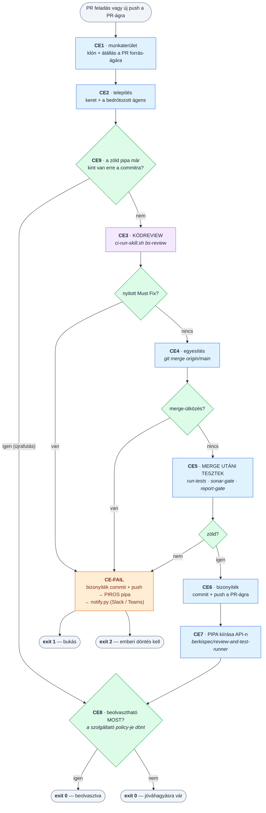

# „A központosított SDD nem fut le" — a CI-lánc kiépítése

> **Állapot: ELŐKÉSZÍTŐ ANYAG.** Ez a dokumentum még **nem** végrehajtott kör: a mérést, a
> már lezárt döntéseket és a kanonikus mintákat rögzíti, hogy a végrehajtás ne a nulláról
> induljon. Amíg a 7. szakasz csomagjai nincsenek lepipálva, a repó egyetlen promptja és
> scriptje sem változott ettől a körtől.

---

## 0. Hogyan használd ezt a dokumentumot

- A **2. szakasz** a mért mai állapot: mit mond ma a keret a központosított útról, és hol
  szakad el a lánc. Minden tétel `fájl:sor` hivatkozással áll — ezek 2026-09-23-i mérések.
- A **3. szakasz** a kanonikus pipeline-minták (GitHub Actions + Azure DevOps) — **de előbb a
  `3.1`-et olvasd**: az írja le a `ci-run-review-merge.sh` belépőt (`CE0`–`CE15`), amire a
  pipeline egyetlen sorra zsugorodik. Implementáláskor a `3.1` az irányadó.
- A **4. szakasz** a lezárt döntések (`L15-D1`…). **Ezeket ne döntsd el újra másképp** — ha
  mégis kell, a döntés mellé írd oda, mi változott.
- A **6. szakasz** a nyitott kérdések: ezek még a Felhasználóra várnak.
- A **7. szakasz** a végrehajtási csomagok — a kör akkor kezdődik, amikor a 6. kiürül.
- A **8. szakasz** a forrásanyag-függelék: minden mért tény és a parancs, amivel újra
  ellenőrizhető — hogy egy friss sessionben ne kelljen újra felderíteni.

## 0.1 A hivatkozott keret-azonosítók — hol nézd meg őket

| azonosító | mit jelöl | hol áll |
|---|---|---|
| `CS1`–`CS7` | a központosított SDD követelményei | `prompts/improve-list13.md` 5. szakasz |
| `VP1`/`VP2`/`VP3` | a három bizonyítási pont | `prompts/improve-list13.md` 2.1 |
| `L13-D1`–`L13-D26` | a `list13` lezárt döntései | `prompts/improve-list13.md` 8. szakasz |
| `RM8`, `RM11` | a `## Review and merge` szekció követelményei | `prompts/improve-list13.md` 3. + 3.1 |
| `TM1`–`TM10` | test manager integráció | `prompts/improve-list13.md` 5.b |
| `RV1`, `RV-INC` | a review-kapu és a megszakadás-tűrés | `prompts/skills-hu/07-validate.md`, `agents-hu/reviewer.md` |
| `BD8`, `BQ2`–`BQ4`, `PW1`–`PW5` | git-preflight, branch-elnevezés | `prompts/shared-hu/git-preflight.md` |
| `TR3`, `TR6`, `TR7` | riport-artefaktumok és frissesség | `prompts/skills-hu/07-validate.md` |
| `D8`/`KT6` | bizonyíték-tűzfal (`test-runs/` ≠ ciklus-bizonyíték) | `prompts/improve-list13.md` 6.4 |

---

## 1. A kiváltó megfigyelés

A `list13` kör **megépítette a központosított SDD szerződését**: a `09a`–`09d` skill-családot, a
`ci-run-skill.sh` adaptert, a `notify.py`-t, a `## Review and merge` kapcsolótáblát és a három
bizonyítási pontot. A `docs/hu/full-flow.md` ábráján a `PR` nyíl átvisz a CI/CD sávba, és ott
„ember nélkül" fut a `9b` → `9c` → `9d`.

**A lánc első szeme viszont hiányzik.** A repóban nincs egyetlen pipeline-definíció sem, és a
`ci-run-skill.sh`-t a `00-init-project` `--selftest`-jén kívül **semmi nem hívja**. A
„PR feladása triggereli a CI/CD-t" (`CS1`) ma **prózai állítás**, nem futtatható artefaktum:

- a `--selftest` kipróbálja, hogy az ágens CLI **elérhető-e** — de nem azt, hogy a **lánc** lefut-e;
- a `ci-run-skill.sh <skill> <ciklus-útvonal>` **kötelezően** kér ciklus-útvonalat, miközben a
  CI-nek csak egy PR-je és egy branch-neve van — a leképezést semmi nem mondja ki;
- a `09b` és a `09c` **commitol és push-ol a PR ágára**, ami ugyanazt a pipeline-t újraindítja —
  a hurkot semmi nem töri meg;
- a `Failure handling: auto-fix-loop` érték a `00`-ban **felajánlható**, de a mechanizmusa
  sehol nem létezik.

Ez a kör ezt a négy hézagot zárja be, plusz a hozzájuk tapadókat — összesen **tizenkét mért
hézag**, `G1`–`G12` (2. szakasz).

### 1.1 A lánc, ahogy megbeszéltük (2026-09-23)

```
A FEJLESZTŐ GÉPÉN
  … 02–08 fázisok …
  /bs-create-pr  → ág felküldése + PR megnyitása, ott MEGÁLL
                   (a roadmapon: ⏳ verifikációra vár)
         │
         ▼  a PR feladása az INDÍTÓ ESEMÉNY
A CI/CD-BEN (ember nélkül)
  1. klón egy üres mappába, átállás a PR ágára
  2. berkispec telepítése + a `CI agent` mező szerinti ágens CLI (antigravity NEM)
  3. ci-run-skill.sh → a ciklus feloldása a PR diffjéből (L15-D1)
  4. KÓDREVIEW — az ÁGENS futtatja a bs-review skillt          ← itt van az ítélet
  5. KAPU — validate-gate-check.py                             ← itt van a döntés
       bukott → ugrás a 7-re (fail-fast, L15-D5)
  6. MERGE UTÁNI TESZTEK a merge-commiton (L15-D4)
  7. a bizonyíték commitolása + push a PR-ágra (CS6)          → head = B
  8. a PIPA kiírása API-n a B commitra (L15-D6)
       `berkispec/review-and-test-runner`  ✓ / ✗
       + értesítés (notify.py), ha bukott vagy emberi döntés kell
         │
         ▼
A SZOLGÁLTATÓNÁL
  a branch policy dönt: megvan-e MINDEN szükséges pipa? (L15-D3)
       ─ gépi pipa + (ha a szervezet kéri) emberi jóváhagyás
       ─ ha nincs meg mind → a folyamat VÁR, magától nem megy tovább
       ─ ha megvan mind   → a beolvasztás már csak egy parancs
```

**A lényeg három mondatban.** A review **ágens** dolga, mert ítélet kell hozzá; a **folytatásról**
determinisztikus kapu dönt, nem az ágens; a **beolvaszthatóságról** pedig a szolgáltató
policy-je, nem a keret.

---

## 2. Mérés — a mai állapot (2026-09-23)

### 2.1 `G1` — Semmi nem indítja a CI-t

```
$ grep -rln "\.github/workflows\|gitlab-ci\|azure-pipelines" prompts/ docs/ *.md
prompts/improve-list2.md
docs/talks/ai-transformation-slides.md
docs/talks/ai-transformation-in-enterprise-env.md
```

Egyik sem pipeline-definíció: az első egy régi kör terve, a másik kettő prezentációs anyag. A
`ci-run-skill.sh` hívói a repóban:

| hol | mi |
|---|---|
| `prompts/skills-{hu,en}/00-init-project.md:155` | `--selftest` a `conventions.md` lezárása előtt |
| `prompts/lang/{hu,en}/00-init-project.md:146` | a `CI agent` mező magyarázó prózája |
| `berki-spec-directory-structure.md:137` | a telepített fájl leírása |
| `prompts/meta-improve-prompts.md:146` | a script-tábla sora |

**Éles futtató sehol.** A `docs/hu/platform-integration.md` sem mondja meg, milyen eseményre és
milyen jogosultsággal fut — csak azt, hogy az Antigravity nem alkalmas rá.

### 2.2 `G2` — A ciklus-útvonal felderítése

Az adapter szerződése ma:

```
ci-run-skill.sh <skill-név> <ciklus-útvonal>      # mindkettő KÖTELEZŐ
```

A branch-névből következtetni **nem szabad**, és ezt maga a keret mondja ki:

> `prompts/lang/hu/00-init-project.md:89` — „**Branch-elnevezési stratégia (BD8):** _(default:
> `feature/cycle-NN-<name>`; ha van Jira-prefix / más szervezeti szabály / pointer egy
> dokumentumra, ide)_ — a **mappanév** ettől függetlenül mindig prefix nélkül, tisztán
> `cycle-NN-<name>`"

Ugyanez a `prompts/shared-hu/git-preflight.md:78`-ban. A keret **végig mappa → branch** irányban
képez le: a `git-preflight` BQ3 resume-felismerése a roadmap ciklus-blokkjából / a mappanévből
állítja elő a **várt** branch-nevet, és ahhoz hasonlít (`git-preflight.md:50`). Visszafelé sosem.

**Következmény:** egy Jira-prefixes vagy szervezeti elnevezésű projektben a branch-alapú
feloldás az **első éles PR-en** dőlne el — a legrosszabb helyen.

### 2.3 `G3` — A CI push-ja újraindítja a CI-t

| hol | mit ír és hova |
|---|---|
| `prompts/skills-hu/09b-review.md` *Lezárás* 2. | `ci-code-review.md` + `cycle-status.md` → commit a **ciklus ágára**, majd push |
| `prompts/skills-hu/09c-merge.md` *A `VP2` bukása* 1. | a `test-report/post-merge/` készlet → commit + push a ciklus ágára |

Mindkettő a PR ágára push-ol, ami a `pull_request` / PR-validation eseményt **újra kiváltja**.
Ma semmi nem töri meg a hurkot: nincs skip-token, nincs bot-szűrés, nincs állapot-összevetés.

> **Szolgáltató-aszimmetria (fontos!).** GitHubon a `GITHUB_TOKEN`-nel végzett push
> **dokumentáltan nem indít új workflow-futást** — ott a hurok magától megtörik. Azure DevOps-on
> a build service push-ja **igenis újraindítja** a PR-validációt (csak a commit-üzenetbe tett
> `***NO_CI***` fogja vissza). Egy szolgáltató-specifikus viselkedésre **nem építhetünk közös
> szabályt**: ezért lett a teherhordó guard provider-független (`L15-D2`).

### 2.4 `G4` — A review nem kötődik a PR head SHA-jához

A `bs-merge` belépő kapuja:

```bash
python3 <platform-scripts-mappa>/validate-gate-check.py \
  specs/cycle-NN-<cycle-name> --review-only --require-ci-review
```

A `prompts/scripts/validate-gate-check.py` `check_review()` / `_check_one_review()` (`:397`,
`:423`) **két dolgot** mér: van-e lezáratlan `Must Fix`, és `<status:in_progress>`-on áll-e a
fejléc. **Azt nem, hogy a review melyik commitra készült.**

**Következmény:** a fejlesztő a zöld review után új commitot nyom a PR-re, és a `bs-merge` kapuja
**zöldnek látja a régi diffre készült review-t**. A `TR7` frissesség-elv a riportokra már él, a
review-ra nem.

Ugyanez a rés a `VP2` és a tényleges beolvasztás között: a `09c` megnézi a `mergeStateStatus`-t,
de nincs join arra, hogy a `post-merge/` kör **melyik fő-branch-SHA-val** futott.

### 2.5 `G5` — Az `auto-fix-loop` konfigurálható, de nem létezik

```
$ grep -rn "auto-fix-loop" prompts/ docs/ *.md | grep -v improve-list13 | wc -l
   (csak próza: 09b, 09c, implement-fixer, a 00 lang-blokkja és a docs)
```

- **Felajánlva:** `prompts/lang/{hu,en}/00-init-project.md` — `Failure handling: notify | auto-fix-loop`
- **Hivatkozva:** `09b-review.md` (2. szakasz 3. pont), `09c-merge.md` (*A `VP2` bukása* 4. pont),
  `agents-{hu,en}/implement-fixer.md`
- **Megvalósítva:** sehol. Nincs skill, nincs script, nincs belépő pont.

Amit egyik hivatkozás sem mond meg: **ki indítja** a hurkot a CI-n, **hol él az állapota** (a
`failure-counter.py` számlálói ma a `07` kör-mappájához kötöttek), **ki commitol** és **mit**, és
**hogyan lép ki** — a „`07` hurkának változatlan leállási korlátai" mondat egy olyan gépezetre
hivatkozik, ami a `07` orchestrátorában él, nem önállóan hívhatóan.

**Ez ma kitölthetetlen csekk:** a `00` felajánl egy értéket, amit bekapcsolva a rendszer nem tud
mást tenni, mint amit a `notify` ág tenne.

### 2.6 `G6` — Nincs időkorlát és írás-hatókör a gépi ágensre

`prompts/scripts/ci-run-skill.sh` `main()`:

```bash
  set +e
  eval "$cmd"
  local agent_rc=$?
  set -e
```

Se `timeout`, se a keletkezett diff hatókörének ellenőrzése. A `07` ágán a `contract-guard.py`
(VD3a) épp ezt az osztályt védi — *a javítás nem írhatja át a tesztelt szerződést* —, de a CI-ág
ágensére ma semmi hasonló nem fut. Egy `bs-review` futásnak elvileg **két fájlt** szabadna
írnia (`test-report/ci-code-review.md`, `cycle-status.md`); ezt semmi nem méri.

### 2.7 `G7` — Nincs egyetlen CI-preflight

Központosított futáshoz **legalább öt** dolog kell a futtatón:

| mi | honnan | ma ki ellenőrzi |
|---|---|---|
| az ágens CLI a PATH-on | telepítés | `--selftest` ✓ |
| az ágens hitelesítése (API-kulcs / szolgáltatás-fiók) | titok | részben (`CURSOR_API_KEY` figyelmeztetés) |
| `Notification secret (env var)` | titok | `notify.py` futáskor, `exit 2` |
| test manager token | titok | `test-manager.py --mode preflight`, de csak a teszt-körben |
| git push jog + PR-írási jog | a futtató identitása | **senki** |

A `--selftest` maga mondja ki a korlátját: *„A hitelesítést ez a selftest NEM tudja ellenőrizni…
Éles használat előtt futtasd le ezt a scriptet MAGÁN A CI-N is."* Ez becsületes, de a hiányzó
push-jog **az ágens-futás után**, a legdrágább ponton bukik.

### 2.8 `G8` — A `09d` visszaintegrálása rekurzív

`prompts/skills-hu/09d-dev-test.md` *4. Lezárás* 1. pont: a `-dev-test` ág bizonyítékát
*„integráld vissza a `conventions.md` `## Merge stratégia` szerint (PR vagy közvetlen merge)"*.

Központosított úton viszont a `PR submission: yes` **kötelező** (`L13-D1` érvényességi szabály),
tehát ez egy **újabb PR** — ami újraindítja a pipeline-t, és `bs-review`-t futtat egy
riport-only diffre. A kivétel sehol nincs kimondva.

### 2.9 `G9` — Párhuzamosság

A `CS4` szerint a `VP2` tesztjei a CI teszt-node-ján `compose`-zal felhúzott környezetben futnak.
Két ciklus PR-je egyszerre **ugyanazokat a portokat** kérné. A keretben nincs konkurencia-szabály,
és a `conventions.md` `## Portok` szekciója projekt-szintű, nem futás-szintű.

### 2.10 `G10` — Az `SDD mode` gépiesen nem hat semmire

A `ci-run-skill.sh` `rm_field()`-je három mezőt olvas: `CI agent`, `CI agent command` — az
`SDD mode`-ot **nem**. A `09c` `L13-D5` szerinti üzemmód-függése (izolált úton kötelező az `RD8`
megerősítés, központosítotton a PR elfogadása veszi át) **prózában** él, `<!-- INCLUDE -->`-dal;
semmi nem méri, melyik módban vagyunk.

### 2.11 `G11` — Az Azure DevOps nincs a szolgáltatók között

> `prompts/lang/hu/00-init-project.md:99` — „**Szolgáltató:** GitHub | Bitbucket Cloud |
> Bitbucket Server | GitLab | Lokális (nincs PR)"

A `09a` PR-nyitása `gh` / `glab` / „Bitbucket access-parancs" ágakat ismer
(`09a-create-pr.md:107-110`), a `09c` PR-állapot-kapuja ugyanígy (`09c-merge.md:49`). **Az
`az repos pr` sehol nincs.** Egy Azure DevOps pipeline tehát ma olyan projektnek szólna,
amelyben a `09a` meg sem tudta volna nyitni a PR-t.

### 2.12 A telepített scripts-mappa platformonként más

| platform | scripts-mappa |
|---|---|
| Claude Code | `.claude/scripts/` |
| Cursor | `.cursor/scripts/` |
| Antigravity | `.agents/scripts/` |
| Codex CLI | `.codex/scripts/` |
| GitHub Copilot | `.github/scripts/` |

(`berki-spec-directory-structure.md:162-166`.) A pipeline ezért **nem drótozhatja be** az
útvonalat: változóból kell jönnie.

### 2.13 `G12` — A Slack/Teams értesítés élesben SOHA nem futott

A központosított úton az értesítés az **egyetlen visszacsatolás**, amikor nincs ember a képernyő
előtt. A `notify.py` **kódja kész** (négy csatorna, webhook POST, maszkolás, `exit 0/1/2`,
`--dry-run`, `--run-url`), de a **küldés maga ellenőrizetlen**:

| bizonyíték | mit mond |
|---|---|
| `prompts/skills-hu/00-init-project.md:158` | a setup **csak `--dry-run`-t** futtat: *„próba-értesítés, valós küldés nélkül"* |
| `fixtures/` | egyetlen próbapad van, a `testdino-smoke/` — a notify-nak **nincs** |
| `prompts/improve-list13.md:1979` | az `E` csomag naplója **csak a `testdino`-ról** mondja, hogy „élesben lefutott" |

**Két konkrét kockázat, amit a kód olvasása mutat** (`notify.py:86` `build_payload()`):

1. **Teams** — a script **MessageCard** alakot küld, és a komment azt állítja, hogy *„a Power
   Automate workflow-URL is elnyeli"*. Ez **ellenőrizetlen**: a Microsoft kivezette az Office 365
   connectorokat, és a Power Automate Workflows-alapú webhookok jellemzően **Adaptive Card**
   payloadot várnak.
2. **Slack** — a `{"text": "*cím*\n…"}` alak a **klasszikus Incoming Webhookkal**
   (`hooks.slack.com/services/…`) jó; a Workflow Builderrel készült újabb webhookok viszont a
   workflow saját változóit várják.

**A `--dry-run` azt bizonyítja, hogy a script összeállítja az üzenetet — azt nem, hogy a webhook
elfogadja.** Egy némán bukó értesítő rosszabb, mint a semmi: a fejlesztő azt hinné, szólna, ha baj
lenne. Ezt a `notify.py` fejléce maga mondja ki — csak épp a küldés oldalán nincs mérés mögötte.

**Teendő:** `fixtures/notify-smoke/` próbapad a `testdino-smoke` mintájára, és a `00`-ban egy
**valódi** próbaküldés a `--dry-run` mellé (opcionálisan, a felhasználó jóváhagyásával).

---

## 3. A CI-lánc — a specifikáció és a minták

A központosított úton a **pipeline buta, a script okos**: a CI-nek egyetlen dolga van — előállítani
a munkakörnyezetet és a környezeti változókat, majd meghívni **egy** belépőt.

```yaml
# a teljes pipeline-lépés, GitHubon és Azure DevOps-on egyaránt
- run: bash ci/ci-run-review-merge.sh
```

Minden szabály (melyik ciklus, melyik kapu, mikor kell ember, mikor mehet a merge) a scriptben él,
**egy helyen**, mind a négy szolgáltatón azonosan. Ezért egy ötödik szolgáltató bekötése nem
érinti a keretet.

- **`3.1`** — a `ci-run-review-merge.sh` teljes specifikációja (`CE0`–`CE15`). **Ez az irányadó.**
- **`3.2`** / **`3.3`** — a két pipeline-minta (GitHub Actions, Azure DevOps). Rövidek, mert a
  munkát a script végzi; ami bennük van, az a **környezet** és a **szolgáltatói beállítás**.

---

## 3.1 `ci-run-review-merge.sh` — a PR körének EGYETLEN belépője (specifikáció)

### A név (`CE0`)

**`ci-run-review-merge.sh`** — a `ci-run-skill.sh` testvére. A név a **hatókört** mondja ki, és
egy bővíthető családot nyit:

```
ci-run-skill.sh           — egy skillt futtat                          (MA IS LÉTEZIK)
ci-run-review-merge.sh    — a PR köre: review + tesztek + beolvasztás  (EZ A SPEC)
ci-run-dev-test.sh        — a merge UTÁNI dev-teszt kör (VP3)          (későbbi kör)
```

**Két elvetett név, hogy ne kelljen újragondolni:**

- **`ci-run-review-merge.sh`** — túl tág. A „ciklusvég" a `bs-dev-test` kört (`VP3`) is magában
  foglalja, az viszont **külön esemény**: a merge **után** fut, a fő branch-en, és **nem a PR-en**.
  Egy név, ami többet ígér, mint amennyit a script tud, a következő körben félrevezet.
- **`run-09-review-and-merge.sh`** — három okból:
  1. a `09-review-and-merge` **egy létező skill neve** (`bs-review-and-merge`, a **PR NÉLKÜLI**,
     izolált út) — egy script, ami a *PR-es* topológiát vezényli, de a PR nélküli nevét viseli,
     garantált félreértés;
  2. **egyetlen mai script sem hordoz fázisszámot** a nevében (`run-tests.py`, `sonar-gate.py`,
     `report-gate-check.py`) — a fázisszám a skillek névtere;
  3. a `ci-run-` prefix kimondja, hogy ez a **CI belépője**, nem egy fázis-eszköz.

### A szerződés egy mondatban (`CE-C`)

*A PR-ből kiindulva végigviszi a ciklusvéget — review, egyesítés, merge utáni tesztek,
bizonyíték, pipa, beolvasztás —, és bárhol hibázva **értesít, nyomot hagy, és megáll**.*

```
ci-run-review-merge.sh [--cycle <út>] [--skip-install] [--dry-run]

  exit 0 = zöld   (beolvasztva, VAGY minden gépi kapu zöld és emberi jóváhagyásra vár)
  exit 1 = bukás  (review-finding, bukott teszt, bukott kapu — bizonyíték a lemezen)
  exit 2 = emberi döntés kell (ütközés, terv-hiány, nyitott *-questions.md)
```

**Környezeti változók** (a `BS_*` szerződés a 3.0-ból, kiegészítve):

| env var | mit ad át |
|---|---|
| `BS_REPO_URL` | ha be van állítva, a script **maga klónoz** egy ideiglenes mappába; ha nincs, a munkakönyvtárat kész checkoutnak veszi |
| `BS_BASE_REF` · `BS_HEAD_SHA` · `BS_HEAD_REF` | a PR cél-ága, forrás-commitja, forrás-ága |
| `BS_BERKISPEC_REF` | a telepítendő keret-verzió (tag) — lásd `Q7` |
| `BS_SCRIPTS_DIR` · `BS_CONVENTIONS` · `BS_PYTHON` | a telepített scripts-mappa, a `conventions.md`, a python parancs |
| titkok | az ágens kulcsa · `Notification secret (env var)` · test manager token |

### A nyolc lépés (`CE1`–`CE8`)

| # | lépés | mivel megy | bukáskor |
|---|---|---|---|
| `CE1` | **munkaterület**: klón üres mappába (vagy a meglévő checkout átvétele), átállás a PR **forrás-ágára**, **teljes** history | `git` | `exit 2` |
| `CE2` | **telepítés**: a keret + az ágens CLI (a típusa **bedrótozott**, `L15-D9`) | `install.sh --platform … --prompt-lang … --project-lang … --path . --force --sdd-mode centralized --ci-agent …` | `exit 2` |
| `CE3` | **KÓDREVIEW** — ágens + kapu | `ci-run-skill.sh bs-review` | `CE-FAIL` |
| `CE4` | **egyesítés**: a fő branch behozása a ciklus ágába | `git fetch origin <base>` + `git merge origin/<base>` | ütközés → `CE-FAIL`, `exit 2` |
| `CE5` | **MERGE UTÁNI TESZTEK** | `run-tests.py --phase post-merge` + `sonar-gate.py` + `report-gate-check.py` (+ `test-manager.py`, ha be van kapcsolva) | `CE-FAIL` |
| `CE6` | **bizonyíték**: commit + push a forrás-ágra | `git` | `exit 1` |
| `CE7` | **PIPA** kiírása a friss head SHA-ra | Commit Status API / PR Status API (`L15-D6`) | `exit 1` |
| `CE8` | **beolvaszthatóság + merge** | `gh pr view --json mergeStateStatus` → `gh pr merge` (a típus a `conventions.md`-ből) | `exit 1` |

**`CE-FAIL` — a közös bukás-ág.** Bárhol bukik a `CE3`–`CE5`, ugyanaz történik, ebben a sorrendben:
1. a bizonyíték **commitolása és push-olása** a forrás-ágra (`CE6`) — **a bukott kör riportja a
   fontosabb**, és `CS6` szerint a ciklus ágába kell kerülnie;
2. **piros pipa** a friss head SHA-ra (`CE7`);
3. **értesítés**: `notify.py --phase <review|post-merge> --cycle <út> --status fail`
   (a csatorna a `conventions.md`-ből: Slack / Teams / saját parancs);
4. kilépés `1`-gyel (bukás) vagy `2`-vel (emberi döntés).

**`CE8` — miért külön lépés.** Így **ugyanaz a script szolgálja ki mindkét világot** (`L15-D3`):
- a projekt **nem kér** emberi jóváhagyást → a `CE7` zöld pipája után a PR beolvasztható, a script
  beolvaszt, `exit 0`;
- a projekt **kér** → a `mergeStateStatus` nem `CLEAN`, a script kiírja, hogy *jóváhagyásra vár*,
  és `exit 0`-val kilép. **Nem hiba** — minden gépi kapu zöld.
  A jóváhagyás utáni futás a `CE9` szerint egyenesen ide ugrik.

### `CE9` — idempotencia és újrafuthatóság

A script **bármikor újrafuttatható**, és nem ismétli meg, ami már kész (13. elv):

| állapot | mit tesz |
|---|---|
| a **zöld pipa már kint van** az aktuális head SHA-ra | átugorja a `CE3`–`CE7`-et, egyenesen a `CE8`-ra megy |
| a fő branch **már be van hozva** (`HEAD..origin/<base>` üres) | a `CE4` üres menet |
| a `CE4` **új commitot hozott** | a `CE5` **kötelezően** újrafut — új egyesített állapot, új bizonyíték kell |
| nincs mit commitolni a `CE6`-ban | átlép, nem hiba |

### `CE10` — amit NEM csinál (anti-lista)

- **nem javít** — nincs benne önjavító hurok (az `auto-fix-loop` külön kérdés, `Q4`);
- **nem old fel merge-ütközést** — a keret szabálya változatlan: ne találd ki, `exit 2` + kérdés;
- **nem dönt a policy helyett** — a beolvaszthatóságot a szolgáltatótól kérdezi (`L15-D3`);
- **nem nyit PR-t** — az a `09a`, a fejlesztő gépén;
- **nem futtat `bs-dev-test`-et** — a `VP3` külön esemény (a merge után), külön belépő.

### `CE11` — 🔴 A vállalt duplikáció, kimondva

Ez a script a `09c-merge` skill **lépés-sorrendjét** valósítja meg újra. Az **egyes lépések**
nem duplikálódnak (mindegyik ugyanazt a meglévő scriptet hívja), de a **sorrend és a
bukás-kezelés igen**: ha a `09c` prózája változik, ezt is módosítani kell, és fordítva.

**Ez tudatos, átmeneti ár.** A végleges feloldás a „vékony skill egy vastag orchestrátor
scripten" átrendezés lenne — a `09c` skill törzse ennek a scriptnek a hívására és a `2`-es
kilépő kód beszélgetéssel való feldolgozására egyszerűsödne. Ez **nem ennek a körnek** a
feladata; a `CE11` a jelölés, hogy tudjuk, hol keletkezett az adósság.

> **Kapcsolódó tény:** a CI-n a **`bs-merge` skillt nem hívjuk** — a `CE4`–`CE8` lépései
> determinisztikusak, ágensre nincs szükség hozzájuk. A `bs-merge` a **lokális / izolált** úton
> marad az, ami ma.

### `CE12` — Amit a `conventions.md`-ből olvas

| szekció / mező | mire |
|---|---|
| `## Review and merge` → **`CI agent command`** (override) | a `CE3` ágens-indítása — az ágens **alapból bedrótozott** (`L15-D9`), ez csak felülbírálja |
| `## Review and merge` → `Post-merge tests`, `Skip post-merge tests if master unchanged` | a `CE5` futtatása, ill. kihagyása |
| `## Review and merge` → `Notification channel` / `secret (env var)` / `command` | a `CE-FAIL` értesítése |
| `## Review and merge` → `Failure handling` | ma csak `notify`; az `auto-fix-loop` a `Q4` |
| `## Merge stratégia` → szolgáltató, target branch, merge típusa | a `CE8` beolvasztás |
| `## Teszt-riportolás` → test manager mezők | a `CE5` opcionális feltöltése |

### `CE13` — Hol élnek a CI-scriptek: a projekt gyökerében lévő `ci/` mappában

**A szabály egy mondatban:** *minden `ci-*` script a projekt gyökerében lévő `ci/` mappába
települ, és egyetlen CI-script sem él ágens-mappa alatt.*

```
<projekt>/
├── ci/                          ← MINDEN CI-belépő itt
│   ├── ci-run-skill.sh          ← a telepítéskor választott ágensre BEDRÓTOZVA (L15-D9)
│   └── ci-run-review-merge.sh   ← ugyanígy
├── .github/workflows/berkispec.yml   ← a pipeline: NEM a telepítő rakja ide (minta, kézzel)
├── .claude/scripts/             ← itt NINCS egyetlen ci-* script sem
│   ├── run-tests.py · sonar-gate.py · report-gate-check.py
│   └── validate-gate-check.py · notify.py · cycle-status.py …
└── conventions.md
```

**A határvonal:** a `ci/` az, amit a **CI hív**; a platform scripts-mappa az, amit a **skillek
hívnak**. A `ci/` scriptjei *meghívják* a kapukat és futtatókat, de azok nem költöznek — a
skillek is ugyanazokat használják, a lokális úton is.

**Három ok, amiért a `ci/` nem lehet az ágens-mappa alatt:**

1. **A pipeline nem ismerhet platformfüggő útvonalat.** A pipeline-fájl fix helyen él
   (`.github/workflows/`, `azure-pipelines.yml`), az ágens-mappa viszont platformonként más
   (`.claude/` · `.cursor/` · `.agents/` · `.codex/` · `.github/`).
2. **🔴 Csirke-tojás.** Az ágens-mappák `worktree-setup.py:8` szerint **hol commitálva vannak,
   hol gitignore-olva** — projektfüggő. Gitignore-olt esetben a CI checkoutjában **maga a script
   sem létezik**, amikor a pipeline hívná. Márpedig a `CE2` lépése épp a keret telepítése: **nem
   követelheti meg, hogy a keret már telepítve legyen.** A `ci/` ezért mindig **commitolva van**.
3. **A `ci/` tartalma ágens-specifikus, nem platform-specifikus.** A telepítéskor választott
   ágens parancsa **bele van drótozva** (`L15-D9`), tehát futásidőben nincs mit feloldani.

**Keret-tulajdon, felülírható.** Újratelepítéskor a `ci/` tartalma **felülíródik** — a projekt
CI-csapata ne szerkessze. Ami a projekté (titkok, runner pool, szervezeti szabályok), az a
**pipeline-fájlban** él, amit a telepítő **nem hoz létre és soha nem ír felül**.

**A `BS_SCRIPTS_DIR`-t ne kelljen beállítani.** A `ci/` scriptjei maguk derítsék ki a platform
scripts-mappát, végigpróbálva az öt ismert helyet (`.claude/scripts`, `.cursor/scripts`,
`.agents/scripts`, `.codex/scripts`, `.github/scripts`). Az env var **felülbírálásként** marad.

**A keret-repóban (forrás):**

```
prompts/ci/
├── ci-run-skill.sh             ← TELEPÜL  →  <projekt>/ci/     (átkerül a prompts/scripts/-ből!)
├── ci-run-review-merge.sh      ← TELEPÜL  →  <projekt>/ci/
└── pipelines/                  ← NEM települ: minta, kézzel másolandó
    ├── github-actions.yml
    ├── azure-pipelines.yml
    └── README.md               ← titkok, branch policy, jogok
```

**Átvezetendők (`CE13` ripple):**

| hol | mi |
|---|---|
| `prompts/scripts/ci-run-skill.sh` | **átkerül** ide: `prompts/ci/ci-run-skill.sh` |
| `install-helper.py` | a „minden `*.py` és `*.sh`" sweep-ből kiesik; új szabály: `prompts/ci/*.sh` → `<projekt>/ci/`, a `pipelines/` almappa kihagyva |
| `skills-{hu,en}/00-init-project.md` (`:155`) | `<platform-scripts-mappa>/ci-run-skill.sh --selftest` → **`ci/ci-run-skill.sh --selftest`** |
| `berki-spec-directory-structure.md` | a `ci/` mint új, keret-tulajdonú mappa a projekt gyökerében |
| `meta-improve-prompts.md` | a script-tábla `ci-run-skill.sh` sora (új útvonal) |

### `CE14` — Titkok: KIZÁRÓLAG környezeti változóból, soha nem parancssori argumentumból

**🔴 A parancssori argumentum KI VAN ZÁRVA** — ez a keret lezárt szabálya (`L13-D11`), és a
`notify.py` fejléce mondja ki a miértjét:

> *„A TITOK KÖRNYEZETI VÁLTOZÓBAN ÉL, ÉS EZ A SCRIPT OLVASSA KI — soha nem parancssori
> argumentumként. Az ágens shell-parancsokat futtat, és a parancs SZÖVEGE bekerül a transzkriptbe,
> a `check-log.md`-be és a CI-naplóba: egy `--webhook https://hooks.slack.com/...` hívás három
> helyre szivárogtatná ki a teljes hozzáférést, és onnan nem szedhető vissza."*

CI-ben ez **súlyosabb**, nem enyhébb: a job-log gyakran a szervezet bármely tagjának olvasható.

**Amit a `ci-run-review-merge.sh` maga használ:**

| titok | mire kell | a név honnan |
|---|---|---|
| **provider token** | `CE6` git push · `CE7` státusz-kiírás · `CE8` beolvaszthatóság + merge | **fix**, platformonként: GitHub `GH_TOKEN` · Azure `SYSTEM_ACCESSTOKEN` (+ `AZURE_DEVOPS_EXT_PAT` az `az repos` hívásokhoz) |

> **Két különböző hitelesítés, könnyű összekeverni:** a **git push** a credential helperen /
> `persist-credentials`-on megy, az **API-hívás** (státusz, PR-állapot, merge) a tokenen. Ugyanaz
> a token szolgálhatja mindkettőt, de a beállításuk külön lépés — a `CE-PRE` mindkettőt nézze.

**Amit nem ő olvas, csak jelen kell lennie a környezetben:**

| titok | mire | ki olvassa | a név |
|---|---|---|---|
| ágens API-kulcs | `CE3` kódreview | maga az ágens CLI | **fix**: `ANTHROPIC_API_KEY` · `CURSOR_API_KEY` · … |
| Sonar | `CE5` statikus réteg | `sonar-gate.py` | **fix**: `SONAR_HOST_URL` · `SONAR_PROJECT_KEY` · `SONAR_TOKEN` |
| értesítés (Slack / Teams webhook) | `CE-FAIL` | `notify.py` | **konfigurálható**: a `conventions.md` `Notification secret (env var)` mezője adja a NEVÉT |
| test manager token | `CE5`, ha be van kapcsolva | `test-manager.py` | **konfigurálható**: a `## Teszt-riportolás` szekció mezőjéből |

**A `conventions.md`-be csak a NÉV kerül, az ÉRTÉK soha** — ugyanaz a szabály, mint a
`## Merge stratégia` `Authentication: token (env var név)` mezőjénél.

#### `CE-PRE` — előfeltétel-ellenőrzés a DRÁGA lépés előtt (ez zárja a `G7`-et)

A `CE3` (ágens-futás) **előtt** a script nézze meg, hogy **minden szükséges változó jelen
van-e** — nem az érvényességüket, csak a meglétüket —, plusz hogy a push-jog tényleg megvan:

```bash
git push --dry-run origin "HEAD:${BS_HEAD_REF}"     # írás nélküli próba
```

- **Hiányzó változó → `exit 2`, beszédes hibával, ami a VÁLTOZÓ NEVÉT írja ki, az értékét soha.**
- A hibaüzenetek **maszkolják** a titkot (a `notify.py` `mask()` mintájára).
- **Csirke-tojás:** ha épp az **értesítés** titka hiányzik, nincs mivel szólni — ilyenkor a
  `exit 2` és a hangos job-log a becsületes válasz. **A néma átlépés a legrosszabb:** a fejlesztő
  azt hinné, értesülne, ha baj lenne.

> **⚠ Egy meglévő következetlenség, amit a végrehajtáskor rendezni kell:** a `sonar-gate.py`
> ma **elfogad `--token` parancssori argumentumot** is (`:139`, az env var csak a *default*).
> Ez ellentmond a fenti szabálynak. Vagy ki kell vezetni az opciót, vagy a dokumentációban
> kimondani, hogy CI-ben tilos használni.

### `CE15` — Nyitott pontok ebben a specifikációban

1. **A `CE7` pipa-kiírás megvalósítása:** a `ci-run-review-merge.sh`-ba épüljön be, vagy önálló
   `ci-status.sh` legyen (amit a `09b`/`09c` skill is hívhat)? — a `7.` szakasz `B` csomagja.
2. **A `CE2` nem-interaktív telepítés kipróbálása:** az `install.sh` flag-es módja dokumentált,
   de CI-futtatón **még nem mértük**.
3. **A `CE1` klón-mód:** a script klónozzon, vagy mindig a CI checkoutját vegye át? A
   `BS_REPO_URL` jelenléte dönt — de el kell dönteni, melyik az **alapértelmezett** út a
   dokumentációban.
4. ~~**A `CE5` és a `L15-D4` viszonya**~~ — **LEZÁRVA (2026-09-23):** az `L15-D4` pontosítva,
   a mérvadó a `CE4` által előállított egyesített állapot; a szolgáltató merge-commitjára
   nincs szükség.

---

## 3.2 GitHub Actions — `.github/workflows/berkispec.yml`

```yaml
name: berkispec

on:
  pull_request:
    types: [opened, synchronize, reopened]

# Egy PR-en egyszerre egy futás. A `cancel-in-progress: false` SZÁNDÉKOS: egy
# félbeszakított review részleges, de VALÓS bizonyítékot hagy a lemezen (RV-INC),
# és a fejléce `in_progress`-on marad — a megszakítás nem olcsó, hanem drága.
concurrency:
  group: berkispec-${{ github.event.pull_request.number }}
  cancel-in-progress: false

permissions:
  contents: write        # CE6 — a bizonyíték push-olása a PR-ágra
  pull-requests: write   # CE8 — PR-állapot lekérdezés és beolvasztás
  statuses: write        # CE7 — a pipa kiírása a Commit Status API-n

jobs:
  review-merge:
    # Fork-ból érkező PR-re NEM fut: ott a titkok elvileg sem elérhetők, tehát az
    # ágens nem tudna hitelesíteni. Központosított SDD-ben a ciklus ága úgyis
    # ugyanabban a repóban él (a 09a a saját repójába push-ol).
    if: github.event.pull_request.head.repo.full_name == github.repository
    runs-on: ubuntu-latest
    timeout-minutes: 90          # CE-PRE/G6 — a beragadt ágens ne egye meg a keretet
    env:
      BS_BASE_REF: ${{ github.base_ref }}
      BS_HEAD_SHA: ${{ github.event.pull_request.head.sha }}
      BS_HEAD_REF: ${{ github.event.pull_request.head.ref }}
      GH_TOKEN: ${{ secrets.GITHUB_TOKEN }}                   # CE6/CE7/CE8
      ANTHROPIC_API_KEY: ${{ secrets.ANTHROPIC_API_KEY }}     # CE3 — az ágens
      BS_NOTIFY_WEBHOOK: ${{ secrets.BS_NOTIFY_WEBHOOK }}     # CE-FAIL — notify.py
      SONAR_HOST_URL: ${{ vars.SONAR_HOST_URL }}              # CE5 — `Sonar mód: central`
      SONAR_PROJECT_KEY: ${{ vars.SONAR_PROJECT_KEY }}
      SONAR_TOKEN: ${{ secrets.SONAR_TOKEN }}

    steps:
      - uses: actions/checkout@v4
        with:
          # 🔴 KÉT CSAPDA EGYSZERRE:
          #  1. `pull_request` eseményen a checkout alapból a MERGE-COMMITOT hozza
          #     (`refs/pull/N/merge`), detached HEAD-en: arra nem lehet push-olni.
          #     A CE4 úgyis maga hozza be a fő branch-et, tehát a FORRÁS-ÁG kell.
          #  2. A `fetch-depth` alapból 1, így az `origin/<base>...HEAD` nem oldható
          #     fel — a ciklus-feloldás (L15-D1) néma hibába futna.
          ref: ${{ github.event.pull_request.head.ref }}
          fetch-depth: 0
          persist-credentials: true

      - uses: actions/setup-python@v5
        with: { python-version: '3.12' }
      - uses: actions/setup-node@v4
        with: { node-version: '22' }

      # A keretet és az ágens CLI-t a script telepíti (CE2) — a pipeline-nak
      # csak a futtatókörnyezetet kell megadnia.
      - run: bash ci/ci-run-review-merge.sh
```

**A branch protection beállítása** (enélkül a lánc nem zár, `L15-D7`):

| hol | mit |
|---|---|
| Settings → Branches → a fő branch szabálya | **Require status checks to pass** → a lista **`berkispec/review-and-test-runner`** (a STÁTUSZNÉV, nem a workflow neve) |
| ugyanott | **Require branches to be up to date before merging** *(ajánlott)* |
| ugyanott, ha kell emberi pipa | **Require approvals** — ettől a `CE8` „jóváhagyásra vár"-ral áll meg, és a jóváhagyás utáni futás olvasztja be |


---

## 3.3 Azure DevOps — `azure-pipelines.yml`

```yaml
# 🔴 AZURE REPOS: A YAML `pr:` TRIGGERE NEM MŰKÖDIK Azure Repos Git repóra.
# A PR-validációt BRANCH POLICY-ként kell bekötni:
#   Repos → Branches → <fő branch> → ⋯ → Branch policies →
#   Build Validation → + → ez a pipeline · Trigger: Automatic · Requirement: Required
# (A `pr:` blokkot csak GitHub- és Bitbucket-forrású repóknál veszi figyelembe az
# Azure Pipelines. Ez a leggyakoribb „miért nem indul el" ok.)
trigger: none
pr: none

pool:
  vmImage: ubuntu-latest

variables:
  - group: berkispec-secrets     # ANTHROPIC_API_KEY, BS_NOTIFY_WEBHOOK, SONAR_TOKEN, …

jobs:
  - job: review_merge
    displayName: "berkispec — review + merge utáni tesztek"
    timeoutInMinutes: 90
    steps:
      - checkout: self
        # Ugyanaz a két csapda, mint GitHubon: a PR-build a `refs/pull/N/merge`
        # MERGE-COMMITOT checkoutolja, detached HEAD-en — a CE1 áll át a forrás-ágra.
        fetchDepth: 0
        persistCredentials: true      # enélkül nincs visszapush (CE6)

      - task: UsePythonVersion@0
        inputs: { versionSpec: '3.12' }
      - task: NodeTool@0
        inputs: { versionSpec: '22.x' }

      - script: bash ci/ci-run-review-merge.sh
        displayName: "berkispec — a PR köre"
        env:
          BS_BASE_REF: $(System.PullRequest.TargetBranch)
          BS_HEAD_SHA: $(System.PullRequest.SourceCommitId)
          BS_HEAD_REF: $(System.PullRequest.SourceBranch)
          SYSTEM_ACCESSTOKEN: $(System.AccessToken)      # CE6 — push
          AZURE_DEVOPS_EXT_PAT: $(System.AccessToken)    # CE7/CE8 — `az repos`
          ANTHROPIC_API_KEY: $(ANTHROPIC_API_KEY)
          BS_NOTIFY_WEBHOOK: $(BS_NOTIFY_WEBHOOK)
          SONAR_HOST_URL: $(SONAR_HOST_URL)
          SONAR_PROJECT_KEY: $(SONAR_PROJECT_KEY)
          SONAR_TOKEN: $(SONAR_TOKEN)
```

**A branch policy beállítása** (`L15-D7`, `L15-D8`):

| hol | mit |
|---|---|
| Repos → Branches → a fő branch → Branch policies | **Status policy** → `berkispec/review-and-test-runner`, genre `berkispec` — **ez a kötelező pipa**, nem a Build validation |
| ugyanott | **Build validation** → ez a pipeline, `Automatic`, `Required` — ez INDÍTJA a futást |
| ugyanott, ha kell emberi pipa | **Minimum number of reviewers** |
| Project Settings → Repositories → Security → `<Projekt> Build Service` | **Contribute** (push) + **Contribute to pull requests** (státusz, komment) — `L15-D8` |
| Project/Org settings | a **Limit job authorization scope** ne zárja ki a repót |

> **🔴 Az `auto-complete` NEM használható** központosított SDD-ben: az Azure a policy-k
> teljesülésekor magától beolvaszt, ami **kiveszi a merge utáni teszteket a beolvasztás elé**
> (`L13-D14`). A beolvasztást a `CE8` végzi, a saját tesztjei után.

---

## 4. Lezárt döntések

### `L15-D1` — A ciklust az adapter oldja fel, a PR DIFFJÉBŐL (2026-09-23)

**A döntés.** A `ci-run-skill.sh` második argumentuma **opcionálissá** válik. Ha hiányzik, az
adapter a PR diffjéből oldja fel a ciklust. Új, önálló mód: `--resolve-cycle`, ami csak kiírja
a feloldott útvonalat.

```
ci-run-skill.sh <skill-név> [<ciklus-útvonal>]
ci-run-skill.sh --resolve-cycle
```

**Miért nem a branch-névből.** Mert a keret maga mondja ki, hogy a branch-név **konfigurálható**
(`BD8`: Jira-prefix, szervezeti szabály, pointer), a mappanév viszont mindig tiszta — és a keret
végig **mappa → branch** irányban képez le (2.2). A branch-alapú feloldás egy Jira-prefixes
projektben az első éles PR-en dőlne el.

**Miért nem a PR címéből/törzséből.** Ember írja (elgépelhető), és a kiolvasásához
szolgáltató-CLI kell — `gh` / `glab` / `az` / Bitbucket REST: négy ág, négy auth. A diff **csak
gitet** igényel.

**Miért ez illik a kerethez.** A diff **bizonyíték**, nem önbevallás — ugyanaz az elv, mint
„a verdikt a determinisztikus kapuktól jön, nem az ágenstől" (`L13-D13`) és a generált
`cycle-status.md`-nél: *rendering a bizonyítékból, sosem forrás* (`L13-D9`).

**Miért az adapterben, és nem a pipeline YAML-ben.** Mert a szabály különben három-négy helyen
élne (GitHub · Azure · GitLab · Bitbucket), eltérő alakban — pontosan az `RP1` tanulsága. Így a
pipeline buta marad: `ci-run-skill.sh bs-review`.

**A szabály:**

1. `git diff --name-only origin/<base>...HEAD` → a `specs/cycle-*/` prefixek halmaza;
2. **pontosan egy** → ez a ciklus útvonala;
3. **nulla** → `exit 2` (ez nem berkispec-ciklus PR-je — a pipeline szűrőjének ki kellett volna
   zárnia; csendben zöldre engedni a legdrágább hiba);
4. **több** → `exit 2` + a lista. Ez egyben kimondott policy: **EGY PR = EGY CIKLUS**;
5. **cross-check, nem forrás:** ha a branch-név hordoz `cycle-NN`-t, az egyezzen a feloldott
   mappáéval; eltérésnél `exit 2` (rossz cél-branchre nyitott PR).

**🔴 A három pont (`...`) kötelező.** A `09a` és a `09c` behozza a fő branch-et a ciklus ágába;
két ponttal (`..`) a fő branch **saját** változásai is bejönnének — köztük **más ciklusok
`specs/` mappái** —, és a feloldás azonnal kétértelmű lenne.

**A base-ref forrása** (ebben a sorrendben): `BS_BASE_REF` env → `origin/HEAD` symbolic ref →
`main`. A `conventions.md` `## Merge stratégia` szekcióját **szándékosan nem** olvassa: annak a
neve **projekt-nyelvű**, míg a `## Review and merge` mezői angol literálok (`L13-D2`) — az
adapter ma is csak az utóbbit tudja olvasni.

#### Mérés — a prototípus, eldobható repóban (2026-09-23)

A feloldó logikát egy eldobható git-repóban végigpróbáltam. **A prototípus kódja nincs
commitolva** (a `ci-run-skill.sh` érintetlen); a mérés eredménye:

| # | eset | várt | mért |
|---|---|---|---|
| 1 | `JIRA-4711-valami-mas-nev` ág, egy ciklusmappa a diffben | feloldja | `specs/cycle-31-foo`, `exit 0` ✓ |
| 2 | két ciklusmappa a diffben | `exit 2` + lista | `HIBA: a diff 2 ciklusmappát érint — EGY PR = EGY CIKLUS`, `exit 2` ✓ |
| 3 | a fő branch előrement **másik ciklus** mappájával, majd merge a ciklus ágába | csak a sajátját adja | `specs/cycle-31-foo`, `exit 0` ✓ — **a három pont működik** |
| 4 | `feature/cycle-99-tevedes` ág, de a diff `cycle-31` | `exit 2` | `HIBA: a branch-név cycle-99-et mond, a diff viszont specs/cycle-31-foo`, `exit 2` ✓ |
| 5 | `hotfix/urgent` ág, nincs ciklusmappa a diffben | `exit 2` | `HIBA: … egyetlen specs/cycle-*/ mappát sem érint`, `exit 2` ✓ |

A 3. eset a legfontosabb: **ez az, amit két ponttal elrontottunk volna**, és ami csak akkor
derült volna ki, amikor két ciklus fut párhuzamosan.

### `L15-D2` — A CI ön-trigger hurkát SHA-kötött frissesség töri meg (2026-09-23)

> **🔴 FELÜLÍRVA ugyanaznap az `L15-D6` által.** A kombinált pipa és az API-n kitett státusz
> mindkét problémát megoldja, amire ez a döntés született: az ön-trigger hurkot (nem kell
> CI-t triggerelő token, mert a pipa nem a futás mellékterméke) és a `G4` elavulást (az új
> push úgyis érvényteleníti a pipát, mert az a committhoz kötődik). **A forrás-SHA szabály
> így nem kötelező** — opcióként megmarad, ha később mégis kelleni fog (pl. hogy egy
> `specs/`-only push ne indítson teljes kört). Az indoklás azért marad itt, mert a csapdák
> (merge-commit checkout, `BS_HEAD_SHA`) változatlanul érvényesek.

**A probléma.** A `09b` és a `09c` a PR ágára commitol és push-ol (2.3), ami újraindítja a
pipeline-t. Ugyanez a rés fordítva is nyitva van: egy zöld review után érkező fejlesztői commit
után a `bs-merge` kapuja **a régi diffre készült review-t** látja zöldnek (2.4, `G4`).

**A döntés.** A `ci-code-review.md` **fejléce hordozza a review-zott commit SHA-ját**, és ezt
két helyen használjuk:

1. az **adapter** az ágens indítása **előtt** összeveti a jelenlegi head SHA-val — egyezés esetén
   `exit 0` („már lefutott erre a SHA-ra"), az ágens el sem indul;
2. a **`validate-gate-check.py --require-ci-review`** ugyanezt méri a `bs-merge` belépő kapujában
   — ezzel zárul a `G4`.

**Miért nem skip-token (`[skip ci]` / `***NO_CI***`).** Mert az csak a **runner indulását** fogja
vissza, a **frissességről semmit nem mond**: egy emberi push után a régi review továbbra is
zöldnek látszana. A skip-token így is használható **optimalizációként** (a 3.4 Azure-mintában
ott is van), de a teherhordó szabály a SHA.

**Miért nem pipeline-szintű szűrő.** Mert szolgáltatónként más alakban élne (2.3: GitHubon a
`GITHUB_TOKEN`-es push eleve nem triggerel, Azure-on igen) — a szabály négy helyen, négyféleképp.

**🔴 A csapda, ami enélkül elnyelné az egészet.** `pull_request` eseményen a GitHub (és PR-buildben
az Azure) **egy merge-commitot checkoutol** (`refs/pull/N/merge`), aminek a SHA-ja **minden
futáskor más**. Ott a `git rev-parse HEAD` nem a PR head-je, tehát az összevetés sosem egyezne, és
a guard **sosem fogna**. Ezért:
- a pipeline **expliciten a forrás-ágat checkoutolja** (3.1), és
- átadja a `BS_HEAD_SHA`-t (`github.event.pull_request.head.sha` / `System.PullRequest.SourceCommitId`).

**Ki írja a mezőt.** A **skill** (`09b` *Lezárás*), **nem** a `reviewer` agent. Így az agent
kontraktusa érintetlen marad (`RV-INC` inkrementális írás változatlan), és a SHA-t úgyis a
skill/adapter tudja. Ez a meta-prompt **6. ellenőrzési pontja**: egy elcsúszott agent-kontraktus
nyelvtanilag hibátlan promptot hagy maga után, amit egyetlen kapu sem fog meg.

**Ripple** (a 7. szakasz B csomagja): `lang/status-keys.json` (**mindkét** nyelvi szelet) →
`skills-{hu,en}/09b-review.md` → `validate-gate-check.py` → `ci-run-skill.sh`. Az új mezőnév
**előbb kulcs a JSON-ba, csak utána token a promptban**.

### `L15-D3` — A „mehet tovább?" választ a SZOLGÁLTATÓ adja, nem a `conventions.md` (2026-09-23)

**A döntés.** A ciklusvég nem azt kérdezi, hogy *„elfogadták-e a PR-t"*, hanem hogy
*„beolvasztható-e **most**"* — és ezt a szolgáltatótól kérdezi:

- **GitHub:** `gh pr view --json mergeStateStatus,statusCheckRollup` — a `CLEAN` azt jelenti,
  hogy minden kötelező check zöld **és** a szükséges jóváhagyások megvannak;
- **Azure DevOps:** a PR policy-kiértékelések állapota (`az repos pr show`, `mergeStatus` +
  policy evaluations).

**Miért nem a `conventions.md`.** Két ok:
1. a branch policy a **kikényszeríthető** szabály — ha a `conventions.md` azt mondaná
   „nem kell jóváhagyás", a szerver viszont megköveteli, a lánc **minden ciklusban az utolsó
   lépésnél bukna**, a legdrágább ponton;
2. ugyanaz a szabály két helyen **szétcsúszik** — a keret saját `7/m` tanulsága.

**Viszonya az `L13-D5`-höz: nem felülírja, hanem általánosítja.** A mai `09c` kapu
(`reviewDecision: APPROVED` → különben STOP) bedrótozza, hogy **emberi** pipa kell. Az új
kérdésfeltevésben az emberi jóváhagyás **egy pipa a többi között**: ha a szervezet megköveteli,
a folyamat vár rá; ha nem, a gépi pipa után rögtön mehet. A ciklusvég **egyik esetben sem dönt
a policy helyett** — csak megkérdezi.

### `L15-D4` — A merge utáni tesztek PR-checkként futnak, MINDEN push-ra (2026-09-23)

**A döntés.** A merge utáni tesztkör (`VP2`) nem a jóváhagyás **után**, külön fázisban fut,
hanem **PR-ellenőrzésként** — és újrafut minden új push-ra. **Ez szándékos:** új kódhoz új
bizonyíték kell.

**Miért működik ez együtt az `L13-D14`-gyel** (*a `VP2` a fő branch-re juttatás ELŐTTI kapu, a
friss fő branch-csel egyesített kódon*): mert a kör **maga állítja elő** az egyesített állapotot,
mielőtt tesztelne.

> **🔴 PONTOSÍTVA (2026-09-23) — a `CE4` által.** Ez a döntés eredetileg úgy szólt, hogy a
> tesztek a **szolgáltató merge-commitján** futnak (GitHub: `refs/pull/N/merge`, Azure ugyanígy).
> A `3.1` specifikáció viszont a `CE4` lépésben **maga hozza be a fő branch-et** a ciklus ágába
> (`git merge origin/<base>`), és a `CE5` **ezen** fut. A kettő nem lehet egyszerre igaz, ezért:
>
> **A mérvadó a `CE4` által előállított egyesített állapot.** Három okból:
> 1. **szolgáltató-független** — nem a merge-ref viselkedésére épülunk, amit minden platform
>    másképp csinál (és bármikor megváltoztathat);
> 2. **a bizonyíték a forrás-ágra kell** (`CE6`/`CS6`) — a merge-commit efemér, arra nem lehet
>    push-olni, tehát úgyis a forrás-ágon kell állni;
> 3. **egy checkout, egy állapot** — nem kell két különböző checkoutot kezelni egy futáson belül.
>
> A szolgáltatók merge-commit viselkedése ettől még **hasznos tudni való** (a `3.2`/`3.3` minták
> kommentjei ezért beszélnek róla), csak **nem a mechanizmus**.

**A két szerep így EGY checkouton osztozik** (a PR forrás-ága):

| szerep | hol fut | mit néz |
|---|---|---|
| **kódreview** (`CE3`) | a PR forrás-ágán, még az egyesítés ELŐTT | az ág saját változásait a base-hez képest |
| **merge utáni tesztek** (`CE5`) | ugyanazon az ágon, az egyesítés UTÁN (`CE4`) | a fő branch-csel egyesített kódot |

**Policy-feltétel.** Hogy az egyesítés tényleg a **friss** mainnel történjen, a `CE4` minden
futásban `git fetch`-el — a szolgáltatói *Require branches to be up to date* policy ezen felül
**ajánlott**, mert a PR felületén is láthatóvá teszi az elmaradást.

**Az ára, kimondva.** A tesztkör minden push-ra lefut, nem csak a végén — konténeres környezet,
`compose`, lassú. Az `RM11` mező (*Skip post-merge tests if master unchanged*) ezen csak részben
segít, mert itt a **branch** változik, nem a main. A Felhasználó ezt tudva vállalta:
*„direkt jó, ha az új PR push-ra megint lefut, fusson is"*.

### `L15-D5` — EGY közös gépi pipa: `berkispec/review-and-test-runner` (2026-09-23)

**A döntés.** A kódreview és a merge utáni tesztek **ugyanabban a futásban**, sorban mennek, és
a végén **egyetlen** gépi pipa kerül a PR-re:

```
berkispec/review-and-test-runner    ✓ / ✗
```

A futáson belül a sorrend **fail-fast**: ha a review bukik, a tesztkör **el sem indul** — nincs
értelme konténer-időt égetni egy olyan változatra, amit úgyis át kell dolgozni.

**Miért egy és nem kettő.** Mert a két pipa **körkörösségbe futna**: a tesztek pipája kellene a
beolvaszthatósághoz, de a tesztek csak akkor indulhatnának, ha a PR már beolvasztható. Egy közös
pipa ezt megszünteti — és ez teszi lehetővé az `L15-D6`-ot is: **a pipa azért kerülhet a végére,
mert addigra már minden bizonyíték commitolva van.**

**Az ára:** a PR felületén nem látszik külön, melyik fele bukott. A riport és a job-log megmondja,
és az értesítés is ezt hordozza.

### `L15-D6` — A pipát a job teszi ki, API-n, a SAJÁT commitjára (2026-09-23)

**A probléma, amit megold.** A kötelező check a **committhoz** kötődik, nem a PR-hez. A ciklusvég
viszont a saját futása végén **megváltoztatja azt a commitot**, amire a pipát kapná — mert a
riportot visszacommitolja (`CS6`). Ebből két rossz vég lenne:

- **GitHubon** a beépített tokennel végzett push **nem indít workflow-t** (ez a végtelen hurok
  elleni védelem) → az új head-commitra **soha nem érkezik pipa** → a PR **beragad**
  (*„Expected — Waiting for status to be reported"*);
- **Azure DevOps-on** a push **újraindítja** a validációt → a kör **pörög**.

**A döntés.** A verdikt **ne a futás mellékterméke legyen**, hanem egy önálló rekord, amit a job
**expliciten ír ki API-n, arra a SHA-ra, amit ő hozott létre**:

```
1. push                        → head = A, indul a futás
2. kódreview                   (bukik → ugrás a 4-re)
3. merge utáni tesztek
4. a bizonyíték commitolása    → head = B
5. a pipa KIÍRÁSA a B commitra → a PR beolvasztható
```

```bash
# GitHub — Commit Status API
NEW_SHA=$(git rev-parse HEAD)
gh api -X POST "repos/$OWNER/$REPO/statuses/$NEW_SHA" \
  -f state=success -f context=berkispec/review-and-test-runner \
  -f description="review zöld, merge utáni tesztek zöldek"
```

```bash
# Azure DevOps — PR Status API (genre/name páros)
# POST .../pullRequests/{id}/statuses
#   {state, context: {genre: "berkispec", name: "review-and-test-runner"}, targetUrl}
```

**🔴 Két kötelező kiegészítés:**

1. **A pipát akkor is ki kell tenni, ha a job elszáll.** Ha a futás timeoutol vagy összeomlik és
   nincs státusz, a PR **némán blokkolva marad** — se zöld, se piros. Kell egy `always()` /
   `condition: always()` lépés, ami bukás-státuszt tesz ki.
2. **Verseny:** ha a fejlesztő a 4. és 5. lépés között push-ol (head = `C`), a pipa a `B`-re
   kerül, a head viszont `C`. **Ez helyes** — új kódhoz új review kell —, és magától gyógyul,
   mert a `C` push új futást indít. Tudni kell viszont, hogy a PR egy körig „hiányzó pipával" áll.

**Amit ez megspórol:** nem kell CI-t triggerelő token (PAT / App token a push-hoz), és nem kell a
forrás-SHA szabály sem — mindkettő az `L15-D2` kerülő útja volt ugyanerre a problémára.

### `L15-D7` — A kötelező check NEVET követel, nem futást (2026-09-23)

Az `L15-D6` csak akkor működik, ha a branch policy **a státusz nevét** követeli meg, nem azt,
hogy „a workflow lefusson":

| | ma tipikusan | ehhez kell |
|---|---|---|
| **GitHub** | a workflow-job maga a check, a kiváltó commiton | branch protection a **`berkispec/review-and-test-runner` context-névre** (Commit Status API) |
| **Azure DevOps** | *Build validation* policy | **Status policy** (külső szolgáltatás státusza), `berkispec` genre-rel |

Ez pont az a mechanizmus, amit ezekre kitaláltak: **a külső rendszer mondja ki a verdiktet, nem a
build lefutásának ténye.** Ugyanaz, mint a keret `L13-D13` elve, csak a szolgáltató felületén.

> **A státusznév mindkét platformon AZONOS lehet** (`berkispec/review-and-test-runner`) — ez a
> közös nevező, és ez kerül a branch policy-be. A dokumentáció ezt a nevet rögzítse.

### `L15-D8` — Gépi identitás, licenc nélkül, mindkét platformon (2026-09-23)

A CI-ben futó ciklusvég **ne egy fejlesztő nevében** commitoljon és pipáljon — a központosított út
auditálhatóságának éppen ez a lényege. **Követelmény: a gépi entitás NEM foglalhat licencet.**

| | GitHub | Azure DevOps |
|---|---|---|
| **választott megoldás** | **GitHub App** (pl. `berkispec`) | **beépített Build Service identitás** (`$(System.AccessToken)`) |
| megjelenés | `berkispec[bot]` | `<Projekt> Build Service (<org>)` |
| **ikon** | ✅ az App feltöltött logója | ❌ nincs |
| licenc | nem fogyaszt seatet | nem tag, tehát nem fogyaszt licencet |
| token | telepítési token, óránként lejár | a pipeline tokenje |

**🔴 A service principal / managed identity utat SZÁNDÉKOSAN elvetettük:** az Azure DevOps ezeket
hozzáférési szinttel (Stakeholder / Basic) veszi fel a szervezetbe, ugyanúgy, mint a
felhasználókat — vagyis **Basic szinten licenc-tétel lehet**. A pontos billing-viselkedést a
bevezetéskor ellenőrizni kell; a build service viszont **biztosan ingyenes**, mert nem tag, hanem
a projekt saját szolgáltatás-identitása.

**Amit be kell állítani Azure-on** (Project Settings → Repositories → Security, a
`<Projekt> Build Service` principalra):

| jog | mire kell |
|---|---|
| **Contribute** | a bizonyíték push-olása a PR-ágra |
| **Contribute to pull requests** | a PR-státusz (pipa) és a kommentek |

Plusz: a pipeline adja ki a tokent a scriptnek (`SYSTEM_ACCESSTOKEN: $(System.AccessToken)`), és
az org szintű **Limit job authorization scope** ne zárja ki a repót.

**A felismerhetőség három forrása** (GitHubon mind a három, Azure-on az alsó kettő):
1. az **App logója** a check mellett;
2. a **commit szerzője** — ez **szabad szöveg** a commit-objektumban, függetlenül attól, ki
   push-olt: `git config user.name "berkispec CI"`;
3. a **státusz neve** (`berkispec/review-and-test-runner`).

### `L15-D9` — A CI-ágens BUILD-TIME dől el; a `CI agent` mező megszűnik (2026-09-23)

**A döntés.** A CI-ben futó ágens típusát **a telepítő** dönti el és **drótozza be** a `ci/`
mappába másolt belépőbe. A `conventions.md` `## Review and merge` szekciójából a **`CI agent`
mező kikerül**; csak a `CI agent command` marad, **override-ként**.

**Miért.** Két ok, mindkettő mért:

1. **A mai megoldás futásidőben parszolja a markdown prózát.** A `ci-run-skill.sh` `rm_field()`
   awk-kal keresi a `**CI agent:**` sort a `## Review and merge` szekcióban. Ha valaki átformázza
   a szekciót, a mező **némán üresen jön vissza**, és a CI a legdrágább ponton áll meg. Ez pont az
   a függőség, amit a keret máshol build-time old fel (`<platform-scripts-mappa>` / BD15, a nyelvi
   tokenek, a modell-leosztás) — **`LG2`/`LG17`: ami build-time eldől, az nem marad mezőként.**
2. **A mező ma redundáns, és némán el tud csúszni.** A skillek **platformonként külön mappába**
   települnek, tehát egy Claude Code-ra telepített projektben a CI-n **csak `claude` futhat** —
   a `cursor-agent` a `.cursor/skills/`-t keresné. Egy `CI agent: cursor` érték ilyenkor
   **elindítja az ágenst**, ami nem talál skillt, nem csinál semmit, és a kapu bukik egy
   érthetetlen üzenettel.

**A telepítő új kérdései (interaktív mód):**

1. **Hogyan zárul a ciklus?** — *központosított* (a review és a merge a CI/CD-n fut) vagy
   *izolált* (minden a fejlesztő gépén). Izolált válasznál a `ci/` mappa **nem jön létre**, és a
   további kérdés kimarad.
2. **Melyik ágens fusson a CI-n?** — a szóba jöhető CLI-k listája:

```
  [1] claude-code     claude -p … --permission-mode acceptEdits
  [2] cursor          cursor-agent -p … --force
  [3] copilot         copilot -p … --allow-all-tools
  [ ] antigravity     (no headless mode — CI-ben nem futtatható)      ← SZÜRKE, nem választható
  [4] command         saját parancs (a platform esemény-vezérelt integrációja, stb.)
```

**🔴 Az `antigravity` a listában LÁTSZIK, de nem választható** — szürkén, a `(no headless mode)`
indoklással. Mérve 2026-09-22-én (CLI 1.107.0): az `antigravity chat` GUI chat-session-t nyit,
CI-futtatón (display nélkül) nem fut le. **Kipróbálatlan/alkalmatlan ágenst csendben felajánlani
nem szabad** — de elhallgatni sem: aki Antigravityvel dolgozik, lássa, miért nem választhatja.

**Headless (nem-interaktív) telepítés — KÖTELEZŐ.** A meglévő flagek mellé:

```bash
./install.sh --platform claude --prompt-lang en --project-lang hu --path . --force \
             --sdd-mode centralized \
             --ci-agent claude-code
             # `command` ág esetén: --ci-agent-command "<sablon {prompt} helyőrzővel>"
```

- `--sdd-mode isolated` (vagy a flag elhagyása) → a `ci/` mappa nem jön létre;
- `--ci-agent antigravity` → **hiba, nem néma átlépés** (`exit != 0`), a headless-hiány indoklásával;
- `--ci-agent command` + üres `--ci-agent-command` → hiba.

**Amit a `ci/` mappába ír:**

```
<projekt>/ci/
├── ci-run-skill.sh            ← a bedrótozott ágens-paranccsal
└── ci-run-review-merge.sh     ← ugyanígy
```

**Minden `ci-*` script ide kerül** (a `ci-run-skill.sh` is — ma még az ágens-mappában van),
és **egyetlen CI-script sem marad ágens-mappa alatt**. Részletek: `CE13`.

**Újratelepítéskor FELÜLÍRJA.** A `ci/` tartalma **keret-tulajdon** — a projekt CI-csapata ne
szerkessze, mert a következő `install.sh` elviszi a módosítást. Ami a projekté (titkok, runner
pool, szervezeti szabályok), az a **pipeline-fájlban** él (`.github/workflows/`,
`azure-pipelines.yml`), amit a telepítő **egyszer ad mintaként, és soha nem ír felül**.

> **Ez élesíti a `Q1`-et:** a két fájlosztály tulajdonosa mostantól **különbözik** — a bootstrap
> script keret-tulajdon (felülírható), a pipeline-sablon projekt-tulajdon (nem írjuk felül).

**Kereszt-ellenőrzés a `00-init-project`-ben (a szétcsúszás ellen).** Az `SDD mode` **mező marad**
a `conventions.md`-ben (a folyamat igazsága: ezt validálja a `00` a `PR submission`-nel és a
`Dev deployment test`-tel szemben, `L13-D1`/`CS5`). Hogy ne csússzon el a telepített valósággal,
a `00` minőségellenőrzése **nézze meg mindkettőt**:

| helyzet | mit tegyen a `00` |
|---|---|
| `SDD mode: centralized`, de **nincs** `ci/` mappa | **STOP** — futtassátok újra a telepítőt `--sdd-mode centralized`-dzsal |
| `SDD mode: isolated`, de **van** `ci/` mappa | figyelmeztetés — a CI-belépő ott van, de a folyamat nem használja |

**Ripple** (a `D` csomag):

| hol | mi |
|---|---|
| `install.sh` · `install.ps1` · `install-helper.py` | két új interaktív kérdés + három új flag + a `ci/` írása + token-behelyettesítés |
| `prompts/scripts/ci-run-skill.sh` | a `ci_agent()` futásidejű parszolás **kivezetése**; a bedrótozott parancs használata, `CI agent command` override-dal |
| `prompts/lang/{hu,en}/00-init-project.md` | a `CI agent` mező **törlése** a kanonikus szekcióból; a `CI agent command` marad |
| `prompts/skills-{hu,en}/00-init-project.md` | az új kereszt-ellenőrzés a minőségellenőrzési listába |
| `berki-spec-directory-structure.md` | a `ci/` mappa mint új, keret-tulajdonú fájlosztály |
| `docs/{hu,en}/installation.md` + az új CI-oldal | a két új kérdés és a három flag dokumentálása |

### `L15-D10` — A Sonar üzemmódja KIMONDOTT mező; nincs implicit fallback (2026-09-23)

**A kiváltó igény.** Központosított úton a merge utáni kör ne a fejlesztő gépének Sonarjára
küldjön, hanem a **szervezet központi Sonarjára** — ott él a trend, a történet, a csapat képe.

**Ez amúgy már megígért működés.** Az `alerant-spec/README.md` bevezető ábráján a CI/CD sávban
`Központi Sonar`, a lokálisban `Lokális Sonar` áll, és a szöveg is kimondja: *„A Sonar minőségi
kapu mindkét oldalon lefut — lokálisan a validálásnál, központilag a merge utáni körnél,
ugyanazokkal a küszöbökkel."* **A keret ma ezt a megkülönböztetést nem valósítja meg**: mindkét
sáv ugyanazt a `sonar-gate.py`-t hívja, azzal, ami épp az env varokban van.

**A döntés.** Új, **kimondott** mező a `conventions.md` meglévő `## <sec:cv_sonar>` szekciójában
(a `sonar-gate.py` ezt a szekciót **már ma olvassa**, `:61`):

```
- **<field:f_sonar_mode>:** central | container | none
```

| érték | mit jelent |
|---|---|
| **`central`** | a kör a központi Sonarra küld: `SONAR_HOST_URL` · `SONAR_PROJECT_KEY` · `SONAR_TOKEN` a környezetből. **Hiányzó változó → `exit 2`, beszédes hiba** (ez ma is így van) |
| **`container`** | efemer, konténeres SonarQube szerver. **Ebben a körben `under development`** — a mező értékkészletében szerepel, de a megvalósítás későbbi kör (ugyanaz a jelölés, mint a `reportportal`/`qase` adaptereknél) |
| **`none`** | a Sonar réteg kimarad. **Kimondott válasz**, és a riportban látszik |

**🔴 Miért nincs implicit fallback** (azaz miért nem „ha nincs env var, indíts konténert"):

1. **Egy friss SonarQube szervernek nincs előzménye, a Quality Gate viszont nagyrészt az ÚJ
   KÓDRÓL szól.** A `sonar-gate.py` `exit 3` ága szó szerint `new_coverage 71.2% < 80%` alakú
   feltételeket ír ki — `new_*` metrikákat. Előzmény nélküli példányon az „új kód" = az **egész**
   kódbázis. **Ugyanaz a script, ugyanazok a küszöbök, MÁS JELENTÉS** — a keret legrosszabb
   hibamódja: nem hangosan törött, hanem csendben mást mér.
2. **Más nagyságrend.** Ma csak a **scanner** konténeres (`00-init-project.md:299`,
   `sonarsource/sonar-scanner-cli` — könnyű). Egy SonarQube **szerver** ~2–4 GB RAM, adatbázis,
   1–2 perc indulás, utána projekt-létrehozás és token-generálás, mielőtt bármit beküldhetnénk.
3. **Ellentmond a keret saját szabályának.** A `notify.py` a `none` értékről: *„LEGITIM, KIMONDOTT
   válasz …, de nem az, ami hallgatásból következik."* Egy hiányzó env var **nem változtathatja
   meg némán egy kapu jelentését**.

**Hatása a specifikációra:** a `CE5` a mezőt olvassa (nem talál ki semmit), a `CE-PRE` pedig a
hozzá tartozó három változót ellenőrzi **az ágens-futás előtt** (`CE14`).

**Ripple:**

| hol | mi |
|---|---|
| `prompts/lang/status-keys.json` | új `<field:f_sonar_mode>` kulcs **mindkét** nyelvi szeletbe (előbb kulcs, csak utána token) |
| `prompts/lang/{hu,en}/00-init-project.md` | a `## <sec:cv_sonar>` szekció új mezője + magyarázó próza |
| `prompts/skills-{hu,en}/00-init-project.md` | érvényességi szabály: `central` → a három env var kötelező; `container` → „under development", figyelmeztetés |
| `prompts/scripts/sonar-gate.py` | a mező olvasása; `none` → **kihagyva, nem bukás** (a `test-manager.py --mode preflight` `exit 3` mintájára — a konkrét kilépő kód megválasztása implementációs kérdés, mert a `3` itt már foglalt) |
| `3.1` (`CE5`, `CE-PRE`) | a mező szerinti elágazás |
| `docs/{hu,en}/` új CI-oldal | a központi és a lokális sáv különbsége, kimondva |

### `L15-D11` — Azure DevOps: `under development`, és a nyitólapok CI/CD-üzenete (2026-09-23)

**(a) Az Azure DevOps NEM lesz teljes értékű szolgáltató ebben a körben** — de **látszania kell**,
`under development` jelöléssel. Ugyanaz a minta, mint a `reportportal`/`qase` adaptereknél
(`0292847`) és az Antigravity headless-korlátjánál: **kipróbálatlant nem ígérünk, de nem is
hallgatunk el**.

Ami **kész lesz** Azure DevOps-ra: a `3.3` pipeline-minta, a `CE7` státusz-kiírás és a `CE8`
beolvaszthatóság-kérdés terve, a `L15-D8` gépi identitás receptje.
Ami **nem**: a `09a` PR-nyitása (`az repos pr create`) és a `09c` beolvasztása
(`az repos pr show` / `--status completed`) — vagyis **a lánc a `09a`-nál elakad**.

**Hova kerül a jelölés:**

| hol | mi |
|---|---|
| `prompts/lang/{hu,en}/00-init-project.md:99` | a szolgáltató-lista bővül: `Azure DevOps (under development)` |
| `prompts/skills-{hu,en}/00-init-project.md` | ha a felhasználó ezt választja: **beszédes figyelmeztetés** — a `09a`/`09c` szolgáltató-ága hiányzik, tehát a PR-t kézzel kell nyitni és beolvasztani |
| `docs/{hu,en}/conventions.md` | a szolgáltató-lista leírásánál ugyanez |
| a `7.2` új CI-oldal | külön bekezdés: mi kész és mi nem az Azure-ágon |
| e dokumentum `3.3` mintája | fejléc-megjegyzés, hogy a minta kész, a provider-ág nem |

**(b) A két nyitólap CI/CD-üzenete erősödjön** — de **pontosan**.

A hely: `README-HU.md` **3.4** szakasza (*Teljes SDLC — két üzemmód, egyetlen határvonallal*),
ahol ma is a központosított SDD és a CI/CD-ábra él; az angol párja a `README.md` azonos
szakaszában.

A kanonikus szöveg (projekt-nyelvenként fordítva, de **azonos szerkezettel**):

> **CI/CD-kész.** A ciklusvég gépi futtatásra készült: **egyetlen belépő**
> (`ci/ci-run-review-merge.sh`), kész pipeline-minta **GitHub Actions**-höz és **Azure
> Pipelines**-hoz, a verdikt determinisztikus kapuktól, és **egy gépi pipa a PR-en**
> (`berkispec/review-and-test-runner`). *(A PR-kezelés Azure DevOps-on `under development`:
> a pipeline-minta és a CI-oldal kész, a `09a`/`09c` szolgáltató-ága még nem.)*

**🔴 Két formai kötelem, amit a nyitólapoknál nem lehet megkerülni:**

1. **`DG5` — a nyitólapok ≤ 400 sorosak**, ma **298+298**. Tehát **kompakt blokk** fér be, nem
   új fejezet; a részletek az új CI-témaoldalra mennek (`7.2`).
2. **`DG2`/`DG6` a nyitólapokra is vonatkozik** (`docs-tree-check.py:29`: *„a nyitólapok is
   tükrözött szerkezetűek"*) — amit a `README-HU.md`-be írsz, **ugyanolyan szerkezettel** kell a
   `README.md`-be is.

**Miért nem írjuk azt, hogy „CI/CD ready: GitHub és Azure DevOps", pont.** Mert az olvasó ebből
azt értené, hogy az Azure-os projektje végigfut — és a `09a`-nál állna meg, a legrosszabb helyen:
azután, hogy a `00`–`08` fázisokat már végigcsinálta. Az őszinte, zárójeles pontosítás **nem
gyengíti** az üzenetet, mert a CI-oldal tényleg kész mindkettőre.

### `L15-D12` — Az `auto-fix-loop` LÁTSZIK, de választva HANGOSAN elszáll (2026-09-23)

**A helyzet** (`G5`, 2.5): a `Failure handling: auto-fix-loop` értéket a `00` ma **felajánlja**,
három skill prózája hivatkozik rá — **de sehol nincs megvalósítva**: nincs belépő pont, nincs
állapot-tárolás, a `failure-counter.py` számlálói a `07` kör-mappájához kötöttek. Ez ma
**kitölthetetlen csekk**: bekapcsolva a rendszer pontosan azt teszi, amit a `notify` ág tenne.

**A döntés.** Az érték **marad a listában** — de a választása **hangos hiba**, nem néma átlépés:

```
Failure handling: notify | auto-fix-loop (not yet implemented)
```

- a **`00`** a beírás pillanatában **STOP**-ol, ha valaki `auto-fix-loop`-ot választ:
  *„not yet implemented — válaszd a `notify` ágat; a hurok egy későbbi kör tárgya"*;
- a **`ci-run-review-merge.sh`** és a ciklusvég skilljei **védekezően** is nézik: ha egy kézzel
  szerkesztett `conventions.md`-ben mégis ezt az értéket találják, **`exit 2`** beszédes hibával;
- a **dokumentációban** megjelenik, **hogy jön** — az új CI-oldalon és a `conventions.md`
  leírásánál: mit fog csinálni (CI-oldali javító hurok a `07` leállási korlátaival), és miért
  nincs még kész.

**Miért így, és nem a mező törlésével.** Mert a tervezett működés **valós igény**, és a mező
látszódása tartja fenn a szándékot; egy törölt mezőt később újra ki kellene találni. A `7/m`
elv viszont tiltja, hogy egy mező **némán mást csináljon**, mint amit ígér — innen a hangos hiba.

**Ugyanaz a minta, három fokozatban** (érdemes egyben látni):

| eset | látszik? | választható? | mi történik |
|---|---|---|---|
| `antigravity` a CI-ágens listában | **igen**, szürkén | **nem** | `(no headless mode)` indoklás (`L15-D9`) |
| `Azure DevOps` szolgáltatóként | **igen** | igen, **figyelmeztetéssel** | a `09a`/`09c` ága hiányzik (`L15-D11`) |
| `auto-fix-loop` | **igen** | igen, de **elszáll** | `not yet implemented`, STOP (ez a döntés) |

### `L15-D13` — A CI mindig a berkispec MASTER ágát telepíti (2026-09-23)

**A döntés.** A `CE2` telepítési lépése **mindig a `master` ágról** telepít — nincs verzió-rögzítő
mező a `conventions.md`-ben.

**A következmény, kimondva:** a CI **frissebb keretverzióval** futtathatja a ciklusvéget, mint
amivel a fejlesztő a `00`–`08` fázisokat végigvitte. Ezt a Felhasználó tudva vállalta; a
védelem a keret **visszafelé kompatibilitása**, nem egy pinning-mező.

> A `BS_BERKISPEC_REF` env var **megmarad felülbírálásként** (pl. egy hibakeresési körhöz vagy
> auditált környezethez), de **nincs alapértelmezett értéke**, és a `conventions.md` nem hordozza.

### `L15-D14` — A `G8`, `G9` és `G10` BELEFÉR ebbe a körbe (2026-09-23)

A három tétel a kör hatókörében marad. A konkrét szabályok, amiket a végrehajtás előtt még
tételesen ki kell mondani:

| | a hézag | a javasolt szabály |
|---|---|---|
| **`G8`** | a `09d` bizonyítékának visszaintegrálása központosított úton **újabb PR** lenne, ami újraindítja a teljes review+merge kört egy riport-only diffre | a `CE`-feloldás ismerje fel a **riport-only PR-t**: ha a diff kizárólag `specs/cycle-*/test-report/**` alatti, a kör **nem indít ágenst**, csak kiteszi a zöld pipát |
| **`G9`** | két ciklus PR-je egyszerre futtatná a konténeres tesztkörnyezetet, ugyanazokon a portokon | **konkurencia-kulcs** a pipeline-ban (PR-enként egy futás — a `3.2` `concurrency` blokkja már ezt teszi), plusz a `conventions.md`-ben egy kimondott szabály, hogy a tesztkörnyezet portjai futásonként izoláltak (compose project-név) |
| **`G10`** | az `SDD mode` mező gépiesen nem hat semmire | részben zárva: a `L15-D9` kereszt-ellenőrzése (`centralized` ↔ `ci/` megléte) és a `CE8` (a szolgáltatótól kérdez) már használja; marad a `09c` `RD8`-ágának kimondott elágazása |

> **⚠ Ez a három szabály JAVASLAT, nem lezárt döntés** — a végrehajtás első lépése a
> megerősítésük. A hatókör viszont eldőlt: ebben a körben rendezzük őket.

### `L15-D15` — Írás-hatókör kapu a CI-ágens után (`CE3-SCOPE`) (2026-09-23)

**A helyzet** (`G6`, 2.6): a CI-n nincs ember, aki jóváhagyja a szerkesztéseket, ezért az ágens
tág jogosultsággal fut (`--permission-mode acceptEdits` / `--allow-all-tools` / `--force`). A
`bs-review` skillnek **két-három fájlt** szabadna írnia, a `reviewer` szerződése szerint a kódon
**read-only** — de ezt **semmi nem ellenőrzi**.

**A konkrét bukás, amit megelőz:**

```
CE3  az ágens fut → mellékesen módosít egy forrásfájlt a munkafában
CE4  main behozása
CE5  TESZTEK FUTNAK — a módosított kódon, és ZÖLDEK
CE6  git add -A specs/  → a forrásfájl NEM kerül commitba
CE7  zöld pipa
CE8  beolvasztás — a PR-ág tartalma megy a mainre, a módosítás NÉLKÜL
```

**A bizonyíték olyan állapotot írna le, ami sosem jut a mainre** — a teszt zöld volt, csak nem
azon a kódon, amit beolvasztottunk. És ezt senki nem venné észre, mert nincs ember a hurokban.
*(A fordítottja is baj: `git add -A` mellett a kósza módosítás csendben felkerülne a PR-ágra és
review nélkül beolvadna.)*

**A döntés.** A `CE3` után **írás-hatókör kapu**. Precedens: a `contract-guard.py` (`VD3a`) a
`07`-ben ugyanezt az osztályt védi — CI-ben viszont **fontosabb**, mert nincs, aki észrevegye.

**🔴 A mechanizmus: pillanatkép-összevetés, NEM abszolút allowlist.** A `CE2` telepítése maga is
módosít fájlokat (az eszköz-mappák **projektfüggően commitáltak is lehetnek**,
`worktree-setup.py:8`) — egy abszolút allowlist ezeket **hamis riasztásként** jelentené. Ezért:

```bash
# a CE3 ELŐTT
BEFORE="$(git status --porcelain)"
# … az ágens fut …
# a CE3 UTÁN: csak az ÚJONNAN megjelent útvonalak számítanak
```

**A megengedett halmaz** (a `CE3` lépésre, a ciklus mappáján belül):

| útvonal | miért |
|---|---|
| `test-report/ci-code-review.md` | a review jelentése — ez a kör terméke |
| `cycle-status.md` | a generált ciklus-státusz |
| `review-questions.md` | a nem-interaktív szerződés kérdés-fájlja (`exit 2` ág) |

**Bármi más → `exit 2`** (emberi döntés, nem kódhiba), a **fájllistával**, és a `CE-FAIL` ág fut:
bizonyíték commit + piros pipa + értesítés.

**A kapu hatóköre a `CE3`-ra szól, NEM a `CE5`-re.** A tesztkör jogosan ír sok mindent
(`test-report/post-merge/**`, lefedettségi fájlok, build-melléktermékek) — ott a `report-gate-check.py`
a megfelelő kapu, nem ez.

---

## 5. Amit ez a kör NEM érint (előzetes anti-lista)

- **A `07` (`VP1`) tartalma és kapui** — a `CS2` a futtatási környezetet változtatja, nem a
  `reviewer` agent szerződését (ugyanaz az anti-tétel, mint a `list13` 7. szakaszában).
- **A `05` analyze hurka**, a `08` DS22/TC8/LD5 kapui.
- **A `D8`/`KT6` bizonyíték-tűzfal elve** — a CI-ben keletkező riport ugyanúgy a ciklus
  mappájába megy, a `test-runs/` fa érintetlen.
- **A `## Merge stratégia` meglévő mezői** — az Azure DevOps mint **szolgáltató** (`G11`) új
  érték, nem új mezőkészlet.
- **A quick-flow** (`7/o`) — a `bs-quick-flow` a `L13-D16` szerint a merge-ágba fut be; ha a
  központosított ág változik, **az ő belépője változatlan marad**. (Ellenőrizendő a
  végrehajtáskor, de előzetesen nem várunk ripple-t.)
- **A `docs/` fa háromrétegű szerkezete** (`list14`) — új témaoldal nem nyílik, a meglévő
  `platform-integration.md` bővül.

---

## 6. Nyitott kérdések — ezek még a Felhasználóra várnak

### ~~`Q1` — A két új fájlosztály helye és tulajdonosa~~ — **LEZÁRVA (2026-09-23)**

A `CE13` és az `L15-D9` válaszolta meg, **külön-külön a két osztályra**:

| fájlosztály | forrás a keret-repóban | a célprojektben | telepítő | tulajdonos |
|---|---|---|---|---|
| **bootstrap scriptek** (`ci-*`) | `prompts/ci/*.sh` | `ci/` a gyökérben, **commitolva** | **bemásolja**, és újratelepítéskor **felülírja** | **keret** |
| **pipeline-sablonok** | `prompts/ci/pipelines/` | `.github/workflows/` · `azure-pipelines.yml` | **nem másolja** — minta, kézzel | **projekt** (ide kerülnek a titkok, a runner pool, a szervezeti szabályok) |

A határvonal indoka: a bootstrap script **kód**, amit a keret tart karban; a pipeline-fájl
**konfiguráció**, amit a projekt CI-csapata szükségszerűen szerkeszt. Egy `--force` újratelepítés
az elsőt elviheti (nincs baj), a másodikat nem szabad, hogy elvigye.

### ~~`Q2` — Az Azure DevOps mint szolgáltató (`G11`)~~ — **LEZÁRVA (2026-09-23)**

> **Nem vesszük fel teljes értékű szolgáltatónak ebben a körben**, de `under development`
> jelöléssel **látszania kell** — részletek az `L15-D11`-ben, a nyitólapok CI/CD-üzenetével együtt.

### ~~`Q4` — Az `auto-fix-loop` (`G5`) belefér-e ebbe a körbe?~~ — **LEZÁRVA (2026-09-23)**

> **LEZÁRVA (2026-09-23):** az érték marad a listában, de választva **hangosan elszáll**
> (`not yet implemented`), és a dokumentáció kimondja, hogy jön — `L15-D12`.

#### Az eredeti kérdés

Ez a legnagyobb önálló darab: belépő pont, állapot-tárolás a CI-n, a `07` leállási korlátainak
újrahasznosítása, eszkaláció. Alternatíva: **ebben a körben töröljük** a `Failure handling`
mező `auto-fix-loop` értékét (a `00` ne ajánlja fel), és külön kör építse ki — egy nem létező
opció felajánlása rosszabb, mint a hiánya.

### ~~`Q5` — A `G6` írás-hatókör kapuja~~ — **LEZÁRVA (2026-09-23)**

> **Igen, kapu kell a `CE3` után** — pillanatkép-összevetéssel, három engedélyezett fájllal,
> sértésnél `exit 2`. Részletek: `L15-D15`.

#### Az eredeti kérdés

Legyen-e a CI-ágensre „csak ezeket a fájlokat írhattad" ellenőrzés (a `contract-guard.py`
mintájára), vagy elég az időkorlát? A `bs-review` elvileg **két fájlt** írhat
(`test-report/ci-code-review.md`, `cycle-status.md`).

### ~~`Q6` — A `G8` (rekurzív `09d`) és a `G9` (párhuzamosság)~~ — **LEZÁRVA (2026-09-23)**

> **LEZÁRVA (2026-09-23):** mindhárom tétel a kör hatókörében marad — `L15-D14`
> (a konkrét szabályok ott javaslatként állnak, megerősítésre várnak).

#### Az eredeti kérdés

Belefér-e ebbe a körbe, vagy külön tételek? A `G8` megoldása valószínűleg egy kimondott kivétel
a `09d` lezárásában; a `G9`-é egy konkurencia-mező a `conventions.md`-ben.

---

### ~~`Q7` — Melyik berkispec-verziót telepíti a CI?~~ — **LEZÁRVA (2026-09-23)**

> **LEZÁRVA (2026-09-23):** mindig a **master** ág — nincs verzió-rögzítő mező; `L15-D13`.

#### Az eredeti kérdés

A lánc 2. lépése telepíti a keretet a CI-futtatóra. Ha ez a **master**, akkor a CI **más
keretverzióval** futtathatja a ciklusvéget, mint amivel a fejlesztő dolgozott — a keret pedig
hétről hétre változik. **Javaslat:** a pipeline **taget** húzzon, és a tag a `conventions.md`-ben
legyen rögzítve (új mező). Eldöntendő: legyen-e ilyen mező, és a `00` ellenőrizze-e.

> **Mért háttér:** az eszköz-mappák (`.claude/`, `.agents/`, …) a célprojektben
> `worktree-setup.py:8` szerint **hol commitálva vannak, hol gitignore-olva** — projektfüggő.
> A CI tehát nem feltételezheti egyiket sem: a telepítést **mindig** el kell végezni.

## 7. Végrehajtási csomagok — **MINDEN KÉRDÉS LEZÁRVA (2026-09-23)**

### 7.0 Végrehajtási sorrend — mi mit blokkol

> **0. lépés, mielőtt bármi kódot írnál:** erősítsd meg az `L15-D14` három javasolt szabályát
> (riport-only PR felismerése · konkurencia-kulcs · a `09c` `RD8`-ágának elágazása). Az első
> ezek közül **az `A` csomag feloldó logikáját** módosítja, tehát utólag drágább.

| # | csomag | miért itt | mit blokkol |
|---|---|---|---|
| 1 | **D′** | ez nyitja meg a `prompts/ci/` fájlosztályt, és **átköltözteti** ide a `ci-run-skill.sh`-t | mindent, ami `ci/`-ben él |
| 2 | **A** | a ciklus-feloldás — a `8.6` függelékben ott a **lefuttatott** prototípus | `A′` |
| 3 | **B** | a pipa kiírása API-n (`CE7`) | `A′` |
| 4 | **A′** | a `ci-run-review-merge.sh` a `3.1` szerint; az `E` kapuja **ebbe épül** | `C` |
| 5 | **E** | időkorlát + `CE3-SCOPE` írás-hatókör | — *(az `A′`-vel együtt is mehet)* |
| 6 | **F** | `G8`/`G9`/`G10` szabályai | — |
| 7 | **C** | pipeline-minták kihelyezése + a `--selftest` bővítése | — |
| 8 | **G** · **D** · **H** | `auto-fix-loop` jelölés · Azure `under development` · notify próbapad | — *(függetlenek, bármikor)* |
| 9 | **C′** · **Z** · **Z′** | dokumentáció: identitás-recept, docs-témaoldal, nyitólapok | a kör zárása |

**A `H` (notify próbapad) ne csússzon a végére.** A központosított úton az értesítés az **egyetlen
visszacsatolás**, amikor nincs ember a képernyő előtt — ha némán bukik, a bukott ciklusról senki
nem tud (`G12`). Érdemes azelőtt lemérni, hogy a lánc élesbe menne.

### 7.1 A csomagok

| csomag | mi | érinti |
|---|---|---|
| **A** | `L15-D1` — ciklus-feloldás az adapterben (`--resolve-cycle`, opcionális 2. argumentum, `BS_*` env-szerződés) | `prompts/scripts/ci-run-skill.sh` |
| **A′** | **`CE0`–`CE15`** — a `ci-run-review-merge.sh` megírása a `3.1` specifikáció szerint | **ÚJ:** `prompts/ci/ci-run-review-merge.sh` (bootstrap, `CE14`) |
| **B** | `L15-D6`/`L15-D7` — a pipa kiírása API-n (GitHub Commit Status · Azure PR Status), `always()` bukás-ággal | **ÚJ:** `ci-status.sh` (vagy a `ci-run-skill.sh` új módja) |
| ~~**B′**~~ | ~~`L15-D2` — SHA-kötött frissesség~~ — **elhagyva**, az `L15-D6` kiváltotta; opcionálisan később | ~~`status-keys.json` → `09b-review.md` → `validate-gate-check.py`~~ |
| **C** | A pipeline-minták **átírása** a kombinált modellre (`L15-D4`–`L15-D8`) és kihelyezése (`Q1` szerint) + a `--selftest` bővítése a push-jog és a státusz-írási jog próbájával (`G7`) | a 3. szakasz mintái → új mappa + `ci-run-skill.sh` |
| **C′** | A gépi identitás beállítási receptje (`L15-D8`): GitHub App létrehozása + logó, Azure Build Service jogok, branch policy a státusznévre (`L15-D7`) | `docs/{hu,en}/platform-integration.md` |
| **D** | **`L15-D11`/a** — Azure DevOps `under development` jelölése (a `09a`/`09c` provider-ága NEM készül el) | `lang/{hu,en}/00-init-project.md`, `skills-{hu,en}/00-init-project.md`, `docs/{hu,en}/conventions.md` |
| **D′** | **`L15-D9`** — a CI-ágens build-time bedrótozása: két új telepítő-kérdés, három új flag, a `ci/` írása, a `CI agent` mező törlése, kereszt-ellenőrzés a `00`-ban | `install.sh`/`.ps1`/`install-helper.py`, `ci-run-skill.sh`, `lang/{hu,en}/00-init-project.md`, `skills-{hu,en}/00-init-project.md`, `berki-spec-directory-structure.md` |
| **E** | **`L15-D15`** — időkorlát + `CE3-SCOPE` írás-hatókör kapu (pillanatkép-összevetés) | `ci-run-review-merge.sh` |
| **F** | `G8` + `G9` + `G10` kimondott szabályai (`Q6`) | `skills-{hu,en}/09c`, `09d`, `conventions.md` sablon |
| **G** | **`L15-D12`** — az `auto-fix-loop` `not yet implemented` jelölése: STOP a `00`-ban, védekező `exit 2` a scriptekben, és a doksiban „jön” | `00`, `09b`, `09c`, `ci-run-review-merge.sh`, docs |
| **H** | **`G12`** — `fixtures/notify-smoke/` próbapad + valódi próbaküldés a `00`-ban a `--dry-run` mellé; a Teams-payload alakjának éles ellenőrzése | **ÚJ:** `fixtures/notify-smoke/`, `notify.py`, `skills-{hu,en}/00-init-project.md` |
| **Z′** | **`L15-D11`/b** — a két nyitólap CI/CD-üzenete (kompakt blokk a 3.4-be, `DG5` ≤ 400 sor, `DG2` tükrözés) | `README.md`, `README-HU.md` |
| **Z** | Átvezetés: **ÚJ, ÖNÁLLÓ témaoldal a docs-fában** (lásd `7.2`), `platform-integration.md`, `berki-spec-directory-structure.md`, `meta-improve-prompts.md`, `README*.md` | a docs-fa + a meta |


### 7.2 A dokumentációs teendő — ÖNÁLLÓ fejezet, külön fájlban

> **Felhasználói döntés (2026-09-23):** a központosított CI/CD működése **nem** a meglévő
> oldalakba szórva jelenjen meg, hanem **egy új, önálló fejezetként, saját fájlban**, a
> nyitólapról hivatkozva.

**Hova.** A `list14` háromrétegű docs-fájába: `docs/en/<név>.md` **és** `docs/hu/<név>.md`,
**azonos fájlnévvel**. Ma 14+14 témaoldal van; ez lenne a 15. **Javasolt név:**
`centralized-ci.md` (a meglévő nevek mintájára: `platform-integration.md`, `self-healing-loops.md`).

**Amit a `docs-tree-check.py` ezen számon kér** (`DG1`–`DG6`) — ez nem stílus-kérés, hanem kapu:

| kapu | mit kell teljesíteni |
|---|---|
| `DG1` | a fájl **mindkét** nyelvi ágon létezzen, azonos néven |
| `DG2` | a két fájl **fejléc-száma és mélység-sorrendje** egyezzen |
| `DG3` | minden relatív link létező fájlra mutasson |
| `DG4` | a `docs/en/README.md` **és** a `docs/hu/README.md` oldalindexe is tartalmazza |
| `DG5` | a gyökér-README-k maradjanak ≤ 400 sorosak — ma 298+298, tehát **csak hivatkozás** kerülhet beléjük, a fejezet maga nem |
| `DG6` | a `mermaid` kódblokkok száma fájlpáronként egyezzen |

**Javasolt fejezet-váz** (a `DG2` miatt a két nyelven azonos szerkezettel):

1. **Mi a központosított SDD** — a határvonal a PR feladásánál (`L13-D1`)
2. **A lánc végig** — a `1.1` ábra: `/bs-create-pr` → CI → pipa → policy-döntés **(1. ábra)**
3. **A két szerep** — kódreview (ágens) és merge utáni tesztek (script), egy közös pipa (`L15-D5`)
3.b **A `ci-run-review-merge.sh` belső működése** — `CE1`–`CE8` + a `CE-FAIL` ág **(2. ábra)**
4. **Amit a szolgáltatónál be kell állítani** — branch policy a **státusznévre** (`L15-D7`),
   gépi identitás és jogok (`L15-D8`), „branches up to date" (`L15-D4`)
5. **Titkok** — ágens-kulcs, értesítés, test manager; a név a `conventions.md`-ben, az érték env varban
6. **A pipeline-minták** — GitHub Actions és Azure DevOps (a 3. szakaszból, átírva)
7. **Hibakezelés** — bukott review, bukott tesztek, emberi döntés (`exit 2`), értesítés
8. **Korlátok és mért tények** — az Antigravity headless-hiánya, az Azure `pr:` trigger korlátja,
   a licenc-kérdés, a merge-commit checkout
9. **Hibakeresés** — a leggyakoribb bukások és a felismerésük

**🔴 KÉT ábra kell bele** (`DG6`: a mermaid blokkok száma fájlpáronként egyezik, tehát
**mindkét** nyelvi ágon ugyanannyi):

1. **A lánc madártávlatból** — a `1.1` képe: fejlesztő gép → PR → CI → pipa → policy-döntés.
   Ez a *hol futnak a dolgok* ábra.
2. **A `ci-run-review-merge.sh` belső működése** — a `CE1`–`CE8` lépések, a döntési pontok és a
   `CE-FAIL` ág. Ez a *mi történik a scriptben* ábra. **Ezt kérte a Felhasználó külön.**

A 2. ábra vázlata (a végrehajtáskor csiszolandó, de a szerkezete ez):



**Amit az ábrának ki kell mondania** (ezek a félreértés-pontok):
- a **`CE3` az egyetlen ágens-lépés** — minden más determinisztikus;
- a **`CE-FAIL` mindig hagy nyomot ÉS értesít** — nem csak kilép;
- a **`CE7` a `CE6` UTÁN van** — előbb bizonyíték, aztán verdikt (`L15-D6`);
- a **`CE8` nem dönt, hanem kérdez** — a beolvaszthatóságot a szolgáltató mondja meg (`L15-D3`);
- a **„jóváhagyásra vár" is `exit 0`** — minden gépi kapu zöld, nincs hiba.

**Átvezetés a meglévő oldalakon** (a `Z` csomag része):
- `README.md` + `README-HU.md`: egy sor a parancstáblába/témalistába — **nem** fejezet;
- `docs/{en,hu}/README.md`: az oldalindex új bejegyzése (`DG4`);
- `docs/{en,hu}/platform-integration.md`: ma **ott** él az Antigravity CI-korlátja — el kell dönteni,
  **odaköltözik-e** az új fejezetbe, vagy marad és kereszthivatkozás készül. Duplán nem élhet.

**Kapu a csomag végén:**
```bash
python3 prompts/scripts/docs-tree-check.py
```

**Minden csomag zárása előtt** (a meta-prompt öt kapuja):
```bash
python3 prompts/scripts/lang-parity-check.py              # + --strict a kör végén
python3 prompts/scripts/sync-gemini-agents.py --check
python3 prompts/scripts/docs-tree-check.py
```

### 7.3 Napló — ide kerül, mi készült el

> A `list13` mintájára: minden csomag zárásakor egy sor, dátummal. **Ez mondja meg egy
> megszakadt munka után, hol tartunk** — a beszélgetés nem éli túl a `/clear`-t, ez igen.

| dátum | mi készült el |
|---|---|
| 2026-09-23 | **A terv elkészült** (`2efc856`): `G1`–`G12`, `CE0`–`CE15`, `L15-D1`–`L15-D15`, nyitott kérdés nincs. A kör **még nem indult el** — prompt és script nem módosult. |

---

## 8. Forrásanyag-függelék — a mért tények és a forrásuk

> **Miért van ez itt.** A `list14` körében külön commit tette a tervet önhordóvá (`e701b55` —
> *„a terv önhordóvá tétele — forrásanyag-függelék + három hézag"*). Ugyanaz a cél: egy friss
> sessionben dolgozó implementálónak **ne kelljen újra felderítenie**, amit ez a kör már lemért.
> Minden tétel mellett ott a parancs, amivel újra ellenőrizhető.

### 8.1 A telepített fájlok helye platformonként

`berki-spec-directory-structure.md:162-166`:

| platform | skillek | ágensek | scriptek |
|---|---|---|---|
| Claude Code | `.claude/skills/bs-<név>/SKILL.md` | `.claude/agents/<név>.md` | `.claude/scripts/` |
| Cursor | `.cursor/skills/bs-<név>/SKILL.md` | `.cursor/agents/<név>.md` | `.cursor/scripts/` |
| Antigravity | `.agents/skills/<név>/SKILL.md` | `.agents/agents/<név>/agent.json` | `.agents/scripts/` |
| Codex CLI | `.agents/skills/bs-<név>/SKILL.md` | `.codex/agents/<név>.toml` | `.codex/scripts/` |
| GitHub Copilot | `.github/instructions/bs-<név>.instructions.md` | `.github/agents/<név>.agent.md` | `.github/scripts/` |

Az eszköz-mappák **projektfüggően commitálva vagy gitignore-olva** vannak
(`prompts/scripts/worktree-setup.py:8`) — ezért kell a `ci/` külön, mindig commitolva (`CE13`).

### 8.2 A telepítő nem-interaktív módja

`berki-spec-directory-structure.md:25` — a meglévő flagek:
`--platform`, `--prompt-lang`, `--project-lang`, `--path`, `--force`.
Az `L15-D9` ezt bővíti: `--sdd-mode`, `--ci-agent`, `--ci-agent-command`.

### 8.3 A scriptek env-var szerződése (mérve)

| script | sor | amit olvas |
|---|---|---|
| `sonar-gate.py` | `:137-139` | `SONAR_HOST_URL` · `SONAR_PROJECT_KEY` · `SONAR_TOKEN` (a `--url/--project-key/--token` argumentumok **defaultjaként**) |
| `sonar-gate.py` | `:61`, `:152` | `from_conventions()` — a `## Sonar minőségellenőrzés` szekcióból best-effort url + project key |
| `notify.py` | `:184` | a titok **neve** a `conventions.md`-ből, az **értéke** env varból |
| `test-manager.py` | `:250`, `:310`, `:463` | a token env-var **neve** konfigurációból |

> **⚠ Következetlenség:** a `sonar-gate.py:139` **elfogad `--token` parancssori argumentumot** is,
> ami ellentmond a `CE14` szabályának. Kivezetni vagy a doksiban tiltani CI-ben.

### 8.4 A `notify.py` payload-alakjai (`:86` `build_payload()`)

```python
# slack (és minden nem-teams csatorna)
{"text": "*<cím>*\n<törzs>\nTest manager run: <url>"}

# teams — MessageCard
{"@type": "MessageCard", "@context": "https://schema.org/extensions",
 "summary": "<cím>", "title": "<cím>", "text": "<törzs>"}
```

Élesben egyik sem futott — lásd `G12` (2.13).

### 8.5 A `ci-run-skill.sh` mai kapu-leképezése (`run_gates()`)

```
bs-review            → validate-gate-check.py --review-only --require-ci-review
bs-merge             → validate-gate-check.py --review-only
bs-review-and-merge    + report-gate-check.py --report-subdir test-report/post-merge
                       (hiányzó post-merge/ mappa = bukás)
bs-dev-test          → report-gate-check.py --report-subdir test-report/dev-test
bs-create-pr         → gh/glab: létezik-e a PR (nincs CLI → exit 2)
mindegyik ELŐTT      → nem üres *-questions.md → exit 2
```

### 8.6 A ciklus-feloldó prototípus (mérve, 2026-09-23)

Ez a kód egy eldobható git-repóban **lefutott**, és az `L15-D1` öt esetét a várt módon kezelte.
**A repóban nincs commitolva** — az `A` csomag ezt viszi be a `ci-run-skill.sh`-ba.

```bash
resolve_base_ref() {
  local v="${BS_BASE_REF:-}"
  if [ -n "$v" ]; then printf '%s' "${v#refs/heads/}"; return 0; fi
  local head
  head="$(git symbolic-ref --quiet --short refs/remotes/origin/HEAD 2>/dev/null)" || head=""
  if [ -n "$head" ]; then printf '%s' "${head#origin/}"; return 0; fi
  printf 'main'
}

resolve_cycle() {
  local base base_ref found count
  base="$(resolve_base_ref)"
  git fetch --quiet origin "$base" >/dev/null 2>&1 || true

  base_ref="origin/${base}"
  if ! git rev-parse --verify --quiet "$base_ref" >/dev/null 2>&1; then
    base_ref="$base"
    if ! git rev-parse --verify --quiet "$base_ref" >/dev/null 2>&1; then
      warn "HIBA: a base branch nem oldható fel: '${base}'."
      warn "      Állítsd be a BS_BASE_REF-et, vagy klónozz teljes mélységgel (fetch-depth: 0)."
      return 2
    fi
  fi

  found="$(git diff --name-only "${base_ref}...HEAD" 2>/dev/null \
            | awk -F/ 'NF>=2 && $1=="specs" && $2 ~ /^cycle-/ {print $1"/"$2}' \
            | sort -u)"
  count="$(printf '%s\n' "$found" | grep -c . || true)"

  case "$count" in
    1)
      local branch bnum cnum
      branch="${BS_HEAD_REF:-$(git branch --show-current 2>/dev/null || true)}"
      bnum="$(printf '%s' "$branch" | sed -n 's/.*cycle-\([0-9][0-9]*\).*/\1/p')"
      cnum="$(printf '%s' "$found"  | sed -n 's/.*cycle-\([0-9][0-9]*\).*/\1/p')"
      if [ -n "$bnum" ] && [ -n "$cnum" ] && [ "$bnum" != "$cnum" ]; then
        warn "HIBA: a branch-név cycle-${bnum}-et mond, a diff viszont ${found}."
        return 2
      fi
      printf '%s' "$found"; return 0 ;;
    0) warn "HIBA: a(z) ${base_ref}...HEAD diff egyetlen specs/cycle-*/ mappát sem érint."; return 2 ;;
    *) warn "HIBA: a diff ${count} ciklusmappát érint — EGY PR = EGY CIKLUS:"
       printf '%s\n' "$found" | while IFS= read -r line; do warn "        ${line}"; done
       return 2 ;;
  esac
}
```

### 8.7 A docs-fa kapui (`prompts/scripts/docs-tree-check.py:12-29`)

`DG1` fájlhalmaz-paritás · `DG2` szakasz-paritás · `DG3` link-feloldás · `DG4` index
halmaz-egyezés · `DG5` a nyitólapok ≤ 400 sor (**ma 298+298**) · `DG6` ábra-paritás.
A `docs/{en,hu}/` ma **14+14** témaoldalt tartalmaz; az új CI-oldal a 15. lesz (`7.2`).

### 8.8 A kör zárásakor futtatandó kapuk

```bash
python3 prompts/scripts/lang-parity-check.py              # + --strict a kör végén
python3 prompts/scripts/sync-gemini-agents.py --check
python3 prompts/scripts/docs-tree-check.py
```
