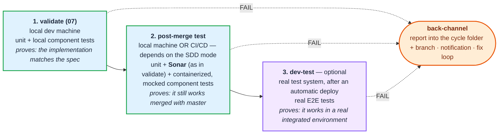

# „A ciklus utolsó fázisa nem csak merge" — izolált és központosított SDD

> **Státusz: VÉGREHAJTÁSRA KÉSZ (2026-09-21) — a végrehajtás még nem indult el.**
> A követelmények (3–5. szakasz), a **huszonegy** tervezési döntés (`L13-D1`–`L13-D21`,
> 8. szakasz) és a **pipálható task-lista** (9.c) megvannak; **tervezési** kérdés nincs nyitva.
> A végrehajtás közben eldöntendő, **nem tervezési** kérdések a 8.b szakaszban állnak (`Q19`–`Q22`),
> és a 9.c-ben `⛔` jelöli az ezekre váró tételeket.
>
> **Amit ez a fájl tartalmaz:** (1) a Felhasználó követelményei tételesen — `VP1`–`VP3` (a három
> teszt-kör), `RM-NN` (a közös review-and-merge gépezet), `CS-NN` (a központosított út);
> (2) a repó mért állapota, ami ezeket érinti (6. szakasz); (3) a **lezárt döntések** (8. szakasz),
> amelyek a követelmények egy részét **felülírják** — ütközésnél **a döntés nyer**.
>
> **Előzmény:** `prompts/inprove-list12.md` (a quick-flow visszarövidítése) — végrehajtva.
> Ez a kör **ad**, nem vesz el; a quick-flow méret-korlátja (`7/q`, ≤ 445 telepített sor)
> ezért közvetlen korlát, ha a `7/o` kérdésre („igaz-e a másik útra is?") igen a válasz.

---

## 0. Hogyan használd ezt a dokumentumot

1. **A 2. szakasz a fogalmi keret** (három teszt-kör, két üzemmód, két skill-topológia) — enélkül
   a többi tétel önkényesnek tűnik.
2. A `VP`/`RM`/`CS` tételek a **Felhasználó szavai**. Ha valamelyik átfogalmazásra szorul, azt a
   10. szakaszba (napló) írd, ne írd felül a tételt.
3. A 6. szakasz **mérés**, nem vélemény: minden állítás mellett ott a fájl és a sor, ahol
   ellenőrizhető.
4. **Ütközésnél a 8. szakasz döntése nyer** a 3–5. szakasz követelmény-tételei felett. Három
   tételt a döntések kifejezetten felülírtak: `RM4` (2.3), `RM7` (`L13-D2`), valamint az
   `RM5`/`RM6`/`RM8/b`/`RM10` sorrendje (`L13-D14`).
5. **Ha üres kontextusból indulsz:** olvasd el a fejlécet, a 2. szakaszt, a 3.1 kanonikus
   `conventions.md` blokkot, majd a 8. szakasz **összes** döntését — utána a 9. csomaghatárokat és
   a **9.c pipálható task-listát**, ami a tényleges munkalista. A 6. szakasz mérései akkor
   kellenek, amikor egy konkrét fájlhoz nyúlsz; a 9.b a README-teendők sorszintű leírása.
6. **Pipálj a 9.c-ben minden elvégzett tétel után** — ez a dokumentum egyetlen olyan része,
   amit a végrehajtás közben írni kell.

---

## 0.1 A hivatkozott keret-azonosítók — hol nézd meg őket

> Ez a dokumentum a keret meglévő szabályaira hivatkozik a rövid azonosítóikkal. **Nem másolja át
> őket** — ha egy hivatkozás nem világos, itt találod meg a forrását. Az azonosítók a `prompts/`
> fában élnek, tehát a `-hu` és a `-en` fa **ugyanott** hordozza őket.

| azonosító(k) | mit rögzít | hol nézd meg |
|---|---|---|
| `7/*` (pl. `7/m`, `7/o`, `7/q`) · `D6` · `D13` | a keret tervezési elvei | `prompts/meta-improve-prompts.md` → „Tervezési elvek" |
| `D8` · `KT1`–`KT6` | a bizonyíték-tűzfal és a cikluson kívüli futtatás | `prompts/skills-{hu,en}/run-tests.md` + a meta-prompt script-táblája |
| `PH1` · `TP4/b` · `TS1`–`TS8` · `TA1` · `TI1` | a plan teszt-fele, a gépi futtatási tábla | `prompts/skills-{hu,en}/03b-write-test-plan.md` |
| `KO1` · `WY1` · `KF1` · `SC1` · `KX2` · `KX3` | a plan kód-fele | `prompts/skills-{hu,en}/03a-write-code-plan.md` + `shared-*/dereferencing.md` |
| `RV1` · `RV-INC` · `VD3a` · `VD5` · `VD7` · `VD11` · `VD13` | a `07` validate-hurok és a review | `prompts/skills-{hu,en}/07-validate.md`, `prompts/agents-{hu,en}/reviewer.md` |
| `TR3` · `TR5/b` · `TR6` · `TR7` · `EV3`–`EV8` · `RL1`/`RL2` | riport-artefaktumok és környezet-szabályok | `prompts/lang/{hu,en}/00-init-project.md` (a `conventions.md` sablonja) |
| `TC1`–`TC13` (kiemelten `TC1/c`, `TC6`, `TC8`) · `DS22` · `DS23.2` · `LD5` · `LD6` | doc-sync, `test-conventions.md`, teszt-leltár | `prompts/skills-{hu,en}/08-doc-sync.md` |
| `RD8` · `W1` · `W2` · `W3` | a mai merge-fázis szabályai | `prompts/skills-{hu,en}/09-merge.md` |
| `PE1` | a fázis-záró commit és a fázishatár | `prompts/shared-{hu,en}/phase-commit.md` |
| `BQ2`–`BQ7` · `BD*` · `PW1`–`PW5` | ciklusszám, branch-preflight, párhuzamos worktree | `prompts/skills-{hu,en}/01-add-cycles.md` + `shared-*/git-preflight.md`, `parallel-cycles.md` |
| `QF1`–`QF22` · `QT1`–`QT6` | a quick-flow szabályai | `prompts/skills-{hu,en}/quick-flow.md` + `prompts/inprove-list10.md`, `inprove-list12.md` |
| `RP1` · `GC1` · `AV1` · `IM1` · `IP1` | közös shared-blokkok | `prompts/shared-{hu,en}/` (a meta-prompt shared-táblája mondja meg, melyik fájl) |
| `TS` (túlélés-szabály) · `AF-NN`/`AX-NN` | az `05` analyze-hurok eszkalációja | `prompts/skills-{hu,en}/05-analyze.md` |

**Két kötelező olvasnivaló a végrehajtás előtt** (a meta-prompt is ezt írja elő): a repó
gyökerében a `README-HU.md` / `README.md` (a felhasználónak szánt leírás) és a
`berki-spec-directory-structure.md` (mi hova települ, és melyik fájl kinek a tulajdona).

---

## 1. A kiváltó megfigyelés

A ciklus utolsó fázisát ma `merge`-nek hívjuk (`09-merge`, `/bs-merge`), és a fázis tartalma
tényleg csak a beolvasztás: kapuk ellenőrzése → megerősítés → lokális squash vagy PR-nyitás →
roadmap-lezárás.

**Enterprise környezetbe becsatornázott SDD esetében ez biztosan nem így néz ki.** A
visszaintegrálás ott nem a fejlesztő gépén záruló egyetlen lépés, hanem egy folyamat, amibe
külső szereplők (PR-elfogadó, CI/CD, központi build, integrált dev-környezet) is beleszólnak.

**Megjegyzés a kiinduló ábrához:** a README mermaid-ábrájában a 9-es csomópont felirata ma
`9. Review and Merge (reviewer agent and merge)` (`README-HU.md:314`, `README.md:308`) — ez
**már ma is elavult**: az `RV1` óta a `reviewer` subagent és a review-hurok a `07-validate`-ben
fut, a `09` pedig csak kaput ellenőriz és beolvaszt.

---

## 2. A fogalmi keret — három teszt-kör, két üzemmód, két skill-topológia

### 2.1 Három teszt-kör, három különböző bizonyítási céllal (`VP1`–`VP3`)

A `bs` SDD-ben **három helyen tesztelünk, három különböző okból**:

| | mikor | hol | mit bizonyít |
|---|---|---|---|
| **`VP1`** | implementáció után | lokálisan | hogy **funkcionálisan az készült el**, ami a spec-ben szerepelt |
| **`VP2`** | a master merge után | lokálisan (izolált) **vagy** CI teszt-node-on (központosított) | hogy **a master ággal egyesítve** is mindenben a spec szerint működik — tesztek **és Sonar** (statikus réteg, ahogy a `07`-ben) |
| **`VP3`** | master push és dev-telepítés után | integrált dev-környezet | hogy **valódi integrált környezetben** is a spec szerint fut minden |

- **`VP1` ma is létezik:** ez a `07-validate` (és a `06` dev-hurka). Nem változik.
- **`VP2` új.** Ez az, amit az első kör `RM6`-ként írt le.
- **`VP3` új**, és **csak a központosított úton** értelmes: a `bs-dev-test` (`CS5`).

### 2.2 Két üzemmód

- **izolált SDD** — minden a fejlesztő gépén fut a merge-ig, a kódreview-t is beleértve;
- **központosított SDD** — a PR feladása triggereli a CI/CD-t, és a review + merge **távoli
  gépen, gépi futtatásban**, emberi beavatkozás nélkül megy (5. szakasz).

### 2.3 Két skill-topológia — a PR megléte dönti el

| | PR **nincs** | PR **van** |
|---|---|---|
| skillek | **`bs-review-and-merge`** (egy skill) | **`bs-create-pr`** → **`bs-review`** → **`bs-merge`** (három skill) |
| `VP2` helye | a `bs-review-and-merge`-en belül, **a beolvasztás ELŐTT**, a ciklus ágán (`L13-D14`) | a **`bs-merge`** fázisban, **a push ELŐTT**, a ciklus ágán (`L13-D6`) |
| ki futtatja | a fejlesztő gépe | izolált: a fejlesztő gépe · központosított: a CI/CD |

**🔴 Ez felülírja az első kör `RM4` tételét.** Az első leírásban a PR-es út úgy szerepelt, mint
egy **megszakított** `bs-review-and-merge` fázis (PR-elfogadásig áll, utána folytatódik). A
pontosítás szerint a PR-es úton **három külön skill** van — a „megszakítás" tehát nem
fázison belüli állapot, hanem **skill-határ**. Ez egyben a legjobb megszakadás-tűrés (13. elv):
a lemezen hagyott nyom maga a fázis-határ, nem egy marker. **Az izolált, de PR-es útra is ez
igaz** — a topológiát a PR megléte dönti el, nem az üzemmód (`L13-D1`).

---

## 3. A `conventions.md` `## Review and merge` szekciója (`RM8`)

**A `conventions.md`-be kell egy `## Review and merge` szekció**, ahol **kötött formában,
angolul** tisztázzuk a következőket:

**`RM8/a` — Van-e PR feladás, vagy kapásból vissza a masterre a lokális gépen?**
- Ha **nincs** PR feladás → a `bs-review-and-merge` skillt kell használni.
- Ha **van** PR feladás → a review és a PR feladás **két külön lépés**:
  `bs-create-pr` → `bs-review` → `bs-merge`.

**`RM8/b` — Van-e teszt-futtatás a master befrissítése után (`VP2`)?** Ha van:
- **lokális futtatás esetén:** a `bs-review-and-merge`-en belül lefutnak az erre a **plan-ben
  megjelölt** tesztek. Mivel minden lokális, **nem kötelező**, hogy a tesztek konténerizáltak
  legyenek (`RM10`). *(Az „utolsó lépés" megfogalmazást az `L13-D14` pontosította: a `VP2` a
  ciklus ágán, a beolvasztás **előtt** fut.)*
- **központosított SDD esetén:** a tesztek a **`bs-merge`** fázisban futnak, és tipikusan
  **teljesen konténerizálhatónak** kell lenniük (`CS4`).

**`RM8/c` — Kihagyhatóság:** ha a **masteren nem történt változás**, a tesztek **ki is
hagyhatóak** lokális tesztek merge-e esetén. Ezt a kapcsolót **ugyanebben a szekcióban** kell
rögzíteni (`RM11`).

**`RM8/d` — Van-e `bs-dev-test` (`VP3`)?** Csak központosított úton értelmes, **opcionális**
(`CS5`).

> *Mérés:* a `conventions.md`-t a `00-init-project` hozza létre, és a szekció-nevek a
> `status-keys.json` `<sec:…>` tokenjeiből oldódnak fel — **új szekció → előbb kulcs a JSON-ba,
> mindkét nyelvi szeletbe, csak utána token**. A „kötött forma, angolul" hatókörét az `L13-D2`
> rögzíti: a szekciónév, a mezőnevek **és** az értékkészletek angol literálok.

> **⚠ Ez a szakasz a követelményt rögzíti, nem a végleges mezőkészletet.** A későbbi döntések
> további mezőket tettek hozzá (`Notification*` — `L13-D11`; `CI agent*` — `L13-D12`/`L13-D13`;
> `Failure handling` — `L13-D10`). **A kanonikus, teljes szekció a 3.1-ben áll** — implementáláskor
> azt másold, ne ezt.

### 3.1 A kanonikus `## Review and merge` szekció — EZT másold

> Ez a szakasz a **teljes, végleges** mezőkészlet, a döntések összefésülésével. A 3. szakasz
> fenti tételei (`RM8/a`–`RM8/d`) a **követelményt** rögzítik; implementáláskor ez a blokk az
> igazságforrás. **Angol literálok** (`L13-D2`), a magyarázó dőlt próza projekt-nyelvű.

```markdown
## Review and merge

- **PR submission:** yes | no
- **SDD mode:** isolated | centralized
- **Post-merge tests:** yes | no
- **Skip post-merge tests if master unchanged:** yes | no
- **Dev deployment test (bs-dev-test):** yes | no | n/a
- **Failure handling:** notify | auto-fix-loop
- **Notification channel:** slack | teams | command | none
- **Notification secret (env var):** BS_NOTIFY_WEBHOOK
- **Notification command:** _(csak ha a csatorna `command`)_
- **CI agent:** claude-code | cursor | copilot | antigravity | command
- **CI agent command:** _(csak ha a `CI agent` értéke `command`)_
```

| mező | mit dönt el | döntés |
|---|---|---|
| `PR submission` | egy skill (`bs-review-and-merge`) vagy három (`bs-create-pr` → `bs-review` → `bs-merge`) | `L13-D1` |
| `SDD mode` | hol fut a review és a merge; az `RD8` megerősítés formája | `L13-D5` |
| `Post-merge tests` | van-e `VP2` kör *(hogy mely tesztek, azt a plan `Fázis` oszlopa / a `spec-plan.md`)* | `RM8/b`, `L13-D3`, `L13-D17` |
| `Skip post-merge tests if master unchanged` | változatlan master esetén kihagyható-e a `VP2` | `RM11` |
| `Dev deployment test (bs-dev-test)` | van-e `VP3` — csak `centralized` mellett értelmes | `CS5` |
| `Failure handling` | `notify` (alap) vagy `auto-fix-loop` | `L13-D10` |
| `Notification channel` / `secret` / `command` | hogyan értesítünk; a titok **env var neve**, sosem az értéke | `L13-D11` |
| `CI agent` / `CI agent command` | mit hív a `ci-run-skill.sh`; a `00` **ki is próbálja** (`--selftest`) | `L13-D12`, `L13-D13` |

**Érvényességi szabályok, amiket a `00-init-project` érvényesít:**
- `SDD mode: centralized` + `PR submission: no` → **elutasítva** (a központosított út
  definíció szerint PR-triggerelt) — `L13-D1`;
- `Dev deployment test: yes` + `SDD mode: isolated` → **elutasítva** (`VP3` csak központosított
  úton értelmes) — `CS5`;
- `Notification channel` ≠ `none` esetén a `Notification secret (env var)` **kötelező**, és a
  `notify.py` hiányzó env varra beszédes hibával áll meg — `L13-D11`;
- **No-VCS projekt:** az egész szekció `n/a`, a család egyetlen skillje sem fut — `L13-D20`;
- a `00` **kipróbálja** a `CI agent`-et (`ci-run-skill.sh --selftest`) és az értesítést, ahogy ma a
  merge-szolgáltató access-ét is — `L13-D12`.

---

## 4. Izolált SDD

**`RM1` — `bs-review-and-merge` skill.** PR nélküli úton ez az egyetlen skill, ami a review-t és
a masterre juttatást elvégzi.

**`RM2` — minden a fejlesztő gépén.** A teljes folyamat — **a kódreview-t is beleértve** — azon
a laptopon fut, amelyik az SDD-t futtatja.
→ *Mérés:* ez a mai működés (a `07` `reviewer` subagentje lokálisan fut). Az `RM2` tehát nem
viselkedésváltozás, hanem **kimondott üzemmód-definíció**, ami a központosított úttal állítható
szembe.

**`RM3` — PR-rel vagy PR nélkül, de ugyanazon a gépen.** A különbség nem az, hogy hol történik a
review, hanem hogy van-e külső elfogadási pont.

**`RM4` — *(felülírva a 2.3 szakaszban)*.** Eredeti megfogalmazás: PR esetén a fázis megszakad a
PR elfogadásáig, majd folytatódik. A pontosítás szerint ezt a **három skill** váltja ki.

**`RM5` — utolsó előtti lépés: rebase a masterre, visszavezetés, PR után merge.**
→ *Mérés:* ennek a fele ma is megvan — a `09` `1.b Integrációs frissítés (W2)` lépése behozza a
fő branch-et (rebase, ha nincs push/PR; merge, ha van), és újravalidálásra irányít vissza.
→ **Pontosítva (`L13-D14`):** a „master befrissítése" a `main` **behozása a ciklus ágába**, nem a
`main`-re olvasztás; és a **beolvasztás az utolsó lépés**, nem az utolsó előtti — a `VP2` előzi meg.

**`RM6` → `VP2`.** A merge utáni újraépítés + teszt-kör; lásd 2.1. → **Pontosítva (`L13-D14`):**
a kör a ciklus ágán fut, a friss masterrel egyesített kódon, **a beolvasztás előtt**.

**`RM7` → `RM8/b`.** A kötelezőség a `conventions.md` `## Review and merge` szekciójában dől el.
*(Az első kör ezt a `test-conventions.md`-be tette; a pontosítás a `conventions.md`-be helyezi —
ez feloldja azt az ellentmondást, hogy a `test-conventions.md` a `08-doc-sync` kizárólagos
tulajdona és az init pillanatában tipikusan nem is létezik (`TC6`). A **recept** — hogyan fut, mi kell hozzá —
továbbra is a `test-conventions.md`-be tartozhat, ha a `08` promótálja.)*

**`RM10` — a lokális `VP2` futtatása.** A `bs-review-and-merge` utolsó lépéseként a **plan-ben
megjelölt** tesztek futnak. **Nem kötelező konténerizáltnak lenniük.**
→ *Mérés:* a plan gépi futtatási táblájának már **van** `<field:f_phase>` oszlopa (`PH1`,
`03b-write-test-plan.md:313`) három értékkel — `implement` · `validate` · `mindkettő` —, és a
`run-tests.py --phase` szűr rá. Az `RM10` tehát egy **negyedik értéket** kér. Két
mellékhatás: (a) a `mindkettő`/`both` érték **kétértelművé válik**; (b) ma „**az üres cella
`mindkettő`-t jelent** — a hallgatás soha nem jelent kihagyást", ami a post-merge körre
nyilván nem tartható (különben minden teszt konténerizálandó lenne a központosított úton).
→ **Eldöntve:** `L13-D3` — a `Fázis` oszlop kötelező és explicit lett, a `mindkettő` megszűnt.

**`RM11` — kihagyhatóság változatlan master esetén.** Ha a masteren nem történt változás, a
lokális `VP2` kihagyható; a kapcsoló az `RM8/c`.
→ *Mérés:* a „változott-e a master" kérdést a `09` ma is felteszi (`git log HEAD..origin/main`,
`1.b` lépés) — a döntési pont tehát megvan, csak a következménye új.

---

## 5. Központosított SDD

**`CS1` — a PR feladása triggereli a CI/CD-t.** A `bs-review` és a `bs-merge` **távoli gépen**,
CI/CD keretében fut.

**`CS2` — a PR-t feldolgozó automatizmus klónozza a teljes git repót**, majd a PR-re futtatja a
`bs-review` skillt. **Ezt már gép futtatja, emberi beavatkozás nélkül.**

**`CS3` — utána jöhet a `bs-merge` skill**, szintén gépi futtatásban.

**`CS4` — a `VP2` tesztek a `bs-merge` fázisban futnak, konténerizáltan.** Egy teszt node-on
`compose`-zal fel kell húzni egy **teljes, mockokkal ellátott teszt környezetet**, és abban
futtatni a teszteket **már a masteres kóddal együtt**.

**`CS5` — `bs-dev-test` (`VP3`) — opcionális utolsó lépés a sikeres merge után.** Egy
automatizmussal telepíteni kell a terméket egy **teljesen integrált teszt környezetbe**, és
**valódi e2e teszteket** futtatni rá.

**`CS6` — hibakezelés, „A" változat: bizonyíték + értesítés.** Ha a `VP2` vagy a `VP3` körben,
vagy a központosított review-ban **hiba történik**, akkor:
- az adott teszt-fázis vagy review eredményét **commitolni kell egy `.md` fájlba**, ami a
  **ciklus mappájába** és a **ciklus git branch-ébe** kerül;
- a fejlesztőt **valamilyen szabványosított módon értesíteni kell**.

**`CS7` — hibakezelés, „B" változat: automatikus javító hurok.** A másik lehetőség, hogy
**automatikus javító hurok indul be a CI/CD szerveren**, és csak akkor küldjük vissza a
fejlesztőnek, ha **emberi beavatkozás kell**.
→ **Eldöntve (`L13-D10`):** a `CS6` (`notify`) az alapértelmezés, a `CS7` (`auto-fix-loop`)
kapcsolható a `Failure handling` mezővel — és bekapcsolva örökli a `07` hurkának leállási korlátait.

---

## 6. Mérés — a repó mai állapota, ami ezeket a tételeket érinti

### 6.1 A mai `09-merge` felépítése

`prompts/skills-hu/09-merge.md` (186 sor) + `prompts/skills-en/09-merge.md`:

| lépés | mit csinál | érintettség |
|---|---|---|
| Előfeltételek 0–5 | ciklus-beazonosítás, `conventions.md`, munkafa, worktree (W1), státusz-kapu, review-kapu (RV1), doc-sync kapu | a három skill között **szét kell osztani** |
| 1. Merge előtti doc-sync (DS23.2) | változott-e kód a `08` óta → újrafuttatás | `bs-create-pr` vagy `bs-merge`? |
| 1.b Integrációs frissítés (W2) | `git log HEAD..origin/main` → rebase **vagy** merge, majd újravalidálás `07`/`08`-on | **`RM5`** + az `RM11` döntési pontja |
| 2. Merge | RD8 megerősítés → **A)** lokális squash + branch törlés, **vagy** **B)** PR nyitás — *és itt a fázis véget ér* | a **B)** ág önálló skill lesz (`bs-create-pr`, 2.3 / `L13-D1`); az RD8 üzemmód-függővé válik (`L13-D5`); a branch-törlés a `VP2` mögé kerül (`L13-D7`) |
| Merge conflict | 4 lépéses szabály, nem egyértelmű feloldásnál STOP | marad |
| Roadmap | a ciklus lezárása `✅` / `(kész)` jelöléssel | a `VP2` **után** |
| Státusz kezelés | záró üzenet (`lang/{hu,en}/09-merge.md#zaro-uzenet`) | skillenként külön |

**A fázisnak ma nincs subagentje és nincs hurka** — a bukó kapu visszairányít a `07`-re vagy a
`08`-ra. A `CS7` (automatikus javító hurok a CI-n) ezt a modellt nyitja meg.

### 6.2 RD8 — a kézi megerősítés ütközik a gépi futtatással

A mai `09` szó szerint: *„Bármelyik ágon a merge előtt **KÖTELEZŐ a felhasználói megerősítés**"*
(RD8), és ez a keret egyik legrégebbi biztonsági szabálya. A `CS3` viszont **emberi beavatkozás
nélküli** gépi merge-öt ír elő. Az RD8-nak tehát **üzemmód-függővé** kell válnia — vagy a
megerősítés szerepét a **PR elfogadása** veszi át (az is emberi döntés, csak máshol).
→ **Eldöntve:** `L13-D5`.

### 6.3 A plan gépi futtatási táblája — a `VP2` jelölésének természetes helye

`<field:f_phase>` oszlop (`PH1`), három érték a `status-keys.json`-ban
(`prompts/lang/status-keys.json:213`–`:215` hu, `:429`–`:431` en):
`phase_implement` = `implement` · `phase_validate` = `validate` · `phase_both` = `mindkettő`/`both`.
A `run-tests.py` a `--phase` kapcsolóval szűr. **Egy negyedik érték (`post-merge`) beilleszthető**,
de két dolgot eldönt: a `both` jelentését és az üres cella jelentését (`RM10`).
→ **Eldöntve:** `L13-D3` (mindkettő megszűnik, a cella kötelező) + `L13-D18` (legacy olvasás WARN-nal).

### 6.4 A `test-runs/` fa és a `D8`/`KT6` bizonyíték-tűzfal

- **`/bs-run-tests`**: cikluson kívüli, kategóriánkénti futtatás a `conventions.md`
  `## Teszt-futtatás` projekt-szintű táblájából (`KT1`), `run-tests.py --table-source conventions`
  (`KT3`), a `test-runs/<kategória>/<UTC-időbélyeg>/<env>/` fába (`KT5`).
- **Tűzfal (`D8`/`KT6`):** az itt keletkező eredmény `"cycle": null`, és a `dod-check.py` /
  `report-gate-check.py` az ilyen útvonalat `exit 2`-vel visszautasítja.
- **Következmény:** a `test-runs/` fába írt eredmény **definíció szerint nem ciklus-bizonyíték** — a
  `CS6` viszont épp azt kéri, hogy a **ciklus mappájába és ágába** kerüljön.
  → **Eldöntve:** `L13-D4` — a `VP2`/`VP3` **nem** a `test-runs/` fába megy, hanem a ciklus
  `test-report/post-merge/` (ill. `test-report/dev-test/`) riport-fázisába, tehát a tűzfal
  érintetlen marad.

### 6.5 A `CS6` commit-célja a merge után eltűnhet

A `CS6` a ciklus mappájába **és a ciklus git branch-ébe** kéri a hiba-artefaktumot. Ám:
- a **lokális** ágon a `09` a merge után `git branch -D`-vel **törli** a ciklus ágát;
- a **`VP3`** (dev-test) definíció szerint **a merge után** fut — ekkor a változás már a
  masteren van, a PR le van zárva, az ág törölhető.
→ **Eldöntve:** `L13-D7` — a riport a **ciklus útvonalára** megy, a jármű pedig egy a masterről
nyitott `<ciklus-ág>-dev-test` ág; és az izolált úton a ciklus ágának törlése a `VP2` mögé kerül.

### 6.6 A `bs-review` gépi futtatása — előfeltételek, amiket ma semmi nem rögzít

A `CS2` „gép futtatja, emberi beavatkozás nélkül" követelménye a keretben **új**: minden mai
skill interaktív ágenst feltételez (fázis-kapuk, „várj a válaszra", RD8). A gépi futtatáshoz
tisztázandó: melyik CLI/ágens fut a CI-ben, milyen **nem-interaktív** módban, milyen
**shell-engedély-modellel**, és mi történik, ha a skill kérdezni akar.
→ **Eldöntve:** `L13-D12` (`ci-run-skill.sh` adapter, előre tisztázott `CI agent:`, „kérdés = STOP")
és `L13-D13` (mind a négy platform, `--selftest`, és a verdikt a kapuktól jön).

### 6.7 Az átnevezés / szétvágás ripple-listája

| hol | mi |
|---|---|
| `prompts/skills-{hu,en}/09-merge.md` | egy fájlból **kettő vagy négy** lesz (`bs-review-and-merge`, `bs-create-pr`, `bs-review`, `bs-merge`) + opcionálisan `bs-dev-test` |
| `prompts/lang/{hu,en}/09-merge.md` | horgony-fájl(ok) szétvágása (`#RD8-merge-megerosites`, `#zaro-uzenet`) |
| `prompts/lang/{hu,en}/descriptions.json` | `"bs-merge"` kulcs → több kulcs |
| `prompts/lang/status-keys.json` | új `<sec:…>` kulcs a `## Review and merge` szekcióhoz + a `phase_post_merge` érték |
| `prompts/skills-{hu,en}/08-doc-sync.md` | `next: bs-merge` frontmatter + törzs |
| `prompts/skills-{hu,en}/07-validate.md` | törzs-hivatkozások |
| `prompts/shared-{hu,en}/conventions-change.md` | `09-merge` hivatkozás |
| `prompts/scripts/cycle-status.py` | a `Merge` sor címkéje és bizonyítéka (`:361`–`:375`) — több fázisra bomlik |
| `prompts/scripts/run-tests.py` | a `--phase` negyedik értéke (`post-merge`); az üres cella többé nem old fel (`L13-D3`, `L13-D18`) |
| `prompts/scripts/analyze-gate-check.py` | a `PH1` check „üres = rendben" ága → FAIL (`L13-D3`) |
| `prompts/scripts/report-gate-check.py` | a `post-merge` / `dev-test` riport-fázis elfogadása (`L13-D4`) |
| `prompts/scripts/sonar-gate.py` | hívás a `VP2` körből is, változatlan küszöbökkel |
| `prompts/scripts/cycle-status.py` | a `--write` mód (`L13-D9`) + a `## Review and merge` szekció olvasása |
| **ÚJ:** `prompts/scripts/ci-run-skill.sh` | négy platform + `command`, `--selftest` (`L13-D12`, `L13-D13`) |
| **ÚJ:** `prompts/scripts/notify.py` | `--channel slack\|teams\|command` (`L13-D11`) |
| `prompts/skills-{hu,en}/03b-write-test-plan.md` | a `<field:f_phase>` leírása (`L13-D3`) |
| `prompts/skills-{hu,en}/quick-flow.md` | kötelező merge-ág a végén (`L13-D16`) + `## Merge tesztek` a `spec-plan.md`-ben (`L13-D17`) — a `7/q` korláton belül |
| `prompts/lang/{hu,en}/quick-flow.md` | a `spec-plan.md` sablon-horgonya a `## Merge tesztek` szekcióval |
| `prompts/shared-{hu,en}/phase-commit.md` | a `cycle-status.md` regenerálása a fázis-záró commitnál (`L13-D15`) |
| `prompts/skills-{hu,en}/01-add-cycles.md` + `06`/`07` | a `tasks.md` `## Post-merge javítások` szekciója és a roadmap `⏳ verifikációra vár` jelölése (`L13-D8`) |
| `prompts/skills-{hu,en}/cycle-status.md` | a segédparancs `--write` módja (`L13-D9`) |
| `README-HU.md` · `README.md` | parancs-lista (`:267` / `:264`), mermaid 9-es csomópont (`:314` / `:308`), fájl-tábla (`:1051` / `:1041`), `subagents:` bekezdés (`:1117` / `:1107`), státusz-szekció (`:1455` / `:1444`), példa (`:905` / `:896`) |
| `berki-spec-directory-structure.md` | a telepített skill-mappák nevei |
| `prompts/meta-improve-prompts.md` | fázis-felsorolás, fájl-tábla, script-tábla, `7/*` |
| **telepített projektek** | a `.claude/skills/bs-merge/` mappa neve megváltozik → **nincs** visszafelé kompatibilitás, a frissítés újratelepítés (`L13-D19`) |

### 6.8 A másik út (`7/o`) — a quick-flow ma egyáltalán nem merge-el

A `bs-quick-flow` **nyit** feature branch-et (`quick-flow.md:101`), de a hét szekciójában
**egyetlen beolvasztó lépés sincs** — nincs merge, nincs PR, nincs roadmap-lezárás; a `bs-merge`-öt
nem hívja, és a segédparancs-listájában sem szerepel (`quick-flow.md:290`). **Ez önálló hézag**,
amit ez a kör hozott felszínre.
→ **Eldöntve:** `L13-D16` — a quick-flow után **kötelező** valamelyik merge-ág, `L13-D17` — a
teszt-válogatás a `spec-plan.md`-ből jön.

---

## 7. Amit ez a kör NEM érint (előzetes anti-lista)

- A `07-validate` review-hurka és a `reviewer` subagent **szerződése** (`RV1`, `RV-INC`) — a
  `CS2` a **futtatási környezetet** változtatja, nem az agent-promptot.
- A `VP1` (a mai `06`/`07` teszt-kör) tartalma és kapui.
- A `08-doc-sync` DS22/TC8/LD5 kapui.
- A `D8`/`KT6` bizonyíték-tűzfal **elve** — az `L13-D4` a következményt tisztázza, nem az elvet
  lazítja: a `VP2`/`VP3` bizonyítéka nem a `test-runs/` fából jön.
- A `conventions.md` mai `## Merge stratégia` mezői (szolgáltató, auth, target, merge típus) —
  ezek maradnak; a `## Review and merge` szekció **melléjük** kerül, nem helyettük.

---

## 8. Lezárt döntések

### `L13-D1` — A lépésszámot a felhasználó vezérli; egyetlen kemény kapu véd (2026-09-21)

**Az utolsó fázis egy vagy több lépésből áll-e, azt a felhasználó vezérli** — a keret nem
kényszerít topológiát. **Egyetlen kivétel:** ha a `conventions.md` `## Review and merge`
szekciója szerint a **PR kötelező**, a `bs-review-and-merge` skill **hibát ad**, és kimondja,
hogy csak osztott üzemmódban használható — mivel PR is van benne, mind a három lépés kell:
`bs-create-pr` → `bs-review` → `bs-merge`.

**Ezen felül a skillek nem kényszerítenek ki mást.** Az `L13-D1` három ellenőrzésre korlátozódik:

| hol | mit | keménység | miért ennyi |
|---|---|---|---|
| `bs-review-and-merge` eleje | `PR submission: yes` → STOP, irány a három lépéses lánc | **hiba** | a PR megkerülése **policy-sértés**, és a masterre nyomott kód utólag nem vonható vissza |
| `bs-create-pr` eleje | `PR submission: no` → **kérdés**, nem hiba | kérdés | a felesleges PR ártalmatlan és visszavonható — a két irány **nem szimmetrikus** |
| `bs-merge` eleje | a mai `RV1` review-kapu: létezik a `code-review.md`, nincs benne nyitott `<status:must_fix>` | **hiba** (ma is az) | ez **nem új** kikényszerítés, hanem a mai `09` előfeltételének a szétosztása: enélkül a három skillre vágás **elveszítené** azt a védelmet, ami ma megvan. A központosított úton ez az **egyetlen** védelem, mert ott nincs ember a hurokban |

**Ellentmondó konfiguráció nem a skillek dolga.** Az `SDD mode: centralized` + `PR submission: no`
kombinációt a **`00-init-project`** utasítsa vissza a szekció kitöltésekor (a központosított út
definíció szerint PR-triggerelt) — konfigurációs hibát a beírás pillanatában olcsóbb elkapni,
mint minden ciklus végén.

*(Ez a döntés lezárja a korábbi `Q1`-et, és megerősíti a 2.3 szakasz topológia-tábláját.)*

### `L13-D2` — A szekció kötött formája: gépi rész angol literál, magyarázat projekt-nyelvű (2026-09-21)

A `conventions.md` `## Review and merge` szekciójában **a szekciónév, a mezőnevek és az
értékkészletek angol literálok**, projekt-nyelvtől függetlenül; a magyarázó (dőlt) próza a
projekt nyelvén marad.

```markdown
## Review and merge

- **PR submission:** yes | no
- **SDD mode:** isolated | centralized
- **Post-merge tests:** yes | no
- **Skip post-merge tests if master unchanged:** yes | no
- **Dev deployment test (bs-dev-test):** yes | no | n/a
- **Failure handling:** notify | auto-fix-loop
```

**Miért:** amit gép olvas, az legyen nyelvfüggetlen — ez a keretben nem új, hanem a
`[local]`/`[remote]` jelölések (EV8) és a teszt-kategória-azonosítók (`unit`, `rest-e2e`, `ui`)
mintája, amiket kifejezetten **tilos lefordítani**, mert útvonalra és kapura joinolnak.

**Következmény a kétnyelvűségre:** ehhez a szekcióhoz **nem** kell `<field:…>` / `<status:…>`
kulcs a `status-keys.json`-ba (ellentétben a (b) változattal, ami mezőnként két kulcsot kért
volna mindkét nyelvi szeletbe). A `## Review and merge` **szekciónév** viszont `<sec:…>` kulcsot
kap, hogy a hivatkozó promptok tokennel írhassák — a kulcs **mindkét nyelvi szeletben ugyanazt
az angol literált** adja vissza.

**A mezőkészlet később bővült** — a kanonikus, teljes szekció a **3.1** szakaszban áll:
`Failure handling` (`L13-D10`), `Notification*` (`L13-D11`), `CI agent*` (`L13-D12`/`L13-D13`).
A `Post-merge tests` mező azt mondja meg, **van-e** kör; hogy **mely tesztek** futnak benne, azt a
plan `Fázis` oszlopa (`L13-D3`), quick-flow-ban a `spec-plan.md` (`L13-D17`).

---

### `L13-D3` — A `Fázis` oszlop kötelező és explicit; semmi nem implicit (2026-09-21)

**Semmi ne legyen implicit: minden teszt-sornál minden fázis egyértelműen jelölve legyen.**
Ez tágabb, mint a `post-merge` bevezetése — a mai `PH1` szabály **implicit ágát vezeti ki**.

**Ma (`03b-write-test-plan.md:313`, `run-tests.py:163`, `:619`):** három érték
(`implement` · `validate` · `mindkettő`), és **az üres cella `mindkettő`-t jelent** — „a
hallgatás soha nem jelent kihagyást".

**Ezután:**
- a `Fázis` cella **kötelezően kitöltött**; az **üres cella hiba**, nem alapértelmezés;
- az érték **explicit, vesszős felsorolás**: `implement`, `validate`, `post-merge` — tetszőleges
  kombinációban (`implement, validate`);
- a **`mindkettő`/`both` érték megszűnik**: négy fázis mellett a „mindkettő" eleve kétértelmű
  lenne, és épp az implicit jelentés az, amit ez a döntés kivezet.

**Amit ez megmozdít:**

| hol | mi |
|---|---|
| `prompts/lang/status-keys.json` | `+ phase_post_merge` (`post-merge`, mindkét szelet); a `phase_both` kivezetése |
| `prompts/scripts/run-tests.py` | `--phase` choices (`:619`) `+ post-merge`; a `row_phases()` (`:163`) többé **nem** old fel üres cellát; üres cella → hiba |
| `prompts/scripts/analyze-gate-check.py` | a `PH1` check „üres = rendben" ága → **FAIL** (`--plan-only`) |
| `prompts/skills-{hu,en}/03b-write-test-plan.md` | a `<field:f_phase>` leírása (`:313`) átírva |
| `prompts/lang/{hu,en}/00-init-project.md` | a projekt-szintű futtatási tábla kitöltési szabálya (`:193`) |

**A `conventions.md` projekt-szintű táblája kivétel — de explicit kivétel.** Ott a `Fázis`
oszlop értéke `—`, mert a **cikluson kívüli futásnak nincs fázisa**. Ez nem implicit érték,
hanem **kimondott jelölés** („nem fázis-kötött"), és biztonságos, mert a `/bs-run-tests` fázis-
szűrő nélkül (`--phase all`) hívja a szkriptet, tehát a `:673` szűrő ága le sem fut.

**Miért pont a `post-merge`-nél lett volna a legveszélyesebb az implicit ág:** a központosított
úton a merge utáni teszteknek **teljesen konténerizálhatónak** kell lenniük (`CS4`) — egy
jelöletlen teszt csendben beleeshetett volna a körbe, és ezzel minden tesztre ráterhelődött
volna a compose-os környezet követelménye.

**A meglévő projektek plan-tábláiról** (üres cella / `mindkettő`) az `L13-D18` rendelkezik:
olvasáskor WARN-nal elfogadott, írásra tiltott.

---

### `L13-D4` — A `VP2` bizonyítéka új riport-fázis: `test-report/post-merge/` (2026-09-21)

A merge utáni teszt-kör eredménye a **ciklus** `test-report/post-merge/` mappájába kerül —
ugyanazzal a gépezettel, ami ma az `implement` és a `validate` riport-fázisokat kezeli.
**Siker és bukás egyaránt nyomot hagy.**

**Miért nem elég a szó szerinti `CS6` (csak bukásnál `.md`):** aszimmetrikus bizonyítékot adna —
utólag megkülönböztethetetlen lenne a *lefutott és zöld volt* a *ki sem próbálták* esettől. Ez
ugyanaz a logika, mint az `L13-D3`: ha semmi nem implicit, akkor a siker sem maradhat jelöletlen.
A `CS6` commit-követelménye ettől **automatikusan teljesül**: a bukás riportja ennek a
készletnek a része, a ciklus mappájában és ágában.

**A `D8`/`KT6` tűzfal érintetlen marad**, mert ez az artefaktum **nem a `test-runs/` fából jön**:
a `run-tests.py` a ciklus `test-report/`-jába ír (`--round-dir`), tehát a `"cycle"` mező kitöltött,
és a `report-gate-check.py` nem utasítja vissza. A tűzfal továbbra is pontosan azt tiltja, amire
való: hogy egy kényelmi `/bs-run-tests` futás ciklust zárjon le.

**Amit ez megmozdít:**

| hol | mi |
|---|---|
| `conventions.md` `**Riport-fázisok:**` mező (TR6) | harmadik elfogadott érték: `post-merge` (a mai `implement` · `validate` mellé, vesszős felsorolásban — az `L13-D3` alakja) |
| `prompts/scripts/report-gate-check.py` | a `post-merge` fázis-mappa elfogadása |
| `prompts/scripts/run-tests.py` | a `{phase}` helyőrző `post-merge`-re oldása (a `validate/round-NN` és `implement` mellé) |
| `prompts/lang/{hu,en}/00-init-project.md` | a TR6 mező leírása |

**A `VP3` (dev-test) eredményének a helye:** `L13-D7` — `test-report/dev-test/` a ciklus
útvonalán, egy a masterről nyitott `<ciklus-ág>-dev-test` ágon (a ciklus ága ekkor már törölve lehet,
lásd 6.5).

---

### `L13-D5` — Az `RD8` kézi megerősítés üzemmód-függővé válik (2026-09-21)

| `SDD mode` | mi erősít meg |
|---|---|
| `isolated` | **a felhasználó**, a mai `RD8` szerint — kötelező, explicit megerősítés a merge előtt |
| `centralized` | **a PR elfogadása** — ez veszi át az `RD8` szerepét |

**Ez nem a szabály lazítása, hanem a döntési pont áthelyezése.** A PR elfogadása ugyanúgy emberi
döntés, csak korábban és máshol történik, és **nyoma marad a szolgáltatónál** — míg a mai `RD8`
megerősítése egy beszélgetésben él, ami a `/clear`-t nem éli túl.

**Hogy a garancia mérhető maradjon:** a gépi `bs-merge` belépő kapuja **ellenőrizze a PR állapotát**
(elfogadott-e, teljesültek-e a branch-védelmi követelmények), és ha nem az, **álljon meg**. Enélkül
az `RD8` nem áthelyeződne, hanem eltűnne — a központosított úton pedig nincs ember a hurokban, aki
ezt észrevenné. Ez ugyanaz a mintázat, mint az `L13-D1` `bs-merge` review-kapuja.

**Miért nem a „platform auto-merge" változat:** csábító lett volna a szabályt érintetlenül hagyni
úgy, hogy a keret sosem merge-el gépileg, csak előkészít, és a beolvasztást a PR-platform
auto-merge funkciója végzi. Ekkor viszont a `VP2` tesztek **a beolvasztás előtt** futnának — pont
azt veszítenénk el, amiért a `VP2` van: a teszteknek **a masteres kóddal együtt** kell futniuk
(`CS4`).

**Amit ez megmozdít:** a `09` „Megerősítés (mindkét ágon kötelező)" szekciója és a
`lang/{hu,en}/09-merge.md#RD8-merge-megerosites` horgony — a `bs-merge` skillben ez feltételessé
válik, és a központosított ágon a PR-állapot ellenőrzése lép a helyére.

---

### `L13-D6` — Központosított úton a `VP2` a push ELŐTTI kapu (2026-09-21)

A CI a saját klónjában olvasztja be a mastert (ill. a PR-t a masterbe), **lokálisan** húzza fel a
compose-os környezetet (`CS4`), futtatja a `VP2`-t — és **csak zöld eredmény után** tolja fel a
mastert a központi repóba.

**Miért:** bukásnál a közös master **érintetlen marad**, a PR nyitva, a ciklus ága él — tehát a
`CS6` „commitold a ciklus ágába" követelménye **magától teljesül**, és nem törött masterből kell
visszajönni.

**⚠ Az itt eredetileg szereplő megjegyzést („az izolált úton nincs választás, ott a laptop mastere
már megkapta a merge-öt") az `L13-D14` felülírta:** az izolált úton **is** a ciklus ágán fut a
`VP2`, a beolvasztás előtt. **A két üzemmód sorrendje azonos** — ez a `Q15` (második squash merge)
feloldása is.

---

### `L13-D7` — A riport a ciklus ÚTVONALÁRA megy; a jármű változik (2026-09-21)

**A ciklus mappája túléli a ciklus ágát:** a `specs/cycle-NN-<name>/` a merge után a masteren
él, ugyanazon az útvonalon. „Vissza a ciklushoz" tehát nem az ágat jelenti, hanem az **útvonalat**
— az ág csak jármű, ha a master védett.

| hol bukott | jármű | riport útvonala |
|---|---|---|
| **központosított, PR-feldolgozás közben** (`VP2`) | a ciklus ága él (`L13-D6`) → ha mégis új ág kell: `<ciklus-ág>-post-merge` | `specs/cycle-NN-<name>/test-report/post-merge/` |
| **dev-teszt fázis** (`VP3`) | új ág a masterről: `<ciklus-ág>-dev-test` | `specs/cycle-NN-<name>/test-report/dev-test/` |
| **izolált, lokális `bs-review-and-merge`** | **mindig ugyanaz az ág** — nincs új ág | `specs/cycle-NN-<name>/test-report/post-merge/` |

**🔴 Következmény az izolált útra:** ha mindig ugyanazon az ágon maradunk, akkor a ciklus ágát
**nem szabad törölni a `VP2` zöldje előtt**. A mai `09` a lokális squash merge után azonnal
`git branch -D`-zik — ez a lépés **a verifikáció mögé kerül**.

**Amit NEM választunk:** `git notes` a merge-commiton (technikailag erre való, de olvashatatlan és
a tooling sem támogatja); külön `reports/` orphan ág (elszakítja a bizonyítékot a ciklusmappától);
csak PR-komment vagy CI-artefaktum (nem verziózott — a `CS6` „commitolni kell" követelményét nem
teljesíti; **értesítésként** viszont hasznos, lásd `L13-D11`).

---

### `L13-D8` — A ciklus akkor kész, ha az UTOLSÓ engedélyezett verifikáció zöld (2026-09-21)

Ma a ciklus a `07` PASS-nál lesz „Kész", és a merge csak adminisztráció. Az új képben a `07` csak
az **első** bizonyítási pont (`VP1`) — ha a `VP2`/`VP3` még hátravan, a ciklus **nincs
bizonyítva**, tehát nem is kész. **A roadmap `✅`-je ma előrefut.**

- A ciklus lezárása a `conventions.md`-ben **engedélyezett utolsó** verifikációs pont zöldjekor
  történik (`VP1`, `VP2` vagy `VP3` — amelyik az utolsó bekapcsolt).
- Addig a roadmapen látható köztes jelölés áll (pl. `⏳ verifikációra vár`), amit a
  `bs-cycle-status` is mutat.

**A javító kör így nem visszanyitás, hanem a még nyitott ciklus folytatása:**
- **nem** új ciklus (ugyanannak a munkadarabnak a bizonyítása folyik, csak még nem sikerült);
- új ág a `L13-D7` szerinti postfix-szel (izolált úton ugyanaz az ág);
- a munkalista a `tasks.md` **új szekciója**: `## Post-merge javítások` — a mai
  `## Validációs javítások` (`implement-fixer`) és `## Review javítások` (`review-fixer`) mintájára,
  **ezért futtatható rajta a `06` és a `07` változatlanul**: pontosan ezt a belépőt ismerik ma is;
- a bizonyíték végig a ciklusmappában marad.

**A kimondott kivétel, különben sosem zárul semmi:** ha a bukás **nem ehhez a ciklushoz tartozik**
(másik ciklus regressziója, környezeti hiba), akkor **új ciklus** indul rá, és ez a ciklus
lezárható. A döntés emberi, a riport alapján.

**A dokumentum-státuszokról** a merge és az utolsó verifikáció között az `L13-D9` rendelkezik:
maradnak `Kész`-en, a várakozást a generált `cycle-status.md` és a roadmap ciklus-sora hordozza —
így egyetlen `Kész`-t váró kapu sem bővül tételesen.

---

### `L13-D9` — Generált `cycle-status.md` a ciklus mappájának gyökerében (2026-09-21)

**Új artefaktum:** `specs/cycle-NN-<name>/cycle-status.md` — mi futott le, mi van hátra, és egy
**overall status**.

**🔴 Generált fájl, nem kézzel írt.** A `cycle-status.py` kap egy **`--write` módot**, ami
ugyanabból a bizonyítékból, amit ma is olvas, **legenerálja** a fájlt. A fájl **rendering, nem
forrás**; **kapu sosem olvassa** — a kapuk maradnak a bizonyítéknál.

**Miért ez a különbség a lényeg.** A keret két dolgot kezel élesen külön:
- **döntés** (emberi jóváhagyás, üzemmód-választás) → *perzisztálni* kell, mert nem levezethető
  (ez volt a `QF2` tanulsága: a beszélgetésben elhangzott „igen" nem éli túl a `/clear`-t);
- **tény** (lefutott-e a teszt, tiszta-e a review) → *levezetni* kell a bizonyítékból, sosem
  önbevallásból (ezért van a `D8` tűzfal, a `dod-check.py` join és a `report-gate-check.py`).

A „mi futott le" a **második** kategória. Ha az ágens kézzel írná bele, hogy `VP2: PASS`, azzal
egy önbevalló bizonyíték-csatorna nyílna a `report-gate-check.py` mellett — pont az, ami ellen a
tűzfal szól. **Egy hazudó státuszfájl rosszabb, mint a semmi.**

**Amit megold:**
- a `/clear` utáni ágens **egy fájlból** látja, hol tart — nem kell nyolc artefaktumot
  végigolvasnia (13. elv);
- a PR-en és a központosított úton **az ember is látja**, gépi futtatás mellett is;
- a „mi van hátra" rész **kikényszeríti a koherenciát**: a scriptnek olvasnia kell az új
  `## Review and merge` szekciót is (be van-e kapcsolva a `VP2`/`VP3`), tehát egy helyen
  találkozik a konfiguráció és a valóság.

**Miért a ciklus mappájának gyökere, és nem a repó gyökere:** a keret támogat **párhuzamos
ciklusokat** külön worktree-kben (`PW3`/`PW4`) — egy repó-gyökérbeli közös fájlt két párhuzamos
ciklus egyszerre írna, és minden merge-nél ütközne. A ciklusok közti áttekintés amúgy is létezik:
az a `specs/roadmap.md`. A ciklusmappában a fájl ütközésmentes, a ciklussal utazik, és a merge
után ugyanazon a stabil útvonalon él a masteren — ahogy az `L13-D7` a riportokat kezeli.

**Ez zárja a `Q14`-et** *(a)* irányban: a dokumentum-státuszok (`spec.md`/`plan.md`/`tasks.md`)
maradnak `Kész`-en — azok tényleg elkészültek —, a ciklus egészének várakozó állapotát pedig a
generált `cycle-status.md` és a roadmap ciklus-sora (`⏳ verifikációra vár`) hordozza. Így egyetlen
`Kész`-t váró kapu sem bővül tételesen.

**Amit ez megmozdít:** `prompts/scripts/cycle-status.py` (`--write` mód + a `## Review and merge`
szekció olvasása), `prompts/skills-{hu,en}/cycle-status.md` (a segédparancs leírása), és a
fázis-záró commitok (a regenerálás mikorját az `L13-D15` rögzíti).

---

### `L13-D10` — `CS6` az alapértelmezés, a `CS7` kapcsolható (2026-09-21)

A `## Review and merge` szekció `Failure handling` mezője dönt (`L13-D2`):

| érték | mi történik |
|---|---|
| **`notify`** *(alapértelmezés)* | a riport a ciklus útvonalára kerül (`L13-D7`), a fejlesztőt a `notify.py` értesíti (`L13-D11`), a javítást **ember** indítja |
| `auto-fix-loop` | a CI-n önjavító hurok indul, és **csak akkor** megy vissza a fejlesztőhöz, ha emberi beavatkozás kell |

**A `CS7` gépezete nagyrészt már megvan:** a `07-validate` ma is önjavító hurok
(`implement-fixer` / `review-fixer`), rögzített leállási korlátokkal — per-item **3 egymást
követő** és **5 összes** bukás, plusz **5 egymást követő FAIL-futás**, majd `VD5` eszkaláció.
**Ha az `auto-fix-loop` be van kapcsolva, ezeket a korlátokat változatlanul örökli**, `VD5`
eszkalációval vissza az emberhez — CI-n futva ez a védelem még fontosabb, mert ott nincs, aki
leállítsa.

**Miért a `notify` az alapértelmezés:** a `VP2` bukása gyakran **nem a ciklus hibája**, hanem
integrációs ütközés (a masteren időközben landolt egy másik ciklus). Egy ilyet az automata hurok
„megjavíthat" úgy, hogy közben a **másik** ciklus szándékát rontja el — és senki nem nézi. Ez
ugyanaz a mintázat, mint az `L13-D8` kimondott kivétele: ami nem ehhez a ciklushoz tartozik, az
emberi döntés.

---

### `L13-D11` — Értesítés: egy script, két beépített csatorna, titok env varban (2026-09-21)

**A keret a mechanizmust rögzíti, a csatornát a projekt választja.** A dokumentáció azt írja elő,
hogy a projektnek **gondolkodnia kell** az értesítésről — a `00-init-project` ezt megkérdezi —, és
a `none` **legitim, kimondott válasz** (egyszemélyes PoC), de nem az, ami hallgatásból következik.

**Egy script, két backend + menekülő út:** `notify.py --channel slack|teams|command`. A Slack és a
Teams gyakorlatilag ugyanaz (webhook POST egy JSON-nel); **e-mail backend nem készül** — az SMTP öt
további mezőt kérne (host, port, user, from, to) és enterprise relay-korlátokba fut, miközben a
`command` érték lefedi (`msmtp`, `sendmail`, vagy a cég saját scriptje), ahogy a Jirát, a
PagerDutyt és minden mást is.

**Config a `## Review and merge` szekcióban** (`L13-D2` angol literál-formájában):

```markdown
- **Notification channel:** slack | teams | command | none
- **Notification secret (env var):** BS_NOTIFY_WEBHOOK
- **Notification command:** _(ha `command` a csatorna)_
```

**🔴 A titok környezeti változóban él, és a script MAGA olvassa ki — soha nem parancssori
argumentumként.** A `conventions.md`-be csak az env var **neve** kerül, ahogy a
`## Merge stratégia` `Authentication: token (env var név)` mezőjében is.

**Miért kritikus ez pont ebben a keretben:** az ágens shell-parancsokat futtat, és a parancs
**szövege** bekerül a transzkriptbe, a `check-log.md`-be és a CI-naplóba. Egy
`--webhook https://hooks.slack.com/...` hívás három helyre szivárogtatja ki a teljes hozzáférést,
és onnan nem szedhető vissza.

**Két további scriptszabály:**
- a hibaüzenetek **maszkolják** a titkot;
- ha a csatorna be van állítva, de az env var hiányzik, a script **álljon meg beszédes hibával** —
  a néma értesítő rosszabb, mint a semmi: a fejlesztő azt hiszi, értesülne, ha baj lenne.

**Feltöltés lokálisan vs. CI-ben:** a beolvasási út **egy** (env var), a feltöltés módja kettő —
CI-ben a titok-tár (GitHub Actions secrets / GitLab CI variables / Jenkins credentials) injektálja,
lokálisan a shell-profil vagy egy **gitignore-olt** `.env`, amit a fejlesztő beforrásol.

---

### `L13-D12` — `ci-run-skill.sh` adapter; az ágens előre tisztázott (2026-09-21)

**A keret nem választ ágenst — a szerződést szabványosítja, nem az indítást.**

**Miért nem lehet az indítást egységesíteni:** két, közös nevezőre nem hozható modell létezik.
- **CLI-hívás modell** (Claude Code, Cursor `cursor-agent`): a CI job egy shell-lépésben futtat egy
  parancsot nem-interaktív/print módban, a prompt szövegében a skill hívásával — ugyanaz, mint
  amikor egy ember beírja, hogy `/bs-review input: @specs/cycle-NN-…`, csak a beírás helyett a
  parancs argumentuma hordozza.
- **Platform-esemény modell** (GitHub Copilot coding agent): nincs parancs, amit a CI meghívna — a
  PR-en történik egy esemény (hozzárendelés, `@copilot` említés), és az ágens a platform saját
  futtatójában indul, a repóból olvasva az utasításfájljait.

**Az adapter — fix interfész, platformfüggő belső:**

```
ci-run-skill.sh <skill-név> <ciklus-útvonal>
  → artefaktumok a lemezen (riport, cycle-status.md)
  → exit 0 = zöld · exit 1 = bukás · exit 2 = emberi döntés kell
```

A CI mindig ezt hívja; hogy mögötte mi fut, azt a `conventions.md` dönti el. Egy új platform
támogatása **egyetlen fájl bővítése**, és a skillek törzse változatlan marad (ma is öt platformra
telepít ugyanaz a forrás).

**🔴 Az ágens előre tisztázott, nem futásidőben derül ki.** A `## Review and merge` szekció
`CI agent:` mezője rögzíti, a **`00-init-project`** kérdezi meg — és **ki is kell próbálni**,
ugyanúgy, ahogy a `## Merge stratégia` szekció ma megköveteli a szolgáltató access-ének éles
tesztelését („a `conventions.md` nem zárható le, amíg a választott szolgáltatóhoz sikeresen hozzá
nem férünk"). Egy nem-interaktív futtatás, ami először éles PR-en derül ki, hogy nem megy, a
legrosszabb helyen bukik el.

*(A konkrét kapcsolók platformonként eltérnek és gyorsan változnak — a pontos parancs-alakokat a
végrehajtáskor kell ellenőrizni, nem szabad most bedrótozni. Ez önmagában is érv az adapter
mellett.)*

**A nem-interaktív szerződés — mit tegyen a skill, ha kérdezni akarna.** Egy interaktív skill a
CI-ben vagy örökre vár, vagy — ami rosszabb — **kitalál egy választ**. A keretben már van erre
minta: a `08-doc-sync` kapu-bukásnál nem talál ki semmit, hanem a `doc-sync-questions.md`-be írja a
kérdést és megáll. Ugyanez kell ide:

> **Nem-interaktív módban a kérdés = STOP.** A kérdés a ciklusmappába kerül egy `*-questions.md`
> fájlba, megy az értesítés (`L13-D11`), és az adapter `exit 2`-vel tér vissza. A PR nyitva marad,
> a fejlesztő a saját gépén folytatja.

**⚠ Ezt az `L13-D13` két ponton felülírja:** (a) **mind a négy** platformhoz készül recept, nem
kettőhöz; (b) a GitHub Copilot **is hívható parancssorból**, tehát nem csak a platform-esemény
modellen át érhető el — a fenti kétmodelles leírás így nem „Copilot = esemény", hanem két
lehetséges **indítási mód**, amiből a Copilot mindkettőt tudja.

---

### `L13-D13` — Mind a négy platform; egy script, négy ág, `command` menekülő út (2026-09-21)

**Mind a négy ágenshez kell recept:** Claude Code · Cursor · GitHub Copilot · Antigravity.
Mind a négy hívható parancssorból, nem-interaktív (headless/print) módban — a Copilot is, tehát az
`L13-D12`-ben vázolt „platform-esemény modell" nem a Copilot **egyetlen** útja, csak a másik.

**Egy script, négy ág** (nem négy script), a `conventions.md` `CI agent:` mezője választ; ötödik
lehetőségként `CI agent command:` — szabad parancs-sablon, ugyanaz a menekülő-út minta, mint a
`Notification command`-nál (`L13-D11`).

**`ci-run-skill.sh --selftest`** — a `00-init-project` futtatja a `CI agent:` kitöltésekor
(`L13-D12`: az ágenst ki kell próbálni). Ha egy kapcsoló elavult, az a **projekt indításakor**
derül ki, nem éles PR-en.

**A három nehéz rész — ezek döntik el, hogy egy ágens tényleg futtatható-e CI-ben, nem a `-p` flag
megléte:**

1. **Hitelesítés.** Előfizetéses, böngészős bejelentkezés egy CI-futtatón **nem működik** — API-kulcs
   vagy szolgáltatás-fiók kell, aminek **tokenenkénti költsége** van. Ez gyakran nem technikai,
   hanem pénzügyi/beszerzési kérdés, és **ez üti ki a legtöbb tervet** — ezért a `00`-ban tisztázandó.
2. **Engedély-modell.** CI-ben nincs, aki jóváhagyja a shell-parancsokat → előre engedélyezett
   eszköz-lista kell. Platformonként más: az Antigravitynél pl. **prefix-illesztéses** az allowlist,
   és a `$( )` parancs-behelyettesítés **nem engedélyezhető** (ezért van a mai `09`-ben is
   `HEAD..origin/main` a `merge-base`-es alak helyett).
3. **🔴 A verdikt honnan jön.** **Az ágens exit kódja nem verdikt** — a legtöbb CLI `0`-val lép ki
   akkor is, ha a munka rosszul sikerült. A `ci-run-skill.sh` exit kódja ezért a **determinisztikus
   kapuktól** jöjjön (`report-gate-check.py`, `dod-check.py`, `validate-gate-check.py`), ne az
   ágenstől. Ugyanaz az elv, mint az `L13-D9`-nél: a tényt a bizonyítékból vezetjük le, nem
   önbevallásból. **Ez teszi a négy platformot vállalhatóvá:** egy elavult kapcsoló így hangos
   bukást okoz, nem csendben rossz eredményt.

**Végrehajtási megjegyzés:** a négy recept **konkrét parancssorát élesben kell kipróbálni**
platformonként — ez taskként kerül a tervbe, nem kész szövegként. A CLI-kapcsolók gyorsan
változnak, és a `--selftest` az, ami utána is őszintén tartja őket.

---

### `L13-D14` — A `VP2` mindkét úton a fő branch-re juttatás ELŐTTI kapu (2026-09-21)

Az izolált úton is a **ciklus ágán** történik a verifikáció:

1. a `main` **behozása a ciklus ágába** (rebase vagy merge — a mai `W2` mechanika, `RM5`);
2. build + `VP2` teszt-kör **a ciklus ágán**, a friss masterrel egyesített kódon (`RM6`);
3. **csak zöld után** a beolvasztás a `main`-be, majd a ciklus ágának törlése.

**Ezzel a két üzemmód sorrendje azonos** (`L13-D6` a központosított úton: push előtti kapu) —
egy szabály, egy tanítanivaló, egy karbantartandó gépezet.

**Mit old meg (`Q15`):** a lokális squash merge után a `main`-en már ott áll a ciklus teljes diffje;
ha a `VP2` ott bukott volna, a javítás visszavezetése egy **második** `git merge --squash` lett
volna — a már bemergelt diffet újra behozva. Az `L13-D14` után a bukás pillanatában a `main`
**érintetlen**, a javítás a ciklus ágán megy (`L13-D7`), és a beolvasztás egyszer történik.

**Amit ez pontosít az eredeti leíráshoz képest:** a „master befrissítése után" nem a `main`-re
olvasztást jelenti, hanem a `main` **behozását a ciklus ágába**. A teszt így is pontosan azt méri,
amit kértél — a saját kód a friss masterrel együtt —, de a lokális `main` sosem kerül olyan
állapotba, amiről tudjuk, hogy bukott teszt van rajta.

**Amit NEM választunk:** a `main`-en követő commitban javítani (kihagyná a javítást a ciklus ágának
történetéből, és ellentmondana az `L13-D7`-nek); vagy bukásnál a lokális `main`-t visszaállítani
(`git reset --hard`) — a keret következetesen kerüli a destruktív műveletet megerősítés nélkül.

**Következmény az `RM5`/`RM6` megfogalmazására:** a merge már nem az „utolsó előtti lépés", hanem
az **utolsó**; a `VP2` az utolsó *verifikáció*, ami megelőzi. A 4. szakasz szövegét a végrehajtáskor
ehhez kell igazítani.

---

### `L13-D15` — A `cycle-status.md` minden fázis-záró commitnál regenerálódik, és commitolva van (2026-09-21)

- **Mikor:** minden **fázis-záró commitnál**. A keretben erre közös eljárás van
  (`shared/phase-commit.md`, a `PE1` fázishatár), amit a `02`/`03a`/`03b`/`04`/`05`/`07` skillek
  build-time beemelnek — **egy helyen kell hozzáadni**, és mindenhol érvényes lesz. Így a fájl
  sosem áll elavultan. *(A `/bs-cycle-status --write` kézi hívás emellett is működik.)*
- **Commitolva:** igen. A PR-en és a központosított úton ez az **egyetlen hely**, ahol az ember
  gépi futtatás mellett is látja, hol tart a ciklus.

**Miért nem a „csak kérésre" változat:** egy elavult státuszfájl pontosan az a hazudó artefaktum,
ami ellen az `L13-D9` szólt — a generáltság csak akkor ér valamit, ha a generálás **kötelező és
automatikus**.

**Miért nem gitignore:** a CI-n generált fájl senkinek nem látszana, és a `VP2`/`VP3`
bizonyíték-lánca megszakadna.

**A diff-zaj elfogadható ára:** a fázis-commit úgyis pontosan egy fázishatárt rögzít — a
státuszfájl változása ugyanazt mondja el, csak emberi nyelven. És mivel a fájl **generált**, sosem
konfliktusforrás: ütközésnél egyszerűen újragenerálható.

---

### `L13-D16` — A quick-flow a dokumentum-frissítésig tart, utána KÖTELEZŐ a merge-ág (2026-09-21)

**A `bs-quick-flow` hatóköre a saját dokumentumainak frissítéséig tart** (a 3. fázis lezárása) —
**utána quick-flow esetén is futtatni kell valamelyik merge-ágat**, a `conventions.md`
`## Review and merge` szekciója szerint: a lokálisat (`bs-review-and-merge`) vagy a
központosítottat (`bs-create-pr` → `bs-review` → `bs-merge`).

**🔴 Ez teszi a quick-flow-t használhatóvá központosított SDD-ben** — ma nem az: a flow nyit
feature branch-et, de **egyetlen beolvasztó lépése sincs** (6.8), tehát a ciklus ága a fejlesztő
gépén marad. PR-kötelezettség mellett ez ma egyszerűen nem működne.

**A méret-korlát (`7/q`, ≤ 445 telepített sor) nem sérül**, mert ez **hivatkozás, nem átemelés**:
a `D6` elv szerint a nagy flow gépezetét (kapu-scriptek, `DoD-NN` lánc, önjavító hurkok, doc-sync)
nem visszük át — a merge-ág viszont **önálló skill**, amit csak el kell indítani. Néhány sor.

**Amit ehhez a merge-ág oldalán tisztázni kell:** a belépő kapu ma `plan.md`-t és `Kész` státuszú
`tasks.md`-t vár. Quick-flow ciklusban **nincs `plan.md`**, tehát ott a `tasks.md` státusza a
belépő — pontosan úgy, ahogy a `bs-manual-test-plan` `QF8` kapuja már ma is **két egyenértékű
belépőt** ismer (teljes flow: `analyze-report.md` `PASS`; quick-flow: `tasks.md` státusz).

**A `VP2` teszt-válogatása quick-flow-ban:** `L13-D17` — a `spec-plan.md` `## Merge tesztek`
szekciója választ kategóriákat (a teljes flow-ban ezt a `plan.md` `Fázis` oszlopa teszi, `L13-D3`).

---

### `L13-D17` — Quick-flow-ban a `spec-plan.md` válogatja a merge-teszteket; üresen nem hagyható (2026-09-21)

A quick-flow `spec-plan.md`-je kap egy **merge-teszt szekciót**, ami **kategóriákat választ ki** —
a *parancsokat* nem írja le:

```markdown
## Merge tesztek
**Post-merge test categories:** unit, rest-e2e
```

**A „hogyan fut" a `conventions.md` projekt-szintű táblájában marad** (`## Teszt-futtatás`, `KT1`):
a merge-ág a meglévő táblát **szűri** a felsorolt kategóriákra, `run-tests.py --table-source
conventions`-szel. **Nem kell új parser**, és egy szekció + egy sor fér a `7/q` méret-korlátba.

**Miért nem a teljes projekt-készlet (az eredeti `(a)` javaslat):** a quick-flow apró feladatokra
való — egy gombátszínezésre a teljes suite futtatása aránytalan. A `spec-plan.md` **ciklusonként**
válogat, ahogy a teljes flow-ban a `plan.md` `Fázis` oszlopa (`L13-D3`).

**Miért nem a `test-conventions.md` (felvetett alternatíva):** három ok, és a harmadik önmagában is
döntő — (1) a `TC6` tiltja az üres váz létrehozását, tehát korai ciklusban nem létezik; (2)
kizárólagos gazdája a `08-doc-sync`; (3) **a quick-flow-ban nincs doc-sync fázis**, tehát egy
tisztán quick-flow-val vitt projektben a `08` soha nem fut le, és a fájl **soha nem jön létre** —
pont abban az esetben hiányozna, amire kell. *(A `test-conventions.md`-nek van valódi szerepe ebben
a körben: a központosított `VP2` **környezet-receptje**, `CS4` — az szó szerint a TC1/c „hogyan fut
/ mi kell hozzá" kategória.)*

**🔴 Kapu:** `SDD mode: centralized` + quick-flow ciklus + **hiányzó vagy üres**
`Post-merge test categories` → **STOP, hiba** — ugyanott, ahol az `L13-D1` review-kapuja, a
`bs-merge` belépőjén. Izolált úton, PR nélkül (PoC) elhagyható.

**A mező nem hagyható üresen — csak explicit érték áll benne.** Ez az `L13-D3` („semmi nem
implicit") és az `L13-D11` (`none` legitim, de kimondott válasz) mintája: a *hallgatás* hiba, mert
megkülönböztethetetlenné tenné a „nincs mit tesztelni" és az „elfelejtette kitölteni" esetet.

---

### `L13-D18` — Legacy `Fázis` értékek: olvasható marad, de újat nem lehet írni (2026-09-21)

Az `L13-D3` visszafelé kompatibilitása **olvasási oldalon engedékeny, írási oldalon szigorú**:

| | üres cella / `mindkettő` a `Fázis` oszlopban |
|---|---|
| **olvasás** (`run-tests.py`, `analyze-gate-check.py` egy meglévő táblán) | elfogadja a **régi jelentéssel** (`implement` + `validate`), **WARN**-nal |
| **írás** (a `03b` lezáró kapuja egy most készülő plan-en) | **FAIL** — új plan már nem írhatja |

**Miért nem kemény törés:** egy futó ciklus közepén álló projektben az azonnali `FAIL` a `07`-et
buktatná el, és a fejlesztőnek előbb a táblát kellene javítania — a keret pedig nem szokott munkát
megállítani olyasmiért, ami a régi szabály szerint helyes volt.

**Miért nem örök WARN:** a keretben van erre minta — a `test-inventory-check.py` az elavult
cél-hostot `WARN`-nal kezeli, a `cycle-status.py` pedig visszafelé kompatibilisen olvassa a régi
`task.md`-t —, de a WARN itt **lejáró**: az írási oldal szigorúsága miatt a legacy értékek a
ciklusok haladtával maguktól elfogynak.

---

### `L13-D19` — A skill-család NEM visszafelé kompatibilis (2026-09-21)

A `09-merge` szétvágása és átnevezése **nem kap migrációs gépezetet**: nincs `bs-merge` alias, nincs
fallback a régi viselkedésre, nincs verzió-kapu. A keretnek eddig sem volt verzió-fogalma — a
frissítés **újratelepítés**, és a meglévő projekt a `00-init-project` újrafuttatásával (vagy a
`## Review and merge` szekció kézi felvételével) kerül az új rendre.

**Ne keverd össze az `L13-D18`-cal — két különböző dolog:**

| | mire vonatkozik | döntés |
|---|---|---|
| `L13-D19` | a **telepített promptok** (skillek, agentek, scriptek) | nincs visszafelé kompatibilitás — újratelepítés |
| `L13-D18` | a projektben **már meglévő artefaktum-adat** (egy futó ciklus `plan.md` táblája) | olvasáskor WARN-nal elfogadott, írásra tiltott |

A kettő nem mond ellent egymásnak: az újratelepítés **nem írja át** a projektben álló `plan.md`
fájlokat, tehát a legacy `Fázis` értékek attól még ott lesznek — az `L13-D18` pontosan erre az
esetre szól.

---

### `L13-D20` — No-VCS projektben az egész család kimarad (2026-09-21)

Ha a `conventions.md` git-szekciója szerint a projektnek **nincs verziókezelője**, a
`## Review and merge` szekció értéke `n/a`, és a ciklus a `08-doc-sync` után lezárul — a
`bs-review-and-merge` / `bs-create-pr` / `bs-review` / `bs-merge` / `bs-dev-test` **egyike sem fut**.

**Miért a `VP2` is kimarad:** az `L13-D14` óta a `VP2` létjogosultsága az, hogy a **friss master
behozása után** mérjünk. Ha nincs master és nincs behozás, a `VP2` pontosan ugyanazt mérné, amit a
`07` az imént lemért, ugyanazon a kódon — az a kör nem bizonyítana semmit, csak időt venne el.
Aki VCS nélkül dolgozik, annak a `/bs-run-tests` bármikor elérhető.

---

### `L13-D21` — A README-k átvezetése: két külön időzítés (2026-09-21)

A README-kben **kétféle** javítás vár, és **nem egyszerre** esedékesek:

| | mi | mikor |
|---|---|---|
| **javítás** | a `03` már **ma is** két skill (`03a` kód-terv + `03b` teszt-terv), de a két mermaid-ábra egyetlen dobozként mutatja | **bármikor** — ez elavult doksi javítása, nem új funkció |
| **bővítés** | a ciklus végének két ága (izolált / központosított) + opcionális `bs-dev-test` | **a megvalósítással EGYÜTT** — különben a README olyan skillt ígér, ami nem létezik |
| **szerkesztés** | a `4.2` részletes folyamatábra **függelékbe** mozgatása (túl nagy, felesleges a fő szálon) | **bármikor** |
| **bővítés** | a `4.2` helyére kerülő **Tesztelési pontok** ábra (`VP1`–`VP3` + vissza-csatornázás) | **a megvalósítással EGYÜTT** |

A részletes, fájl- és sorszintű teendők a 9.b szakaszban.

---

## 8.b Nyitott kérdések

**Tervezési kérdés nincs nyitva.** A `Q1`–`Q18` mind lezárult; a válaszok az `L13-D1`–`L13-D21`
döntésekben olvashatók a 8. szakaszban.

**Végrehajtás közben eldöntendő, nem tervezési kérdések.** Ezekre a tervezési döntések nem
adnak választ, mert a keret belső szerkezetéhez tartoznak — a tételes terv írásakor kell
eldőlniük, és **ne találgasson** rájuk az, aki végrehajt:

- **`Q19` — A négy új skill fázis-száma és frontmatter-lánca.** Ma a `09` egyetlen fázis
  (`phase: 09`, `prev: bs-doc-sync`, `next: bs-write-spec`). Négy skill mellett: mind a négy
  `09`-es alfázis (`09a`–`09c`), vagy új számok? És a `bs-dev-test` **fázis** vagy
  **segédparancs** (mint a `bs-run-tests`)? Ettől függ a `cycle-status.py`, a README fázis-táblái
  és a `berki-spec-directory-structure.md`.
- **`Q20` — A `cycle-status.py` fázis-sorai.** A mai egyetlen `Merge` sor helyére hány sor kerül,
  és **mi a bizonyítékuk**? (Ma: roadmap-lezárás vagy beolvasztott ciklus-ág, `:361`–`:375`.)
  A `VP2`/`VP3` bizonyítéka az `L13-D4` riport-fázis-mappája lehet.
- **`Q21` — A `bs-review` viszonya a `07` review-jához.** A `07` már lefuttatta a `reviewer`
  subagentet lokálisan, és megírta a `code-review.md`-t; a központosított `bs-review` **újra**
  lefuttatja a PR-en. Ugyanaz az agent fut? Ugyanoda ír — és akkor **felülírja** a `07` riportját,
  vagy külön fájlba/szekcióba kerül? Az `L13-D1` `bs-merge`-kapuja a `code-review.md`-t olvassa,
  tehát ez nem kozmetikai kérdés.
- **`Q22` — A `bs-dev-test` bemenete.** Honnan tudja, **mely** e2e teszteket futtassa a telepített
  rendszeren, és hol él a **deploy-automatizmus** definíciója (`conventions.md` új mező, vagy
  `test-conventions.md` recept a `TC1/c` határvonal szerint)? A `VP2`-re ezt az `L13-D3`/`L13-D17`
  megválaszolja, a `VP3`-ra **nem**.

---

## 9. Végrehajtási sorrend — a csomagok

> A tervezési döntések lezárultak, tehát ez a szakasz **kibontható**. Az alábbi bontás a csomagok
> **határát** adja meg; a **pipálható, fájlonkénti task-lista a 9.c szakaszban** áll.
>
> **⚠ A tételes terv első dolga a `Q19`–`Q22` eldöntése** (8.b) — a skillek fázis-száma és
> frontmatter-lánca, a `cycle-status.py` sorai, a `bs-review` viszonya a `07` review-jához, és a
> `bs-dev-test` bemenete. Ezek nélkül a C/D/E csomag nem írható meg találgatás nélkül.

**A csomag — a közös kapcsolótábla.** *(minden más előfeltétele)*
`conventions.md` `## Review and merge` szekció (`RM8`, `L13-D2` formájában, a `Notification*` és
`CI agent*` mezőkkel), `status-keys.json` új `<sec:…>` kulcsa, a `00-init-project` kitöltő- és
**kipróbáló** logikája (`L13-D12`: az ágenst és az értesítést ki kell próbálni), az ellentmondó
konfigurációk visszautasítása (`L13-D1`).

**B csomag — a teszt-fázis gépezete.**
`L13-D3` (kötelező, explicit `Fázis` oszlop + `post-merge` érték) → `status-keys.json`,
`run-tests.py`, `analyze-gate-check.py`, `03b`; `L13-D4` (`test-report/post-merge/` riport-fázis) →
TR6 mező, `report-gate-check.py`; **a `sonar-gate.py` beemelése a post-merge körbe** (ugyanaz a
script, ugyanazok a `conventions.md` küszöbök, mint a `07`-ben); `L13-D18` (legacy értékek
olvasása WARN-nal).

**C csomag — izolált út.**
`bs-review-and-merge` (a mai `09` átnevezése és átrendezése az `L13-D14` sorrendjére), a PR-es
bontás (`bs-create-pr` / `bs-review` / `bs-merge`), az `L13-D1` három kapuja, az `L13-D5`
üzemmód-függő `RD8`, az `L13-D7` riport-útvonalak és ág-törlési sorrend.

**D csomag — ciklus-lezárás és láthatóság.**
`L13-D8` (a ciklus az utolsó verifikációnál zárul + `## Post-merge javítások` szekció),
`L13-D9`/`L13-D15` (generált `cycle-status.md`, `cycle-status.py --write`, `phase-commit.md`),
roadmap `⏳ verifikációra vár`.

**E csomag — központosított út.**
`CS1`–`CS7`, `bs-dev-test` (`VP3`), `ci-run-skill.sh` négy platformra + `--selftest`
(`L13-D12`/`L13-D13` — **a négy recept parancssorát élesben kell kipróbálni**), `notify.py`
(`L13-D11`), `L13-D10` hibakezelés.

**F csomag — a másik út és a peremesetek.**
`L13-D16` (quick-flow → kötelező merge-ág), `L13-D17` (`spec-plan.md` `## Merge tesztek`),
`L13-D20` (No-VCS), `L13-D19` (nincs visszafelé kompatibilitás → migrációs jegyzet a READMEbe),
`L13-D21` + **9.b szakasz** (a README-k átvezetése — a `03a`/`03b` ábra-javítás azonnal, a ciklusvég
két ága a megvalósítással együtt).

**Kötelező kapuk bármelyik csomag végén** (kézzel, nincs CI):

```bash
python3 prompts/scripts/lang-parity-check.py            # szerkezeti paritás  → 0
python3 prompts/scripts/lang-parity-check.py --strict   # fájlhalmaz-paritás → 0
python3 prompts/scripts/sync-gemini-agents.py --check   # agent.json tükrök  → 0
```

Plusz a `meta-improve-prompts.md` öt kötelező ellenőrzése (kétnyelvűség · van-e script, ami
méri · igaz-e a másik útra · mi esett ki a quick-flow-ból · túléli-e a megszakadást).

---

## 9.b A README-k átvezetése — tételes teendők

> **Mindkét nyelven** (`README.md` és `README-HU.md`). A mermaid **csomópont-feliratok mindkét
> fájlban angolok** — csak a `%%` megjegyzések és az él-címkék lokalizáltak —, tehát a
> csomópont-szövegek **szó szerint azonosak** a két fájlban. A sorszámok a 2026-09-21-i állapotra
> vonatkoznak.

### 9.b.1 `4.1` ábra — a Create Plan doboz *(azonnal javítható)*

`README.md:302` · `README-HU.md:308` — ma egyetlen skillként jelöli, holott a `03` két külön
lépés. A doboz feliratába kell beírni:

```
    3["<b>3. Create Plan</b><br/>(two steps: 03a code plan + 03b test plan → plan.md)"]:::design
```

### 9.b.2 `4.2` részletes ábra — ugyanez a doboz *(azonnal javítható)*

> **Kölcsönhatás a 9.b.5-tel:** ez az ábra a 9.b.5 szerint **függelékbe kerül** — a `P03` javítás
> ettől függetlenül esedékes (az ábra megmarad, csak máshol). Ha a mozgatás előbb történik, a lenti
> sorszámok eltolódnak; ilyenkor a csomópont-nevek (`P03`, `P03_Loop`, `DocSpec`, `In03`,
> `P07_Esc`) a horgonyok, nem a sorszámok.

Itt a `P03` csomópont **és négy éle** érintett:

| | `README.md` | `README-HU.md` |
|---|---|---|
| csomópont | `:407` | `:414` |
| `In03 --> P03` | `:451` | `:458` |
| `DocSpec --> P03` | `:469` | `:476` |
| `P03 --> P03_Loop` | `:470` | `:477` |
| `P03_Loop -- Yes/Igen --> P03` | `:471` | `:478` |
| `P07_Esc --> P03` | `:508` | `:515` |

Javasolt szerkezet (a `P03_Loop` és a `DocPlan` változatlan marad):

```
        P03a["03a — Writing the code plan"]:::design
        P03b["03b — Writing the test plan"]:::design
        …
    In03 --> P03a
    In03 --> P03b
    DocSpec --> P03a
    P03a -- "code half done (Ready for test planning)" --> P03b
    P03b --> P03_Loop
    P03_Loop -- "Yes" --> P03b
    P03_Loop -- "No" --> DocPlan
    P07_Esc --> P03a
```

*(A `DocPlan` felirata ma csak a záró státuszt mutatja — `Ready for tasks`. Érdemes megfontolni a
köztes `Ready for test planning` feltüntetését is, mert a `03a` arra állítja.)*

### 9.b.3 `4.1` ábra — a ciklus vége két ágra *(a megvalósítással együtt)*

Ma egyetlen `9` csomópont áll a végén (`README.md:308` · `README-HU.md:314`), és a felirata
(`Review and Merge — reviewer agent and merge`) **már ma is elavult**: az `RV1` óta a `reviewer`
subagent a `07`-ben fut. Helyette **két alternatív ág** kell, a központosítottban opcionális
`dev-test`-tel:

```
    %% Csomópontok a 9-es helyére
    9["<b>9. Review and Merge</b><br/>(isolated SDD — local review + merge)"]:::review
    9a["<b>9a. Create PR</b><br/>(centralized SDD)"]:::review
    9b["<b>9b. Review</b><br/>(machine-run on the CI)"]:::review
    9c["<b>9c. Merge</b><br/>(+ post-merge tests, VP2)"]:::review
    9d["<b>9d. Dev-test</b> — optional<br/>(deploy + real E2E, VP3)"]:::review

    %% Élek a mai `8 --> 9` és `9 --> End` helyére
    8 -- "isolated SDD (no PR)" --> 9
    8 -- "centralized SDD (PR required)" --> 9a
    9  -- "green VP2 → merge (manual confirmation, RD8)" --> End
    9a --> 9b --> 9c
    9c -- "optional" --> 9d
    9c --> End
    9d --> End
```

**Amire figyelni kell az átvezetésnél:**
- a mai két doc-sync visszacsatoló él (`9 -. … .-> 8`) az **izolált** ágon marad, és a
  központosított ágon a `9c`-ről is indul egy;
- az ág-választás forrása a `conventions.md` `## Review and merge` szekciója (`RM8`), nem a
  `## Merge stratégia` — az él-címkék ezt mondják ki;
- a `9`-es doboz felirata **ne** hivatkozzon a `reviewer` subagentre (`RV1` — az a `07`-ben fut);
  a *review* itt az **emberi PR-elfogadás**, illetve a központosított ágon a **gépi** review-futás;
- a `4.2` részletes ábra végét is ehhez kell igazítani (ott ma a `09` egyetlen blokk).

### 9.b.4 Szöveges helyek — mérés

A `03a`/`03b` szétválás a **prózában és a táblákban már helyesen szerepel** (a parancs-lista
`:257`–`:258`, a fájl-tábla `:1034`–`:1035`, a `plan-fixer` sora `:1062` az `EN`-ben; a `HU`
ugyanott). **Egyedül a két ábra maradt el** — a szöveges átfésülés tehát ezen a két helyen
merül ki. A `09`-hez tartozó szöveges helyek viszont a bővítéskor mind mozdulnak:
parancs-lista (`README.md:264` · `README-HU.md:267`), fájl-tábla (`:1041` · `:1051`),
`subagents:` bekezdés (`:1107` · `:1117`), státusz-szekció (`:1444` · `:1455`), példa-futtatás
(`:896` · `:905`) — lásd a 6.7 ripple-listát.

### 9.b.5 A `4.2` ábra függelékbe; a helyére *Tesztelési pontok*

**A `4.2 The detailed process` / `4.2 Részletes folyamat` ábra túl nagy és felesleges a fő
folyamatleírásban** — a doksi **végére, függelékbe** kerül. A helyére egy rövid, magyarázott
**Tesztelési pontok** ábra jön.

**Mérés — mit kell mozgatni:**

| | `README.md` | `README-HU.md` |
|---|---|---|
| a `4.2` szekció | `:376`–`:527` (152 sor) | `:382`–`:535` (154 sor) |
| a következő szekció, ami a helyére csúszik | `:528` (`### 4.3`) | `:536` (`### 4.3`) |
| a fájl vége (a függelék helye, az utolsó szekció a `## 18.`) | `:1620` | `:1632` |
| a tartalomjegyzék `4.2` sora | `:32` | *(ugyanott, a `4.x` blokkban)* |

**Teendők:** (1) a `4.2` blokk kivágása és a fájl végére illesztése `## Függelék — A részletes
folyamatábra` / `## Appendix — The detailed process diagram` címmel; (2) a **tartalomjegyzék**
átvezetése mindkét helyen (a `4.2` link szövege megváltozik, és a függelék új sort kap a végén);
(3) a szövegközi hivatkozások ellenőrzése (ami ma a „lenti részletes ábrára" mutat).

**Az új `4.2` — Tesztelési pontok.** A `bs` SDD-ben **három helyen tesztelünk, három különböző
okból** (`VP1`–`VP3`, lásd 2.1). A szöveges magyarázat:

1. **validate** — az ágens által készített implementációt validáljuk **a spec ellenében**, a
   fejlesztő **lokális gépén**. Tipikusan unit és lokálisan futó komponens tesztek.
2. **post-merge teszt** — a **master branch-csel egyesítés után**. Hogy hol fut, az attól függ,
   milyen SDD-t használunk: lehet a **CI/CD folyamat része** és a **lokális gépen** is. CI/CD
   esetén unit tesztek, **Sonar**, és **konténerizált, mockolt** komponens tesztek.
   **🔴 A Sonar itt is kell — ugyanúgy, ahogy a `validate`-ben van.** Nem CI-specifikus extra: a
   statikus réteg a post-merge körnek is része, **mindkét** üzemmódban. Ez **nulla új gépezet** —
   ugyanaz a `sonar-gate.py` fut, a `conventions.md` ugyanazon küszöbeivel, mint a `07`-ben.
   Indok: az egyesítés **új kódot hoz be** a ciklus ágába, amit a `07` Sonar-köre **sosem látott** —
   a statikus hibák ugyanúgy keletkezhetnek az egyesítésből, mint a futásidejűek.
3. **dev-teszt** — egy **automatikus deploy után**, egy **valódi teszt rendszerben**, e2e tesztek.

**És mindhármat vissza kell csatornázni** — ez az ábra negyedik eleme, nem lábjegyzet:
a riport a **ciklus útvonalára** kerül (`L13-D7`), megy az **értesítés** (`L13-D11`), és a bukás
vagy a fejlesztőhöz megy vissza, vagy — ha be van kapcsolva — a CI **javító hurkába** (`L13-D10`).

**Az ábra váza** (a csomópont-feliratok mindkét nyelven angolok, a `%%` és az él-címkék
lokalizáltak):



**Időzítés — a kettő nem egyszerre esedékes:**
- a `4.2` **függelékbe mozgatása bármikor** mehet (szerkesztés, nem funkció);
- az új **Tesztelési pontok ábra a megvalósítással együtt**, mert a `VP2`/`VP3` még nem létezik.
  *(Átmenetileg a `VP1` egyedül is ábrázolható, de akkor az ábra nem mond többet a mainál.)*

---

## 9.c Pipálható implementációs task-lista

> **Ez a végrehajtás munkalistája.** Minden elvégzett tétel után **pipálj ebben a fájlban**.
> Minden prompt-fájl teendő **`hu` ÉS `en` párban** értendő. A `⛔` jelölésű tételek egy nyitott
> végrehajtási kérdésre (`Q19`–`Q22`, 8.b) várnak — **azokat előbb döntsd el**, ne találgass.
> A csomagok sorrendje kötött: **A → B → (C, D) → E → F → G**.

### A csomag — a közös kapcsolótábla *(minden más előfeltétele)*

- [ ] **A1** — `prompts/lang/status-keys.json`: új `<sec:…>` kulcs a `## Review and merge`
      szekciónévhez, **mindkét nyelvi szeletben ugyanazzal az angol literállal** (`L13-D2`).
- [ ] **A2** — `prompts/lang/{hu,en}/00-init-project.md`: a **3.1 kanonikus blokk** beillesztése
      sablonként + a kitöltési szabályok dőlt, projekt-nyelvű prózában.
- [ ] **A3** — `prompts/skills-{hu,en}/00-init-project.md`: a szekció kitöltésének interjú-lépése
      (egy kérdés egyszerre, 3. elv), a `none` / `n/a` **kimondott** válaszként.
- [ ] **A4** — a `00` érvényességi szabályai (3.1 alsó lista): `centralized` + `PR submission: no`
      → elutasítás; `Dev deployment test: yes` + `isolated` → elutasítás; `Notification channel`
      ≠ `none` esetén a secret env var neve kötelező; No-VCS → az egész szekció `n/a` (`L13-D20`).
- [ ] **A5** — a `00` **kipróbálja** a konfigurációt: `ci-run-skill.sh --selftest` és egy
      próba-értesítés, a merge-szolgáltató access-tesztjének mintájára (`L13-D12`).

### B csomag — a teszt-fázis gépezete

- [ ] **B1** — `status-keys.json`: `+ phase_post_merge` = `post-merge` **mindkét szeletben**
      (nyelvfüggetlen literál); a `phase_both` kivezetésének jelölése (`L13-D3`).
- [ ] **B2** — `prompts/scripts/run-tests.py`: `--phase` choices `+ post-merge` (`:619`);
      `row_phases()` (`:163`) — üres cella/`mindkettő` **olvasáskor** legacy + WARN (`L13-D18`),
      nem alapértelmezés; a `{phase}` helyőrző feloldása `post-merge`-re és `dev-test`-re.
- [ ] **B3** — `prompts/scripts/analyze-gate-check.py`: a `PH1` check „üres = rendben" ága
      **FAIL**-re az **írási** oldalon (`--plan-only`), olvasáskor WARN (`L13-D3`, `L13-D18`).
- [ ] **B4** — `prompts/skills-{hu,en}/03b-write-test-plan.md` (`:313` körül): a `<field:f_phase>`
      leírása — kötelező, explicit, vesszős felsorolás; a `mindkettő` és az „üres = mindkettő"
      kivezetve; a `post-merge` **sosem implicit**.
- [ ] **B5** — `prompts/shared-{hu,en}/quality-check-plan-test.md`: a `03b` lezáró kapuja
      ellenőrizze a `Fázis` oszlop kitöltöttségét.
- [ ] **B6** — `prompts/lang/{hu,en}/00-init-project.md`: (a) a projekt-szintű futtatási tábla
      `Fázis` = `—` szabályának pontosítása („nem fázis-kötött", **explicit** jelölés, `L13-D3`);
      (b) a TR6 `**Riport-fázisok:**` mező harmadik elfogadott értéke: `post-merge` (`L13-D4`).
- [ ] **B7** — `prompts/scripts/report-gate-check.py`: a `post-merge` és a `dev-test` fázis-mappa
      elfogadása (`L13-D4`, `L13-D7`).
- [ ] **B8** — a `VP2` kör **Sonar-lépése**: a `sonar-gate.py` hívása változatlan küszöbökkel, a
      `07` statikus rétegének mintájára — a skill-oldali lépéssor része (C csomag).

### C csomag — izolált út és a skill-szétvágás

- [ ] **C1 ⛔`Q19`** — a négy (öt) skill **fázis-száma és frontmatter-lánca** (`phase:`,
      `prev`/`next`); a `bs-dev-test` fázis-e vagy segédparancs. Ezt előbb döntsd el.
- [ ] **C2** — `prompts/skills-{hu,en}/09-merge.md` → **`bs-review-and-merge`**: átnevezés, és a
      lépéssor átrendezése az `L13-D14` sorrendjére (`main` behozása → build + `VP2` → beolvasztás
      → ág törlése).
- [ ] **C3** — az új **`bs-create-pr`**, **`bs-review`**, **`bs-merge`** skillek (a mai `09`
      előfeltétel-listájának szétosztásával, 6.1 tábla).
- [ ] **C4** — `prompts/lang/{hu,en}/09-merge.md`: a horgonyok (`#RD8-merge-megerosites`,
      `#zaro-uzenet`) szétosztása az új skillek közé.
- [ ] **C5** — `prompts/lang/{hu,en}/descriptions.json`: a `bs-merge` kulcs helyett az új
      kulcsok, **mindkét nyelven**.
- [ ] **C6** — az `L13-D1` **három kapuja**: `bs-review-and-merge` (PR kötelező → hiba),
      `bs-create-pr` (nincs PR előírva → kérdés), `bs-merge` (`RV1` review-kapu → hiba).
- [ ] **C7** — az `L13-D5`: az `RD8` üzemmód-függővé tétele + a gépi ágon a **PR-állapot
      ellenőrzése** (elfogadott-e) belépő kapuként.
- [ ] **C8** — az `L13-D7`: riport-útvonalak (`test-report/post-merge/`, `test-report/dev-test/`),
      az ág-elnevezések (`-post-merge`, `-dev-test`), és a ciklus ágának törlése **a `VP2` mögé**.
- [ ] **C9** — `prompts/skills-{hu,en}/08-doc-sync.md`: a `next:` frontmatter és a törzs-
      hivatkozások az új skill-névre.
- [ ] **C10** — `prompts/skills-{hu,en}/07-validate.md` és
      `prompts/shared-{hu,en}/conventions-change.md`: `09-merge` hivatkozások átvezetése.
- [ ] **C11 ⛔`Q21`** — a `bs-review` viszonya a `07` `code-review.md`-jéhez (felülír / külön fájl
      / szekció) — az `L13-D1` `bs-merge`-kapuja ezt a fájlt olvassa.

### D csomag — ciklus-lezárás és láthatóság

- [ ] **D1 ⛔`Q20`** — a `cycle-status.py` fázis-sorai: a mai egyetlen `Merge` sor (`:361`–`:375`)
      helyére hány sor kerül, és mi a **bizonyítékuk**.
- [ ] **D2** — `prompts/scripts/cycle-status.py`: **`--write` mód** (`L13-D9`), és a
      `## Review and merge` szekció olvasása (mi van bekapcsolva → mi van hátra).
- [ ] **D3** — **🔴 a `cycle-status.py` megjelenítési címkéi ma bedrótozva magyarok**
      (`"KÉSZ"`, `"FOLYAMATBAN"`, `"MÉG NEM FUTOTT"`, `"Specifikáció (spec.md)"` — `:245` és
      társai), miközben a státusz-**értékeket** a `lang_keys` (`fld`/`st`) oldja fel. Ma ez csak
      terminál-kimenet; az `L13-D15` után **commitolt fájlba** kerül, tehát egy angol
      projekt repójába magyar szöveg kerülne. A címkék nyelvi feloldása ennek a csomagnak a része.
- [ ] **D4** — `prompts/shared-{hu,en}/phase-commit.md`: a `cycle-status.md` **regenerálása** a
      fázis-záró commit részeként (`L13-D15`) — egy helyen, a `02`/`03a`/`03b`/`04`/`05`/`07`
      örökli.
- [ ] **D5** — a roadmap `⏳ verifikációra vár` jelölése és a lezárás áthelyezése az **utolsó
      engedélyezett verifikáció** mögé (`L13-D8`) — `01-add-cycles` + a merge-skillek + lang blokkok.
- [ ] **D6** — a `tasks.md` **`## Post-merge javítások`** szekciója és a `06`/`07` belépő
      elfogadása (a `## Validációs javítások` / `## Review javítások` mintájára, `L13-D8`).
- [ ] **D7** — `prompts/skills-{hu,en}/cycle-status.md`: a segédparancs `--write` módjának leírása.

### E csomag — központosított út

- [ ] **E1** — **ÚJ:** `prompts/scripts/ci-run-skill.sh` — fix interfész
      (`<skill> <ciklus-út>` → exit `0`/`1`/`2`), négy platform-ág + `command`, és a **verdikt a
      determinisztikus kapuktól** jön, nem az ágenstől (`L13-D13`).
- [ ] **E2** — `ci-run-skill.sh --selftest`, és a **négy recept parancssorának éles kipróbálása**
      platformonként (Claude Code · Cursor · Copilot · Antigravity) — ez **kísérlet, nem szövegírás**.
- [ ] **E3** — **ÚJ:** `prompts/scripts/notify.py` — `--channel slack|teams|command`, a titok
      **env varból**, maszkolt hibaüzenetek, hiányzó env var → beszédes hiba (`L13-D11`).
- [ ] **E4** — a **nem-interaktív szerződés** a merge-család skilljeiben: kérdés = STOP +
      `*-questions.md` a ciklusmappába + értesítés + `exit 2` (`L13-D12`).
- [ ] **E5** — az `auto-fix-loop` ág (`L13-D10`): a `07` hurkának leállási korlátaival
      (3 egymást követő / 5 összes per item, 5 egymást követő FAIL-futás, `VD5` eszkaláció).
- [ ] **E6 ⛔`Q22`** — **`bs-dev-test`** skill (`VP3`): a bemenete (mely e2e tesztek) és a
      deploy-automatizmus definíciójának helye.
- [ ] **E7** — a `CS4` **környezet-receptje** (compose, mockok, teszt-node) — a `TC1/c` határvonal
      szerint a `specs/test-conventions.md`-be, ha a `08` promótálja.

### F csomag — a másik út, peremesetek, dokumentáció

- [ ] **F1** — `prompts/skills-{hu,en}/quick-flow.md`: a 3. fázis után **kötelező** merge-ág
      (`L13-D16`), a `conventions.md` `## Review and merge` szerint.
- [ ] **F2** — a `spec-plan.md` **`## Merge tesztek`** szekciója (`Post-merge test categories`,
      üresen nem hagyható) — a skill + a `prompts/lang/{hu,en}/quick-flow.md` sablon-horgonya
      (`L13-D17`).
- [ ] **F3** — a merge-család belépő kapui **quick-flow ciklusban**: `plan.md` híján a `tasks.md`
      státusza a belépő (a `QF8` kétbelépős mintája, `L13-D16`).
- [ ] **F4** — **méret-kapu:** a telepített `bs-quick-flow` ≤ **445** sor mindkét nyelven (`7/q`)
      — build után `wc -l`.
- [ ] **F5** — README `4.1` + `4.2` ábra: `03a`/`03b` szétválás (**9.b.1**, **9.b.2**) —
      *ez a tétel a többitől függetlenül, azonnal elvégezhető*.
- [ ] **F6** — README `4.2` **függelékbe** mozgatása + tartalomjegyzék (**9.b.5** felső fele) —
      *szintén azonnal elvégezhető*.
- [ ] **F7** — README: a ciklusvég **két ága** (**9.b.3**) és az új **Tesztelési pontok** ábra
      (**9.b.5**) — *csak a megvalósítással együtt*.
- [ ] **F8** — README szöveges helyek: parancs-lista, fájl-tábla, `subagents:` bekezdés,
      státusz-szekció, példa-futtatás (**9.b.4** sorszámai).
- [ ] **F9** — `berki-spec-directory-structure.md`: az új skill-mappák és a `cycle-status.md`.
- [ ] **F10** — `prompts/meta-improve-prompts.md`: fázis-felsorolás, fájl-tábla, script-tábla, a
      shared-blokk tábla — és **a `list13` „még nincs végrehajtva" figyelmeztetés törlése**, amikor
      a végrehajtás kész.
- [ ] **F11** — migrációs jegyzet a READMEbe: **nincs visszafelé kompatibilitás**, a frissítés
      újratelepítés + a `00` újrafuttatása (`L13-D19`).

### G csomag — kapuk és zárás

- [ ] **G1** — `python3 prompts/scripts/lang-parity-check.py` → 0
- [ ] **G2** — `python3 prompts/scripts/lang-parity-check.py --strict` → 0
- [ ] **G3** — `python3 prompts/scripts/sync-gemini-agents.py --check` → 0 *(ha agent-frontmatter
      változott, előbb **írás módban** futtasd)*
- [ ] **G4** — telepítés-próba **mindkét nyelven** (`install-helper.py`, öt platform közül legalább
      egy) → `Success`, és az új skillek megjelennek a telepített fában
- [ ] **G5** — a `meta-improve-prompts.md` **öt kötelező ellenőrzése**: kétnyelvűség · van-e
      script, ami méri · igaz-e a másik útra (`7/o`) · mi esett ki a quick-flow-ból (`7/q`) ·
      túléli-e a megszakadást (13. elv)
- [ ] **G6** — commit; az üzenetben mondd ki, hogy a kör **nem visszafelé kompatibilis**
      (`L13-D19`), mert azt a paritás-kapu nem látja

---

## 10. Napló

| dátum | mi történt |
|---|---|
| 2026-09-21 | A fájl megnyitva az első leírásból (`RM1`–`RM7`). Felszínre került két, eddig nem tervezett hézag: a `09` PR-ága ma folytatás nélkül véget ér (6.1), és a quick-flow-nak egyáltalán nincs visszaintegrálása (6.8). |
| 2026-09-21 | **Pontosító kör.** Bekerült a `## Review and merge` szekció (`RM8`), a három teszt-kör fogalmi kerete (`VP1`–`VP3`), a két skill-topológia (2.3) és a teljes központosított út (`CS1`–`CS7`, `bs-dev-test`). **Két korábbi tétel felülírva:** az `RM4` („megszakított fázis") helyébe a három skill lép; az `RM7` kapcsolója a `test-conventions.md` helyett a `conventions.md`-be kerül — ez egyben feloldotta az első kör `Q2` ellentmondását (TC6 bootstrap-tiltás, `08-doc-sync` kizárólagos tulajdon). A kérdéslista újrafogalmazva (`Q1`–`Q12`). |
| 2026-09-21 | **`L13-D1` lezárva:** a lépésszámot a felhasználó vezérli; egyetlen kemény kapu a `bs-review-and-merge` PR-tilalma. Hozzátéve: a `bs-create-pr` fordított esete **kérdés**, nem hiba (a két irány nem szimmetrikus), a `bs-merge` pedig a mai `RV1` kaput örökli (a szétvágás különben védelmet veszítene), az ellentmondó konfigurációt pedig a `00` fogja meg. |
| 2026-09-21 | **`L13-D2` lezárva:** a `## Review and merge` szekció gépi része (szekciónév, mezőnevek, értékek) angol literál, a magyarázat projekt-nyelvű — a `[local]`/`[remote]` és a kategória-azonosítók mintájára. Így a szekcióhoz nem kell mezőnkénti `status-keys.json` kulcs, csak egy `<sec:…>` a szekciónévnek. |
| 2026-09-21 | **`L13-D3` lezárva:** semmi nem implicit — a `Fázis` oszlop kötelezően kitöltött, explicit vesszős felsorolás (`implement` · `validate` · `post-merge`), a `mindkettő` érték és az „üres cella = mindkettő" szabály kivezetve. Ez a `PH1` implicit ágának a kivezetése, nem csak a `post-merge` bevezetése; érinti a `status-keys.json`-t, a `run-tests.py`-t és az `analyze-gate-check.py` PH1-checkjét. Új nyitott tétel: `Q13` (legacy táblák). |
| 2026-09-21 | **`L13-D4` lezárva:** a `VP2` bizonyítéka új riport-fázis (`test-report/post-merge/`) a ciklus mappájában, sikernél és bukásnál egyaránt — a `CS6` commit-követelménye ebből automatikusan teljesül, a `D8` tűzfal pedig érintetlen marad, mert nem a `test-runs/` fából jön. A `VP3` helye továbbra is nyitott (`Q7`). |
| 2026-09-21 | **`L13-D5` lezárva:** az `RD8` üzemmód-függő — izolált úton marad a kézi megerősítés, központosított úton a PR elfogadása veszi át. Hogy a garancia mérhető maradjon, a gépi `bs-merge` belépő kapuja ellenőrzi a PR állapotát (elfogadott-e), és megáll, ha nem az. |
| 2026-09-21 | **Azonosító-ütközés javítva:** a kör saját döntései `D1`–`D5` helyett `L13-D1`–`L13-D5` (a keretben a `D8`, `D13` stb. már foglalt globális azonosítók, amikre ez a dokumentum hivatkozik is). |
| 2026-09-21 | **`L13-D6`–`L13-D8` lezárva:** a központosított `VP2` push előtti kapu; a riport a ciklus útvonalára megy (`-post-merge` / `-dev-test` ág, izolált úton ugyanaz az ág — ezért a ciklus ágának törlése a verifikáció mögé kerül); és a ciklus az utolsó engedélyezett verifikáció zöldjekor zárul, a javító kör pedig a `tasks.md` `## Post-merge javítások` szekcióján át a meglévő `06`/`07` gépezetet használja. Új nyitott tétel: `Q14`. |
| 2026-09-21 | **`L13-D9` lezárva:** generált `cycle-status.md` a ciklus mappájának gyökerében (`cycle-status.py --write`) — rendering, nem forrás; kapu sosem olvassa. Ezzel a `Q14` *(a)* irányban lezárult (a dokumentum-státuszok maradnak `Kész`-en), és a `Q7` is lezárult az `L13-D7`-tel. Két új nyitott tétel: `Q15` (második squash merge izolált úton), `Q16` (a regenerálás mikorja és commitolása). |
| 2026-09-21 | **`L13-D10` lezárva:** a `Failure handling` alapértelmezése `notify` (`CS6`), az `auto-fix-loop` (`CS7`) kapcsolható — és bekapcsolva örökli a `07` hurkának leállási korlátait (3/5 per-item, 5 egymást követő FAIL-futás, `VD5` eszkaláció). Indok: a `VP2` bukása gyakran integrációs ütközés, nem a ciklus hibája. |
| 2026-09-21 | **`L13-D11` lezárva:** értesítés — egy `notify.py`, `slack`/`teams`/`command`/`none` csatornákkal (e-mail backend nem készül, a `command` fedi); config a `## Review and merge` szekcióban; a titok **env varban**, a script olvassa ki, soha nem parancssorban (a parancs szövege transzkriptbe, `check-log.md`-be és CI-naplóba kerül); hiányzó env var → beszédes hiba, nem néma átlépés. |
| 2026-09-21 | **`L13-D12` lezárva:** `ci-run-skill.sh` adapter fix interfésszel (skill + ciklus → exit 0/1/2), platformfüggő belsővel; a keret nem választ ágenst. Az ágens **előre tisztázott** a `conventions.md` `CI agent:` mezőjében, a `00` kérdezi és **ki is próbálja** (a merge-szolgáltató access-tesztjének mintájára). Nem-interaktív módban a kérdés = STOP + `*-questions.md` + értesítés + `exit 2` (a `doc-sync-questions.md` mintája). Új nyitott tétel: `Q17` (mely platformok kapnak receptet). |
| 2026-09-21 | **`L13-D13` lezárva:** mind a négy platform (Claude Code · Cursor · Copilot · Antigravity) kap receptet — egy script négy ággal + `CI agent command:` menekülő út, `--selftest`-tel, amit a `00` futtat. Rögzítve a három nehéz rész: hitelesítés (API-kulcs, költség), engedély-modell (platformonként eltérő allowlist), és hogy **az ágens exit kódja nem verdikt** — az adapter a determinisztikus kapuktól veszi. A `Q17` ezzel lezárult. |
| 2026-09-21 | **`L13-D14` lezárva (`Q15`):** a `VP2` mindkét üzemmódban a fő branch-re juttatás **előtti** kapu — az izolált úton is a ciklus ágán fut, a `main` behozása után, és csak zöld után történik a beolvasztás. Ezzel a két út sorrendje azonos, és megszűnik a második squash merge problémája. Az `RM5`/`RM6` szövegét ehhez kell igazítani. |
| 2026-09-21 | **`L13-D15` lezárva (`Q16`):** a `cycle-status.md` minden fázis-záró commitnál regenerálódik (a `shared/phase-commit.md` közös eljárásból, egy helyen hozzáadva) és commitolva van — a generáltság csak kötelező, automatikus generálással ér valamit, és a fájl sosem konfliktusforrás. |
| 2026-09-21 | **`L13-D16` lezárva (`Q10`):** a quick-flow a saját dokumentumainak frissítéséig tart, utána **kötelező** valamelyik merge-ág — ezzel a quick-flow központosított SDD-ben is használható lesz (ma nem az). Hivatkozás, nem átemelés, tehát a `7/q` méret-korlát nem sérül; a merge-ág belépő kapuja quick-flow-ban a `tasks.md` státusza (a `QF8` kétbelépős mintája). Új nyitott tétel: `Q18` (VP2 teszt-válogatás quick-flow-ban). |
| 2026-09-21 | **`L13-D17` lezárva (`Q18`):** quick-flow-ban a `spec-plan.md` `## Merge tesztek` szekciója **kategóriákat választ** (a parancsok a `conventions.md` projekt-szintű táblájában maradnak, azt szűri a merge-ág). A mező **nem hagyható üresen**, csak explicit érték állhat benne; központosított módban a hiánya `bs-merge`-kapu-hiba. A `test-conventions.md` elvetve: a quick-flow-ban nincs doc-sync, tehát az a fájl ott soha nem jön létre. |
| 2026-09-21 | **`L13-D18` lezárva (`Q13`):** a legacy `Fázis` értékek (üres cella, `mindkettő`) olvasáskor WARN-nal elfogadottak a régi jelentéssel, de új plan már nem írhatja őket (`03b` kapu = FAIL) — a WARN így lejáró, nem örök. |
| 2026-09-21 | **`L13-D19` lezárva (`Q11`):** a skill-család nem visszafelé kompatibilis — nincs alias, fallback vagy verzió-kapu; a frissítés újratelepítés + a `00` újrafuttatása. Kimondva, hogy ez nem mond ellent az `L13-D18`-nak: az a projektben már meglévő artefaktum-adatra vonatkozik, amit az újratelepítés nem ír át. |
| 2026-09-21 | **`L13-D20` lezárva (`Q12`):** No-VCS projektben az egész review-and-merge család kimarad, a `VP2`-t is beleértve — behozandó master híján ugyanazt mérné, amit a `07` az imént. **Ezzel minden nyitott kérdés lezárult** (`Q1`–`Q18` → `L13-D1`–`L13-D20`). A dokumentum státusza `GYŰJTÉS ALATT` → `DÖNTÉSEK LEZÁRVA`; a 9. szakasz hat csomagra bontva kibontható. |
| 2026-09-21 | **`L13-D21` + 9.b szakasz:** rögzítve, mit kell átírni a két READMEben — (1) a `4.1` és a `4.2` ábra Create Plan doboza ma egyetlen skillként mutatja a `03`-at, holott az `03a` + `03b` (**azonnal javítható**, mert elavult doksi); (2) a `4.1` ábra vége két alternatív ágra bomlik (izolált / központosított, utóbbiban opcionális `dev-test`) — ez viszont **csak a megvalósítással együtt** vezethető át. Mérés: a próza és a táblák a `03a`/`03b` szétválást már helyesen hozzák, egyedül a két ábra maradt el. |
| 2026-09-21 | **9.b.5 hozzáadva:** a `4.2` részletes folyamatábra a doksi végére, függelékbe kerül (EN `:376`–`:527`, HU `:382`–`:535`), és a helyére egy **Tesztelési pontok** ábra jön a `VP1`–`VP3` hármassal (validate lokálisan · post-merge a master-egyesítés után, lokálisan vagy CI/CD-ben — ott unit + Sonar + konténerizált, mockolt komponens tesztek · dev-teszt automatikus deploy után, valódi rendszerben) és a **vissza-csatornázással**. Időzítés: a mozgatás bármikor, az új ábra a megvalósítással együtt. |
| 2026-09-21 | **Kiegészítés a `VP2`-höz:** a **Sonar a post-merge körnek is része**, ugyanúgy, ahogy a `validate`-ben — **mindkét** üzemmódban, nem csak CI/CD-ben. Nulla új gépezet: ugyanaz a `sonar-gate.py`, ugyanazok a `conventions.md` küszöbök. Indok: az egyesítés új kódot hoz be, amit a `07` Sonar-köre sosem látott. Átvezetve a 2.1 táblába, a 9.b.5 szövegébe és ábrájába, és a B csomagba. |
| 2026-09-21 | **Teljes átfésülés.** Javítva: egy **valódi ellentmondás** (az `L13-D6` megjegyzése arról, hogy az izolált úton „nincs választás" — az `L13-D14` felülírta), egy **lógó azonosító** (`RM9`, ami sehol nem volt definiálva), és ~20 elavult `Q`-hivatkozás, amik nyitottnak mutattak lezárt kérdéseket. Hozzáadva: **3.1 kanonikus `## Review and merge` szekció** (a mezőkészlet eddig három döntés között volt szétszórva) érvényességi szabályokkal; a 2.3 tábla és az `RM5`/`RM6`/`RM8/b`/`RM10` sorrend-pontosítása az `L13-D14`-hez; a 6.7 ripple-tábla kiegészítése az új scriptekkel és a quick-flow / phase-commit érintettséggel; a 0. szakaszba belépő-útvonal üres kontextushoz és az „ütközésnél a döntés nyer" szabály. Új: **`Q19`–`Q22`** — végrehajtás közben eldöntendő, nem tervezési kérdések (skill fázis-számok, `cycle-status.py` sorai, `bs-review` ↔ `07` review viszonya, `bs-dev-test` bemenete). |
| 2026-09-21 | **9.c — pipálható implementációs task-lista** hozzáadva (A–G csomag, ~50 tétel, minden prompt-tétel `hu`+`en` párban, `⛔` jelöli a `Q19`–`Q22`-re váró tételeket). Közben egy **új tétel derült ki** (`D3`): a `cycle-status.py` a státusz-értékeket a `lang_keys`-ből oldja fel, de a megjelenítési címkéket (`KÉSZ`, `Specifikáció (spec.md)`…) bedrótozva, magyarul tartalmazza — ma csak terminál-kimenet, de az `L13-D15` után commitolt fájlba kerülne, tehát angol projekt repójába magyar szöveg menne. |
| 2026-09-21 | **Záró konzisztencia-kör.** Javítva: a **9.c a 9.b elé került** (szakasz-sorrend), és a státusz-sor még „a tételes végrehajtási terv még hiányzik"-ot mondott. Hozzáadva: **0.1 — a hivatkozott keret-azonosítók forrás-táblája** (`7/*`, `D8`, `PH1`, `RV1`, `TC1/c`, `RD8`, `PE1`, `QF*` …), mert a dokumentum ezekre hivatkozik, de eddig nem mondta meg, hol nézhetők meg — a `list12`-ben volt ilyen tábla, itt hiányzott. Gépi ellenőrzés: minden hivatkozott `L13-D<N>` definiált, `Nyitva marad` nulla, a `VP`/`RM`/`CS` azonosítók mind definiáltak (az `RM9` már csak a naplóban, a javítás leírásaként szerepel). |
