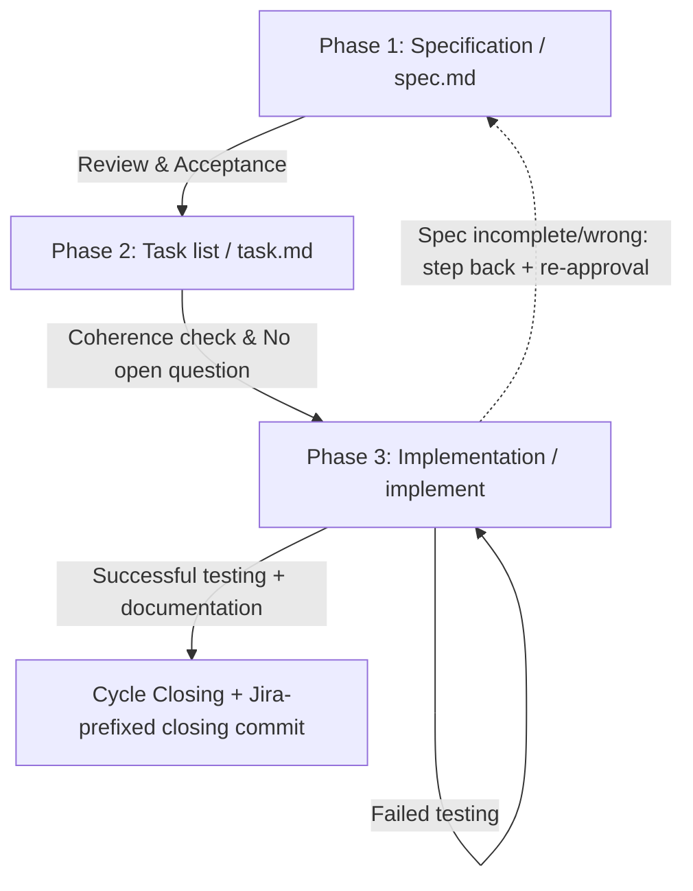

# SDD (Spec-Driven Development) — Simplified (Lightweight) Flow
<!-- INCLUDE:lang/output-language.md#output-language -->
<!-- INCLUDE:shared/context-check.md -->

---

This document describes the project's **simplified, three-phase** SDD (Spec-Driven Development) flow, for small and well-bounded tasks. The AI assistant (Agent) should follow this pattern when the size of the task does not justify the full (00–09 phase) berki spec cycle.

---

## When to use this flow, and when the full berki spec?

After taking on the task, the Agent should **first decide on the appropriate flow**, and briefly justify the decision to the User.

**Use this simplified flow if the task:**
*   can be reliably solved in 3-4 steps, in a single session/pass;
*   has a small, well-bounded scope — e.g. **assembling or modifying a configuration**, **writing a simpler script**, a smaller bug fix, local fine-tuning;
*   does not touch multiple components at once, and has no complex architectural decision requiring upfront design.

**Switch to the full berki spec process (starting with the [01-add-cycles](01-add-cycles.md) skill) if it turns out mid-flow that the task:**
*   requires larger code writing (new feature, logic spanning multiple files, non-trivial business rules);
*   touches multiple components, integration points, or a data model;
*   can be broken down into independently testable, vertically sliceable cycle(s);
*   demands complex design, a risky refactor, or thorough cross-phase consistency checking.

In this case the Agent **must not force the three-phase flow**: it should stop the work, notify the User that the task has outgrown this flow, and **recommend** the full process:

<!-- INCLUDE:lang/quick-flow.md#BS-flow-valtas-javaslat -->

The decision to switch flows always belongs to the User; you recommend and justify, but you never switch unilaterally.

---

## Quick step sequence (the full process in a nutshell)

> This is the "happy path". Details are found below; return here if you get uncertain.

1. **Branch + flow size.** Check the git branch (create a feature branch if needed). Decide: is the task really small? If not → recommend the full berki spec (`01-add-cycles`), and stop.
2. **Cycle folder.** Find the next free cycle number, propose a name, request approval, then create it: `specs/cycle-NN-<name>/`.
3. **Phase 1 — `spec.md`.** Write the specification (goal, parameters, **technical outline/approach**, testing strategy, README plan). At the end **run a consistency check** (paths, server-/user names etc. match everywhere). **⛔ STOP**, and wait for the User's explicit approval.
4. **Phase 2 — `task.md`.** Break it down into checkable steps (testing should come before the documentation update), with a **logical test order** (create a resource first, only then verify it). At the end **run a consistency check** together with spec.md. **⛔ STOP**, and wait for explicit approval.
5. **Phase 3 — implementation.** Work according to `task.md`, check off items in real time, run tests. If a spec error is discovered → go back to Phase 1 + re-approval. **If you get stuck** (the same error still fails after 2-3 rounds, or you're going in circles) → **stop, and ask the User targeted, forward-moving questions**.
6. **Closing.** Tests green + documentation updated + confirmed with the User → closing commit (with Jira prefix).

At the **⛔** mark NEVER proceed without the User's explicit "yes".

---

## Installation and activation (as a skill)

For the Agent to recognize this methodology as a genuine skill and apply it automatically, the file must be located in the appropriate skill directory:

*   **Location:** The skill must be placed at `.claude/skills/sdd-skill/SKILL.md` (relative to the repo root or the user's `~/.claude/skills/` directory). The folder name and the frontmatter `name` field must match (`sdd-skill`).
*   **Frontmatter:** The `name` and `description` fields at the top of the file are mandatory; based on the `description`, the Agent decides when invoking the skill is relevant.
*   **Activation:** The skill activates automatically when the task matches the description (starting a new cycle, creating `spec.md`/`task.md`, implementation). It can also be invoked manually with the `/sdd-skill` command.
*   **Maintenance:** This file is the canonical source of the methodology. If multiple components (e.g. multiple repos) use it, manual copying should be avoided; keep it unified via synchronization or a symlink, so that the variants do not drift apart.

---

## 1. Principles and directory structure

*   **Cycles:** Every independent task, feature, or development stage happens in a dedicated folder, following the naming scheme below:
    `cycle-XX-<name>` (e.g. `cycle-01-database-management`, `cycle-02-logging-improvement`).
*   **Document-driven development:** Writing or modifying code is strictly forbidden until the design and breakdown phases have been closed.
*   **Maintaining the README.md:** Keeping the project's main [README.md](../README.md) file up to date and updated during development is not an optional step; it must always be part of the design (`spec.md`) and the task list (`task.md`).
*   **Relative paths and references:** Both in code (scripts, configurations) and in documentation (specifications, README files, task lists), using **absolute file paths** (e.g. `/home/...`) or absolute markdown links (`file:///home/...`) is **strictly forbidden**. Every reference and path must be relative to the project root or the current document.
*   **Documentation language:** according to the **Output language** block at the top of the file — the cycle documents (`spec.md`, `task.md`) and their descriptions follow it. There is no separate rule here; identifiers, flags, and technical terms used in code remain in English regardless.

---

## 2. Starting a new development cycle

When a new development cycle needs to start, proceed as follows. For longer or more complex cycles, the User can request via the `/goal` command that you work with extra thoroughness and autonomy.

1. **Preparing the git environment (feature branch):** Before starting the cycle, check the current git branch and the working tree:
   * **If you are on the `master` branch:** Ask the User for the Jira task identifier (e.g. `OCTDCBS-18553`) and a short branch summary (e.g. `wildcard-cert`). Then create the new feature branch and switch to it: `feature/<jira-id>-<branch-summary>`.
   * **If you are already on a `feature/...` branch:** Check with `git status` whether the working tree is clean. If there are uncommitted changes:
     * Warn the User that it is advisable to commit everything before the cycle.
     * If approved, ask for the commit message, and commit. The commit message should start with the Jira identifier (e.g. `OCTDCBS-18553: <message>`).
2. **Setting the goal and interview (grill = keep asking until everything is clear):** The User describes what the cycle is about (what feature, fix, or change needs to be implemented). Keep asking until you have all the information needed to write the specification.
   * **Flow-size check (mandatory):** Throughout the interview, keep weighing whether the task really fits the simplified flow (see the "When to use this flow…" section). If it outgrows it (larger code writing, multiple components, complex design), **stop and recommend the full berki spec process** (`01-add-cycles`) before starting on the `spec.md`.
3. **Finding the cycle number:** Check the contents of the `specs/` directory, identify the existing cycle folders, and determine the next free cycle number (two digits, leading zero: `01`, `02`, `03` …).
4. **Name proposal:** Based on the description and the interview, propose a name for the new cycle (lowercase, hyphenated, e.g. `add-health-check` or `fix-tls-handshake`), and with it the full folder name (e.g. `cycle-03-add-health-check`). The folder name should always follow the `cycle-XX-<name>` scheme (with a hyphen after the word `cycle`).
5. **Approval:** The User approves or modifies the proposed name and number.
6. **Initialization:** After approval, create the new cycle folder under `specs/` (e.g. `specs/cycle-03-add-health-check/`), and start the `spec.md` in it (Phase 1). Writing the `spec.md` must make mandatory use of the full context gathered during the interview.

---

## 3. The Three-Phase SDD Workflow

The development cycle is strictly divided into three consecutive phases. There is no jumping ahead between phases.

### Phase 1: Specification (`spec.md`)
In this phase we clarify the requirements and record the precise technical plan.
*   **Step:** Create a `spec.md` file in the current `cycle-XX-<name>` folder.
*   **Agent support (optional) — `researcher`:** If the task touches an existing codebase, and it is not obvious which files need to be modified or which documents need to be updated, launch the `researcher` agent (as a Task tool subagent, read-only). It returns a concise list of the affected source files (`path:line–line`) and the documents to be updated — sparing the main agent's context window. For a clean greenfield script or a simple configuration this can be skipped.
*   **Content:**
    *   Detailed goal and operating logic.
    *   Variables, configuration parameters, naming schemes.
    *   **Approach / technical outline (the scaffolding replacing `plan.md` — mandatory):** Before moving on to `task.md`, record in the `spec.md` the technical HOW of the implementation — this gives a weaker/cheaper model the scaffolding that in the full flow would be provided by a separate `plan.md`. Keep it concise (typically 3-6 points), and stay strictly within the spec's scope (do not design anything that does not follow from the goal):
        *   **Affected files:** which files are created or modified (relative `path`), their role in a word or two.
        *   **Accounting for every occurrence (mandatory for replace/rename tasks):** if the task replaces or renames the production or form of a recurring element (variable, function, command, value, pattern), first **find ALL its occurrences** in the code (e.g. `grep -rn '<pattern>'`), and list all of them in the outline. The scope of the change is the entire set of occurrences, **not just the location the task appears to focus on at first glance** — a weaker model tends to only rewrite the focused location, silently leaving the rest.
        *   **Key elements:** the signature and parameters of the more important functions / interfaces / commands, configuration keys, data or naming schemes — with enough detail that the implementation does not require redesign.
        *   **<sec:execution_order>:** the logical order of the implementation steps (what depends on what); the breakdown of `task.md` will build on this.
        *   **Main error-handling / edge-case decision:** the most important error branch or edge case and the response to it (e.g. missing config, failed connection, empty input).
        *   Pseudocode or short code snippets where clarifying a specific part warrants it.
        *   **Tripwire:** if this outline alone would call for a separate, thorough design review round (many components, risky refactor, non-trivial architecture), that is a sign that the task has outgrown this flow → stop, and recommend the full berki spec process (see the "When to use this flow…" section).
    *   **Mandatory Testing Strategy:** A detailed plan for how the features being introduced will be tested. If the testing approach is not clear, the Agent is obligated to ask the user and align on the testing approach.
        *   **Recurring test expectations (TC1) — read only:** if `specs/test-conventions.md` exists (maintained by the full flow's `08-doc-sync` phase), read it, and **self-containedly bring in** the items needed for the cycle — together with their recipe data (URLs, ports, namespace/pod, test users and their passwords, parameters, example `curl` calls, build/deploy commands, prerequisites and order). A bare reference is not enough, and placeholders cannot be used: in this flow, `spec.md` is the single execution truth. Mark the provenance (`_(source: test-conventions.md R03)_`).
        *   **You do NOT write to this file in this flow.** The owner of `test-conventions.md` is `08-doc-sync`, which does not run here. If you find outdated or incomplete data in it, **ask the User about it**, write the correct data into `spec.md`, and note that updating the register in the full flow's doc-sync phase (or manually) is still to be done. If the file does not exist, do not create it.
        *   **A recipe with `<status:scope_shared_remote>` scope** (as marked by the register, e.g. shared dev cluster pod restart, image push): before bringing it in, **you must align with the User** — see the "Real (non-mock) test environment" point below.
    *   **Real (non-mock) test environment — alignment and cleanup plan (mandatory):** If the test does **not** run in a mock/isolated environment, but creates a resource on a **real, shared, or external system** (e.g. OpenShift/Kubernetes namespace, pod, deployment, route, secret; database record; cloud resource; external server component), then:
        *   **The conditions of resource creation must be agreed with the User in advance:** where (which cluster/namespace/environment), under what name, with what permissions the resources are created, and whether there is a conflict or side-effect risk with existing elements.
        *   **The cleanup after the test must be discussed separately with the User**, and the end of the `spec.md` **must itemize exactly what will be deleted and what will be left** after the test run. Only items created by the current test run may be deleted; touching an existing or shared resource is forbidden (see "Cleanup safety" in the Best Practice section).
        *   If the testing is purely mock/local (does not touch a real, shared system), this point can be skipped.
    *   The plan for updating the [README.md](../README.md).
*   **Consistency check (mandatory, at the end of the phase):** Before presenting the `spec.md` to the User for approval, **review the whole document, and check the consistency of recurring values**: paths/routes, server/host names, usernames, port numbers, database/resource names, environment variables, file names, etc. — the same value should appear everywhere you reference the same thing. If a value **suspiciously differs** somewhere (e.g. a different username or hostname in two places, a difference that looks like a typo), **do not silently fix it**: draw the User's attention to it, indicate where and how it differs, and ask about the correct value.
*   **Rule (Critical):**
    *   In this phase, do not modify any project file (code, existing documentation).
    *   **⛔ STOP at the end of the phase.** Only start Phase 2 (the `task.md`) **once the User has explicitly approved** the `spec.md`. Do not proceed without approval.
    *   **A commit is MANDATORY after approval** (in a version-controlled project): right after approval is given, before starting Phase 2, commit the `spec.md` on the cycle's feature branch — `git add specs/cycle-XX-<name>/ && git commit -m "<JIRA-ID>: spec.md — cycle-XX-<name>"`. Verify with `git log -1 --oneline`, and state the commit id in your response. Do not ask for separate permission: approval of the phase already includes it. If there is no version control, this step is skipped.

### Phase 2: Task list (`task.md`)
Based on the approved specification, we prepare the step-by-step task list.
*   **Step:** Create a `task.md` file in the current `cycle-XX-<name>` folder.
*   **Content:**
    *   **The "Approach / technical outline" is the starting point:** the task breakdown should build on the technical outline recorded in `spec.md` (affected files, key elements, execution order) — the order of the steps should follow the execution order of the outline. If during breakdown the outline proves incomplete or wrong, that is a **spec gap**: step back to Phase 1 and complete it (with re-approval), do not silently patch it in `task.md`.
    *   Checkable task list (Markdown checkboxes: `- [ ]`).
    *   **The place of testing in the order:** The testing steps (based on the specified testing strategy) must be explicitly included in the `task.md` list, and specifically **before** the documentation update (e.g. `README.md` editing).
    *   **The logical order of the tests (mandatory):** After writing the `task.md`, **check the logical order of the testing steps**, so that every step's prerequisite has already been fulfilled earlier. Only check the existence or state of a resource (e.g. file, database record, deployment, service, network connection) **after** an earlier step has already created / set it up; and a "no longer exists" style check after cleanup should come after the deletion. If the order does not hold up (you reference something later that has not yet been created), rearrange the steps before presenting them to the User.
    *   Tasks broken into steps for creating and editing files, carrying out testing, and updating documentation.
*   **Agent support (optional) — `analyzer`:** If the relationship between `spec.md` and `task.md` is more complex (multiple requirements, coverage that easily slips), the `analyzer` agent (read-only) can be launched for a lightweight consistency check. In the full flow it examines the spec/plan/tasks triple; here it runs narrowed to the `spec.md` ↔ `task.md` pair (`plan.md` does not exist in this flow), and reports back coverage gaps, ambiguities, underspecification. For a small, unambiguous task list this is unnecessary — do not force it.
*   **Consistency check (mandatory, at the end of the phase):** After the `task.md` is done, **check the consistency of recurring values within the `task.md` AND against the `spec.md`**: paths/routes, server/host names, usernames, port numbers, database/resource names, environment variables, file names, commands, etc. The same value should appear everywhere, and match what is recorded in `spec.md`. If a value **suspiciously differs** somewhere (between the two documents or within `task.md`), **do not silently fix it**: draw the User's attention to it, indicate where and how it differs, and ask about the correct value.
*   **Rule (Critical):**
    *   Do not start the `task.md` before the `spec.md` is approved.
    *   Only move to Phase 3 (implementation) if the `spec.md` and `task.md` are **fully coherent**, and there is no open question between you and the User.
    *   **⛔ STOP at the end of the phase.** Only start the implementation (Phase 3) **after the explicit user approval of `task.md`**. Do not proceed without approval.
    *   **A commit is MANDATORY after approval** (in a version-controlled project): right after approval, before starting the implementation, commit the `task.md` — `git add specs/cycle-XX-<name>/ && git commit -m "<JIRA-ID>: task.md — cycle-XX-<name>"`. Verify with `git log -1 --oneline`, and state the commit id. Do not ask for separate permission. If there is no version control, this step is skipped.

### Phase 3: Implementation
In this phase the actual coding happens according to the task list.
*   **The `task.md` is the only source:** work exclusively according to `task.md`. Do not deviate from it, and do not skip a step.
*   **Real-time checking off:** as soon as you finish a task item, **immediately check it off (`- [x]`)** in `task.md`, before moving to the next task.
*   **Retroactive checking off:** if checking off an earlier step got interrupted or was missed, fix it immediately.
*   **Full replacement verification (leftover sweep) — mandatory after a replace/rename:** if you replaced or renamed a recurring element, at the end **search again for the OLD form** (e.g. `grep -rn '<old pattern>'`), and make sure no orphaned occurrence remains. **Do not rely on tests for this**: an uncovered code branch (e.g. a rarely running branch) will let a skipped location pass green — the grep-based check is deterministic and independent of test coverage.
*   **Handling a failed test:** if any test fails, go back to the implementation steps, fix it, then **rerun ALL tests** (not just the failed one) to avoid regression.
*   **Recognizing getting stuck / infinite loop (loop breaker):** if you find that **the same test or error still fails unchanged after 2-3 rounds of fixing**, or **you are repeating the same step / command / fix without meaningful progress** (same error message, circular cause-and-effect), then **recognize that you are stuck, and do NOT keep trying blindly**. Instead:
    1. **Stop** (do not burn more rounds on the same thing).
    2. Briefly summarize for the User: **what you tried** (the attempts and their outcomes), **what the exact error message is**, and **what your hypotheses are** about the cause.
    3. **Ask targeted, forward-moving clarifying questions** — ones whose concrete answer would actually unblock the run (e.g. missing permission/credential, correct endpoint or resource name, environment prerequisite, expected behavior in an edge case). Avoid the generic "what should I do?" question; ask for information broken down into a **decision or a piece of data**.
    4. **⛔ Wait for the User's answer**, and only continue once you have the new information. If the cause of getting stuck is a spec deficiency, step back to Phase 1 as described in "Phase rollback (in case of spec error)".
*   **Phase rollback (in case of spec error):** if it turns out mid-flow that `spec.md` is incomplete or wrong, **silently deviating from it is forbidden**. Instead:
    1. Stop.
    2. Step back to Phase 1, and update `spec.md` (and `task.md`, if needed).
    3. **⛔ Request the User's explicit approval again**, and only then continue coding.
    *   Jumping ahead is still not allowed; stepping back to correct the spec, however, is mandatory whenever the plan and reality diverge.
*   **Agent support (optional) — `reviewer`:** Before the closing commit, a quick code review can be launched with the `reviewer` agent (read-only): it reviews the diff for conventions, scope discipline, error handling, and spec compliance, and returns a `<status:must_fix>` / `<status:suggestion>` list. Unlike the full flow, here there is **no automated review self-fix loop**: the Agent simply fixes the `<status:must_fix>` findings directly before closing, and reports the `<status:suggestion>` items to the User. For a small, low-risk change (e.g. a single configuration line) this can be skipped.
*   **Completion criteria / Cycle closing:** The implementation and the whole cycle can **only be considered finished and closed** if:
    1. The specified tests ran without error.
    2. The related documentation (e.g. `README.md`) has been updated.
    3. The results achieved have been verified and confirmed with the User.
    4. **The cycle's closing commit has been made.** The commit message must mandatorily start with the Jira task identifier (e.g. `OCTDCBS-18553: <message>`).

---

## 4. Specialist agents used

The simplified flow deliberately uses **few** specialist agents, and each of them **optionally** — for most small tasks the main agent does the work independently, without a subagent.

> **With a weaker/cheaper model:** if you are uncertain, **feel free to skip all three optional agents** — the flow is complete without them. Orchestrating subagents itself carries error risk, so for a small task it is better to work directly, and only reach for an agent when it clearly helps.

The usable agents (all callable by these names from the platform's installed agent definitions):

| Agent | Where (phase) | What it gives | When it's worth it |
|---|---|---|---|
| `researcher` | Phase 1 (spec.md) | Concise list of affected source files (`path:line–line`) + documents to be updated (read-only) | When modifying an existing codebase, if the affected file set is not obvious |
| `analyzer` | Phase 2 (task.md) | `spec.md` ↔ `task.md` consistency diagnosis: coverage gap, ambiguity, underspecification (read-only) | For a task list with multiple requirements, that easily slips |
| `reviewer` | Phase 3 (before the closing commit) | Diff code review: conventions, scope, error handling, spec compliance → `<status:must_fix>` / `<status:suggestion>` (read-only) | For a non-trivial code change, as a quality gate before the commit |

**What this flow does NOT use (and why):**
*   **Fixer-wrappers** (`spec-fixer`, `plan-fixer`, `tasks-fixer`, `implement-fixer`, `review-fixer`): these are the entry points of the full flow's **self-fix loops** (05-analyze / 07-validate). Here there is no automated self-fix loop — the main agent fixes errors directly, inline. The `plan-fixer`, moreover, assumes a `plan.md`, which does not exist in this flow.
*   **`doc-sync-planner`**: the plan creator for the full flow's `docs-generated/` live documentation sync (08-doc-sync). In the simplified flow, updating documentation is part of Phase 3 (e.g. `README.md`), there is no separate generated doc layer.

If the task is so large that these loops and agents would truly be warranted, that is generally a sign that **you should switch to the full berki spec process** (see the "When to use this flow…" section).

---

## 5. Best Practice & Lessons Learned

1.  **Syntax check:** After any script modification, the syntax test (e.g. `bash -n script.sh`) should always run before the logic tests start.
2.  **Handled errors:** If the code connects to an external resource (e.g. a database), connection errors should always be individually handled, and the error message should point to the configuration file.
3.  **Environment isolation:** The parameters of dynamic port-forwarding or other low-level network settings should always be read by the code from configuration files (e.g. `include/config.sh`), never hardcoded.
4.  **Relative file paths:** In documentation (specifications, task lists, READMEs), references and paths should always be relative. In the internal workings of product scripts (e.g. `deploy.sh`, `certcheck.sh`), using `cd` commands is permitted.
5.  **Cleanup safety:** During testing (especially in the cleanup process performed at the end of tests), deleting files, directories, or external server components that were not created by the current test run itself is strictly forbidden. Always make sure that the cleanup logic is precisely targeted, and does not touch existing project elements or shared resources.
6.  **Checking infrastructure-specific defaults:** If a script or configuration dynamically generates network paths, hostnames, or URLs (e.g. by concatenating environment or namespace variables), it is mandatory during specification to check whether the generated default values are functional within the target environment's actual routing and DNS structure. Never assume that the simplest naming combination is automatically correct; if the network infrastructure requires it, the generation logic must support name-specific deviations (e.g. prefixing, using central collector domains).
7.  **Full replacement / every occurrence:** If you modify the production or form of a recurring element (variable, function, command, value, pattern), the scope of the change is **every** occurrence of it, not just the one the task focuses on. BEFORE replacing, take stock of all of them (`grep -rn`), AFTER replacing, verify that **no orphaned instance** of the old form remains. Tests being green **does not in itself prove completeness**, if some code branches are not covered — the grep sweep is the deterministic safeguard.
