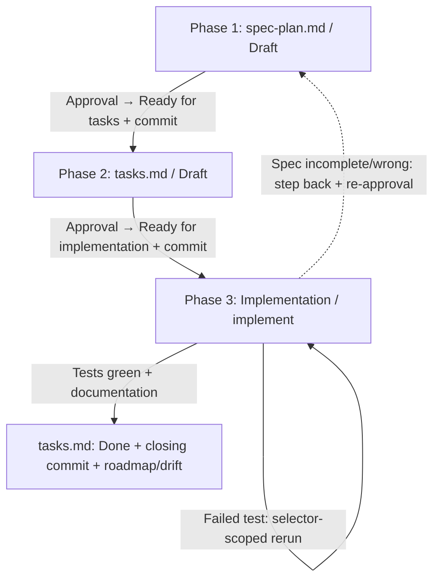

# SDD (Spec-Driven Development) — Simplified (Lightweight) Flow
<!-- INCLUDE:lang/output-language.md#output-language -->
<!-- INCLUDE:shared/context-check.md -->

---

## When to use this flow, and when the full berki spec?

After taking on the task, the Agent should **first decide on the appropriate flow**, and briefly justify the decision to the User.

**Use this simplified flow if the task:**
*   can be reliably solved in 3-4 steps, in a single session/pass;
*   has a small, well-bounded scope — e.g. **assembling or modifying a configuration**, **writing a simpler script**, a smaller bug fix, local fine-tuning;
*   does not touch multiple components at once, and has no complex architectural decision requiring upfront design.

**Switch to the full berki spec process (starting with the `/bs-add-cycles` command) if it turns out mid-flow that the task:**
*   requires larger code writing (new feature, logic spanning multiple files, non-trivial business rules);
*   touches multiple components, integration points, or a data model;
*   demands complex design, a risky refactor, or thorough cross-phase consistency checking.

In this case the Agent **must not force the three-phase flow**: it should stop the work, notify the User that the task has outgrown this flow, and **recommend** the full process:

<!-- INCLUDE:lang/quick-flow.md#BS-flow-valtas-javaslat -->

The decision to switch flows always belongs to the User; you recommend and justify, but you never switch unilaterally.

---

## Entry point — the call forms you may receive

**Call forms.** `/bs-quick-flow` with no parameter → start the interview from scratch (section 2). · `/bs-quick-flow input: <the task in one sentence>` → the sentence is the starting point of the interview, ask for the missing data. · `/bs-quick-flow brainstorm: NN` → **brainstorm handover (QF16)**, see below.

**Brainstorm handover (QF16).** If the call references a brainstorm number (or the User points at a `.bs-brainstorm/brainstorm-NN-<slug>.md` file), **read the distillate** before the `spec-plan.md`: `ls -1 .bs-brainstorm/brainstorm-NN-*.md`, then from the file the `<sec:bs_goal_question>`, `<sec:bs_facts>`, `<sec:bs_decisions>` and `<sec:bs_open_questions>` sections. The goal, the facts and the decisions are **inputs you already have** — do not ask about them again. The items under `<sec:bs_open_questions>`, however, must be **asked one by one** of the User: the brainstorm deliberately left them open, and inventing an answer to an open question is exactly the silent decision this flow rules out. If the `<sec:bs_cycle_split>` section lists **several** cycle candidates, that is a sign of outgrowing → recommend the `/bs-add-cycles` process.

---

## Quick step sequence (the full process in a nutshell)

1. **Branch + flow size.** Read the git section of `conventions.md`, and prepare the branch accordingly. Decide: is the task really small? If not → recommend the full berki spec (`/bs-add-cycles`), and stop.
2. **Cycle folder.** Determine the next free cycle number with the **BQ2** formula, propose a name, request approval, then create it: `specs/cycle-NN_quick-flow_<cycle-name>/`.
3. **Phase 1 — `spec-plan.md`.** Write the specification (goal, parameters, **technical outline/approach**, testing strategy **with a target environment**, README plan), with a `<field:f_status>: <status:draft>` header. At the end run a **consistency check** and the **RP1 path gate**. **⛔ STOP**, and wait for the User's explicit approval.
4. **Phase 2 — `tasks.md`.** Break it down into checkable steps (testing should come before the documentation update), with a **logical test order** and a **scope label** (`[local]` / `[remote]`). At the end, consistency check + RP1 gate. **⛔ STOP**, and wait for explicit approval.
5. **Phase 3 — implementation.** Work according to `tasks.md` **in a single pass**, check off items in real time, run every test step **separately, with a selector**. If a spec error is discovered → go back to Phase 1 + re-approval. **If you get stuck** → stop, and ask targeted, forward-moving questions.
6. **Closing.** Tests green + documentation updated + confirmed with the User → `tasks.md` status `<status:done>` → closing commit → roadmap and drift note.

At the **⛔** mark NEVER proceed without the User's explicit "yes". The signal of a phase change is **not** a "yes" spoken in the conversation, but the **committed status field** (QF2/QF4) — this is what makes an interruption and a `/clear` survivable.

---

## 1. Principles and directory structure

*   **Cycles:** every independent task, feature, or development stage lives in a dedicated folder, per the `cycle-NN_quick-flow_<cycle-name>` scheme (e.g. `cycle-01_quick-flow_database-config`, `cycle-02_quick-flow_logging-fix`).
*   **Document-driven development:** writing or modifying code is forbidden until Phase 1 and Phase 2 have been closed. Keeping the project's main `README.md` up to date is **not optional**: it is always part of `spec-plan.md` and `tasks.md`.
*   **Two artifacts, two statuses:** **exactly two** design documents live in the cycle folder — `spec-plan.md` and `tasks.md` — and the header of both carries a `<field:f_status>` field (QF2). There is no `plan.md`: its role is taken over by the technical outline of `spec-plan.md` — **the file name states this** (QF21): spec and plan are merged into a single document here.
*   **The language and the voice of the documentation:** the cycle documents follow the **Output language** block at the top of the file; identifiers, flags, and technical terms used in code remain in English. **The artifact speaks to the implementer, not to you (AV1):** do not copy skill text — imperatives ("it is forbidden…", "you must check…"), the `🔴` marking — into `spec-plan.md`/`tasks.md`; write it down as a **decision**, in a descriptive voice.

---

<!-- INCLUDE:shared/path-format.md -->

> **This is the ONLY mandatory deterministic gate of this flow (QF11).** The `--paths-only` call runs on the `spec-plan.md` / `tasks.md` pair of the cycle folder, so it also runs before closing Phase 1 and Phase 2. The other gate scripts (`analyze-gate-check.py` in full mode, `run-tests.py`, `dod-check.py`, `report-gate-check.py`) belong to the full flow and **do not run here** — if you would need them, that is a sign of outgrowing.

---

<!-- INCLUDE:shared/dereferencing.md -->

> **In this flow this is even stricter (KX2):** there is no `plan.md`, so `spec-plan.md` is the **single** execution truth — whatever you leave as a reference, nobody will resolve for you in Phase 3. The place of `<sec:environment_coords>` is taken by the technical outline and the testing strategy of `spec-plan.md`, with the resolved values (commands, URLs, payload, coordinates).

---

<!-- INCLUDE:shared/conventions-change.md -->

> **How the four conditions map onto this flow (GC1):** instead of condition 2 (the plan designs it), the **technical outline** of `spec-plan.md` records the new content of the affected `conventions.md` section; instead of condition 4 (the full `07` round runs again), the **test** of Phase 3 runs with the updated `conventions.md`. Conditions 1 and 3 are unchanged: an explicit decision in `spec-plan.md`, a separate task in `tasks.md`. The typical task of this flow (configuration, port, test command) is exactly what the gates read from `conventions.md` — updating it is therefore part of the cycle, not debt left to the next one.

---

## 2. Starting a new development cycle

When a new development cycle needs to start, proceed as follows.

1. **Preparing the git environment — from `conventions.md` (QF1):** before starting the cycle, read the `## <sec:cv_git_conventions>` section of `conventions.md` in the project root, and take the parameters **from there** — do not hardwire a branch name or a commit format:
   * **No-VCS gate:** if according to the section the project has no version control, **every git operation is skipped** in this flow (branch, commit, `git status`) — the phases close with the rewriting of the status field.
   * **<field:f_main_branch>** (`main` by default): if you are on this branch, ask the User for the short name of the cycle (and whatever the convention requires — e.g. a Jira identifier), then create the feature branch per **<field:f_branch_naming>** (`feature/cycle-NN_quick-flow_<cycle-name>` by default), and switch to it.
   * **If you are already on the cycle's branch:** check with `git status --short` whether the working tree is clean. If there are uncommitted changes, warn the User that it is advisable to commit before the cycle; if they approve, ask for the commit message, and commit.
   * **Commit message format:** the git section of `conventions.md` decides. If the project prescribes a Jira-prefixed convention, the commit starts with it (e.g. `OCTDCBS-18553: <message>`) — but this is **one case** of the convention, not a rule of the flow itself. The full flow's `cycle-NN: <phase-tag>` form is **not** used here: `07`/`09` search back for that, and they do not run in this flow.
   * _This short working-tree check is deliberately not the full branch-opening preflight of `00`/`01` (worktree branch, PW1–PW5): that would be oversized here. Its **source**, however, is the same — `conventions.md`._
2. **Setting the goal and interview (grill = keep asking until everything is clear):** The User describes what the cycle is about (what feature, fix, or change needs to be implemented). Keep asking until you have all the information needed to write the specification. For a brainstorm handover, proceed per the entry-point section (QF16).
   * **Flow-size check (mandatory):** Throughout the interview, keep weighing whether the task really fits the simplified flow (see the "When to use this flow…" section). If it outgrows it (larger code writing, multiple components, complex design), **stop and recommend the full berki spec process** (`/bs-add-cycles`) before starting on the `spec-plan.md`.
3. **Finding the cycle number (BQ2):** `ls specs/` alone is **not enough** for the next free cycle number — there may be a cycle that lives only on a not-yet-merged feature branch, and you would collide with it. Therefore use the formula of the **"Determining the cycle number (BQ2)"** section of `01-add-cycles`: with version control, `NN = max(the cycle numbers of `specs/roadmap.md` and `ls specs/`, the `cycle-(\d+)` numbers extracted from the branch names of `git branch -a --list '*cycle-*'`) + 1`; on the No-VCS branch the branch scan is skipped. Two digits, with a leading zero (`01`, `02`, `03` …).
4. **Name proposal:** Based on the description and the interview, propose a name for the new cycle (lowercase, hyphenated, e.g. `add-health-check` or `fix-tls-handshake`), and with it the full folder name (e.g. `cycle-03_quick-flow_add-health-check`). **The folder name must always follow the `cycle-NN_quick-flow_<cycle-name>` scheme (QF22):** the `quick-flow` tag sits between underscores, while the separator of the cycle number and the name stays a hyphen — so the folder name (and the branch name derived from it) shows at a glance that the cycle was made on the simplified route, with no `plan.md` and no analyze/validate/doc-sync phase. Quick-flow cycles started before the rename keep the folder name they have.
5. **Approval:** The User approves or modifies the proposed name and number.
6. **Initialization:** After approval, create the new cycle folder under `specs/` (e.g. `specs/cycle-03_quick-flow_add-health-check/`), and start the `spec-plan.md` in it (Phase 1). Writing the `spec-plan.md` must make mandatory use of the full context gathered during the interview.
7. **Roadmap entry (QF6):** if `specs/roadmap.md` **exists**, add the cycle with a single row — this keeps the project's cycle history complete, and the next BQ2 can see it too:

   <!-- INCLUDE:lang/quick-flow.md#BS-roadmap-sor -->

   **If `specs/roadmap.md` does not exist, do not create it** — the owner of the roadmap is `01-add-cycles`. In that case, state in one line in the closing message that the cycle is not registered in the roadmap.

---

## 3. The Three-Phase SDD Workflow

The development cycle is strictly divided into three consecutive phases. There is no jumping ahead between phases, and the phase boundary is marked by the **committed status field**.



### Phase 1: Specification (`spec-plan.md`)
In this phase we clarify the requirements and record the precise technical plan.
*   **Step:** Create a `spec-plan.md` file in the current `cycle-NN_quick-flow_<cycle-name>` folder, with the status field in its header (QF2):

    ```md
    # Cycle NN: <title>

    **<field:f_status>:** `<status:draft>`
    ```

    At the end of the phase, at the **moment of the user's approval**, `<status:draft>` turns into `<status:ready_for_tasks>` — writing the status and committing are a single, uninterruptible step pair (see "Phase closing").
*   **Agent support (optional) — `researcher`:** If the task touches an existing codebase, and it is not obvious which files need to be modified or which documents need to be updated, launch the `researcher` subagent (read-only). It returns a concise list of the affected source files (`path:line–line`) and the documents to be updated — sparing the main agent's context window. For a clean greenfield script or a simple configuration this can be skipped.
*   **Content:**
    *   Detailed goal and operating logic.
    *   Variables, configuration parameters, naming schemes.
    *   **Approach / technical outline (the scaffolding replacing `plan.md` — mandatory):** Before moving on to `tasks.md`, record in the `spec-plan.md` the technical HOW of the implementation — this gives a weaker/cheaper model the scaffolding that in the full flow would be provided by a separate `plan.md`. Keep it concise (typically 3-6 points), and stay strictly within the spec's scope (do not design anything that does not follow from the goal):
        *   **Affected files:** which files are created or modified (relative `path`), their role in a word or two.
        *   **Accounting for every occurrence (mandatory for replace/rename tasks):** if the task replaces or renames the production or form of a recurring element (variable, function, command, value, pattern), first **find ALL its occurrences** in the code (e.g. `grep -rn '<pattern>'`), and list all of them in the outline. The scope of the change is the entire set of occurrences, **not just the location the task appears to focus on at first glance** — a weaker model tends to only rewrite the focused location, silently leaving the rest.
        *   **Key elements:** the signature and parameters of the more important functions / interfaces / commands, configuration keys, data or naming schemes — with enough detail that the implementation does not require redesign.
        *   **<sec:execution_order>:** the logical order of the implementation steps (what depends on what); the breakdown of `tasks.md` will build on this.
        *   **Main error-handling / edge-case decision:** the most important error branch or edge case and the response to it (e.g. missing config, failed connection, empty input).
        *   Pseudocode or short code snippets where clarifying a specific part warrants it.
        *   **Tripwire:** if this outline alone would call for a separate, thorough design review round (many components, risky refactor, non-trivial architecture), that is a sign that the task has outgrown this flow → stop, and recommend the full berki spec process (see the "When to use this flow…" section).
    *   **🔴 Merge tests — a mandatory section at the end of `spec-plan.md` (QF23):** `## <sec:merge_tests>` + `**Post-merge test categories:** <the categories from the dictionary of `## <sec:cv_test_execution>` in `conventions.md`>`. The merge branch **filters** the project-level table with it (`run-tests.py --table-source conventions`) — the *how it runs* stays there, here you only **select**. **It may not be left empty**: if there really is nothing to run, write `none` + half a sentence of reason (silence would make the "nothing to test" and the "forgot to fill it in" cases indistinguishable). With `SDD mode: centralized` its absence is a `bs-merge` gate error.
    *   **Mandatory Testing Strategy:** A detailed plan for how the features being introduced will be tested. If the testing approach is not clear, the Agent is obligated to ask the user and align on the testing approach. The strategy is written **in prose** (this flow stays cheap, there is no machine run table) — but the six points below **cannot be omitted**.
        *   **🔴 <field:f_target_env> — mandatory field (QT1 · EV1).** The **first line** of the testing strategy must state WHICH environment the cycle is about: `**<field:f_target_env>:** local` / `remote` / `local + remote`. A green test does not in itself prove WHERE it was green — and this flow (configuration, operations, scripts) is the most exposed to exactly that.
        *   **🔴 Three constraints for a non-local target (QT1 · EV3/EV5):** (a) the **target host must appear literally in the command** — the name of an npm script or an address hidden in a config file is **not enough**, because the log does not reveal where the call went; (b) before the test step there must be a **reachability probe against the same host** (e.g. `curl -sf https://<host>/health`), so that a network fault does not surface as a test failure; (c) the `localhost` and `127.0.0.1` forms **cannot be used** in the command — unless the seemingly local address sits behind a **declared port-forward**, and `spec-plan.md` states this (what forwards, to which cluster resource).
        *   **🔴 A scope label on every test step (QT2) — `[local]` or `[remote]`.** This is a **language-independent literal**, as in the full flow (EV8): it stays joinable, and folder names in the framework are always in English. `remote` is any step that addresses even a SINGLE component that does not run on the local machine — a container running on your own machine is still `local`, while a `127.0.0.1:8080` behind an `oc port-forward` is `remote`. A step with no label defaults to `local`. No gate measures this here; the value is that the **intent is stated**, and that the absence of a remote test is readable **as an absence**.
        *   **🔴 Every test step states what it verifies and why (QT3 · TD7).** An **assertion** sentence, referencing a goal or DoD point of `spec-plan.md` — not a repetition of the step's title ("testing the health check"). Without it, on a failure it cannot be decided whether the code or the test is wrong, and the easiest green-making path wins. If you cannot say in one sentence what the step verifies, the step is **not designed**. Calibration sample:

            ```md
            #### T-02 [remote] — Serving the renewed certificate
            **<field:f_what_it_checks>:** after the renewal the route serves the NEW certificate (`notAfter` is later than today's date), so `deploy.sh` really replaced the secret — it did not just create a second one (Goal, point 2).
            **Prerequisite (probe):** `curl -sf -o /dev/null https://api.apps.ocp-test.example.com/health`
            **Command:** `echo | openssl s_client -connect api.apps.ocp-test.example.com:443 | openssl x509 -noout -enddate`
            **Expected:** `notAfter=` today's date + 90 days, ±1 day.
            ```

            _Copy the sample for its **density**, not for its topic (TD5): one assertion, one probe, one runnable command, one decidable expected result._
        *   **🔴 A vacuous test is not a test (QT4 · TB1).** `assert True`, an empty test function body, `assert x == x`, or a skeleton that only checks the **existence** of a file/resource: these stay green on a broken implementation too. Every test step must have an assertion that **would fail** on a broken implementation. _(The full flow's `test-substance-check.py` gate does not run here — the bar is the same, only the enforcement is yours.)_
        *   **🔴 `skipped` is not evidence (QT5 · SK1).** A test that exits via `pytest.skip` / `test.skip` / a conditional early return **proves nothing**. If a planned test skips, state it to the User **before** closing the cycle: which test, why it skipped, and what has therefore remained unproven. A skipped test **cannot be counted as green**.
        *   **Recurring test expectations (TC1) — read only:** if `specs/test-conventions.md` exists (maintained by the full flow's `08-doc-sync` phase), read it, and **self-containedly bring in** the items needed for the cycle — together with their recipe data (URLs, ports, namespace/pod, test users and their passwords, parameters, example `curl` calls, build/deploy commands, prerequisites and order). A bare reference is not enough, and placeholders cannot be used: in this flow, `spec-plan.md` is the single execution truth. Mark the provenance (`_(source: test-conventions.md R03)_`).
        *   **You do NOT write to this file in this flow.** The owner of `test-conventions.md` is `08-doc-sync`, which does not run here. If you find outdated or incomplete data in it, **ask the User about it**, write the correct data into `spec-plan.md`, and note that updating the register in the full flow's doc-sync phase (or manually) is still to be done. If the file does not exist, do not create it.
        *   **A recipe with `<status:scope_shared_remote>` scope** (as marked by the register, e.g. shared dev cluster pod restart, image push): before bringing it in, **you must align with the User** — see the "Real (non-mock) test environment" point below.
    *   **Real (non-mock) test environment — alignment and cleanup plan (mandatory):** If the test does **not** run in a mock/isolated environment, but creates a resource on a **real, shared, or external system** (e.g. OpenShift/Kubernetes namespace, pod, deployment, route, secret; database record; cloud resource; external server component), then:
        *   **The conditions of resource creation must be agreed with the User in advance:** where (which cluster/namespace/environment), under what name, with what permissions the resources are created, and whether there is a conflict or side-effect risk with existing elements.
        *   **The cleanup after the test must be discussed separately with the User**, and the end of the `spec-plan.md` **must itemize exactly what will be deleted and what will be left** after the test run. Only items created by the current test run may be deleted; touching an existing or shared resource is forbidden (see "Cleanup safety" in the Best Practice section).
        *   If the testing is purely mock/local (does not touch a real, shared system), this point can be skipped.
    *   The plan for updating the `README.md`.
*   **Consistency check (mandatory, at the end of the phase):** Before presenting the `spec-plan.md` to the User for approval, **review the whole document, and check the consistency of recurring values**: paths/routes, server/host names, usernames, port numbers, database/resource names, environment variables, file names, etc. — the same value should appear everywhere you reference the same thing. If a value **suspiciously differs** somewhere (e.g. a different username or hostname in two places, a difference that looks like a typo), **do not silently fix it**: draw the User's attention to it, indicate where and how it differs, and ask about the correct value.
*   **RP1 path gate (mandatory, after the consistency check):** run the `--paths-only` call on the cycle folder (see the "Path format" block). A non-`0` exit code → fix the paths found, and rerun; the phase does not close without a gate `PASS`.
*   **Rule (Critical):**
    *   In this phase, do not modify any project file (code, existing documentation).
    *   **⛔ STOP at the end of the phase.** Only start Phase 2 (the `tasks.md`) **once the User has explicitly approved** the `spec-plan.md`. Do not proceed without approval.
    *   **Phase closing (status + commit, a single step pair):** right after approval is given, before starting Phase 2, (a) rewrite the `<field:f_status>` field of `spec-plan.md` to `<status:ready_for_tasks>`, then (b) commit: `git add specs/cycle-NN_quick-flow_<cycle-name>/`, and `git commit` with the message per `conventions.md`. Between the two, do not ask, do not wait, do not start other work. **Verify deterministically, not "by feel":** `git log -1 --oneline && git status --short specs/cycle-NN_quick-flow_<cycle-name>/` — the first line must be the commit just made, and the `git status` output for the cycle folder must be **empty**; if not, fix it and rerun (at most 2 attempts). State the commit id in your response. Do not ask for separate permission: approval of the phase already includes it. On the No-VCS branch the commit is skipped, the status write is not. _(The source of the shared procedure is the `phase-commit.md` block; the commit message format, however, comes from `conventions.md` here, not from the `cycle-NN: <phase-tag>` form.)_
    *   **Phase boundary (PE1):** the phase **ends** with printing the commit id. In the same round you do **not even create** the `tasks.md` — not even "just as preparation". If you did anyway, delete the resulting file, and tell the User.

### Phase 2: Task list (`tasks.md`)
Based on the approved specification, we prepare the step-by-step task list.
*   **Entry phase gate (QF4):** read the `<field:f_status>` field from the header of `spec-plan.md` (in a cycle started before the rename the file is named `spec.md` — then read that one, and do not rename it mid-cycle). If its value is **not** `<status:ready_for_tasks>`, **STOP** — the spec is not approved (or the approval was not committed). Do not rely on the memory of the conversation: after a `/clear` or an interruption, the status field is the only thing that survives.
*   **Step:** Create a `tasks.md` file in the current `cycle-NN_quick-flow_<cycle-name>` folder, with a `**<field:f_status>:** <status:draft>` header.
*   **Content:**
    *   **The "Approach / technical outline" is the starting point:** the task breakdown should build on the technical outline recorded in `spec-plan.md` (affected files, key elements, execution order) — the order of the steps should follow the execution order of the outline. If during breakdown the outline proves incomplete or wrong, that is a **spec gap**: step back to Phase 1 and complete it (with re-approval), do not silently patch it in `tasks.md`.
    *   Checkable task list (Markdown checkboxes: `- [ ]`).
    *   **The place of testing in the order:** The testing steps (based on the specified testing strategy) must be explicitly included in the `tasks.md` list, and specifically **before** the documentation update (e.g. `README.md` editing).
    *   **The shape of a test step (QT1–QT3, QT6):** the header of every test step carries the `[local]` / `[remote]` label, and below it stand the **assertion** (what it verifies and why, against which goal/DoD point), the **probe** (for a non-local target), the **selector-scoped command** and the **expected result** — in the same quartet the calibration sample of `spec-plan.md` shows. A placeholder host or an address hidden in a config file cannot be used here either.
    *   **The logical order of the tests (mandatory):** After writing the `tasks.md`, **check the logical order of the testing steps**, so that every step's prerequisite has already been fulfilled earlier. Only check the existence or state of a resource (e.g. file, database record, deployment, service, network connection) **after** an earlier step has already created / set it up; and a "no longer exists" style check after cleanup should come after the deletion. If the order does not hold up (you reference something later that has not yet been created), rearrange the steps before presenting them to the User.
    *   **The regression run is a separate, LAST step (QT6):** the single run of the whole test set stands at the **end** of the list, as a standalone step — it does not replace the per-step, selector-scoped runs.
    *   Tasks broken into steps for creating and editing files, carrying out testing, and updating documentation.
*   **Agent support (optional) — `analyzer`:** If the relationship between `spec-plan.md` and `tasks.md` is more complex (multiple requirements, coverage that easily slips), the `analyzer` subagent (read-only) can be launched for a lightweight consistency check. The substitutions are itemized in section 4. For a small, unambiguous task list this is unnecessary — do not force it.
*   **Consistency check (mandatory, at the end of the phase):** After the `tasks.md` is done, **check the consistency of recurring values within the `tasks.md` AND against the `spec-plan.md`**: paths/routes, server/host names, usernames, port numbers, database/resource names, environment variables, file names, commands, etc. The same value should appear everywhere, and match what is recorded in `spec-plan.md`. If a value **suspiciously differs** somewhere (between the two documents or within `tasks.md`), **do not silently fix it**: draw the User's attention to it, indicate where and how it differs, and ask about the correct value.
*   **RP1 path gate (mandatory):** run the `--paths-only` call again — it now runs on the `spec-plan.md` + `tasks.md` pair.
*   **Rule (Critical):**
    *   Do not start the `tasks.md` before the `spec-plan.md` is approved (and its status committed).
    *   Only move to Phase 3 (implementation) if the `spec-plan.md` and `tasks.md` are **fully coherent**, and there is no open question between you and the User.
    *   **⛔ STOP at the end of the phase.** Only start the implementation (Phase 3) **after the explicit user approval of `tasks.md`**. Do not proceed without approval.
    *   **Phase closing (status + commit, a single step pair):** right after approval, (a) rewrite the status of `tasks.md` to `<status:ready_for_implement>`, then (b) commit the cycle folder with the message per `conventions.md`, and verify it the deterministic way described in Phase 1 (`git log -1 --oneline` + empty `git status --short`). Do not ask for separate permission. On the No-VCS branch the commit is skipped.
    *   **Phase boundary (PE1):** after the commit you do **not start** the implementation in the same round — you write no code and do no preparation.

### Phase 3: Implementation
In this phase the actual coding happens according to the task list.
*   **Entry phase gate (QF4):** read the `<field:f_status>` field of `tasks.md`. If its value is **not** `<status:ready_for_implement>`, **STOP** — the task list is not approved.
*   **The `tasks.md` is the only source:** work exclusively according to `tasks.md`. Do not deviate from it, and do not skip a step.
*   **Real-time checking off:** as soon as you finish a task item, **immediately check it off (`- [x]`)** in `tasks.md`, before moving to the next task.
*   **Retroactive checking off:** if checking off an earlier step got interrupted or was missed, fix it immediately.
*   **A single pass, without interruption (IM1):** processing the task list is **one** run. Checking off a task is **not** the end of a phase — see the "Stopping rules" section.
*   **Full replacement verification (leftover sweep) — mandatory after a replace/rename:** if you replaced or renamed a recurring element, at the end **search again for the OLD form** (e.g. `grep -rn '<old pattern>'`), and make sure no orphaned occurrence remains. **Do not rely on tests for this**: an uncovered code branch (e.g. a rarely running branch) will let a skipped location pass green — the grep-based check is deterministic and independent of test coverage.
*   **🔴 One run = one identifiable test (QT6 · CK1/TX1):** every test step runs **identifiably, with a selector** (e.g. `pytest tests/test_cert.py::test_renewed_cert_served`, `npm test -- -t "<test name>"`), **one step = one run**. Do not run collective rounds in place of the steps: from a lumped-together run neither the fact of the run nor the location of a failure can be traced back, and a missing test also looks green.
*   **Handling a failed test (QT6):** if a test fails, go back to the implementation steps, fix it, then **rerun that same step with its own selector** — this keeps both the failure and the recovery traceable. The **regression run** executes as the last step of the list, once, **after** the per-step runs (not instead of them).
*   **A skipped test (QT5 · SK1):** if a planned test ended in a `skipped` state, do **not** count it as green: before closing, state to the User which test, why, and what remained unproven.
*   **Recognizing getting stuck / infinite loop (loop breaker):** if you find that **the same test or error still fails unchanged after 2-3 rounds of fixing**, or **you are repeating the same step / command / fix without meaningful progress** (same error message, circular cause-and-effect), then **recognize that you are stuck, and do NOT keep trying blindly**. Instead:
    1. **Stop** (do not burn more rounds on the same thing).
    2. Briefly summarize for the User: **what you tried** (the attempts and their outcomes), **what the exact error message is**, and **what your hypotheses are** about the cause.
    3. **Ask targeted, forward-moving clarifying questions** — ones whose concrete answer would actually unblock the run (e.g. missing permission/credential, correct endpoint or resource name, environment prerequisite, expected behavior in an edge case). Avoid the generic "what should I do?" question; ask for information broken down into a **decision or a piece of data**.
    4. **⛔ Wait for the User's answer**, and only continue once you have the new information. If the cause of getting stuck is a spec deficiency, step back to Phase 1 as described in "Phase rollback (in case of spec error)".
*   **Phase rollback (in case of spec error):** if it turns out mid-flow that `spec-plan.md` is incomplete or wrong, **silently deviating from it is forbidden**. Instead:
    1. Stop.
    2. Step back to Phase 1, and update `spec-plan.md` (and `tasks.md`, if needed) — the status of `spec-plan.md` goes back to `<status:draft>` in this case.
    3. **⛔ Request the User's explicit approval again**, and only then continue coding (the status becomes `<status:ready_for_tasks>` again).
    *   Jumping ahead is still not allowed; stepping back to correct the spec, however, is mandatory whenever the plan and reality diverge.
*   **Agent support (optional) — `reviewer`:** Before the closing commit, a quick code review can be launched with the `reviewer` subagent (read-only): it reviews the diff for conventions, scope discipline, error handling, and spec compliance. The substitutions (input, output path) are itemized in section 4. Unlike the full flow, here there is **no automated review self-fix loop**: the Agent simply fixes the `<status:must_fix>` findings directly before closing, and reports the `<status:suggestion>` items to the User. For a small, low-risk change (e.g. a single configuration line) this can be skipped.
*   **`docs-generated/` drift note (QF7):** if the `docs-generated/` folder **exists** in the project, and the cycle changed the **behavior** of the system, add a row to `docs-generated/design-drift.md` before closing:

    <!-- INCLUDE:lang/quick-flow.md#BS-drift-sor -->

    **and** state to the User that `docs-generated/` remains outdated until the `08-doc-sync` phase of the next full cycle. The reason: `02-write-spec` reads `system-overview.md` as **current truth**, so an unmarked drift poisons the spec of the next full cycle. Do **not touch** the **other** files of `docs-generated/` (`system-overview.md`, `architecture.md`, `CHANGELOG.md`, the folder index) — their owner is `08-doc-sync`. If the folder does not exist, this point is skipped.
*   **Test inventory drift note (LD10):** if this cycle **added or changed a test**, `docs-generated/test-description.md` **remains outdated** until the `08-doc-sync` phase of the next full cycle — the owner of the inventory is `08` (LD1), do **not touch** that file. In that case **two things are mandatory**: a separate drift row into `design-drift.md`,

    <!-- INCLUDE:lang/quick-flow.md#LD10-teszt-leltar-drift-sor -->

    **and** a warning to the User about the same — naming which test file(s) it is about, so that the discovery of the next doc-sync does not rely on the glob alone. The reason is the same as at QF7, one degree sharper: `03b-write-test-plan` reads the inventory as **current truth** for selecting the regression round (LD9) — an unmarked new test causes either duplication or a missed regression. If the `docs-generated/` folder does not exist, this point is skipped as well.
*   **Completion criteria / Cycle closing:** The implementation and the whole cycle can **only be considered finished and closed** if:
    1. The specified tests ran without error — per step, with a selector, plus the closing regression run; the skipped tests stated.
    2. The related documentation (e.g. `README.md`) has been updated, and — if relevant — the drift row of `docs-generated/design-drift.md` has been added (for the behavior change per QF7, for the new/changed test per LD10).
    3. The results achieved have been verified and confirmed with the User.
    4. **The status of `tasks.md` is `<status:done>`, and the cycle's closing commit has been made** — the commit message follows the git convention of `conventions.md`. If `specs/roadmap.md` exists, the cycle's row is set to a closed state as well (QF6); if it does not exist, state this in one line.
    5. **⛔ The merge branch has run as well (QF24).** The scope of this flow ends with updating its own documents — **after that the branch prescribed by the `## <sec:cv_review_and_merge>` section of `conventions.md` is MANDATORY**: `PR submission: no` → `/bs-review-and-merge`, `yes` → `/bs-create-pr` → `/bs-review` → `/bs-merge`. As an entry gate, the status of `tasks.md` stands there in place of the missing `plan.md` (the two-entry pattern of `QF8`). In a no-VCS project the whole branch is skipped.

---

## 4. Specialist agents used

The simplified flow knows **three** specialist agents, and all of them **optionally** — for a small task the main agent does the work without a subagent, and **with a weaker/cheaper model feel free to skip all three** (orchestrating subagents itself carries error risk). The third column of the table is the **contract substitution (QF18)**: the body of the agent prompts was written for the full flow and stays unchanged, so **state explicitly in your call** what goes in place of the missing inputs and where the output is written — otherwise the agent will look for files that do not exist.

| Agent (phase) | When it is worth it | What to state in place of the missing input (QF18) |
|---|---|---|
| `researcher` (Phase 1, read-only) | when modifying an existing codebase, if the affected file set is not obvious; it gives affected source files (`path:line–line`) and documents to be updated | nothing — Mode B (ad-hoc research question), **unchanged usage** |
| `analyzer` (Phase 2, read-only) | for a task list with multiple requirements that easily slips; it gives a `spec-plan.md` ↔ `tasks.md` consistency diagnosis (coverage gap, ambiguity, underspecification) | you pass **no** scope parameter (per the prompt's documented degradation branch it carries all five categories), and there is no slice file; the input is the `spec-plan.md` + `tasks.md` **pair** — its input point referencing `plan.md` is **empty**, its place is taken by the technical outline of `spec-plan.md`, and there is no coverage matrix either |
| `reviewer` (Phase 3, before the closing commit, read-only) | for a non-trivial code change, as a quality gate before the commit; diff review for conventions, scope, error handling, spec compliance | instead of the mandatory `plan.md`, the **technical outline** of `spec-plan.md` + its testing strategy; the output is `specs/cycle-NN_quick-flow_<cycle-name>/code-review.md` (in the cycle root, without a `test-report/` subfolder); the `MF-NN` identifiers and RV-INC incremental writing are **kept**, but there is **no self-fix loop, no per-item counter and no `review-fixer`** — you fix the `<status:must_fix>` items **inline** before closing, and report the `<status:suggestion>` ones |

**What this flow does NOT use:** the fixer wrappers (`spec`/`plan`/`tasks`/`implement`/`review-fixer`) and the `doc-sync-planner` — these are the entry points of the full flow's self-fix loops (05/07) and of the `docs-generated/` sync (08); here there is no automated loop (you fix inline), and there is no generated doc layer (the drift note is QF7/LD10). The `plan-fixer`, moreover, assumes a `plan.md`, which does not exist here. If these genuinely became warranted, that is the sign to **switch to the full berki spec process** (see the "When to use this flow…" section).

---

## 5. Stopping rules — and the stated counterpart (IM1)

**This flow stops in the following cases, and ONLY in these:**

| Case | Where | What to do |
|---|---|---|
| ⛔ Phase gate | at the end of Phase 1 and Phase 2 | wait for the User's explicit approval; then status + commit |
| Entry status gate (QF4) | at the start of Phase 2 and Phase 3 | if the incoming status is not the expected one, STOP and report it |
| Outgrowing (tripwire) | anywhere | recommend the full berki spec process, and stop |
| Getting stuck (loop breaker) | Phase 3 | targeted, forward-moving questions, then wait for the answer |
| Spec error | Phase 3 | back to Phase 1, fix `spec-plan.md`, re-approval |
| Suspicious value difference | consistency check | ask for the correct value, do not fix it silently |
| Creating / cleaning up a real, shared resource | testing strategy | align with the User in advance |
| RP1 gate failure | before phase closing | fix the paths and rerun |
| Skipped or unproven test | before closing | state it, do not count it as green |

**The stated counterpart (IM1) — OUTSIDE these there is no stopping.** Phase 3 processes the task list **in a single pass**:

*   Checking off a task is **not** the end of a phase, and not a reason to hand control back.
*   **A per-task user report, a per-task "I'm done, may I continue?" question and a per-task summary must not enter the loop.**
*   If the next task can be executed, **execute it** — you ask for permission only in the cases of the table above.
*   Phase 3 runs until the **last check mark** of `tasks.md`; you do not report intermediate state, the closing message summarizes the round.
*   This rule guards against **the most frequent failure mode on a weak/cheap model**: asking back per task chops the flow from one session into ten, and every piece loses the context again.

---

## 6. Helper commands that also know this flow

`/bs-cycle-status` — tells where the cycle stands from the status fields of `spec-plan.md` + `tasks.md` (this is why the QF2 field is mandatory: without it, it prints "not run yet" for every phase). · `/bs-manual-test-plan` — **runs from this flow too (QF8):** lacking a `plan.md` it looks at the status of `tasks.md`, and assembles the manual test plan from the technical outline + testing strategy of `spec-plan.md`. · `/bs-run-tests` — out-of-cycle test execution per category (KT4) from the `## <sec:cv_test_execution>` table of `conventions.md`, writing into the `test-runs/` tree; it needs no `plan.md`, it is useful for the closing regression run, but its result is **not** cycle evidence (D8). · `/bs-export-doc` — export of the cycle's documents, flow-independent. · `/bs-brainstorm` — ideation **before** the cycle; you take over its distillate per the entry-point section (QF16).

---

## 7. Best Practice & Lessons Learned

1.  **Syntax check:** After any script modification, the syntax test (e.g. `bash -n script.sh`) should always run before the logic tests start.
2.  **Handled errors:** If the code connects to an external resource (e.g. a database), connection errors should always be individually handled, and the error message should point to the configuration file.
3.  **Environment isolation:** The parameters of dynamic port-forwarding or other low-level network settings should always be read by the code from configuration files (e.g. `include/config.sh`), never hardcoded. _(In documentation, paths are always relative — see the "Path format" block; in the internal workings of product scripts, however, using `cd` is permitted.)_
4.  **Cleanup safety:** During testing (especially in the cleanup process performed at the end of tests), deleting files, directories, or external server components that were not created by the current test run itself is strictly forbidden. Always make sure that the cleanup logic is precisely targeted, and does not touch existing project elements or shared resources.
5.  **Checking infrastructure-specific defaults:** If a script or configuration dynamically generates network paths, hostnames, or URLs (e.g. by concatenating environment or namespace variables), it is mandatory during specification to check whether the generated default values are functional within the target environment's actual routing and DNS structure. Never assume that the simplest naming combination is automatically correct; if the network infrastructure requires it, the generation logic must support name-specific deviations (e.g. prefixing, using central collector domains).
