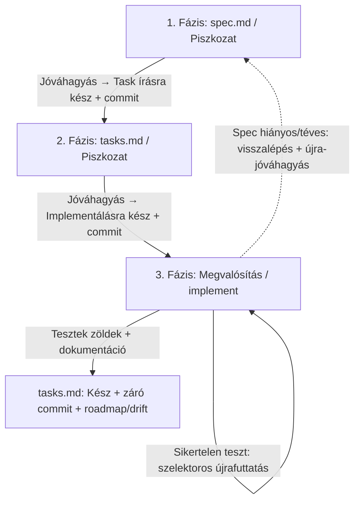

# SDD (Spec-Driven Development) — Egyszerűsített (Lightweight) Flow
<!-- INCLUDE:lang/output-language.md#output-language -->
<!-- INCLUDE:shared/context-check.md -->

---

Ez a dokumentum a projekt **egyszerűsített, háromfázisú** SDD (Spec-Driven Development) flow-ját írja le, kis és jól körülhatárolt feladatokhoz. Ezt a mintát kövesse az AI asszisztens (Agent) akkor, amikor a feladat mérete nem indokolja a teljes (00–09 fázisú) berki spec ciklust.

---

## Mikor ezt a flow-t, és mikor a teljes berki spec-et?

Az Agent a feladat átvétele után **először döntsön a megfelelő flow-ról**, és a döntését indokolja röviden a Felhasználónak.

**Ezt az egyszerűsített flow-t használd, ha a feladat:**
*   3-4 lépésben, egy ülésben/menetben megbízhatóan megoldható;
*   kis, jól körülhatárolt scope-ú — pl. **konfiguráció összeállítása vagy módosítása**, **egyszerűbb script megírása**, kisebb hibajavítás, lokális finomhangolás;
*   nem érint egyszerre több komponenst, és nincs összetett, előre tervezést igénylő architektúrális döntés.

**Lépj át a teljes berki spec folyamatra (a `/bs-add-cycles` paranccsal indítva), ha menet közben kiderül, hogy a feladat:**
*   nagyobb kódírást igényel (új funkció, több fájlon átívelő logika, nem triviális üzleti szabályok);
*   több komponenst, integrációs pontot vagy adatmodellt érint;
*   összetett tervezést, kockázatos refaktort vagy alapos kereszt-fázisos konzisztencia-ellenőrzést kíván.

Ilyenkor az Agent **ne erőltesse a háromfázisú flow-t**: állítsa meg a munkát, jelezze a Felhasználónak, hogy a feladat túlnő ezen a flow-n, és **javasolja** a teljes folyamatot:

<!-- INCLUDE:lang/quick-flow.md#BS-flow-valtas-javaslat -->

A flow-váltás döntése mindig a Felhasználóé; te javasolsz és indokolsz, de nem váltasz önkényesen.

---

## Belépő — mit kaphatsz hívásként

| Hívás alakja | Mit tegyél |
|---|---|
| `/bs-quick-flow` (paraméter nélkül) | indítsd az interjút a nulláról (2. szekció) |
| `/bs-quick-flow input: <a feladat egy mondatban>` | a mondat az interjú kiindulópontja; a hiányzó adatokat kérdezd be |
| `/bs-quick-flow brainstorm: NN` | **brainstorm-átvétel (QF16)** — lásd alább |

**Brainstorm-átvétel (QF16).** Ha a hívás egy brainstorm sorszámára hivatkozik (vagy a Felhasználó egy `.bs-brainstorm/brainstorm-NN-<slug>.md` fájlra mutat), a `spec.md` előtt **olvasd be a desztillátumot**: `ls -1 .bs-brainstorm/brainstorm-NN-*.md`, majd a fájlból a `<sec:bs_goal_question>`, `<sec:bs_facts>`, `<sec:bs_decisions>` és `<sec:bs_open_questions>` szekciókat. A cél, a tények és a döntések **készen kapott bemenetek** — ne kérdezd újra őket. A `<sec:bs_open_questions>` alatti tételeket viszont **egyenként kérdezd meg** a Felhasználótól: a brainstorm szándékosan nyitva hagyta őket, és egy nyitott kérdés kitalálása pontosan az a csendes döntés, amit ez a flow tilt. Ha a `<sec:bs_cycle_split>` szekció **több** ciklus-jelöltet sorol, az a túlnövés jele → javasold a `/bs-add-cycles` folyamatot.

---

## Gyors lépéssor (a teljes folyamat dióhéjban)

> Ez a „happy path". A részleteket lentebb találod; ha elbizonytalanodsz, ide térj vissza.

1. **Branch + flow-méret.** Olvasd a `conventions.md` git-szekcióját, és aszerint készítsd elő az ágat. Döntsd el: tényleg kicsi a feladat? Ha nem → javasold a teljes berki spec-et (`/bs-add-cycles`), és állj meg.
2. **Ciklusmappa.** Határozd meg a következő szabad ciklusszámot a **BQ2** formulával, javasolj nevet, kérj jóváhagyást, majd hozd létre: `specs/cycle-NN-<cycle-name>/`.
3. **1. fázis — `spec.md`.** Írd meg a specifikációt (cél, paraméterek, **technikai vázlat/megközelítés**, tesztstratégia **cél-környezettel**, README-terv), `<field:f_status>: <status:draft>` fejléccel. A végén futtass **konzisztencia-ellenőrzést** és az **RP1 útvonal-kaput**. **⛔ ÁLLJ MEG**, és várd meg a Felhasználó explicit jóváhagyását.
4. **2. fázis — `tasks.md`.** Bontsd pipálható lépésekre (a tesztelés a dokumentáció-frissítés elé kerüljön), **logikus teszt-sorrenddel** és **hatókör-címkével** (`[local]` / `[remote]`). A végén konzisztencia-ellenőrzés + RP1 kapu. **⛔ ÁLLJ MEG**, és várd meg az explicit jóváhagyást.
5. **3. fázis — implementáció.** Dolgozz a `tasks.md` szerint **egy futásban**, pipálj valós időben, minden teszt-lépést **szelektorral, külön** futtass. Ha spec-hiba derül ki → vissza az 1. fázisba + újra-jóváhagyás. **Ha beragadsz** → állj meg, és tegyél fel célzott, előremozdító kérdéseket.
6. **Lezárás.** Tesztek zöldek + dokumentáció frissítve + Felhasználóval egyeztetve → `tasks.md` státusz `<status:done>` → záró commit → roadmap- és drift-jelzés.

A **⛔** jelnél SOHA ne lépj tovább a Felhasználó kifejezett „igen"-je nélkül. A fázisváltás jelzése **nem** a beszélgetésben elhangzott „igen", hanem a **commitolt státusz-mező** (QF2/QF4) — ez teszi a megszakadást és a `/clear`-t túlélhetővé.

---

## 1. Alapelvek és könyvtárszerkezet

*   **Ciklusok (Cycles):** Minden egyes önálló feladat, funkció vagy fejlesztési szakasz egy dedikált mappában történik, az alábbi elnevezési sémát követve:
    `cycle-NN-<cycle-name>` (Pl. `cycle-01-database-management`, `cycle-02-logging-improvement`).
*   **Dokumentumvezérelt fejlesztés:** Kódot írni vagy módosítani szigorúan tilos addig, amíg a tervezési és felbontási fázisok le nem zárultak.
*   **A README.md karbantartása:** A fejlesztések során a projekt fő `README.md` fájljának naprakészen tartása és frissítése nem opcionális lépés; ennek mindig a tervezés (`spec.md`) és a feladatlista (`tasks.md`) részét kell képeznie.
*   **Két artefaktum, két státusz:** a ciklus mappájában **pontosan két** tervezési dokumentum él — `spec.md` és `tasks.md` —, és mindkettő fejléce hordoz egy `<field:f_status>` mezőt (QF2). Nincs `plan.md`: annak a szerepét a `spec.md` technikai vázlata veszi át.
*   **Dokumentáció nyelve:** a fájl elején álló **A kimenet nyelve** blokk szerint — a ciklus-dokumentumok (`spec.md`, `tasks.md`) és a hozzájuk tartozó leírások azt követik. Itt nincs külön szabály; a kódban használt azonosítók, kapcsolók és technikai kifejezések ettől függetlenül angolul maradnak.

---

<!-- INCLUDE:shared/path-format.md -->

> **Ez a flow EGYETLEN kötelező determinisztikus kapuja (QF11).** Az `--paths-only` hívás a ciklus mappájában meglévő `spec.md` / `tasks.md` párra fut, tehát az 1. és a 2. fázis lezárása előtt is. A többi kapu-script (`analyze-gate-check.py` teljes mód, `run-tests.py`, `dod-check.py`, `report-gate-check.py`) a teljes flow-hoz tartozik, és **itt nem fut** — ha ezekre lenne szükséged, az a túlnövés jele.

---

<!-- INCLUDE:shared/artifact-voice.md -->

---

<!-- INCLUDE:shared/dereferencing.md -->

> **Ebben a flow-ban ez még szigorúbb (KX2):** nincs `plan.md`, tehát a `spec.md` az **egyetlen** végrehajtási igazság. Amit itt hivatkozásként hagysz, azt a 3. fázisban senki nem oldja fel helyetted — a `<sec:environment_coords>` helyett a `spec.md` technikai vázlata és tesztstratégiája veszi fel a feloldott értékeket (parancsok, URL-ek, payload, koordináták).

---

<!-- INCLUDE:shared/conventions-change.md -->

> **A négy feltétel leképezése erre a flow-ra (GC1):** a 2. feltétel (a plan tervezi) helyett a `spec.md` **technikai vázlata** rögzíti a `conventions.md` érintett szekciójának konkrét új tartalmát; a 4. feltétel (a 07 teljes köre újra fut) helyett a 3. fázis **tesztje** fut a frissített `conventions.md`-vel. Az 1. és a 3. feltétel változatlan: legyen rá explicit döntés a `spec.md`-ben, és legyen rá külön task a `tasks.md`-ben. Ez a flow tipikus feladata (konfiguráció, port, teszt-parancs) épp az, amit a kapuk a `conventions.md`-ből olvasnak — a frissítése tehát a ciklus része, nem a következő ciklus adóssága.

---

## 2. Új fejlesztési ciklus indítása

Amikor új fejlesztési ciklust kell kezdeni, az alábbi lépések szerint járj el.

1. **Git környezet előkészítése — a `conventions.md`-ből (QF1):** a ciklus indítása előtt olvasd be a projekt gyökerében a `conventions.md` `## <sec:cv_git_conventions>` szekcióját, és **onnan** vedd a paramétereket — ne drótozz be ágnevet vagy commit-formátumot:
   * **No-VCS kapu:** ha a szekció szerint a projektnek nincs verziókezelője, **minden git-művelet kimarad** ebből a flow-ból (branch, commit, `git status`) — a fázisok a státusz-mező átírásával zárulnak.
   * **<field:f_main_branch>** (alapból `main`): ha ezen az ágon állsz, kérd be a Felhasználótól a ciklus rövid nevét (és amit a konvenció megkövetel — pl. Jira-azonosítót), majd hozd létre a feature ágat a **<field:f_branch_naming>** szerint (alapból `feature/cycle-NN-<cycle-name>`), és válts rá.
   * **Ha már a ciklus ágán vagy:** ellenőrizd `git status --short`-tal, hogy tiszta-e a munkafa. Ha vannak commitolatlan változtatások, figyelmeztesd a Felhasználót, hogy a ciklus előtt érdemes commitolni; ha jóváhagyja, kérd be a commit üzenetet, és commitolj.
   * **Commit-üzenet formátum:** a `conventions.md` git-szekciója dönt. Ha a projekt Jira-prefixes konvenciót ír elő, a commit azzal kezdődik (pl. `OCTDCBS-18553: <üzenet>`) — de ez a konvenció **egyik esete**, nem a flow saját szabálya. A nagy flow `cycle-NN: <fázis-tag>` alakját itt **nem** használjuk: arra a `07`/`09` keres vissza, ami ebben a flow-ban nem fut.
   * _Ez a rövid munkafa-ellenőrzés szándékosan nem a `00`/`01` teljes branch-nyitó preflightja (worktree-ág, PW1–PW5): ide az túlméretezett. A **forrása** viszont ugyanaz — a `conventions.md`._
2. **Cél megadása és interjú (grill = addig kérdezel, amíg minden tiszta):** A Felhasználó leírja, miről szól a ciklus (milyen funkciót, javítást vagy módosítást kell megvalósítani). Kérdezz addig, amíg minden szükséges információ a kezedben van a specifikáció megírásához. Brainstorm-átvételnél a belépő szekció szerint járj el (QF16).
   * **Flow-méret ellenőrzés (kötelező):** Az interjú alatt végig mérlegeld, hogy a feladat tényleg illik-e az egyszerűsített flow-ra (lásd a „Mikor ezt a flow-t…" szekciót). Ha túlnő rajta (nagyobb kódírás, több komponens, összetett tervezés), **állj meg és javasold a teljes berki spec folyamatot** (`/bs-add-cycles`), mielőtt belekezdenél a `spec.md`-be.
3. **Ciklusszám megkeresése (BQ2):** a következő szabad ciklusszámhoz **nem elég** a `ls specs/` — létezhet olyan ciklus, ami csak egy még nem merge-elt feature branch-en él, és azzal ütköznél. Ezért a `01-add-cycles` **„Ciklusszám meghatározása (BQ2)"** szekciójának formuláját használd: verziókezelő mellett `NN = max(a `specs/roadmap.md` és az `ls specs/` ciklusszámai, a `git branch -a --list '*cycle-*'` branch-nevekből kinyert `cycle-(\d+)` számok) + 1`; No-VCS ágon a branch-scan kimarad. Két számjegy, vezető nullával (`01`, `02`, `03` …).
4. **Névjavaslat:** A leírás és az interjú alapján javasolj nevet az új ciklusnak (kisbetűs, kötőjeles, pl. `add-health-check` vagy `fix-tls-handshake`), és vele a teljes mappanevet (pl. `cycle-03-add-health-check`). A mappanév mindig a `cycle-NN-<cycle-name>` sémát kövesse (kötőjellel a `cycle` szó után).
5. **Jóváhagyás:** A Felhasználó jóváhagyja vagy módosítja a javasolt nevet és sorszámot.
6. **Inicializálás:** A jóváhagyás után hozd létre az új ciklusmappát a `specs/` alatt (pl. `specs/cycle-03-add-health-check/`), és kezdd el benne a `spec.md`-t (1. fázis). A `spec.md` megírásához kötelezően használd fel az interjú során gyűjtött teljes kontextust.
7. **Roadmap-bejegyzés (QF6):** ha a `specs/roadmap.md` **létezik**, vedd fel a ciklust egy sorral — így a projekt ciklustörténete teljes marad, és a következő BQ2 is látja:

   <!-- INCLUDE:lang/quick-flow.md#BS-roadmap-sor -->

   **Ha a `specs/roadmap.md` nem létezik, ne hozd létre** — a roadmap gazdája a `01-add-cycles`. Ilyenkor a záró üzenetben egy sorban mondd ki, hogy a ciklus nincs regisztrálva a roadmapben.

---

## 3. A Háromfázisú SDD Munkafolyamat

A fejlesztési ciklus szigorúan három egymást követő fázisra tagozódik. A fázisok között nincs átjárás előreugrással, és a fázishatárt a **commitolt státusz-mező** jelzi.



### 1. Fázis: Specifikáció (`spec.md`)
Ebben a fázisban tisztázzuk a követelményeket és rögzítjük a pontos technikai tervet.
*   **Lépés:** Hozz létre egy `spec.md` fájlt az aktuális `cycle-NN-<cycle-name>` mappában, a fejlécében a státusz-mezővel (QF2):

    ```md
    # Cycle NN: <cím>

    **<field:f_status>:** `<status:draft>`
    ```

    A `<status:draft>` a fázis végén, a **felhasználói jóváhagyás pillanatában** vált `<status:ready_for_tasks>`-ra — a státuszírás és a commit egyetlen, megszakíthatatlan lépéspár (lásd „Fázis-zárás").
*   **Ágens-támogatás (opcionális) — `researcher`:** Ha a feladat meglévő kódbázist érint, és nem nyilvánvaló, mely fájlokat kell módosítani vagy mely dokumentumokat kell frissíteni, indítsd el a `researcher` subagentet (read-only). Tömör listát ad vissza az érintett forrásfájlokról (`path:sor–sor`) és a frissítendő dokumentumokról — a fő ágens kontextusablakát kímélve. Tiszta zöldmezős scriptnél vagy egyszerű konfigurációnál ez kihagyható.
*   **Tartalom:** 
    *   Részletes célkitűzés és működési logika.
    *   Változók, konfigurációs paraméterek, elnevezési sémák.
    *   **Megközelítés / technikai vázlat (a `plan.md`-t helyettesítő állványzat — kötelező):** Mielőtt a `tasks.md`-re lépnél, a `spec.md`-ben rögzítsd a megvalósítás technikai HOGYAN-ját — ez adja a gyengébb/olcsóbb modellnek azt az állványzatot, amit a teljes flow-ban a külön `plan.md` biztosítana. Tartsd tömören (jellemzően 3-6 pont), és maradj szigorúan a spec scope-ján belül (ne tervezz olyat, ami a célból nem következik):
        *   **Érintett fájlok:** mely fájlok jönnek létre vagy módosulnak (relatív `path`), egy-egy szóban a szerepük.
        *   **Minden előfordulás számbavétele (csere/átnevezés esetén — kötelező):** ha a feladat egy visszatérő elem (változó, függvény, parancs, érték, minta) előállítását vagy alakját cseréli/nevezi át, előbb **keresd meg az ÖSSZES előfordulását** a kódban (pl. `grep -rn '<minta>'`), és sorold fel mindet a vázlatban. A módosítás scope-ja a teljes előfordulás-halmaz, **nem csak az a hely, amire a feladat ránézésre koncentrál** — egy gyengébb modell hajlamos csak a fókuszált helyet átírni, a többit némán meghagyni.
        *   **Kulcs-elemek:** a fontosabb függvények / interfészek / parancsok aláírása és paraméterei, konfigurációs kulcsok, adat- vagy névsémák — annyi részlettel, hogy az implementáció ne igényeljen újratervezést.
        *   **<sec:execution_order>:** a megvalósítás lépéseinek logikai sorrendje (mi mitől függ); erre ül majd rá a `tasks.md` bontása.
        *   **Fő hibakezelési / határeset-döntés:** a legfontosabb hibaág vagy él-eset és a rá adott válasz (pl. hiányzó konfig, sikertelen kapcsolat, üres bemenet).
        *   Pszeudokód vagy rövid kódrészletek ott, ahol egy konkrét rész tisztázását ez indokolja.
        *   **Tripwire:** ha ez a vázlat önmagában külön, alapos tervezési review-kört kívánna (sok komponens, kockázatos refaktor, nem-triviális architektúra), az annak a jele, hogy a feladat túlnőtt ezen a flow-n → állj meg, és javasold a teljes berki spec folyamatot (lásd a „Mikor ezt a flow-t…" szekciót).
    *   **Kötelező Tesztelési Stratégia:** Részletes terv arra vonatkozóan, hogyan teszteljük az aktuálisan bevezetendő funkciókat. Ha a tesztelési mód nem egyértelmű, az Agent köteles kérdezni a felhasználótól és egyeztetni a tesztelési megközelítést. A stratégia **prózában** áll (ez a flow olcsó marad, nincs gépi futtatási tábla) — de az alábbi hat pont **nem hagyható el**.
        *   **🔴 <field:f_target_env> — kötelező mező (QT1 · EV1).** A tesztstratégia **első sora** mondja ki, MELY környezetre szól a ciklus: `**<field:f_target_env>:** lokális` / `remote` / `lokális + remote`. Egy zöld teszt önmagában nem bizonyítja, HOL volt zöld — pontosan ez a flow (konfiguráció, üzemeltetés, script) van ennek a legjobban kitéve.
        *   **🔴 Nem lokális cél esetén három megkötés (QT1 · EV3/EV5):** (a) a **cél-host literálisan szerepeljen a parancsban** — egy npm-script neve vagy egy configfájlba rejtett cím **nem elég**, mert a naplóból nem derül ki, hova ment a hívás; (b) a teszt-lépés előtt álljon egy **elérhetőségi probe ugyanarra a hostra** (pl. `curl -sf https://<host>/health`), hogy egy hálózati hiba ne teszthibaként jelenjen meg; (c) `localhost` és `127.0.0.1` alak a parancsban **nem használható** — kivéve, ha a lokálisnak látszó cím egy **deklarált port-forward** mögött van, és ezt a `spec.md` kimondja (mi forwardol, melyik klaszter-erőforrásra).
        *   **🔴 Hatókör-címke minden teszt-lépésen (QT2) — `[local]` vagy `[remote]`.** Ez **nyelvfüggetlen literál**, mint a teljes flow-ban (EV8): joinolható marad, és a mappanevek a keretben mindig angolul állnak. `remote` minden olyan lépés, amely akár EGYETLEN olyan komponenst is megszólít, ami nem a lokális gépen fut — a saját gépen futó konténer még `local`, egy `oc port-forward` mögötti `127.0.0.1:8080` viszont `remote`. Címke nélküli lépés alapértéke `local`. Kapu ezt itt nem méri; az érték az, hogy a **szándék kimondva** legyen, és a remote-teszt hiánya **hiányként** kiolvasható legyen.
        *   **🔴 Minden teszt-lépés kimondja, mit ellenőriz és miért (QT3 · TD7).** Egy **állítás**-mondat, a `spec.md` cél- vagy DoD-pontjára hivatkozva — nem a lépés címének megismétlése („a health check tesztelése"). Enélkül bukásnál nem eldönthető, hogy a kód rossz-e vagy a teszt, és a legkönnyebb zöldítő út lesz a nyerő. Ha nem tudod egy mondatban megmondani, mit ellenőriz a lépés, a lépés **nincs megtervezve**. Kalibrációs minta:

            ```md
            #### T-02 [remote] — A megújított tanúsítvány kiszolgálása
            **<field:f_what_it_checks>:** a route a megújítás után az ÚJ tanúsítványt szolgálja ki (a `notAfter` a mai dátumnál későbbi), tehát a `deploy.sh` tényleg kicserélte a secretet — nem csak létrehozott egy másodikat (Cél 2. pont).
            **Előfeltétel (probe):** `curl -sf -o /dev/null https://api.apps.ocp-test.example.com/health`
            **Parancs:** `echo | openssl s_client -connect api.apps.ocp-test.example.com:443 | openssl x509 -noout -enddate`
            **Elvárt:** `notAfter=` a mai dátum + 90 nap, ±1 nap.
            ```

            _A mintát a **sűrűségéért** másold, ne a témájáért (TD5): egy állítás, egy probe, egy futtatható parancs, egy eldönthető elvárt eredmény._
        *   **🔴 Vacuous teszt nem teszt (QT4 · TB1).** `assert True`, üres tesztfüggvény-törzs, `assert x == x`, vagy csak a fájl/erőforrás **létezését** ellenőrző váz: ezek a hibás implementáción is zöldek. Minden teszt-lépésnek legyen olyan állítása, ami a hibás implementáción **elbukna**. _(A teljes flow `test-substance-check.py` kapuja itt nem fut — a mérce ugyanaz, csak a betartatás a tiéd.)_
        *   **🔴 A `skipped` nem bizonyíték (QT5 · SK1).** Egy `pytest.skip` / `test.skip` / feltételes korai kilépés úton záruló teszt **semmit nem igazol**. Ha egy tervezett teszt skippel, a ciklus lezárása **előtt** mondd ki a Felhasználónak: melyik teszt, miért skippelt, és mi maradt így bizonyítatlanul. Skippelt teszt **nem számolható zöldnek**.
        *   **Visszatérő teszt-elvárások (TC1) — csak olvasás:** ha létezik `specs/test-conventions.md` (a teljes flow `08-doc-sync` fázisa tartja karban), olvasd be, és a ciklushoz szükséges tételeket **önhordóan emeld be ide** — a hozzájuk tartozó recept-adatokkal együtt (URL-ek, portok, namespace/pod, teszt-userek és jelszavaik, paraméterek, példa `curl` hívások, build/deploy parancsok, előfeltételek és sorrend). Puszta hivatkozás nem elég, placeholder nem használható: ebben a flow-ban a `spec.md` az egyetlen végrehajtási igazság. Jelöld a provenance-t (`_(forrás: test-conventions.md R03)_`).
        *   **A fájlt ebben a flow-ban NEM írod.** A `test-conventions.md` gazdája a `08-doc-sync`, ami itt nem fut. Ha elavult vagy hiányos adatot találsz benne, **kérdezz rá a Felhasználónál**, a helyes adatot a `spec.md`-be írd, és jelezd, hogy a regiszter frissítése a teljes flow doc-sync fázisában (vagy kézzel) elvégzendő. Ha a fájl nem létezik, ne hozd létre.
        *   **`<status:scope_shared_remote>` hatókörű recept** (a regiszter így jelöli, pl. megosztott dev klaszter pod-restart, image-push): a beemelés előtt **kötelezően egyeztesd a Felhasználóval** — lásd a lenti „Valós (nem-mock) tesztkörnyezet" pontot.
    *   **Valós (nem-mock) tesztkörnyezet — egyeztetés és takarítási terv (kötelező):** Ha a teszt **nem mock/izolált környezetben** fut, hanem **valódi, megosztott vagy külső rendszeren** hoz létre erőforrást (pl. OpenShift/Kubernetes namespace, pod, deployment, route, secret; adatbázis-rekord; cloud-erőforrás; külső szerverkomponens), akkor:
        *   **Az erőforrás-létrehozás körülményeit előzetesen egyeztetni kell a Felhasználóval:** hol (melyik cluster/namespace/környezet), milyen néven, milyen jogosultsággal jönnek létre az erőforrások, és van-e ütközés- vagy mellékhatás-kockázat meglévő elemekkel.
        *   **A teszt utáni takarítást (cleanup) külön meg kell beszélni a Felhasználóval**, és a `spec.md`-nek a végén **tételesen tartalmaznia kell, pontosan mit fog letörölni és mit fog meghagyni** a tesztfutás után. Csak az aktuális tesztfutás által létrehozott elemek törölhetők; meglévő vagy megosztott erőforrást tilos érinteni (lásd „Takarítási biztonság" a Best Practice szekcióban).
        *   Ha a tesztelés tisztán mock/lokális (nem nyúl valós, megosztott rendszerhez), ez a pont kihagyható.
    *   A `README.md` frissítésének terve.
*   **Konzisztencia-ellenőrzés (kötelező, a fázis végén):** Mielőtt a `spec.md`-t a Felhasználó elé adnád jóváhagyásra, **nézd át az egész dokumentumot, és ellenőrizd a visszatérő értékek konzisztenciáját**: elérési utak/útvonalak, szerver-/hostnevek, felhasználónevek, port-számok, adatbázis-/erőforrásnevek, környezeti változók, fájlnevek stb. — ugyanaz az érték szerepeljen mindenhol, ahol ugyanarra a dologra hivatkozol. Ha valahol **gyanúsan eltér** egy érték (pl. két helyen más-más usernév vagy hostnév, elgépelésnek tűnő különbség), **ne javítsd csendben**: hívd fel rá a Felhasználó figyelmét, jelezd hol és mire tér el, és kérdezz rá a helyes értékre.
*   **RP1 útvonal-kapu (kötelező, a konzisztencia-ellenőrzés után):** futtasd a `--paths-only` hívást a ciklus mappájára (lásd az „Útvonal-formátum" blokkot). Nem `0` kilépő kód → javítsd a talált útvonalakat, és futtasd újra; a fázis kapu-`PASS` nélkül nem záródik.
*   **Szabály (Kritikus):**
    *   Ebben a fázisban semmilyen projektfájlt (kód, meglévő dokumentáció) ne módosíts.
    *   **⛔ ÁLLJ MEG a fázis végén.** A 2. fázist (a `tasks.md`-t) **csak akkor kezdd el, ha a Felhasználó kifejezetten (explicit módon) jóváhagyta** a `spec.md`-t. Jóváhagyás nélkül ne lépj tovább.
    *   **Fázis-zárás (státusz + commit, egyetlen lépéspár):** a jóváhagyás elhangzása után azonnal, még a 2. fázis megkezdése előtt (a) írd át a `spec.md` `<field:f_status>` mezőjét `<status:ready_for_tasks>`-ra, majd (b) commitolj: `git add specs/cycle-NN-<cycle-name>/`, és a `conventions.md` szerinti üzenettel `git commit`. A kettő között ne kérdezz, ne várj, ne kezdj más munkába. **Ellenőrizd determinisztikusan, ne „érzésre":** `git log -1 --oneline && git status --short specs/cycle-NN-<cycle-name>/` — az első sorban a most készült commit álljon, a `git status` kimenete a ciklus mappájára **üres** legyen; ha nem, javítsd és futtasd újra (legfeljebb 2 próbálkozás). A válaszodban írd ki a commit azonosítóját. Külön engedélyt ne kérj rá: a fázis jóváhagyása magában foglalja. No-VCS ágon a commit kimarad, a státuszírás nem. _(A közös eljárás forrása a `phase-commit.md` blokk; a commit-üzenet formátuma viszont itt a `conventions.md`-ből jön, nem a `cycle-NN: <fázis-tag>` alakból.)_
    *   **Fázishatár (PE1):** a fázis a commit azonosítójának kiírásával **véget ér**. Ugyanabban a körben a `tasks.md`-t **létre sem hozod** — sem „csak előkészítésként". Ha mégis megtetted, töröld a keletkezett fájlt, és jelezd a Felhasználónak.

### 2. Fázis: Feladatlista (`tasks.md`)
A jóváhagyott specifikáció alapján elkészítjük a lépésről lépésre követhető feladatlistát.
*   **Belépő fázis-kapu (QF4):** olvasd be a `spec.md` fejlécének `<field:f_status>` mezőjét. Ha az értéke **nem** `<status:ready_for_tasks>`, **STOP** — a spec nincs jóváhagyva (vagy a jóváhagyás nem lett commitolva). Ne a beszélgetés emlékére hagyatkozz: `/clear` vagy megszakadás után a státusz-mező az egyetlen, ami túléli.
*   **Lépés:** Hozz létre egy `tasks.md` fájlt az aktuális `cycle-NN-<cycle-name>` mappában, `**<field:f_status>:** <status:draft>` fejléccel.
*   **Tartalom:**
    *   **A „Megközelítés / technikai vázlat" a kiindulópont:** a task-bontás a `spec.md`-ben rögzített technikai vázlatra (érintett fájlok, kulcs-elemek, végrehajtási sorrend) épüljön — a lépések sorrendje kövesse a vázlat végrehajtási sorrendjét. Ha bontás közben a vázlat hiányosnak vagy tévesnek bizonyul, az **spec-hiány**: lépj vissza az 1. fázisba és egészítsd ki (újra-jóváhagyással), ne a `tasks.md`-ben pótold csendben.
    *   Pipálható feladatlista (Markdown checkboxok: `- [ ]`).
    *   **A Tesztelés helye a sorrendben:** A tesztelési lépéseket (a specifikált tesztelési stratégia alapján) explicit fel kell venni a `tasks.md` listájába, mégpedig a dokumentáció frissítése (pl. `README.md` szerkesztés) **elé**.
    *   **A teszt-lépések alakja (QT1–QT3, QT6):** minden teszt-lépés fejléce viseli a `[local]` / `[remote]` címkét, alatta ott az **állítás** (mit ellenőriz és miért, melyik cél-/DoD-pontra), a **probe** (nem lokális célnál), a **szelektoros parancs** és az **elvárt eredmény** — ugyanabban a négyesben, amit a `spec.md` kalibrációs mintája mutat. Placeholder-host és configfájlba rejtett cím itt sem használható.
    *   **A tesztek logikus sorrendje (kötelező):** A `tasks.md` megírása után **ellenőrizd a tesztelési lépések logikai sorrendjét**, hogy minden lépés előfeltétele korábban már teljesüljön. Egy erőforrás (pl. fájl, adatbázis-rekord, deployment, szolgáltatás, hálózati kapcsolat) **meglétét vagy állapotát csak azután ellenőrizd, hogy egy korábbi lépés azt már létrehozta / beállította**; takarítás (cleanup) utáni „már nem létezik" jellegű ellenőrzés pedig a törlés után álljon. Ha a sorrend nem állja meg a helyét (utólag hivatkozol valamire, ami még nem jött létre), rendezd át a lépéseket, mielőtt a Felhasználó elé adnád.
    *   **A regressziós összefutás külön, UTOLSÓ lépés (QT6):** a teljes teszt-készlet egyszeri lefuttatása a lista **végén** áll, önálló lépésként — nem helyettesíti a lépésenkénti, szelektoros futtatást.
    *   Lépésekre bontott feladatok a fájlok létrehozására, szerkesztésére, a tesztelés lefolytatására, valamint a dokumentációk frissítésére.
*   **Ágens-támogatás (opcionális) — `analyzer`:** Ha a `spec.md` és a `tasks.md` viszonya bonyolultabb (több követelmény, könnyen kicsúszó lefedettség), egy könnyű konzisztencia-ellenőrzéshez indítható az `analyzer` subagent (read-only). A helyettesítéseket a 4. szekció adja meg tételesen. Kis, egyértelmű task-listánál fölösleges — ne erőltesd.
*   **Konzisztencia-ellenőrzés (kötelező, a fázis végén):** A `tasks.md` elkészülte után **ellenőrizd a visszatérő értékek konzisztenciáját a `tasks.md`-n belül ÉS a `spec.md`-vel összevetve**: elérési utak/útvonalak, szerver-/hostnevek, felhasználónevek, port-számok, adatbázis-/erőforrásnevek, környezeti változók, fájlnevek, parancsok stb. Ugyanaz az érték szerepeljen mindenhol, és egyezzen a `spec.md`-ben rögzítettel. Ha valahol **gyanúsan eltér** egy érték (a két dokumentum között vagy a `tasks.md`-n belül), **ne javítsd csendben**: hívd fel rá a Felhasználó figyelmét, jelezd hol és mire tér el, és kérdezz rá a helyes értékre.
*   **RP1 útvonal-kapu (kötelező):** futtasd újra a `--paths-only` hívást — most már a `spec.md` + `tasks.md` párra fut.
*   **Szabály (Kritikus):**
    *   A `tasks.md`-t ne kezdd el a `spec.md` jóváhagyása (és a státusz commitolása) előtt.
    *   A 3. fázisra (implementáció) csak akkor lépj, ha a `spec.md` és a `tasks.md` **teljesen koherens**, és nincs nyitott kérdés közted és a Felhasználó között.
    *   **⛔ ÁLLJ MEG a fázis végén.** Az implementációt (3. fázis) **csak a `tasks.md` explicit felhasználói jóváhagyása után** kezdd el. Jóváhagyás nélkül ne lépj tovább.
    *   **Fázis-zárás (státusz + commit, egyetlen lépéspár):** a jóváhagyás után azonnal (a) írd át a `tasks.md` státuszát `<status:ready_for_implement>`-re, majd (b) commitolj a ciklus mappájára, a `conventions.md` szerinti üzenettel, és ellenőrizd az 1. fázisnál leírt determinisztikus módon (`git log -1 --oneline` + üres `git status --short`). Külön engedélyt ne kérj rá. No-VCS ágon a commit kimarad.
    *   **Fázishatár (PE1):** a commit után ugyanabban a körben **nem kezded el** az implementációt — sem kódot nem írsz, sem előkészítést nem végzel.

### 3. Fázis: Megvalósítás (Implementáció)
Ebben a fázisban történik a tényleges kódolás a feladatlista alapján.
*   **Belépő fázis-kapu (QF4):** olvasd be a `tasks.md` `<field:f_status>` mezőjét. Ha az értéke **nem** `<status:ready_for_implement>`, **STOP** — a feladatlista nincs jóváhagyva.
*   **A `tasks.md` az egyetlen forrás:** kizárólag a `tasks.md` szerint dolgozz. Ne térj el tőle, és ne hagyj ki lépést.
*   **Valós idejű pipálás:** ahogy egy feladatsorral végeztél, **azonnal pipáld ki (`- [x]`)** a `tasks.md`-ben, még a következő feladat előtt.
*   **Visszamenőleges pipálás:** ha egy korábbi lépés pipálása megszakadt vagy kimaradt, pótold azonnal.
*   **Egy futásban, megszakítás nélkül (IM1):** a task lista feldolgozása **egy** futás. Egy task kipipálása **nem** fázis-vég — lásd a „Megállási szabályok" szekciót.
*   **Teljes körű csere ellenőrzése (leftover-sweep) — kötelező csere/átnevezés után:** ha egy visszatérő elemet cseréltél vagy neveztél át, a végén **keress rá újra a RÉGI alakra** (pl. `grep -rn '<régi minta>'`), és győződj meg róla, hogy nem maradt elárvult előfordulás. Erre **ne a tesztekre hagyatkozz**: egy nem-fedett kódág (pl. ritkán futó elágazás) zölden átengedi a kihagyott helyet — a grep-alapú ellenőrzés determinisztikus és független a tesztlefedettségtől.
*   **🔴 Egy futtatás = egy azonosítható teszt (QT6 · CK1/TX1):** minden teszt-lépés **azonosíthatóan, szelektorral** fut (pl. `pytest tests/test_cert.py::test_renewed_cert_served`, `npm test -- -t "<teszt neve>"`), **egy lépés = egy futás**. Ne futtass gyűjtő köröket a lépések helyett: egy összevont futásból sem a lefutás ténye, sem a bukás helye nem azonosítható vissza, és a hiányzó teszt is zöldnek látszik.
*   **Sikertelen teszt kezelése (QT6):** ha egy teszt elbukik, lépj vissza az implementációs lépésekhez, javíts, majd **futtasd újra ugyanazt a lépést a saját szelektorával** — így a bukás és a javulás is visszakereshető marad. A **regressziós összefutás** a lista utolsó lépéseként fut le, egyszer, a lépésenkénti futtatások **után** (nem helyettük).
*   **Skippelt teszt (QT5 · SK1):** ha egy tervezett teszt `skipped` állapotban zárult, azt **ne** számold zöldnek: a lezárás előtt mondd ki a Felhasználónak, melyik teszt, miért, és mi maradt bizonyítatlanul.
*   **Beragadás / végtelen kör felismerése (kör-megszakító):** ha azon kapod magad, hogy **ugyanaz a teszt vagy hiba 2-3 javítási kör után is változatlanul bukik**, vagy **ugyanazt a lépést / parancsot / javítást ismételgeted érdemi előrelépés nélkül** (ugyanaz a hibaüzenet, körkörös ok-okozat), akkor **ismerd fel, hogy beragadtál, és NE próbálkozz tovább vakon**. Ehelyett:
    1. **Állj meg** (ne égess több kört ugyanazon).
    2. Foglald össze röviden a Felhasználónak: **mit próbáltál** (a próbálkozások és kimenetük), **mi a pontos hibaüzenet**, és **mik a hipotéziseid** az okról.
    3. **Tegyél fel célzott, előremozdító pontosító kérdéseket** — olyanokat, amelyek konkrét válasza ténylegesen kiszabadítja a futtatást (pl. hiányzó jogosultság/credential, helyes endpoint vagy erőforrásnév, környezeti előfeltétel, elvárt viselkedés egy határesetben). Kerüld az általános „mit tegyek?" kérdést; kérj **döntésre vagy adatra** lebontott információt.
    4. **⛔ Várd meg a Felhasználó válaszát**, és csak az új információ birtokában folytasd. Ha a beragadás oka a spec hiányossága, lépj a „Fázis-visszalépés (spec-hiba esetén)" szerint vissza az 1. fázisba.
*   **Fázis-visszalépés (spec-hiba esetén):** ha menet közben kiderül, hogy a `spec.md` hiányos vagy téves, **tilos csendben eltérned** tőle. Ehelyett:
    1. Állj meg.
    2. Lépj vissza az 1. fázisba, és frissítsd a `spec.md`-t (és ha kell, a `tasks.md`-t) — a `spec.md` státusza ilyenkor visszaáll `<status:draft>`-ra.
    3. **⛔ Kérd be újra a Felhasználó explicit jóváhagyását**, és csak utána folytasd a kódolást (a státusz újra `<status:ready_for_tasks>`).
    *   Előreugrani továbbra sem szabad; visszalépni a spec pontosításáért viszont kötelező, ha a terv és a valóság elválik.
*   **Ágens-támogatás (opcionális) — `reviewer`:** A záró commit **előtt** indítható egy gyors kód-review a `reviewer` subagenttel (read-only): átnézi a diff-et a konvenciók, a scope-fegyelem, a hibakezelés és a spec-megfelelés szempontjából. A helyettesítéseket (bemenet, kimeneti útvonal) a 4. szekció adja meg tételesen. A teljes flow-tól eltérően itt **nincs automatizált review-önjavító hurok**: a `<status:must_fix>` találatokat az Agent egyszerűen javítja a lezárás előtt, a `<status:suggestion>`-öket pedig jelzi a Felhasználónak. Kis, alacsony kockázatú változásnál (pl. egy konfigurációs sor) ez kihagyható.
*   **`docs-generated/` drift-jelzés (QF7):** ha a projektben **létezik** a `docs-generated/` mappa, és a ciklus a rendszer **viselkedését** változtatta, a lezárás előtt vegyél fel egy sort a `docs-generated/design-drift.md`-be:

    <!-- INCLUDE:lang/quick-flow.md#BS-drift-sor -->

    **és** mondd ki a Felhasználónak, hogy a `docs-generated/` a következő teljes ciklus `08-doc-sync` fázisáig elavult marad. Indok: a `02-write-spec` a `system-overview.md`-t **current truth**-ként olvassa be, tehát egy jelöletlen drift a következő nagy ciklus specjét mérgezi. A `docs-generated/` **többi** fájljához (`system-overview.md`, `architecture.md`, `CHANGELOG.md`, mappa-index) **ne nyúlj** — azok gazdája a `08-doc-sync`. Ha a mappa nem létezik, ez a pont kimarad.
*   **Befejezési feltétel / Ciklus Lezárása:** Az implementáció és a teljes ciklus **kizárólag akkor tekinthető késznek és lezártnak**, ha:
    1. A meghatározott tesztek hiba nélkül lefutottak — lépésenként, szelektorral, plusz a záró regressziós futás; a skippelt tesztek kimondva.
    2. A kapcsolódó dokumentáció (pl. `README.md`) frissítésre került, és — ha releváns — a `docs-generated/design-drift.md` drift-sora bekerült.
    3. Az elért eredményeket a Felhasználóval ellenőriztük és egyeztettük.
    4. **A `tasks.md` státusza `<status:done>`, és a ciklust lezáró commit elkészült** — a commit üzenete a `conventions.md` git-konvenciója szerint. Ha a `specs/roadmap.md` létezik, a ciklus sora is lezárt állapotot kap (QF6); ha nem létezik, ezt egy sorban jelezd.

---

## 4. Felhasznált specialista ágensek

Az egyszerűsített flow szándékosan **kevés** specialista ágenst használ, és mindegyiket **opcionálisan** — a kis feladatok többségénél a fő ágens önállóan, subagent nélkül is elvégzi a munkát.

> **Gyengébb/olcsóbb modellel:** ha bizonytalan vagy, **nyugodtan hagyd ki mind a három opcionális ágenst** — a flow nélkülük is teljes. Magának a subagentek vezénylésének is van hibakockázata, ezért kis feladatnál inkább dolgozz közvetlenül, és csak akkor nyúlj ágenshez, ha egyértelműen segít.

A használható ágensek (mind a platform telepített agent-definícióiból, ezeken a neveken hívhatók):

| Ágens | Hol (fázis) | Mit ad | Mikor érdemes |
|---|---|---|---|
| `researcher` | 1. fázis (spec.md) | Érintett forrásfájlok (`path:sor–sor`) + frissítendő dokumentumok tömör listája (read-only) | Meglévő kódbázis módosításakor, ha nem nyilvánvaló az érintett fájlkör |
| `analyzer` | 2. fázis (tasks.md) | `spec.md` ↔ `tasks.md` konzisztencia-diagnózis: lefedettségi rés, kétértelműség, alulspecifikáció (read-only) | Több követelményes, könnyen kicsúszó task-listánál |
| `reviewer` | 3. fázis (záró commit előtt) | Diff code review: konvenciók, scope, hibakezelés, spec-megfelelés → `<status:must_fix>` / `<status:suggestion>` (read-only) | Nem triviális kódváltozásnál, a commit előtti minőségi kapuként |

### Kontraktus-helyettesítések (QF18) — a hiányzó bemenetek pótlása

A három agent-prompt **törzse a teljes flow-hoz készült**, és változatlan marad. Amit ez a flow ad hozzá: mi kerül a hiányzó bemenetek helyére, és hova íródik a kimenet. **A hívásodban ezt mondd ki explicit**, különben az ágens nem létező fájlokat keres.

| Ágens | Amit a prompt vár | Amit ebben a flow-ban kap |
|---|---|---|
| `researcher` | ad-hoc kutatási kérdés (Mód B) | **változatlan használat** — nincs helyettesítés |
| `analyzer` | hatókör-paraméter + `analyze/slices/<hatókör>.md` szelet | **hatókör-paramétert nem adunk** → a prompt dokumentált degradációs ága szerint mind az öt kategóriát viszi; **szelet-fájl nincs** |
| `analyzer` | `spec.md` + `plan.md` + `tasks.md` hármas, `<sec:coverage_matrix>` blokk | a `spec.md` + `tasks.md` **pár**; a `plan.md` helyét a `spec.md` **technikai vázlata** veszi át. **A `plan.md`-re hivatkozó bemeneti pontja ebben a flow-ban üres**, és lefedettségi mátrix sincs (nincs `DoD-NN → [P-…] → task` lánc) |
| `reviewer` | kötelező `plan.md` | a `spec.md` **technikai vázlata** (és a tesztstratégiája) |
| `reviewer` | kimenet: `specs/cycle-NN-<cycle-name>/test-report/code-review.md` | **`specs/cycle-NN-<cycle-name>/code-review.md`** — a ciklus gyökerében, `test-report/` almappa nélkül: azt a mappát ez a flow nem használja |
| `reviewer` | `MF-NN` azonosítók, RV-INC inkrementális írás | **megmarad** (ez adja a megszakadás-tűrést) |
| `reviewer` | önjavító hurok, per-item számláló, `review-fixer` | **nincs** — a `<status:must_fix>` tételeket a fő ágens a lezárás előtt **inline** javítja, a `<status:suggestion>`-öket jelzi |

**Amit ez a flow NEM használ (és miért):**
*   **Fixer-wrapperek** (`spec-fixer`, `plan-fixer`, `tasks-fixer`, `implement-fixer`, `review-fixer`): ezek a teljes flow **önjavító hurkainak** belépői (05-analyze / 07-validate). Itt nincs automatizált önjavító hurok — a hibákat a fő ágens közvetlenül, inline javítja. A `plan-fixer` ráadásul `plan.md`-t feltételez, ami ennél a flow-nál nem létezik.
*   **`doc-sync-planner`**: a teljes flow `docs-generated/` élő dokumentáció-szinkronjának (08-doc-sync) tervkészítője. Az egyszerűsített flow-ban a dokumentáció frissítése a 3. fázis része (pl. `README.md`), nincs külön generált doc-réteg — a drift-jelzésre a QF7 szolgál.

Ha a feladat olyan nagy, hogy ezek a hurkok és ágensek valóban indokoltak lennének, az általában annak a jele, hogy **a teljes berki spec folyamatra kell váltani** (lásd a „Mikor ezt a flow-t…" szekciót).

---

## 5. Megállási szabályok — és a kimondott ellenpár (IM1)

**Ez a flow az alábbi esetekben áll meg, és CSAK ezekben:**

| Eset | Hol | Mit tegyél |
|---|---|---|
| ⛔ Fázis-kapu | az 1. és a 2. fázis végén | várd meg a Felhasználó explicit jóváhagyását; utána státusz + commit |
| Belépő státusz-kapu (QF4) | a 2. és a 3. fázis elején | ha a bejövő státusz nem a várt, STOP és jelezd |
| Túlnövés (tripwire) | bárhol | javasold a teljes berki spec folyamatot, és állj meg |
| Beragadás (kör-megszakító) | 3. fázis | célzott, előremozdító kérdések, majd várd meg a választ |
| Spec-hiba | 3. fázis | vissza az 1. fázisba, `spec.md` javítása, újra-jóváhagyás |
| Gyanús érték-eltérés | konzisztencia-ellenőrzés | kérdezd meg a helyes értéket, ne javítsd csendben |
| Valós, megosztott erőforrás létrehozása / takarítása | tesztstratégia | előzetes egyeztetés a Felhasználóval |
| RP1 kapu-bukás | fázis-zárás előtt | javítsd az útvonalakat és futtasd újra |
| Skippelt vagy bizonyítatlan teszt | lezárás előtt | mondd ki, ne számold zöldnek |

**A kimondott ellenpár (IM1) — ezeken KÍVÜL nincs megállás.** A 3. fázis a task listát **egy futásban** dolgozza fel:

*   Egy task kipipálása **nem** fázis-vég, és nem ok arra, hogy visszaadd a vezérlést.
*   **Taskonkénti felhasználói riport, per-task „elkészültem, folytathatom?" kérdés és per-task összefoglaló nem kerülhet a hurokba.**
*   Ha a következő task végrehajtható, **hajtsd végre** — engedélyt csak a fenti táblázat eseteire kérsz.
*   A 3. fázis a `tasks.md` **utolsó pipájáig** fut; a köztes állapotot nem jelented, a záró üzenet foglalja össze a kört.
*   Ez a szabály **gyenge/olcsó modellen a leggyakoribb hibamód** ellen véd: a taskonkénti visszakérdezés a flow-t egy ülésből tízzé darabolja, és minden darab újra elveszíti a kontextust.

---

## 6. Segédparancsok, amelyek ezt a flow-t is ismerik

| Parancs | Mit ad ebben a flow-ban |
|---|---|
| `/bs-cycle-status` | Felismeri az egyszerűsített flow-t (nincs `plan.md`), és a `spec.md` + `tasks.md` státusz-mezőiből mondja meg, hol tart a ciklus. Ezért kötelező a QF2 státusz-mező: enélkül minden fázisra „még nem futott"-at ír. |
| `/bs-manual-test-plan` | **Ebből a flow-ból is használható (QF8):** ha a ciklusban nincs `plan.md`, a kapu a `tasks.md` státuszát nézi, és a `spec.md` technikai vázlatából + tesztstratégiájából szereli össze a kézi tesztervet. Konfigurációs és üzemeltetési ciklusnál ez a leghasznosabb kiegészítés. |
| `/bs-export-doc` | A ciklus dokumentumainak exportja (pl. megosztható formátumba) — flow-független. |
| `/bs-brainstorm` | A ciklus **előtti** feltáró ötletelés; a desztillátumát a belépő szekció szerint veszed át (QF16). |

---

## 7. Best Practice & Tapasztalatok (Lessons Learned)

1.  **Szintaxis-ellenőrzés:** Bármilyen scriptmódosítás után mindig fusson le a szintaktikai teszt (pl. `bash -n script.sh`), mielőtt a logikai tesztek elkezdődnek.
2.  **Kezelt hibák:** Ha külső erőforráshoz (pl. adatbázis) kapcsolódik a kód, a kapcsolódási hibák mindig legyenek egyedileg lekezelve, és a hibaüzenet mutasson a konfigurációs állományra.
3.  **Környezeti izoláció:** A dinamikus port-forwarding vagy egyéb alacsony szintű hálózati beállítások paramétereit mindig a konfigurációs fájlokból (pl. `include/config.sh`) olvassa a kód, soha ne legyenek beégetve.
4.  **Relatív fájlútvonalak:** A dokumentációban (specifikációk, feladatlisták, README-k) a hivatkozások és elérési utak mindig relatívak legyenek, az „Útvonal-formátum" blokk (RP1) szerint. A termék scriptek (pl. `deploy.sh`, `certcheck.sh`) belső működésében a `cd` parancsok használata megengedett.
5.  **Takarítási biztonság:** A tesztelés során (különösen a tesztek végén végzett takarítás/cleanup folyamatban) szigorúan tilos olyan állományok, könyvtárak vagy külső szerverkomponensek törlése, amelyeket nem maga az aktuális tesztfutás hozott létre. Mindig ügyelni kell arra, hogy a takarítási logika pontosan célzott legyen, és ne érintsen létező projektelemeket vagy megosztott erőforrásokat.
6.  **Infrastruktúra-specifikus defaultok ellenőrzése:** Ha egy script vagy konfiguráció dinamikusan (pl. környezet- vagy névtér-változók összefűzésével) generál hálózati elérési utakat, hostneveket vagy URL-eket, a specifikáció során kötelező ellenőrizni, hogy a generált alapértelmezett értékek működőképesek-e a célkörnyezet tényleges routing- és DNS-struktúrájában. Sose feltételezzük, hogy a legegyszerűbb névadási kombináció automatikusan helyes; ha a hálózati infrastruktúra megköveteli, a generálási logikának támogatnia kell a név-specifikus eltéréseket (pl. prefixelés, központi gyűjtődomainek használata).
7.  **Teljes körű csere / minden előfordulás:** Ha egy visszatérő elem (változó, függvény, parancs, érték, minta) előállítását vagy alakját módosítod, a változás scope-ja **minden** előfordulása, nem csak az, amire a feladat fókuszál. Csere ELŐTT vedd számba az összeset (`grep -rn`), csere UTÁN ellenőrizd, hogy a régi alakból **nem maradt elárvult példány**. A tesztek zöld státusza önmagában **nem bizonyítja a teljességet**, ha egyes kódágak nincsenek lefedve — a grep-sweep a determinisztikus biztosíték.
8.  **A zöld teszt nem mondja meg, HOL volt zöld:** a cél-környezet (`<field:f_target_env>`), a literál cél-host és a `[local]` / `[remote]` címke együtt teszik a tesztet bizonyítékká. Egy konfigurációs ciklus tipikus csendes bukása, hogy a teszt a lokális példányon futott, miközben a változás a távoli környezetbe ment ki.
