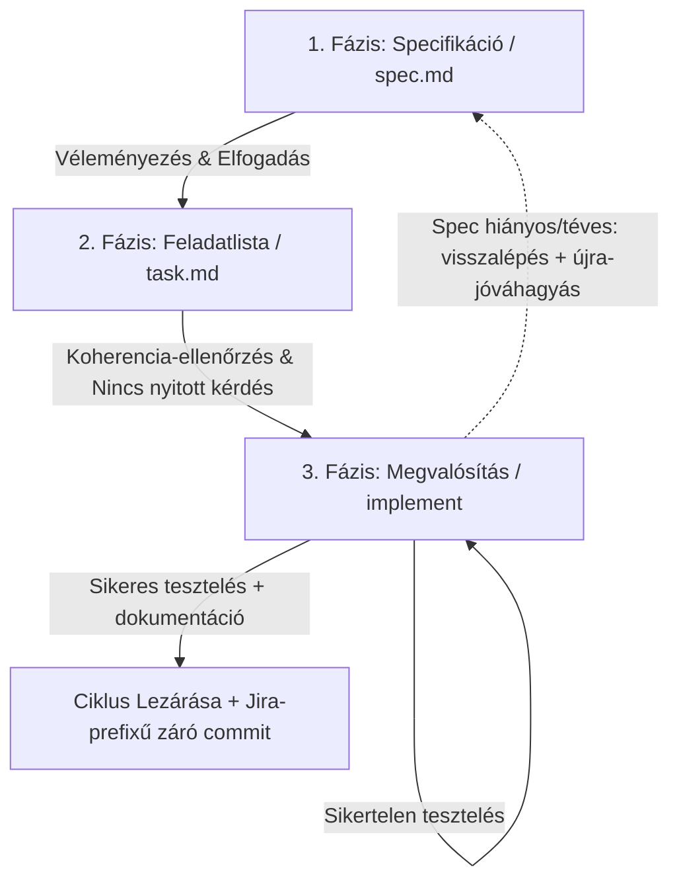

# SDD (Spec-Driven Development) — Egyszerűsített (Lightweight) Flow

Ez a dokumentum a projekt **egyszerűsített, háromfázisú** SDD (Spec-Driven Development) flow-ját írja le, kis és jól körülhatárolt feladatokhoz. Ezt a mintát kövesse az AI asszisztens (Agent) akkor, amikor a feladat mérete nem indokolja a teljes (00–09 fázisú) berki spec ciklust.

---

## Mikor ezt a flow-t, és mikor a teljes berki spec-et?

Az Agent a feladat átvétele után **először döntsön a megfelelő flow-ról**, és a döntését indokolja röviden a Felhasználónak.

**Ezt az egyszerűsített flow-t használd, ha a feladat:**
*   3-4 lépésben, egy ülé/menetben megbízhatóan megoldható;
*   kis, jól körülhatárolt scope-ú — pl. **konfiguráció összeállítása vagy módosítása**, **egyszerűbb script megírása**, kisebb hibajavítás, lokális finomhangolás;
*   nem érint egyszerre több komponenst, és nincs összetett, előre tervezést igénylő architektúrális döntés.

**Lépj át a teljes berki spec folyamatra (a [01-add-cycles](01-add-cycles.md) skill-lel indítva), ha menet közben kiderül, hogy a feladat:**
*   nagyobb kódírást igényel (új funkció, több fájlon átívelő logika, nem triviális üzleti szabályok);
*   több komponenst, integrációs pontot vagy adatmodellt érint;
*   önállóan tesztelhető, vertikálisan vágható ciklus(ok)ra bontható;
*   összetett tervezést, kockázatos refaktort vagy alapos kereszt-fázisos konzisztencia-ellenőrzést kíván.

Ilyenkor az Agent **ne erőltesse a háromfázisú flow-t**: állítsa meg a munkát, jelezze a Felhasználónak, hogy a feladat túlnő ezen a flow-n, és **javasolja** a teljes folyamatot:

> *„Ez a feladat a vártnál nagyobb / összetettebb (pl. több komponenst érint, nagyobb kódírást igényel). Javaslom, hogy ne az egyszerűsített flow-t használjuk, hanem a teljes berki spec folyamatot, amely a `01-add-cycles` skill-lel indul (roadmap + dedikált ciklus). Folytathatom úgy?"*

A flow-váltás döntése mindig a Felhasználóé; te javasolsz és indokolsz, de nem váltasz önkényesen.

---

## Gyors lépéssor (a teljes folyamat dióhéjban)

> Ez a „happy path". A részleteket lentebb találod; ha elbizonytalanodsz, ide térj vissza.

1. **Branch + flow-méret.** Ellenőrizd a git ágat (ha kell, hozz létre feature ágat). Döntsd el: tényleg kicsi a feladat? Ha nem → javasold a teljes berki spec-et (`01-add-cycles`), és állj meg.
2. **Ciklusmappa.** Keresd meg a következő szabad ciklusszámot, javasolj nevet, kérj jóváhagyást, majd hozd létre: `specs/cycle-NN-<név>/`.
3. **1. fázis — `spec.md`.** Írd meg a specifikációt (cél, paraméterek, tesztstratégia, README-terv). **⛔ ÁLLJ MEG**, és várd meg a Felhasználó explicit jóváhagyását.
4. **2. fázis — `task.md`.** Bontsd pipálható lépésekre (a tesztelés a dokumentáció-frissítés elé kerüljön). **⛔ ÁLLJ MEG**, és várd meg az explicit jóváhagyást.
5. **3. fázis — implementáció.** Dolgozz a `task.md` szerint, pipálj valós időben, futtass tesztet. Ha spec-hiba derül ki → vissza az 1. fázisba + újra-jóváhagyás.
6. **Lezárás.** Tesztek zöldek + dokumentáció frissítve + Felhasználóval egyeztetve → záró commit (Jira-prefixszel).

A **⛔** jelnél SOHA ne lépj tovább a Felhasználó kifejezett „igen"-je nélkül.

---

## Telepítés és aktiválás (skillként)

Ahhoz, hogy az Agent ezt a módszertant valódi skillként ismerje fel és automatikusan alkalmazza, a fájlnak a megfelelő skill-könyvtárban kell lennie:

*   **Hely:** A skillt a `.claude/skills/sdd-skill/SKILL.md` útvonalon kell elhelyezni (a repo gyökeréhez vagy a felhasználói `~/.claude/skills/` könyvtárhoz képest). A mappa neve és a frontmatter `name` mezője egyezzen meg (`sdd-skill`).
*   **Frontmatter:** A fájl elején lévő `name` és `description` mezők kötelezőek; a `description` alapján dönti el az Agent, hogy mikor releváns a skill behívása.
*   **Aktiválás:** A skill automatikusan aktiválódik, amikor a feladat illeszkedik a leíráshoz (új ciklus indítása, `spec.md`/`task.md` készítés, megvalósítás). Kézzel a `/sdd-skill` paranccsal is meghívható.
*   **Karbantartás:** Ez a fájl a módszertan kanonikus forrása. Ha több komponens (pl. több repo) használja, kerülni kell a kézi másolást; szinkronizálással vagy szimlinkkel tartsd egységben, hogy a változatok ne csússzanak szét.

---

## 1. Alapelvek és könyvtárszerkezet

*   **Ciklusok (Cycles):** Minden egyes önálló feladat, funkció vagy fejlesztési szakasz egy dedikált mappában történik, az alábbi elnevezési sémát követve:
    `cycle-XX-<név>` (Pl. `cycle-01-database-management`, `cycle-02-logging-improvement`).
*   **Dokumentumvezérelt fejlesztés:** Kódot írni vagy módosítani szigorúan tilos addig, amíg a tervezési és felbontási fázisok le nem zárultak.
*   **A README.md karbantartása:** A fejlesztések során a projekt fő [README.md](../README.md) fájljának naprakészen tartása és frissítése nem opcionális lépés; ennek mindig a tervezés (`spec.md`) és a feladatlista (`task.md`) részét kell képeznie.
*   **Relatív elérési utak és hivatkozások:** Mind a kódban (scriptek, konfigurációk), mind a dokumentációban (specifikációk, README fájlok, feladatlisták) **szigorúan tilos abszolút fájlútvonalak** (pl. `/home/...`) vagy abszolút markdown linkek (`file:///home/...`) használata. Minden hivatkozásnak és elérési útnak a projekt gyökeréhez vagy az aktuális dokumentumhoz képest relatívnak kell lennie.
*   **Dokumentáció nyelve:** A ciklus-dokumentumok (`spec.md`, `task.md`) és a hozzájuk tartozó leírások nyelve a projekt konvenciójához igazodva **magyar**, a konzisztencia érdekében. A kódban használt azonosítók, kapcsolók és technikai kifejezések ettől függetlenül maradhatnak angolul.

---

## 2. Új fejlesztési ciklus indítása

Amikor új fejlesztési ciklust kell kezdeni, az alábbi lépések szerint járj el. Hosszabb vagy összetettebb ciklusoknál a Felhasználó a `/goal` paranccsal kérheti, hogy extra alapossággal és autonómiával dolgozz.

1. **Git környezet előkészítése (feature branch):** A ciklus indítása előtt ellenőrizd az aktuális git ágat és a munkaterületet:
   * **Ha a `master` ágon vagy:** Kérd be a Felhasználótól a Jira feladat azonosítót (pl. `OCTDCBS-18553`) és egy rövid branch-összefoglalót (pl. `wildcard-cert`). Ezután hozd létre az új feature ágat és válts rá: `feature/<jira-azonosító>-<branch-summary>`.
   * **Ha már `feature/...` ágon vagy:** Ellenőrizd `git status`-szal, hogy tiszta-e a munkaterület. Ha vannak commitolatlan változtatások:
     * Figyelmeztesd a Felhasználót, hogy a ciklus előtt érdemes mindent commitolni.
     * Ha jóváhagyja, kérd be a commit üzenetet, és commitolj. A commit üzenet a Jira azonosítóval kezdődjön (pl. `OCTDCBS-18553: <üzenet>`).
2. **Cél megadása és interjú (grill = addig kérdezel, amíg minden tiszta):** A Felhasználó leírja, miről szól a ciklus (milyen funkciót, javítást vagy módosítást kell megvalósítani). Kérdezz addig, amíg minden szükséges információ a kezedben van a specifikáció megírásához.
   * **Flow-méret ellenőrzés (kötelező):** Az interjú alatt végig mérlegeld, hogy a feladat tényleg illik-e az egyszerűsített flow-ra (lásd a „Mikor ezt a flow-t…" szekciót). Ha túlnő rajta (nagyobb kódírás, több komponens, összetett tervezés), **állj meg és javasold a teljes berki spec folyamatot** (`01-add-cycles`), mielőtt belekezdenél a `spec.md`-be.
3. **Ciklusszám megkeresése:** Nézd meg a `specs/` könyvtár tartalmát, azonosítsd a meglévő ciklusmappákat, és határozd meg a következő szabad ciklusszámot (két számjegy, vezető nullával: `01`, `02`, `03` …).
4. **Névjavaslat:** A leírás és az interjú alapján javasolj nevet az új ciklusnak (kisbetűs, kötőjeles, pl. `add-health-check` vagy `fix-tls-handshake`), és vele a teljes mappanevet (pl. `cycle-03-add-health-check`). A mappanév mindig a `cycle-XX-<név>` sémát kövesse (kötőjellel a `cycle` szó után).
5. **Jóváhagyás:** A Felhasználó jóváhagyja vagy módosítja a javasolt nevet és sorszámot.
6. **Inicializálás:** A jóváhagyás után hozd létre az új ciklusmappát a `specs/` alatt (pl. `specs/cycle-03-add-health-check/`), és kezdd el benne a `spec.md`-t (1. fázis). A `spec.md` megírásához kötelezően használd fel az interjú során gyűjtött teljes kontextust.

---

## 3. A Háromfázisú SDD Munkafolyamat

A fejlesztési ciklus szigorúan három egymást követő fázisra tagozódik. A fázisok között nincs átjárás előreugrással.

### 1. Fázis: Specifikáció (`spec.md`)
Ebben a fázisban tisztázzuk a követelményeket és rögzítjük a pontos technikai tervet.
*   **Lépés:** Hozz létre egy `spec.md` fájlt az aktuális `cycle-XX-<név>` mappában.
*   **Ágens-támogatás (opcionális) — `researcher`:** Ha a feladat meglévő kódbázist érint, és nem nyilvánvaló, mely fájlokat kell módosítani vagy mely dokumentumokat kell frissíteni, indítsd el a [`researcher`](../agents/researcher.md) ágenst (Task tool subagent-ként, read-only). Tömör listát ad vissza az érintett forrásfájlokról (`path:sor–sor`) és a frissítendő dokumentumokról — a fő ágens kontextusablakát kímélve. Tiszta zöldmezős scriptnél vagy egyszerű konfigurációnál ez kihagyható.
*   **Tartalom:** 
    *   Részletes célkitűzés és működési logika.
    *   Változók, konfigurációs paraméterek, elnevezési sémák.
    *   Tervezett kódmódosítások (pszeudokód vagy kódrészletek szintjén).
    *   **Kötelező Tesztelési Stratégia:** Részletes terv arra vonatkozóan, hogyan teszteljük az aktuálisan bevezetendő funkciókat. Ha a tesztelési mód nem egyértelmű, az Agent köteles kérdezni a felhasználótól és egyeztetni a tesztelési megközelítést.
    *   A [README.md](../README.md) frissítésének terve.
*   **Szabály (Kritikus):**
    *   Ebben a fázisban semmilyen projektfájlt (kód, meglévő dokumentáció) ne módosíts.
    *   **⛔ ÁLLJ MEG a fázis végén.** A 2. fázist (a `task.md`-t) **csak akkor kezdd el, ha a Felhasználó kifejezetten (explicit módon) jóváhagyta** a `spec.md`-t. Jóváhagyás nélkül ne lépj tovább.

### 2. Fázis: Feladatlista (`task.md`)
A jóváhagyott specifikáció alapján elkészítjük a lépésről lépésre követhető feladatlistát.
*   **Lépés:** Hozz létre egy `task.md` fájlt az aktuális `cycle-XX-<név>` mappában.
*   **Tartalom:**
    *   Pipálható feladatlista (Markdown checkboxok: `- [ ]`).
    *   **A Tesztelés helye a sorrendben:** A tesztelési lépéseket (a specifikált tesztelési stratégia alapján) explicit fel kell venni a `task.md` listájába, mégpedig a dokumentáció frissítése (pl. `README.md` szerkesztés) **elé**.
    *   Lépésekre bontott feladatok a fájlok létrehozására, szerkesztésére, a tesztelés lefolytatására, valamint a dokumentációk frissítésére.
*   **Ágens-támogatás (opcionális) — `analyzer`:** Ha a `spec.md` és a `task.md` viszonya bonyolultabb (több követelmény, könnyen kicsúszó lefedettség), egy könnyű konzisztencia-ellenőrzéshez indítható az [`analyzer`](../agents/analyzer.md) ágens (read-only). A teljes flow-ban a spec/plan/tasks hármast vizsgálja; itt a `spec.md` ↔ `task.md` párra szűkítve fut (a `plan.md` ennél a flow-nál nem létezik), és lefedettségi réseket, kétértelműségeket, alulspecifikációt jelez vissza. Kis, egyértelmű task-listánál fölösleges — ne erőltesd.
*   **Szabály (Kritikus):**
    *   A `task.md`-t ne kezdd el a `spec.md` jóváhagyása előtt.
    *   A 3. fázisra (implementáció) csak akkor lépj, ha a `spec.md` és a `task.md` **teljesen koherens**, és nincs nyitott kérdés közted és a Felhasználó között.
    *   **⛔ ÁLLJ MEG a fázis végén.** Az implementációt (3. fázis) **csak a `task.md` explicit felhasználói jóváhagyása után** kezdd el. Jóváhagyás nélkül ne lépj tovább.

### 3. Fázis: Megvalósítás (Implementáció)
Ebben a fázisban történik a tényleges kódolás a feladatlista alapján.
*   **A `task.md` az egyetlen forrás:** kizárólag a `task.md` szerint dolgozz. Ne térj el tőle, és ne hagyj ki lépést.
*   **Valós idejű pipálás:** ahogy egy feladatsorral végeztél, **azonnal pipáld ki (`- [x]`)** a `task.md`-ben, még a következő feladat előtt.
*   **Visszamenőleges pipálás:** ha egy korábbi lépés pipálása megszakadt vagy kimaradt, pótold azonnal.
*   **Sikertelen teszt kezelése:** ha bármelyik teszt elbukik, lépj vissza az implementációs lépésekhez, javíts, majd **futtasd újra az ÖSSZES tesztet** (nem csak a hibásat) a regresszió elkerülésére.
*   **Fázis-visszalépés (spec-hiba esetén):** ha menet közben kiderül, hogy a `spec.md` hiányos vagy téves, **tilos csendben eltérned** tőle. Ehelyett:
    1. Állj meg.
    2. Lépj vissza az 1. fázisba, és frissítsd a `spec.md`-t (és ha kell, a `task.md`-t).
    3. **⛔ Kérd be újra a Felhasználó explicit jóváhagyását**, és csak utána folytasd a kódolást.
    *   Előreugrani továbbra sem szabad; visszalépni a spec pontosításáért viszont kötelező, ha a terv és a valóság elválik.
*   **Ágens-támogatás (opcionális) — `reviewer`:** A záró commit **előtt** indítható egy gyors kód-review a [`reviewer`](../agents/reviewer.md) ágenssel (read-only): átnézi a diff-et a konvenciók, a scope-fegyelem, a hibakezelés és a spec-megfelelés szempontjából, és `Must Fix` / `Suggestion` listát ad vissza. A teljes flow-tól eltérően itt **nincs automatizált review-önjavító hurok**: a `Must Fix` találatokat az Agent egyszerűen javítja a lezárás előtt, a `Suggestion`-öket pedig jelzi a Felhasználónak. Kis, alacsony kockázatú változásnál (pl. egy konfigurációs sor) ez kihagyható.
*   **Befejezési feltétel / Ciklus Lezárása:** Az implementáció és a teljes ciklus **kizárólag akkor tekinthető késznek és lezártnak**, ha:
    1. A meghatározott tesztek hiba nélkül lefutottak.
    2. A kapcsolódó dokumentáció (pl. `README.md`) frissítésre került.
    3. Az elért eredményeket a Felhasználóval ellenőriztük és egyeztettük.
    4. **A ciklust lezáró commit elkészült.** A commit üzenetnek kötelezően a Jira feladat azonosítójával kell kezdődnie (pl. `OCTDCBS-18553: <üzenet>`).

---

## 4. Felhasznált specialista ágensek

Az egyszerűsített flow szándékosan **kevés** specialista ágenst használ, és mindegyiket **opcionálisan** — a kis feladatok többségénél a fő ágens önállóan, subagent nélkül is elvégzi a munkát.

> **Gyengébb/olcsóbb modellel:** ha bizonytalan vagy, **nyugodtan hagyd ki mind a három opcionális ágenst** — a flow nélkülük is teljes. Magának a subagentek vezénylésének is van hibakockázata, ezért kis feladatnál inkább dolgozz közvetlenül, és csak akkor nyúlj ágenshez, ha egyértelműen segít.

A használható ágensek (mind a [`prompts/agents/`](../agents/) mappából):

| Ágens | Hol (fázis) | Mit ad | Mikor érdemes |
|---|---|---|---|
| [`researcher`](../agents/researcher.md) | 1. fázis (spec.md) | Érintett forrásfájlok (`path:sor–sor`) + frissítendő dokumentumok tömör listája (read-only) | Meglévő kódbázis módosításakor, ha nem nyilvánvaló az érintett fájlkör |
| [`analyzer`](../agents/analyzer.md) | 2. fázis (task.md) | `spec.md` ↔ `task.md` konzisztencia-diagnózis: lefedettségi rés, kétértelműség, alulspecifikáció (read-only) | Több követelményes, könnyen kicsúszó task-listánál |
| [`reviewer`](../agents/reviewer.md) | 3. fázis (záró commit előtt) | Diff code review: konvenciók, scope, hibakezelés, spec-megfelelés → `Must Fix` / `Suggestion` (read-only) | Nem triviális kódváltozásnál, a commit előtti minőségi kapuként |

**Amit ez a flow NEM használ (és miért):**
*   **Fixer-wrapperek** (`spec-fixer`, `plan-fixer`, `tasks-fixer`, `implement-fixer`, `review-fixer`): ezek a teljes flow **önjavító hurkainak** belépői (05-analyze / 07-validate / 09-review). Itt nincs automatizált önjavító hurok — a hibákat a fő ágens közvetlenül, inline javítja. A `plan-fixer` ráadásul `plan.md`-t feltételez, ami ennél a flow-nál nem létezik.
*   **`doc-sync-planner`**: a teljes flow `docs-generated/` élő dokumentáció-szinkronjának (08-doc-sync) tervkészítője. Az egyszerűsített flow-ban a dokumentáció frissítése a 3. fázis része (pl. `README.md`), nincs külön generált doc-réteg.

Ha a feladat olyan nagy, hogy ezek a hurkok és ágensek valóban indokoltak lennének, az általában annak a jele, hogy **a teljes berki spec folyamatra kell váltani** (lásd a „Mikor ezt a flow-t…" szekciót).

---

## 5. Best Practice & Tapasztalatok (Lessons Learned)

1.  **Szintaxis-ellenőrzés:** Bármilyen scriptmódosítás után mindig fusson le a szintaktikai teszt (pl. `bash -n script.sh`), mielőtt a logikai tesztek elkezdődnek.
2.  **Kezelt hibák:** Ha külső erőforráshoz (pl. adatbázis) kapcsolódik a kód, a kapcsolódási hibák mindig legyenek egyedileg lekezelve, és a hibaüzenet mutasson a konfigurációs állományra.
3.  **Környezeti izoláció:** A dinamikus port-forwarding vagy egyéb alacsony szintű hálózati beállítások paramétereit mindig a konfigurációs fájlokból (pl. `include/config.sh`) olvassa a kód, soha ne legyenek beégetve.
4.  **Relatív fájlútvonalak:** A dokumentációban (specifikációk, feladatlisták, README-k) a hivatkozások és elérési utak mindig relatívak legyenek. A termék scriptek (pl. `deploy.sh`, `certcheck.sh`) belső működésében a `cd` parancsok használata megengedett.
5.  **Takarítási biztonság:** A tesztelés során (különösen a tesztek végén végzett takarítás/cleanup folyamatban) szigorúan tilos olyan állományok, könyvtárak vagy külső szerverkomponensek törlése, amelyeket nem maga az aktuális tesztfutás hozott létre. Mindig ügyelni kell arra, hogy a takarítási logika pontosan célzott legyen, és ne érintsen létező projektelemeket vagy megosztott erőforrásokat.

